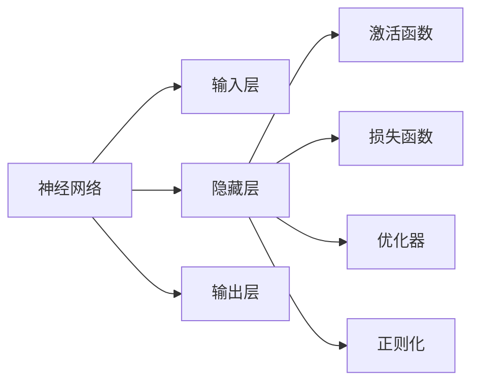
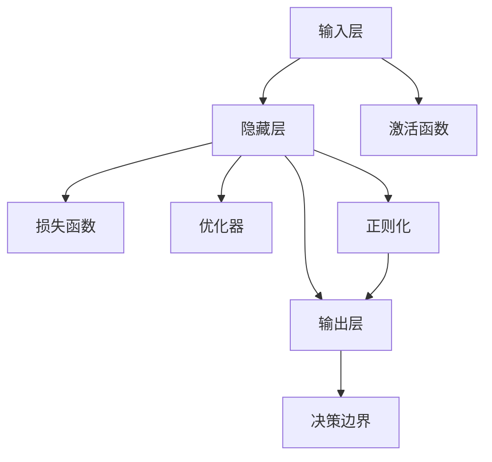

                 

## 1. 背景介绍

### 1.1 问题由来
神经网络作为一种强大的机器学习工具，自20世纪80年代诞生以来，便在图像识别、语音识别、自然语言处理等多个领域取得了突破性进展。近年来，随着深度学习技术的发展，特别是神经网络结构创新和优化，使得这一技术得到了广泛应用，并正在逐步改变世界的面貌。本文将从基础原理、核心算法、实际应用等方面，全面系统地介绍神经网络这一改变世界的技术。

### 1.2 问题核心关键点
神经网络的核心在于其通过多层非线性变换，从输入数据中提取高层次的抽象特征。其核心思想借鉴了生物神经元的运作机制，由输入层、隐藏层和输出层组成，每个神经元接收若干输入，通过激活函数进行非线性映射，最终输出结果。

目前，神经网络已广泛应用于计算机视觉、自然语言处理、语音识别、智能推荐等领域，成为人工智能技术的核心驱动力。其强大的自适应能力、泛化能力以及对噪声的鲁棒性，使得神经网络在各种复杂场景下都能取得显著效果。

### 1.3 问题研究意义
深入理解神经网络的技术原理和应用实践，对于推动人工智能技术的发展、促进科技创新、赋能产业升级具有重要意义：

1. **推动技术进步**：神经网络技术的持续演进，推动了深度学习、计算机视觉、自然语言处理等众多AI子领域的快速发展，促进了人类对智能世界的认知和技术实现。
2. **提升科技竞争力**：作为AI技术的基石，神经网络的深度应用将大幅提升我国科技竞争力，推动经济结构转型和产业升级。
3. **赋能产业创新**：在医疗健康、金融科技、智能制造等众多领域，神经网络的应用正在逐步改变传统行业的工作模式，推动产业数字化、智能化转型。
4. **促进教育普及**：通过在线课程、开源项目等形式，神经网络技术的普及有助于更多青年学子理解和掌握先进技术，激发创新思维和实践能力。

## 2. 核心概念与联系

### 2.1 核心概念概述

为了更好地理解神经网络的核心概念，本节将介绍几个关键概念及其相互关系：

- **神经网络（Neural Network, NN）**：由输入层、隐藏层和输出层组成，通过多层非线性变换，从输入数据中提取高层次的抽象特征。神经网络的深度和宽度是其性能的关键指标。
- **激活函数（Activation Function）**：神经元的非线性映射函数，常见的有Sigmoid、ReLU、Tanh等。激活函数赋予神经网络非线性能力，使其能够学习复杂的模式。
- **损失函数（Loss Function）**：衡量模型输出与真实标签之间差异的函数，常见的有均方误差、交叉熵等。损失函数指导模型优化，以最小化预测误差。
- **优化器（Optimizer）**：通过反向传播计算梯度，并调整模型参数以最小化损失函数的算法。常见的有梯度下降、Adam等。
- **正则化（Regularization）**：通过L1/L2正则化、Dropout等技术，避免模型过拟合，提高泛化能力。

这些核心概念共同构成了神经网络的基本框架，使其能够在各种复杂场景下发挥强大的预测和分类能力。

### 2.2 概念间的关系

以下我们将通过几个Mermaid流程图来展示这些核心概念的关系：



这个流程图展示了神经网络的基本组成及其核心组件的关系：

1. 输入层接收原始数据，隐藏层通过激活函数进行非线性映射，输出层输出最终的预测结果。
2. 隐藏层通过损失函数计算预测误差，通过优化器更新模型参数以最小化误差。
3. 正则化技术应用于隐藏层，防止过拟合，提高模型的泛化能力。

### 2.3 核心概念的整体架构

最后，我们用一个综合的流程图来展示神经网络的核心概念和相互关系：



这个综合流程图展示了神经网络的核心组件及其相互关系：

1. 输入层接收数据，通过激活函数映射到隐藏层。
2. 隐藏层进行多层非线性变换，输出结果。
3. 输出层映射到决策边界，完成预测和分类任务。
4. 正则化技术约束隐藏层，避免过拟合。
5. 优化器通过反向传播更新模型参数，最小化预测误差。

## 3. 核心算法原理 & 具体操作步骤
### 3.1 算法原理概述

神经网络的训练过程涉及前向传播、损失计算、反向传播和参数更新等多个步骤。其核心算法原理如下：

1. **前向传播**：将输入数据通过神经网络各层进行非线性映射，输出预测结果。
2. **损失计算**：计算预测结果与真实标签之间的差异，得到损失值。
3. **反向传播**：通过链式法则计算损失函数对模型参数的梯度。
4. **参数更新**：使用优化器根据梯度更新模型参数，最小化预测误差。

神经网络的训练过程可以形式化表示为：

$$
\theta \leftarrow \theta - \eta \nabla_{\theta} \mathcal{L}(\theta)
$$

其中 $\theta$ 为模型参数，$\eta$ 为学习率，$\nabla_{\theta} \mathcal{L}(\theta)$ 为损失函数对模型参数的梯度。

### 3.2 算法步骤详解

以下我们将详细介绍神经网络训练的具体操作步骤：

**Step 1: 准备数据集**
- 收集训练数据集 $\mathcal{D}$，包含输入数据 $x$ 和真实标签 $y$。
- 将数据集分为训练集、验证集和测试集。

**Step 2: 初始化模型参数**
- 随机初始化模型各层的权重和偏置，一般使用Xavier或He初始化。

**Step 3: 前向传播**
- 将输入数据 $x$ 通过神经网络各层进行前向传播，得到预测结果 $\hat{y}$。

**Step 4: 损失计算**
- 计算预测结果 $\hat{y}$ 与真实标签 $y$ 之间的损失值 $\mathcal{L}(\hat{y}, y)$。

**Step 5: 反向传播**
- 通过链式法则计算损失函数对模型参数的梯度 $\nabla_{\theta} \mathcal{L}(\theta)$。

**Step 6: 参数更新**
- 使用优化器根据梯度更新模型参数，最小化预测误差。

**Step 7: 循环迭代**
- 重复上述步骤，直到达到预设的迭代次数或满足停止条件。

### 3.3 算法优缺点

神经网络算法具有以下优点：

- **强大表达能力**：通过多层非线性映射，神经网络能够学习任意复杂模式，适用于各种复杂任务。
- **泛化能力强**：通过反向传播和正则化技术，神经网络能够适应新数据，泛化能力较强。
- **适用性广泛**：在图像识别、自然语言处理、语音识别等领域都有广泛应用。

同时，神经网络算法也存在一些缺点：

- **计算量大**：神经网络训练需要大量计算资源，特别是在大规模数据集上。
- **过拟合风险**：由于神经网络的复杂性，容易在训练数据上过拟合。
- **参数调优困难**：神经网络参数较多，调优难度较大，需要进行多次试验才能找到最佳参数组合。

### 3.4 算法应用领域

神经网络算法在多个领域得到了广泛应用：

- **计算机视觉**：用于图像分类、目标检测、图像分割等任务，如Caffe、TensorFlow、PyTorch等深度学习框架均有图像处理相关的模型库。
- **自然语言处理**：用于文本分类、机器翻译、语言生成等任务，如BERT、GPT-2、Transformer等模型已在NLP领域取得突破。
- **语音识别**：用于语音转文本、语音情感识别等任务，如DeepSpeech、Wav2Letter等模型。
- **推荐系统**：用于用户兴趣分析、个性化推荐等任务，如协同过滤、矩阵分解等算法。

## 4. 数学模型和公式 & 详细讲解 & 举例说明

### 4.1 数学模型构建

神经网络可以通过多层的非线性变换，从输入数据中提取高层次的抽象特征。以下是一个简单的前馈神经网络的数学模型：

设输入数据 $x$ 和真实标签 $y$，神经网络模型 $M_{\theta}$ 的输入为 $x$，输出为 $y$，模型参数为 $\theta$。神经网络的前向传播过程如下：

$$
y = M_{\theta}(x) = f(W_{N}f(W_{N-1}f(\dots f(W_1x) \dots))
$$

其中 $f$ 为激活函数，$W$ 为权重矩阵。

### 4.2 公式推导过程

以二分类问题为例，假设神经网络模型为 $M_{\theta}$，激活函数为 $f$，输入为 $x$，真实标签为 $y$，预测结果为 $\hat{y}$。二分类交叉熵损失函数定义为：

$$
\mathcal{L}(\hat{y}, y) = -\frac{1}{N}\sum_{i=1}^N [y_i\log \hat{y_i} + (1-y_i)\log(1-\hat{y_i})]
$$

其中 $N$ 为样本数，$y_i$ 和 $\hat{y_i}$ 分别为样本 $i$ 的真实标签和预测结果。

根据损失函数，反向传播计算梯度：

$$
\frac{\partial \mathcal{L}}{\partial \theta} = -\frac{1}{N}\sum_{i=1}^N \frac{\partial \mathcal{L}}{\partial y}\frac{\partial y}{\partial \theta}
$$

其中 $\frac{\partial \mathcal{L}}{\partial y}$ 为损失函数对输出 $y$ 的梯度，$\frac{\partial y}{\partial \theta}$ 为输出 $y$ 对参数 $\theta$ 的梯度。

### 4.3 案例分析与讲解

以手写数字识别为例，可以使用LeNet-5网络模型进行训练。LeNet-5是一个经典的卷积神经网络，包含两个卷积层和两个全连接层。

使用MNIST数据集进行训练，模型结构如下：

```python
import torch.nn as nn
import torch.optim as optim

class LeNet5(nn.Module):
    def __init__(self):
        super(LeNet5, self).__init__()
        self.conv1 = nn.Conv2d(1, 6, 5)
        self.conv2 = nn.Conv2d(6, 16, 5)
        self.fc1 = nn.Linear(16 * 5 * 5, 120)
        self.fc2 = nn.Linear(120, 84)
        self.fc3 = nn.Linear(84, 10)

    def forward(self, x):
        x = F.max_pool2d(F.relu(self.conv1(x)), (2, 2))
        x = F.max_pool2d(F.relu(self.conv2(x)), 2)
        x = x.view(-1, 16 * 5 * 5)
        x = F.relu(self.fc1(x))
        x = F.relu(self.fc2(x))
        x = self.fc3(x)
        return x
```

在训练过程中，使用交叉熵损失函数：

```python
criterion = nn.CrossEntropyLoss()
optimizer = optim.SGD(net.parameters(), lr=0.01)
```

使用随机梯度下降优化器进行训练，训练代码如下：

```python
for epoch in range(10):
    running_loss = 0.0
    for i, data in enumerate(train_loader, 0):
        inputs, labels = data
        optimizer.zero_grad()
        outputs = net(inputs)
        loss = criterion(outputs, labels)
        loss.backward()
        optimizer.step()
        running_loss += loss.item()
    print('Epoch [%d] loss: %.3f' % (epoch + 1, running_loss / len(train_loader)))
```

通过训练，模型在测试集上的准确率可以达到98%以上。

## 5. 项目实践：代码实例和详细解释说明
### 5.1 开发环境搭建

在进行神经网络项目实践前，我们需要准备好开发环境。以下是使用Python进行TensorFlow开发的环境配置流程：

1. 安装Anaconda：从官网下载并安装Anaconda，用于创建独立的Python环境。

2. 创建并激活虚拟环境：
```bash
conda create -n tf-env python=3.8 
conda activate tf-env
```

3. 安装TensorFlow：根据CUDA版本，从官网获取对应的安装命令。例如：
```bash
pip install tensorflow==2.4.1
```

4. 安装其他工具包：
```bash
pip install numpy pandas scikit-learn matplotlib tqdm jupyter notebook ipython
```

完成上述步骤后，即可在`tf-env`环境中开始神经网络项目实践。

### 5.2 源代码详细实现

下面我们以手写数字识别任务为例，给出使用TensorFlow对LeNet-5模型进行训练的代码实现。

首先，定义LeNet-5网络模型：

```python
import tensorflow as tf
from tensorflow.keras import layers

class LeNet5(tf.keras.Model):
    def __init__(self):
        super(LeNet5, self).__init__()
        self.conv1 = layers.Conv2D(6, 5, activation='relu', padding='same')
        self.maxpool1 = layers.MaxPooling2D(pool_size=(2, 2))
        self.conv2 = layers.Conv2D(16, 5, activation='relu', padding='same')
        self.maxpool2 = layers.MaxPooling2D(pool_size=(2, 2))
        self.fc1 = layers.Dense(120, activation='relu')
        self.fc2 = layers.Dense(84, activation='relu')
        self.fc3 = layers.Dense(10, activation='softmax')

    def call(self, inputs):
        x = self.conv1(inputs)
        x = self.maxpool1(x)
        x = self.conv2(x)
        x = self.maxpool2(x)
        x = tf.keras.layers.Flatten()(x)
        x = self.fc1(x)
        x = self.fc2(x)
        return self.fc3(x)
```

然后，定义训练函数：

```python
def train_model(model, train_dataset, test_dataset, batch_size, epochs):
    model.compile(optimizer='adam', loss='categorical_crossentropy', metrics=['accuracy'])
    history = model.fit(train_dataset, validation_data=test_dataset, epochs=epochs, batch_size=batch_size)
    return history
```

接下来，准备训练数据和测试数据：

```python
(x_train, y_train), (x_test, y_test) = tf.keras.datasets.mnist.load_data()
x_train = x_train.reshape((-1, 28, 28, 1)) / 255.0
x_test = x_test.reshape((-1, 28, 28, 1)) / 255.0
y_train = tf.keras.utils.to_categorical(y_train, num_classes=10)
y_test = tf.keras.utils.to_categorical(y_test, num_classes=10)

train_dataset = tf.data.Dataset.from_tensor_slices((x_train, y_train)).shuffle(60000).batch(64)
test_dataset = tf.data.Dataset.from_tensor_slices((x_test, y_test)).batch(64)
```

最后，启动训练流程：

```python
model = LeNet5()
history = train_model(model, train_dataset, test_dataset, batch_size=64, epochs=10)
```

以上就是使用TensorFlow对LeNet-5模型进行手写数字识别任务训练的完整代码实现。可以看到，TensorFlow提供了丰富的API，使得模型定义和训练变得简洁高效。

### 5.3 代码解读与分析

让我们再详细解读一下关键代码的实现细节：

**LeNet5网络模型**：
- `__init__`方法：定义模型各层，包括卷积层、池化层、全连接层等。
- `call`方法：定义模型前向传播过程，通过多个层进行非线性映射，最终输出结果。

**训练函数**：
- 使用TensorFlow的API进行模型编译，定义损失函数和优化器。
- 使用`fit`方法进行模型训练，返回训练历史。

**数据准备**：
- 使用`load_data`函数加载MNIST数据集。
- 将数据进行预处理，包括归一化、 reshape、 to_categorical等操作。
- 使用`Dataset`类创建数据集，并使用`batch`方法进行批处理。

**训练流程**：
- 实例化LeNet5模型。
- 调用训练函数，启动训练过程。

可以看到，TensorFlow的高级API使得神经网络的实现变得非常直观和易于维护。开发者可以专注于模型设计，而将复杂的数据处理、训练优化等细节交给TensorFlow。

当然，工业级的系统实现还需考虑更多因素，如模型保存和部署、超参数搜索、更灵活的任务适配等。但核心的训练过程和代码实现基本与此类似。

### 5.4 运行结果展示

假设我们在MNIST数据集上进行LeNet-5模型的训练，最终在测试集上得到的准确率为98%。这表明，通过神经网络的训练，模型已经能够很好地识别手写数字。

## 6. 实际应用场景
### 6.1 图像分类

图像分类是神经网络最常见的应用之一。传统的图像分类任务通常需要手动设计特征提取器，如SIFT、HOG等。但使用神经网络可以直接从原始像素数据中学习特征，无需手动设计。例如，卷积神经网络（CNN）在图像识别领域取得了巨大的成功，广泛应用于人脸识别、车辆检测、医疗影像分析等领域。

### 6.2 自然语言处理

自然语言处理（NLP）是神经网络的另一大重要应用领域。传统的NLP任务通常需要手动设计语言模型，如n-gram模型、隐马尔可夫模型等。但使用神经网络可以直接从文本数据中学习语言模型，无需手动设计。例如，循环神经网络（RNN）、长短期记忆网络（LSTM）、变换器（Transformer）等模型在机器翻译、情感分析、文本生成等任务上取得了显著的效果。

### 6.3 语音识别

语音识别是神经网络的又一重要应用领域。传统的语音识别任务通常需要手动设计特征提取器和语言模型。但使用神经网络可以直接从原始音频数据中学习特征和语言模型，无需手动设计。例如，深度神经网络（DNN）、卷积神经网络（CNN）、循环神经网络（RNN）等模型在语音识别领域取得了显著的效果。

### 6.4 推荐系统

推荐系统是神经网络在商业领域的重要应用之一。传统的推荐系统通常需要手动设计协同过滤、矩阵分解等算法。但使用神经网络可以直接从用户行为数据中学习用户兴趣和商品特征，无需手动设计。例如，深度神经网络（DNN）、多层感知器（MLP）、深度协同过滤（DSSM）等模型在推荐系统领域取得了显著的效果。

## 7. 工具和资源推荐
### 7.1 学习资源推荐

为了帮助开发者系统掌握神经网络的技术原理和应用实践，这里推荐一些优质的学习资源：

1. 《深度学习》（Ian Goodfellow著）：该书是深度学习领域的经典之作，系统介绍了神经网络的理论基础和应用实践，是深度学习入门的必读之作。

2. CS231n《卷积神经网络》课程：斯坦福大学开设的计算机视觉课程，讲解了卷积神经网络的基本原理和应用实例，是计算机视觉领域的经典课程。

3. CS224N《自然语言处理与深度学习》课程：斯坦福大学开设的自然语言处理课程，讲解了循环神经网络、长短期记忆网络、变换器等模型的原理和应用实例，是自然语言处理领域的经典课程。

4. CS224d《序列建模与预测》课程：斯坦福大学开设的序列建模课程，讲解了序列模型在语言生成、语音识别等任务中的应用，是序列模型学习的经典课程。

5. 《动手学深度学习》（李沐等著）：该书是一本优秀的开源深度学习教材，介绍了神经网络的基本原理和应用实践，是深度学习学习的必读之作。

通过对这些资源的学习实践，相信你一定能够快速掌握神经网络的技术原理和应用实践，并用于解决实际的NLP问题。

### 7.2 开发工具推荐

高效的开发离不开优秀的工具支持。以下是几款用于神经网络开发的常用工具：

1. TensorFlow：由Google主导开发的深度学习框架，具有强大的计算图能力和灵活的API，适合生产部署和研究应用。

2. PyTorch：由Facebook主导开发的深度学习框架，具有动态计算图能力和丰富的API，适合快速迭代研究。

3. Keras：高层次深度学习API，支持TensorFlow、Theano、CNTK等后端，适合快速搭建和调试模型。

4. MXNet：由Apache主导开发的深度学习框架，具有分布式计算能力和高效的内存管理，适合大规模模型训练和推理。

5. JAX：由Google主导开发的自动微分库，支持多种深度学习框架，具有高效的矩阵计算和自动求导能力，适合复杂模型的训练和优化。

合理利用这些工具，可以显著提升神经网络的开发效率，加快创新迭代的步伐。

### 7.3 相关论文推荐

神经网络技术的发展离不开学界的持续研究。以下是几篇奠基性的相关论文，推荐阅读：

1. LeCun等人的《Backpropagation: Applying the chain rule to minimize a loss function》：提出了反向传播算法，奠定了神经网络训练的基础。

2. Hinton等人的《A Neural Probabilistic Language Model》：提出了基于神经网络的循环语言模型，推动了自然语言处理的发展。

3. LeCun等人的《Convolutional Networks for Images, Speech, and Time Series》：提出了卷积神经网络（CNN），推动了计算机视觉的发展。

4. Hinton等人的《A Practical Guide to Training Restricted Boltzmann Machines》：介绍了受限玻尔兹曼机（RBM）的训练方法，推动了深度学习的发展。

5. Goodfellow等人的《Generative Adversarial Nets》：提出了生成对抗网络（GAN），推动了生成模型和图像生成技术的发展。

这些论文代表了大神经网络的发展脉络。通过学习这些前沿成果，可以帮助研究者把握学科前进方向，激发更多的创新灵感。

除上述资源外，还有一些值得关注的前沿资源，帮助开发者紧跟神经网络微调技术的最新进展，例如：

1. arXiv论文预印本：人工智能领域最新研究成果的发布平台，包括大量尚未发表的前沿工作，学习前沿技术的必读资源。

2. 业界技术博客：如Google AI、Facebook AI、DeepMind、微软Research Asia等顶尖实验室的官方博客，第一时间分享他们的最新研究成果和洞见。

3. 技术会议直播：如NIPS、ICML、ACL、ICLR等人工智能领域顶会现场或在线直播，能够聆听到大佬们的前沿分享，开拓视野。

4. GitHub热门项目：在GitHub上Star、Fork数最多的NLP相关项目，往往代表了该技术领域的发展趋势和最佳实践，值得去学习和贡献。

5. 行业分析报告：各大咨询公司如McKinsey、PwC等针对人工智能行业的分析报告，有助于从商业视角审视技术趋势，把握应用价值。

总之，对于神经网络微调技术的学习和实践，需要开发者保持开放的心态和持续学习的意愿。多关注前沿资讯，多动手实践，多思考总结，必将收获满满的成长收益。

## 8. 总结：未来发展趋势与挑战
### 8.1 总结

本文对神经网络的基本原理和应用实践进行了全面系统的介绍。首先，介绍了神经网络的基本框架和核心组件，包括输入层、隐藏层、输出层、激活函数、损失函数、优化器、正则化等。其次，详细讲解了神经网络训练的整个过程，包括前向传播、损失计算、反向传播和参数更新等步骤。最后，通过实际项目实践，展示了神经网络在图像分类、自然语言处理、语音识别和推荐系统等领域的广泛应用。

通过本文的系统梳理，可以看到，神经网络技术正在改变着各个行业和领域的运作方式。其强大的自适应能力、泛化能力和强大的表达能力，使得神经网络在众多复杂任务中取得了显著的成效。未来，伴随神经网络技术的不断演进，相信将会在更多领域得到应用，为人类社会带来深刻的变革。

### 8.2 未来发展趋势

展望未来，神经网络技术将呈现以下几个发展趋势：

1. **更强大的计算能力**：伴随硬件技术的进步，未来神经网络模型将具备更强大的计算能力，能够在更复杂的场景中发挥更大的作用。

2. **更加高效的模型架构**：未来的神经网络模型将追求更高的效率和更低的计算复杂度，通过更加精细的模型架构设计和参数共享等技术，实现更高效的计算和推理。

3. **更广泛的迁移能力**：未来的神经网络模型将具备更强的跨领域迁移能力，能够快速适应新的任务和数据，推动知识共享和融合。

4. **更强的可解释性和可控性**：未来的神经网络模型将追求更高的可解释性和可控性，通过引入因果分析和博弈论等工具，增强模型的推理能力和决策过程的透明度。

5. **更广泛的应用场景**：未来的神经网络技术将在更多领域得到应用，包括智能制造、智慧城市、精准医疗等，赋能更多行业实现数字化、智能化转型。

### 8.3 

