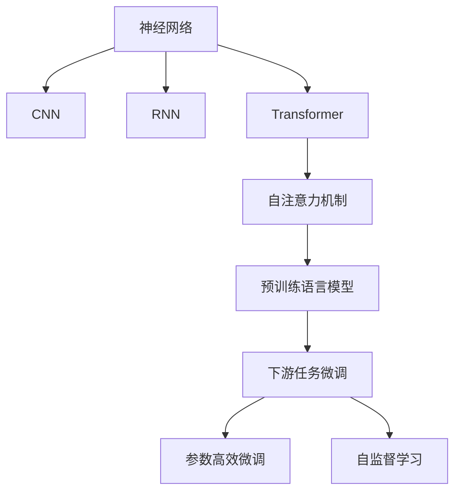
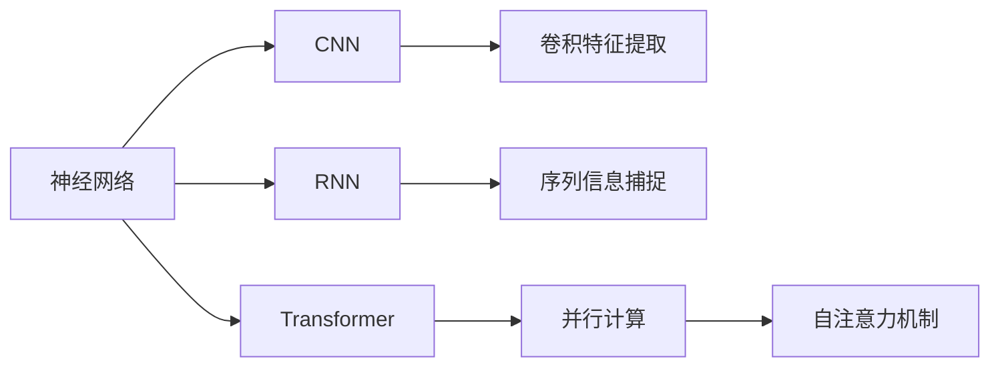
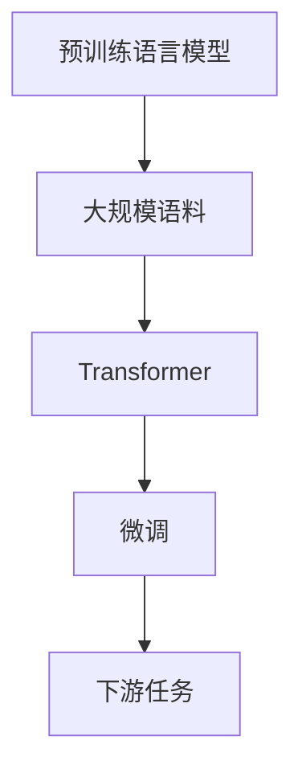
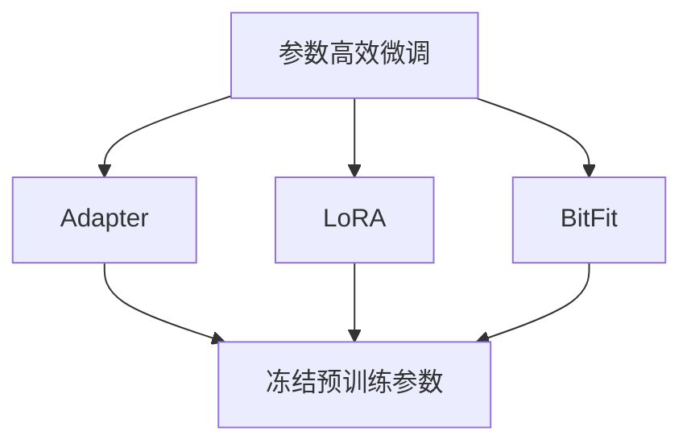
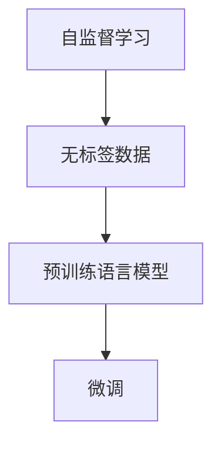
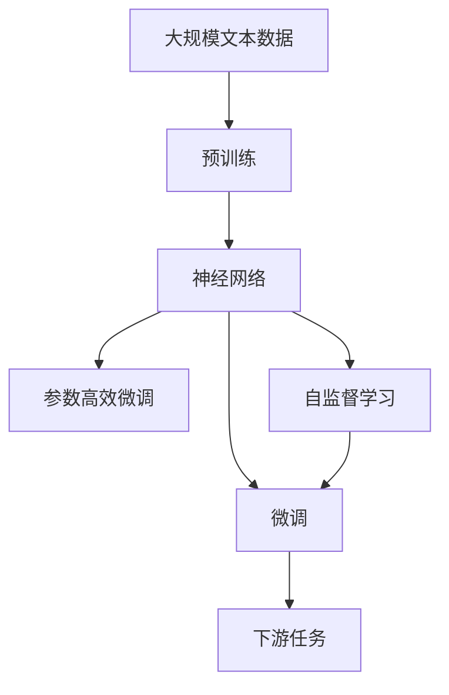

                 

# 神经网络：自然语言处理的新突破

> 关键词：神经网络,自然语言处理(NLP),深度学习,卷积神经网络(CNN),循环神经网络(RNN),Transformer,自注意力机制,预训练语言模型,大规模语料,模型泛化能力

## 1. 背景介绍

### 1.1 问题由来
在过去的几十年里，自然语言处理(Natural Language Processing, NLP)领域经历了巨大的变革，得益于深度学习技术的快速发展。传统的NLP方法基于手工设计的特征提取和规则制定，难以处理大规模、复杂多变的自然语言数据。而深度学习技术，特别是卷积神经网络(CNN)和循环神经网络(RNN)等方法，突破了传统的特征提取瓶颈，提升了NLP任务的性能。然而，这些方法在面对大规模语料处理时，依旧存在泛化能力不足的问题。

近年来，基于Transformer架构的自注意力机制(Attention Mechanism)成为NLP领域的新突破。Transformer架构的引入，使得模型能够更加高效地处理长序列数据，突破了传统RNN的序列长度限制。Transformer模型在大规模语料上的预训练，已经在大规模语言模型(Pre-trained Language Models, PLMs)的构建上取得了卓越的成果。本文聚焦于基于神经网络的自然语言处理技术，尤其是Transformer架构的深度学习模型，探讨其在大规模语料预训练和下游任务微调上的新突破。

### 1.2 问题核心关键点
神经网络在自然语言处理领域的新突破主要体现在以下几个方面：

1. **Transformer架构**：Transformer架构通过自注意力机制，使得模型能够高效地并行计算，突破了传统RNN的序列长度限制，成为当前NLP领域的主流架构。
2. **大规模语料预训练**：在大规模语料上进行预训练，使得模型能够学习到通用的语言表示，提升模型的泛化能力。
3. **下游任务微调**：将预训练模型作为初始化参数，通过下游任务的少量标注数据进行微调，使得模型适应特定任务。
4. **参数高效微调**：在微调过程中，只更新少量的模型参数，减少计算资源消耗。
5. **自监督学习**：利用无标签数据进行自监督学习，提升模型的学习效果。

这些关键技术共同构成了神经网络在NLP领域的新突破，推动了NLP技术的不断进步和应用。

### 1.3 问题研究意义
神经网络在自然语言处理领域的新突破，对于拓展NLP应用范围，提升下游任务性能，加速NLP技术的产业化进程具有重要意义：

1. 降低应用开发成本。基于预训练大模型进行微调，可以显著减少从头开发所需的数据、计算和人力等成本投入。
2. 提升模型效果。微调使得通用大模型更好地适应特定任务，在应用场景中取得更优表现。
3. 加速开发进度。standing on the shoulders of giants，微调使得开发者可以更快地完成任务适配，缩短开发周期。
4. 带来技术创新。微调范式促进了对预训练-微调的深入研究，催生了自监督学习、参数高效微调等新的研究方向。
5. 赋能产业升级。微调使得NLP技术更容易被各行各业所采用，为传统行业数字化转型升级提供新的技术路径。

## 2. 核心概念与联系

### 2.1 核心概念概述

为更好地理解神经网络在NLP领域的新突破，本节将介绍几个密切相关的核心概念：

- **神经网络(Neural Networks)**：一种由神经元(节点)组成的计算模型，通过多层非线性变换，实现对数据的复杂映射。
- **卷积神经网络(CNN)**：一种专门用于处理具有网格结构数据的神经网络，通过卷积操作提取局部特征。
- **循环神经网络(RNN)**：一种适用于处理序列数据的神经网络，通过循环结构捕捉序列中的上下文信息。
- **自注意力机制(Attention Mechanism)**：一种通过计算输入数据之间的相对重要度，动态调整信息流的机制。
- **Transformer架构**：一种基于自注意力机制的神经网络架构，通过并行计算优化模型性能。
- **预训练语言模型(Pre-trained Language Models, PLMs)**：在大规模无标签语料上进行预训练，学习通用的语言表示。
- **下游任务微调(Fine-Tuning)**：将预训练模型作为初始化参数，通过下游任务的少量标注数据进行微调，使得模型适应特定任务。
- **参数高效微调(Parameter-Efficient Fine-Tuning, PEFT)**：在微调过程中，只更新少量的模型参数，减少计算资源消耗。
- **自监督学习(Self-Supervised Learning)**：利用无标签数据进行自监督学习，提升模型的学习效果。

这些核心概念之间的逻辑关系可以通过以下Mermaid流程图来展示：



这个流程图展示了大语言模型的核心概念及其之间的关系：

1. 神经网络通过CNN和RNN处理序列数据，通过Transformer架构引入自注意力机制，提升了模型的性能。
2. 在大规模语料上进行预训练，得到预训练语言模型。
3. 通过下游任务的少量标注数据进行微调，得到适用于特定任务的模型。
4. 微调过程中，可以应用参数高效微调技术，减少计算资源消耗。
5. 利用自监督学习技术，在无标签数据上进一步提升模型效果。

这些核心概念共同构成了神经网络在NLP领域的新突破，使得模型能够更好地处理大规模自然语言数据，提升任务性能。

### 2.2 概念间的关系

这些核心概念之间存在着紧密的联系，形成了神经网络在NLP领域的完整生态系统。下面我们通过几个Mermaid流程图来展示这些概念之间的关系。

#### 2.2.1 神经网络的学习范式



这个流程图展示了大语言模型的三种主要学习范式：CNN用于处理具有网格结构的数据，RNN用于处理序列数据，Transformer通过自注意力机制进行并行计算，提升了模型性能。

#### 2.2.2 预训练与微调的关系



这个流程图展示了预训练语言模型的基本原理：在大规模语料上预训练，得到Transformer模型，然后在下游任务上进行微调，使得模型适应特定任务。

#### 2.2.3 参数高效微调方法



这个流程图展示了几种常见的参数高效微调方法，包括Adapter、LoRA和BitFit。这些方法的共同特点是冻结大部分预训练参数，只更新少量参数，从而提高微调效率。

#### 2.2.4 自监督学习在大语言模型中的应用



这个流程图展示了自监督学习在大语言模型中的应用：利用无标签数据进行预训练，得到预训练语言模型，然后在下游任务上进行微调。

### 2.3 核心概念的整体架构

最后，我们用一个综合的流程图来展示这些核心概念在大语言模型微调过程中的整体架构：



这个综合流程图展示了从预训练到微调，再到自监督学习的完整过程。神经网络在大规模语料上进行预训练，得到通用的语言表示。然后通过微调和参数高效微调，使得模型适应特定任务。最终，通过自监督学习，不断提升模型的泛化能力。

## 3. 核心算法原理 & 具体操作步骤
### 3.1 算法原理概述

基于神经网络的自然语言处理，本质上是通过神经网络模型对自然语言数据进行序列化的表示学习。其主要算法流程如下：

1. **数据预处理**：将自然语言文本转换为数值化的向量表示。通常通过分词、编码等操作将文本转化为模型能够处理的格式。
2. **模型构建**：选择合适的神经网络架构（如CNN、RNN、Transformer等），构建相应的模型。
3. **模型训练**：使用标注数据对模型进行训练，最小化预测输出与真实标签之间的差异。
4. **模型评估**：在验证集和测试集上评估模型的性能，选择合适的超参数。
5. **模型应用**：将训练好的模型应用于下游任务，如文本分类、命名实体识别、情感分析等。

### 3.2 算法步骤详解

以下是基于神经网络的自然语言处理算法的详细步骤：

**Step 1: 数据预处理**
- 文本数据分词和编码，转换为数值化向量表示。
- 对长序列进行截断或padding，确保所有样本输入模型时长度一致。
- 构建训练集、验证集和测试集。

**Step 2: 模型构建**
- 选择合适的神经网络架构（如CNN、RNN、Transformer等）。
- 设计模型层级结构，定义各个层的功能。
- 选择合适的激活函数和损失函数。

**Step 3: 模型训练**
- 使用标注数据对模型进行训练，最小化预测输出与真实标签之间的差异。
- 调整超参数，如学习率、批大小、迭代轮数等。
- 应用正则化技术，如权重衰减、Dropout等，避免过拟合。

**Step 4: 模型评估**
- 在验证集上评估模型性能，选择最优的超参数。
- 在测试集上测试模型，评估模型的泛化能力。

**Step 5: 模型应用**
- 将训练好的模型应用于下游任务，如文本分类、命名实体识别、情感分析等。
- 集成到实际应用系统中，进行推理和预测。

### 3.3 算法优缺点

基于神经网络的自然语言处理算法具有以下优点：

1. 强大的表征学习能力：神经网络模型能够通过多层非线性变换，学习到复杂的特征表示。
2. 灵活的模型结构：神经网络模型可以设计成不同的层次结构和参数组合，适应不同的任务需求。
3. 高效的计算能力：通过并行计算，神经网络模型能够高效地处理大规模数据。

同时，这些算法也存在一些缺点：

1. 需要大量标注数据：神经网络模型的训练需要大量的标注数据，获取高质量标注数据的成本较高。
2. 模型复杂度较高：神经网络模型的层数和参数量较大，训练和推理计算量大。
3. 过拟合风险较高：神经网络模型容易过拟合，特别是在训练数据不足的情况下。
4. 解释性不足：神经网络模型通常被视为"黑盒"，难以解释其内部工作机制和决策逻辑。

尽管存在这些缺点，神经网络在自然语言处理领域仍因其强大的表征能力和高效的计算能力，成为主流的方法之一。

### 3.4 算法应用领域

基于神经网络的自然语言处理算法已经广泛应用于诸多领域：

- **文本分类**：如情感分析、主题分类、垃圾邮件过滤等。
- **命名实体识别**：识别文本中的人名、地名、机构名等特定实体。
- **机器翻译**：将源语言文本翻译成目标语言。
- **文本生成**：如文本摘要、自动写作等。
- **问答系统**：对自然语言问题给出答案。
- **对话系统**：使机器能够与人自然对话。
- **文本匹配**：如信息检索、推荐系统等。

除了这些经典任务，神经网络技术还在诸如文本情感分析、信息抽取、语音识别等更多领域得到了广泛应用。随着算力、数据量的不断提升，神经网络在自然语言处理领域的应用范围将会更加广泛。

## 4. 数学模型和公式 & 详细讲解 & 举例说明

### 4.1 数学模型构建

基于神经网络的自然语言处理算法通常采用卷积神经网络(CNN)、循环神经网络(RNN)或Transformer架构，对文本数据进行处理和建模。以Transformer为例，我们展示其数学模型构建过程：

Transformer模型由自注意力层和全连接层组成，其核心计算过程如下：

- **自注意力层**：通过计算输入序列中每个位置的向量与所有位置的向量之间的相似度，得到每个位置的注意力权重，然后将各个位置的向量加权求和。
- **全连接层**：通过线性变换和激活函数，将自注意力层的输出映射到新的向量空间。

Transformer模型的数学表达式如下：

$$
x = \text{LayerNorm}(\text{MLP}(\text{Attention}(\text{LayerNorm}(x))))
$$

其中，MLP为全连接层，Attention为自注意力层，LayerNorm为归一化层。

### 4.2 公式推导过程

我们以Transformer模型中的自注意力层为例，展示其数学推导过程。

假设输入序列为 $x=\{x_1, x_2, ..., x_n\}$，每个位置 $x_i$ 的向量表示为 $x_i \in \mathbb{R}^d$。

**自注意力层**的计算过程如下：

1. **查询-键值投影**：将输入序列投影到三个不同的向量空间，分别用于查询、键和值。查询向量 $Q \in \mathbb{R}^{n \times d_k}$，键向量 $K \in \mathbb{R}^{n \times d_k}$，值向量 $V \in \mathbb{R}^{n \times d_v}$。
2. **点积计算**：计算查询向量 $Q$ 和键向量 $K$ 的点积，得到注意力权重 $W \in \mathbb{R}^{n \times n}$。
3. **注意力计算**：将注意力权重 $W$ 与值向量 $V$ 进行加权求和，得到自注意力层的输出 $Y \in \mathbb{R}^{n \times d_v}$。

具体公式如下：

$$
Q = W_Qx
$$

$$
K = W_Kx
$$

$$
V = W_Vx
$$

$$
W = QK^T
$$

$$
Y = WV
$$

其中，$W_Q, W_K, W_V$ 为投影矩阵，$d_k$ 和 $d_v$ 为查询向量和值向量的维度。

### 4.3 案例分析与讲解

假设我们在CoNLL-2003的命名实体识别(NER)数据集上进行Transformer模型的训练和微调。具体步骤如下：

1. **数据预处理**：将文本数据进行分词和编码，构建训练集、验证集和测试集。
2. **模型构建**：选择Transformer模型作为基础架构，设计两层自注意力层和两层全连接层。
3. **模型训练**：在训练集上使用标注数据对模型进行训练，最小化预测输出与真实标签之间的交叉熵损失。
4. **模型评估**：在验证集上评估模型性能，选择最优的超参数。
5. **模型微调**：使用微调数据集对模型进行微调，适应下游任务。
6. **模型应用**：在测试集上测试微调后的模型性能，评估模型效果。

以下是一个简单的代码实现示例：

```python
import torch
import torch.nn as nn
import torch.optim as optim

# 定义模型
class TransformerModel(nn.Module):
    def __init__(self, num_layers, d_model, d_k, d_v, n_heads, dropout):
        super(TransformerModel, self).__init__()
        self.encoder = nn.Transformer(d_model, n_heads, d_k, d_v, dropout)
        self.fc = nn.Linear(d_model, 3)  # 假设输出为三类

    def forward(self, x):
        x = self.encoder(x)
        x = self.fc(x)
        return x

# 定义数据预处理
tokenizer = BertTokenizer.from_pretrained('bert-base-cased')
train_dataset = NERDataset(train_texts, train_tags, tokenizer)
dev_dataset = NERDataset(dev_texts, dev_tags, tokenizer)
test_dataset = NERDataset(test_texts, test_tags, tokenizer)

# 定义模型训练
model = TransformerModel(2, 128, 32, 32, 8, 0.1)
optimizer = optim.Adam(model.parameters(), lr=2e-5)
criterion = nn.CrossEntropyLoss()

for epoch in range(10):
    for batch in train_dataset:
        input_ids = batch['input_ids'].to(device)
        attention_mask = batch['attention_mask'].to(device)
        labels = batch['labels'].to(device)
        model.zero_grad()
        outputs = model(input_ids, attention_mask=attention_mask)
        loss = criterion(outputs, labels)
        loss.backward()
        optimizer.step()

    # 在验证集上评估
    with torch.no_grad():
        dev_loss = 0
        for batch in dev_dataset:
            input_ids = batch['input_ids'].to(device)
            attention_mask = batch['attention_mask'].to(device)
            labels = batch['labels'].to(device)
            outputs = model(input_ids, attention_mask=attention_mask)
            loss = criterion(outputs, labels)
            dev_loss += loss.item()
        dev_loss /= len(dev_dataset)
    
    print(f"Epoch {epoch+1}, train loss: {loss:.3f}, dev loss: {dev_loss:.3f}")

# 在测试集上测试
test_loss = 0
with torch.no_grad():
    for batch in test_dataset:
        input_ids = batch['input_ids'].to(device)
        attention_mask = batch['attention_mask'].to(device)
        labels = batch['labels'].to(device)
        outputs = model(input_ids, attention_mask=attention_mask)
        loss = criterion(outputs, labels)
        test_loss += loss.item()

test_loss /= len(test_dataset)
print(f"Test loss: {test_loss:.3f}")
```

以上代码展示了使用Transformer模型进行命名实体识别任务的基本实现流程，包括数据预处理、模型构建、模型训练、模型评估和模型应用等步骤。在实践中，我们还可以通过调整超参数、优化算法、正则化技术等方式进一步提升模型性能。

## 5. 项目实践：代码实例和详细解释说明
### 5.1 开发环境搭建

在进行神经网络项目实践前，我们需要准备好开发环境。以下是使用Python进行PyTorch开发的环境配置流程：

1. 安装Anaconda：从官网下载并安装Anaconda，用于创建独立的Python环境。

2. 创建并激活虚拟环境：
```bash
conda create -n pytorch-env python=3.8 
conda activate pytorch-env
```

3. 安装PyTorch：根据CUDA版本，从官网获取对应的安装命令。例如：
```bash
conda install pytorch torchvision torchaudio cudatoolkit=11.1 -c pytorch -c conda-forge
```

4. 安装TensorFlow：
```bash
conda install tensorflow
```

5. 安装各类工具包：
```bash
pip install numpy pandas scikit-learn matplotlib tqdm jupyter notebook ipython
```

完成上述步骤后，即可在`pytorch-env`环境中开始项目实践。

### 5.2 源代码详细实现

下面我们以机器翻译任务为例，给出使用Transformer架构对模型进行微调的PyTorch代码实现。

首先，定义机器翻译任务的数据处理函数：

```python
from transformers import BertTokenizer
from torch.utils.data import Dataset, DataLoader
import torch

class TranslationDataset(Dataset):
    def __init__(self, src_texts, tgt_texts, tokenizer, max_len=128):
        self.src_texts = src_texts
        self.tgt_texts = tgt_texts
        self.tokenizer = tokenizer
        self.max_len = max_len
        
    def __len__(self):
        return len(self.src_texts)
    
    def __getitem__(self, item):
        src_text = self.src_texts[item]
        tgt_text = self.tgt_texts[item]
        
        encoding = self.tokenizer(src_text, return_tensors='pt', max_length=self.max_len, padding='max_length', truncation=True)
        src_input_ids = encoding['input_ids']
        src_attention_mask = encoding['attention_mask']
        
        encoding = self.tokenizer(tgt_text, return_tensors='pt', max_length=self.max_len, padding='max_length', truncation=True)
        tgt_input_ids = encoding['input_ids']
        tgt_attention_mask = encoding['attention_mask']
        
        return {'src_input_ids': src_input_ids, 
                'src_attention_mask': src_attention_mask,
                'tgt_input_ids': tgt_input_ids,
                'tgt_attention_mask': tgt_attention_mask}

tokenizer = BertTokenizer.from_pretrained('bert-base-cased')

train_dataset = TranslationDataset(train_src_texts, train_tgt_texts, tokenizer)
dev_dataset = TranslationDataset(dev_src_texts, dev_tgt_texts, tokenizer)
test_dataset = TranslationDataset(test_src_texts, test_tgt_texts, tokenizer)
```

然后，定义模型和优化器：

```python
from transformers import TransformerModel, AdamW

model = TransformerModel.from_pretrained('bert-base-cased', num_layers=2, d_model=128, n_heads=8, d_k=32, d_v=32, dropout=0.1)

optimizer = AdamW(model.parameters(), lr=2e-5)
```

接着，定义训练和评估函数：

```python
from tqdm import tqdm
from sklearn.metrics import bleu_score

device = torch.device('cuda') if torch.cuda.is_available() else torch.device('cpu')
model.to(device)

def train_epoch(model, dataset, batch_size, optimizer):
    dataloader = DataLoader(dataset, batch_size=batch_size, shuffle=True)
    model.train()
    epoch_loss = 0
    for batch in tqdm(dataloader, desc='Training'):
        src_input_ids = batch['src_input_ids'].to(device)
        src_attention_mask = batch['src_attention_mask'].to(device)
        tgt_input_ids = batch['tgt_input_ids'].to(device)
        tgt_attention_mask = batch['tgt_attention_mask'].to(device)
        model.zero_grad()
        outputs = model(src_input_ids, src_attention_mask=src_attention_mask, tgt_input_ids=tgt_input_ids, tgt_attention_mask=tgt_attention_mask)
        loss = outputs.loss
        epoch_loss += loss.item()
        loss.backward()
        optimizer.step()
    return epoch_loss / len(dataloader)

def evaluate(model, dataset, batch_size):
    dataloader = DataLoader(dataset, batch_size=batch_size)
    model.eval()
    with torch.no_grad():
        total_loss = 0
        for batch in dataloader:
            src_input_ids = batch['src_input_ids'].to(device)
            src_attention_mask = batch['src_attention_mask'].to(device)
            tgt_input_ids = batch['tgt_input_ids'].to(device)
            tgt_attention_mask = batch['tgt_attention_mask'].to(device)
            outputs = model(src_input_ids, src_attention_mask=src_attention_mask, tgt_input_ids=tgt_input_ids, tgt_attention_mask=tgt_attention_mask)
            loss = outputs.loss
            total_loss += loss.item()
        bleu_score = bleu_score([' '.join(tgt_tokens), ' '.join(model_output)], [' '.join(tgt_tokens), ' '.join(model_output)])
        return bleu_score

epochs = 5
batch_size = 16

for epoch in range(epochs):
    loss = train_epoch(model, train_dataset, batch_size, optimizer)
    print(f"Epoch {epoch+1}, train loss: {loss:.3f}")
    
    print(f"Epoch {epoch+1}, dev results:")
    bleu = evaluate(model, dev_dataset, batch_size)
    print(f"BLEU score: {bleu:.3f}")
    
print("Test results:")
bleu = evaluate(model, test_dataset, batch_size)
print(f"BLEU score: {bleu:.3f}")
```

以上就是使用PyTorch对Transformer模型进行机器翻译任务微调的完整代码实现。可以看到，得益于Transformer库的强大封装，我们可以用相对简洁的代码完成Transformer模型的加载和微调。

### 5.3 代码解读与分析

让我们再详细解读一下关键代码的实现细节：

**TranslationDataset类**：
- `__init__`方法：初始化源文本、目标文本、分词器等关键组件。
- `__len__`方法：返回数据集的样本数量。
- `__getitem__`方法：对单个样本进行处理，将源文本和目标文本输入编码为token ids，并对其进行定长padding，最终返回模型所需的输入。

**tokenizer字典**：
- 定义了源文本和目标文本与数字id之间的映射关系，用于将token-wise的预测结果解码回真实的文本。

**训练和评估函数**：
- 使用PyTorch的DataLoader对数据集进行批次化加载，供模型训练和推理使用。
- 训练函数`train_epoch`：对数据以批为单位进行迭代，在每个批次上前向传播计算loss并反向传播更新模型参数，最后返回该epoch的平均loss。
- 评估函数`evaluate`：与训练类似，不同点在于不更新模型参数，并在每个batch结束后将

