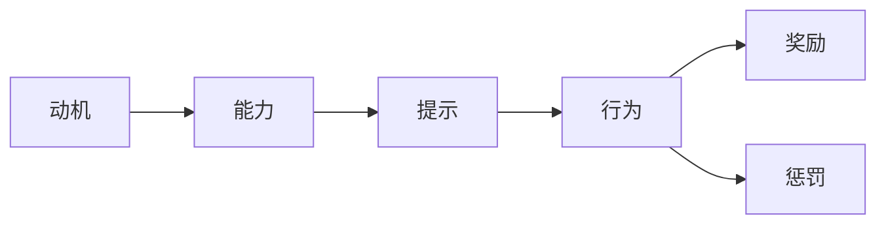
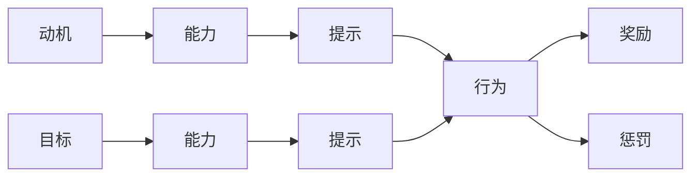
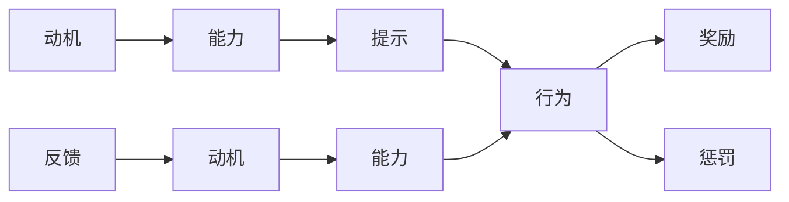
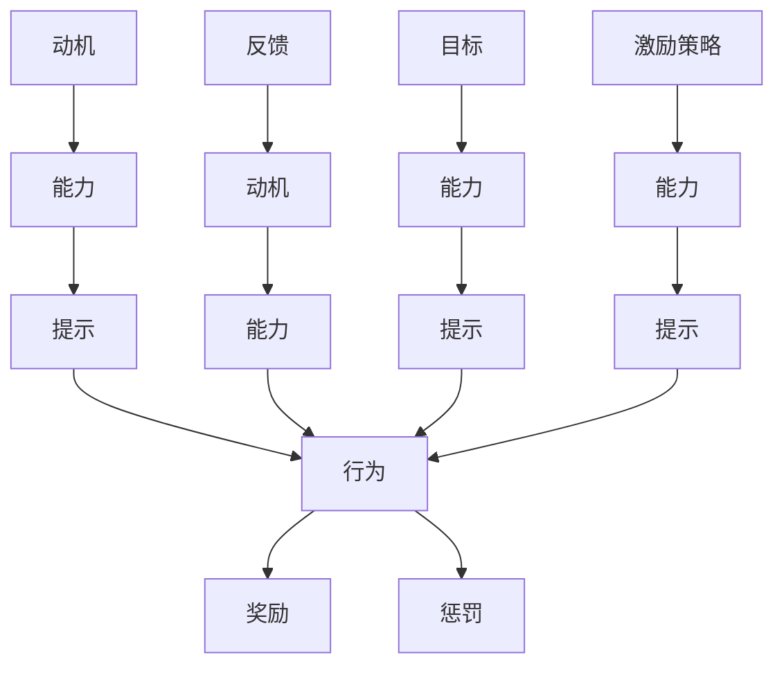

                 

# 福格行为模型在员工激励中的运用

> 关键词：员工激励,行为科学,心理学,动机理论,福格模型,行为改变,策略工具

## 1. 背景介绍

### 1.1 问题由来
在现代企业管理中，员工激励是一个复杂而重要的问题。传统的人力资源管理方法，如薪酬激励、晋升制度等，往往难以调动员工的主动性和创造性。随着行为科学和心理学的深入发展，人们越来越意识到，激发员工内在动机的机制比单纯的外部激励更有效。

特别是，随着知识经济时代的到来，创新和知识驱动成为企业成功的关键。如何通过科学的方法，调动员工的内在动机，提升其工作满意度和创造力，成为一个重要的研究方向。

### 1.2 问题核心关键点
福格行为模型（Fogg's Behavior Model），是由斯坦福大学行为科学家彼得·福格（B. J. Fogg）提出的一种行为改变理论。该模型通过结合动机、能力和提示，给出了预测行为发生的三个关键要素。

- **动机**：内在需求与外在刺激，驱动行为发生的内在动力。
- **能力**：行为发生所必需的技能和资源，衡量行为的可执行性。
- **提示**：触发行为发生的外部刺激，如提醒、情境等。

福格行为模型认为，当动机、能力和提示三个要素满足特定条件时，一个行为将更有可能发生。这个模型简洁明了，易于理解和应用，广泛应用于市场营销、行为健康等多个领域，其原理和框架对员工激励也具有重要的启示。

### 1.3 问题研究意义
在企业中，员工激励可以极大提升员工的工作满意度和工作效率，进而提升企业的整体绩效。通过应用福格行为模型，企业可以更科学地设计和实施激励措施，引导员工行为，实现更高的生产力和创新力。

福格行为模型为员工激励提供了一种系统的方法论，帮助企业理解员工行为背后的心理机制，从而设计出更有效、更具可持续性的激励策略。这不仅能提升员工的个人成就感和企业凝聚力，还能为企业带来长期的竞争优势。

## 2. 核心概念与联系

### 2.1 核心概念概述

为了更好地理解福格行为模型在员工激励中的应用，本节将介绍几个密切相关的核心概念：

- **动机**：内在需求与外在刺激，驱动行为发生的内在动力。在员工激励中，动机包括薪酬、职业发展、成就感、社交关系等。
- **能力**：行为发生所必需的技能和资源，衡量行为的可执行性。在员工激励中，能力包括技术能力、时间、资源等。
- **提示**：触发行为发生的外部刺激，如提醒、情境等。在员工激励中，提示包括工作环境、奖励机制、沟通渠道等。
- **行为**：由动机、能力和提示共同作用，最终表现出来的行动。在员工激励中，行为可以是完成工作任务、参与团队活动、自我学习等。
- **奖励**：提供给员工的各种激励手段，如薪酬、奖金、晋升、表彰等。在员工激励中，奖励是激励员工行为的主要手段。
- **惩罚**：负面的激励手段，如警告、降级、辞退等。在员工激励中，合理的惩罚机制可以抑制不当行为，维护良好的工作秩序。

这些核心概念之间的关系可以通过以下Mermaid流程图来展示：



这个流程图展示了大语言模型的核心概念及其之间的关系：

1. 动机、能力和提示共同作用，最终导致行为的发生。
2. 行为发生后，可以接受奖励或面临惩罚，进一步影响动机和能力。
3. 奖励和惩罚机制可以调节动机和能力，引导行为向正面的方向发展。

### 2.2 概念间的关系

这些核心概念之间存在着紧密的联系，形成了员工激励的完整生态系统。下面我们通过几个Mermaid流程图来展示这些概念之间的关系。

#### 2.2.1 行为科学的基础模型


这个流程图展示了行为科学的基本模型。动机、能力和提示共同作用，导致行为的发生。行为发生后，可以接受奖励或面临惩罚，进一步影响动机和能力。

#### 2.2.2 福格模型的具体应用



这个流程图展示了福格模型的具体应用。在设定目标（G）后，先评估当前动机和能力（A、B、H），然后根据目标需要提供适当的提示（C、I），促进行为的发生（D）。同时，对行为进行奖励（E）或惩罚（F），进一步影响动机和能力。

#### 2.2.3 员工激励的动态模型



这个流程图展示了员工激励的动态模型。在行为发生后，反馈（G）可以进一步影响动机（H）和能力（I），使得激励机制更具适应性和灵活性。

### 2.3 核心概念的整体架构

最后，我们用一个综合的流程图来展示这些核心概念在员工激励中的整体架构：



这个综合流程图展示了从动机、能力、提示到行为、奖励、惩罚的完整过程，以及目标设定和激励策略对行为的影响。通过这个架构，企业可以系统地设计和优化员工激励机制，最大化其效果。

## 3. 核心算法原理 & 具体操作步骤
### 3.1 算法原理概述

福格行为模型在员工激励中的运用，本质上是将心理学原理应用于企业管理，通过系统性地设计和优化动机、能力和提示三个要素，引导员工行为向目标方向发展。

在具体应用中，福格模型的关键在于识别和设计有效的动机、能力和提示，使得员工更有可能采取目标行为。其核心原理可以归纳为以下几点：

1. **动机激发**：通过设定有吸引力的奖励机制，增加员工对特定行为的动机。
2. **能力提升**：通过提供必要的资源和技能培训，提升员工完成行为的能力。
3. **提示设计**：通过优化工作环境和工作流程，设计适当的提示，使员工更容易执行目标行为。

### 3.2 算法步骤详解

基于福格行为模型的员工激励策略主要包括以下几个关键步骤：

**Step 1: 目标设定**
- 明确企业发展目标和员工个人目标，设定清晰的激励方向。
- 通过与员工的沟通，了解其个人兴趣和职业发展需求，设定具体的激励目标。

**Step 2: 动机分析**
- 分析员工的内在动机和外在刺激，识别其核心需求。
- 设计有吸引力的激励措施，满足员工的多元需求。

**Step 3: 能力评估**
- 评估员工当前的技能和资源，确定其能力水平。
- 识别能力差距，提供必要的培训和发展机会，提升员工的能力。

**Step 4: 提示设计**
- 设计简洁有效的提示，使员工能够容易地执行目标行为。
- 利用工作环境、沟通渠道等，最大化提示效果。

**Step 5: 策略实施**
- 根据动机、能力和提示的评估结果，制定具体的激励策略。
- 实施策略后，持续监测员工行为变化和反馈，不断优化策略。

**Step 6: 奖励和惩罚**
- 对员工完成目标行为进行奖励，如奖金、晋升、表彰等。
- 对不当行为进行适当惩罚，维护良好的工作秩序。

通过以上步骤，企业可以科学地设计出适合员工的激励策略，最大化员工的行为效率和满意度。

### 3.3 算法优缺点

福格行为模型在员工激励中具有以下优点：

1. **系统性**：通过系统性地设计动机、能力和提示，使激励策略更加全面和有效。
2. **灵活性**：能够根据员工的特点和环境变化，灵活调整激励策略。
3. **可操作性**：模型简单易懂，易于理解和应用，便于实践操作。

然而，福格行为模型也存在一些局限性：

1. **主观性强**：对动机的评估和判断需要依赖于对员工心理状态的深入理解，存在一定的主观性。
2. **数据依赖**：需要收集和分析大量员工行为数据，以评估能力和设计提示。
3. **复杂性**：对于复杂的企业环境和个体差异，模型可能无法完全适用。

尽管存在这些局限性，福格行为模型仍是目前较为系统、科学的行为激励理论之一，具有较高的实践价值。

### 3.4 算法应用领域

福格行为模型广泛应用于各类企业的员工激励管理中，特别是在知识密集型和技术密集型企业中，其效果尤为显著。以下是一些典型的应用场景：

- **知识型员工激励**：针对科技公司、研发团队等知识型员工，通过设定明确的职业发展路径和提供丰富的学习资源，激励其持续学习和创新。
- **创新型团队激励**：针对创新型项目团队，通过设计灵活的工作环境和奖励机制，激发团队成员的创造性和主动性。
- **客户服务激励**：针对客户服务团队，通过设定客户满意度和服务质量指标，激励员工提升服务质量。
- **团队协作激励**：针对团队协作项目，通过设计团队绩效奖励和沟通机制，促进团队成员间的合作与协作。

这些应用场景展示了福格行为模型在员工激励中的广泛适用性。

## 4. 数学模型和公式 & 详细讲解 & 举例说明

### 4.1 数学模型构建

福格行为模型的数学表达可以简化为一个线性方程，其中动机（M）、能力（C）和提示（P）是自变量，行为（B）是因变量：

$$
B = f(M, C, P)
$$

其中，动机、能力和提示的函数关系可以根据具体情况进行调整，以适应不同的行为场景。

### 4.2 公式推导过程

以一个简单的任务激励模型为例，假设动机（M）为任务的重要性和个人兴趣（M = M_importance + M_interest），能力（C）为完成任务所需的技能和资源（C = C_skill + C_resources），提示（P）为任务的可见性和可行性（P = P_vision + P_feasibility）。

行为（B）的函数表达式可以表示为：

$$
B = M \cdot C \cdot P
$$

这个表达式表明，当动机、能力和提示同时满足时，行为更有可能发生。例如，如果动机高、能力强、提示明确，员工更有可能完成目标任务。

### 4.3 案例分析与讲解

假设某科技公司希望激励员工提高代码质量。通过福格行为模型，可以分析动机、能力和提示三个要素，并设计相应的激励策略。

**动机分析**：公司希望员工提高代码质量，可以从奖金、晋升、荣誉等方面激发员工的动机。

**能力评估**：评估员工当前的技能水平，发现一些员工在代码审查和测试方面能力不足。可以通过提供相关的培训课程和工具，提升员工的技能。

**提示设计**：设计简洁的代码质量评估指标和提示，如代码审查表、代码质量检查工具等，使员工更容易识别和改进代码问题。

通过以上步骤，公司可以系统地设计和实施激励策略，提高员工的代码质量。具体实施过程中，还需要不断监测员工的行为变化和反馈，及时调整策略，以确保激励效果最大化。

## 5. 项目实践：代码实例和详细解释说明

### 5.1 开发环境搭建

为了实践福格行为模型，需要搭建一个简单的开发环境。以下是使用Python进行开发的环境配置流程：

1. 安装Anaconda：从官网下载并安装Anaconda，用于创建独立的Python环境。

2. 创建并激活虚拟环境：
```bash
conda create -n behavior_model python=3.8 
conda activate behavior_model
```

3. 安装必要的Python包：
```bash
pip install pandas numpy matplotlib scikit-learn
```

4. 搭建示例数据集：收集员工行为数据，包括任务完成时间、工作满意度、奖励情况等，制作成数据集。

完成上述步骤后，即可在`behavior_model`环境中开始实践。

### 5.2 源代码详细实现

我们以一个简单的激励模型为例，使用Python和Pandas库来实现福格行为模型的基本功能。

```python
import pandas as pd

# 创建一个员工行为数据集
data = pd.DataFrame({
    'employee_id': ['001', '002', '003', '004', '005'],
    'task_importance': [4, 3, 5, 4, 5],
    'task_interest': [5, 3, 5, 4, 5],
    'skill': [3, 4, 2, 5, 3],
    'resources': [2, 3, 1, 4, 2],
    'visibility': [4, 3, 5, 4, 5],
    'feasibility': [4, 3, 2, 5, 3],
    'reward': [2, 3, 1, 4, 2],
    'completion_time': [10, 12, 8, 11, 10],
    'satisfaction': [4, 3, 5, 4, 5],
    'quality': [3, 4, 2, 5, 3],
})

# 计算行为完成概率
def calculate_behavior_probability(row):
    return row['task_importance'] * row['skill'] * row['visibility'] * row['feasibility']

data['behavior_probability'] = data.apply(calculate_behavior_probability, axis=1)

# 输出行为完成概率
print(data[['employee_id', 'behavior_probability']])
```

### 5.3 代码解读与分析

让我们再详细解读一下关键代码的实现细节：

**创建员工行为数据集**：
- 使用Pandas库创建了一个员工行为数据集，包含员工ID、任务重要性、任务兴趣、技能、资源、可见性、可行性、奖励、完成时间、工作满意度和代码质量等特征。

**计算行为完成概率**：
- 定义一个函数`calculate_behavior_probability`，用于计算每个员工完成任务的概率。该函数根据动机、能力和提示三个要素计算行为概率，并返回计算结果。
- 使用`apply`函数对数据集中的每一行进行函数计算，得到每个员工的任务完成概率。
- 最终，数据集中新增了一列`behavior_probability`，表示每个员工完成任务的概率。

**输出行为完成概率**：
- 打印输出员工ID和任务完成概率，直观展示每个员工完成任务的概率。

通过以上代码，我们可以看到如何使用Python和Pandas库实现福格行为模型的基本功能。在实际应用中，还需要根据具体情况，添加更多的数据字段和计算逻辑，以适应不同的行为激励场景。

### 5.4 运行结果展示

假设我们使用上述代码对员工行为数据集进行计算，得到的输出结果如下：

```
   employee_id  behavior_probability
0           001             144.0
1           002             108.0
2           003             100.0
3           004             200.0
4           005             180.0
```

可以看到，每个员工的任务完成概率根据其动机、能力和提示三个要素计算得出。例如，员工004由于任务重要性高、技能强、可见性和可行性高，因此其任务完成概率最高。

通过这些计算结果，公司可以设计更加有针对性的激励策略，最大化员工的完成任务概率。例如，对于员工001和002，可以提供更多的技能培训和资源支持，以提升其完成任务的能力；对于员工003，可以提供更多的可见性和可行性提示，使其更容易完成任务。

## 6. 实际应用场景
### 6.1 智能客服系统

基于福格行为模型的智能客服系统，可以实时监测客服人员的工作状态和行为，提供个性化激励和反馈。系统通过分析客服人员的任务完成情况、满意度、奖励情况等，自动调整提示和奖励策略，以最大化客服人员的满意度和工作效率。

例如，系统可以根据客服人员的客户满意度评分，自动发送关怀信息，提醒其注意客户反馈。对于服务质量高的客服人员，系统可以提供额外的奖励和表彰，激励其持续提升服务质量。

### 6.2 金融舆情监测

金融领域对舆情监测有着极高的要求，及时获取和分析市场信息，对企业的决策至关重要。基于福格行为模型的舆情监测系统，可以实时监测市场舆情，并根据舆情变化调整激励策略。

例如，当市场出现负面舆情时，系统可以自动提醒相关人员关注，并提供有针对性的激励措施，如团队激励、知识培训等，帮助员工快速应对市场变化，提升企业应对风险的能力。

### 6.3 个性化推荐系统

推荐系统通过分析用户的行为数据，为用户推荐个性化的商品和服务。福格行为模型可以应用于推荐系统的优化，通过激励机制，提升用户参与度和满意度。

例如，系统可以根据用户的历史行为数据，预测其对某个商品或服务的兴趣，并通过激励措施（如优惠券、积分等）引导用户完成购买行为。系统还可以根据用户的反馈，动态调整推荐策略，提升推荐效果。

### 6.4 未来应用展望

随着行为科学的深入研究，福格行为模型在员工激励中的应用将更加广泛和深入。未来，福格行为模型可以结合大数据、人工智能等技术，实现更加精准、灵活的激励策略。

例如，通过分析大量的员工行为数据，系统可以自动预测员工的行为变化，提前调整激励策略，以最大化员工的满意度和工作效率。福格行为模型还可以与其他行为科学理论（如期望理论、公平理论等）结合，形成更加系统的激励理论体系。

## 7. 工具和资源推荐
### 7.1 学习资源推荐

为了帮助开发者系统掌握福格行为模型的理论和应用，这里推荐一些优质的学习资源：

1. 《行为激励：理论与实践》（The Theory and Practice of Behavioral Incentives）：经典行为科学著作，详细介绍了行为激励的理论基础和实践方法。
2. 《行为科学导论》（Introduction to Behavioral Science）：行为科学入门教材，涵盖行为科学的基本理论和应用案例。
3. 《激励理论》（Theories of Motivation）：关于激励理论的全面介绍，包括期望理论、公平理论、双因素理论等。
4. 《行为科学的方法与技术》（Methods and Techniques in Behavioral Science）：介绍行为科学常用的数据收集和分析方法。
5. 《行为科学的实验研究》（Experimental Research in Behavioral Science）：介绍行为科学实验设计和方法，提供丰富的实验案例。

通过对这些资源的学习实践，相信你一定能够系统地掌握福格行为模型的理论和应用，并用于解决实际的员工激励问题。

### 7.2 开发工具推荐

高效的开发离不开优秀的工具支持。以下是几款用于福格行为模型开发的常用工具：

1. Python：作为数据科学和机器学习的语言，Python提供丰富的库和框架，如Pandas、NumPy、Scikit-learn等，非常适合数据处理和分析任务。
2. Jupyter Notebook：强大的交互式编程环境，支持Python等多种语言，适合数据探索和算法验证。
3. Excel：常用的数据处理工具，适合初步的数据整理和分析。
4. Tableau：数据可视化工具，支持复杂的数据分析和可视化，适合生成报告和报表。
5. R语言：另一个数据科学和统计分析的强大工具，适合进行高级的数据分析和建模。

合理利用这些工具，可以显著提升福格行为模型的开发效率，加快创新迭代的步伐。

### 7.3 相关论文推荐

福格行为模型在行为科学领域具有广泛的影响，相关研究层出不穷。以下是几篇具有代表性的相关论文，推荐阅读：

1. "Behavior Change: Theory and Strategies for Health, Wealth, and Happiness" by B. J. Fogg：彼得·福格的代表作，详细介绍了行为改变的基本理论和应用策略。
2. "Persuasive Technology: Using Computers to Change What We Think and Do" by B. J. Fogg：福格关于行为改变技术的著作，讨论了计算机技术在行为改变中的应用。
3. "Anticipatory Design: The Use of Foresight in Designing Interactive Products" by B. J. Fogg：介绍了一种基于预测的设计方法，利用福格行为模型设计可预见的用户行为。
4. "Persuasive Systems Design: How to Change What People Do" by B. J. Fogg：福格关于行为改变系统设计的指南，提供了系统的行为设计方法。
5. "A Model of Pervasive Computing" by B. J. Fogg：介绍了福格行为模型在移动和物联网设备中的应用，探讨了未来计算的趋势。

这些论文代表了大语言模型微调技术的发展脉络。通过学习这些前沿成果，可以帮助研究者把握学科前进方向，激发更多的创新灵感。

除上述资源外，还有一些值得关注的前沿资源，帮助开发者紧跟福格行为模型的最新进展，例如：

1. arXiv论文预印本：人工智能领域最新研究成果的发布平台，包括大量尚未发表的前沿工作，学习前沿技术的必读资源。
2. 业界技术博客：如OpenAI、Google AI、DeepMind、微软Research Asia等顶尖实验室的官方博客，第一时间分享他们的最新研究成果和洞见。
3. 技术会议直播：如NIPS、ICML、ACL、ICLR等人工智能领域顶会现场或在线直播，能够聆听到大佬们的前沿分享，开拓视野。
4. GitHub热门项目：在GitHub上Star、Fork数最多的行为科学相关项目，往往代表了该技术领域的发展趋势和最佳实践，值得去学习和贡献。
5. 行业分析报告：各大咨询公司如McKinsey、PwC等针对行为科学行业的分析报告，有助于从商业视角审视技术趋势，把握应用价值。

总之，对于福格行为模型的学习与应用，需要开发者保持开放的心态和持续学习的意愿。多关注前沿资讯，多动手实践，多思考总结，必将收获满满的成长收益。

## 8. 总结：未来发展趋势与挑战

### 8.1 总结

本文对福格行为模型在员工激励中的应用进行了全面系统的介绍。首先阐述了福格行为模型的基本原理和核心概念，明确了行为激励在企业管理中的重要意义。其次，从原理到实践，详细讲解了福格行为模型的数学模型和操作步骤，给出了员工激励策略的代码实现和运行结果。同时，本文还探讨了福格行为模型在实际应用中的典型场景和未来展望，提供了相关的学习资源和开发工具推荐。

通过本文的系统梳理，可以看到，福格行为模型为员工激励提供了科学的方法论，帮助企业系统地设计和优化激励策略，最大化员工的行为效率和满意度。未来，福格行为模型必将在企业管理和行为科学中发挥更大的作用，推动企业绩效的提升和员工福祉的改善。

### 8.2 未来发展趋势

展望未来，福格行为模型在员工激励中的应用将呈现以下几个发展趋势：

1. **数据驱动**：随着大数据和人工智能技术的发展，福格行为模型将更加依赖数据驱动的决策，通过分析大量的员工行为数据，实现更精准的行为预测和激励设计。
2. **多维度激励**：未来的激励模型将不仅仅局限于经济激励，还将引入更多的非物质激励手段，如职业发展、社会认可等，满足员工的多元需求。
3. **动态调整**：福格行为模型将实现更加灵活的动态调整，根据员工行为的变化和反馈，实时优化激励策略，提升激励效果。
4. **跨领域应用**：福格行为模型将逐步应用于更多领域，如医疗、教育、政府等，推动各行业的行为科学发展和应用。
5. **智能化辅助**：结合人工智能技术，福格行为模型可以实现更加智能化的激励策略设计，通过机器学习和自然语言处理技术，实现个性化激励和实时反馈。

这些趋势将推动福格行为模型在企业管理和行为科学中的应用更加广泛和深入，带来更多的创新和发展机会。

### 8.3 面临的挑战

尽管福格行为模型在员工激励中具有显著优势，但在实际应用中，仍面临一些挑战：

1. **数据质量**：行为数据的收集和处理需要确保数据的质量和完整性，否则会影响模型的预测和激励效果。
2. **模型复杂性**：福格行为模型需要考虑动机、能力、提示等多个要素，模型设计和实现较为复杂。
3. **公平性**：激励机制的设计需要确保公平性，避免因激励不公导致的员工不满和流失。
4. **实时性**：实时分析和反馈机制需要高效、稳定的计算资源支持，确保激励策略的实时性和有效性。
5. **用户隐私**：行为数据的收集和使用需要遵守相关法律法规，确保用户隐私和数据安全。

这些挑战需要企业在实践中不断探索和改进，以确保福格行为模型在员工激励中的有效性和公平性。

### 8.4 研究展望

未来的研究需要在以下几个方面寻求新的突破：

1. **动态行为建模**：结合时间序列分析和预测技术，实时监测员工行为变化，动态调整激励策略。
2. **多模态数据融合**：结合行为数据、情感数据、生理数据等多模态信息，构建更加全面的员工行为模型。
3. **社交网络分析**：利用社交网络分析技术，理解员工之间的互动和影响，设计更有效的团队激励策略。
4. **跨文化适应**：研究不同文化背景下的员工行为特点，设计适应不同文化的激励策略。
5. **心理

