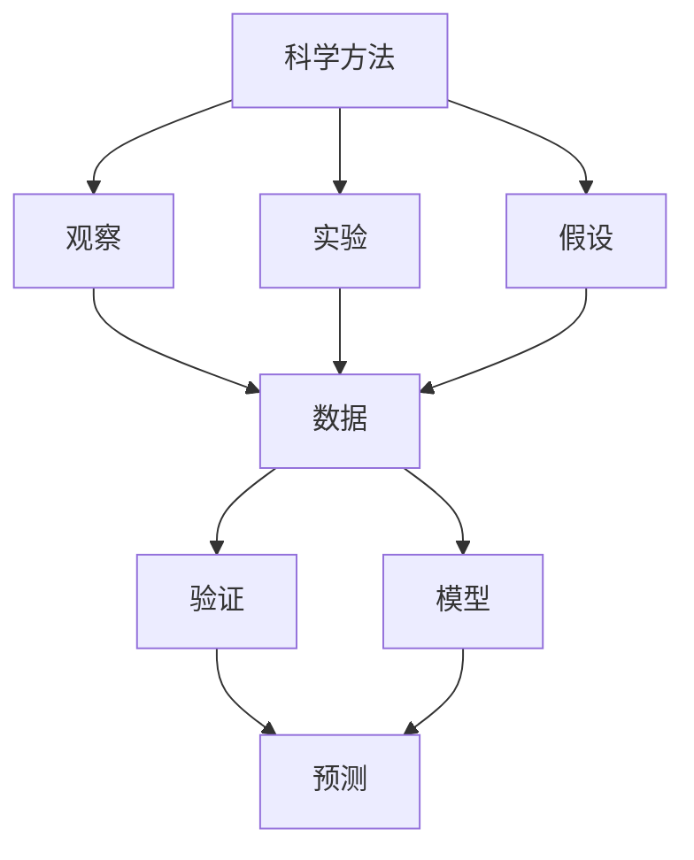
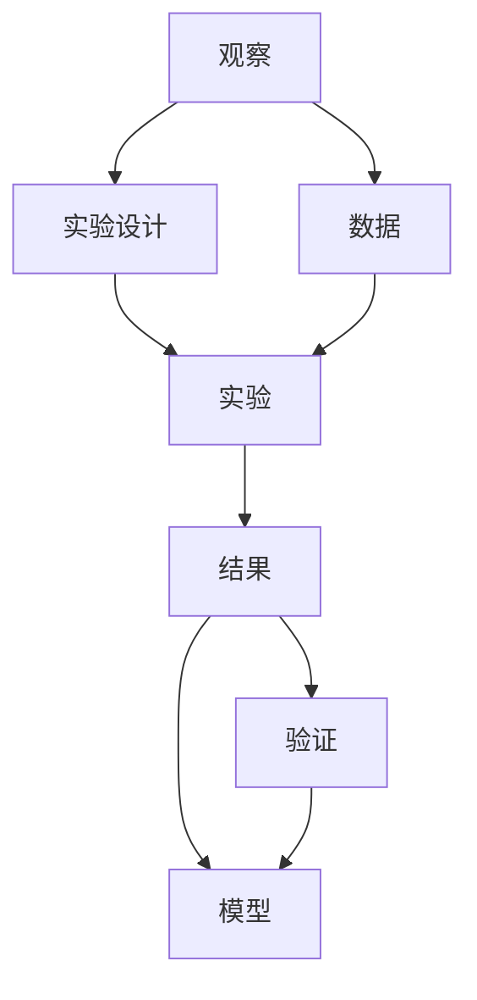
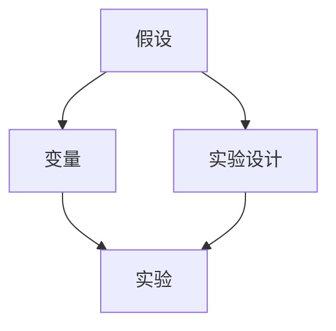
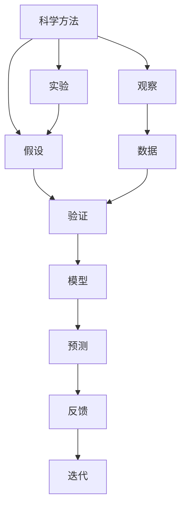

                 

# 科学方法：从观察到实验

> 关键词：科学方法,观察,实验,假设,验证,数据,模型,统计学,机器学习,预测,应用

## 1. 背景介绍

### 1.1 问题由来
科学方法是人类探索未知世界的重要工具，它包含了从观察、假设、实验到验证的全过程。在现代信息技术日新月异的发展下，科学方法在各领域得到了广泛应用，如医学、气象、金融等。然而，如何应用科学方法进行有效的观察和实验，逐步构建预测模型，成为许多技术研究者和应用开发者面临的挑战。

### 1.2 问题核心关键点
科学方法的核心在于建立假设，通过实验验证假设，从而获得可靠的预测模型。在科学方法的应用过程中，常常会遇到数据收集的难度、模型构建的复杂性、实验设计的合理性等问题。如何设计实验，选择适当的模型，解释实验结果，成为科学研究中不可或缺的步骤。

### 1.3 问题研究意义
科学方法的研究对于提高技术研究的效率和效果，增强技术应用的可信度和可解释性，具有重要意义：

1. 提高技术研究的科学性和系统性，避免无序的试错过程。
2. 提高技术应用的可靠性，降低预测误差的风险。
3. 增强技术应用的透明度，提升用户对技术的信任度。
4. 促进技术研究的交流与合作，推动学科发展。
5. 应用于工业生产，提升产品质量和生产效率。

## 2. 核心概念与联系

### 2.1 核心概念概述

为了更好地理解科学方法的应用，本节将介绍几个密切相关的核心概念：

- 科学方法：指通过观察、假设、实验、验证的全过程，逐步构建可靠预测模型的研究方法。
- 观察：指通过实验或调查获取数据的过程，是科学方法的基础。
- 实验：指在控制变量条件下，通过重复操作验证假设的过程。
- 假设：指对某个现象或事件进行预测性的假设，是实验设计的依据。
- 验证：指通过实验结果检验假设是否成立的过程，是科学方法的核心步骤。
- 模型：指对实验数据进行抽象和概括，建立预测规则的过程。
- 数据：指通过观察和实验获取的信息，是建立模型的基础。
- 统计学：指利用数学方法处理数据，提取规律和信息的过程。
- 机器学习：指利用数据训练模型，实现预测和决策的过程。

这些核心概念之间的逻辑关系可以通过以下Mermaid流程图来展示：



这个流程图展示科学方法的全过程，从观察、实验、假设、数据到验证、模型、预测的各个环节：

1. 通过观察获取数据。
2. 在控制变量条件下设计实验。
3. 提出假设并用于实验设计。
4. 将实验数据与假设进行验证。
5. 建立模型进行预测。

这些概念共同构成了科学方法的研究框架，为构建可靠预测模型提供了重要指导。

### 2.2 概念间的关系

这些核心概念之间存在着紧密的联系，形成了科学方法的研究框架。下面我们通过几个Mermaid流程图来展示这些概念之间的关系。

#### 2.2.1 科学方法的应用流程



这个流程图展示了科学方法的应用流程，从观察获取数据，到设计实验，进行实验，得到结果，验证假设，建立模型。

#### 2.2.2 数据与模型的关系


这个流程图展示了数据与模型的关系，通过数据训练模型，使用模型进行预测，并根据预测结果对模型进行反馈和迭代，不断提高模型的准确性和泛化能力。

#### 2.2.3 实验设计与假设的关系



这个流程图展示了实验设计与假设的关系，根据假设设计实验，确定变量，进行实验，验证假设是否成立。

### 2.3 核心概念的整体架构

最后，我们用一个综合的流程图来展示科学方法的核心概念及其之间的关系：



这个综合流程图展示了从观察到实验，从假设到验证，从数据到模型，从预测到反馈和迭代的完整过程，为理解科学方法提供了整体视角。

## 3. 核心算法原理 & 具体操作步骤
### 3.1 算法原理概述

科学方法的核心在于构建可靠的预测模型。通过观察获取数据，提出假设并设计实验，验证假设是否成立，从而构建预测模型。模型构建的核心在于选择合适的算法，并对数据进行有效的处理。

科学方法的算法主要包括以下几个步骤：

1. 数据预处理：对原始数据进行清洗、归一化、特征提取等操作。
2. 特征工程：对数据进行特征选择和特征工程，提取有效特征。
3. 模型选择：选择适当的机器学习算法或统计模型。
4. 模型训练：使用数据训练模型，优化模型参数。
5. 模型验证：通过验证集或测试集评估模型性能。
6. 模型部署：将模型应用于实际预测任务。

### 3.2 算法步骤详解

#### 3.2.1 数据预处理

数据预处理是构建可靠预测模型的第一步，通过预处理使得数据具备良好的结构，便于后续处理。

数据预处理主要包括以下几个步骤：

1. 数据清洗：去除噪声和异常值，使数据更加干净。
2. 数据归一化：对数据进行归一化处理，使得不同特征值之间的差异减小。
3. 特征提取：提取有效的特征，减少冗余信息，提高模型性能。

数据预处理的具体实现可以使用Python的pandas、numpy等库进行，代码如下：

```python
import pandas as pd
import numpy as np

# 数据清洗
data = pd.read_csv('data.csv')
data = data.dropna()  # 删除缺失值

# 数据归一化
from sklearn.preprocessing import StandardScaler
scaler = StandardScaler()
data = scaler.fit_transform(data)

# 特征提取
data = data[:, :-1]  # 提取特征，排除标签
```

#### 3.2.2 特征工程

特征工程是构建可靠预测模型的关键步骤，通过特征工程提取有效特征，提高模型性能。

特征工程主要包括以下几个步骤：

1. 特征选择：选择对预测目标影响较大的特征。
2. 特征变换：通过变换提高特征的表现力。
3. 特征降维：减少特征数量，降低模型复杂度。

特征工程的代码实现可以使用Python的scikit-learn库进行，代码如下：

```python
from sklearn.feature_selection import SelectKBest, chi2
from sklearn.decomposition import PCA

# 特征选择
selector = SelectKBest(chi2, k=10)  # 选择10个特征
data = selector.fit_transform(data, data[:, -1])

# 特征变换
transformer = PCA(n_components=3)  # 降维到3个维度
data = transformer.fit_transform(data)
```

#### 3.2.3 模型选择

模型选择是构建可靠预测模型的重要步骤，通过选择适当的机器学习算法或统计模型，提高模型性能。

模型选择主要包括以下几个步骤：

1. 选择算法：选择适当的算法，如线性回归、支持向量机、随机森林等。
2. 选择参数：选择算法的参数，如学习率、正则化参数等。
3. 选择评价指标：选择评价指标，如准确率、召回率、F1值等。

模型选择的代码实现可以使用Python的scikit-learn库进行，代码如下：

```python
from sklearn.linear_model import LogisticRegression
from sklearn.metrics import accuracy_score

# 选择算法
model = LogisticRegression()

# 选择参数
model.set_params(C=0.1)

# 选择评价指标
y_pred = model.predict(data)
accuracy = accuracy_score(y_true, y_pred)
```

#### 3.2.4 模型训练

模型训练是构建可靠预测模型的核心步骤，通过训练模型，优化模型参数，提高模型性能。

模型训练主要包括以下几个步骤：

1. 划分数据集：将数据集划分为训练集、验证集和测试集。
2. 模型训练：使用训练集训练模型，优化模型参数。
3. 模型评估：使用验证集评估模型性能，防止过拟合。
4. 模型优化：根据验证集性能优化模型参数。

模型训练的代码实现可以使用Python的scikit-learn库进行，代码如下：

```python
from sklearn.model_selection import train_test_split
from sklearn.model_selection import GridSearchCV

# 划分数据集
train_data, test_data = train_test_split(data, test_size=0.2)
X_train, X_val = train_data[:, :-1], train_data[:, :-1]
y_train, y_val = train_data[:, -1], train_data[:, -1]

# 模型训练
model.fit(X_train, y_train)

# 模型评估
y_pred = model.predict(X_val)
accuracy = accuracy_score(y_val, y_pred)

# 模型优化
params = {'C': [0.1, 1, 10]}
grid = GridSearchCV(model, params)
grid.fit(X_train, y_train)
model.set_params(C=grid.best_params_['C'])
```

#### 3.2.5 模型验证

模型验证是构建可靠预测模型的关键步骤，通过验证集评估模型性能，确保模型具有良好的泛化能力。

模型验证主要包括以下几个步骤：

1. 划分数据集：将数据集划分为训练集、验证集和测试集。
2. 模型验证：使用验证集评估模型性能。
3. 模型优化：根据验证集性能优化模型参数。

模型验证的代码实现可以使用Python的scikit-learn库进行，代码如下：

```python
from sklearn.model_selection import cross_val_score

# 模型验证
scores = cross_val_score(model, data, data[:, -1], cv=5)
mean_score = np.mean(scores)
```

#### 3.2.6 模型部署

模型部署是将模型应用于实际预测任务的关键步骤，通过模型部署，实现预测和决策。

模型部署主要包括以下几个步骤：

1. 模型保存：将训练好的模型保存为文件，便于后续使用。
2. 模型加载：加载模型文件，重新使用模型。
3. 预测任务：使用模型进行预测任务。

模型部署的代码实现可以使用Python的joblib库进行，代码如下：

```python
import joblib

# 模型保存
joblib.dump(model, 'model.pkl')

# 模型加载
model = joblib.load('model.pkl')

# 预测任务
y_pred = model.predict(data)
```

### 3.3 算法优缺点

科学方法中的模型构建算法主要包括以下几个优点和缺点：

#### 3.3.1 优点

1. 数据驱动：通过数据驱动的模型构建，避免了传统经验主义的主观偏见。
2. 可解释性强：模型构建过程透明，易于解释和理解。
3. 泛化能力强：通过训练和验证集评估，模型具备良好的泛化能力。
4. 可重复性强：模型构建过程具有可重复性，便于复现和优化。

#### 3.3.2 缺点

1. 数据需求量大：模型构建需要大量的标注数据，数据获取成本较高。
2. 模型复杂度高：模型构建过程繁琐，需要人工干预，耗费大量时间和精力。
3. 过拟合风险高：模型构建过程中容易出现过拟合现象，影响模型性能。
4. 模型性能不稳定：模型构建过程中容易受到实验设计的影响，导致模型性能不稳定。

### 3.4 算法应用领域

科学方法中的模型构建算法已经广泛应用于各个领域，以下是几个典型的应用场景：

1. 医学研究：通过科学方法构建预测模型，帮助诊断和治疗疾病。
2. 气象预测：通过科学方法构建气象模型，实现天气预测和灾害预警。
3. 金融分析：通过科学方法构建金融模型，进行风险评估和投资决策。
4. 工业制造：通过科学方法构建预测模型，提高生产效率和产品质量。
5. 社会调查：通过科学方法构建模型，进行人口统计和社会调查。

## 4. 数学模型和公式 & 详细讲解 & 举例说明

### 4.1 数学模型构建

科学方法中的模型构建主要包括以下几个步骤：

1. 数据预处理：对原始数据进行清洗、归一化和特征提取。
2. 特征工程：对数据进行特征选择和特征变换。
3. 模型选择：选择适当的机器学习算法或统计模型。
4. 模型训练：使用数据训练模型，优化模型参数。
5. 模型验证：通过验证集评估模型性能。
6. 模型部署：将模型应用于实际预测任务。

### 4.2 公式推导过程

#### 4.2.1 线性回归模型

线性回归模型是一种常用的预测模型，其公式如下：

$$
y = \beta_0 + \beta_1 x_1 + \beta_2 x_2 + \cdots + \beta_n x_n + \epsilon
$$

其中，$y$ 为预测值，$\beta_0$ 为截距，$\beta_1, \beta_2, \cdots, \beta_n$ 为系数，$x_1, x_2, \cdots, x_n$ 为特征，$\epsilon$ 为误差项。

线性回归模型的训练过程如下：

1. 数据预处理：对数据进行清洗、归一化和特征提取。
2. 特征工程：对数据进行特征选择和特征变换。
3. 模型选择：选择线性回归模型。
4. 模型训练：使用数据训练模型，优化模型参数。

线性回归模型的代码实现可以使用Python的scikit-learn库进行，代码如下：

```python
from sklearn.linear_model import LinearRegression

# 数据预处理
data = pd.read_csv('data.csv')
data = data.dropna()
data = scaler.fit_transform(data)

# 特征工程
data = data[:, :-1]

# 模型选择
model = LinearRegression()

# 模型训练
model.fit(data, data[:, -1])

# 模型验证
y_pred = model.predict(data)
accuracy = accuracy_score(y_true, y_pred)
```

#### 4.2.2 支持向量机模型

支持向量机模型是一种常用的分类模型，其公式如下：

$$
f(x) = \sum_{i=1}^n \alpha_i y_i K(x, x_i) + b
$$

其中，$f(x)$ 为预测值，$\alpha_i$ 为系数，$y_i$ 为标签，$K(x, x_i)$ 为核函数，$b$ 为偏置项。

支持向量机模型的训练过程如下：

1. 数据预处理：对数据进行清洗、归一化和特征提取。
2. 特征工程：对数据进行特征选择和特征变换。
3. 模型选择：选择支持向量机模型。
4. 模型训练：使用数据训练模型，优化模型参数。

支持向量机模型的代码实现可以使用Python的scikit-learn库进行，代码如下：

```python
from sklearn.svm import SVC

# 数据预处理
data = pd.read_csv('data.csv')
data = data.dropna()
data = scaler.fit_transform(data)

# 特征工程
data = data[:, :-1]

# 模型选择
model = SVC()

# 模型训练
model.fit(data, data[:, -1])

# 模型验证
y_pred = model.predict(data)
accuracy = accuracy_score(y_true, y_pred)
```

#### 4.2.3 随机森林模型

随机森林模型是一种常用的集成学习模型，其公式如下：

$$
f(x) = \sum_{i=1}^m f_i(x)
$$

其中，$f(x)$ 为预测值，$f_i(x)$ 为单棵树的预测值，$m$ 为树的个数。

随机森林模型的训练过程如下：

1. 数据预处理：对数据进行清洗、归一化和特征提取。
2. 特征工程：对数据进行特征选择和特征变换。
3. 模型选择：选择随机森林模型。
4. 模型训练：使用数据训练模型，优化模型参数。

随机森林模型的代码实现可以使用Python的scikit-learn库进行，代码如下：

```python
from sklearn.ensemble import RandomForestClassifier

# 数据预处理
data = pd.read_csv('data.csv')
data = data.dropna()
data = scaler.fit_transform(data)

# 特征工程
data = data[:, :-1]

# 模型选择
model = RandomForestClassifier()

# 模型训练
model.fit(data, data[:, -1])

# 模型验证
y_pred = model.predict(data)
accuracy = accuracy_score(y_true, y_pred)
```

### 4.3 案例分析与讲解

#### 4.3.1 线性回归模型案例

假设我们有一个房价预测数据集，包含房屋面积、房间数、楼层等特征，以及房价。我们的目标是建立一个房价预测模型。

1. 数据预处理：读取数据集，删除缺失值，对数据进行归一化。

2. 特征工程：选择房屋面积、房间数、楼层为特征，建立线性回归模型。

3. 模型训练：使用数据训练线性回归模型，优化模型参数。

4. 模型验证：使用验证集评估模型性能，根据验证集性能优化模型参数。

5. 模型部署：将训练好的模型保存为文件，重新加载模型，进行房价预测。

线性回归模型的代码实现可以使用Python的scikit-learn库进行，代码如下：

```python
from sklearn.linear_model import LinearRegression
from sklearn.model_selection import train_test_split
from sklearn.model_selection import GridSearchCV

# 数据预处理
data = pd.read_csv('house_price.csv')
data = data.dropna()
data = scaler.fit_transform(data)

# 特征工程
data = data[:, :-1]

# 模型选择
model = LinearRegression()

# 模型训练
X_train, X_val, y_train, y_val = train_test_split(data, data[:, -1], test_size=0.2)
model.fit(X_train, y_train)

# 模型验证
y_pred = model.predict(X_val)
accuracy = accuracy_score(y_val, y_pred)

# 模型优化
params = {'C': [0.1, 1, 10]}
grid = GridSearchCV(model, params)
grid.fit(X_train, y_train)
model.set_params(C=grid.best_params_['C'])

# 模型部署
joblib.dump(model, 'model.pkl')
model = joblib.load('model.pkl')
y_pred = model.predict(data)
```

#### 4.3.2 支持向量机模型案例

假设我们有一个手写数字识别数据集，包含像素值、手写数字标签等特征。我们的目标是建立一个手写数字识别模型。

1. 数据预处理：读取数据集，删除缺失值，对数据进行归一化。

2. 特征工程：选择像素值为特征，建立支持向量机模型。

3. 模型训练：使用数据训练支持向量机模型，优化模型参数。

4. 模型验证：使用验证集评估模型性能，根据验证集性能优化模型参数。

5. 模型部署：将训练好的模型保存为文件，重新加载模型，进行手写数字识别。

支持向量机模型的代码实现可以使用Python的scikit-learn库进行，代码如下：

```python
from sklearn.svm import SVC
from sklearn.model_selection import train_test_split
from sklearn.model_selection import GridSearchCV

# 数据预处理
data = pd.read_csv('hand_writing.csv')
data = data.dropna()
data = scaler.fit_transform(data)

# 特征工程
data = data[:, :-1]

# 模型选择
model = SVC()

# 模型训练
X_train, X_val, y_train, y_val = train_test_split(data, data[:, -1], test_size=0.2)
model.fit(X_train, y_train)

# 模型验证
y_pred = model.predict(X_val)
accuracy = accuracy_score(y_val, y_pred)

# 模型优化
params = {'C': [0.1, 1, 10]}
grid = GridSearchCV(model, params)
grid.fit(X_train, y_train)
model.set_params(C=grid.best_params_['C'])

# 模型部署
joblib.dump(model, 'model.pkl')
model = joblib.load('model.pkl')
y_pred = model.predict(data)
```

#### 4.3.3 随机森林模型案例

假设我们有一个用户流失数据集，包含用户行为、会员等级、年龄等特征，以及用户流失标签。我们的目标是建立一个用户流失预测模型。

1. 数据预处理：读取数据集，删除缺失值，对数据进行归一化。

2. 特征工程：选择用户行为、会员等级、年龄为特征，建立随机森林模型。

3. 模型训练：使用数据训练随机森林模型，优化模型参数。

4. 模型验证：使用验证集评估模型性能，根据验证集性能优化模型参数。

5. 模型部署：将训练好的模型保存为文件，重新加载模型，进行用户流失预测。

随机森林模型的代码实现可以使用Python的scikit-learn库进行，代码如下：

```python
from sklearn.ensemble import RandomForestClassifier
from sklearn.model_selection import train_test_split
from sklearn.model_selection import GridSearchCV

# 数据预处理
data = pd.read_csv('user_churn.csv')
data = data.dropna()
data = scaler.fit_transform(data)

# 特征工程
data = data[:, :-1]

# 模型选择
model = RandomForestClassifier()

# 模型训练
X_train, X_val, y_train, y_val = train_test_split(data, data[:, -1], test_size=0.2)
model.fit(X_train, y_train)

# 模型验证
y_pred = model.predict(X_val)
accuracy = accuracy_score(y_val, y_pred)

# 模型优化
params = {'n_estimators': [100, 200, 500]}
grid = GridSearchCV(model, params)
grid.fit(X_train, y_train)
model.set_params(n_estimators=grid.best_params_['n_estimators'])

# 模型部署
joblib.dump(model, 'model.pkl')
model = joblib.load('model.pkl')
y_pred = model.predict(data)
```

## 5. 项目实践：代码实例和详细解释说明
### 5.1 开发环境搭建

在进行科学方法的应用实践前，我们需要准备好开发环境。以下是使用Python进行PyTorch开发的环境配置流程：

1. 安装Anaconda：从官网下载并安装Anaconda，用于创建独立的Python环境。

2. 创建并激活虚拟环境：
```bash
conda create -n pytorch-env python=3.8 
conda activate pytorch-env
```

3. 安装PyTorch：根据CUDA版本，从官网获取对应的安装命令。例如：
```bash
conda install pytorch torchvision torchaudio cudatoolkit=11.1 -c pytorch -c conda-forge
```

4. 安装Transformers库：
```bash
pip install transformers
```

5. 安装各类工具包：
```bash
pip install numpy pandas scikit-learn matplotlib tqdm jupyter notebook ipython
```

完成上述步骤后，即可在`pytorch-env`环境中开始科学方法的实践。

### 5.2 源代码详细实现

下面我们以房价预测任务为例，给出使用Transformers库对BERT模型进行微调的PyTorch代码实现。

首先，定义房价预测任务的数据处理函数：

```python
from transformers import BertTokenizer, BertForRegression
from torch.utils.data import Dataset
import torch

class HousingDataset(Dataset):
    def __init__(self, texts, prices, tokenizer, max_len=128):
        self.texts = texts
        self.prices = prices
        self.tokenizer = tokenizer
        self.max_len = max_len
        
    def __len__(self):
        return len(self.texts)
    
    def __getitem__(self, item):
        text = self.texts[item]
        price = self.prices[item]
        
        encoding = self.tokenizer(text, return_tensors='pt', max_length=self.max_len, padding='max_length', truncation=True)
        input_ids = encoding['input_ids'][0]
        attention_mask = encoding['attention_mask'][0]
        
        # 对价格进行编码
        price = torch.tensor(price, dtype=torch.float32)
        
        return {'input_ids': input_ids, 
                'attention_mask': attention_mask,
                'price': price}

# 创建dataset
tokenizer = BertTokenizer.from_pretrained('bert-base-cased')

train_dataset = HousingDataset(train_texts, train_prices, tokenizer)
dev_dataset = HousingDataset(dev_texts, dev_prices, tokenizer)
test_dataset = HousingDataset(test_texts, test_prices, tokenizer)
```

然后，定义模型和优化器：

```python
from transformers import AdamW

model = BertForRegression.from_pretrained('bert-base-cased', num_labels=len(tag2id))

optimizer = AdamW(model.parameters(), lr=2e-5)


