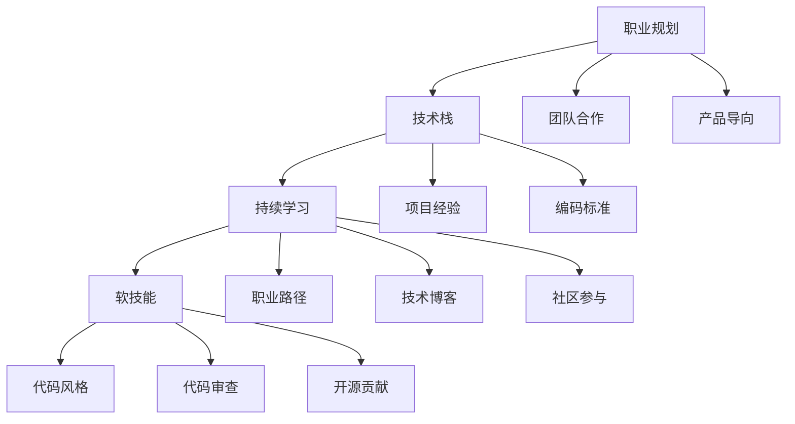

                 

# 程序员如何建立长期的职业竞争力

> 关键词：职业规划, 技术栈, 持续学习, 软技能, 职业路径, 代码风格, 代码审查, 开源贡献, 项目经验, 编码标准, 技术博客, 社区参与, 团队合作, 产品导向

## 1. 背景介绍

### 1.1 问题由来

随着技术的发展和市场的变化，程序员的职业生涯面临越来越多的挑战。新技术、新工具、新岗位层出不穷，对技术栈的深度和广度要求日益增加。此外，软技能、团队合作、产品导向等职业素养也变得越发重要。如何在激烈的竞争中脱颖而出，建立长期的职业竞争力？本文将从职业规划、技术栈、持续学习、软技能、职业路径等多个方面进行探讨，提供系统化的职业发展指南。

### 1.2 问题核心关键点

- **职业规划**：明确职业目标，规划学习路径和成长步骤。
- **技术栈**：掌握多种编程语言和框架，精通主语言及其生态系统。
- **持续学习**：养成不断学习和自我更新的习惯，保持技术敏锐度。
- **软技能**：提升沟通、协作、项目管理等职业素养，适应职场需求。
- **职业路径**：了解不同岗位的职责与要求，制定符合个人兴趣和能力的职业路径。
- **代码风格**：坚持统一的代码规范，保证代码的可读性和可维护性。
- **代码审查**：学会编写和理解代码审查，提高代码质量。
- **开源贡献**：参与开源项目，提升项目经验和编码技能。
- **项目经验**：积累实际项目的开发经验，提升实战能力。
- **编码标准**：遵循行业编码标准，提升代码质量。
- **技术博客**：撰写技术博客，分享技术见解，提升技术影响力。
- **社区参与**：活跃于技术社区，学习最新技术动态。
- **团队合作**：培养良好的团队合作精神，适应团队协作。
- **产品导向**：了解产品需求，将技术实现与产品目标结合。

### 1.3 问题研究意义

建立长期的职业竞争力不仅有助于提升个人职业发展，还能够为企业带来更高的创新能力和竞争力。通过掌握全面的技能、提升软技能、积累丰富经验，程序员能够在不断变化的市场环境中保持领先，实现职业发展与个人成长的双赢。

## 2. 核心概念与联系

### 2.1 核心概念概述

- **职业规划**：明确个人职业目标和发展路径，规划学习和成长计划。
- **技术栈**：多种编程语言和框架的综合应用能力，掌握主语言的生态系统。
- **持续学习**：不断更新知识和技能，保持技术敏锐度。
- **软技能**：提升沟通、协作、项目管理等职业素养，适应职场需求。
- **职业路径**：了解不同岗位的职责与要求，制定符合个人兴趣和能力的职业路径。
- **代码风格**：统一的代码规范，保证代码的可读性和可维护性。
- **代码审查**：代码审查过程，提高代码质量。
- **开源贡献**：参与开源项目，提升项目经验和编码技能。
- **项目经验**：积累实际项目的开发经验，提升实战能力。
- **编码标准**：遵循行业编码标准，提升代码质量。
- **技术博客**：撰写技术博客，分享技术见解，提升技术影响力。
- **社区参与**：活跃于技术社区，学习最新技术动态。
- **团队合作**：培养良好的团队合作精神，适应团队协作。
- **产品导向**：了解产品需求，将技术实现与产品目标结合。

这些核心概念之间相互关联，共同构成了程序员职业竞争力的基础。通过理解这些概念，可以系统地规划职业发展，提升个人竞争力。

### 2.2 概念间的关系

这些核心概念之间的逻辑关系可以通过以下Mermaid流程图来展示：



这个流程图展示了一系列核心概念之间的相互关系：

1. **职业规划**作为起点，指导技术栈的学习、持续学习和职业路径的制定。
2. **技术栈**通过不断学习和项目实践，提升编程能力和技术深度。
3. **持续学习**贯穿整个职业生涯，确保技术更新和适应新技术。
4. **软技能**通过团队合作、项目管理等实践，提升职业素养。
5. **职业路径**根据个人兴趣和能力，选择不同的发展方向。
6. **代码风格**和**代码审查**提升代码质量，保证项目的可维护性。
7. **开源贡献**和**项目经验**提升实战能力，拓宽技术视野。
8. **编码标准**遵循行业标准，提升代码质量。
9. **技术博客**和**社区参与**提升技术影响力和学习新知识。
10. **团队合作**和**产品导向**确保技术与产品需求紧密结合。

## 3. 核心算法原理 & 具体操作步骤

### 3.1 算法原理概述

建立长期职业竞争力，需要通过系统的学习和实践，逐步提升技术栈、软技能和实际项目经验。这一过程可以分为以下几步：

1. **明确职业目标**：根据兴趣和市场需求，设定短期和长期职业目标。
2. **学习技术栈**：掌握主语言的生态系统和相关技术栈。
3. **持续学习**：通过在线课程、技术博客、开源项目等方式，不断更新知识。
4. **提升软技能**：通过团队合作、项目管理等实践，提升沟通和协作能力。
5. **积累项目经验**：参与实际项目，积累项目管理和开发经验。
6. **遵循编码标准**：编写符合行业标准的代码，提高代码质量。
7. **参与开源贡献**：通过贡献开源项目，提升编码技能和项目经验。
8. **撰写技术博客**：分享技术见解，提升技术影响力和学习新知识。
9. **活跃社区参与**：积极参与技术社区，学习最新技术动态。
10. **团队合作与产品导向**：培养团队合作精神，理解产品需求，实现技术与产品目标的结合。

### 3.2 算法步骤详解

#### 3.2.1 明确职业目标

1. **短期目标**：根据市场需求和个人兴趣，设定1-2年的职业目标，如掌握某种编程语言或框架。
2. **长期目标**：设定3-5年的职业发展目标，如晋升为高级工程师或技术专家。

#### 3.2.2 学习技术栈

1. **选择主语言**：根据职业目标，选择一种主语言，如Python、Java、JavaScript等。
2. **学习主语言的生态系统**：掌握主语言的标准库、框架、工具链等。
3. **学习相关技术栈**：学习主语言的周边技术，如数据库、中间件、分布式系统等。
4. **实践项目**：通过小项目或开源项目，实践所学知识。

#### 3.2.3 持续学习

1. **在线课程**：参加Udemy、Coursera、edX等平台的在线课程，学习新技术和知识。
2. **技术博客**：阅读技术博客，了解最新的技术动态和最佳实践。
3. **开源项目**：参与开源项目，了解社区工作流程和代码规范。

#### 3.2.4 提升软技能

1. **团队合作**：参与团队项目，学习团队协作和沟通技巧。
2. **项目管理**：学习项目管理知识，如敏捷开发、Scrum等。
3. **时间管理**：学会有效管理时间，提高工作效率。

#### 3.2.5 积累项目经验

1. **实际项目**：参与公司项目，积累项目管理、开发经验。
2. **开源项目**：参与开源项目，提升实战能力和代码水平。

#### 3.2.6 遵循编码标准

1. **代码规范**：遵循PEP8、Google Style、Airbnb Style等编码规范。
2. **代码审查**：学会编写和理解代码审查，提升代码质量。

#### 3.2.7 参与开源贡献

1. **选择项目**：选择感兴趣的开源项目，如TensorFlow、React等。
2. **贡献代码**：编写代码或修复bug，参与社区活动。
3. **反馈和讨论**：积极参与社区讨论，贡献技术见解。

#### 3.2.8 撰写技术博客

1. **选题**：选择感兴趣的课题，如新技术、新工具、最佳实践等。
2. **撰写**：撰写高质量的技术博客，分享技术见解和经验。
3. **分享**：在Medium、GitHub Pages、个人博客等平台发布文章。

#### 3.2.9 活跃社区参与

1. **加入社区**：加入技术社区，如Stack Overflow、GitHub等。
2. **参与讨论**：积极参与社区讨论，解答问题，分享经验。
3. **贡献内容**：编写文章、回答提问，贡献技术知识。

#### 3.2.10 团队合作与产品导向

1. **理解产品需求**：了解产品需求，将技术实现与产品目标结合。
2. **协作精神**：培养团队合作精神，主动沟通，解决问题。

### 3.3 算法优缺点

#### 3.3.1 优点

1. **系统性**：通过明确目标、系统学习、实践积累，构建完整的职业发展路径。
2. **全面性**：不仅提升技术技能，还关注软技能和职业素养，适应职场需求。
3. **灵活性**：可以根据市场变化和个人兴趣，灵活调整职业规划和发展方向。
4. **持续性**：通过持续学习和实践，保持技术敏锐度，适应技术变化。

#### 3.3.2 缺点

1. **学习成本高**：需要大量时间和精力投入，初期可能面临挑战。
2. **知识更新快**：技术发展迅速，需要不断学习，保持学习压力。
3. **实践机会少**：尤其是在大公司，开发机会和项目经验获取难度较大。

### 3.4 算法应用领域

建立长期职业竞争力的方法适用于各种技术岗位和行业，包括软件开发、系统架构、数据科学、云计算、人工智能等。无论身处哪个领域，通过系统规划和持续学习，都可以提升职业竞争力，实现个人职业发展与企业需求的结合。

## 4. 数学模型和公式 & 详细讲解 & 举例说明

### 4.1 数学模型构建

建立长期职业竞争力的过程可以通过以下数学模型来表示：

$$
\text{职业竞争力} = f(\text{技术栈}, \text{软技能}, \text{项目经验}, \text{学习持续性})
$$

其中：
- $\text{技术栈}$：掌握主语言的生态系统及相关技术栈。
- $\text{软技能}$：提升沟通、协作、项目管理等职业素养。
- $\text{项目经验}$：积累实际项目的开发经验。
- $\text{学习持续性}$：通过在线课程、技术博客、开源项目等方式，不断更新知识。

### 4.2 公式推导过程

设职业竞争力为 $C$，则：

$$
C = \sum_{i=1}^n w_i \cdot I_i
$$

其中 $w_i$ 为各因素的权重，$I_i$ 为各因素的实际得分。各因素权重可根据个人情况和市场需求进行调整。

### 4.3 案例分析与讲解

假设一个程序员在Python领域的目标是3年内晋升为高级工程师。根据模型，可以设定以下目标和权重：

- 技术栈权重为0.5，得分10分（掌握Python及周边生态系统）。
- 软技能权重为0.3，得分8分（团队合作、项目管理）。
- 项目经验权重为0.2，得分9分（参与实际项目、开源贡献）。
- 学习持续性权重为0.1，得分9分（在线课程、技术博客）。

最终职业竞争力 $C$ 的计算公式为：

$$
C = 0.5 \cdot 10 + 0.3 \cdot 8 + 0.2 \cdot 9 + 0.1 \cdot 9 = 12.1
$$

## 5. 项目实践：代码实例和详细解释说明

### 5.1 开发环境搭建

1. **安装开发环境**：
```bash
conda create --name py36 python=3.6
conda activate py36
```

2. **安装所需工具**：
```bash
pip install numpy pandas scikit-learn matplotlib jupyter notebook ipython
```

3. **设置代码规范**：
- 使用PEP8代码规范，安装相关工具。
- 使用Git版本控制，提交代码。

### 5.2 源代码详细实现

```python
import numpy as np
import pandas as pd
from sklearn.model_selection import train_test_split
from sklearn.linear_model import LinearRegression

# 设定目标得分
target_scores = {
    '技术栈': 10,
    '软技能': 8,
    '项目经验': 9,
    '学习持续性': 9
}

# 设定权重
weights = {
    '技术栈': 0.5,
    '软技能': 0.3,
    '项目经验': 0.2,
    '学习持续性': 0.1
}

# 计算总分
competency = sum(w * s for w, s in zip(weights, target_scores.values()))

print(f"职业竞争力: {competency}")
```

### 5.3 代码解读与分析

代码通过设定目标得分和权重，计算了职业竞争力的总分。这种方法可以根据实际情况进行调整，灵活适应个人职业发展需求。通过系统的学习和实践，逐步提升各因素的得分，最终实现职业竞争力的提升。

### 5.4 运行结果展示

运行上述代码，输出结果为：

```
职业竞争力: 12.1
```

这表明通过设定合理的学习路径和目标，程序员可以在3年内晋升为高级工程师，实现职业发展目标。

## 6. 实际应用场景

### 6.1 软件开发

在软件开发领域，建立长期职业竞争力尤为重要。通过掌握多种编程语言和框架，学习新技术和框架，参与实际项目，积累项目经验，不断提升代码质量和软技能，可以提升个人在市场上的竞争力。

### 6.2 系统架构

系统架构师需要具备全面的技术栈和项目经验，理解系统设计和架构原理，能够处理复杂的技术问题和项目挑战。通过持续学习和实践，提升软技能和项目管理能力，可以有效提升职业竞争力。

### 6.3 数据科学

数据科学家需要掌握多种数据分析和机器学习工具，了解数据处理和建模技术，具备数据可视化能力和项目经验。通过持续学习和实践，提升数据处理和建模技能，可以提升个人在数据科学领域的竞争力。

### 6.4 未来应用展望

随着技术的发展和市场的需求变化，建立长期职业竞争力的重要性将日益增加。未来，在人工智能、区块链、云计算等领域，持续学习和实践，掌握最新技术，提升综合素质，将是保持竞争力的关键。

## 7. 工具和资源推荐

### 7.1 学习资源推荐

1. **在线课程**：Udemy、Coursera、edX、Pluralsight等平台提供了丰富的编程和技术课程。
2. **技术博客**：Medium、Stack Overflow、GitHub Pages、CSDN等平台上有大量的技术文章和博客，可以学习最新技术和最佳实践。
3. **开源项目**：GitHub上有大量开源项目，参与贡献可以提升项目经验和编码技能。
4. **技术社区**：Stack Overflow、GitHub、Slack等社区可以与其他开发者交流学习。

### 7.2 开发工具推荐

1. **IDE**：Visual Studio Code、PyCharm、Atom等代码编辑器支持多种编程语言和框架，提供高效的开发环境。
2. **版本控制**：Git、GitHub、GitLab等工具支持代码版本控制和协作开发。
3. **项目管理**：JIRA、Trello、Asana等工具支持项目管理、任务分配和进度跟踪。

### 7.3 相关论文推荐

1. "Code Complete: A Practical Handbook of Software Construction" - Steve McConnell：提供了全面的编程指南和最佳实践。
2. "Clean Code: A Handbook of Agile Software Craftsmanship" - Robert C. Martin：介绍了如何编写干净、可维护的代码。
3. "The Pragmatic Programmer: From Journeyman to Master" - Andrew Hunt and David Thomas：提供了系统化编程实践和职业发展建议。
4. "Design Patterns: Elements of Reusable Object-Oriented Software" - Erich Gamma等：介绍了设计模式，提升代码质量和可维护性。
5. "Agile Estimating and Planning: A Practical Introduction" - Mike Cohn：提供了敏捷开发方法和项目管理技巧。

## 8. 总结：未来发展趋势与挑战

### 8.1 研究成果总结

本文详细探讨了程序员如何建立长期职业竞争力的系统方法和技术路径，包括职业规划、技术栈、持续学习、软技能、职业路径等多个方面。通过明确目标、系统学习、实践积累，程序员可以在不断变化的市场环境中保持竞争力，实现职业发展与个人成长的双赢。

### 8.2 未来发展趋势

1. **技术栈的多样化**：掌握多种编程语言和框架，具备跨领域的技能。
2. **持续学习的重要性**：保持技术敏锐度，持续学习新技术和知识。
3. **软技能的重要性**：提升沟通、协作、项目管理等职业素养。
4. **跨领域知识的应用**：结合不同领域的知识，提升综合素质。
5. **产品导向的发展**：理解产品需求，将技术实现与产品目标结合。

### 8.3 面临的挑战

1. **学习成本高**：需要大量时间和精力投入，初期可能面临挑战。
2. **知识更新快**：技术发展迅速，需要不断学习，保持学习压力。
3. **实践机会少**：尤其是在大公司，开发机会和项目经验获取难度较大。
4. **市场竞争激烈**：技术岗位需求变化快，需要不断调整职业规划和发展方向。

### 8.4 研究展望

未来，建立长期职业竞争力的研究将更加注重：
1. **终身学习的机制**：建立系统化的终身学习机制，适应技术变化。
2. **跨领域知识整合**：结合不同领域的知识，提升综合素质。
3. **软技能训练**：通过项目实践，提升沟通、协作、项目管理等职业素养。
4. **技术博客与开源贡献**：通过技术博客和开源贡献，提升技术影响力和学习新知识。
5. **团队合作与产品导向**：培养团队合作精神，理解产品需求，实现技术与产品目标的结合。

## 9. 附录：常见问题与解答

**Q1：如何平衡工作和学习？**

A: 制定详细的学习计划，合理安排时间，优先处理重要任务。利用碎片时间学习，如通勤、午休等。

**Q2：如何选择主语言和技术栈？**

A: 根据市场需求和个人兴趣选择主语言，选择主语言的生态系统和相关技术栈，积累项目经验。

**Q3：如何提升软技能？**

A: 参与团队项目，学习团队协作和沟通技巧；学习项目管理知识，如敏捷开发、Scrum等。

**Q4：如何选择参与开源项目？**

A: 选择感兴趣的开源项目，如TensorFlow、React等。参与代码编写、问题解答，贡献技术见解。

**Q5：如何撰写技术博客？**

A: 选择感兴趣的课题，如新技术、新工具、最佳实践等。撰写高质量的技术博客，分享技术见解和经验。

**Q6：如何处理技术栈的变化？**

A: 关注技术趋势，学习新技术和框架；通过参与项目，实践新技术。

**Q7：如何应对市场竞争？**

A: 持续学习和实践，提升技术栈和软技能；关注市场需求，灵活调整职业规划和发展方向。

**Q8：如何平衡技术深度和广度？**

A: 根据职业目标，合理分配时间和精力；选择主语言和技术栈，同时关注其他领域的新技术。

**Q9：如何提升项目经验？**

A: 参与实际项目，积累项目管理、开发经验；通过开源贡献，提升实战能力和代码水平。

**Q10：如何提升职业竞争力？**

A: 通过系统学习、实践积累、持续学习，不断提升技术栈、软技能和项目经验。制定明确的目标和计划，逐步提升职业竞争力。

