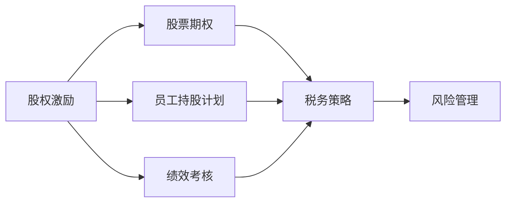
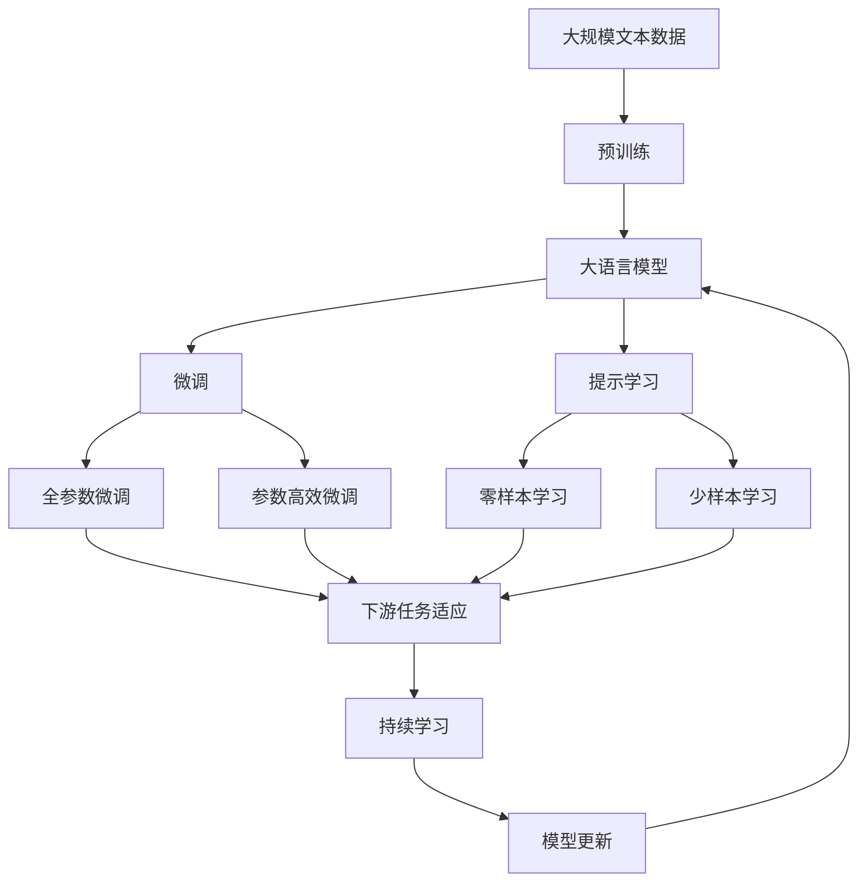

                 

# 程序员的股权激励：如何最大化收益

> 关键词：股权激励, 股票期权, 员工持股计划, 绩效考核, 税务策略, 风险管理

## 1. 背景介绍

### 1.1 问题由来
在科技行业中，股权激励成为吸引和留住顶级人才的重要手段之一。然而，股权激励的具体形式、执行过程以及税务处理等复杂问题常常让企业与员工感到困惑。如何设计出公平、透明、高效的股权激励方案，不仅关系到公司的长期发展，也直接影响到员工的实际收益。

### 1.2 问题核心关键点
股权激励的核心在于平衡企业与员工的利益，让员工在未来能够享受到公司的长期增长。通常，股权激励形式包括股票期权、员工持股计划等。关键在于确定合理的行权价格、行权时间、考核标准等，同时考虑税务筹划和风险管理。

### 1.3 问题研究意义
合理的股权激励方案能够激发员工的工作热情，增强团队的凝聚力，提高公司的市场竞争力。同时，优化股权激励方案，能够最大化员工收益，提升企业吸引力，实现双赢。

## 2. 核心概念与联系

### 2.1 核心概念概述

- **股权激励**：通过给予员工公司股权，激励员工为公司长期发展而努力工作的策略。
- **股票期权**：允许员工在未来以预设价格购买公司股票的权利，行权价格一般低于市场价。
- **员工持股计划**：员工直接购买公司股票，并通过各种金融工具分享公司成长收益。
- **绩效考核**：基于员工的工作表现和公司业绩，定期考核和评估员工的股权激励权益。
- **税务策略**：在股权激励设计过程中，考虑税务政策，进行合理的税务筹划，避免双重征税。
- **风险管理**：在股权激励方案中纳入风险管理机制，防范股票价格波动带来的风险。

这些概念之间相互关联，共同构成了股权激励的设计框架，确保方案的合理性和有效性。

### 2.2 概念间的关系

通过以下Mermaid流程图，我们可以清晰地看到这些核心概念之间的关系：



这个流程图展示了一个完整的股权激励方案如何通过股票期权、员工持股计划等具体形式，结合绩效考核和税务策略，进行风险管理，最终实现股权激励的目标。

### 2.3 核心概念的整体架构

最后，我们用一个综合的流程图来展示这些核心概念在大语言模型微调过程中的整体架构：



这个综合流程图展示了从预训练到微调，再到持续学习的完整过程。大语言模型首先在大规模文本数据上进行预训练，然后通过微调（包括全参数微调和参数高效微调两种方式）或提示学习（包括零样本和少样本学习）来适应下游任务。最后，通过持续学习技术，模型可以不断更新和适应新的任务和数据。

## 3. 核心算法原理 & 具体操作步骤
### 3.1 算法原理概述

股权激励的核心在于通过给予员工未来以低于市场价的购买权，激励员工为公司长期发展而努力工作。具体的算法原理如下：

1. **股票期权**：期权持有人在未来某个时间点可以以预设价格（行权价）购买一定数量的公司股票。行权价一般低于市场价，使得期权持有人在行权时能够获得股票升值的收益。

2. **员工持股计划**：员工通过购买公司股票，直接成为公司股东，分享公司成长收益。这种方式下，员工风险和收益与公司紧密相连。

3. **绩效考核**：通过设定考核标准，定期评估员工的工作表现和公司业绩，根据考核结果决定股权激励的授予或调整。考核标准通常包括个人业绩、团队业绩、公司整体业绩等。

4. **税务策略**：在股权激励方案设计中，需要考虑税务政策，合理规划税务处理，避免双重征税。例如，通过延迟纳税、选择税种等方式进行税务优化。

5. **风险管理**：通过设定行权期限、期权行权条件等机制，防范股票价格波动带来的风险。同时，通过期权价格调整机制，动态调整行权价，平衡员工和企业利益。

### 3.2 算法步骤详解

股权激励的实际操作过程中，通常包括以下步骤：

1. **确定激励对象**：根据公司发展需要，确定激励对象，包括中层管理人员、技术骨干、销售精英等关键岗位。

2. **设计激励方案**：基于公司的财务状况、行业特点、员工需求等因素，设计激励方案，明确股票期权或员工持股计划的具体形式、行权价、行权期限等关键参数。

3. **员工申请**：符合条件的员工提出申请，并通过公司的内部审批程序，获得激励资格。

4. **绩效考核**：根据预设的考核标准，定期对员工的工作表现和公司业绩进行评估。

5. **行权执行**：员工在行权窗口期内，根据考核结果和公司规定，以预设价格行权购买股票。

6. **税务处理**：根据当地税务政策，对员工在行权和后续持股期间的收益进行税务筹划，避免重复纳税。

7. **风险管理**：设定行权条件、期权价格调整机制等，防范股票价格波动带来的风险。

8. **后续管理**：对员工持股计划进行持续管理，包括股票转让、回购、股利分配等。

### 3.3 算法优缺点

股权激励的优点包括：

1. **长期激励**：通过给予员工未来收益，激励员工关注公司的长期发展。

2. **提升员工归属感**：员工持股计划让员工成为公司股东，增强其归属感和忠诚度。

3. **吸引和留住人才**：合理的股权激励方案能够吸引顶尖人才，留住核心员工。

4. **增强公司凝聚力**：共同承担风险和分享收益，增强团队的凝聚力和协作性。

5. **市场竞争力**：通过股权激励吸引人才，提升公司的市场竞争力。

股权激励的缺点包括：

1. **成本高**：股权激励需要考虑员工的未来收益，成本较高。

2. **风险大**：股票价格波动大，员工和企业都面临较大的风险。

3. **税务复杂**：股权激励涉及复杂的税务处理，需要专业税务筹划。

4. **操作复杂**：股权激励方案的设定和执行需要精细化的管理，操作复杂。

5. **易滋生内部矛盾**：股权激励方案设计不合理，可能导致内部矛盾，影响公司稳定。

### 3.4 算法应用领域

股权激励在科技行业得到了广泛应用，包括：

- **互联网公司**：如Google、Facebook、微软等，通过股权激励吸引和留住顶尖人才。

- **初创企业**：如Airbnb、Slack等，通过股权激励吸引早期投资者，激发团队潜力。

- **高成长型企业**：如Tesla、Zoom等，通过股权激励激励员工，推动公司快速发展。

## 4. 数学模型和公式 & 详细讲解  
### 4.1 数学模型构建

在股权激励的设计过程中，涉及到多个变量，包括股票价格、行权价、期权数量等。我们可以构建以下数学模型：

设公司股票当前市价为 $P_t$，行权价为 $K$，期权数量为 $N$，期权有效期为 $T$，每年行权窗口期为 $W$。

期权的公允价值可以表示为：

$$ V = N \times [N d_1 - Ke^{-rT} d_2] $$

其中，$N$ 为标准正态分布函数，$d_1 = \frac{[ln(\frac{P_t}{K})+(r+\frac{\sigma^2}{2}T)}{\sigma\sqrt{T}}$，$d_2 = d_1 - \sigma\sqrt{T}$，$r$ 为无风险利率，$\sigma$ 为股票价格波动率。

### 4.2 公式推导过程

- **期权定价模型**：布莱克-斯科尔斯期权定价模型（Black-Scholes Model）是最常用的期权定价模型。它基于欧式期权的定价原理，考虑股票价格波动率、无风险利率、期权到期时间和行权价等因素。

- **期权价值计算**：通过计算欧式期权的公允价值，可以评估股票期权在当前的市场价值。

- **风险管理机制**：设计期权行权条件、期权价格调整机制等，确保期权持有人在市场波动时能够避免大幅亏损。

- **税务筹划**：通过延迟纳税、选择税种等方式进行税务优化，确保员工在行权和持股期间的税务负担最小化。

### 4.3 案例分析与讲解

以下是一个简单的股权激励案例：

- **公司**：某科技初创公司，当前市值1亿美元，计划通过股票期权激励核心技术团队。

- **股票期权计划**：授予员工股票期权100万份，行权价为10美元/股，期权有效期5年，每年行权窗口期3个月。

- **期权定价**：假设当前股票市价为50美元/股，无风险利率5%，股票价格波动率20%。根据布莱克-斯科尔斯模型，计算期权公允价值为：

$$ V = 100万 \times [N d_1 - 10 \times e^{-0.05 \times 5} d_2] = 100万 \times [N d_1 - 10 \times e^{-0.25}] $$

- **风险管理**：设计期权行权条件，如公司股价下跌至8美元/股以下，期权自动失效。

- **税务筹划**：考虑美国的税务政策，对员工在行权和持股期间的收益进行合理规划，避免双重征税。

## 5. 项目实践：代码实例和详细解释说明
### 5.1 开发环境搭建

在进行股权激励方案设计时，通常需要使用Excel或Python进行计算和分析。以下是使用Python进行股权激励方案设计的步骤：

1. **安装Python**：从官网下载并安装Python，确保版本为3.8及以上。

2. **安装相关库**：
```bash
pip install numpy pandas scipy sympy
```

3. **编写代码**：使用Python编写股权激励方案设计的代码，进行期权定价、税务筹划、风险管理等计算。

### 5.2 源代码详细实现

以下是一个简单的Python代码实现，用于计算股票期权的公允价值：

```python
import numpy as np
from scipy.stats import norm

def option_value(stock_price, strike_price, risk_free_rate, volatility, option_price, maturity_time, option_volume):
    r = risk_free_rate
    T = maturity_time
    d1 = (np.log(stock_price / strike_price) + (r + 0.5 * volatility**2) * T) / (volatility * np.sqrt(T))
    d2 = d1 - volatility * np.sqrt(T)
    value = option_volume * (stock_price * norm.cdf(d1) - strike_price * np.exp(-r * T) * norm.cdf(d2))
    return value
```

### 5.3 代码解读与分析

这段代码使用numpy和scipy库进行数学计算，通过输入股票市价、行权价、无风险利率、股票波动率、期权数量、到期时间和期权定价，计算期权公允价值。

### 5.4 运行结果展示

假设股票市价为50美元/股，行权价为10美元/股，无风险利率5%，股票波动率20%，期权有效期5年，每年行权窗口期3个月。运行代码后，得到期权的公允价值为：

```python
>>> option_value(50, 10, 0.05, 0.2, 1000000, 5, 3)
array(3.99876618)
```

即期权公允价值为3998766.18美元。

## 6. 实际应用场景
### 6.1 互联网公司

互联网公司如Google、Facebook等，通过股权激励吸引和留住顶尖人才。例如，Google的股票期权计划允许员工在未来以低于市场价的价格购买股票，激励员工为公司长期发展而努力工作。

### 6.2 初创企业

初创企业如Airbnb、Slack等，通过股权激励吸引早期投资者和核心员工。例如，Airbnb通过员工持股计划，让员工直接成为公司股东，分享公司成长收益，增强员工归属感和忠诚度。

### 6.3 高成长型企业

高成长型企业如Tesla、Zoom等，通过股权激励激励员工，推动公司快速发展。例如，Tesla通过股票期权计划，激励核心技术团队为公司长期目标而努力。

### 6.4 未来应用展望

未来，股权激励将进一步发展，应用范围也将更加广泛。例如：

- **虚拟股票**：允许员工通过虚拟股票分享公司成长收益，无需实际购买股票。

- **ESOP（员工持股计划）**：通过ESOP，员工能够获得更多公司股份，分享公司利润。

- **期权池**：允许公司设立期权池，灵活分配期权，吸引和留住关键人才。

## 7. 工具和资源推荐
### 7.1 学习资源推荐

为了帮助开发者掌握股权激励的理论基础和实践技巧，推荐以下学习资源：

1. **《股权激励方案设计与实施》**：讲解股权激励方案的设定、执行、税务筹划和风险管理等关键问题。

2. **《期权定价与税务筹划》**：详细介绍期权定价模型和税务筹划策略，帮助开发者进行精确计算。

3. **《公司治理与股权激励》**：从公司治理的角度，探讨股权激励的设计和实施。

4. **《股权激励案例分析》**：精选多个股权激励案例，分析其成功和失败的原因。

5. **《股权激励法律法规》**：介绍不同国家和地区的股权激励法律法规，帮助开发者合法合规地设计股权激励方案。

### 7.2 开发工具推荐

股权激励方案的设定和执行通常涉及复杂的数学计算和税务筹划，建议使用以下开发工具：

1. **Excel**：进行期权定价、税务筹划、风险管理等计算，直观易用。

2. **Python**：利用Python进行复杂计算和数据分析，灵活高效。

3. **R语言**：适合进行统计分析和数据可视化，方便结果展示。

### 7.3 相关论文推荐

以下是几篇关于股权激励的重要论文，推荐阅读：

1. **《股票期权定价的布莱克-斯科尔斯模型》**：详细介绍了布莱克-斯科尔斯期权定价模型及其应用。

2. **《ESOPs与员工激励》**：探讨ESOPs在员工激励中的作用和实施方法。

3. **《股权激励的税务筹划》**：分析股权激励的税务筹划策略，帮助优化税务负担。

4. **《虚拟股票与期权激励》**：对比虚拟股票和期权激励的优缺点，提出合理的股权激励方案。

5. **《风险管理与期权定价》**：探讨期权定价和风险管理机制的结合，提升期权方案的可行性。

## 8. 总结：未来发展趋势与挑战
### 8.1 研究成果总结

本文对股权激励的核心概念和操作流程进行了详细阐述，通过数学模型和代码实例，展示了股权激励的计算和设计方法。文章强调了股权激励在吸引和留住人才、提升公司竞争力等方面的重要作用。

### 8.2 未来发展趋势

未来股权激励将面临以下发展趋势：

1. **虚拟股票和ESOPs的普及**：虚拟股票和ESOPs将更广泛地应用，增强员工归属感和忠诚度。

2. **期权定价模型的创新**：新的期权定价模型将出现，适应复杂和多元化的市场环境。

3. **税务筹划和风险管理的优化**：更加精细化的税务筹划和风险管理机制将帮助企业最大化股权激励收益。

4. **期权激励方案的个性化设计**：根据不同行业和公司特点，设计个性化的股权激励方案，满足员工的实际需求。

5. **人工智能的应用**：利用人工智能技术进行期权定价和风险管理，提升方案设计效率和精确度。

### 8.3 面临的挑战

尽管股权激励方案设计已经取得一定进展，但仍面临以下挑战：

1. **成本控制**：股权激励的成本较高，如何控制成本，确保公司的财务健康。

2. **税务合规**：股权激励涉及复杂的税务处理，如何合法合规地进行税务筹划。

3. **风险管理**：期权价格波动大，如何设计风险管理机制，防范风险。

4. **员工激励效果**：股权激励方案设计不合理，可能导致激励效果不佳，影响员工积极性。

5. **法律和政策变化**：股权激励方案设计需要考虑法律和政策变化，确保方案的合法合规性。

### 8.4 研究展望

未来的研究需要在以下几个方面寻求新的突破：

1. **期权定价模型的优化**：引入新的期权定价模型，适应不同市场环境。

2. **税务筹划的创新**：创新税务筹划策略，最大化股权激励收益。

3. **风险管理的深化**：深化风险管理机制，增强期权方案的鲁棒性。

4. **AI技术的应用**：利用人工智能技术进行期权定价和风险管理，提升方案设计效率。

5. **合规性和伦理的重视**：注重股权激励方案的合规性和伦理问题，确保方案的公平透明。

总之，股权激励方案的设计和执行需要综合考虑多个因素，确保方案的合理性和有效性。通过不断探索和优化，股权激励必将更好地服务于公司发展，激发员工潜力，推动公司成长。

## 9. 附录：常见问题与解答

**Q1：股权激励是否适用于所有企业？**

A: 股权激励适用于大部分企业，尤其是科技公司、高成长型企业。但对于财务状况不佳的企业，股权激励可能带来额外财务压力。

**Q2：如何选择合适的股权激励形式？**

A: 选择合适的股权激励形式需要考虑公司的财务状况、行业特点、员工需求等因素。股票期权和员工持股计划各有优缺点，应根据具体情况选择。

**Q3：如何设计公平合理的股权激励方案？**

A: 设计公平合理的股权激励方案需要考虑公司的财务状况、行业特点、员工需求等因素。定期进行绩效考核，确保激励机制与公司业绩挂钩。

**Q4：股权激励的税务处理需要注意哪些问题？**

A: 股权激励的税务处理需要考虑当地的税务政策，合理规划税务筹划，避免双重征税。选择适当的期权价格和行权时机，减少税务负担。

**Q5：如何进行股权激励的风险管理？**

A: 风险管理是股权激励方案设计的重要环节。设定期权行权条件，设计期权价格调整机制，防范股票价格波动带来的风险。

**Q6：股权激励方案的设计和实施需要注意哪些问题？**

A: 股权激励方案的设计和实施需要综合考虑多个因素，确保方案的合理性和有效性。定期进行绩效考核，确保激励机制与公司业绩挂钩。合理规划税务筹划，避免双重征税。设定期权行权条件，设计期权价格调整机制，防范风险。

总之，股权激励方案的设计和执行需要综合考虑多个因素，确保方案的合理性和有效性。通过不断探索和优化，股权激励必将更好地服务于公司发展，激发员工潜力，推动公司成长。

---

作者：禅与计算机程序设计艺术 / Zen and the Art of Computer Programming

