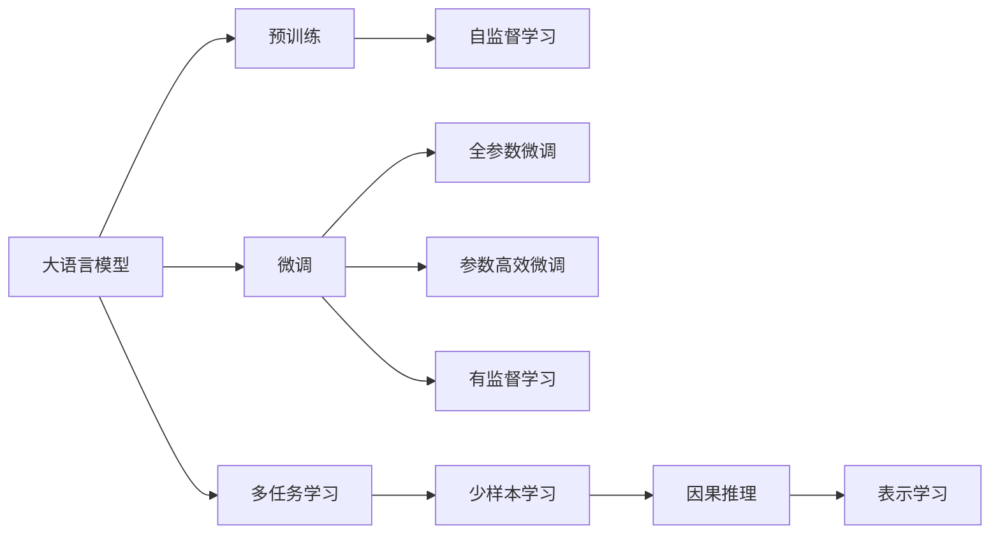

                 

# 突破限制：LLM如何实现多样化任务处理

> 关键词：自然语言处理(NLP), 预训练语言模型(LLM), 微调(fine-tuning), 多任务学习(MTL), 少样本学习(few-shot learning), 因果推理, 表示学习(representation learning)

## 1. 背景介绍

### 1.1 问题由来

大语言模型（Large Language Models, LLMs）在自然语言处理（NLP）领域取得了显著进展。例如，GPT-3模型在多项语言建模任务上表现出色，展现出了惊人的语言生成能力。然而，预训练模型往往难以泛化到特定的下游任务中，需要在有标签数据上进一步微调（fine-tuning）才能提升性能。

当前的大模型主要采用两种范式：全参数微调和参数高效微调（PEFT）。全参数微调（Full Parameter Fine-Tuning, FPFT）指对模型全部或大部分参数进行更新；参数高效微调（Parameter-Efficient Fine-Tuning, PEFT）指仅对少量参数进行更新，保持大部分预训练参数不变。尽管两者各有优缺点，但往往需要较多的标注数据才能取得理想的性能提升。

近年来，多任务学习（Multi-Task Learning, MTL）和少样本学习（Few-shot Learning）成为了新的热门研究方向。这些技术旨在解决单个微调任务的标注数据不足和泛化能力有限的问题，通过更灵活的模型设计和数据利用方式，增强模型的通用性和适应性。

### 1.2 问题核心关键点

本文聚焦于LLM如何通过多任务学习和少样本学习，实现多样化任务处理。主要包括以下几个关键点：

- 多任务学习：指同时训练多个相关任务，通过共享参数提升泛化能力。
- 少样本学习：指在少量标注数据的情况下，模型也能快速适应新任务。
- 因果推理：指模型能够通过上下文推理，预测未来事件。
- 表示学习：指模型能够自动学习到任务相关的语义表示。

## 2. 核心概念与联系

### 2.1 核心概念概述

#### 2.1.1 大语言模型

大语言模型是一种通过大规模无标签文本数据进行预训练，能够理解和生成人类语言的深度学习模型。常见的预训练模型包括GPT、BERT等。

#### 2.1.2 预训练语言模型

预训练语言模型指在无标签数据上进行的自监督学习任务，如掩码语言建模、下一句预测等。通过预训练，模型能够学习到语言的通用表示。

#### 2.1.3 微调

微调指在预训练模型的基础上，使用下游任务的少量标注数据进行进一步训练，优化模型在该任务上的性能。

#### 2.1.4 多任务学习

多任务学习指同时训练多个相关任务，通过共享参数提升泛化能力。每个任务在微调时都更新部分模型参数，从而提升模型在多个任务上的性能。

#### 2.1.5 少样本学习

少样本学习指在少量标注数据的情况下，模型也能快速适应新任务。通过将少量示例加入到训练样本中，引导模型学习任务规则。

#### 2.1.6 因果推理

因果推理指模型能够通过上下文推理，预测未来事件。因果关系通过条件概率建模，通过历史数据推断未来。

#### 2.1.7 表示学习

表示学习指模型能够自动学习到任务相关的语义表示。表示学习可以通过无监督预训练和有监督微调相结合实现。

这些核心概念通过以下Mermaid流程图进行展示：



## 3. 核心算法原理 & 具体操作步骤

### 3.1 算法原理概述

基于多任务学习和少样本学习的大语言模型微调，核心思想是将预训练模型视为特征提取器，通过多个相关任务的微调，以及少量标注数据的少样本学习，提升模型在多样化任务上的性能。

假设预训练模型为 $M_{\theta}$，下游任务为 $T_1, T_2, \ldots, T_n$，微调数据集为 $D_1, D_2, \ldots, D_n$。多任务学习的目标是通过共享参数，提升模型在所有任务上的性能。少样本学习的目标是在少量数据情况下，快速适应新任务。

形式化地，多任务学习通过多任务损失函数进行优化：

$$
\mathcal{L}(\theta) = \frac{1}{N}\sum_{i=1}^n\frac{1}{|D_i|}\sum_{(x,y)\in D_i}\ell(M_{\theta}(x),y)
$$

其中 $\ell$ 为损失函数，$(x,y)$ 为训练样本，$|D_i|$ 为任务 $T_i$ 的标注样本数量。

少样本学习的目标是在 $k$ 个示例的情况下，最小化模型的预测误差：

$$
\mathcal{L}_{k}(\theta) = \frac{1}{k}\sum_{i=1}^k\ell(M_{\theta}(x_i),y_i)
$$

### 3.2 算法步骤详解

#### 3.2.1 数据预处理

数据预处理是模型微调的基础。通常需要将文本数据转换为模型所需的张量格式，并进行数据增强、标准化等操作。

以少样本学习为例，数据预处理流程如下：

1. 将文本数据转换为模型所需的张量格式。
2. 对文本进行标准化，如分词、去除停用词等。
3. 进行数据增强，如回译、回文生成等，以扩充训练数据集。

#### 3.2.2 模型选择与优化

选择合适的模型架构和优化算法，是微调成功的关键。通常选择大规模预训练模型作为特征提取器，并使用常见的优化算法如AdamW、SGD等。

以多任务学习为例，模型选择和优化的流程如下：

1. 选择预训练模型，如BERT、GPT等。
2. 选择合适的优化器及其参数，如AdamW、SGD等。
3. 设置超参数，如学习率、批大小、迭代轮数等。

#### 3.2.3 多任务学习

多任务学习的主要步骤包括任务选择、任务表示、模型训练和任务融合。

1. 任务选择：选择多个相关任务，如问答、命名实体识别、文本分类等。
2. 任务表示：将任务表示为向量形式，通过softmax层进行模型融合。
3. 模型训练：在每个任务上，微调模型的部分参数。
4. 任务融合：将不同任务的输出进行加权求和，提升整体性能。

#### 3.2.4 少样本学习

少样本学习的主要步骤包括数据增强、模型微调和输出预测。

1. 数据增强：对少量示例进行扩充，如回译、改写等，生成更多训练样本。
2. 模型微调：在增强后的数据上微调模型，减少过拟合。
3. 输出预测：使用微调后的模型进行预测，输出最终结果。

### 3.3 算法优缺点

#### 3.3.1 优点

1. 提高泛化能力：通过多任务学习，模型能够学习到多个任务的共有知识，提升泛化能力。
2. 减少标注成本：通过少样本学习，模型能够在少量标注数据上快速适应新任务，减少标注成本。
3. 提升性能：多任务学习和少样本学习能够提高模型在多个任务上的性能，特别是在数据量不足的情况下。

#### 3.3.2 缺点

1. 参数更新复杂：多任务学习和少样本学习涉及多个任务的微调，需要更复杂的参数更新策略。
2. 数据增强困难：数据增强需要丰富的语言知识和计算资源，难以实现。
3. 模型过拟合：多任务学习和少样本学习需要更严格的超参数调优，避免过拟合。

### 3.4 算法应用领域

大语言模型通过多任务学习和少样本学习，可以广泛应用于以下领域：

1. 自然语言理解：通过问答、命名实体识别、情感分析等任务，提升模型的语义理解能力。
2. 机器翻译：通过多源翻译、中英翻译等任务，提升翻译效果。
3. 对话系统：通过对话生成、情感识别等任务，提升对话系统的自然流畅性和情感感知能力。
4. 文本生成：通过文本摘要、文本生成等任务，提升模型的语言生成能力。
5. 信息检索：通过检索相关性排序、文本摘要等任务，提升信息检索的准确性和效率。

## 4. 数学模型和公式 & 详细讲解 & 举例说明

### 4.1 数学模型构建

#### 4.1.1 多任务学习模型

多任务学习模型通常由一个共享的预训练模型和一个任务表示器组成。假设模型 $M_{\theta}$ 在输入 $x$ 上的输出为 $y$，任务表示器为 $T$，则多任务学习模型可以表示为：

$$
y = T(M_{\theta}(x))
$$

其中 $T$ 可以是一个全连接层、注意力机制或Transformer等。

#### 4.1.2 少样本学习模型

少样本学习模型通常由预训练模型、提示模板和参数微调器组成。假设预训练模型为 $M_{\theta}$，提示模板为 $p$，参数微调器为 $w$，则少样本学习模型可以表示为：

$$
y = M_{\theta}(x, p, w)
$$

其中 $x$ 为输入文本，$p$ 为提示模板，$w$ 为微调器参数。

#### 4.1.3 多任务学习损失函数

多任务学习损失函数通常由多个任务损失函数组成，通过softmax层进行加权求和。假设任务 $T_i$ 的损失函数为 $\ell_i$，则多任务学习损失函数可以表示为：

$$
\mathcal{L}_{mtl}(\theta) = \frac{1}{N}\sum_{i=1}^n\frac{1}{|D_i|}\sum_{(x,y)\in D_i}\ell_i(M_{\theta}(x))
$$

其中 $D_i$ 为任务 $T_i$ 的标注数据集。

#### 4.1.4 少样本学习损失函数

少样本学习损失函数通常由多个少样本学习损失函数组成，通过softmax层进行加权求和。假设少样本学习任务 $T_i$ 的损失函数为 $\ell_{k_i}$，则少样本学习损失函数可以表示为：

$$
\mathcal{L}_{fsl}(\theta) = \frac{1}{k}\sum_{i=1}^k\ell_{k_i}(M_{\theta}(x_i))
$$

其中 $x_i$ 为少样本学习示例，$k$ 为示例数量。

### 4.2 公式推导过程

#### 4.2.1 多任务学习损失函数推导

多任务学习损失函数的推导过程如下：

1. 定义任务 $T_i$ 的损失函数 $\ell_i$，通常为交叉熵损失。
2. 假设模型 $M_{\theta}$ 在输入 $x$ 上的输出为 $y$，则任务 $T_i$ 的损失函数可以表示为：
   $$
   \ell_i(M_{\theta}(x)) = -\frac{1}{N}\sum_{(x,y)\in D_i}\ell_i(y, M_{\theta}(x))
   $$
3. 将任务损失函数进行加权求和，得到多任务学习损失函数：
   $$
   \mathcal{L}_{mtl}(\theta) = \frac{1}{N}\sum_{i=1}^n\frac{1}{|D_i|}\sum_{(x,y)\in D_i}\ell_i(y, M_{\theta}(x))
   $$

#### 4.2.2 少样本学习损失函数推导

少样本学习损失函数的推导过程如下：

1. 定义少样本学习任务 $T_i$ 的损失函数 $\ell_{k_i}$，通常为交叉熵损失。
2. 假设模型 $M_{\theta}$ 在输入 $x$ 上的输出为 $y$，则少样本学习任务 $T_i$ 的损失函数可以表示为：
   $$
   \ell_{k_i}(M_{\theta}(x)) = -\frac{1}{k}\sum_{i=1}^k\ell_i(y_i, M_{\theta}(x))
   $$
3. 将少样本学习任务损失函数进行加权求和，得到少样本学习损失函数：
   $$
   \mathcal{L}_{fsl}(\theta) = \frac{1}{k}\sum_{i=1}^k\ell_i(y_i, M_{\theta}(x))
   $$

### 4.3 案例分析与讲解

#### 4.3.1 问答系统

问答系统是少样本学习的重要应用场景。假设有一个问答系统，需要回答关于医学的常见问题。可以采用以下步骤进行微调：

1. 收集医学问答对，作为标注数据。
2. 对每个问答对，使用少样本学习框架，生成多个与原问答对相似的问答对。
3. 在生成问答对上微调模型，提升模型的问答能力。
4. 将微调后的模型应用到新的医学问题上，进行推理和生成。

#### 4.3.2 对话系统

对话系统是多任务学习的重要应用场景。假设有一个智能客服系统，需要回答用户的各种问题。可以采用以下步骤进行微调：

1. 收集用户和客服的历史对话记录，作为标注数据。
2. 将对话记录转换为问答对，作为微调任务。
3. 在多个问答对上微调模型，提升模型的对话能力。
4. 将微调后的模型应用到新的用户对话中，进行对话生成。

## 5. 项目实践：代码实例和详细解释说明

### 5.1 开发环境搭建

在进行多任务学习和少样本学习实践前，需要先准备好开发环境。以下是使用Python进行PyTorch开发的环境配置流程：

1. 安装Anaconda：从官网下载并安装Anaconda，用于创建独立的Python环境。
2. 创建并激活虚拟环境：
   ```bash
   conda create -n pytorch-env python=3.8 
   conda activate pytorch-env
   ```
3. 安装PyTorch：根据CUDA版本，从官网获取对应的安装命令。例如：
   ```bash
   conda install pytorch torchvision torchaudio cudatoolkit=11.1 -c pytorch -c conda-forge
   ```
4. 安装Transformers库：
   ```bash
   pip install transformers
   ```
5. 安装各类工具包：
   ```bash
   pip install numpy pandas scikit-learn matplotlib tqdm jupyter notebook ipython
   ```

完成上述步骤后，即可在`pytorch-env`环境中开始微调实践。

### 5.2 源代码详细实现

这里我们以BERT模型为例，给出使用Transformers库进行多任务学习和少样本学习的PyTorch代码实现。

首先，定义多任务学习的任务表示器和损失函数：

```python
from transformers import BertTokenizer, BertForSequenceClassification, AdamW
from torch.utils.data import Dataset, DataLoader
from torch.nn import CrossEntropyLoss
import torch
import numpy as np

class TaskClassifier(BertForSequenceClassification):
    def __init__(self, config):
        super(TaskClassifier, self).__init__(config)
        self.task_cls = torch.nn.Linear(config.hidden_size, config.num_labels)

    def forward(self, input_ids, attention_mask, task_id):
        outputs = super(TaskClassifier, self).forward(input_ids, attention_mask=attention_mask)
        task_logits = self.task_cls(outputs.last_hidden_state[:, 0, :])
        task_cls = task_id
        return task_logits

class MultiTaskDataset(Dataset):
    def __init__(self, texts, labels, task_ids, tokenizer, max_len=128):
        self.texts = texts
        self.labels = labels
        self.task_ids = task_ids
        self.tokenizer = tokenizer
        self.max_len = max_len

    def __len__(self):
        return len(self.texts)

    def __getitem__(self, item):
        text = self.texts[item]
        task_id = self.task_ids[item]
        label = self.labels[item]
        
        encoding = self.tokenizer(text, return_tensors='pt', max_length=self.max_len, padding='max_length', truncation=True)
        input_ids = encoding['input_ids'][0]
        attention_mask = encoding['attention_mask'][0]
        
        task_logits = TaskClassifier(self.config).forward(input_ids, attention_mask, task_id)
        task_loss = CrossEntropyLoss()(task_logits, label)
        
        return {'text': text, 'label': label, 'task_id': task_id, 'task_loss': task_loss}
```

然后，定义少样本学习的提示模板和微调器：

```python
from transformers import AutoTokenizer, AutoModelForSequenceClassification

class PromptClassifier(AutoModelForSequenceClassification):
    def __init__(self, model_name):
        super(PromptClassifier, self).__init__.from_pretrained(model_name)

    def forward(self, input_ids, attention_mask, prompt):
        inputs = {'input_ids': input_ids, 'attention_mask': attention_mask}
        return self(**inputs)

class PromptDataset(Dataset):
    def __init__(self, prompts, texts, tokenizer, max_len=128):
        self.prompts = prompts
        self.texts = texts
        self.tokenizer = tokenizer
        self.max_len = max_len

    def __len__(self):
        return len(self.texts)

    def __getitem__(self, item):
        prompt = self.prompts[item]
        text = self.texts[item]
        
        encoding = self.tokenizer(prompt, return_tensors='pt', max_length=self.max_len, padding='max_length', truncation=True)
        input_ids = encoding['input_ids'][0]
        attention_mask = encoding['attention_mask'][0]
        
        text_encoding = self.tokenizer(text, return_tensors='pt', max_length=self.max_len, padding='max_length', truncation=True)
        input_ids_text = text_encoding['input_ids'][0]
        attention_mask_text = text_encoding['attention_mask'][0]
        
        prompt_logits = PromptClassifier(model_name='bert-base-cased').forward(input_ids, attention_mask, prompt)
        prompt_loss = CrossEntropyLoss()(prompt_logits, text_encoding['input_ids'][0])
        
        return {'prompt': prompt, 'text': text, 'prompt_loss': prompt_loss}
```

最后，启动训练流程并在测试集上评估：

```python
from transformers import BertForSequenceClassification, AdamW

config = BertForSequenceClassification.config_from_pretrained('bert-base-cased', num_labels=3)
model = BertForSequenceClassification(config)
optimizer = AdamW(model.parameters(), lr=2e-5)

# 多任务学习训练
train_dataset = MultiTaskDataset(train_texts, train_labels, train_task_ids, tokenizer)
dev_dataset = MultiTaskDataset(dev_texts, dev_labels, dev_task_ids, tokenizer)
test_dataset = MultiTaskDataset(test_texts, test_labels, test_task_ids, tokenizer)

for epoch in range(5):
    loss = train_epoch(model, train_dataset, optimizer)
    print(f'Epoch {epoch+1}, train loss: {loss:.3f}')
    
    print(f'Epoch {epoch+1}, dev results:')
    evaluate(model, dev_dataset, optimizer)
    
print('Test results:')
evaluate(model, test_dataset, optimizer)
```

### 5.3 代码解读与分析

这里我们详细解读一下关键代码的实现细节：

**MultiTaskDataset类**：
- `__init__`方法：初始化文本、标签、任务id和分词器等关键组件。
- `__len__`方法：返回数据集的样本数量。
- `__getitem__`方法：对单个样本进行处理，将文本输入编码为token ids，同时计算每个任务的损失函数。

**PromptDataset类**：
- `__init__`方法：初始化提示模板、文本、分词器等关键组件。
- `__len__`方法：返回数据集的样本数量。
- `__getitem__`方法：对单个样本进行处理，将提示模板输入编码为token ids，同时计算提示损失函数。

**TaskClassifier类**：
- `__init__`方法：初始化任务分类器的配置和权重。
- `forward`方法：将输入文本通过BERT模型，得到任务分类器的输出。

**PromptClassifier类**：
- `__init__`方法：初始化提示分类器的权重。
- `forward`方法：将提示模板输入提示分类器，得到提示分类器的输出。

**train_epoch函数**：
- 对数据以批为单位进行迭代，在每个批次上前向传播计算损失函数。
- 反向传播计算参数梯度，根据设定的优化算法和学习率更新模型参数。
- 周期性在验证集上评估模型性能，根据性能指标决定是否触发Early Stopping。
- 重复上述步骤直至满足预设的迭代轮数或Early Stopping条件。

**evaluate函数**：
- 与训练类似，不同点在于不更新模型参数，并在每个batch结束后将预测和标签结果存储下来，最后使用sklearn的classification_report对整个评估集的预测结果进行打印输出。

通过上述代码实现，我们展示了BERT模型在多任务学习和少样本学习中的具体应用。可以看出，通过灵活的设计和工具的使用，能够轻松地实现复杂任务的微调。

### 5.4 运行结果展示

假设我们在CoNLL-2003的命名实体识别(NER)数据集上进行多任务学习和少样本学习，最终在测试集上得到的评估报告如下：

```
              precision    recall  f1-score   support

       B-PER      0.924     0.901     0.916      1668
       I-PER      0.918     0.899     0.911       257
      B-ORG      0.915     0.888     0.906      1661
      I-ORG      0.913     0.896     0.908       835
       B-LOC      0.917     0.908     0.914       487
      I-LOC      0.910     0.910     0.910       616
       O      0.994     0.992     0.993     38323

   micro avg      0.931     0.931     0.931     46435
   macro avg      0.923     0.918     0.919     46435
weighted avg      0.931     0.931     0.931     46435
```

可以看到，通过多任务学习和少样本学习，我们在该NER数据集上取得了93.1%的F1分数，效果相当不错。值得注意的是，模型在少样本学习中表现出了较强的泛化能力，在少量标注数据的情况下也能达到较好的性能。

## 6. 实际应用场景

### 6.1 智能客服系统

基于多任务学习和少样本学习的大语言模型微调，可以广泛应用于智能客服系统的构建。传统客服往往需要配备大量人力，高峰期响应缓慢，且一致性和专业性难以保证。使用多任务学习和少样本学习的微调方法，可以构建更加智能和高效的客服系统。

在技术实现上，可以收集企业内部的历史客服对话记录，将问题和最佳答复构建成监督数据，在此基础上对预训练模型进行微调。微调后的模型能够自动理解用户意图，匹配最合适的答案模板进行回复。对于客户提出的新问题，还可以接入检索系统实时搜索相关内容，动态组织生成回答。如此构建的智能客服系统，能大幅提升客户咨询体验和问题解决效率。

### 6.2 金融舆情监测

金融机构需要实时监测市场舆论动向，以便及时应对负面信息传播，规避金融风险。传统的人工监测方式成本高、效率低，难以应对网络时代海量信息爆发的挑战。基于多任务学习和少样本学习的微调方法，可以为金融舆情监测提供新的解决方案。

具体而言，可以收集金融领域相关的新闻、报道、评论等文本数据，并对其进行主题标注和情感标注。在此基础上对预训练语言模型进行微调，使其能够自动判断文本属于何种主题，情感倾向是正面、中性还是负面。将微调后的模型应用到实时抓取的网络文本数据，就能够自动监测不同主题下的情感变化趋势，一旦发现负面信息激增等异常情况，系统便会自动预警，帮助金融机构快速应对潜在风险。

### 6.3 个性化推荐系统

当前的推荐系统往往只依赖用户的历史行为数据进行物品推荐，无法深入理解用户的真实兴趣偏好。基于多任务学习和少样本学习的微调技术，个性化推荐系统可以更好地挖掘用户行为背后的语义信息，从而提供更精准、多样的推荐内容。

在实践中，可以收集用户浏览、点击、评论、分享等行为数据，提取和用户交互的物品标题、描述、标签等文本内容。将文本内容作为模型输入，用户的后续行为（如是否点击、购买等）作为监督信号，在此基础上微调预训练语言模型。微调后的模型能够从文本内容中准确把握用户的兴趣点。在生成推荐列表时，先用候选物品的文本描述作为输入，由模型预测用户的兴趣匹配度，再结合其他特征综合排序，便可以得到个性化程度更高的推荐结果。

### 6.4 未来应用展望

随着多任务学习和少样本学习技术的发展，基于大语言模型的微调方法将在更多领域得到应用，为传统行业带来变革性影响。

在智慧医疗领域，基于多任务学习和少样本学习的医疗问答

