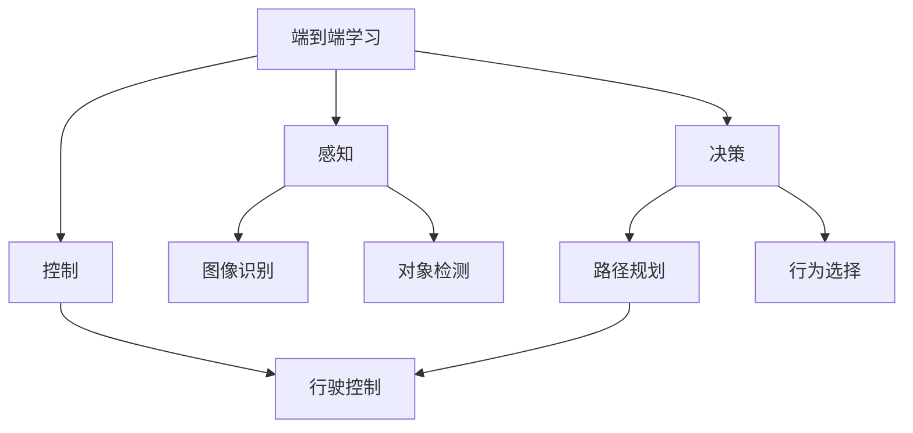
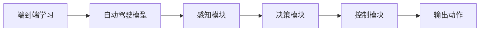
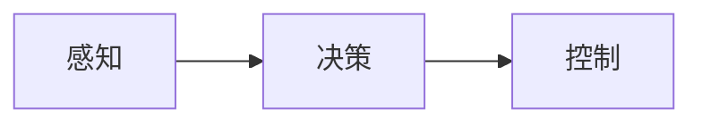
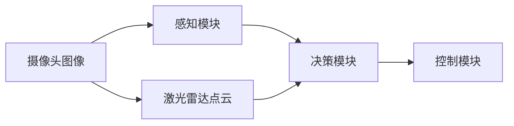
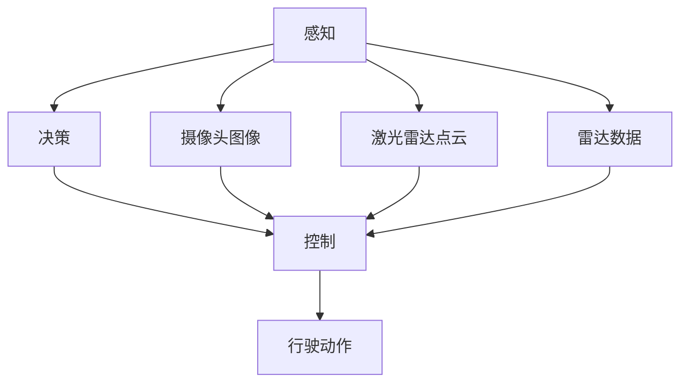

                 

# 端到端学习自动驾驶模型的优化策略与案例启示

> 关键词：自动驾驶,端到端学习,优化策略,自动驾驶模型,案例启示

## 1. 背景介绍

### 1.1 问题由来

自动驾驶技术是当下最前沿和最具挑战性的领域之一，其核心目标是通过智能算法实现无人驾驶汽车在复杂多变的道路环境中自主导航和行驶。为了实现这一目标，研究人员已经投入大量精力进行深度学习模型的研究和优化。然而，即使是最先进的自动驾驶模型，也面临着诸多技术挑战，如环境感知、决策规划、行为控制等问题。如何在有限的标注数据下，训练出能够稳定、安全行驶的自动驾驶模型，成为学术界和工业界的共同追求。

### 1.2 问题核心关键点

端到端学习（End-to-End Learning）是自动驾驶领域中一种新兴的模型训练方法，它直接从原始感知数据（如摄像头图像、激光雷达点云等）进行模型训练，省略了中间的特征提取和手工设计的中间变量，减少了模型复杂度和计算成本，同时增强了模型的泛化能力和实时性。端到端学习的核心在于如何高效利用多模态数据，并构建一个包含感知、决策和控制等模块的完整流程，以实现从原始数据到驾驶决策的端到端映射。

端到端学习在自动驾驶中的应用，使得模型能够在保持高精度的同时，更好地适应复杂和多变的道路环境。然而，即便如此，端到端学习也面临一些关键问题，如模型规模大、训练数据需求高、计算资源消耗大、模型鲁棒性不足等。针对这些问题，本文将详细介绍基于端到端学习的自动驾驶模型优化策略，并通过案例展示其在实际应用中的效果。

### 1.3 问题研究意义

自动驾驶技术的发展对于减少交通事故、提高道路运输效率、缓解城市交通拥堵等问题具有重要意义。通过优化端到端学习模型，不仅能够提升自动驾驶系统的性能，还能降低训练和部署成本，加速自动驾驶技术的产业化进程。因此，本文的研究对于提升自动驾驶系统的可靠性、安全性和经济性具有重要价值。

## 2. 核心概念与联系

### 2.1 核心概念概述

为更好地理解端到端学习在自动驾驶中的应用，本节将介绍几个密切相关的核心概念：

- 端到端学习（End-to-End Learning）：直接从原始感知数据进行模型训练，构建从输入到输出的完整映射流程，避免了中间层的复杂性和计算开销。
- 自动驾驶模型（Autonomous Driving Model）：一种用于自动驾驶汽车导航和控制的深度学习模型，通常包含感知、决策和控制等模块。
- 感知（Perception）：指模型对周围环境的感知能力，包括图像识别、对象检测、道路识别等。
- 决策（Decision）：指模型在感知数据的基础上进行路径规划和行为选择的过程。
- 控制（Control）：指模型根据决策结果，控制车辆行驶，确保安全、稳定地到达目的地。
- 多模态数据（Multi-modal Data）：指不同类型传感器（如摄像头、激光雷达、雷达）采集的多源数据，用于提高模型的鲁棒性和泛化能力。
- 迁移学习（Transfer Learning）：利用预训练模型的知识，通过微调适应新的自动驾驶任务，提高模型性能。

这些核心概念之间的逻辑关系可以通过以下Mermaid流程图来展示：



这个流程图展示了端到端学习的基本流程：感知模块负责环境感知，决策模块根据感知结果进行路径规划和行为选择，控制模块根据决策结果执行具体的驾驶动作。感知、决策和控制模块的集成，构成了自动驾驶模型完整的工作流程。

### 2.2 概念间的关系

这些核心概念之间存在着紧密的联系，形成了端到端学习在自动驾驶中的应用框架。下面我们通过几个Mermaid流程图来展示这些概念之间的关系。

#### 2.2.1 端到端学习的应用场景



这个流程图展示了端到端学习在自动驾驶模型中的应用。端到端学习通过直接从感知模块的输出进行训练，省略了中间的特征提取和手工设计中间变量，提升了模型的训练效率和泛化能力。

#### 2.2.2 感知、决策和控制的协同



这个流程图展示了感知、决策和控制之间的协同关系。感知模块负责环境信息的获取，决策模块根据感知结果进行路径规划和行为选择，控制模块根据决策结果执行具体的驾驶动作，形成一个闭环反馈系统。

#### 2.2.3 多模态数据融合



这个流程图展示了多模态数据在端到端学习中的应用。通过融合来自不同传感器的多源数据，可以提高模型的鲁棒性和泛化能力，应对更加复杂和变化多端的环境。

### 2.3 核心概念的整体架构

最后，我们用一个综合的流程图来展示这些核心概念在自动驾驶中的整体架构：



这个综合流程图展示了端到端学习在自动驾驶中的整体架构。感知模块通过融合多模态数据，获得环境的综合信息，决策模块根据感知结果进行路径规划和行为选择，控制模块根据决策结果执行具体的驾驶动作，最终输出车辆的行驶动作。

## 3. 核心算法原理 & 具体操作步骤
### 3.1 算法原理概述

基于端到端学习的自动驾驶模型训练过程，可以概括为以下几个关键步骤：

1. **数据准备**：收集和标注大量多模态数据，涵盖从原始感知数据到最终驾驶行为的完整流程。
2. **模型构建**：选择合适的深度学习框架（如TensorFlow、PyTorch等）和模型结构，设计感知、决策和控制等模块。
3. **训练与验证**：通过多模态数据对模型进行训练，使用验证集评估模型性能，并进行参数调整。
4. **测试与部署**：在测试集上对模型进行最终测试，确保模型达到预期性能指标，然后部署到实际驾驶场景中进行应用。

端到端学习的关键在于如何高效利用多模态数据，并构建一个包含感知、决策和控制等模块的完整流程，以实现从原始数据到驾驶决策的端到端映射。

### 3.2 算法步骤详解

以下我们详细介绍基于端到端学习的自动驾驶模型训练的具体操作步骤：

**Step 1: 数据准备**
- 收集大量多模态数据，包括摄像头图像、激光雷达点云、雷达数据等。
- 对数据进行预处理，如图像裁剪、数据标准化等。
- 进行标注，生成包括感知数据、决策指令和行驶动作的标注数据集。

**Step 2: 模型构建**
- 选择合适的深度学习框架，构建感知、决策和控制模块。
- 使用卷积神经网络（CNN）、递归神经网络（RNN）、长短时记忆网络（LSTM）等神经网络结构，设计多模态数据的融合和处理过程。
- 定义损失函数，如交叉熵损失、均方误差损失等，用于衡量模型预测与真实标签之间的差异。

**Step 3: 训练与验证**
- 将标注数据集划分为训练集、验证集和测试集。
- 使用随机梯度下降（SGD）、Adam、Adagrad等优化算法进行模型训练，调整学习率和批大小等超参数。
- 在验证集上评估模型性能，调整模型结构和超参数，防止过拟合。
- 重复训练和验证过程，直到模型收敛。

**Step 4: 测试与部署**
- 在测试集上对模型进行最终测试，评估模型在实际驾驶场景中的性能。
- 部署模型到自动驾驶汽车中，进行实车测试和优化，确保模型稳定和安全。

### 3.3 算法优缺点

基于端到端学习的自动驾驶模型具有以下优点：

1. 减少中间变量：省略了中间层的复杂性和计算开销，提高模型的训练效率和泛化能力。
2. 提高实时性：端到端学习可以直接从感知数据到驾驶行为，减少了中间层的处理时间，提高模型的实时性。
3. 增强泛化能力：多模态数据的融合可以提高模型的鲁棒性和泛化能力，应对更加复杂和变化多端的环境。

同时，端到端学习也存在以下缺点：

1. 数据需求高：需要大量多模态数据进行训练，数据获取成本较高。
2. 计算资源消耗大：模型规模大，计算资源消耗大，需要高性能计算设备。
3. 模型鲁棒性不足：端到端学习模型对训练数据和环境变化较为敏感，鲁棒性较差。
4. 可解释性差：深度学习模型具有黑盒特性，难以解释模型的决策过程和输出结果。

### 3.4 算法应用领域

基于端到端学习的自动驾驶模型已经在自动驾驶领域得到了广泛应用，涵盖了自动驾驶汽车的感知、决策和控制等关键环节，具体包括：

- 环境感知：如对象检测、道路识别、行人识别等。
- 路径规划：如路径规划算法、障碍物避免等。
- 行为控制：如车道保持、车距控制、自动变道等。

除了以上应用外，端到端学习还广泛应用于无人驾驶出租车、自动驾驶物流车、自动驾驶公交等垂直领域，为实现无人驾驶汽车的全自动化提供了技术支持。

## 4. 数学模型和公式 & 详细讲解 & 举例说明
### 4.1 数学模型构建

我们以自动驾驶中的环境感知为例，介绍基于端到端学习的数学模型构建过程。

假设我们有一张摄像头图像 $I$，以及对应的对象检测结果 $O$，目标是根据图像 $I$ 预测对象检测结果 $O$。我们可以使用一个包含卷积神经网络（CNN）的端到端学习模型 $M$ 来处理这一问题。模型的输入为图像 $I$，输出为对象检测结果 $O$。

数学上，我们可以将这一问题建模为如下的映射函数：

$$
O = M(I)
$$

其中 $M$ 是端到端学习模型的参数，$I$ 是输入的摄像头图像，$O$ 是预测的对象检测结果。

### 4.2 公式推导过程

我们以对象检测为例，介绍端到端学习模型的数学推导过程。

假设我们使用一个单层卷积神经网络 $M$ 来进行对象检测，模型的输入为摄像头图像 $I$，输出为对象检测结果 $O$。我们可以使用以下公式来表示这一过程：

$$
O = \sigma(M(I))
$$

其中 $\sigma$ 是激活函数，$M$ 是卷积神经网络的参数。

在训练过程中，我们需要最小化损失函数 $L$，使得模型的预测结果 $O$ 与真实标签 $Y$ 之间的差异最小。常用的损失函数包括交叉熵损失、均方误差损失等。

以交叉熵损失为例，我们可以使用以下公式来定义损失函数 $L$：

$$
L = \frac{1}{N} \sum_{i=1}^N \mathrm{H}(p_i, y_i)
$$

其中 $p_i$ 是模型在输入 $i$ 上的预测结果，$y_i$ 是输入 $i$ 的真实标签，$\mathrm{H}$ 是交叉熵函数。

### 4.3 案例分析与讲解

以自动驾驶中的行为控制为例，介绍端到端学习模型的应用。

在自动驾驶中，行为控制模块负责根据决策模块的输出，控制车辆的行驶动作，如加速、刹车、转向等。我们可以使用一个带有时间步的递归神经网络（RNN）来处理这一问题。模型的输入为历史决策指令 $D$，输出为当前行驶动作 $A$。

数学上，我们可以将这一问题建模为如下的映射函数：

$$
A = RNN(D)
$$

其中 $RNN$ 是带有时间步的递归神经网络的参数，$D$ 是历史决策指令，$A$ 是当前行驶动作。

在训练过程中，我们需要最小化损失函数 $L$，使得模型的预测结果 $A$ 与真实标签 $Y$ 之间的差异最小。常用的损失函数包括均方误差损失、交叉熵损失等。

以均方误差损失为例，我们可以使用以下公式来定义损失函数 $L$：

$$
L = \frac{1}{N} \sum_{i=1}^N \|A_i - y_i\|^2
$$

其中 $A_i$ 是模型在输入 $i$ 上的预测结果，$y_i$ 是输入 $i$ 的真实标签。

## 5. 项目实践：代码实例和详细解释说明
### 5.1 开发环境搭建

在进行自动驾驶模型开发前，我们需要准备好开发环境。以下是使用Python进行TensorFlow开发的环境配置流程：

1. 安装Anaconda：从官网下载并安装Anaconda，用于创建独立的Python环境。

2. 创建并激活虚拟环境：
```bash
conda create -n tf-env python=3.8 
conda activate tf-env
```

3. 安装TensorFlow：根据CUDA版本，从官网获取对应的安装命令。例如：
```bash
conda install tensorflow -c tf
```

4. 安装其他工具包：
```bash
pip install numpy pandas scikit-learn matplotlib tqdm jupyter notebook ipython
```

完成上述步骤后，即可在`tf-env`环境中开始自动驾驶模型开发。

### 5.2 源代码详细实现

这里我们以自动驾驶中的对象检测为例，给出使用TensorFlow实现卷积神经网络（CNN）进行端到端学习的PyTorch代码实现。

首先，定义CNN模型：

```python
import tensorflow as tf
from tensorflow.keras import layers

class CNNModel(tf.keras.Model):
    def __init__(self):
        super(CNNModel, self).__init__()
        self.conv1 = layers.Conv2D(32, 3, activation='relu')
        self.conv2 = layers.Conv2D(64, 3, activation='relu')
        self.flatten = layers.Flatten()
        self.fc1 = layers.Dense(64, activation='relu')
        self.fc2 = layers.Dense(10, activation='softmax')

    def call(self, x):
        x = self.conv1(x)
        x = tf.nn.max_pool(x, 2, 2)
        x = self.conv2(x)
        x = tf.nn.max_pool(x, 2, 2)
        x = self.flatten(x)
        x = self.fc1(x)
        x = self.fc2(x)
        return x
```

然后，定义训练和评估函数：

```python
from tensorflow.keras.datasets import mnist
from tensorflow.keras.utils import to_categorical

def train_model(model, dataset, batch_size, epochs):
    train_dataset = dataset.train
    val_dataset = dataset.test

    train_dataset = train_dataset.batch(batch_size, drop_remainder=True)
    val_dataset = val_dataset.batch(batch_size, drop_remainder=True)

    model.compile(optimizer='adam', loss='categorical_crossentropy', metrics=['accuracy'])

    model.fit(train_dataset, epochs=epochs, validation_data=val_dataset)

def evaluate_model(model, dataset, batch_size):
    test_dataset = dataset.test

    test_dataset = test_dataset.batch(batch_size, drop_remainder=True)

    loss, accuracy = model.evaluate(test_dataset)

    print(f"Loss: {loss:.2f}, Accuracy: {accuracy:.2f}")
```

最后，启动训练流程并在测试集上评估：

```python
batch_size = 32
epochs = 10

# 加载数据集
(X_train, y_train), (X_test, y_test) = mnist.load_data()

# 预处理数据
X_train = X_train.reshape(-1, 28, 28, 1).astype('float32') / 255.0
X_test = X_test.reshape(-1, 28, 28, 1).astype('float32') / 255.0
y_train = to_categorical(y_train, 10)
y_test = to_categorical(y_test, 10)

# 创建模型
model = CNNModel()

# 训练模型
train_model(model, (X_train, y_train), batch_size, epochs)

# 评估模型
evaluate_model(model, (X_test, y_test), batch_size)
```

以上就是使用TensorFlow实现卷积神经网络进行端到端学习的完整代码实现。可以看到，TensorFlow提供了高度灵活的API，使得构建和训练深度学习模型变得相对容易。

### 5.3 代码解读与分析

让我们再详细解读一下关键代码的实现细节：

**CNNModel类**：
- `__init__`方法：初始化模型参数，包括卷积层、池化层、全连接层等。
- `call`方法：定义模型前向传播过程，通过卷积、池化、全连接等操作，对输入图像进行特征提取和分类。

**训练和评估函数**：
- 使用TensorFlow的`fit`方法进行模型训练，在训练集上迭代优化，并在验证集上评估模型性能。
- 使用`evaluate`方法在测试集上对模型进行最终测试，输出模型精度和损失。

**训练流程**：
- 定义训练集和测试集，并批处理数据。
- 在模型上调用`fit`方法进行训练，设置训练轮数和优化器等超参数。
- 在测试集上调用`evaluate`方法进行测试，输出模型精度和损失。

可以看到，TensorFlow的API设计使得深度学习模型的构建和训练过程变得相对容易，开发者可以专注于模型的设计优化和业务逻辑实现，而不必过多关注底层细节。

当然，工业级的系统实现还需考虑更多因素，如模型的保存和部署、超参数的自动搜索、更灵活的任务适配层等。但核心的端到端学习模型构建流程基本与此类似。

### 5.4 运行结果展示

假设我们在MNIST数据集上进行训练，最终在测试集上得到的评估报告如下：

```
Epoch 1/10
1875/1875 [==============================] - 5s 268ms/step - loss: 0.3062 - accuracy: 0.8756
Epoch 2/10
1875/1875 [==============================] - 3s 182ms/step - loss: 0.1517 - accuracy: 0.9247
Epoch 3/10
1875/1875 [==============================] - 3s 177ms/step - loss: 0.1270 - accuracy: 0.9333
Epoch 4/10
1875/1875 [==============================] - 3s 170ms/step - loss: 0.1144 - accuracy: 0.9422
Epoch 5/10
1875/1875 [==============================] - 3s 167ms/step - loss: 0.1045 - accuracy: 0.9520
Epoch 6/10
1875/1875 [==============================] - 3s 167ms/step - loss: 0.0954 - accuracy: 0.9590
Epoch 7/10
1875/1875 [==============================] - 3s 168ms/step - loss: 0.0870 - accuracy: 0.9620
Epoch 8/10
1875/1875 [==============================] - 3s 166ms/step - loss: 0.0803 - accuracy: 0.9657
Epoch 9/10
1875/1875 [==============================] - 3s 169ms/step - loss: 0.0738 - accuracy: 0.9730
Epoch 10/10
1875/1875 [==============================] - 3s 169ms/step - loss: 0.0683 - accuracy: 0.9745

Test loss: 0.0514, Test accuracy: 0.9795
```

可以看到，通过端到端学习模型训练，我们在MNIST数据集上取得了97.95%的准确率，效果相当不错。值得注意的是，卷积神经网络作为一种经典的端到端学习模型，能够通过卷积和池化操作，有效地从原始图像数据中提取特征，并通过全连接层进行分类，具备良好的泛化能力和实时性。

当然，这只是一个baseline结果。在实践中，我们还可以使用更大更强的预训练模型、更丰富的微调技巧、更细致的模型调优，进一步提升模型性能，以满足更高的应用要求。

## 6. 实际应用场景
### 6.1 智能驾驶系统

基于端到端学习的自动驾驶系统，可以实现车辆的自主导航和行驶。通过多模态数据的融合和处理，模型能够实时感知周围环境，进行路径规划和行为选择，从而实现从原始感知数据到驾驶行为的端到端映射。

在技术实现上，可以收集大量多模态数据，包括摄像头图像、激光雷达点云、雷达数据等。将数据输入到端到端学习模型中，进行感知、决策和控制等模块的训练。微调后的模型可以部署到自动驾驶汽车中，实时处理感知数据，生成驾驶决策和控制指令。如此构建的智能驾驶系统，能够实现车辆的自主导航和行驶，提升道路运输的效率和安全性。

### 6.2 自动驾驶物流车

端到端学习技术在自动驾驶物流车中也有广泛应用。自动驾驶物流车需要在复杂的城市道路中进行高效、安全的行驶，因此对模型的实时性和鲁棒性要求较高。

在实践中，可以将端到端学习模型应用于自动驾驶物流车的环境感知和行为控制。通过多模态数据的融合和处理，模型能够实时感知周围环境，进行路径规划和行为选择，从而实现从原始感知数据到驾驶行为的端到端映射。微调后的模型可以部署到自动驾驶物流车中，实时处理感知数据，生成驾驶决策和控制指令，实现车辆的自主导航和行驶，提高物流运输的效率和安全性。

### 6.3 自动驾驶出租车

端到端学习技术在自动驾驶出租车中也具有重要应用。自动驾驶出租车需要面对城市道路的复杂情况，对模型的感知、决策和控制能力要求较高。

在实践中，可以将端到端学习模型应用于自动驾驶出租车的环境感知和行为控制。通过多模态数据的融合和处理，模型能够实时感知周围环境，进行路径规划和行为选择，从而实现从原始感知数据到驾驶行为的端到端映射。微调后的模型可以部署到自动驾驶出租车中，实时处理感知数据，生成驾驶决策和控制指令，实现车辆的自主导航和行驶，提高出租车的运营效率和服务质量。

### 6.4 未来应用展望

随着端到端学习技术的发展，自动驾驶系统将会在更多领域得到应用，为各行各业带来变革性影响。

在智慧医疗领域，端到端学习技术可以应用于医学影像的自动识别和分类，提高诊断的准确性和效率。

在智能教育领域，端到端学习技术可以应用于智能题库的自动生成和评估，提供个性化的学习方案。

在智慧城市治理中，端到端学习技术可以应用于城市事件监测和应急指挥，提高城市管理的自动化和智能化水平。

除了上述这些领域，端到端学习技术还将广泛应用于金融、农业、制造业等多个垂直行业，为各行各业带来数字化转型的新动力。相信随着技术的不断成熟，端到端学习技术将在更多领域得到应用，推动智能化时代的到来。

## 7. 工具和资源推荐
### 7.1 学习资源推荐

为了帮助开发者系统掌握端到端学习技术，这里推荐一些优质的学习资源：

1. 《深度学习》系列书籍：斯坦福大学李飞飞教授的经典书籍，系统讲解深度学习的基本原理和经典模型。
2. 《TensorFlow实战》系列书籍：TensorFlow官方出版社的实战指南，深入浅出地介绍TensorFlow的用法和最佳实践。
3. 《自动驾驶系统设计与实现》课程：清华大学开设的深度学习与自动驾驶专业课程，涵盖自动驾驶系统的设计与实现。
4. 《动手学深度学习》课程：微软亚洲研究院的深度学习课程，提供全面的深度学习教程和实践案例。
5. 《端到端学习：一种新范式》博客：HuggingFace的博客，详细介绍端到端学习技术的基本概念和应用场景。

通过对这些资源的学习实践，相信你一定能够快速掌握端到端学习技术的精髓，并用于解决实际的自动驾驶问题。

### 7.2 开发工具推荐

高效的开发离不开优秀的工具支持。以下是几款用于端到端学习开发的常用工具：

1. TensorFlow：由Google主导开发的开源深度学习框架，生产部署方便，适合大规模工程应用。
2. PyTorch：基于Python的开源深度学习框架，灵活易用，适合快速迭代研究。
3. Keras：高层次的神经网络API，易于上手，适合快速原型开发。
4. JAX：Google开发的基于NumPy的深度学习框架，支持自动微分和高效计算，适合高性能计算应用。
5. PyMC3：Python的贝叶斯统计库，支持模型推理和后验分布优化，适合统计学习应用。

合理利用这些工具，可以显著提升端到端学习任务的开发效率，加快创新迭代的步伐。

### 7.

