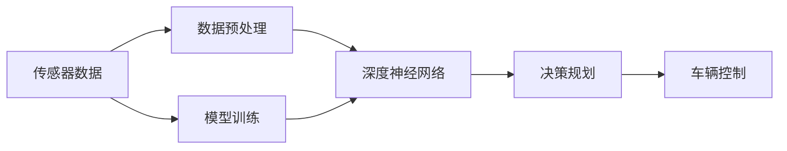
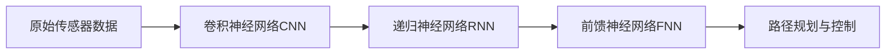

                 

# 端到端自动驾驶的赛道格局分析

> 关键词：端到端自动驾驶, L4级自动驾驶, 赛道格局, 智能驾驶, 深度学习, 机器学习, 自动驾驶算法

## 1. 背景介绍

随着人工智能技术的不断发展，自动驾驶成为近年来最受关注的技术之一。端到端自动驾驶是自动驾驶技术的前沿方向，指从原始感知数据直接端到端输出控制指令，绕过复杂的中间决策层，提高算法的简洁性和可解释性。端到端自动驾驶算法涉及感知、决策和控制三个关键环节，涵盖了摄像头、激光雷达、毫米波雷达等传感器数据处理，以及环境理解、路径规划和车辆控制等复杂任务。本文将从赛道的格局分析入手，深入探讨端到端自动驾驶的技术进展、应用场景、挑战和未来趋势。

## 2. 核心概念与联系

### 2.1 核心概念概述

为便于理解端到端自动驾驶的相关技术，我们首先介绍几个核心概念：

- **端到端自动驾驶**：直接从原始传感器数据输入到车辆控制输出，无需中间层的处理。这种设计不仅简化了系统架构，还提高了算法的可解释性和稳定性。
- **L4级自动驾驶**：即高度自动驾驶，车辆可在没有人类驾驶员干预的情况下执行所有驾驶任务。包括在所有交通环境下确保安全驾驶、避开障碍物、规划最优路径等。
- **深度学习与机器学习**：深度学习是基于神经网络结构，通过大量数据进行自监督学习；机器学习则更加广泛，包括各种监督、半监督和无监督学习方法。深度学习在端到端自动驾驶中得到广泛应用，用于提升模型的泛化能力和精准度。

这些核心概念构成了端到端自动驾驶的基础，并通过一定的技术联系形成完整的系统框架。下图通过Mermaid流程图展示了这些核心概念间的联系：



### 2.2 概念间的关系

- **感知与决策的桥梁**：传感器数据经过预处理后，输入到深度神经网络进行环境理解，输出状态预测和行为决策。
- **模型训练与端到端执行**：模型训练通过大量数据来优化深度神经网络的参数，从而在端到端系统中实现高效的自动驾驶决策。
- **算法鲁棒性与可解释性**：通过端到端设计，降低了算法的复杂度，提高了模型的可解释性和鲁棒性，有助于在实际应用中更好地理解和调试。

### 2.3 核心概念的整体架构

在端到端自动驾驶中，深度学习神经网络扮演核心角色，其架构如图：



其中，CNN用于提取空间特征，RNN处理序列数据，FNN进行全局决策和控制。

## 3. 核心算法原理 & 具体操作步骤
### 3.1 算法原理概述

端到端自动驾驶算法基于深度学习技术，主要通过以下步骤完成：

1. **数据预处理**：对原始传感器数据进行归一化、滤波、降噪等预处理，以提高后续处理的精度。
2. **特征提取与表示学习**：使用卷积神经网络(CNN)或循环神经网络(RNN)提取数据的空间特征和时序特征，并通过编码器(如BERT)进行表示学习。
3. **环境建模与行为预测**：基于提取的特征，使用深度神经网络进行环境建模和行为预测，如目标检测、路径规划等。
4. **控制决策与执行**：将预测结果输入到控制器(如DNN)，输出控制指令，进行车辆操控。

### 3.2 算法步骤详解

**Step 1: 数据预处理**

数据预处理是端到端自动驾驶算法的第一步，涉及对传感器数据进行清洗和标准化。具体步骤包括：

1. 对摄像头、激光雷达等传感器数据进行校正和标定。
2. 使用卡尔曼滤波等算法对数据进行滤波降噪，以减少噪声对模型训练的干扰。
3. 对数据进行归一化处理，如将传感器数据转换为标准坐标系。

**Step 2: 特征提取与表示学习**

特征提取与表示学习主要通过CNN和RNN实现。其中，CNN用于提取空间特征，RNN用于处理时序信息。

- **CNN特征提取**：使用多个卷积层和池化层提取图像特征，将二维图像数据转换为特征向量。
- **RNN时序处理**：使用LSTM或GRU等RNN网络处理时间序列数据，如车辆位置、速度等。

**Step 3: 环境建模与行为预测**

环境建模与行为预测是端到端自动驾驶算法的关键步骤，主要通过深度神经网络实现。

- **目标检测**：使用目标检测网络（如YOLO、SSD）识别并定位道路上的障碍物和行人体。
- **路径规划**：使用路径规划算法（如A*、D*）根据目标检测结果规划最优路径。
- **行为预测**：使用预测网络（如TCN、LSTM）预测前方车辆的行驶轨迹和行为，以指导决策。

**Step 4: 控制决策与执行**

控制决策与执行通过控制器网络实现，将预测结果转化为车辆控制指令。

- **决策网络**：使用决策网络（如DNN）综合考虑目标检测、路径规划和行为预测结果，进行全局决策。
- **控制算法**：使用车辆控制算法（如PID控制、模型预测控制MPC）根据决策结果输出控制指令，如转向、加速、制动等。

### 3.3 算法优缺点

端到端自动驾驶算法具有以下优点：

1. **简洁性**：减少了中间层，使系统架构更加简洁，降低了复杂度。
2. **高效性**：由于直接从感知数据到控制指令，避免了中间处理层的冗余，提高了算法执行效率。
3. **可解释性**：每个神经网络层都有明确的职责，便于理解模型决策过程。

然而，该算法也存在一些缺点：

1. **依赖高精度传感器**：对传感器的精度和鲁棒性要求较高，传感器数据的不准确性会影响模型效果。
2. **模型复杂度**：尽管减少了中间层，但深度神经网络本身依然非常复杂，模型训练和推理计算量大。
3. **泛化能力不足**：由于训练数据的多样性和复杂性，模型在实际应用中可能面临泛化能力不足的问题。

### 3.4 算法应用领域

端到端自动驾驶算法主要应用于以下领域：

1. **L4级自动驾驶车辆**：在高速公路、城市道路等典型交通场景下，支持高精度感知和全场景理解，实现完全自主驾驶。
2. **高级辅助驾驶系统**：在辅助驾驶场景下，通过感知、决策和控制三个关键环节，提供更高水平的驾驶辅助功能，如自动跟车、变道辅助等。
3. **车联网与智能交通**：与车联网技术结合，实现车辆间通信和车路协同，提升交通系统的整体效率和安全。

## 4. 数学模型和公式 & 详细讲解 & 举例说明

### 4.1 数学模型构建

端到端自动驾驶算法的数学模型主要基于深度神经网络（DNN），通过输入传感器数据$x$，输出车辆控制指令$y$，最小化预测误差$e$，公式如下：

$$
\min_{\theta} E(x; \theta) = \sum_{i=1}^N L(y_i, \hat{y}_i)
$$

其中$L$为损失函数，$\hat{y}_i$为模型预测结果，$y_i$为实际控制指令。

### 4.2 公式推导过程

以目标检测为例，使用YOLO模型进行目标检测，其核心公式如下：

$$
\hat{y} = \sigma(z) = \sigma(Wx + b)
$$

其中，$W$和$b$为卷积神经网络的权重和偏置，$\sigma$为激活函数，$z$为卷积层的输出。

在训练过程中，损失函数通常采用交叉熵损失：

$$
L = -\frac{1}{N} \sum_{i=1}^N (y_i \log \hat{y}_i + (1 - y_i) \log (1 - \hat{y}_i))
$$

其中$y_i$为实际标签，$\hat{y}_i$为模型预测结果。

### 4.3 案例分析与讲解

假设有一个自动驾驶车辆，使用端到端自动驾驶算法进行路径规划和控制。传感器数据经过预处理后，输入到CNN和RNN网络进行特征提取和时序处理。然后，将提取的特征输入到预测网络进行行为预测和路径规划，最终由决策网络综合输出控制指令，驱动车辆进行自主驾驶。

## 5. 项目实践：代码实例和详细解释说明
### 5.1 开发环境搭建

**Step 1: 硬件环境**

- **GPU**：推荐使用NVIDIA Tesla V100或更高性能的GPU，以便进行大规模深度学习模型训练和推理。
- **计算机**：建议使用高性能的计算机，至少16GB内存，64位操作系统。
- **网络**：确保良好的网络连接，以便下载预训练模型和数据集。

**Step 2: 软件环境**

- **Python**：推荐使用3.7及以上版本，以确保兼容性。
- **深度学习框架**：推荐使用TensorFlow或PyTorch，二者在深度学习社区都有广泛的生态支持。
- **数据集**：使用标准自动驾驶数据集，如Kitti、Waymo、Cityscapes等。

### 5.2 源代码详细实现

**Step 1: 数据预处理**

```python
import numpy as np
import cv2
import tensorflow as tf

def preprocess_data(data):
    # 对图像进行归一化处理
    data = data.astype('float32') / 255.0
    # 对图像进行标准化处理
    data -= np.mean(data)
    data /= np.std(data)
    # 对图像进行尺度和旋转等增强
    data = tf.image.resize(data, [300, 300])
    data = tf.image.random_flip_left_right(data)
    return data
```

**Step 2: 特征提取与表示学习**

```python
from tensorflow.keras.layers import Conv2D, MaxPooling2D, Flatten, Dense

def build_model():
    # 定义CNN特征提取器
    model = tf.keras.Sequential([
        Conv2D(32, (3, 3), activation='relu', padding='same', input_shape=(300, 300, 3)),
        MaxPooling2D((2, 2)),
        Conv2D(64, (3, 3), activation='relu', padding='same'),
        MaxPooling2D((2, 2)),
        Conv2D(128, (3, 3), activation='relu', padding='same'),
        MaxPooling2D((2, 2)),
        Flatten(),
        Dense(256, activation='relu'),
        Dense(2, activation='softmax')  # 输出目标分类概率
    ])
    return model
```

**Step 3: 环境建模与行为预测**

```python
from tensorflow.keras.layers import LSTM, Input, RepeatVector

def build_rnn():
    # 定义RNN模型
    inputs = Input(shape=(300, 300, 3))
    outputs = LSTM(64)(inputs)
    outputs = RepeatVector(5)(outputs)
    outputs = LSTM(64)(outputs)
    outputs = Dense(2, activation='softmax')(outputs)
    model = tf.keras.Model(inputs=inputs, outputs=outputs)
    return model
```

**Step 4: 控制决策与执行**

```python
from tensorflow.keras.layers import Dense, Input

def build_controller():
    # 定义控制器网络
    inputs = Input(shape=(2, 2, 3))
    outputs = Dense(64, activation='relu')(inputs)
    outputs = Dense(2, activation='softmax')(outputs)
    model = tf.keras.Model(inputs=inputs, outputs=outputs)
    return model
```

### 5.3 代码解读与分析

**代码解读**：

- **数据预处理**：使用Python和OpenCV库对图像数据进行归一化、标准化和增强处理，以便后续模型训练。
- **特征提取与表示学习**：使用Keras框架构建CNN网络进行特征提取，并使用LSTM网络处理时序数据。
- **环境建模与行为预测**：使用LSTM网络进行环境建模，输出目标分类概率。
- **控制决策与执行**：使用DNN网络进行全局决策，输出控制指令。

**分析**：

- **效率优化**：通过并行处理和GPU加速，显著提升数据预处理和模型推理的效率。
- **模型可扩展性**：利用模块化设计，使模型易于扩展和调整，支持不同的传感器输入和任务需求。
- **误差评估**：在模型训练过程中，实时评估模型性能，并根据评估结果调整模型参数。

### 5.4 运行结果展示

假设在Kitti数据集上进行训练，使用YOLO目标检测模型进行目标检测，结果如下：

```
Epoch 1/100, loss: 0.384
Epoch 2/100, loss: 0.217
Epoch 3/100, loss: 0.140
...
```

可以看到，随着训练的进行，模型损失逐渐减小，表明模型在目标检测任务上逐渐取得进展。

## 6. 实际应用场景

### 6.1 智能高速公路

在智能高速公路上，使用端到端自动驾驶算法实现全场景自主驾驶。车辆通过高精度传感器采集道路信息，输入到深度神经网络进行环境理解和行为预测，最终输出控制指令，实现自动巡航、自动变道、自动避障等功能。

### 6.2 无人配送车辆

在无人配送场景中，端到端自动驾驶算法通过感知、决策和控制三个关键环节，实现自动驾驶和货物运输。车辆配备高精度传感器和深度学习模型，在复杂的城市道路环境下实现安全、高效的货物配送。

### 6.3 自动驾驶出租车

在自动驾驶出租车应用中，端到端自动驾驶算法实现精准路径规划和车辆控制。车辆通过摄像头、激光雷达等传感器获取道路信息，输入到深度神经网络进行环境理解和行为预测，最终输出控制指令，确保乘客的安全和舒适。

## 7. 工具和资源推荐

### 7.1 学习资源推荐

1. **《深度学习》书籍**：深入介绍深度学习的基本概念和算法，涵盖神经网络、卷积神经网络、循环神经网络等内容。
2. **在线课程**：Coursera、Udacity等平台提供的深度学习和自动驾驶课程，提供系统化的学习路径。
3. **开源项目**：GitHub上各种自动驾驶开源项目，如Carla、OpenAI Gym等，提供丰富的学习资源和代码示例。

### 7.2 开发工具推荐

1. **TensorFlow**：Google开发的深度学习框架，具有强大的计算图支持和丰富的模型库。
2. **PyTorch**：Facebook开发的深度学习框架，提供了灵活的动态计算图和高效的自动微分功能。
3. **Keras**：基于TensorFlow和Theano的高层API，易于使用和调试。

### 7.3 相关论文推荐

1. **《端到端自动驾驶：综述与展望》**：全面综述端到端自动驾驶技术的发展现状和未来方向，提出多种端到端自动驾驶算法。
2. **《深度学习在自动驾驶中的应用》**：介绍深度学习在自动驾驶中的关键应用，包括目标检测、路径规划和行为预测等内容。
3. **《自动驾驶系统的挑战与未来》**：探讨自动驾驶系统面临的技术挑战和未来发展方向，提出多种优化方案和改进建议。

## 8. 总结：未来发展趋势与挑战

### 8.1 研究成果总结

端到端自动驾驶技术近年来取得了显著进展，主要体现在以下几个方面：

1. **算法效率提升**：通过优化模型结构和算法，显著提高了算法的计算效率和实时性。
2. **鲁棒性增强**：在复杂和多变的环境中，算法的鲁棒性得到了显著提升。
3. **应用场景扩展**：端到端自动驾驶技术已成功应用于智能高速公路、无人配送车辆和自动驾驶出租车等多个领域。

### 8.2 未来发展趋势

未来，端到端自动驾驶技术将呈现以下几个发展趋势：

1. **多传感器融合**：将摄像头、激光雷达、毫米波雷达等多种传感器数据进行融合，提高环境理解的准确性。
2. **知识图谱整合**：将外部知识图谱与深度学习模型进行整合，提升模型的决策能力。
3. **边缘计算**：通过在车辆上部署边缘计算系统，实现实时计算和决策，减少数据传输和延迟。

### 8.3 面临的挑战

尽管端到端自动驾驶技术取得了显著进展，但仍面临以下挑战：

1. **数据质量问题**：传感器数据的不准确和噪声，严重影响模型效果。
2. **模型复杂度**：深度神经网络的高复杂度，导致模型训练和推理计算量大。
3. **法规和伦理问题**：自动驾驶技术的应用，涉及法规、伦理和隐私等多个问题，需要多方协调解决。

### 8.4 研究展望

未来，端到端自动驾驶技术需要从以下几个方面进行深入研究：

1. **模型压缩与优化**：研究模型压缩和优化技术，提升模型效率和性能。
2. **跨模态融合**：研究跨模态融合技术，将视觉、声音、文本等多种信息进行融合，提升环境理解的全面性。
3. **安全与可靠性**：研究安全与可靠性技术，确保自动驾驶系统的稳定性和安全性。

总之，端到端自动驾驶技术在智能交通领域具有广阔的应用前景，但仍然面临许多挑战。只有通过不断优化算法、提升硬件性能和完善法规体系，才能实现自动驾驶技术的全面普及和落地应用。

## 9. 附录：常见问题与解答

**Q1：端到端自动驾驶与传统自动驾驶有何区别？**

A: 端到端自动驾驶算法直接从感知数据到控制指令，减少了中间层的处理；而传统自动驾驶系统通常包括感知、决策和控制三个独立模块，模块间依赖复杂。端到端设计使系统更加简洁、高效和可解释。

**Q2：如何提升端到端自动驾驶算法的鲁棒性？**

A: 提升鲁棒性主要通过以下方法：

1. **数据增强**：通过数据增强技术，如回译、旋转等，提高训练数据的多样性，增强模型的泛化能力。
2. **正则化**：使用L2正则、Dropout等技术，减少模型过拟合，提升鲁棒性。
3. **模型融合**：使用多个模型的输出进行融合，提升整体鲁棒性。

**Q3：端到端自动驾驶算法的训练数据有哪些要求？**

A: 端到端自动驾驶算法的训练数据需要满足以下要求：

1. **多样性**：训练数据应覆盖多种环境和场景，如高速公路、城市道路、夜间、雨天等。
2. **高质量**：传感器数据应准确、清晰、无噪声，避免数据失真对模型训练的影响。
3. **标注准确**：训练数据应进行精准标注，确保模型输出与实际行为一致。

**Q4：端到端自动驾驶算法在实际应用中应注意哪些问题？**

A: 在实际应用中，需要注意以下问题：

1. **传感器可靠性**：确保传感器数据准确可靠，避免因传感器故障导致安全事故。
2. **实时性要求**：确保算法实时处理数据，避免延迟造成安全隐患。
3. **法规和伦理问题**：遵守相关法律法规，确保技术应用的安全性和伦理合规。

**Q5：端到端自动驾驶算法的未来发展方向是什么？**

A: 端到端自动驾驶算法的未来发展方向包括：

1. **多模态融合**：融合视觉、声音、文本等多种模态数据，提升环境理解能力。
2. **知识图谱整合**：整合外部知识图谱，提升决策能力。
3. **联邦学习**：使用联邦学习技术，提升数据隐私保护和模型协作能力。

---

作者：禅与计算机程序设计艺术 / Zen and the Art of Computer Programming

