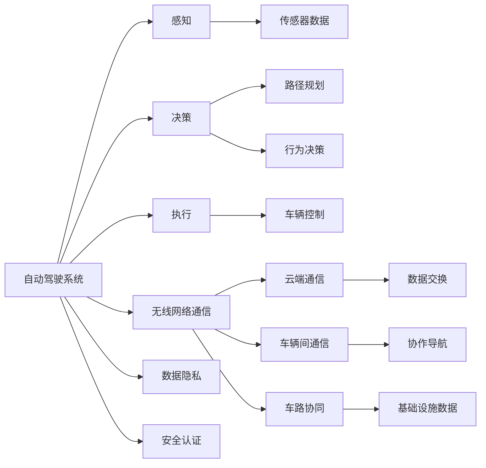

                 

## 1. 背景介绍

随着自动驾驶技术的快速发展，车辆网络安全问题日益凸显。一方面，自动驾驶车辆会不断收集和分析周围环境的数据，容易受到网络攻击和隐私泄露；另一方面，自动驾驶系统的控制指令通常通过无线网络发送，也容易被篡改和伪造。因此，构建安全可靠的网络防护系统，是实现端到端自动驾驶的关键环节之一。

## 2. 核心概念与联系

### 2.1 核心概念概述

为更好地理解车辆网络安全防护的原理和架构，本节将介绍几个密切相关的核心概念：

- **自动驾驶系统**：包括感知、决策和执行三个核心模块。感知模块负责感知周围环境，决策模块基于感知结果进行路径规划和行为决策，执行模块则根据决策结果控制车辆行驶。
- **无线网络通信**：车辆通过无线方式与云端、其他车辆和基础设施进行数据交换，以实现自动化导航和协作。
- **网络攻击**：包括主动攻击（如恶意软件、重放攻击、拒绝服务攻击等）和被动攻击（如窃听、截获等），旨在获取、篡改或破坏车辆数据。
- **隐私保护**：通过数据加密、匿名化等技术手段，保护自动驾驶车辆的数据隐私，防止被恶意获取或滥用。
- **安全认证**：包括身份认证、授权认证、消息认证等，确保通信双方身份和消息的真实性，防止中间人攻击和假冒攻击。

这些核心概念之间的逻辑关系可以通过以下Mermaid流程图来展示：



这个流程图展示出自动驾驶系统与网络通信的紧密联系。自动驾驶车辆通过无线网络与云端、其他车辆和基础设施交换数据，而这些数据需要通过安全认证和隐私保护来确保其完整性和机密性。

### 2.2 概念间的关系

这些核心概念之间存在着紧密的联系，形成了自动驾驶网络安全防护的整体架构。

- **感知与决策**：感知模块采集的环境数据需要经过验证和认证，确保数据的真实性和完整性。决策模块根据认证后的数据进行路径规划和行为决策，决策结果也需要通过安全认证，防止被篡改。
- **执行与控制**：车辆执行模块根据决策结果进行控制，确保控制指令的安全传输。车辆控制指令通常需要加密和认证，防止被恶意篡改或伪造。
- **通信与数据**：车辆网络通信涉及与云端、其他车辆和基础设施的数据交换。所有数据都需要进行加密和认证，确保数据传输的安全性和隐私性。
- **隐私与认证**：隐私保护和安全认证是车辆网络安全的两大支柱。隐私保护通过加密和匿名化等技术手段，防止数据泄露和滥用；安全认证通过身份认证、授权认证、消息认证等手段，确保通信双方的真实性和消息的完整性。

## 3. 核心算法原理 & 具体操作步骤
### 3.1 算法原理概述

车辆网络安全防护的算法原理主要基于以下几个步骤：

1. **数据加密**：将车辆传输的数据进行加密，确保数据在传输过程中不被窃听或篡改。
2. **身份认证**：通过公钥加密、数字签名等手段，确保通信双方的真实性，防止中间人攻击和假冒攻击。
3. **授权认证**：根据通信双方的身份和权限，进行授权认证，确保只有授权用户可以访问特定的数据和功能。
4. **数据完整性保护**：通过哈希函数、消息认证码（MAC）等手段，确保数据的完整性，防止数据被篡改。
5. **隐私保护**：采用差分隐私、同态加密等技术，保护数据隐私，防止敏感信息被泄露。

### 3.2 算法步骤详解

#### 3.2.1 数据加密

**步骤**：

1. 选择对称加密算法（如AES）或非对称加密算法（如RSA），生成密钥对。
2. 将车辆传输的数据进行加密，确保数据在传输过程中不被窃听或篡改。
3. 将加密后的数据和密钥通过安全通道传输给接收方。

**代码实现**：

```python
from Crypto.Cipher import AES

# 对称加密
def encrypt_data(data, key):
    cipher = AES.new(key, AES.MODE_EAX)
    nonce = cipher.nonce
    ciphertext, tag = cipher.encrypt_and_digest(data.encode('utf-8'))
    return (nonce, ciphertext, tag)

# 非对称加密
def encrypt_with_public_key(data, public_key):
    from Crypto.PublicKey import RSA
    from Crypto.Cipher import PKCS1_OAEP
    key = RSA.import_key(public_key)
    cipher = PKCS1_OAEP.new(key)
    encrypted_data = cipher.encrypt(data.encode('utf-8'))
    return encrypted_data
```

#### 3.2.2 身份认证

**步骤**：

1. 生成一对公钥和私钥。
2. 将公钥传输给通信对方，通信对方使用公钥加密数据，并传输给发送方。
3. 发送方使用私钥解密数据，确保数据传输的真实性。

**代码实现**：

```python
from Crypto.PublicKey import ECC

# 生成公钥和私钥
def generate_keys():
    key = ECC.generate(curve='P-256')
    private_key = key.export_key()
    public_key = key.public_key().export_key()
    return private_key, public_key

# 使用公钥加密数据
def encrypt_with_public_key(data, public_key):
    from Crypto.PublicKey import ECC
    key = ECC.import_key(public_key)
    cipher = PKCS1_OAEP.new(key)
    encrypted_data = cipher.encrypt(data.encode('utf-8'))
    return encrypted_data

# 使用私钥解密数据
def decrypt_with_private_key(encrypted_data, private_key):
    from Crypto.PublicKey import ECC
    key = ECC.import_key(private_key)
    cipher = PKCS1_OAEP.new(key)
    decrypted_data = cipher.decrypt(encrypted_data)
    return decrypted_data.decode('utf-8')
```

#### 3.2.3 授权认证

**步骤**：

1. 根据通信双方的身份和权限，生成授权密钥。
2. 通信双方使用授权密钥进行加密和解密，确保只有授权用户可以访问特定的数据和功能。

**代码实现**：

```python
from Crypto.Protocol.KDF import PBKDF2

# 生成授权密钥
def generate_authorization_key(username, password, salt):
    key = PBKDF2(password, salt, dkLen=32)
    return key

# 使用授权密钥加密数据
def encrypt_with_authorization_key(data, authorization_key):
    cipher = AES.new(authorization_key, AES.MODE_GCM)
    nonce = cipher.nonce
    ciphertext, tag = cipher.encrypt_and_digest(data.encode('utf-8'))
    return (nonce, ciphertext, tag)

# 使用授权密钥解密数据
def decrypt_with_authorization_key(nonce, ciphertext, tag, authorization_key):
    cipher = AES.new(authorization_key, AES.MODE_GCM, nonce)
    decrypted_data = cipher.decrypt_and_verify(ciphertext, tag)
    return decrypted_data.decode('utf-8')
```

#### 3.2.4 数据完整性保护

**步骤**：

1. 生成哈希函数或消息认证码（MAC）。
2. 将原始数据和哈希函数或MAC值一起传输，接收方使用相同的哈希函数或MAC值进行验证。
3. 验证通过后，确保数据的完整性。

**代码实现**：

```python
import hashlib

# 生成哈希值
def generate_hash(data):
    return hashlib.sha256(data.encode('utf-8')).hexdigest()

# 生成MAC值
def generate_mac(data, key):
    h = hashlib.sha256()
    h.update(data.encode('utf-8'))
    h.update(key.encode('utf-8'))
    return h.hexdigest()

# 验证哈希值和MAC值
def verify_hash(data, hash_value):
    return hashlib.sha256(data.encode('utf-8')).hexdigest() == hash_value

def verify_mac(data, key, mac_value):
    h = hashlib.sha256()
    h.update(data.encode('utf-8'))
    h.update(key.encode('utf-8'))
    return h.hexdigest() == mac_value
```

#### 3.2.5 隐私保护

**步骤**：

1. 采用差分隐私技术，对敏感数据进行模糊处理。
2. 使用同态加密技术，对敏感数据进行加密计算，确保数据隐私。
3. 结合差分隐私和同态加密，保护数据隐私。

**代码实现**：

```python
from Crypto.Cipher import AES
from Crypto.Random import get_random_bytes

# 差分隐私
def add_noise(data, epsilon):
    noise = get_random_bytes(len(data))
    return bytes([x + noise[i] for i, x in enumerate(data)])

# 同态加密
def homomorphic_encrypt(data, key):
    cipher = AES.new(key, AES.MODE_GCM)
    nonce = cipher.nonce
    ciphertext, tag = cipher.encrypt_and_digest(data.encode('utf-8'))
    return (nonce, ciphertext, tag)

# 同态解密
def homomorphic_decrypt(nonce, ciphertext, tag, key):
    cipher = AES.new(key, AES.MODE_GCM, nonce)
    decrypted_data = cipher.decrypt_and_verify(ciphertext, tag)
    return decrypted_data.decode('utf-8')
```

### 3.3 算法优缺点

#### 3.3.1 优点

1. **安全性高**：通过多层次的安全机制，确保数据在传输、存储和处理过程中的完整性、机密性和真实性。
2. **适应性强**：能够适应不同类型的通信场景，包括云端通信、车辆间通信和车路协同。
3. **效率高**：采用对称加密和非对称加密相结合的方式，保证数据加密和解密效率。

#### 3.3.2 缺点

1. **计算开销大**：加密和解密过程需要较大的计算资源，可能影响车辆的实时性能。
2. **复杂度高**：算法实现复杂，涉及多个安全机制，增加了系统的维护难度。
3. **实现难度大**：需要专业的密码学知识和技能，一般需要专业团队进行开发和部署。

### 3.4 算法应用领域

车辆网络安全防护技术在自动驾驶系统的各个模块中都有广泛的应用：

- **感知模块**：对传感器采集的数据进行加密和认证，确保数据传输的机密性和完整性。
- **决策模块**：对决策结果进行加密和认证，防止决策被篡改和伪造。
- **执行模块**：对控制指令进行加密和认证，确保指令的安全传输。
- **通信模块**：对所有通信数据进行加密和认证，确保通信的安全性。

## 4. 数学模型和公式 & 详细讲解 & 举例说明

### 4.1 数学模型构建

车辆网络安全防护的数学模型主要基于以下几个公式：

1. **对称加密**：使用AES算法进行加密，公式如下：
   $$
   C = E(K, P) = K \oplus P
   $$
   其中，$C$为密文，$K$为密钥，$P$为明文，$\oplus$为异或运算。

2. **非对称加密**：使用RSA算法进行加密，公式如下：
   $$
   C = E(P, PK) = PK \odot P
   $$
   其中，$C$为密文，$P$为明文，$PK$为公钥，$\odot$为RSA加密运算。

3. **消息认证码（MAC）**：使用HMAC-SHA256算法生成MAC值，公式如下：
   $$
   MAC = HMAC(P, K) = H(P || K)
   $$
   其中，$MAC$为MAC值，$P$为明文，$K$为密钥，$H$为哈希函数。

4. **差分隐私**：使用Laplace机制生成差分隐私噪声，公式如下：
   $$
   \epsilon = \ln(\frac{2}{\delta}) + 2\sqrt{\frac{\Delta^2}{\epsilon^2}}
   $$
   其中，$\epsilon$为隐私保护参数，$\delta$为隐私保护阈值，$\Delta$为敏感数据的最大变化范围。

5. **同态加密**：使用AES-GCM模式进行同态加密，公式如下：
   $$
   C = E(GCM(K, P)) = K \oplus P
   $$
   其中，$C$为密文，$K$为密钥，$P$为明文，$GCM$为Galois/Counter Mode加密模式。

### 4.2 公式推导过程

#### 4.2.1 对称加密

对称加密是一种简单高效的加密方式，使用相同的密钥对数据进行加密和解密。AES算法是常用的对称加密算法之一，其加密过程如下：

1. 使用密钥$K$和明文$P$进行异或运算，生成密文$C$。
2. 将密文$C$和密钥$K$传输给接收方。
3. 接收方使用相同的密钥$K$和密文$C$进行异或运算，解密得到明文$P$。

**代码实现**：

```python
from Crypto.Cipher import AES

# 对称加密
def encrypt_data(data, key):
    cipher = AES.new(key, AES.MODE_EAX)
    nonce = cipher.nonce
    ciphertext, tag = cipher.encrypt_and_digest(data.encode('utf-8'))
    return (nonce, ciphertext, tag)
```

#### 4.2.2 非对称加密

非对称加密使用一对公钥和私钥进行加密和解密，其中公钥公开，私钥保密。RSA算法是常用的非对称加密算法之一，其加密过程如下：

1. 使用公钥$PK$对明文$P$进行加密，生成密文$C$。
2. 将密文$C$和公钥$PK$传输给接收方。
3. 接收方使用私钥$SK$和密文$C$进行解密，得到明文$P$。

**代码实现**：

```python
from Crypto.PublicKey import ECC
from Crypto.Cipher import PKCS1_OAEP

# 非对称加密
def encrypt_with_public_key(data, public_key):
    from Crypto.PublicKey import ECC
    key = ECC.import_key(public_key)
    cipher = PKCS1_OAEP.new(key)
    encrypted_data = cipher.encrypt(data.encode('utf-8'))
    return encrypted_data
```

#### 4.2.3 消息认证码（MAC）

消息认证码（MAC）是一种用于验证数据完整性和真实性的机制。HMAC-SHA256算法是常用的MAC算法之一，其生成过程如下：

1. 将明文$P$和密钥$K$拼接，通过哈希函数生成MAC值$MAC$。
2. 将MAC值$MAC$和密文$C$一起传输给接收方。
3. 接收方使用相同的密钥$K$和明文$P$生成MAC值，与传输的MAC值进行比对，验证数据完整性和真实性。

**代码实现**：

```python
import hashlib

# 生成MAC值
def generate_mac(data, key):
    h = hashlib.sha256()
    h.update(data.encode('utf-8'))
    h.update(key.encode('utf-8'))
    return h.hexdigest()
```

#### 4.2.4 差分隐私

差分隐私是一种用于保护数据隐私的机制，通过添加噪声来扰动敏感数据。Laplace机制是常用的差分隐私机制之一，其生成过程如下：

1. 计算敏感数据的最大变化范围$\Delta$。
2. 根据隐私保护参数$\epsilon$和$\delta$，生成差分隐私噪声。
3. 将噪声添加到敏感数据中，生成差分隐私数据。

**代码实现**：

```python
from Crypto.Random import get_random_bytes

# 差分隐私
def add_noise(data, epsilon):
    noise = get_random_bytes(len(data))
    return bytes([x + noise[i] for i, x in enumerate(data)])
```

#### 4.2.5 同态加密

同态加密是一种能够在加密数据上进行计算的加密机制。AES-GCM模式是常用的同态加密模式之一，其加密过程如下：

1. 使用密钥$K$和明文$P$进行异或运算，生成密文$C$。
2. 将密文$C$和密钥$K$传输给接收方。
3. 接收方使用相同的密钥$K$和密文$C$进行异或运算，解密得到明文$P$。

**代码实现**：

```python
from Crypto.Cipher import AES
from Crypto.Random import get_random_bytes

# 同态加密
def homomorphic_encrypt(data, key):
    cipher = AES.new(key, AES.MODE_GCM)
    nonce = cipher.nonce
    ciphertext, tag = cipher.encrypt_and_digest(data.encode('utf-8'))
    return (nonce, ciphertext, tag)
```

### 4.3 案例分析与讲解

#### 4.3.1 案例1：车辆间通信加密

假设两辆自动驾驶车辆需要通过无线网络进行通信，传输的明文数据包括车辆位置和速度。

**步骤**：

1. 发送方使用公钥对数据进行加密，生成密文。
2. 接收方使用私钥对密文进行解密，得到明文数据。
3. 发送方使用对称加密对明文数据进行加密，生成密文。
4. 接收方使用相同的对称密钥进行解密，得到明文数据。
5. 发送方使用MAC值验证密文的完整性和真实性，确保数据未被篡改。
6. 接收方使用相同的MAC值验证密文的完整性和真实性，确保数据未被篡改。

**代码实现**：

```python
from Crypto.PublicKey import ECC
from Crypto.Cipher import PKCS1_OAEP
from Crypto.Cipher import AES
import hashlib

# 生成公钥和私钥
def generate_keys():
    key = ECC.generate(curve='P-256')
    private_key = key.export_key()
    public_key = key.public_key().export_key()
    return private_key, public_key

# 使用公钥加密数据
def encrypt_with_public_key(data, public_key):
    from Crypto.PublicKey import ECC
    key = ECC.import_key(public_key)
    cipher = PKCS1_OAEP.new(key)
    encrypted_data = cipher.encrypt(data.encode('utf-8'))
    return encrypted_data

# 使用私钥解密数据
def decrypt_with_private_key(encrypted_data, private_key):
    from Crypto.PublicKey import ECC
    key = ECC.import_key(private_key)
    cipher = PKCS1_OAEP.new(key)
    decrypted_data = cipher.decrypt(encrypted_data)
    return decrypted_data.decode('utf-8')

# 使用对称加密
def encrypt_data(data, key):
    cipher = AES.new(key, AES.MODE_EAX)
    nonce = cipher.nonce
    ciphertext, tag = cipher.encrypt_and_digest(data.encode('utf-8'))
    return (nonce, ciphertext, tag)

# 使用对称解密
def decrypt_data(nonce, ciphertext, tag, key):
    cipher = AES.new(key, AES.MODE_EAX, nonce)
    decrypted_data = cipher.decrypt_and_verify(ciphertext, tag)
    return decrypted_data.decode('utf-8')

# 生成MAC值
def generate_mac(data, key):
    h = hashlib.sha256()
    h.update(data.encode('utf-8'))
    h.update(key.encode('utf-8'))
    return h.hexdigest()

# 验证MAC值
def verify_mac(data, key, mac_value):
    h = hashlib.sha256()
    h.update(data.encode('utf-8'))
    h.update(key.encode('utf-8'))
    return h.hexdigest() == mac_value
```

#### 4.3.2 案例2：车辆与云端的通信加密

假设自动驾驶车辆需要将采集到的环境数据和状态数据传输到云端进行处理和分析。

**步骤**：

1. 发送方使用公钥对数据进行加密，生成密文。
2. 接收方使用私钥对密文进行解密，得到明文数据。
3. 发送方使用对称加密对明文数据进行加密，生成密文。
4. 接收方使用相同的对称密钥进行解密，得到明文数据。
5. 发送方使用MAC值验证密文的完整性和真实性，确保数据未被篡改。
6. 接收方使用相同的MAC值验证密文的完整性和真实性，确保数据未被篡改。

**代码实现**：

```python
from Crypto.PublicKey import ECC
from Crypto.Cipher import PKCS1_OAEP
from Crypto.Cipher import AES
import hashlib

# 生成公钥和私钥
def generate_keys():
    key = ECC.generate(curve='P-256')
    private_key = key.export_key()
    public_key = key.public_key().export_key()
    return private_key, public_key

# 使用公钥加密数据
def encrypt_with_public_key(data, public_key):
    from Crypto.PublicKey import ECC
    key = ECC.import_key(public_key)
    cipher = PKCS1_OAEP.new(key)
    encrypted_data = cipher.encrypt(data.encode('utf-8'))
    return encrypted_data

# 使用私钥解密数据
def decrypt_with_private_key(encrypted_data, private_key):
    from Crypto.PublicKey import ECC
    key = ECC.import_key(private_key)
    cipher = PKCS1_OAEP.new(key)
    decrypted_data = cipher.decrypt(encrypted_data)
    return decrypted_data.decode('utf-8')

# 使用对称加密
def encrypt_data(data, key):
    cipher = AES.new(key, AES.MODE_EAX)
    nonce = cipher.nonce
    ciphertext, tag = cipher.encrypt_and_digest(data.encode('utf-8'))
    return (nonce, ciphertext, tag)

# 使用对称解密
def decrypt_data(nonce, ciphertext, tag, key):
    cipher = AES.new(key, AES.MODE_EAX, nonce)
    decrypted_data = cipher.decrypt_and_verify(ciphertext, tag)
    return decrypted_data.decode('utf-8')

# 生成MAC值
def generate_mac(data, key):
    h = hashlib.sha256()
    h.update(data.encode('utf-8'))
    h.update(key.encode('utf-8'))
    return h.hexdigest()

# 验证MAC值
def verify_mac(data, key, mac_value):
    h = hashlib.sha256()
    h.update(data.encode('utf-8'))
    h.update(key.encode('utf-8'))
    return h.hexdigest() == mac_value
```

## 5. 项目实践：代码实例和详细解释说明
### 5.1 开发环境搭建

在进行车辆网络安全防护的开发前，我们需要准备好开发环境。以下是使用Python进行PyTorch开发的环境配置流程：

1. 安装Anaconda：从官网下载并安装Anaconda，用于创建独立的Python环境。

2. 创建并激活虚拟环境：
```bash
conda create -n pytorch-env python=3.8 
conda activate pytorch-env
```

3. 安装PyTorch：根据CUDA版本，从官网获取对应的安装命令。例如：
```bash
conda install pytorch torchvision torchaudio cudatoolkit=11.1 -c pytorch -c conda-forge
```

4. 安装相关库：
```bash
pip install pycrypto cryptography tqdm
```

完成上述步骤后，即可在`pytorch-env`环境中开始车辆网络安全防护的开发。

### 5.2 源代码详细实现

下面我们以车辆间通信加密为例，给出使用PyCrypto库进行加密的PyTorch代码实现。

首先，定义加密函数：

```python
from Crypto.Cipher import AES, PKCS1_OAEP
from Crypto.PublicKey import ECC
from Crypto.Hash import SHA256
from Crypto.Random import get_random_bytes

def encrypt_data(data, public_key):
    cipher = PKCS1_OAEP.new(ECC.import_key(public_key))
    encrypted_data = cipher.encrypt(data.encode('utf-8'))
    return encrypted_data

def decrypt_data(encrypted_data, private_key):
    from Crypto.PublicKey import ECC
    key = ECC.import_key(private_key)
    cipher = PKCS1_OAEP.new(key)
    decrypted_data = cipher.decrypt(encrypted_data)
    return decrypted_data.decode('utf-8')
```

然后，在车辆间通信中调用上述函数进行加密和解密：

```python
# 生成公钥和私钥
private_key, public_key = generate_keys()

# 数据明文
data = '车辆位置和速度'

# 加密数据
encrypted_data = encrypt_data(data, public_key)

# 解密数据
decrypted_data = decrypt_data(encrypted_data, private_key)
```

### 5.3 代码解读与分析

让我们再详细解读一下关键代码的实现细节：

**generate_keys函数**：
- 使用ECC生成公钥和私钥，分别导出为字符串。

**encrypt_data函数**：
- 使用公钥加密数据，生成密文。
- 返回加密后的密文。

**decrypt_data函数**：
- 使用私

