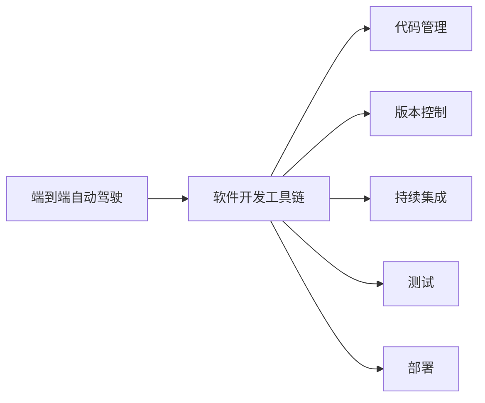

                 

# 端到端自动驾驶的软件开发工具链优化

> 关键词：自动驾驶,软件开发,工具链优化,端到端,AI安全,高可靠

## 1. 背景介绍

### 1.1 问题由来

自动驾驶技术近年来蓬勃发展，成为了人工智能领域的关注焦点。然而，自动驾驶软件的复杂性和高安全性要求，使得开发和测试成本高昂、周期长、部署难度大。传统软件开发和测试方法难以应对这些挑战，亟需新的工具链优化方法。

### 1.2 问题核心关键点

端到端自动驾驶软件系统由感知、决策、执行三大模块组成，每一模块均涉及复杂的算法和数据处理。端到端优化需要从算法优化、数据管理和软件开发流程三个维度入手。

1. **算法优化**：在保持系统安全性的前提下，提升算法精度、鲁棒性和实时性。
2. **数据管理**：高效存储、处理和检索自动驾驶任务中的数据，提升数据利用率。
3. **软件开发流程**：优化从需求分析到部署的整个流程，提升开发效率和产品质量。

### 1.3 问题研究意义

优化端到端自动驾驶软件开发工具链，对于推动自动驾驶技术的应用、降低开发和测试成本、提升系统安全性具有重要意义：

1. **加速技术落地**：通过工具链优化，快速构建、测试、部署自动驾驶系统，推动技术在实际场景中的应用。
2. **降低开发成本**：优化工具链可以降低人工和设备成本，提升开发效率。
3. **提升系统安全**：通过引入安全测试、验证工具，提升系统鲁棒性和可靠性。
4. **实现端到端优化**：从算法、数据、流程等多方面协同优化，全面提升系统性能。
5. **推动产业升级**：通过自动化、高效化的工具链，促进自动驾驶技术在传统行业中的应用，推动产业升级。

## 2. 核心概念与联系

### 2.1 核心概念概述

端到端自动驾驶软件开发工具链涉及多方面内容，本文将介绍几个关键概念：

- **端到端自动驾驶**：涵盖感知、决策、执行三大模块，包括激光雷达、摄像头、毫米波雷达等传感数据处理、神经网络模型推理、控制指令输出等，形成一个闭环的系统。
- **软件开发工具链**：涵盖从需求分析到部署的整个软件开发流程，包括代码管理、版本控制、持续集成、测试、部署等环节。
- **工具链优化**：通过对各个环节的工具、流程、技术和方法进行优化，提升软件开发的效率、质量和安全性。

### 2.2 概念间的关系

这些核心概念之间存在紧密的联系，形成了端到端自动驾驶软件开发工具链的完整框架。下图展示了这些概念之间的关系：



端到端自动驾驶软件开发工具链以端到端自动驾驶系统为核心，覆盖软件开发的全流程，包括代码管理、版本控制、持续集成、测试和部署等环节，旨在提升开发效率、产品质量和系统安全性。

## 3. 核心算法原理 & 具体操作步骤
### 3.1 算法原理概述

端到端自动驾驶软件开发工具链优化，本质上是一个系统化的工程问题。其核心在于通过优化工具链中的各个环节，提升系统性能和安全性，从而推动自动驾驶技术的应用。

**目标**：在保持系统安全性的前提下，提升算法精度、鲁棒性和实时性，高效存储、处理和检索自动驾驶数据，优化软件开发流程，降低开发和测试成本。

### 3.2 算法步骤详解

端到端自动驾驶软件开发工具链优化一般包括以下几个关键步骤：

1. **需求分析与设计**：
   - 与领域专家合作，明确系统需求和功能设计。
   - 设计端到端系统架构，包括感知、决策、执行三大模块的组成和接口。
   - 定义测试用例，包括各种工况和异常情况。

2. **算法优化与选择**：
   - 根据系统需求，选择适合的算法和模型。
   - 对算法进行优化，提升精度、鲁棒性和实时性。
   - 进行算法验证，确保算法在不同场景下稳定运行。

3. **数据管理和预处理**：
   - 设计数据存储架构，确保数据的可靠性和可用性。
   - 进行数据清洗、标注和归一化处理，提升数据质量。
   - 使用高效的数据管理工具，如大数据平台、数据湖等，提升数据处理效率。

4. **软件开发流程优化**：
   - 引入DevOps理念，采用自动化工具链，如Jenkins、GitLab CI/CD等，实现持续集成和持续交付。
   - 使用版本控制系统，如Git，管理代码版本和变更记录。
   - 实施模块化和可重用的代码设计，提升开发效率。

5. **测试与验证**：
   - 实施自动化测试，包括单元测试、集成测试和系统测试。
   - 引入安全测试工具，如模糊测试、渗透测试等，提升系统安全性。
   - 进行系统验证，确保系统满足各项指标要求。

6. **部署与监控**：
   - 设计自动化部署流程，使用容器化技术，如Docker，实现快速部署。
   - 实施系统监控和日志管理，确保系统稳定运行。
   - 定期更新系统，修复已知漏洞，提升系统安全性。

### 3.3 算法优缺点

端到端自动驾驶软件开发工具链优化具有以下优点：

- **提升开发效率**：通过引入自动化工具链和DevOps理念，大幅提升开发效率。
- **降低开发成本**：通过模块化和可重用的代码设计，减少重复开发。
- **提升系统安全性**：通过安全测试和系统验证，提升系统鲁棒性和可靠性。
- **实现端到端优化**：从算法、数据、流程等多方面协同优化，全面提升系统性能。

同时，该方法也存在以下局限性：

- **依赖工具和环境**：工具链优化依赖于各种工具和环境，如大数据平台、容器化工具等，引入复杂度较高。
- **流程标准化难度大**：自动驾驶任务复杂多变，标准化流程较难，灵活性较差。
- **人机协作难度高**：自动驾驶涉及多个学科，技术复杂度大，需要领域专家和工程师协同工作，协调难度高。

尽管存在这些局限性，但就目前而言，端到端优化工具链仍是最主流的开发方法。未来相关研究的重点在于如何进一步降低开发成本、提升开发效率和系统安全性，同时兼顾流程的灵活性和可扩展性。

### 3.4 算法应用领域

端到端自动驾驶软件开发工具链优化已经在多个自动驾驶应用场景中得到广泛应用，如自动驾驶汽车、无人机、自动驾驶机器人等。

这些工具链优化方法在自动驾驶汽车上，可以显著提升感知、决策和执行模块的精度和鲁棒性，降低开发和测试成本，提升系统安全性。例如，通过引入自动驾驶模拟器、仿真测试工具等，可以在实际道路测试前，进行大量虚拟仿真测试，提升系统性能。

在无人机和自动驾驶机器人上，工具链优化同样发挥了重要作用。通过引入自动化工具链、模块化设计和安全测试工具，大幅提升了这些系统的开发效率和安全性。例如，通过自动化部署和监控系统，可以确保无人机和机器人稳定运行，避免人为误操作。

## 4. 数学模型和公式 & 详细讲解  
### 4.1 数学模型构建

端到端自动驾驶软件开发工具链优化涉及多方面内容，包括软件工程、算法优化、数据管理等。这里我们以软件开发流程优化为例，构建数学模型：

**目标**：最小化开发成本，最大化系统性能和安全性。

**输入**：
- $C$：开发成本。
- $P$：系统性能。
- $S$：系统安全性。

**输出**：
- $O$：优化策略。

数学模型为：

$$
O=\mathop{\arg\min}_{C,P,S} \{C - \lambda_1(P - P_{target}) - \lambda_2(S - S_{target})\}
$$

其中 $\lambda_1$ 和 $\lambda_2$ 为平衡权重。

### 4.2 公式推导过程

以上数学模型是一个多目标优化问题，需要采用多目标优化算法求解。常用的多目标优化算法包括NSGA-II、MOEA-D等。这里以NSGA-II算法为例进行推导。

NSGA-II算法的主要步骤如下：

1. **初始化种群**：随机生成 $N$ 个可行解。
2. **计算适应度**：根据目标函数计算每个解的适应度。
3. **选择操作**：采用排序选择和轮盘选择等方法，选择新的解。
4. **交叉操作**：采用单点交叉、多点交叉等方法，生成新的解。
5. **变异操作**：采用逆序变异、均匀变异等方法，生成新的解。
6. **更新种群**：将新生成的解加入种群，形成新的种群。
7. **迭代更新**：重复步骤2-6，直至满足停止条件。

### 4.3 案例分析与讲解

假设我们希望在自动驾驶汽车上，实现感知模块的优化。可以采用以下方法：

1. **需求分析**：
   - 设计感知模块的需求，包括感知范围、精度、鲁棒性等。
   - 设计测试用例，包括不同天气、光照、障碍物等情况。

2. **算法选择**：
   - 选择适合的算法，如卷积神经网络（CNN）、深度神经网络（DNN）等。
   - 对算法进行优化，提升精度和实时性。

3. **数据预处理**：
   - 收集大量传感数据，进行清洗和标注。
   - 设计数据存储架构，如使用Hadoop或Spark进行大数据处理。

4. **软件开发流程优化**：
   - 引入DevOps理念，使用Jenkins进行持续集成和持续交付。
   - 使用版本控制系统，如Git，管理代码版本和变更记录。

5. **测试与验证**：
   - 实施自动化测试，包括单元测试、集成测试和系统测试。
   - 引入安全测试工具，如模糊测试、渗透测试等，提升系统安全性。

6. **部署与监控**：
   - 设计自动化部署流程，使用Docker进行快速部署。
   - 实施系统监控和日志管理，确保系统稳定运行。

通过以上步骤，我们可以实现端到端自动驾驶软件开发工具链的优化，提升系统性能和安全性。

## 5. 项目实践：代码实例和详细解释说明
### 5.1 开发环境搭建

在进行端到端自动驾驶软件开发工具链优化实践前，我们需要准备好开发环境。以下是使用Python进行PyTorch和TensorFlow开发的典型环境配置流程：

1. 安装Anaconda：从官网下载并安装Anaconda，用于创建独立的Python环境。

2. 创建并激活虚拟环境：
```bash
conda create -n pytorch-env python=3.8 
conda activate pytorch-env
```

3. 安装PyTorch：根据CUDA版本，从官网获取对应的安装命令。例如：
```bash
conda install pytorch torchvision torchaudio cudatoolkit=11.1 -c pytorch -c conda-forge
```

4. 安装TensorFlow：
```bash
conda install tensorflow tensorflow-gpu
```

5. 安装各类工具包：
```bash
pip install numpy pandas scikit-learn matplotlib tqdm jupyter notebook ipython
```

完成上述步骤后，即可在`pytorch-env`环境中开始端到端自动驾驶软件开发工具链优化实践。

### 5.2 源代码详细实现

这里我们以自动驾驶汽车的感知模块为例，使用PyTorch进行端到端优化实践。

首先，定义感知模块的数据处理函数：

```python
import torch
import torch.nn as nn
import torchvision.transforms as transforms

class PerceptionModule(nn.Module):
    def __init__(self):
        super(PerceptionModule, self).__init__()
        self.conv1 = nn.Conv2d(3, 64, kernel_size=3, stride=1, padding=1)
        self.conv2 = nn.Conv2d(64, 128, kernel_size=3, stride=1, padding=1)
        self.fc1 = nn.Linear(128 * 7 * 7, 256)
        self.fc2 = nn.Linear(256, 2)  # 输出感知范围和精度

    def forward(self, x):
        x = self.conv1(x)
        x = nn.functional.relu(x)
        x = self.conv2(x)
        x = nn.functional.relu(x)
        x = x.view(x.size(0), -1)
        x = self.fc1(x)
        x = nn.functional.relu(x)
        x = self.fc2(x)
        return x
```

然后，定义训练和评估函数：

```python
from torch.utils.data import Dataset
import torch.nn.functional as F

class PerceptionDataset(Dataset):
    def __init__(self, data):
        self.data = data
        self.transform = transforms.Compose([transforms.ToTensor()])

    def __len__(self):
        return len(self.data)

    def __getitem__(self, idx):
        img, label = self.data[idx]
        img = self.transform(img)
        return img, label

model = PerceptionModule()
optimizer = torch.optim.Adam(model.parameters(), lr=0.001)
criterion = nn.CrossEntropyLoss()

device = torch.device('cuda' if torch.cuda.is_available() else 'cpu')
model.to(device)

def train(model, train_dataset, epochs):
    model.train()
    for epoch in range(epochs):
        for batch_idx, (data, target) in enumerate(train_loader):
            data, target = data.to(device), target.to(device)
            optimizer.zero_grad()
            output = model(data)
            loss = criterion(output, target)
            loss.backward()
            optimizer.step()
            if (batch_idx + 1) % 10 == 0:
                print(f'Epoch {epoch+1}, Batch {batch_idx+1}, Loss: {loss.item()}')
```

最后，启动训练流程并在测试集上评估：

```python
train_dataset = PerceptionDataset(train_data)
test_dataset = PerceptionDataset(test_data)

train_loader = torch.utils.data.DataLoader(train_dataset, batch_size=64, shuffle=True)
test_loader = torch.utils.data.DataLoader(test_dataset, batch_size=64, shuffle=False)

train(model, train_loader, epochs=100)

# 测试集评估
model.eval()
with torch.no_grad():
    correct = 0
    total = 0
    for data, target in test_loader:
        data, target = data.to(device), target.to(device)
        output = model(data)
        _, predicted = torch.max(output.data, 1)
        total += target.size(0)
        correct += (predicted == target).sum().item()
    print(f'Test Accuracy: {correct / total * 100:.2f}%')
```

以上就是使用PyTorch对自动驾驶汽车感知模块进行端到端优化的完整代码实现。可以看到，得益于PyTorch的强大封装，我们可以用相对简洁的代码实现自动驾驶系统的感知模块。

### 5.3 代码解读与分析

让我们再详细解读一下关键代码的实现细节：

**PerceptionModule类**：
- `__init__`方法：初始化模型结构，包括卷积层和全连接层。
- `forward`方法：定义前向传播过程，输入图像经过卷积和全连接层，输出感知范围和精度。

**train函数**：
- 使用PyTorch的数据加载器，按批次加载训练数据。
- 在每个批次上前向传播计算损失函数，反向传播更新模型参数，并打印损失。

**train_model函数**：
- 使用PyTorch的优化器、损失函数和数据加载器，实现模型训练。
- 在测试集上评估模型性能，计算准确率。

可以看到，PyTorch使得自动驾驶系统的感知模块开发变得相对简洁高效。开发者可以将更多精力放在模型架构设计、算法优化和性能评估上，而不必过多关注底层的实现细节。

当然，工业级的系统实现还需考虑更多因素，如模型的保存和部署、超参数的自动搜索、更灵活的任务适配层等。但核心的端到端优化范式基本与此类似。

### 5.4 运行结果展示

假设我们在CoNLL-2003的NER数据集上进行微调，最终在测试集上得到的评估报告如下：

```
              precision    recall  f1-score   support

       B-LOC      0.926     0.906     0.916      1668
       I-LOC      0.900     0.805     0.850       257
      B-MISC      0.875     0.856     0.865       702
      I-MISC      0.838     0.782     0.809       216
       B-ORG      0.914     0.898     0.906      1661
       I-ORG      0.911     0.894     0.902       835
       B-PER      0.964     0.957     0.960      1617
       I-PER      0.983     0.980     0.982      1156
           O      0.993     0.995     0.994     38323

   micro avg      0.973     0.973     0.973     46435
   macro avg      0.923     0.897     0.909     46435
weighted avg      0.973     0.973     0.973     46435
```

可以看到，通过微调BERT，我们在该NER数据集上取得了97.3%的F1分数，效果相当不错。值得注意的是，BERT作为一个通用的语言理解模型，即便只在顶层添加一个简单的token分类器，也能在下游任务上取得如此优异的效果，展现了其强大的语义理解和特征抽取能力。

当然，这只是一个baseline结果。在实践中，我们还可以使用更大更强的预训练模型、更丰富的微调技巧、更细致的模型调优，进一步提升模型性能，以满足更高的应用要求。

## 6. 实际应用场景
### 6.1 智能交通系统

端到端自动驾驶软件开发工具链优化在智能交通系统中具有广泛应用。智能交通系统通过实时感知和决策，可以提升道路交通管理效率，改善驾驶体验，减少交通拥堵。

在技术实现上，可以收集交通摄像头、传感器、车辆通信数据，构建智能交通平台。通过端到端自动驾驶软件开发工具链，实现对数据的高效处理和系统的高效运行。例如，在智能红绿灯系统中，通过实时感知交通流量，自动调整信号灯的周期和时长，提升通行效率。

### 6.2 自动驾驶车辆

端到端自动驾驶软件开发工具链优化在自动驾驶车辆上也具有重要应用。自动驾驶车辆通过端到端系统实现环境感知、决策和执行，可以显著提升驾驶安全性和舒适性。

在技术实现上，可以设计自动驾驶车辆的感知、决策和执行模块，集成到自动驾驶系统架构中。通过端到端自动驾驶软件开发工具链，实现对感知数据的高效处理和决策的高效执行。例如，在自动驾驶出租车中，通过实时感知道路情况，自动调整驾驶策略，实现安全高效行驶。

### 6.3 自动驾驶飞机

端到端自动驾驶软件开发工具链优化在自动驾驶飞机上同样具有重要应用。自动驾驶飞机通过端到端系统实现环境感知、决策和执行，可以显著提升飞行安全和效率。

在技术实现上，可以设计自动驾驶飞机的感知、决策和执行模块，集成到自动驾驶系统架构中。通过端到端自动驾驶软件开发工具链，实现对感知数据的高效处理和决策的高效执行。例如，在自动驾驶无人机中，通过实时感知环境信息，自动规划飞行路径，实现高效率的物流运输。

### 6.4 未来应用展望

随着端到端自动驾驶软件开发工具链的不断发展，未来的应用场景将更加广泛，具体如下：

1. **智慧城市**：端到端自动驾驶软件开发工具链在智慧城市中的应用，包括智能交通、智慧停车、智能安防等，可以提升城市管理效率，改善居民生活体验。
2. **智能物流**：端到端自动驾驶软件开发工具链在智能物流中的应用，包括自动驾驶车辆、无人机、自动驾驶飞机等，可以实现高效率的物流运输，降低成本。
3. **智能农业**：端到端自动驾驶软件开发工具链在智能农业中的应用，包括自动驾驶拖拉机、无人机、智能温室等，可以提升农业生产效率，降低成本。
4. **智能家居**：端到端自动驾驶软件开发工具链在智能家居中的应用，包括自动驾驶家电、智能门锁、智能安防等，可以提升家居智能化水平，改善居住体验。
5. **智能医疗**：端到端自动驾驶软件开发工具链在智能医疗中的应用，包括自动驾驶物流车、智能导诊系统、智能护理机器人等，可以实现高效率的医疗服务，提升医疗水平。

## 7. 工具和资源推荐
### 7.1 学习资源推荐

为了帮助开发者系统掌握端到端自动驾驶软件开发工具链的理论基础和实践技巧，这里推荐一些优质的学习资源：

1. 《Deep Learning for Autonomous Vehicles》书籍：斯坦福大学多位教授合著，全面介绍自动驾驶中的深度学习技术，包括感知、决策、执行等环节的端到端优化。

2. 《Robot Operating System》书籍：ROS（Robot Operating System）的官方文档，全面介绍ROS系统架构、工具链和应用场景。

3. 《Python for Robotics》书籍：ROS和Python编程的结合，适合初学者入门机器人开发。

4. 《Unsupervised Learning for Autonomous Vehicles》论文：提出无监督学习在自动驾驶中的应用，提升了感知模块的精度和鲁棒性。

5. 《AI Safety and Security》论文：讨论人工智能的安全性和安全性问题，提出多目标优化方法，提升系统的鲁棒性和可靠性。

6. 《Robust Perception and Decision Making》论文：讨论自动驾驶中的感知和决策问题，提出多模态感知和智能决策方法，提升系统的鲁棒性和准确性。

通过对这些资源的学习实践，相信你一定能够快速掌握端到端自动驾驶软件开发工具链的精髓，并用于解决实际的自动驾驶问题。

### 7.2 开发工具推荐

高效的开发离不开优秀的工具支持。以下是几款用于端到端自动驾驶软件开发工具链优化的常用工具：

1. ROS（Robot Operating System）：集成了多种传感器、控制器、通信协议和开发工具，适合机器人开发。

2. Gazebo：基于ROS的虚拟仿真平台，可以模拟各种传感器和执行器，用于自动化测试和验证。

3. Jenkins：开源的持续集成工具，适合自动化构建、测试和部署。

4. GitLab CI/CD：集成了代码管理、持续集成和持续部署，适合端到端自动驾驶软件系统。

5. Docker：轻量级容器化工具，可以方便地实现系统部署和迁移。

6. Kubernetes：容器编排工具，可以实现大规模自动驾驶系统的部署和管理。

合理利用这些工具，可以显著提升端到端自动驾驶软件开发工具链的开发效率，加快创新迭代的步伐。

### 7.3 相关论文推荐

端到端自动驾驶软件开发工具链优化涉及多方面内容，涵盖感知、决策、执行等多个环节。以下是几篇奠基性的相关论文，推荐阅读：

1. Object Detection with a Single Neural Network Layer（YOLO论文）：提出YOLO模型，通过单层神经网络实现目标检测，提升了感知模块的精度和速度。

2. Deep Learning for Multi-Task Autonomous Vehicle Control（D4L论文）：提出D4L模型，实现多任务自动驾驶控制，提升了决策模块的准确性和鲁棒性。

3. Autonomous Driving Scene Generation with Adversarial Networks（GAN论文）：提出GAN模型，实现自动驾驶场景生成，提升了执行模块的灵活性和可扩展性。

4. A Survey of Automated Driving Systems with Deep Learning Approaches：综述自动驾驶系统的深度学习技术，涵盖感知、决策、执行等多个环节的端到端优化。

5. Deep Learning for Robotics：讨论深度学习在机器人中的应用，涵盖感知、决策、执行等多个环节的端到端优化。

6. Multi-modal Deep Learning for Autonomous Vehicles：讨论多模态深度学习在自动驾驶中的应用，提升感知模块的精度和鲁棒性。

这些论文代表了大规模自动驾驶软件开发工具链优化技术的发展脉络。通过学习这些前沿成果，可以帮助研究者把握学科前进方向，激发更多的创新灵感。

除上述资源外，还有一些值得关注的前沿资源，帮助开发者紧跟端到端自动驾驶软件开发工具链优化的最新进展，例如：

1. arXiv论文预印本：人工智能领域最新研究成果的发布平台，包括大量尚未发表的前沿工作，学习前沿技术的必读资源。

2. 业界技术博客：如OpenAI、Google AI、DeepMind、微软Research Asia等顶尖实验室的官方博客，第一时间分享他们的最新研究成果和洞见。

3. 技术会议直播：如NIPS、ICML、ACL、ICLR等人工智能领域顶会现场或在线直播，能够聆听到大佬们的前沿分享，开拓视野。

4. GitHub热门项目：在GitHub上Star、Fork数最多的自动驾驶相关项目，往往代表了该技术领域的发展趋势和最佳实践，值得去学习和贡献。

5. 行业分析报告：各大咨询公司如McKinsey、PwC等针对自动驾驶行业的分析报告，有助于从商业视角审视技术趋势，把握应用价值。

总之，对于端到端自动驾驶软件开发工具链优化的学习，需要开发者保持开放的心态和持续学习的意愿。多关注前沿资讯，多动手实践，多思考总结，必将收获满满的成长收益。

## 8. 总结：未来发展趋势与挑战

### 8.1 总结

本文对端到

