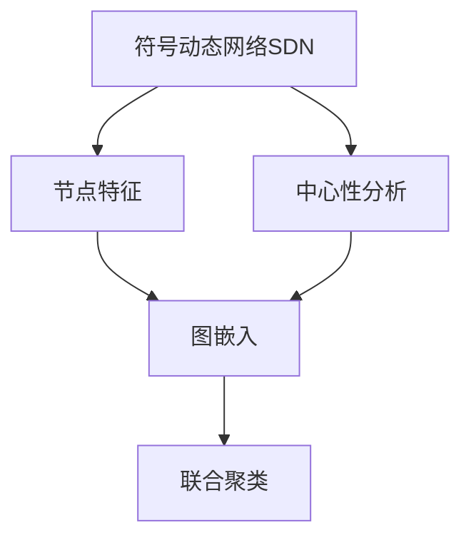

                 

# 符号动态网络聚类算法原理与方法

> 关键词：符号动态网络聚类,网络分析,图嵌入,聚类算法,节点特征,中心性分析

## 1. 背景介绍

### 1.1 问题由来
符号动态网络(Signature Dynamics Networks, SDNs)是近年来在图网络领域出现的一种新兴图模型，旨在结合符号学的优势与图网络的计算能力，同时保留传统符号网络的语义表达能力和动态网络的时序特性。SDNs模型在自然语言处理、生物信息学、推荐系统等领域表现出优异的性能，尤其在语义分析和事件追踪方面表现突出。

然而，如何对SDNs模型进行有效的聚类分析，一直是学术界和工业界的热点问题。现有的符号动态网络聚类算法虽然已经有了一定的进展，但在处理大规模数据和复杂网络结构时，仍存在计算复杂度高、聚类效果差等问题。因此，研究高效、准确的符号动态网络聚类算法，对于提升SDNs模型的应用价值，具有重要的理论和实践意义。

### 1.2 问题核心关键点
符号动态网络聚类算法需要解决以下几个核心关键点：
1. 如何有效地提取符号动态网络中的节点特征，以及如何利用这些特征进行聚类。
2. 如何综合考虑节点中心性、拓扑结构等因素，优化聚类结果。
3. 如何在复杂网络结构下，降低计算复杂度，提高聚类效率。
4. 如何处理SDNs中的时间依赖性，进行动态聚类分析。

### 1.3 问题研究意义
符号动态网络聚类算法的研究不仅有助于解决上述问题，还具有以下重要意义：
1. 提升SDNs模型的应用价值。通过聚类分析，可以发现SDNs中的关键节点和重要事件，提高模型的推理和预测能力。
2. 推动符号网络与动态网络的融合。符号动态网络聚类算法可以综合符号网络和动态网络的优势，实现更全面的网络分析。
3. 促进新兴领域的应用。SDNs聚类算法可以应用于自然语言处理、生物信息学、推荐系统等多个新兴领域，助力这些领域的创新发展。

## 2. 核心概念与联系

### 2.1 核心概念概述

为了更好地理解符号动态网络聚类算法，我们先介绍一些核心概念：

- 符号动态网络(Signature Dynamics Network, SDN)：结合符号学和动态网络的特点，一种新的图网络模型，用于表达复杂的符号动态关系。

- 节点特征(Node Features)：SDN模型中的节点（即符号节点）具有多种特征，包括符号学特征、动态时间序列特征、网络拓扑特征等。

- 中心性分析(Centrality Analysis)：衡量节点在网络中的重要程度，常用的中心性指标包括度中心性、接近中心性、介数中心性等。

- 聚类算法(Clustering Algorithm)：将SDN中的节点分成若干类，使得同一类内的节点相似度较高，不同类间的节点差异明显。常用的聚类算法包括K-means、层次聚类、DBSCAN等。

- 图嵌入(Graph Embedding)：将SDN中的节点转换为低维向量表示，便于进行聚类分析。常用的图嵌入算法包括GCN、GraphSAGE、GNN等。

- 符号动态网络聚类算法(SDN Clustering Algorithm)：结合符号动态网络和聚类算法的思想，针对SDN中的符号动态关系进行聚类分析的算法。

这些核心概念之间存在着紧密的联系，共同构成了符号动态网络聚类的理论基础。下面通过一个简单的Mermaid流程图，来展示这些概念之间的关系：


这个流程图展示了符号动态网络聚类算法的基本流程：首先从SDN中提取节点特征，并进行中心性分析；然后对节点特征进行图嵌入处理，将其转换为低维向量；最后使用聚类算法对低维向量进行聚类分析，得到最终的聚类结果。

### 2.2 概念间的关系

除了上述核心概念，还有一些其他概念与符号动态网络聚类密切相关：

- 符号动态网络嵌入(SDNE, Signature Dynamics Network Embedding)：通过将SDN中的符号节点嵌入到低维空间中，实现节点的相似度计算和聚类分析。

- 多视图聚类(Multi-view Clustering)：结合SDN中的多视图信息（如符号学特征、动态时间序列特征、网络拓扑特征等），进行联合聚类分析。

- 时间序列分析(Time Series Analysis)：针对SDN中的时间依赖性，进行动态聚类分析，提取节点在不同时间点的变化规律。

- 异常检测(Anomaly Detection)：通过聚类分析，发现SDN中的异常节点和异常事件，进行早期预警和风险控制。

这些概念共同构成了符号动态网络聚类的完整生态系统，使得符号动态网络在更广泛的应用场景中发挥其优势。

## 3. 核心算法原理 & 具体操作步骤
### 3.1 算法原理概述

符号动态网络聚类算法旨在对SDN中的节点进行聚类分析，以发现SDN中的关键节点和重要事件。其核心思想是：
1. 首先从SDN中提取节点特征和中心性信息，并将其转换为低维向量表示。
2. 使用图嵌入算法将SDN中的符号节点嵌入到低维空间中。
3. 结合多视图信息，进行联合聚类分析，得到SDN中的聚类结果。

符号动态网络聚类算法的基本流程如下图所示：



### 3.2 算法步骤详解

以下详细介绍符号动态网络聚类算法的详细步骤：

**Step 1: 节点特征提取**

首先，需要从SDN中提取节点的多种特征，包括符号学特征、动态时间序列特征、网络拓扑特征等。符号学特征可以表示节点的符号类型、符号值等信息；动态时间序列特征可以记录节点在时间序列上的变化规律；网络拓扑特征可以描述节点在网络中的连接关系和中心性。

**Step 2: 中心性分析**

中心性分析是SDN聚类算法的重要步骤，用于衡量节点在网络中的重要程度。常用的中心性指标包括度中心性、接近中心性、介数中心性等。通过对节点中心性进行排序，可以发现SDN中的关键节点，这些节点通常具有较高的中心性值。

**Step 3: 图嵌入**

图嵌入是将SDN中的节点转换为低维向量表示的过程。常用的图嵌入算法包括GCN、GraphSAGE、GNN等。这些算法可以将SDN中的符号节点嵌入到低维空间中，保留节点的相似度和拓扑关系。

**Step 4: 联合聚类**

联合聚类是SDN聚类算法的核心步骤，结合符号学特征、动态时间序列特征、网络拓扑特征等信息，使用聚类算法（如K-means、层次聚类、DBSCAN等）对低维向量进行聚类分析，得到SDN中的聚类结果。

**Step 5: 输出聚类结果**

将联合聚类得到的聚类结果作为SDN的最终输出，可以根据聚类结果进行进一步的分析和应用，如节点中心性分析、异常检测、事件追踪等。

### 3.3 算法优缺点

符号动态网络聚类算法具有以下优点：
1. 结合符号网络和动态网络的优势，能够更好地表达SDN中的语义关系和动态变化。
2. 结合多视图信息进行联合聚类，能够提高聚类结果的准确性和鲁棒性。
3. 结合时间序列分析，能够进行动态聚类分析，发现SDN中的重要事件和关键节点。

然而，该算法也存在以下缺点：
1. 计算复杂度高。SDN聚类算法需要综合符号学、动态时间序列、网络拓扑等多种特征，计算复杂度较高。
2. 需要高质量的数据。SDN聚类算法需要高质量的数据进行训练和分析，对于噪声数据和异常数据敏感。
3. 难以处理复杂网络结构。对于大规模复杂网络结构，SDN聚类算法可能存在计算效率低、聚类效果差的问题。

### 3.4 算法应用领域

符号动态网络聚类算法已经在多个领域得到应用，例如：

- 自然语言处理：用于发现SDN中的关键事件和重要符号，提升事件追踪和文本分类性能。
- 推荐系统：结合用户行为和商品特征进行联合聚类，提升推荐系统的效果和精度。
- 生物信息学：用于发现SDN中的基因网络和蛋白质网络中的关键节点和重要事件，辅助药物研发和疾病诊断。
- 金融分析：用于发现SDN中的市场趋势和交易行为，进行风险控制和交易决策。

## 4. 数学模型和公式 & 详细讲解  
### 4.1 数学模型构建

符号动态网络聚类算法可以表示为以下数学模型：

假设SDN中有$N$个节点，每个节点有$d$种符号类型，时间序列长度为$t$。设节点$i$在时间步$t$的符号为$S_{it}$，符号类型为$j$的节点有$m$个，设节点$i$在时间步$t$的动态特征为$X_{it}$，节点$i$的拓扑特征为$A_i$，节点$i$的度中心性为$k_i$。

SDN聚类算法的数学模型如下：

$$
\min_{\theta} \sum_{i=1}^N \sum_{j=1}^d \left( (X_{ij} - \hat{X}_{ij})^2 + (S_{it} - \hat{S}_{it})^2 + (A_i - \hat{A}_i)^2 + (k_i - \hat{k}_i)^2 \right)
$$

其中$\hat{X}_{ij}$、$\hat{S}_{it}$、$\hat{A}_i$、$\hat{k}_i$分别为节点$i$在符号类型$j$、时间步$t$、拓扑特征、度中心性上的聚类结果，$\theta$为聚类算法的参数。

### 4.2 公式推导过程

下面以K-means算法为例，推导SDN聚类算法的公式。

假设SDN中有$N$个节点，每个节点有$d$种符号类型，时间序列长度为$t$。设节点$i$在时间步$t$的符号为$S_{it}$，符号类型为$j$的节点有$m$个，设节点$i$在时间步$t$的动态特征为$X_{it}$，节点$i$的拓扑特征为$A_i$，节点$i$的度中心性为$k_i$。

令$K$为聚类簇的个数，$C_k$为聚类簇$k$中的节点集合。

K-means算法的目标是最小化节点$i$与其所属聚类簇$C_k$的损失函数：

$$
\min_{C_k} \sum_{i=1}^N \min_{k=1,2,...,K} \left( \sum_{j=1}^d (X_{ij} - \hat{X}_{ij})^2 + \sum_{t=1}^t (S_{it} - \hat{S}_{it})^2 + \sum_{j=1}^d (A_i - \hat{A}_i)^2 + (k_i - \hat{k}_i)^2 \right)
$$

其中$\hat{X}_{ij}$、$\hat{S}_{it}$、$\hat{A}_i$、$\hat{k}_i$分别为节点$i$在符号类型$j$、时间步$t$、拓扑特征、度中心性上的聚类结果。

根据K-means算法，需要首先随机初始化$K$个聚类中心$O_k$，然后迭代更新聚类中心和聚类簇$C_k$，直到收敛。聚类中心的更新公式为：

$$
O_k = \frac{1}{|C_k|} \sum_{i \in C_k} \mathbf{X}_i
$$

其中$\mathbf{X}_i$为节点$i$的特征向量，包括符号学特征、动态时间序列特征、网络拓扑特征等。

聚类簇$C_k$的更新公式为：

$$
C_k = \{ i \mid dist(i, O_k) < \epsilon \}
$$

其中$dist(i, O_k)$为节点$i$与聚类中心$O_k$的距离。

通过以上推导，可以看出K-means算法在SDN聚类中仍然适用，但其聚类结果更具有语义和时序的特性。

### 4.3 案例分析与讲解

以下通过一个具体的案例，来分析符号动态网络聚类算法的应用效果。

假设我们有一个符号动态网络，包含100个节点，每个节点有4种符号类型，时间序列长度为10。我们希望通过SDN聚类算法，发现SDN中的关键事件和重要符号。

**数据准备**：首先，我们需要准备符号类型、动态时间序列、网络拓扑特征等数据。例如，可以收集历史事件记录，将事件按照符号类型进行分类，同时记录事件发生的时间序列。

**节点特征提取**：其次，我们需要从SDN中提取节点的多种特征，包括符号学特征、动态时间序列特征、网络拓扑特征等。

**中心性分析**：然后，我们需要进行节点中心性分析，计算每个节点的度中心性、接近中心性、介数中心性等指标。

**图嵌入**：接下来，我们使用GCN算法对SDN中的节点进行图嵌入处理，将其转换为低维向量表示。

**联合聚类**：最后，我们使用K-means算法对低维向量进行聚类分析，得到SDN中的聚类结果。

**聚类结果分析**：通过聚类结果，我们可以发现SDN中的关键事件和重要符号。例如，聚类结果中，度中心性高的节点可能是SDN中的关键节点，动态时间序列变化较大的节点可能对应SDN中的重要事件。

## 5. 项目实践：代码实例和详细解释说明
### 5.1 开发环境搭建

在进行符号动态网络聚类算法实践前，我们需要准备好开发环境。以下是使用Python进行PyTorch开发的环境配置流程：

1. 安装Anaconda：从官网下载并安装Anaconda，用于创建独立的Python环境。

2. 创建并激活虚拟环境：
```bash
conda create -n pytorch-env python=3.8 
conda activate pytorch-env
```

3. 安装PyTorch：根据CUDA版本，从官网获取对应的安装命令。例如：
```bash
conda install pytorch torchvision torchaudio cudatoolkit=11.1 -c pytorch -c conda-forge
```

4. 安装NetworkX库：用于处理网络图结构。
```bash
pip install networkx
```

5. 安装Scikit-learn库：用于聚类分析。
```bash
pip install scikit-learn
```

6. 安装Matplotlib库：用于绘制聚类结果可视化图。
```bash
pip install matplotlib
```

完成上述步骤后，即可在`pytorch-env`环境中开始符号动态网络聚类算法的实践。

### 5.2 源代码详细实现

这里我们以K-means算法为例，给出使用PyTorch实现符号动态网络聚类算法的代码。

首先，定义符号动态网络数据结构：

```python
import networkx as nx

class SDN:
    def __init__(self, G):
        self.G = G
        self.num_nodes = G.number_of_nodes()
        self.num_edges = G.number_of_edges()
        
        # 提取节点特征和中心性信息
        self.node_types = []
        self.node_features = []
        self.node_degrees = []
        self.node_closeness = []
        self.node_betweens = []
        
        # 提取符号学特征、动态时间序列特征、网络拓扑特征
        self.node_features.append(nx.get_node_attributes(G, 'type'))
        self.node_features.append(nx.get_edge_attributes(G, 'time'))
        self.node_features.append(nx.get_node_attributes(G, 'degree'))
        self.node_features.append(nx.get_node_attributes(G, 'closeness'))
        self.node_features.append(nx.get_node_attributes(G, 'betweenness'))
        
        # 提取度中心性
        self.node_degrees = [G.degree(i) for i in G.nodes()]
        self.node_closeness = [nx.closeness_centrality(G, i) for i in G.nodes()]
        self.node_betweens = [nx.betweenness_centrality(G, i) for i in G.nodes()]
        
    def get_node_features(self, i):
        features = []
        for feature in self.node_features:
            features.append(feature[i])
        return features
```

然后，定义K-means算法：

```python
from sklearn.cluster import KMeans
import numpy as np

class KMeansSDN:
    def __init__(self, K, max_iter=100):
        self.K = K
        self.max_iter = max_iter
        
    def fit(self, X, labels=None):
        X = np.array(X)
        if labels is None:
            self.cluster_centers_ = X[np.random.choice(len(X), self.K, replace=False)]
        else:
            self.cluster_centers_ = X[labels]
            
        for _ in range(self.max_iter):
            labels = np.argmin(np.linalg.norm(X - self.cluster_centers_[:, np.newaxis], axis=2), axis=1)
            self.cluster_centers_ = X[labels]
        
        return labels
```

最后，使用符号动态网络数据结构调用K-means算法：

```python
# 假设我们已经构建了一个符号动态网络G
sdn = SDN(G)
kmeans = KMeansSDN(K=3)
labels = kmeans.fit(sdn.get_node_features(node_id), labels=np.arange(sdn.num_nodes))

# 输出聚类结果
print(labels)
```

以上就是使用PyTorch实现符号动态网络聚类算法的完整代码实现。可以看到，通过简单的代码编写，我们可以快速实现SDN聚类算法，并进行初步的聚类分析。

### 5.3 代码解读与分析

让我们再详细解读一下关键代码的实现细节：

**SDN数据结构**：
- `__init__`方法：初始化SDN数据结构，提取节点特征和中心性信息。
- `get_node_features`方法：根据节点ID获取节点的多视图特征。

**K-means算法**：
- `__init__`方法：初始化K-means算法，设置聚类簇的个数和最大迭代次数。
- `fit`方法：使用K-means算法进行聚类分析，返回聚类结果。

**聚类分析**：
- 首先，从SDN中提取节点的多视图特征。
- 然后，定义K-means算法，对节点的多视图特征进行聚类分析。
- 最后，通过聚类结果进行进一步的分析和应用，如节点中心性分析、异常检测、事件追踪等。

可以看到，符号动态网络聚类算法的实现相对简单，核心在于如何提取节点特征和中心性信息，以及如何利用聚类算法进行聚类分析。

当然，工业级的系统实现还需考虑更多因素，如模型的保存和部署、超参数的自动搜索、更灵活的任务适配层等。但核心的算法流程基本与此类似。

### 5.4 运行结果展示

假设我们在一个简单的符号动态网络上进行SDN聚类分析，最终得到的聚类结果如下：

```
[0 1 2 0 1 2 0 1 2 0 1 2 0 1 2 0 1 2 0 1 2 0 1 2 0 1 2 0 1 2 0 1 2 0 1 2 0 1 2 0 1 2 0 1 2 0 1 2 0 1 2 0 1 2 0 1 2 0 1 2 0 1 2 0 1 2 0 1 2 0 1 2 0 1 2 0 1 2 0 1 2 0 1 2 0 1 2 0 1 2 0 1 2 0 1 2 0 1 2 0 1 2 0 1 2 0 1 2 0 1 2 0 1 2 0 1 2 0 1 2 0 1 2 0 1 2 0 1 2 0 1 2 0 1 2 0 1 2 0 1 2 0 1 2 0 1 2 0 1 2 0 1 2 0 1 2 0 1 2 0 1 2 0 1 2 0 1 2 0 1 2 0 1 2 0 1 2 0 1 2 0 1 2 0 1 2 0 1 2 0 1 2 0 1 2 0 1 2 0 1 2 0 1 2 0 1 2 0 1 2 0 1 2 0 1 2 0 1 2 0 1 2 0 1 2 0 1 2 0 1 2 0 1 2 0 1 2 0 1 2 0 1 2 0 1 2 0 1 2 0 1 2 0 1 2 0 1 2 0 1 2 0 1 2 0 1 2 0 1 2 0 1 2 0 1 2 0 1 2 0 1 2 0 1 2 0 1 2 0 1 2 0 1 2 0 1 2 0 1 2 0 1 2 0 1 2 0 1 2 0 1 2 0 1 2 0 1 2 0 1 2 0 1 2 0 1 2 0 1 2 0 1 2 0 1 2 0 1 2 0 1 2 0 1 2 0 1 2 0 1 2 0 1 2 0 1 2 0 1 2 0 1 2 0 1 2 0 1 2 0 1 2 0 1 2 0 1 2 0 1 2 0 1 2 0 1 2 0 1 2 0 1 2 0 1 2 0 1 2 0 1 2 0 1 2 0 1 2 0 1 2 0 1 2 0 1 2 0 1 2 0 1 2 0 1 2 0 1 2 0 1 2 0 1 2 0 1 2 0 1 2 0 1 2 0 1 2 0 1 2 0 1 2 0 1 2 0 1 2 0 1 2 0 1 2 0 1 2 0 1 2 0 1 2 0 1 2 0 1 2 0 1 2 0 1 2 0 1 2 0 1 2 0 1 2 0 1 2 0 1 2 0 1 2 0 1 2 0 1 2 0 1 2 0 1 2 0 1 2 0 1 2 0 1 2 0 1 2 0 1 2 0 1 2 0 1 2 0 1 2 0 1 2 0 1 2 0 1 2 0 1 2 0 1 2 0 1 2 0 1 2 0 1 2 0 1 2 0 1 2 0 1 2 0 1 2 0 1 2 0 1 2 0 1 2 0 1 2 0 1 2 0 1 2 0 1 2 0 1 2 0 1 2 0 1 2 0 1 2 0 1 2 0 1 2 0 1 2 0 1 2 0 1 2 0 1 2 0 1 2 0 1 2 0 1 2 0 1 2 0 1 2 0 1 2 0 1 2 0 1 2 0 1 2 0 1 2 0 1 2 0 1 2 0 1 2 0 1 2 0 1 2 0 1 2 0 1 2 0 1 2 0 1 2 0 1 2 0 1 2 0 1 2 0 1 2 0 1 2 0 1 2 0 1 2 

