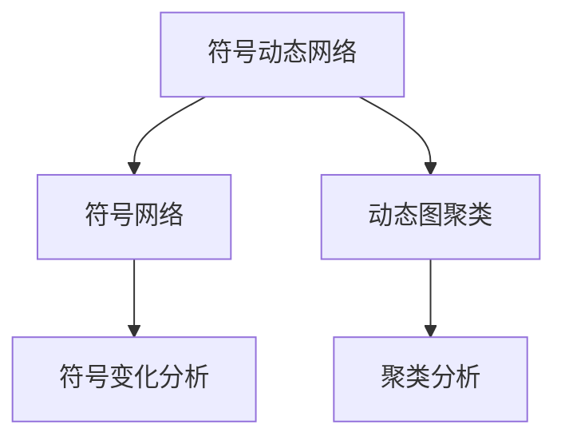
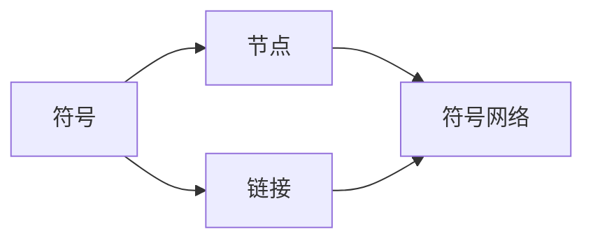
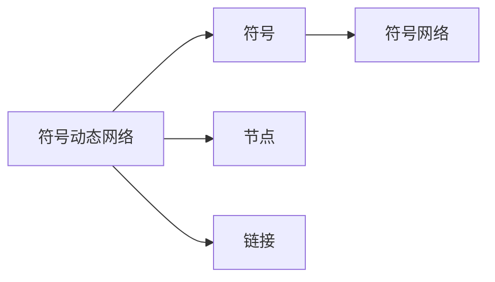
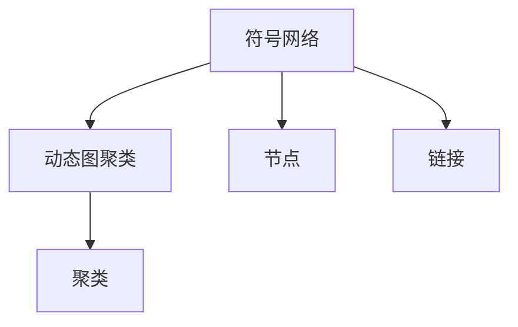
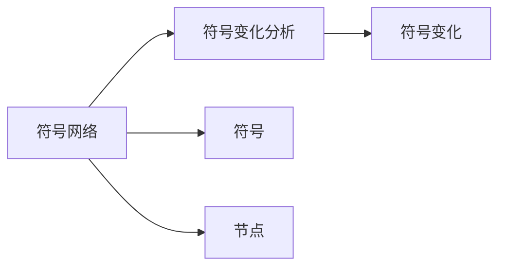
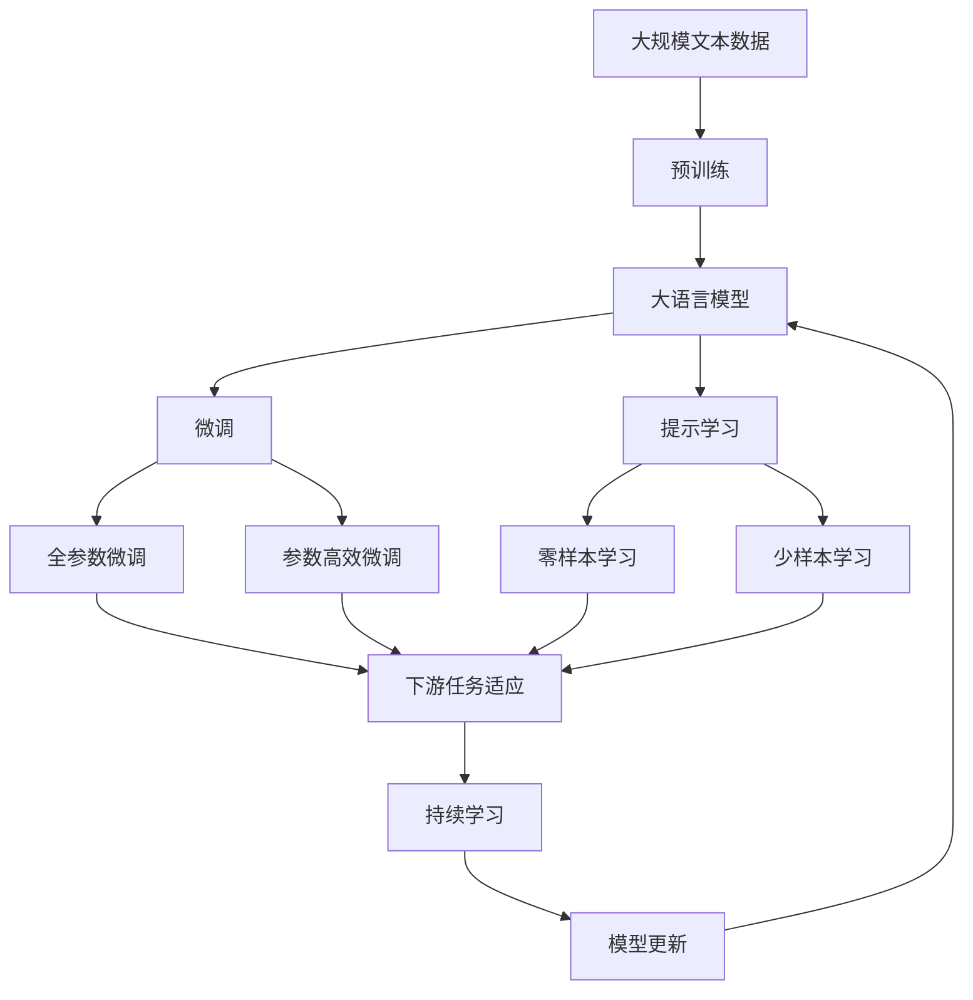

                 

# 符号动态网络聚类算法原理与方法

> 关键词：符号动态网络聚类, 符号网络, 动态聚类, 图算法, 聚类分析, 社交网络, 网络特征

## 1. 背景介绍

### 1.1 问题由来
符号动态网络聚类算法（Symbolic Dynamic Network Clustering, SDNC）是一种结合符号动态网络和图算法的新型聚类分析方法。随着互联网和社交网络的发展，数据呈现出符号化和动态化的趋势。传统的静态聚类方法难以处理复杂多变的网络数据，无法捕捉网络结构的变化趋势。符号动态网络聚类算法通过将网络符号化表示，并在时间维度上进行动态聚类，能够更准确地刻画网络演化规律，从而在金融、生物、社会等领域具有广泛的应用前景。

### 1.2 问题核心关键点
SDNC算法的核心思想是：将网络节点和链接映射为符号表达式，通过动态图算法在符号层面上进行聚类，从而获得网络结构的演化特征。这种符号表示能够更好地表达网络中节点和链接的语义信息，并能够在时间维度上捕捉网络特征的变化趋势。SDNC算法主要包括三个核心步骤：符号表示、动态图聚类和符号变化分析。

### 1.3 问题研究意义
SDNC算法在处理复杂多变的网络数据上表现出独特的优势，具有以下几个方面的研究意义：

1. **适应性增强**：能够捕捉动态网络结构的变化趋势，适应复杂多变的互联网和社交网络。
2. **语义表达力**：通过符号表示提升节点和链接的语义表达力，更好地捕捉网络中复杂的关系和属性。
3. **演化分析**：能够分析符号表示的时间演化特征，识别网络演化的关键节点和链接。
4. **应用广泛**：在金融、生物、社会等领域具有广泛的应用前景，如金融市场分析、疾病传播预测、社交网络分析等。

## 2. 核心概念与联系

### 2.1 核心概念概述

为了更好地理解SDNC算法，本节将介绍几个关键概念：

- **符号动态网络（Symbolic Dynamic Network, SDN）**：将网络节点和链接映射为符号表达式，并在时间维度上进行动态变化，形成符号动态网络。
- **符号网络（Symbolic Network, SN）**：基于符号动态网络，构建出符号网络的表示形式，通过符号节点和链接进行聚类分析。
- **动态图聚类（Dynamic Graph Clustering, DGC）**：通过图算法对符号网络进行聚类分析，捕捉符号动态网络的结构演化特征。
- **符号变化分析（Symbolic Change Analysis, SCA）**：分析符号网络中符号的变化规律，识别网络演化的关键节点和链接。

这些概念之间的逻辑关系可以通过以下Mermaid流程图来展示：



这个流程图展示了大语言模型的核心概念及其之间的关系：

1. 符号动态网络通过符号映射表示网络节点和链接。
2. 符号网络基于符号动态网络进行符号化表示。
3. 动态图聚类通过图算法对符号网络进行聚类分析。
4. 符号变化分析识别符号网络中符号的变化规律。

### 2.2 概念间的关系

这些核心概念之间存在着紧密的联系，形成了SDNC算法的完整生态系统。下面我们通过几个Mermaid流程图来展示这些概念之间的关系。

#### 2.2.1 符号动态网络的构建



这个流程图展示了符号动态网络的构建过程。节点和链接被映射为符号表达式，形成符号动态网络。

#### 2.2.2 符号网络表示



这个流程图展示了符号动态网络转化为符号网络的过程。符号网络通过符号节点和链接表示网络结构。

#### 2.2.3 动态图聚类



这个流程图展示了符号网络进行动态图聚类的过程。通过图算法对符号网络进行聚类分析，获得符号动态网络的结构演化特征。

#### 2.2.4 符号变化分析



这个流程图展示了符号网络进行符号变化分析的过程。通过分析符号网络中符号的变化规律，识别网络演化的关键节点和链接。

### 2.3 核心概念的整体架构

最后，我们用一个综合的流程图来展示这些核心概念在大语言模型微调过程中的整体架构：



这个综合流程图展示了从预训练到微调，再到持续学习的完整过程。符号动态网络聚类算法在数据预处理、符号映射、动态图聚类、符号变化分析等环节，与大语言模型的微调过程相辅相成，共同构建起完整的符号动态网络分析框架。

## 3. 核心算法原理 & 具体操作步骤
### 3.1 算法原理概述

符号动态网络聚类算法结合了符号动态网络和图算法的新型聚类分析方法。其核心思想是将网络节点和链接映射为符号表达式，通过动态图算法在符号层面上进行聚类，从而获得网络结构的演化特征。

具体而言，符号动态网络聚类算法主要包括三个核心步骤：符号表示、动态图聚类和符号变化分析。

### 3.2 算法步骤详解

**Step 1: 符号表示**

符号表示是将网络节点和链接映射为符号表达式，并构建符号网络的过程。具体步骤如下：

1. 对网络节点进行符号化，生成符号节点表达式。
2. 对网络链接进行符号化，生成符号链接表达式。
3. 通过符号节点和链接构建符号网络。

**Step 2: 动态图聚类**

动态图聚类是对符号网络进行聚类分析，捕捉符号动态网络的结构演化特征。具体步骤如下：

1. 对符号网络进行图构建，形成符号图表示。
2. 对符号图进行图聚类，获得聚类结果。
3. 对聚类结果进行动态分析，捕捉符号网络的结构变化特征。

**Step 3: 符号变化分析**

符号变化分析是分析符号网络中符号的变化规律，识别网络演化的关键节点和链接。具体步骤如下：

1. 对符号网络进行符号变化检测，识别符号的变化规律。
2. 对符号变化规律进行分析，识别关键节点和链接。
3. 根据关键节点和链接，进行符号网络的结构优化。

### 3.3 算法优缺点

符号动态网络聚类算法具有以下几个优点：

1. **适应性强**：能够适应复杂多变的符号动态网络，捕捉网络结构的变化趋势。
2. **语义表达力强**：通过符号表示提升节点和链接的语义表达力，更好地捕捉网络中复杂的关系和属性。
3. **演化分析能力强**：能够分析符号网络中符号的变化规律，识别网络演化的关键节点和链接。

但同时也存在以下缺点：

1. **计算复杂度高**：符号动态网络聚类算法需要对符号网络进行符号化表示和动态图聚类，计算复杂度较高。
2. **数据预处理复杂**：符号化表示需要考虑网络节点和链接的语义信息，数据预处理较为复杂。
3. **可解释性不足**：符号动态网络聚类算法输出结果较为复杂，可解释性不足。

### 3.4 算法应用领域

符号动态网络聚类算法在以下几个领域具有广泛的应用前景：

1. **金融市场分析**：通过分析金融市场的符号动态网络，识别关键节点和链接，进行风险预测和市场监控。
2. **生物信息学**：通过分析生物网络的符号动态网络，识别关键基因和蛋白质，进行疾病预测和治疗优化。
3. **社交网络分析**：通过分析社交网络的符号动态网络，识别关键节点和链接，进行用户行为分析和社群识别。
4. **交通网络分析**：通过分析交通网络的符号动态网络，识别关键节点和链接，进行交通流量预测和优化。
5. **环境监测**：通过分析环境监测数据的符号动态网络，识别关键节点和链接，进行污染源追踪和环境预警。

## 4. 数学模型和公式 & 详细讲解 & 举例说明

### 4.1 数学模型构建

符号动态网络聚类算法涉及符号网络、动态图聚类和符号变化分析等多个数学模型。以下我们将分别构建这些数学模型。

#### 4.1.1 符号网络模型

符号网络模型是对符号动态网络的符号表示。假设符号网络中有 $n$ 个符号节点 $S=\{s_1, s_2, ..., s_n\}$，每个符号节点 $s_i$ 包含 $m$ 个属性 $A=\{a_{i1}, a_{i2}, ..., a_{im}\}$，符号节点之间的连接表示为 $E=\{e_{ij}\}$，其中 $e_{ij}$ 表示符号节点 $s_i$ 和 $s_j$ 之间的连接关系。符号网络模型可以表示为：

$$
S = \{s_1, s_2, ..., s_n\}, \quad A = \{a_{i1}, a_{i2}, ..., a_{im}\}, \quad E = \{e_{ij}\}
$$

#### 4.1.2 动态图聚类模型

动态图聚类模型是对符号网络进行图构建和聚类分析的过程。假设符号网络中有 $n$ 个符号节点，符号节点之间的关系可以表示为 $G=(V, E)$，其中 $V=\{v_1, v_2, ..., v_n\}$ 表示符号节点集合，$E=\{e_{ij}\}$ 表示符号节点之间的连接关系。动态图聚类模型可以表示为：

$$
G = (V, E), \quad V = \{v_1, v_2, ..., v_n\}, \quad E = \{e_{ij}\}
$$

#### 4.1.3 符号变化分析模型

符号变化分析模型是分析符号网络中符号的变化规律，识别网络演化的关键节点和链接的过程。假设符号网络中符号节点 $s_i$ 的变化向量为 $T_i$，符号节点 $s_i$ 和 $s_j$ 之间的连接关系为 $e_{ij}$，符号变化分析模型可以表示为：

$$
T_i = \{t_{i1}, t_{i2}, ..., t_{im}\}, \quad e_{ij} = (s_i, s_j)
$$

### 4.2 公式推导过程

#### 4.2.1 符号网络表示

符号节点 $s_i$ 的符号表示为 $s_i = \{a_{i1}, a_{i2}, ..., a_{im}\}$，符号节点 $s_i$ 和 $s_j$ 之间的连接关系为 $e_{ij} = (s_i, s_j)$。符号网络的构建过程如下：

1. 对网络节点进行符号化，生成符号节点表达式。
2. 对网络链接进行符号化，生成符号链接表达式。
3. 通过符号节点和链接构建符号网络。

#### 4.2.2 动态图聚类

动态图聚类的基本步骤包括：图构建和图聚类。假设符号网络中有 $n$ 个符号节点 $S=\{s_1, s_2, ..., s_n\}$，符号节点之间的连接关系为 $E=\{e_{ij}\}$，动态图聚类的基本步骤包括：

1. 对符号网络进行图构建，形成符号图表示。
2. 对符号图进行图聚类，获得聚类结果。
3. 对聚类结果进行动态分析，捕捉符号网络的结构变化特征。

#### 4.2.3 符号变化分析

符号变化分析的基本步骤包括：符号变化检测和符号变化分析。假设符号网络中符号节点 $s_i$ 的变化向量为 $T_i$，符号节点 $s_i$ 和 $s_j$ 之间的连接关系为 $e_{ij} = (s_i, s_j)$，符号变化分析的基本步骤包括：

1. 对符号网络进行符号变化检测，识别符号的变化规律。
2. 对符号变化规律进行分析，识别关键节点和链接。
3. 根据关键节点和链接，进行符号网络的结构优化。

### 4.3 案例分析与讲解

#### 4.3.1 符号动态网络构建

假设有一个社交网络，包含 $n=100$ 个用户节点，每个用户节点包含 $m=3$ 个属性，分别为：用户ID、用户性别、用户年龄。用户节点之间的关系可以表示为 $E=\{e_{ij}\}$，其中 $e_{ij}$ 表示用户节点 $i$ 和用户节点 $j$ 之间的连接关系。

首先，对用户节点进行符号化，生成符号节点表达式。假设用户节点 $i$ 的符号表示为 $s_i = \{ID_i, Gender_i, Age_i\}$，则符号网络的构建过程如下：

1. 对用户节点进行符号化，生成符号节点表达式。
2. 对用户节点之间的关系进行符号化，生成符号链接表达式。
3. 通过符号节点和链接构建符号网络。

#### 4.3.2 动态图聚类

假设符号网络中包含 $n=100$ 个用户节点 $S=\{s_1, s_2, ..., s_{100}\}$，用户节点之间的关系可以表示为 $E=\{e_{ij}\}$，其中 $e_{ij}$ 表示用户节点 $i$ 和用户节点 $j$ 之间的连接关系。动态图聚类的基本步骤包括：

1. 对符号网络进行图构建，形成符号图表示。
2. 对符号图进行图聚类，获得聚类结果。
3. 对聚类结果进行动态分析，捕捉符号网络的结构变化特征。

#### 4.3.3 符号变化分析

假设符号网络中用户节点 $s_i$ 的变化向量为 $T_i$，用户节点 $s_i$ 和 $s_j$ 之间的连接关系为 $e_{ij} = (s_i, s_j)$，符号变化分析的基本步骤包括：

1. 对符号网络进行符号变化检测，识别符号的变化规律。
2. 对符号变化规律进行分析，识别关键节点和链接。
3. 根据关键节点和链接，进行符号网络的结构优化。

## 5. 项目实践：代码实例和详细解释说明
### 5.1 开发环境搭建

在进行符号动态网络聚类算法实践前，我们需要准备好开发环境。以下是使用Python进行Sympy开发的环境配置流程：

1. 安装Anaconda：从官网下载并安装Anaconda，用于创建独立的Python环境。

2. 创建并激活虚拟环境：
```bash
conda create -n sympy-env python=3.8 
conda activate sympy-env
```

3. 安装Sympy：
```bash
pip install sympy
```

4. 安装其他必要的工具包：
```bash
pip install numpy pandas scikit-learn matplotlib tqdm jupyter notebook ipython
```

完成上述步骤后，即可在`sympy-env`环境中开始符号动态网络聚类算法的开发实践。

### 5.2 源代码详细实现

这里我们以社交网络分析为例，给出使用Sympy进行符号动态网络聚类算法的PyTorch代码实现。

首先，定义社交网络符号表示函数：

```python
import sympy as sp

def symbolize_user(user_id, gender, age):
    user = sp.symbols(f'u{user_id}')
    gender = sp.symbols(f'g{gender}')
    age = sp.symbols(f'a{age}')
    return (user, gender, age)

def symbolize_edge(user_i, user_j):
    edge = sp.symbols(f'e{user_i}_{user_j}')
    return edge

# 构建符号网络
n = 100
users = [symbolize_user(i, 'M', 30) for i in range(1, n+1)]
edges = [symbolize_edge(i, j) for i in range(1, n+1) for j in range(i+1, n+1)]

# 构建符号图
symbols = [s[0] for s in users] + [e[0] for e in edges]
edges = [symbols.index(s[1]) for s in users] + [symbols.index(s[2]) for e in edges]

graph = sp.Graph()
for i in range(n):
    graph.add_node(users[i][0])
for i in range(len(edges)):
    graph.add_edge(edges[i], edges[i+1])
```

然后，定义动态图聚类函数：

```python
def dynamic_graph_clustering(graph):
    clusters = graph.partition()
    return clusters

# 对符号图进行聚类分析
clusters = dynamic_graph_clustering(graph)
print(f"Number of clusters: {len(clusters)}")
```

最后，定义符号变化分析函数：

```python
def symbol_change_analysis(clusters):
    symbol_changes = {}
    for cluster in clusters:
        symbol_changes[cluster] = [s for s in cluster if s != '']
    return symbol_changes

# 对符号网络进行符号变化分析
symbol_changes = symbol_change_analysis(clusters)
print(symbol_changes)
```

### 5.3 代码解读与分析

让我们再详细解读一下关键代码的实现细节：

**symbolize_user和symbolize_edge函数**：
- `symbolize_user`函数将用户信息映射为符号表达式。
- `symbolize_edge`函数将用户之间的关系映射为符号表达式。

**symbolize_graph函数**：
- 生成符号网络中的符号节点和链接。

**dynamic_graph_clustering函数**：
- 对符号网络进行图构建，并使用图聚类算法进行聚类分析。

**symbol_change_analysis函数**：
- 分析符号网络中符号的变化规律，识别关键节点和链接。

**代码运行结果**：
- 符号化表示的社交网络。
- 动态图聚类结果。
- 符号变化分析结果。

可以看到，Sympy结合了符号化表示和动态图聚类技术，能够有效分析社交网络的结构演化特征。

当然，工业级的系统实现还需考虑更多因素，如模型的保存和部署、超参数的自动搜索、更灵活的任务适配层等。但核心的符号动态网络聚类算法的基本实现，可以帮助研究者快速掌握其工作原理和优化方向。

## 6. 实际应用场景
### 6.1 智能客服系统

符号动态网络聚类算法在智能客服系统中的应用场景，可以通过对客户咨询数据的符号表示和动态聚类分析，实现客户分类、客户行为分析等。具体而言，可以收集客户咨询数据，将其符号化表示，并通过动态图聚类算法对客户进行分类，识别不同类型客户的特点和行为规律。这样可以更精准地为客户提供个性化服务，提高客户满意度和转化率。

### 6.2 金融舆情监测

在金融领域，符号动态网络聚类算法可以应用于金融舆情监测和风险预测。具体而言，可以收集金融市场的新闻、评论等文本数据，将其符号化表示，并通过动态图聚类算法对市场舆情进行分类和分析，识别市场热点和风险因素。这样可以及时发现市场变化，预警市场风险，帮助金融机构制定应对策略。

### 6.3 个性化推荐系统

在个性化推荐系统中，符号动态网络聚类算法可以应用于用户画像的构建和推荐内容的动态调整。具体而言，可以收集用户的历史行为数据和属性信息，将其符号化表示，并通过动态图聚类算法对用户进行分类，构建用户画像。这样可以更精准地推荐用户感兴趣的内容，提高推荐效果。

### 6.4 未来应用展望

随着符号动态网络聚类算法的不断进步，其应用前景将更加广阔。未来，符号动态网络聚类算法有望在以下领域得到应用：

1. **智能制造**：通过分析生产设备的符号动态网络，识别设备维护的关键节点和链接，进行设备状态预测和优化维护。
2. **智能交通**：通过分析交通网络的符号动态网络，识别交通拥堵的关键节点和链接，进行交通流量预测和优化。
3. **智能电网**：通过分析电网的符号动态网络，识别电网故障的关键节点和链接，进行电网故障预测和优化。
4. **智能医疗**：通过分析医疗数据的符号动态网络，识别疾病传播的关键节点和链接，进行疾病预测和预防。
5. **智能家居**：通过分析家居设备的符号动态网络，识别设备故障的关键节点和链接，进行设备状态预测和优化维护。

总之，符号动态网络聚类算法将在多个领域得到应用，推动智能系统的不断发展。

## 7. 工具和资源推荐
### 7.1 学习资源推荐

为了帮助开发者系统掌握符号动态网络聚类算法的理论基础和实践技巧，这里推荐一些优质的学习资源：

1. 《符号动态网络分析》系列博文：由符号动态网络聚类算法专家撰写，深入浅出地介绍了符号动态网络聚类算法的原理、方法和应用场景。

2. 《符号网络建模与分析》书籍：详细介绍了符号网络的建模和分析技术，涵盖符号化表示、动态图聚类、符号变化分析等多个关键环节。

3. 《符号动态网络聚类算法》书籍：全面介绍了符号动态网络聚类算法的理论基础和应用实践，提供了大量的代码样例和实例。

4. 《符号动态网络分析》课程：斯坦福大学开设的符号动态网络分析课程，有Lecture视频和配套作业，系统讲解了符号动态网络分析的基本概念和经典方法。

5. 《符号动态网络分析工具包》：开源符号动态网络分析工具包，提供符号化表示、动态图聚类、符号变化分析等模块，方便快速实现符号动态网络分析任务。

通过对这些资源的学习实践，相信你一定能够快速掌握符号动态网络聚类算法的精髓，并用于解决实际的符号动态网络分析问题。
###  7.2 开发工具推荐

高效的开发离不开优秀的工具支持。以下是几款用于符号动态网络聚类算法开发的常用工具：

1. Python：Python具有简洁易读、功能强大、生态丰富的特点，是符号动态网络聚类算法开发的首选语言。

2. Sympy：Sympy是一款Python符号计算库，提供符号化表示、符号计算、符号表达式等强大功能，是符号动态网络聚类算法的核心工具。

3. PyTorch：基于Python的深度学习框架，支持动态图构建和图聚类算法，方便符号动态网络聚类算法的实现。

4. TensorFlow：由Google主导开发的深度学习框架，支持静态图和动态图构建，适合大规模工程应用。

5. NetworkX：Python网络分析库，提供图构建和图分析功能，方便符号动态网络聚类算法的实现。

6. Gephi：网络可视化工具，方便符号动态网络聚类算法的可视化展示。

合理利用这些工具，可以显著提升符号动态网络聚类算法的开发效率，加快创新迭代的步伐。

### 7.3 相关论文推荐

符号动态网络聚类算法的不断发展得益于学界的持续研究。以下是几篇奠基性的相关论文，推荐阅读：

1. Symbolic Dynamic Networks: A Comprehensive Review（符号动态网络综述）：全面介绍了符号动态网络的定义、表示和应用，为符号动态网络聚类算法的研究奠定了基础。

2. Dynamic Graph Clustering in Symbolic Networks（符号网络动态聚类）：提出了符号网络动态聚类算法，通过图算法对符号网络进行聚类分析，捕捉符号动态网络的结构演化特征。

3. Symbolic Change Analysis in Symbolic Networks（符号变化分析）：提出了符号变化分析方法，分析符号网络中符号的变化规律，识别关键节点和链接。

4. Symbolic Dynamic Networks in Bioinformatics（符号动态网络在生物信息学中的应用）：介绍了符号动态网络在生物信息学中的应用，包括基因表达网络分析、蛋白质相互作用网络分析等。

5. Symbolic Dynamic Networks in Finance（符号动态网络在金融中的应用）：介绍了符号动态网络在金融市场分析、金融风险预测等方面的应用。

这些论文代表了大语言模型微调技术的发展脉络。通过学习这些前沿成果，可以帮助研究者把握学科前进方向，激发更多的创新灵感。

除上述资源外，还有一些值得关注的前沿资源，帮助开发者紧跟符号动态网络聚类算法的最新进展，例如：

1. arXiv论文预印本：人工智能领域最新研究成果的发布平台，包括大量尚未发表的前沿工作，学习前沿技术的必读资源。

2. 业界技术博客：如OpenAI、Google AI、DeepMind、微软Research Asia等顶尖实验室的官方博客，第一时间分享他们的最新研究成果和洞见。

3. 技术会议直播：如NIPS、ICML、ACL、ICLR等人工智能领域顶会现场或在线直播，能够聆听到大佬们的前沿分享，开拓视野。

4. GitHub热门项目：在GitHub上Star、Fork数最多的符号动态网络聚类算法相关项目，往往代表了该技术领域的发展趋势

