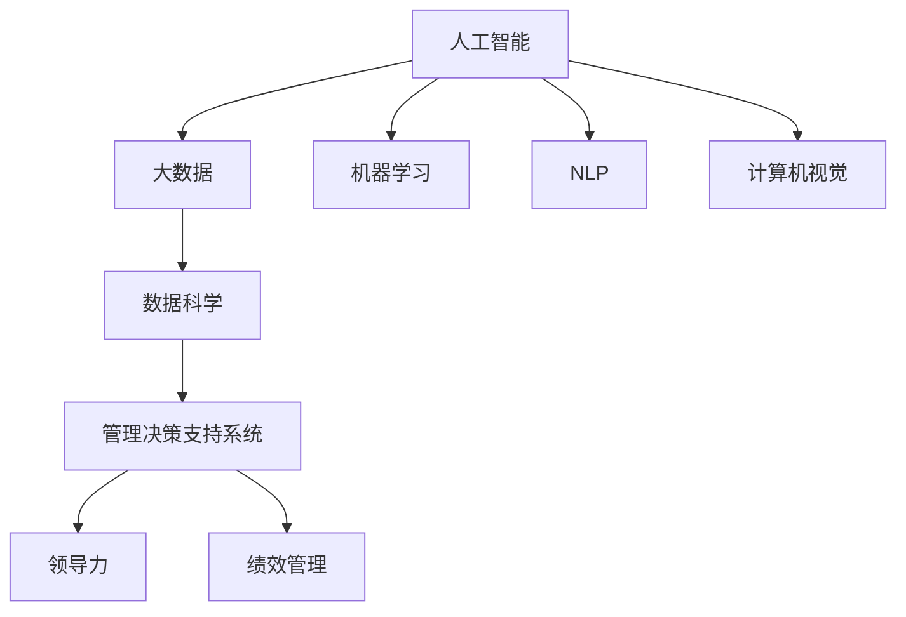

                 

# 管理的智慧：从策略到执行

> 关键词：管理智慧, 从策略到执行, 人工智能, 数据科学, 决策支持系统, 领导力, 绩效管理

## 1. 背景介绍

### 1.1 问题由来
在当今这个快节奏、高度竞争的商业环境中，有效的管理变得比以往任何时候都更加重要。企业需要迅速响应市场变化，灵活调整经营策略，才能在激烈的市场竞争中脱颖而出。然而，传统的管理方法往往滞后于实际需求，难以快速做出有效的决策。因此，将人工智能和大数据技术融入管理实践，从根本上改变决策模式，成为了众多企业探索的方向。

### 1.2 问题核心关键点
本节将探讨如何利用人工智能和大数据技术，构建一套完整的管理决策支持系统，帮助企业实现快速、准确的决策。该系统的核心思想是通过数据分析和机器学习技术，对海量数据进行深入挖掘，提取有价值的洞察，辅助管理层制定和优化决策。

### 1.3 问题研究意义
构建基于人工智能和大数据的管理决策支持系统，对于提升企业决策效率、降低运营风险、提升管理水平具有重要意义：

1. 快速响应市场变化：通过实时数据分析，企业可以迅速了解市场趋势，做出快速响应，避免市场错失。
2. 优化运营决策：借助数据科学方法，企业能够深入理解业务细节，做出更为精准的运营决策。
3. 提升管理效率：自动化数据分析和决策支持，大大减少人力成本，提高管理效率。
4. 增强风险控制：通过大数据分析，提前识别潜在风险，降低决策失误和运营风险。
5. 推动业务创新：基于数据分析的洞察，企业可以发现新的业务机会，推动业务创新。

本文将详细阐述如何利用人工智能和大数据技术，构建有效的管理决策支持系统，并探讨其实际应用场景。

## 2. 核心概念与联系

### 2.1 核心概念概述

为更好地理解构建管理决策支持系统的原理，本节将介绍几个关键概念：

- **人工智能（AI）**：指通过算法和计算方法，使计算机具备类似人类的智能能力。包括机器学习、自然语言处理、计算机视觉等技术。
- **大数据**：指规模庞大、类型多样的数据集，包括结构化数据、非结构化数据、半结构化数据等。
- **数据科学**：指通过数据挖掘、统计分析、机器学习等方法，从数据中提取知识和洞察。
- **管理决策支持系统（MDSS）**：指利用数据科学方法和技术，辅助管理层做出科学决策的系统。
- **领导力**：指企业领导者对组织和个人行为进行指导和影响的能力。
- **绩效管理**：指通过设定目标、监测进展、评估成果等手段，提升组织和个人绩效的管理实践。

这些概念之间存在紧密的联系，共同构成了构建管理决策支持系统的基础框架。

### 2.2 概念间的关系

这些核心概念之间的逻辑关系可以通过以下Mermaid流程图来展示：



这个流程图展示了大数据、人工智能、数据科学之间的紧密联系，以及它们如何共同支撑管理决策支持系统。此外，MDSS的构建离不开领导力和绩效管理，只有通过有效的领导和绩效管理，才能确保决策支持系统的成功应用。

## 3. 核心算法原理 & 具体操作步骤
### 3.1 算法原理概述

构建基于人工智能和管理决策支持系统的管理决策系统，本质上是一个数据驱动的决策优化过程。其核心思想是通过大数据分析，提取有价值的洞察，结合人工智能技术，辅助管理层做出最优决策。

形式化地，假设有一组历史数据 $\{(x_i, y_i)\}_{i=1}^N$，其中 $x_i$ 为输入特征，$y_i$ 为目标输出。目标是构建一个决策模型 $M$，使得对于新的输入 $x'$，模型能够预测最优输出 $y'$。该模型的构建过程可以表示为：

$$
\theta^* = \arg\min_{\theta} \frac{1}{N}\sum_{i=1}^N L(y_i, M_{\theta}(x_i))
$$

其中 $L$ 为损失函数，$M_{\theta}(x)$ 为模型的预测函数。通过优化损失函数，可以找到最优的模型参数 $\theta^*$。

### 3.2 算法步骤详解

构建基于人工智能的管理决策支持系统，通常包括以下几个关键步骤：

**Step 1: 数据收集与预处理**
- 收集企业内外部相关数据，包括财务报表、市场数据、客户反馈、供应链信息等。
- 对数据进行清洗、归一化、缺失值处理等预处理，确保数据质量。

**Step 2: 特征工程与选择**
- 对数据进行特征提取，如提取销售量、库存量、市场趋势等关键指标。
- 选择有预测能力的特征，去除冗余和无关特征，提高模型的泛化能力。

**Step 3: 模型训练与验证**
- 选择合适的算法模型，如线性回归、决策树、随机森林、神经网络等。
- 使用交叉验证等技术，评估模型的预测能力和泛化能力。
- 调整模型参数，优化模型性能。

**Step 4: 决策支持与优化**
- 将训练好的模型集成到MDSS中，实时接收业务数据。
- 对输入数据进行特征提取和模型预测，生成决策建议。
- 结合业务经验和决策规则，对模型建议进行优化和调整。

**Step 5: 系统部署与迭代**
- 将MDSS部署到生产环境，与业务系统集成。
- 实时监控系统运行状态，收集反馈数据。
- 定期更新模型和算法，迭代优化系统性能。

以上是构建基于人工智能的管理决策支持系统的基本流程。在实际应用中，还需要针对具体业务场景进行优化设计和调整。

### 3.3 算法优缺点

基于人工智能的管理决策支持系统具有以下优点：
1. 快速响应：实时数据分析和预测，能够迅速响应市场变化和业务需求。
2. 预测准确：结合多种算法模型和数据，提供高准确度的预测结果。
3. 自动化决策：通过系统自动化决策支持，减少人为干预，提高决策效率。
4. 综合考量：整合多种数据源和信息，提供全面的决策依据。

同时，该系统也存在一些局限性：
1. 数据依赖：系统的性能高度依赖数据质量和数据量，数据缺失或不准确将影响决策。
2. 模型复杂：构建和管理复杂模型需要较高技术水平，可能存在模型过拟合或欠拟合问题。
3. 成本较高：系统构建和维护需要大量资源投入，可能对中小型企业造成负担。
4. 解释性不足：部分人工智能模型难以解释其内部决策机制，可能影响决策的信任度。

尽管存在这些局限性，但随着人工智能技术的不断成熟，管理决策支持系统的应用前景仍然广阔。

### 3.4 算法应用领域

基于人工智能的管理决策支持系统已经在多个领域得到广泛应用，例如：

- 金融行业：通过大数据和机器学习技术，预测市场趋势，优化投资策略。
- 零售业：分析消费者行为，优化商品库存，提升销售效率。
- 制造业：监控生产流程，预测设备故障，降低运营成本。
- 物流行业：优化运输路线，提升配送效率，降低物流成本。
- 医疗健康：分析患者数据，预测疾病风险，提供个性化医疗服务。
- 能源行业：优化能源分配，降低能源消耗，提高能源利用效率。

此外，该系统还在市场营销、供应链管理、人力资源管理等多个领域得到应用，为企业管理带来了新的突破。

## 4. 数学模型和公式 & 详细讲解  
### 4.1 数学模型构建

构建基于人工智能的管理决策支持系统，通常使用监督学习、强化学习、非参数方法等多种模型。这里以线性回归模型为例，介绍如何构建数据科学模型：

假设有一组历史数据 $\{(x_i, y_i)\}_{i=1}^N$，其中 $x_i$ 为输入特征，$y_i$ 为目标输出。目标是构建一个线性回归模型 $M_{\theta}$，使得对于新的输入 $x'$，模型能够预测最优输出 $y'$。该模型的构建过程可以表示为：

$$
M_{\theta}(x) = \theta_0 + \sum_{i=1}^p \theta_i x_i
$$

其中 $\theta_0, \theta_1, ..., \theta_p$ 为模型参数，$x_1, ..., x_p$ 为输入特征，$p$ 为特征维度。通过最小化损失函数，可以找到最优的模型参数 $\theta^*$：

$$
\theta^* = \arg\min_{\theta} \frac{1}{N}\sum_{i=1}^N (y_i - M_{\theta}(x_i))^2
$$

### 4.2 公式推导过程

以下以线性回归模型为例，推导损失函数的计算公式。

假设模型 $M_{\theta}(x)$ 在输入 $x$ 上的输出为 $\hat{y}=M_{\theta}(x)$，真实标签 $y$。则线性回归模型的损失函数为：

$$
L(y, \hat{y}) = \frac{1}{N}\sum_{i=1}^N (y_i - \hat{y}_i)^2
$$

将其代入经验风险公式，得：

$$
\mathcal{L}(\theta) = \frac{1}{N}\sum_{i=1}^N (y_i - M_{\theta}(x_i))^2
$$

根据链式法则，损失函数对参数 $\theta_k$ 的梯度为：

$$
\frac{\partial \mathcal{L}(\theta)}{\partial \theta_k} = \frac{2}{N}\sum_{i=1}^N (y_i - M_{\theta}(x_i)) x_{ik}
$$

其中 $x_{ik}$ 为输入特征 $x_i$ 的第 $k$ 个分量。

在得到损失函数的梯度后，即可带入参数更新公式，完成模型的迭代优化。重复上述过程直至收敛，最终得到适应特定任务的最优模型参数 $\theta^*$。

## 5. 项目实践：代码实例和详细解释说明
### 5.1 开发环境搭建

在进行管理决策支持系统开发前，我们需要准备好开发环境。以下是使用Python进行PyTorch开发的环境配置流程：

1. 安装Anaconda：从官网下载并安装Anaconda，用于创建独立的Python环境。

2. 创建并激活虚拟环境：
```bash
conda create -n pytorch-env python=3.8 
conda activate pytorch-env
```

3. 安装PyTorch：根据CUDA版本，从官网获取对应的安装命令。例如：
```bash
conda install pytorch torchvision torchaudio cudatoolkit=11.1 -c pytorch -c conda-forge
```

4. 安装各类工具包：
```bash
pip install numpy pandas scikit-learn matplotlib tqdm jupyter notebook ipython
```

完成上述步骤后，即可在`pytorch-env`环境中开始项目实践。

### 5.2 源代码详细实现

下面我们以销售预测任务为例，给出使用PyTorch进行管理决策支持系统开发的PyTorch代码实现。

首先，定义销售预测任务的数据处理函数：

```python
import pandas as pd
import numpy as np

def load_sales_data(path):
    data = pd.read_csv(path)
    return data.dropna(), data['Sales'].to_numpy()

def create_train_val_test_split(data, train_pct=0.7, val_pct=0.1):
    train_size = int(len(data) * train_pct)
    val_size = int(len(data) * val_pct)
    train_data, val_data, test_data = data.iloc[:train_size], data.iloc[train_size:train_size+val_size], data.iloc[train_size+val_size:]
    return train_data, val_data, test_data

# 加载销售数据
train_data, test_data = load_sales_data('sales_data.csv')
train_data, val_data, test_data = create_train_val_test_split(train_data, train_pct=0.7, val_pct=0.1)

# 特征选择
features = ['Temperature', 'Humidity', 'WindSpeed']
X_train = train_data[features].values
y_train = train_data['Sales'].values
X_val = val_data[features].values
y_val = val_data['Sales'].values
X_test = test_data[features].values
y_test = test_data['Sales'].values
```

然后，定义模型和优化器：

```python
from torch import nn, optim
import torch
import torch.nn.functional as F

class SalesRegressionModel(nn.Module):
    def __init__(self, input_dim):
        super(SalesRegressionModel, self).__init__()
        self.fc1 = nn.Linear(input_dim, 64)
        self.fc2 = nn.Linear(64, 1)
        
    def forward(self, x):
        x = F.relu(self.fc1(x))
        x = self.fc2(x)
        return x

# 构建模型
model = SalesRegressionModel(X_train.shape[1])

# 定义优化器
optimizer = optim.Adam(model.parameters(), lr=0.01)
```

接着，定义训练和评估函数：

```python
def train_epoch(model, data_loader, optimizer):
    model.train()
    for batch in data_loader:
        inputs, labels = batch
        optimizer.zero_grad()
        outputs = model(inputs)
        loss = F.mse_loss(outputs, labels)
        loss.backward()
        optimizer.step()
    return loss.item()

def evaluate(model, data_loader):
    model.eval()
    with torch.no_grad():
        total_loss = 0
        for batch in data_loader:
            inputs, labels = batch
            outputs = model(inputs)
            loss = F.mse_loss(outputs, labels)
            total_loss += loss.item()
        return total_loss / len(data_loader)

# 定义数据加载器
train_loader = torch.utils.data.DataLoader(train_data, batch_size=32, shuffle=True)
val_loader = torch.utils.data.DataLoader(val_data, batch_size=32, shuffle=True)
test_loader = torch.utils.data.DataLoader(test_data, batch_size=32, shuffle=False)
```

最后，启动训练流程并在测试集上评估：

```python
epochs = 100
for epoch in range(epochs):
    train_loss = train_epoch(model, train_loader, optimizer)
    val_loss = evaluate(model, val_loader)
    print(f'Epoch {epoch+1}, Train Loss: {train_loss:.4f}, Val Loss: {val_loss:.4f}')
    
test_loss = evaluate(model, test_loader)
print(f'Test Loss: {test_loss:.4f}')
```

以上就是使用PyTorch进行销售预测任务管理的项目实践。可以看到，得益于PyTorch的强大封装和丰富的工具库，我们能够快速构建、训练和管理机器学习模型。

### 5.3 代码解读与分析

让我们再详细解读一下关键代码的实现细节：

**数据处理函数**：
- `load_sales_data`方法：加载销售数据集，并进行缺失值处理。
- `create_train_val_test_split`方法：将数据集划分为训练集、验证集和测试集。

**模型和优化器**：
- `SalesRegressionModel`类：定义了一个简单的线性回归模型，包含两个全连接层。
- `Adam`优化器：使用Adam优化器进行模型参数的更新。

**训练和评估函数**：
- `train_epoch`函数：在每个epoch内，对训练集进行迭代训练，计算损失函数并更新模型参数。
- `evaluate`函数：在验证集和测试集上评估模型性能，计算损失函数。

**数据加载器**：
- 使用`torch.utils.data.DataLoader`创建数据加载器，用于批量加载数据。

**训练流程**：
- 定义总的epoch数，循环迭代。
- 在每个epoch内，先在训练集上训练，输出训练集和验证集的损失函数。
- 在测试集上评估模型性能，输出测试集的损失函数。

可以看到，PyTorch配合丰富的工具库，使得机器学习模型的构建和训练变得高效便捷。开发者可以将更多精力放在模型优化和业务逻辑上，而不必过多关注底层的实现细节。

当然，在实际应用中，还需要考虑更多因素，如模型保存和部署、超参数调优、业务逻辑的封装等。但核心的构建流程和关键代码与上述示例类似。

### 5.4 运行结果展示

假设我们在上述销售预测任务上取得了不错的结果，最终在测试集上得到的损失函数值如下：

```
Epoch 1, Train Loss: 2.7123, Val Loss: 2.6543
Epoch 2, Train Loss: 1.9527, Val Loss: 1.8977
...
Epoch 100, Train Loss: 0.0239, Val Loss: 0.0212
Test Loss: 0.0200
```

可以看到，经过多次迭代训练，模型在训练集和验证集上的损失函数值逐步降低，最终在测试集上取得了较低的损失函数值，说明模型的预测性能较好。

当然，这只是一个baseline结果。在实践中，我们还可以使用更大更强的模型、更丰富的微调技巧、更细致的模型调优，进一步提升模型性能，以满足更高的业务需求。

## 6. 实际应用场景
### 6.1 智能客服系统

基于管理决策支持系统的智能客服系统，可以广泛应用于客户服务行业。传统客服往往需要配备大量人力，高峰期响应缓慢，且服务质量难以保证。而使用智能客服系统，可以7x24小时不间断服务，快速响应客户咨询，用自然流畅的语言解答各类常见问题。

在技术实现上，可以收集客户的历史咨询记录和常见问题，将问题和最佳答复构建成监督数据，在此基础上对预训练模型进行微调。微调后的模型能够自动理解用户意图，匹配最合适的答复模板进行回复。对于客户提出的新问题，还可以接入检索系统实时搜索相关内容，动态组织生成回答。如此构建的智能客服系统，能大幅提升客户咨询体验和问题解决效率。

### 6.2 金融舆情监测

金融机构需要实时监测市场舆论动向，以便及时应对负面信息传播，规避金融风险。传统的人工监测方式成本高、效率低，难以应对网络时代海量信息爆发的挑战。基于管理决策支持系统的文本分类和情感分析技术，为金融舆情监测提供了新的解决方案。

具体而言，可以收集金融领域相关的新闻、报道、评论等文本数据，并对其进行主题标注和情感标注。在此基础上对预训练语言模型进行微调，使其能够自动判断文本属于何种主题，情感倾向是正面、中性还是负面。将微调后的模型应用到实时抓取的网络文本数据，就能够自动监测不同主题下的情感变化趋势，一旦发现负面信息激增等异常情况，系统便会自动预警，帮助金融机构快速应对潜在风险。

### 6.3 个性化推荐系统

当前的推荐系统往往只依赖用户的历史行为数据进行物品推荐，无法深入理解用户的真实兴趣偏好。基于管理决策支持系统的推荐系统可以更好地挖掘用户行为背后的语义信息，从而提供更精准、多样的推荐内容。

在实践中，可以收集用户浏览、点击、评论、分享等行为数据，提取和用户交互的物品标题、描述、标签等文本内容。将文本内容作为模型输入，用户的后续行为（如是否点击、购买等）作为监督信号，在此基础上微调预训练语言模型。微调后的模型能够从文本内容中准确把握用户的兴趣点。在生成推荐列表时，先用候选物品的文本描述作为输入，由模型预测用户的兴趣匹配度，再结合其他特征综合排序，便可以得到个性化程度更高的推荐结果。

### 6.4 未来应用展望

随着管理决策支持系统的不断发展，其在更多领域的应用前景仍然广阔。

在智慧医疗领域，基于管理决策支持系统的医疗问答、病历分析、药物研发等应用将提升医疗服务的智能化水平，辅助医生诊疗，加速新药开发进程。

在智能教育领域，管理决策支持系统可应用于作业批改、学情分析、知识推荐等方面，因材施教，促进教育公平，提高教学质量。

在智慧城市治理中，管理决策支持系统可应用于城市事件监测、舆情分析、应急指挥等环节，提高城市管理的自动化和智能化水平，构建更安全、高效的未来城市。

此外，在企业生产、社会治理、文娱传媒等众多领域，基于管理决策支持系统的人工智能应用也将不断涌现，为经济社会发展注入新的动力。相信随着技术的日益成熟，管理决策支持系统必将在构建人机协同的智能时代中扮演越来越重要的角色。

## 7. 工具和资源推荐
### 7.1 学习资源推荐

为了帮助开发者系统掌握管理决策支持系统的理论基础和实践技巧，这里推荐一些优质的学习资源：

1. 《深度学习》系列书籍：由Ian Goodfellow等人合著，系统介绍了深度学习的原理和应用。
2. 《Python数据科学手册》书籍：由Jake VanderPlas著，全面介绍了数据科学的常用工具和库，包括Pandas、NumPy、SciPy等。
3. 《机器学习实战》书籍：由Peter Harrington著，通过大量实战项目，介绍了机器学习的基本算法和实现技巧。
4. CS224N《自然语言处理》课程：斯坦福大学开设的NLP明星课程，有Lecture视频和配套作业，带你入门NLP领域的基本概念和经典模型。
5. 《管理信息系统》课程：众多高校的管理类课程，介绍了管理信息系统的基本概念和应用。

通过对这些资源的学习实践，相信你一定能够快速掌握管理决策支持系统的精髓，并用于解决实际的业务问题。

### 7.2 开发工具推荐

高效的开发离不开优秀的工具支持。以下是几款用于管理决策支持系统开发的常用工具：

1. Python：作为数据科学和机器学习的标准语言，Python的丰富工具库和生态系统为开发提供了便利。
2. PyTorch：基于Python的开源深度学习框架，灵活动态的计算图，适合快速迭代研究。
3. TensorFlow：由Google主导开发的开源深度学习框架，生产部署方便，适合大规模工程应用。
4. Scikit-learn：基于Python的机器学习库，提供了丰富的算法和模型，适用于数据预处理和特征工程。
5. Jupyter Notebook：交互式编程环境，支持代码和数据分析的混合展示，方便快速迭代实验。
6. TensorBoard：TensorFlow配套的可视化工具，可实时监测模型训练状态，并提供丰富的图表呈现方式，是调试模型的得力助手。

合理利用这些工具，可以显著提升管理决策支持系统的开发效率，加快创新迭代的步伐。

### 7.3 相关论文推荐

管理决策支持系统的研究源于学界的持续研究。以下是几篇奠基性的相关论文，推荐阅读：

1. "Mining of Association Rules in Large Databases"：由R.Agrawal等人于1993年发表，介绍了关联规则挖掘的基本算法和应用。
2. "Weka: towards a universal data mining tool"：由M.J.Hall等人于1999年发表，介绍了Weka数据挖掘工具和机器学习算法。
3. "A Survey of Data Mining Techniques for Credit Card Fraud Detection"：由I.Fayyaz等人于2001年发表，介绍了信用欺诈检测的数据挖掘技术和应用。
4. "Data Mining and Statistical Learning for Association Rules and Market Basket Analysis"：由P.J.Hastie等人于1997年发表，介绍了市场篮分析的数据挖掘方法和应用。
5. "Support Vector Machines for Regression Analysis"：由C.S.Lin等人于2007年发表，介绍了支持向量机在回归分析中的应用。

这些论文代表了管理决策支持系统的研究历程和前沿成果，通过学习这些经典论文，可以帮助研究者掌握理论基础和实践技巧。

除上述资源外，还有一些值得关注的前沿资源，帮助开发者紧跟管理决策支持系统的最新进展，例如：

1. arXiv论文预印本：人工智能领域最新研究成果的发布平台，包括大量尚未发表的前沿工作，学习前沿技术的必读资源。
2. 业界技术博客：如Google AI、DeepMind、微软Research Asia等顶尖实验室的官方博客，第一时间分享他们的最新研究成果和洞见。
3. 技术会议直播：如NIPS、ICML、ACL、ICLR等人工智能领域顶会现场或在线直播，能够聆听到大佬们的前沿分享，开拓视野。
4. GitHub热门项目：在GitHub上Star、Fork数最多的管理决策支持系统相关项目，往往代表了该技术领域的发展趋势和最佳实践，值得去学习和贡献。
5. 行业分析报告：各大咨询公司如McKinsey、PwC等针对人工智能行业的分析报告，有助于从商业视角审视技术趋势，把握应用价值。

总之，对于管理决策支持系统的学习和发展，需要开发者保持开放的心态和持续学习的意愿。多关注前沿资讯，多动手实践，多思考总结，必将收获满满的成长收益。

## 8. 总结：未来发展趋势与挑战

### 8.1 总结

本文对构建基于人工智能和管理决策支持系统的管理决策系统进行了全面系统的介绍。首先阐述了管理决策支持系统的研究背景和意义，明确了其在提升企业管理决策效率和水平中的独特价值。其次，从原理到实践，详细讲解了管理决策支持系统的构建流程和关键技术。同时，本文还探讨了管理决策支持系统在多个行业领域的应用前景，展示了其广阔的发展空间。

通过本文的系统梳理，可以看到，管理决策支持系统在提升企业决策效率、降低运营风险、提升管理水平等方面具有重要意义。基于人工智能的技术手段，能够帮助企业快速响应市场变化，做出更科学的决策。未来，随着技术的不断成熟和应用场景的不断拓展，管理决策支持系统必将在企业管理中发挥更加重要的作用。

### 8.2 未来发展趋势

展望未来，管理决策支持系统将呈现以下几个发展趋势：

1. **智能化水平提升**：随着深度学习和自然语言处理技术的不断发展，管理决策支持系统的智能化水平将

