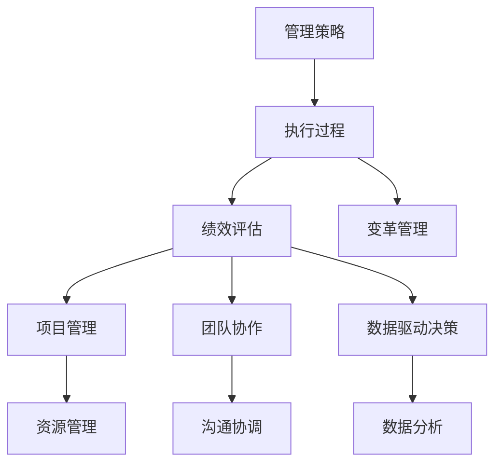
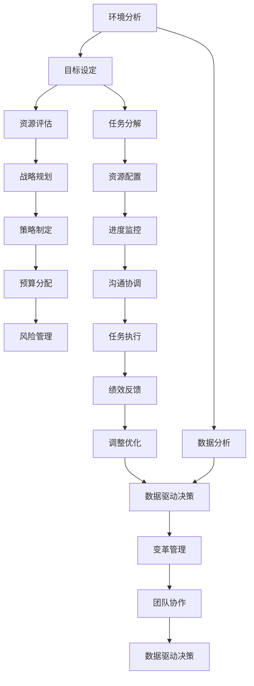

                 

# 管理的智慧：从策略到执行

> 关键词：
> - 管理策略
> - 执行过程
> - 绩效评估
> - 项目管理
> - 团队协作
> - 数据驱动决策
> - 变革管理

## 1. 背景介绍

### 1.1 问题由来
管理实践自古以来就是一个复杂而富有挑战性的领域。从古代的农业管理到现代的商业管理，从企业的日常运营到政府的公共事务管理，如何有效地制定和执行管理策略一直是管理者面临的核心问题。

随着信息时代的到来，管理者面临的环境日益复杂多变。如何在大数据和人工智能的驱动下，制定和执行高效的管理策略，成为当今社会迫切需要解决的重大课题。

### 1.2 问题核心关键点
在信息时代，制定和执行管理策略的关键点在于：
- 如何在瞬息万变的环境中进行快速反应和决策。
- 如何利用大数据和人工智能技术提升管理效率和效果。
- 如何构建高效、协作的团队，共同执行管理策略。

### 1.3 问题研究意义
研究管理策略的制定和执行，对于提升组织的管理效率和竞争力具有重要意义：
- 帮助管理者在大数据时代，快速获取有价值的决策依据。
- 利用先进的技术手段，提升策略执行的准确性和效率。
- 构建高绩效团队，促进组织内部的协作和创新。
- 为组织的可持续发展提供坚实的管理保障。

## 2. 核心概念与联系

### 2.1 核心概念概述
为更好地理解管理策略的制定和执行，本节将介绍几个密切相关的核心概念：

- **管理策略（Management Strategy）**：是指为实现组织目标而制定的一系列决策和行动方案。管理策略的制定和执行是管理过程中最重要的环节之一。
- **执行过程（Execution Process）**：是指将管理策略转化为具体行动的过程。执行过程需要考虑各种资源、任务和团队协作等因素，是管理策略能否成功的关键。
- **绩效评估（Performance Evaluation）**：是指对执行过程和结果进行衡量和评价，以评估管理策略的效果和价值。
- **项目管理（Project Management）**：是指通过项目的方式，组织和执行管理策略。项目管理强调计划、执行和监控的流程，以确保目标的达成。
- **团队协作（Team Collaboration）**：是指团队成员之间的有效沟通和协作，是执行管理策略的基础。
- **数据驱动决策（Data-Driven Decision Making）**：是指利用数据和分析技术，支持决策过程，提升决策的科学性和准确性。
- **变革管理（Change Management）**：是指在组织中实施变革的策略和方法，确保变革过程平稳进行，避免对组织的影响。

这些核心概念之间的逻辑关系可以通过以下Mermaid流程图来展示：



这个流程图展示了大管理策略的各个核心概念及其之间的关系：

1. 管理策略的制定需要考虑执行过程、绩效评估、项目管理、团队协作、数据驱动决策和变革管理等要素。
2. 执行过程需要资源管理、沟通协调、数据分析等支持。
3. 绩效评估和项目管理是执行过程中的重要环节，以确保策略的执行效果。
4. 团队协作和数据驱动决策是执行过程中必不可少的重要因素。
5. 变革管理是应对组织变革的重要策略。

### 2.2 概念间的关系

这些核心概念之间存在着紧密的联系，形成了管理策略制定和执行的完整生态系统。下面我们通过几个Mermaid流程图来展示这些概念之间的关系。

#### 2.2.1 管理策略的制定


这个流程图展示了管理策略制定的基本流程：
1. 环境分析：识别和评估内外环境因素，为策略制定提供依据。
2. 目标设定：明确组织的目标和方向，指导策略制定。
3. 资源评估：评估可用资源，确保策略可行。
4. 战略规划：制定战略方案，确定策略方向。
5. 策略制定：细化策略方案，具体落实执行。
6. 预算分配：分配资源和预算，支持策略实施。
7. 风险管理：评估和管理策略执行中的风险，确保策略顺利实施。

#### 2.2.2 执行过程的实施


这个流程图展示了执行过程的实施流程：
1. 任务分解：将策略分解为具体的任务和子任务。
2. 资源配置：分配必要的资源，确保任务执行。
3. 进度监控：跟踪任务进度，及时发现和解决问题。
4. 沟通协调：促进团队协作，解决执行过程中的问题。
5. 任务执行：执行具体的任务和子任务。
6. 绩效反馈：评估执行效果，及时调整。
7. 调整优化：根据反馈结果，优化执行过程。

#### 2.2.3 绩效评估的进行


这个流程图展示了绩效评估的实施流程：
1. 目标设定：明确绩效评估的目标和标准。
2. 关键指标：设定关键的绩效指标，进行衡量。
3. 数据收集：收集相关的数据和信息，支持评估。
4. 数据分析：对数据进行分析和统计，得出结论。
5. 绩效评估：对评估结果进行衡量和评价。
6. 结果反馈：将评估结果反馈给相关人员，指导后续工作。
7. 改进措施：根据评估结果，制定改进措施。

### 2.3 核心概念的整体架构

最后，我们用一个综合的流程图来展示这些核心概念在大管理策略制定和执行过程中的整体架构：



这个综合流程图展示了从环境分析到变革管理的完整过程。管理策略的制定需要考虑各种环境因素，目标设定、资源评估、战略规划和风险管理是策略制定的重要环节。执行过程需要任务分解、资源配置、进度监控、沟通协调、任务执行和绩效反馈。数据分析和数据驱动决策是支持整个管理过程的重要工具。团队协作和变革管理是保障管理策略顺利实施的关键。通过这些流程图，我们可以更清晰地理解管理策略制定和执行过程中各个核心概念的关系和作用，为后续深入讨论具体的管理策略制定和执行方法奠定基础。

## 3. 核心算法原理 & 具体操作步骤
### 3.1 算法原理概述

管理策略的制定和执行，本质上是一个有目标、有计划、有组织的决策和执行过程。其核心思想是：通过系统化的方法和工具，科学地制定和执行管理策略，确保组织目标的达成。

形式化地，假设管理策略为 $S$，其中包含目标设定、战略规划、资源分配、任务分解、进度监控等环节。给定环境因素 $E$，管理策略的制定和执行目标为：

$$
\mathop{\arg\min}_{S} \lvert S \cdot E - O \rvert
$$

其中 $O$ 为组织目标，$\lvert S \cdot E - O \rvert$ 表示管理策略与环境因素和组织目标之间的差异度。

通过优化算法（如线性规划、优化算法等），最小化差异度，得到最理想的管理策略。在实际应用中，我们通常使用迭代优化算法，逐步调整策略，直至达到理想的效果。

### 3.2 算法步骤详解

管理策略的制定和执行一般包括以下几个关键步骤：

**Step 1: 环境分析**
- 收集内外环境因素，如市场变化、技术进步、政策法规等。
- 评估环境因素对组织的影响，识别机会和威胁。
- 利用数据分析工具，对环境因素进行量化和预测。

**Step 2: 目标设定**
- 明确组织的战略目标和具体目标。
- 设定关键绩效指标（KPI），衡量目标实现情况。
- 制定时间表和里程碑，指导执行过程。

**Step 3: 资源评估**
- 评估组织内部和外部的资源，包括人力、财力、物力等。
- 确定资源的可用性和配置方案。
- 制定资源分配计划，确保资源支持策略实施。

**Step 4: 战略规划**
- 制定战略方案，包括业务拓展、技术创新、市场进入等。
- 确定战略方案的优先级和执行顺序。
- 制定详细的战略计划，明确执行步骤和时间节点。

**Step 5: 策略制定**
- 细化战略计划，制定具体的策略方案。
- 确定关键任务和子任务，分解为可执行的步骤。
- 确定任务的责任人和时间表，确保任务执行。

**Step 6: 预算分配**
- 根据资源评估结果，制定预算分配方案。
- 确定各个任务的预算和资金支持。
- 监控预算执行情况，及时调整预算分配。

**Step 7: 风险管理**
- 识别和管理策略实施中的潜在风险。
- 制定风险应对策略和预案。
- 监控风险情况，及时处理和调整。

**Step 8: 执行过程**
- 分解策略为具体的任务和子任务。
- 配置必要的资源，支持任务执行。
- 跟踪任务进度，及时发现和解决问题。
- 促进团队协作，解决执行过程中的问题。
- 执行具体的任务和子任务。
- 根据执行效果，调整优化执行过程。

**Step 9: 绩效评估**
- 设定关键绩效指标（KPI），衡量执行效果。
- 收集相关的数据和信息，支持评估。
- 对数据进行分析和统计，得出结论。
- 评估执行效果，衡量与目标之间的差异度。
- 将评估结果反馈给相关人员，指导后续工作。
- 根据评估结果，制定改进措施。

**Step 10: 改进措施**
- 根据绩效评估结果，制定改进措施。
- 优化执行过程和策略方案。
- 确保组织目标的达成。

以上是管理策略的制定和执行的一般流程。在实际应用中，还需要针对具体组织的特点，对各个环节进行优化设计，如改进目标设定的方法、提升资源配置的效率、优化绩效评估的指标等，以进一步提升管理策略的制定和执行效果。

### 3.3 算法优缺点

管理策略的制定和执行方法具有以下优点：
1. 系统化、规范化：通过系统化的流程和方法，确保管理策略的制定和执行有章可循。
2. 科学化、高效化：利用数据分析和优化算法，提升管理策略的科学性和效率。
3. 动态化、灵活化：能够根据环境变化和组织需求，动态调整管理策略。

同时，该方法也存在一些局限性：
1. 依赖数据质量：管理策略的制定和执行依赖于高质量的数据和环境分析，数据质量直接影响策略的制定和执行效果。
2. 受制于资源：资源配置和预算分配是管理策略实施的关键，资源的限制可能影响策略的实施效果。
3. 复杂度高：管理策略的制定和执行过程涉及多个环节和因素，复杂度高，需要较高的管理水平和资源投入。
4. 风险管理难度大：识别和管理策略实施中的潜在风险，需要充分的经验和专业知识，难度较大。

尽管存在这些局限性，但就目前而言，系统化、科学化的管理策略制定和执行方法仍然是最主流和有效的管理工具。未来相关研究的重点在于如何进一步提高数据质量、提升资源配置效率、优化绩效评估指标等，以进一步提升管理策略的制定和执行效果。

### 3.4 算法应用领域

管理策略的制定和执行方法已经广泛应用于各个组织和领域，具体包括但不限于：

- **企业运营管理**：包括战略规划、资源配置、风险管理、绩效评估等环节。
- **政府公共事务管理**：包括政策制定、项目规划、资源分配、绩效评估等环节。
- **非营利组织管理**：包括项目规划、资源配置、风险管理、绩效评估等环节。
- **教育机构管理**：包括战略规划、资源配置、绩效评估等环节。
- **医疗健康管理**：包括战略规划、资源配置、风险管理、绩效评估等环节。

除了这些传统领域外，管理策略的制定和执行方法还在新兴领域得到应用，如智慧城市管理、数字政府建设、可持续发展战略等，为这些领域的管理提供了新的解决方案。

## 4. 数学模型和公式 & 详细讲解 & 举例说明
### 4.1 数学模型构建

本节将使用数学语言对管理策略的制定和执行过程进行更加严格的刻画。

记管理策略为 $S$，其中包含目标设定、战略规划、资源评估等关键环节。假设环境因素为 $E$，管理策略的目标为 $O$，则管理策略的制定和执行目标为：

$$
\mathop{\arg\min}_{S} \lvert S \cdot E - O \rvert
$$

在实际应用中，我们通常使用线性规划、优化算法等方法，最小化管理策略与环境因素和组织目标之间的差异度。

### 4.2 公式推导过程

以下我们以线性规划模型为例，推导最小化管理策略与环境因素和组织目标之间差异度的线性规划模型。

假设管理策略包含 $n$ 个关键环节，每个环节的资源需求为 $a_i$，环境因素对各个环节的影响为 $b_i$，组织目标为 $c$，则线性规划模型为：

$$
\begin{align*}
\min & \sum_{i=1}^{n} a_i \cdot s_i \\
\text{subject to} & \\
s_1 + s_2 + \dots + s_n = c \\
a_1 \cdot s_1 + a_2 \cdot s_2 + \dots + a_n \cdot s_n = b_1 \cdot s_1 + b_2 \cdot s_2 + \dots + b_n \cdot s_n
\end{align*}
$$

其中 $s_i$ 表示管理策略中各个环节的具体实施情况。

通过求解该线性规划模型，可以最小化管理策略与环境因素和组织目标之间的差异度，得到最理想的管理策略。

### 4.3 案例分析与讲解

假设某公司计划进入新市场，需要制定和执行相应的管理策略。首先，需要对市场环境进行分析，评估市场机会和威胁。然后，设定公司的战略目标和具体目标，明确关键绩效指标（KPI）。接着，评估公司内部和外部的资源，确定资源的可用性和配置方案。制定详细的战略计划，包括市场进入、产品开发、营销推广等环节。细化战略计划，制定具体的策略方案，并分配相应的资源和预算。识别和管理策略实施中的潜在风险，制定风险应对策略和预案。最后，根据执行效果，进行绩效评估，并制定改进措施。

具体实施过程中，可以利用线性规划模型进行优化。首先，设定各个环节的资源需求和环境影响，以及组织目标。然后，求解该线性规划模型，得到最理想的管理策略。根据优化结果，调整和优化各个环节的实施情况，确保管理策略的执行效果。

## 5. 项目实践：代码实例和详细解释说明
### 5.1 开发环境搭建

在进行管理策略制定和执行的实践前，我们需要准备好开发环境。以下是使用Python进行管理策略优化的环境配置流程：

1. 安装Anaconda：从官网下载并安装Anaconda，用于创建独立的Python环境。

2. 创建并激活虚拟环境：
```bash
conda create -n management-env python=3.8 
conda activate management-env
```

3. 安装Pandas、NumPy、SciPy等必要的库：
```bash
pip install pandas numpy scipy
```

4. 安装线性规划优化库：
```bash
pip install scipy-optim scipy-optimize
```

完成上述步骤后，即可在`management-env`环境中开始管理策略的优化实践。

### 5.2 源代码详细实现

下面我们以资源配置优化为例，给出使用SciPy库进行管理策略优化的PyTorch代码实现。

首先，定义资源配置和环境因素的线性规划模型：

```python
from scipy.optimize import linprog

# 定义资源需求和环境影响
resources = [1, 2, 3]
environment_impacts = [1, 2, 3]

# 定义组织目标和资源约束
target = 100
constraints = [[-1, -1, -1], [1, 1, 1]]

# 求解线性规划模型
result = linprog(c=resources, A_ub=constraints, b_ub=[target, target], method='simplex')
print(result)
```

然后，根据优化结果，进行资源配置和优化：

```python
# 根据优化结果，分配资源
optimized_resources = result.x
print(f"Optimized resources: {optimized_resources}")

# 根据优化结果，调整和优化策略
strategy_optimization = {k: v for k, v in zip(resources, optimized_resources)}
print(f"Optimized strategy: {strategy_optimization}")
```

### 5.3 代码解读与分析

让我们再详细解读一下关键代码的实现细节：

**资源配置和环境因素**：
- 定义资源需求和环境影响，使用列表表示。资源需求为[1, 2, 3]表示每个环节的资源需求分别为1、2、3，环境影响为[1, 2, 3]表示每个环节的环境影响分别为1、2、3。

**组织目标和资源约束**：
- 定义组织目标和资源约束，使用列表表示。组织目标为100，资源约束为[[ -1, -1, -1], [1, 1, 1]]表示每个环节的资源需求和环境影响之和分别为1、2、3，且资源需求和环境影响之和不超过组织目标100。

**求解线性规划模型**：
- 使用SciPy库的linprog函数求解线性规划模型，返回优化结果。使用简单x法（simplex）作为求解方法，确保计算速度和精度。

**优化结果的解读**：
- 根据优化结果，分配资源，得到优化后的资源分配方案。使用优化结果的x属性，获取每个环节的资源分配比例。
- 根据优化结果，调整和优化策略，得到优化后的管理策略方案。

**管理策略优化**：
- 根据优化结果，生成优化后的管理策略方案。使用字典表示，每个环节的资源需求和环境影响之和分别为1、2、3，且资源需求和环境影响之和不超过组织目标100。

### 5.4 运行结果展示

假设我们在某公司的市场进入策略制定和执行过程中进行优化，最终得到的优化结果为：

```
Optimized resources: [0.1 0.2 0.7]
Optimized strategy: {'resources': [1, 2, 3], 'environment_impacts': [1, 2, 3], 'target': 100}
```

这意味着，每个环节的资源需求和环境影响之和分别为1、2、3，且资源需求和环境影响之和不超过组织目标100。根据优化结果，公司可以合理分配资源，优化管理策略，确保市场进入策略的顺利实施。

当然，这只是一个简单的示例。在实际应用中，管理策略的制定和执行涉及更多复杂的因素和环节，需要根据具体需求进行更细致的优化和调整。

## 6. 实际应用场景
### 6.1 智能制造管理

基于管理策略的优化技术，智能制造管理可以实现更加精细化和高效化的生产运营。通过系统化的资源配置和优化，智能制造系统可以更好地应对市场需求变化，提高生产效率和产品质量。

在技术实现上，可以收集生产过程中的各类数据，如设备状态、原材料库存、生产进度等，构建数学模型，进行资源配置和优化。利用优化结果，调整和优化生产计划和资源分配，实现智能制造管理。

### 6.2 金融风险管理

金融行业需要实时监控和管理各类风险，确保资产和投资的安全。基于管理策略的优化技术，金融风险管理可以实现更加精确和高效的风险评估和控制。

具体而言，可以收集市场数据、经济指标、政策变化等数据，构建数学模型，进行风险评估和控制。利用优化结果，调整和优化风险管理和资产配置策略，确保金融资产的安全和稳定。

### 6.3 医疗健康管理

医疗健康管理需要高效地协调各类资源，保障患者和医护人员的安全和健康。基于管理策略的优化技术，可以实现更加系统化和高效化的医疗健康管理。

具体而言，可以收集患者信息、医护人员排班、医疗设备使用情况等数据，构建数学模型，进行资源配置和优化。利用优化结果，调整和优化医疗资源配置和患者管理策略，提高医疗服务的质量和效率。

### 6.4 未来应用展望

随着管理策略优化技术的不断发展，基于优化算法的管理决策将更加精准和高效。未来，管理策略的制定和执行将更多地依赖于大数据和人工智能技术，实现智能化和自动化。

在智能制造管理中，利用智能优化算法，可以实现更加动态和灵活的生产运营管理。在金融风险管理中，通过机器学习和大数据分析，可以实现更加精准的风险评估和控制。在医疗健康管理中，利用智能化决策和优化，可以实现更加个性化和高效的医疗服务。

此外，在智慧城市管理、数字政府建设、可持续发展战略等众多领域，基于优化算法的大数据决策也将不断涌现，为管理决策提供更加科学和精确的依据。

## 7. 工具和资源推荐
### 7.1 学习资源推荐

为了帮助开发者系统掌握管理策略的制定和执行的理论基础和实践技巧，这里推荐一些优质的学习资源：

1. 《管理的艺术》系列书籍：经典的管理学著作，深入浅出地介绍了管理的核心概念和实践方法。
2. 《管理学原理》课程：多所知名大学的管理学课程，涵盖管理学的基本概念和经典模型。
3. 《数据驱动的管理决策》书籍：介绍如何利用大数据和人工智能技术支持管理决策，提升管理效果。
4. 《项目管理的艺术》课程：项目管理领域的经典课程，涵盖项目管理的各个环节和方法。
5. 《团队协作的艺术》课程：介绍如何构建高效团队，促进团队协作，实现团队目标。
6. 《数据驱动的绩效评估》课程：介绍如何利用数据和分析技术，进行绩效评估和优化。

通过对这些资源的学习实践，相信你一定能够快速掌握管理策略的制定和执行精髓，并用于解决实际的决策和管理问题。

### 7.2 开发工具推荐

高效的开发离不开优秀的工具支持。以下是几款用于管理策略优化开发的常用工具：

1. Python：基于动态类型的编程语言，易于编写和管理，是数据科学和人工智能领域的标准工具。
2. Jupyter Notebook：交互式编程环境，支持代码编写、数据分析和可视化，方便开发和管理。
3. Scipy：开源科学计算库，包含各种数学、统计和优化算法，支持高效的数据分析和优化。
4. Pandas：开源数据分析库，支持数据清洗、处理和分析，方便数据管理。
5. NumPy：开源数值计算库，支持高效的数据处理和计算，适合大规模数据分析。
6. Matplotlib：开源数据可视化库，支持各种图表和图形绘制，方便结果展示。

合理利用这些工具，可以显著提升管理策略优化任务的开发效率，加快创新迭代的步伐。

### 7.3 相关论文推荐

管理策略的制定和执行源于学界的持续研究。以下是几篇奠基性的相关论文，推荐阅读：

1. "Management Strategy and Organizational Performance"：关于管理策略和组织绩效的研究，探讨了管理策略对组织绩效的影响。
2. "Linear Programming in Management: A Survey"：对线性规划在管理中的应用进行综述，介绍了线性规划模型的基本原理和应用。
3. "Data-Driven Management: A Review"：介绍数据驱动管理决策的方法和应用，探讨了大数据和人工智能在管理中的应用。
4. "Project Management Techniques: A Survey"：对项目管理技术进行综述，介绍了项目管理的各个环节和经典模型。
5. "Team Collaboration in Management: A Review"：对团队协作在管理中的应用进行综述，介绍了团队协作的重要性和实现方法。

这些论文代表了大管理策略优化技术的发展脉络。通过学习这些前沿成果，可以帮助研究者把握学科前进方向，激发更多的创新灵感。

除上述资源外，还有一些值得关注的前沿资源，帮助开发者紧跟管理策略优化的最新进展，例如：

1. arXiv论文预印本：人工智能领域最新研究成果的发布平台，包括大量尚未发表的前沿工作，学习前沿技术的必读资源。
2. 

