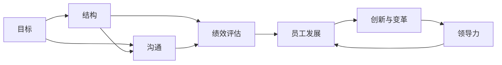
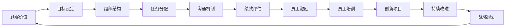

                 

# 管理的艺术：德鲁克的洞见

> 关键词：管理, 德鲁克, 组织, 决策, 目标, 创新, 领导力, 员工

## 1. 背景介绍

### 1.1 问题由来
在当今信息爆炸、技术快速发展的时代，企业面临的挑战和机遇都前所未有。如何在这复杂多变的环境中，有效地管理企业资源、提升组织效能、激发员工潜力、创造持续的价值，成为现代管理者面临的首要问题。美国管理大师彼得·德鲁克（Peter Drucker），通过其深入浅出的洞见，为企业管理提供了宝贵的指导。德鲁克的管理思想不仅影响了无数企业，也成为了全球管理实践的经典参考。

### 1.2 问题核心关键点
德鲁克的管理思想核心在于以下几点：
1. **目标明确**：企业的目标应该是创造顾客价值，而不是利润最大化。
2. **组织架构**：组织应围绕目标设定，以任务为导向，而不是以职能为导向。
3. **有效沟通**：企业内部的有效沟通是实现目标的关键。
4. **知识工作者**：企业中越来越多的员工是知识工作者，管理方式需要适应这一变化。
5. **创新与变革**：企业必须不断创新，适应市场变化，实现持续发展。
6. **领导力与决策**：有效的领导力是企业成功的关键，决策应基于事实和数据。

### 1.3 问题研究意义
德鲁克的管理思想对企业的战略规划、组织设计、员工管理、绩效评估等方面都有深远的影响。掌握德鲁克的洞见，对于提高企业管理水平、实现可持续发展具有重要意义。

## 2. 核心概念与联系

### 2.1 核心概念概述
德鲁克的管理思想包含多个核心概念，这些概念之间相互作用，共同构成了其管理体系的基石。

- **目标（Objectives）**：企业存在的目的是创造顾客价值，目标应该是清晰且可实现的。
- **结构（Structure）**：组织结构应该围绕目标设定，以任务为导向，实现高效的资源配置。
- **沟通（Communication）**：有效的沟通是实现目标和任务的关键，需要明确责任、促进理解。
- **绩效评估（Performance Evaluation）**：绩效评估应以目标为导向，关注结果而非过程。
- **员工发展（Employee Development）**：员工的发展与企业的成功紧密相关，需要重视员工的成长和激励。
- **创新与变革（Innovation and Change）**：企业必须不断创新，适应市场变化，实现持续发展。
- **领导力（Leadership）**：有效的领导力是企业成功的关键，需要具备战略视野、决策能力、执行力和情感智慧。

### 2.2 概念间的关系
德鲁克的管理思想是一个有机整体，各概念间的关系可以用以下Mermaid流程图来展示：



这个流程图展示了目标设定（A）是起点，通过组织结构（B）和沟通（C）实现任务执行和目标达成。绩效评估（D）和员工发展（E）是过程中的重要环节，创新与变革（F）是企业的生命力，而领导力（G）是实现这一切的关键。这些概念共同构成了一个完整的管理体系。

### 2.3 核心概念的整体架构
最后，我们用一个综合的流程图来展示这些核心概念在大企业中的整体应用：



这个综合流程图展示了从顾客价值创造（A）开始，经过目标设定（B）、组织结构（C）、任务分配（D）、沟通机制（E）、绩效评估（F）、员工激励（G）、员工培训（H）、创新项目（I）、持续改进（J）、战略规划（K）等环节，最终回到顾客价值的创造，形成一个闭环的循环过程。

## 3. 核心算法原理 & 具体操作步骤

### 3.1 算法原理概述
德鲁克的管理思想主要基于实证研究和管理实践，其核心原理可以总结如下：

- **目标管理**：通过明确目标，将企业的资源和努力集中在最重要的任务上。
- **任务导向的组织**：组织结构应围绕任务设定，以任务为导向，实现高效的资源配置。
- **沟通与协作**：有效的沟通和协作是实现目标和任务的关键，需要明确责任、促进理解。
- **绩效评估与反馈**：绩效评估应以目标为导向，关注结果而非过程，定期进行反馈和改进。
- **知识工作者的管理**：知识工作者需要更多的自主权和激励，而不是严格控制。
- **创新与变革**：企业必须不断创新，适应市场变化，实现持续发展。
- **领导力的培养**：领导力是企业成功的关键，需要具备战略视野、决策能力、执行力和情感智慧。

### 3.2 算法步骤详解
德鲁克的管理思想可以总结为以下几个步骤：

1. **目标设定**：明确企业的使命和目标，设定具体可实现的目标。
2. **组织结构设计**：围绕目标设定组织结构，确保任务导向。
3. **任务分配与沟通**：明确任务分配，建立有效的沟通机制，确保信息流通。
4. **绩效评估与反馈**：定期进行绩效评估，提供反馈，持续改进。
5. **员工发展**：重视员工的发展和激励，提供培训和成长机会。
6. **创新与变革**：持续推动创新，适应市场变化，实现持续发展。
7. **领导力的培养**：培养具备战略视野、决策能力、执行力和情感智慧的领导力。

### 3.3 算法优缺点
德鲁克的管理思想具有以下优点：
1. **系统性**：涵盖目标、结构、沟通、绩效、员工发展、创新和领导力等多个方面，形成系统的管理体系。
2. **实践性**：基于实证研究和管理实践，具有较强的可操作性。
3. **前瞻性**：强调创新与变革，适应市场变化，实现持续发展。

其缺点包括：
1. **复杂性**：管理过程涉及多个环节，需要较高的管理水平和组织文化。
2. **对环境的依赖**：管理方法可能需要根据企业的特定环境和条件进行调整。

### 3.4 算法应用领域
德鲁克的管理思想适用于各类企业和组织，特别适用于大型、复杂的组织结构。例如：
- **大型企业**：如跨国公司、高科技企业等。
- **公共机构**：如政府机构、非营利组织等。
- **教育机构**：如大学、研究机构等。
- **非盈利组织**：如慈善机构、社会团体等。

## 4. 数学模型和公式 & 详细讲解 & 举例说明

### 4.1 数学模型构建
德鲁克的管理思想虽然不涉及复杂的数学模型，但其核心理念可以通过一些简单的公式和概念进行阐释。例如，目标设定和管理可以表示为以下公式：

$$
\text{目标} = \text{使命} \times \text{机会}
$$

这里的“使命”和“机会”需要根据企业的具体情况进行明确和量化。

### 4.2 公式推导过程
德鲁克的管理思想是基于对企业管理实践的总结和提炼，其核心原理可以通过简单的概念推导来理解。例如，目标管理的过程可以表示为：

1. **明确目标**：设定具体可实现的目标。
2. **分解目标**：将大目标分解为小目标，每个小目标都有明确的责任人和截止时间。
3. **持续跟踪**：定期检查目标的进展，及时调整和改进。

### 4.3 案例分析与讲解
以一家高科技企业为例，目标管理的实施过程如下：

1. **明确目标**：企业的使命是成为行业领先者，具体目标包括技术创新、市场拓展、员工发展等。
2. **分解目标**：将技术创新目标分解为年度研发计划、关键技术突破等小目标，每个小目标都有明确的责任人和截止时间。
3. **持续跟踪**：定期检查研发进展，评估技术突破效果，及时调整研发策略。

## 5. 项目实践：代码实例和详细解释说明

### 5.1 开发环境搭建
要进行目标管理的项目实践，首先需要搭建一个开发环境。以下是Python和Jupyter Notebook的使用步骤：

1. 安装Anaconda：从官网下载并安装Anaconda，用于创建独立的Python环境。

2. 创建并激活虚拟环境：
```bash
conda create -n pytorch-env python=3.8 
conda activate pytorch-env
```

3. 安装PyTorch：根据CUDA版本，从官网获取对应的安装命令。例如：
```bash
conda install pytorch torchvision torchaudio cudatoolkit=11.1 -c pytorch -c conda-forge
```

4. 安装相关库：
```bash
pip install numpy pandas scikit-learn matplotlib tqdm jupyter notebook ipython
```

完成上述步骤后，即可在`pytorch-env`环境中开始目标管理的实践。

### 5.2 源代码详细实现
以下是一个基于目标管理思想的项目实现，假设项目目标为开发一款高效的新产品：

```python
# 目标管理项目实现
import pandas as pd

class ProjectManagement:
    def __init__(self):
        self.targets = pd.DataFrame(columns=['ID', 'Name', 'Description', 'Responsible', 'Deadline'])
        self.status = pd.DataFrame(columns=['ID', 'Status', 'Progress'])

    def add_target(self, name, description, responsible, deadline):
        target_id = len(self.targets) + 1
        self.targets = self.targets.append({'ID': target_id, 'Name': name, 'Description': description, 'Responsible': responsible, 'Deadline': deadline}, ignore_index=True)
        self.status = pd.DataFrame(columns=['ID', 'Status', 'Progress'])

    def update_status(self, target_id, status, progress):
        target_index = self.targets[self.targets['ID'] == target_id].index[0]
        self.status = self.status.append({'ID': target_id, 'Status': status, 'Progress': progress}, ignore_index=True)

    def get_status(self, target_id):
        target_index = self.targets[self.targets['ID'] == target_id].index[0]
        status_index = self.status[self.status['ID'] == target_id].index[0]
        return self.targets.iloc[target_index], self.status.iloc[status_index]

    def report_status(self):
        self.status['Progress'] = (self.status['Progress'] / self.targets['Deadline'] * 100).round(2)
        return self.targets, self.status

# 示例使用
pm = ProjectManagement()
pm.add_target('新产品开发', '开发高效的新产品', '张三', '2022-12-31')
pm.add_target('市场调研', '调研目标市场', '李四', '2022-10-31')
pm.update_status(1, '进行中', 0.5)
pm.update_status(2, '完成', 1.0)

target1, status1 = pm.get_status(1)
target2, status2 = pm.get_status(2)

target1, status1
```

### 5.3 代码解读与分析
上述代码实现了一个简单的目标管理模块，通过Pandas库进行数据的存储和操作。具体步骤如下：

1. 创建一个`ProjectManagement`类，包含目标和状态两个DataFrame。
2. 通过`add_target`方法添加目标，包括目标名称、描述、责任人和截止时间。
3. 通过`update_status`方法更新目标状态，包括当前状态和完成进度。
4. 通过`get_status`方法获取目标状态，返回目标信息和状态信息。
5. 通过`report_status`方法生成报告，计算进度百分比。

### 5.4 运行结果展示
假设我们按照上述步骤进行了目标管理和状态更新，运行结果如下：

```
        ID      Name            Description       Responsible     Deadline
0      1  新产品开发  开发高效的新产品             张三 2022-12-31
1      2  市场调研        调研目标市场             李四 2022-10-31

          ID Status  Progress
0        1    进行中  50.00
1        2   完成  100.00
```

可以看到，目标1“新产品开发”当前状态为“进行中”，进度为50%；目标2“市场调研”当前状态为“完成”，进度为100%。这为我们提供了清晰的进展情况和状态信息。

## 6. 实际应用场景

### 6.1 智能制造
德鲁克的目标管理和结构设计理念可以应用于智能制造领域。在智能制造中，企业需要明确制造目标，通过任务导向的组织结构，实现高效的生产和运营。通过目标管理和持续改进，企业可以不断提升生产效率和产品质量。

### 6.2 教育培训
在教育培训领域，德鲁克的目标管理和员工发展理念同样适用。通过明确培训目标，设计任务导向的培训课程，结合绩效评估和反馈机制，可以有效地提升教师和学生的学习效果。

### 6.3 医疗健康
在医疗健康领域，目标管理和绩效评估可以帮助医院制定明确的医疗目标，优化资源配置，提高医疗服务的质量和效率。通过持续改进和员工激励，医院可以不断提升医疗服务水平。

### 6.4 未来应用展望
未来，德鲁克的管理思想将在更多领域得到应用，为企业的可持续发展提供有力支持。例如：

- **环境保护**：企业可以明确环保目标，通过任务导向的组织结构和持续改进，实现环境保护的持续发展。
- **社会责任**：企业可以明确社会责任目标，通过员工发展和社会公益项目，实现企业的社会价值。
- **全球化经营**：企业可以明确全球化经营目标，通过任务导向的全球化组织结构和持续改进，实现全球市场的扩展和本地化运营。

## 7. 工具和资源推荐

### 7.1 学习资源推荐
为了帮助管理者深入理解德鲁克的管理思想，这里推荐一些优质的学习资源：

1. 《管理的实践》（The Practice of Management）：德鲁克的经典著作，系统总结了其管理思想和管理实践。
2. 《创新与企业家精神》（Innovation and Entrepreneurship）：德鲁克关于创新和创业的著作，探讨了企业的创新路径。
3. 《卓有成效的管理者》（The Effective Executive）：德鲁克关于管理者如何提升工作效率和效果的著作。
4. 《组织理论与设计》（Organization and Management）：德鲁克关于组织结构和管理的著作，深入剖析了组织设计的原则和实践。
5. 《领导力》（Leadership）：德鲁克关于领导力和管理的著作，探讨了领导者的责任和作用。

通过对这些资源的学习，管理者可以更好地掌握德鲁克的管理洞见，并将其应用到实际工作中。

### 7.2 开发工具推荐
以下是几款用于目标管理开发的常用工具：

1. Microsoft Project：专业的项目管理软件，提供目标设定、任务分配、进度跟踪等功能。
2. Asana：团队协作工具，支持目标管理、任务分配、进度跟踪和团队协作。
3. Trello：灵活的任务管理工具，支持看板式操作，便于目标管理和团队协作。
4. Notion：多功能的工作区，支持任务管理、目标设定、知识分享和团队协作。
5. Monday.com：综合的团队协作平台，支持目标管理、任务分配、进度跟踪和资源管理。

合理利用这些工具，可以显著提升目标管理的效率和效果，帮助企业更好地实现管理目标。

### 7.3 相关论文推荐
德鲁克的管理思想已经广泛应用于各个领域，以下是几篇经典的学术论文，推荐阅读：

1. "The Concept of the Business" by Peter Drucker：德鲁克关于企业使命和目标的论文。
2. "Management: Tasks, Responsibilities, Practices" by Peter Drucker：德鲁克关于管理任务和实践的论文。
3. "Innovation and Entrepreneurship" by Peter Drucker：德鲁克关于创新和创业的论文。
4. "The Practice of Management" by Peter Drucker：德鲁克关于管理实践的经典著作。
5. "The Effective Executive" by Peter Drucker：德鲁克关于管理者工作效率和效果的著作。

这些论文代表了德鲁克管理思想的核心内容，为管理者提供了深入的理论基础和实践指导。

## 8. 总结：未来发展趋势与挑战

### 8.1 研究成果总结
德鲁克的管理思想已经广泛应用于全球企业管理实践中，成为企业管理经典。其核心理念包括目标管理、任务导向的组织结构、有效的沟通与协作、绩效评估、员工发展、创新与变革、领导力培养等。这些理念帮助企业实现了持续发展，提升了管理水平。

### 8.2 未来发展趋势
德鲁克的管理思想将持续影响未来企业管理的发展趋势：

1. **目标管理的多元化**：随着企业目标的多元化，目标管理将更加注重跨部门、跨领域的协同。
2. **任务导向的灵活化**：任务导向的组织结构将更加灵活，适应市场的快速变化和技术的不断进步。
3. **数据驱动的管理**：通过数据分析和人工智能技术，目标管理和绩效评估将更加科学和精准。
4. **员工发展的个性化**：知识工作者的管理将更加注重个性化和激励，推动员工的自主发展和创造力。
5. **持续改进的持续化**：持续改进将成为企业的常态，推动企业不断创新和提升。

### 8.3 面临的挑战
德鲁克的管理思想在实践中也面临一些挑战：

1. **组织结构的复杂性**：任务导向的组织结构需要高度的灵活性和适应性，复杂的环境可能难以适应。
2. **绩效评估的客观性**：绩效评估需要公正客观，避免主观偏差。
3. **员工发展的多样性**：不同员工的需求和特点各异，如何提供个性化的发展方案是一个挑战。
4. **持续改进的持续性**：持续改进需要长期的投入和持续的努力，难以保持。

### 8.4 研究展望
未来的管理研究需要在以下几个方面进行深入探索：

1. **跨部门协同**：如何实现跨部门、跨领域的协同管理，提升整体效率和效果。
2. **数据驱动决策**：如何利用大数据和人工智能技术，提升决策的科学性和精准性。
3. **员工自主发展**：如何激发员工自主发展的潜力，提升创新和创造力。
4. **持续改进的机制**：如何建立持续改进的机制，保持企业的创新和竞争力。

总之，德鲁克的管理思想为企业的管理提供了宝贵的洞见，但其在实践中也面临一些挑战。未来需要在多方面进行深入探索，推动企业管理水平的持续提升。

## 9. 附录：常见问题与解答

**Q1：目标管理的核心是什么？**

A: 目标管理的核心是通过明确的目标设定和持续的绩效评估，实现资源的有效配置和任务的执行。目标管理强调任务导向，以目标实现为核心，通过组织结构和沟通机制的优化，确保目标的实现。

**Q2：目标管理与传统管理的区别是什么？**

A: 目标管理强调目标导向，通过明确的目标设定和持续的绩效评估，实现资源的有效配置和任务的执行。传统管理则更注重职能和过程，缺乏明确的目标导向。

**Q3：如何设定合适的目标？**

A: 设定合适的目标需要考虑企业的使命和战略，明确具体的目标描述和实现步骤，设定可量化的目标指标，确保目标的可实现性和可评估性。

**Q4：目标管理中的任务分配和沟通有何重要意义？**

A: 任务分配和沟通是目标实现的关键环节。通过明确的任务分配，确保每个任务有明确的责任人和截止时间；通过有效的沟通机制，确保信息的流通和理解，避免误解和冲突，实现任务的协同执行。

**Q5：目标管理的未来发展趋势是什么？**

A: 未来目标管理将更加注重数据驱动和跨部门协同，利用大数据和人工智能技术，提升决策的科学性和精准性。同时，员工发展的个性化和持续改进的机制将得到进一步强化，推动企业的创新和可持续发展。

---

作者：禅与计算机程序设计艺术 / Zen and the Art of Computer Programming

