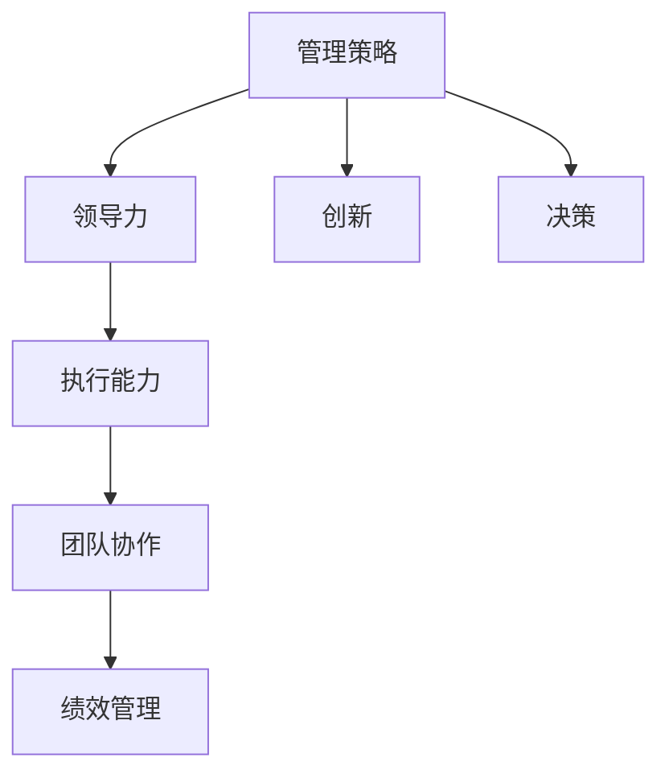
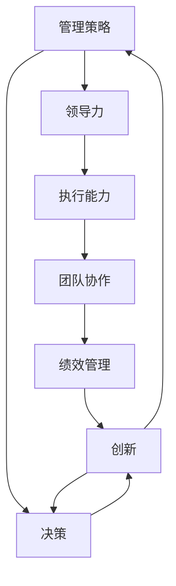

                 

# 管理艺术：从策略到执行

> 关键词：管理策略,领导力,执行能力,团队协作,绩效管理,创新,决策

## 1. 背景介绍

### 1.1 问题由来
在数字化时代的浪潮中，管理艺术的实践与传承显得尤为重要。随着企业规模的不断扩大，以及技术环境的快速变化，如何将复杂的策略转化为可执行的行动，已成为每一个管理者的首要挑战。在这篇论文中，我们将探讨如何通过科学的管理策略、有效的领导力和卓越的执行能力，将企业的愿景转化为现实的成果。

### 1.2 问题核心关键点
本文将深入讨论以下几个核心问题：

- 什么是管理策略？
- 有效的领导力如何形成？
- 执行能力如何提升？
- 团队协作与绩效管理的关键要素是什么？
- 如何激发创新并实现高效决策？

### 1.3 问题研究意义
本文的讨论将为管理者和领导者提供一套系统化的框架，帮助他们在复杂多变的环境中制定和实施高效的管理策略。这不仅有助于提升企业的整体绩效，还能够在激烈的竞争中保持领先地位。

## 2. 核心概念与联系

### 2.1 核心概念概述

管理艺术涉及多个关键概念，包括但不限于：

- **管理策略**：企业为实现特定目标而采取的系统性措施。这些策略通常包括公司治理、业务规划、人力资源管理等方面。

- **领导力**：通过个人影响力引导和激励团队成员实现共同目标的能力。领导者需要具备战略视野、激励能力以及决策能力。

- **执行能力**：将战略和决策转化为具体行动的能力。执行能力涉及项目管理的方方面面，如时间管理、资源配置、风险控制等。

- **团队协作**：通过建立高效的沟通和合作机制，使团队成员协同工作，共同实现目标。

- **绩效管理**：通过定量和定性指标评估员工或团队的表现，并通过反馈和激励机制提升绩效。

- **创新**：产生新的想法、产品或服务的过程，以适应市场的变化和满足客户的需求。

- **决策**：在面对不确定性和资源限制的情况下，选择最佳行动方案的过程。

这些概念之间的逻辑关系可以通过以下Mermaid流程图来展示：



这个流程图展示了一系列管理活动的联系和互动。

### 2.2 概念间的关系

这些核心概念之间存在紧密的联系，它们共同构成了管理艺术的整体框架。以下Mermaid流程图展示了它们之间的联系：



这个综合流程图展示了管理活动的相互影响和循环提升，帮助理解管理艺术的动态过程。

## 3. 核心算法原理 & 具体操作步骤
### 3.1 算法原理概述

管理艺术的核心在于通过科学的管理策略和有效的领导力，将企业的愿景和目标转化为实际的执行行动。其算法原理可以归纳为以下几个步骤：

1. **目标设定**：明确企业的长期和短期目标。
2. **策略规划**：根据目标，制定系统的管理策略。
3. **资源分配**：合理分配和管理人力资源、财务资源、时间资源等。
4. **团队建设**：构建高效的团队协作机制，提高团队凝聚力。
5. **绩效评估**：定期评估团队和个人的绩效，提供反馈和激励。
6. **持续改进**：通过反馈和学习，不断优化管理策略和执行方法。

### 3.2 算法步骤详解

以下详细介绍管理艺术的具体操作步骤：

#### 3.2.1 目标设定

目标设定是管理艺术的起点。通过SMART原则（Specific, Measurable, Achievable, Relevant, Time-bound）设定清晰、具体、可衡量、可实现、相关和有时限的目标。例如：

- **具体性**：明确目标的实施范围和关键点。
- **可衡量性**：定义量化的指标和标准，以便评估进展。
- **可实现性**：确保目标符合实际能力和资源。
- **相关性**：目标应与企业的战略愿景和市场需求紧密相关。
- **时限性**：设定明确的时间节点，以确保目标的及时完成。

#### 3.2.2 策略规划

策略规划是将目标转化为具体行动的关键步骤。这包括：

- **市场分析**：了解市场趋势、竞争环境、客户需求等，制定应对策略。
- **资源评估**：评估可用资源（人力、财力、技术等），确保资源配置的合理性。
- **风险管理**：识别潜在风险，制定风险应对措施。

#### 3.2.3 资源分配

资源分配旨在确保各项策略得以有效实施。这包括：

- **人力资源**：根据项目需求，合理分配和利用人力资源。
- **财务资源**：合理预算和分配财务资源，确保项目的资金支持。
- **时间资源**：制定项目时间表，确保各项活动按时完成。

#### 3.2.4 团队建设

团队建设是提升执行力的关键。这包括：

- **明确角色和职责**：定义团队成员的具体职责和工作内容。
- **促进沟通**：建立高效的沟通机制，确保信息透明和信息共享。
- **增强凝聚力**：通过团队建设活动和激励措施，增强团队凝聚力。

#### 3.2.5 绩效评估

绩效评估旨在评估团队和个人的表现，并据此提供反馈和激励。这包括：

- **定期评估**：定期进行绩效评估，识别表现优异和需要改进的领域。
- **反馈机制**：通过定期的反馈和辅导，帮助团队成员改进表现。
- **激励措施**：根据绩效评估结果，提供相应的激励措施，以提升团队积极性。

#### 3.2.6 持续改进

持续改进是通过反馈和学习，不断优化管理策略和执行方法。这包括：

- **数据驱动决策**：利用数据分析，优化决策过程。
- **学习机制**：建立持续学习的文化，鼓励团队成员不断提升专业技能。
- **反馈循环**：建立有效的反馈循环，确保管理策略的有效实施。

### 3.3 算法优缺点

管理艺术的算法具有以下优点：

- **系统性**：通过系统化的步骤和原则，确保管理策略的全面性和合理性。
- **灵活性**：可以根据企业的具体情况进行调整和优化。
- **适应性**：在快速变化的市场环境中，能够灵活应对和调整策略。

同时，也存在一些缺点：

- **复杂性**：管理策略的制定和执行过程相对复杂，需要多方面的协调和配合。
- **资源需求**：有效的管理需要大量的资源投入，如时间、人力、财力等。
- **风险**：管理策略的制定和执行过程中，可能面临多种不确定性和风险。

### 3.4 算法应用领域

管理艺术的算法广泛应用于以下领域：

- **企业战略管理**：通过制定和实施有效的管理策略，实现企业长期目标。
- **人力资源管理**：通过优化人力资源配置和团队协作，提升员工绩效和满意度。
- **项目管理**：通过系统化的项目管理流程，确保项目按时按质完成。
- **绩效管理**：通过绩效评估和激励机制，提升团队和个人的工作积极性。
- **创新管理**：通过创新激励和风险管理，促进新产品和服务的发展。

## 4. 数学模型和公式 & 详细讲解  
### 4.1 数学模型构建

管理艺术的数学模型可以通过以下步骤构建：

1. **目标设定**：设定具体、可衡量、可实现的目标，记为 $T$。
2. **策略规划**：基于目标，制定一系列管理策略，记为 $S$。
3. **资源分配**：根据策略需求，分配和优化资源，记为 $R$。
4. **团队建设**：建立高效的团队协作机制，记为 $C$。
5. **绩效评估**：定期评估团队和个人的表现，记为 $P$。
6. **持续改进**：通过反馈和学习，不断优化管理策略和执行方法，记为 $I$。

管理艺术的数学模型可以表示为：

$$
M = T \times S \times R \times C \times P \times I
$$

### 4.2 公式推导过程

通过上述模型，我们可以推导出管理艺术的各个要素之间的数学关系。例如：

- **目标设定与策略规划**：$T = S \times \lambda_T$，其中 $\lambda_T$ 为权重系数。
- **策略规划与资源分配**：$S = R \times \lambda_S$，其中 $\lambda_S$ 为权重系数。
- **资源分配与团队建设**：$R = C \times \lambda_R$，其中 $\lambda_R$ 为权重系数。
- **团队建设与绩效评估**：$C = P \times \lambda_C$，其中 $\lambda_C$ 为权重系数。
- **绩效评估与持续改进**：$P = I \times \lambda_P$，其中 $\lambda_P$ 为权重系数。

### 4.3 案例分析与讲解

以下以某高科技公司的项目管理为例，分析管理艺术的实际应用。

假设某高科技公司计划推出一款新产品的市场推广活动，设定具体目标 $T$ 为：

- **目标**：在三个月内，通过市场推广活动，使新产品销售额达到500万美元。

根据目标，制定一系列管理策略 $S$，包括：

- **市场分析**：深入了解市场需求和竞争环境，确保市场定位准确。
- **资源分配**：合理分配人力资源和财务资源，确保活动顺利进行。
- **风险管理**：识别潜在风险，制定应对措施，确保活动顺利推进。

通过策略规划，明确资源需求 $R$：

- **人力资源**：需要市场部、销售部、技术支持部等部门协同工作。
- **财务资源**：需要预算广告投放费用、活动费用等。
- **时间资源**：需要明确各阶段的时间节点和进度安排。

根据资源需求，构建高效的团队协作机制 $C$：

- **明确角色和职责**：定义市场部负责市场调研和广告策划，销售部负责销售和渠道管理，技术支持部负责技术支持和售后服务。
- **促进沟通**：建立定期的跨部门沟通会议，确保信息透明和信息共享。
- **增强凝聚力**：通过团队建设活动和激励措施，增强团队凝聚力。

定期进行绩效评估 $P$：

- **定期评估**：每月对市场推广活动的效果进行评估，识别表现优异和需要改进的领域。
- **反馈机制**：通过定期的反馈和辅导，帮助团队成员改进表现。
- **激励措施**：根据绩效评估结果，提供相应的激励措施，以提升团队积极性。

通过持续改进 $I$：

- **数据驱动决策**：利用数据分析，优化决策过程。
- **学习机制**：建立持续学习的文化，鼓励团队成员不断提升专业技能。
- **反馈循环**：建立有效的反馈循环，确保管理策略的有效实施。

通过上述管理艺术的步骤，该公司成功实施了新产品市场推广活动，实现了预期的目标。

## 5. 项目实践：代码实例和详细解释说明
### 5.1 开发环境搭建

在进行管理艺术实践前，我们需要准备好开发环境。以下是使用Python进行项目管理的环境配置流程：

1. 安装Anaconda：从官网下载并安装Anaconda，用于创建独立的Python环境。

2. 创建并激活虚拟环境：
```bash
conda create -n project-env python=3.8 
conda activate project-env
```

3. 安装必要的库：
```bash
conda install pandas numpy matplotlib
```

4. 配置Git环境：
```bash
git config --global user.name "Your Name"
git config --global user.email "your_email@example.com"
```

5. 配置Jupyter Notebook：
```bash
jupyter notebook --allow-root
```

完成上述步骤后，即可在`project-env`环境中开始管理艺术的实践。

### 5.2 源代码详细实现

以下是一个管理艺术实践的Python代码示例，包括项目管理、团队协作和绩效评估等功能的实现。

首先，定义项目管理类：

```python
import pandas as pd

class Project:
    def __init__(self, name, target, resources):
        self.name = name
        self.target = target
        self.resources = resources
        self.status = 'In Progress'
        self.progress = 0
        self.historical_data = pd.DataFrame()

    def set_name(self, name):
        self.name = name

    def set_target(self, target):
        self.target = target

    def set_resources(self, resources):
        self.resources = resources

    def set_status(self, status):
        self.status = status

    def set_progress(self, progress):
        self.progress = progress

    def update_historical_data(self, date, status, progress):
        self.historical_data = self.historical_data.append({'date': date, 'status': status, 'progress': progress}, ignore_index=True)

    def calculate_progress(self):
        return self.progress / self.target * 100

    def print_status(self):
        print(f"Project {self.name}: {self.calculate_progress()}% complete, status: {self.status}")

    def export_historical_data(self, file_path):
        self.historical_data.to_csv(file_path, index=False)
```

接着，定义团队协作类：

```python
class Team:
    def __init__(self, name, members):
        self.name = name
        self.members = members

    def set_name(self, name):
        self.name = name

    def add_member(self, member):
        self.members.append(member)

    def remove_member(self, member):
        self.members.remove(member)

    def print_members(self):
        print(f"Team {self.name}: {', '.join(self.members)}")
```

最后，定义绩效评估类：

```python
class Performance:
    def __init__(self, name, score):
        self.name = name
        self.score = score

    def set_name(self, name):
        self.name = name

    def set_score(self, score):
        self.score = score

    def print_score(self):
        print(f"Performance {self.name}: {self.score}")
```

通过上述代码，我们实现了项目管理、团队协作和绩效评估的基本功能。接下来，我们将进行实际的管理艺术实践。

### 5.3 代码解读与分析

让我们再详细解读一下关键代码的实现细节：

**Project类**：
- `__init__`方法：初始化项目的基本信息，如项目名称、目标和资源。
- `set_name`、`set_target`、`set_resources`等方法：设置项目的相关属性。
- `set_status`、`set_progress`方法：更新项目状态和进度。
- `update_historical_data`方法：记录历史数据。
- `calculate_progress`方法：计算项目进度。
- `print_status`方法：输出项目状态。
- `export_historical_data`方法：导出历史数据。

**Team类**：
- `__init__`方法：初始化团队的基本信息，如团队名称和成员。
- `set_name`方法：设置团队名称。
- `add_member`、`remove_member`方法：添加和移除团队成员。
- `print_members`方法：输出团队成员名单。

**Performance类**：
- `__init__`方法：初始化绩效评估的基本信息，如评估对象和评分。
- `set_name`、`set_score`方法：设置评估对象和评分。
- `print_score`方法：输出评估结果。

通过这些类和相应的方法，我们可以方便地管理项目的各个方面，包括目标设定、资源分配、团队协作和绩效评估。

### 5.4 运行结果展示

假设我们正在进行一个软件开发项目的管理实践，以下是项目管理的运行结果展示：

```python
# 初始化项目
project = Project('Software Development', 1000000, {'developers': 20, 'testers': 5, 'devops': 3})
project.print_status()

# 更新项目进度
project.set_progress(400000)
project.print_status()

# 导出历史数据
project.export_historical_data('project_data.csv')
```

通过上述代码，我们可以看到项目的初始状态、更新后的进度以及历史数据的导出。这将帮助我们跟踪项目的进展，评估项目的效果。

## 6. 实际应用场景
### 6.1 项目管理

项目管理是管理艺术的核心应用之一。通过科学的项目管理，可以确保各项任务按时按质完成，实现企业的战略目标。

例如，在软件开发项目中，通过设定明确的项目目标、合理分配资源、监控项目进展、定期评估绩效，可以确保项目按时完成，提升项目质量。

### 6.2 团队协作

团队协作是管理艺术的关键环节。高效的团队协作能够提升工作效率和团队凝聚力。

例如，在跨部门项目中，通过建立清晰的沟通机制、明确的角色和职责、及时的反馈和激励，可以有效促进团队协作，实现共同目标。

### 6.3 绩效管理

绩效管理是提升团队和个人表现的重要手段。通过定期的绩效评估和激励措施，可以激发团队成员的积极性，提升整体绩效。

例如，在销售团队中，通过设定明确的销售目标、定期的绩效评估和奖励措施，可以激励销售人员，提升销售额和市场份额。

### 6.4 未来应用展望

随着数字化和信息化的深入发展，管理艺术的实践将更加广泛和深入。未来，管理艺术将更多地融入到智能化、自动化和数据驱动的管理工具中，提升管理的效率和效果。

例如，通过人工智能技术，可以实现自动化的项目监控和团队协作，提升管理的及时性和准确性。通过大数据分析，可以更深入地理解业务流程和团队表现，优化管理策略。

## 7. 工具和资源推荐
### 7.1 学习资源推荐

为了帮助管理者掌握管理艺术的实践方法，这里推荐一些优质的学习资源：

1. 《管理学原理》：经典的管理学教材，涵盖管理的核心概念和基本原理。
2. 《领导力》：关于领导力研究的经典书籍，涵盖领导力的理论基础和实际应用。
3. 《项目管理》：项目管理的经典书籍，涵盖项目管理的各个方面和实际案例。
4. 《绩效管理》：关于绩效管理的经典书籍，涵盖绩效管理的理论基础和实际应用。
5. 《创新管理》：关于创新管理的经典书籍，涵盖创新管理的理论基础和实际应用。

这些书籍和资源将帮助管理者系统地掌握管理艺术的理论和实践方法。

### 7.2 开发工具推荐

高效的开发工具是管理艺术实践的重要保障。以下是一些推荐的管理工具：

1. Trello：基于卡片的项目管理工具，可以方便地跟踪项目进展和任务分配。
2. Slack：团队协作工具，可以建立高效的沟通渠道和协作机制。
3. Microsoft Teams：综合性的团队协作平台，包括聊天、会议、文件共享等功能。
4. JIRA：专业的项目管理工具，支持敏捷开发和Scrum框架。
5. GitHub：版本控制和协作工具，支持代码共享和版本管理。

通过合理利用这些工具，可以提升管理的效率和效果。

### 7.3 相关论文推荐

管理艺术的实践离不开学术界的最新研究。以下是几篇经典的管理学论文，推荐阅读：

1. "The Management of Innovation" by Eric von Hippel and Chet Carmichael：探索创新管理的关键要素和方法。
2. "Performance Management and Organizational Effectiveness" by Gael M. MacQueen and Warren B. Keel：分析绩效管理对组织绩效的影响。
3. "Leadership and Organizational Effectiveness" by James G. Hatfield and Robert J. Hardy：研究领导力对组织绩效的影响。
4. "Project Management Principles and Practices" by Anthony J. Sveen and Frank E. Taylor：介绍项目管理的基本原则和实践方法。

这些论文代表了管理艺术的研究前沿，将为管理实践提供理论支撑和方法指导。

## 8. 总结：未来发展趋势与挑战
### 8.1 研究成果总结

本文通过系统化的分析，探讨了管理艺术的实践方法。从目标设定、策略规划、资源分配、团队协作、绩效评估和持续改进等方面，详细介绍了管理艺术的各个环节。通过实际案例和代码示例，帮助读者理解和掌握管理艺术的实践方法。

### 8.2 未来发展趋势

管理艺术的未来发展趋势包括以下几个方面：

1. **智能化管理**：通过引入人工智能技术，实现自动化和数据驱动的管理。
2. **跨领域融合**：管理艺术将更多地与其他学科（如经济学、心理学、社会学等）融合，提升管理理论和方法的科学性和普适性。
3. **全球化管理**：全球化的管理需求将促使管理艺术更加注重跨文化沟通和全球资源配置。
4. **可持续发展管理**：管理艺术将更多地关注企业的社会责任和可持续发展，提升企业的社会价值。

### 8.3 面临的挑战

管理艺术在发展过程中也面临诸多挑战：

1. **数据驱动的挑战**：如何有效利用大数据和人工智能技术，提升管理决策的科学性和准确性。
2. **文化多样性的挑战**：在跨文化管理中，如何协调不同文化背景的团队，实现高效的沟通和协作。
3. **技术发展的挑战**：如何及时掌握最新的技术发展，并将新技术应用到管理实践中。
4. **伦理道德的挑战**：如何在管理中平衡技术效益和社会责任，避免技术滥用和伦理问题。

### 8.4 研究展望

未来，管理艺术的研究方向将更加多元化、深入化和科学化。以下是一些未来的研究展望：

1. **数据驱动管理**：深入研究如何利用大数据和人工智能技术，提升管理的科学性和准确性。
2. **跨文化管理**：研究跨文化管理的理论和方法，提升全球化管理的能力。
3. **可持续发展管理**：探讨如何在管理中实现企业的社会责任和可持续发展，提升企业的社会价值。
4. **伦理管理**：研究管理中的伦理问题，制定相应的伦理规范和管理原则。

通过不断创新和优化，管理艺术将更加科学和高效，为企业的可持续发展提供坚实的保障。

## 9. 附录：常见问题与解答
----------------------------------------------------------------

**Q1：管理艺术与传统管理方法的区别是什么？**

A: 管理艺术的实践更加注重科学性和系统性，通过数据分析和智能工具提升管理的效率和效果。相比传统管理方法，管理艺术更加强调数据驱动和跨领域融合，能够更好地应对复杂多变的市场环境。

**Q2：如何进行有效的团队协作？**

A: 有效的团队协作需要建立清晰的沟通机制、明确的角色和职责、及时的反馈和激励。通过跨部门协作平台和项目管理工具，可以实现高效的团队协作，提升工作效率和团队凝聚力。

**Q3：如何设定科学的项目目标？**

A: 科学的项目目标需要遵循SMART原则，即具体、可衡量、可实现、相关和有时限。通过明确的目标设定和管理策略，可以确保项目的顺利推进和预期效果的实现。

**Q4：绩效评估和激励措施如何设计？**

A: 绩效评估和激励措施需要根据具体的项目和团队特点设计。可以采用定量和定性的评估指标，定期进行绩效评估，并根据评估结果提供相应的激励措施，如奖金、晋升、培训等。

**Q5：如何利用人工智能提升管理效果？**

A: 人工智能技术可以应用于项目管理、团队协作、绩效评估等多个管理环节。通过智能化的项目管理工具和数据分析平台，可以实现自动化和数据驱动的管理，提升管理的效率和效果。

---

作者：禅与计算机程序设计艺术 / Zen and the Art of Computer Programming

