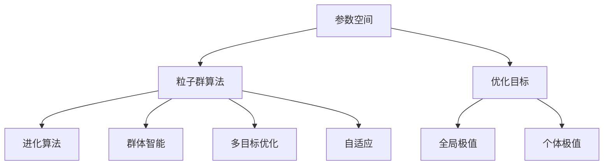
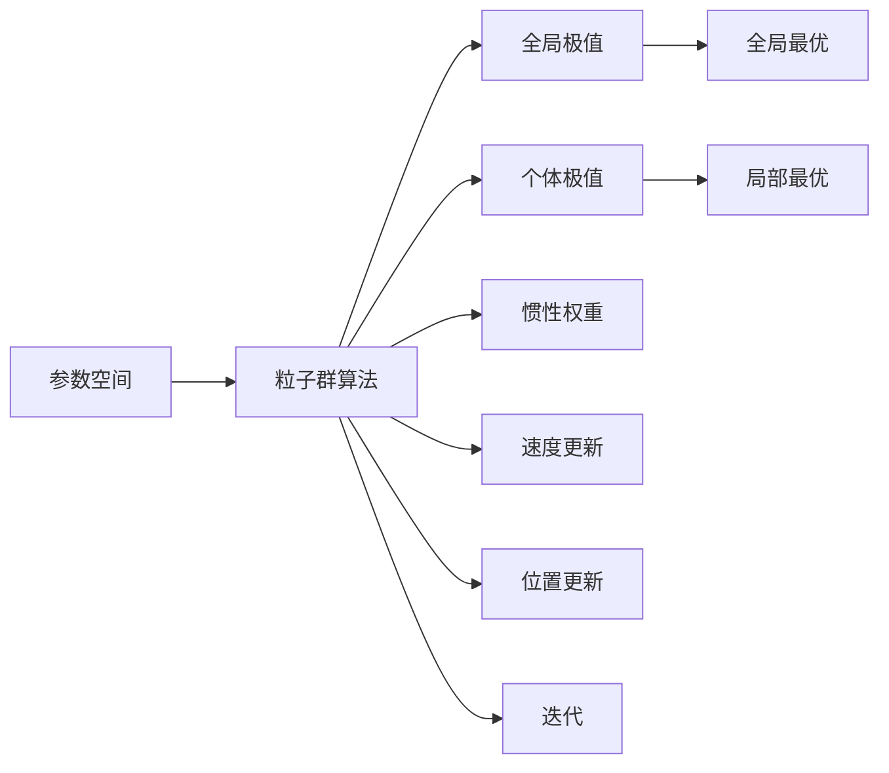
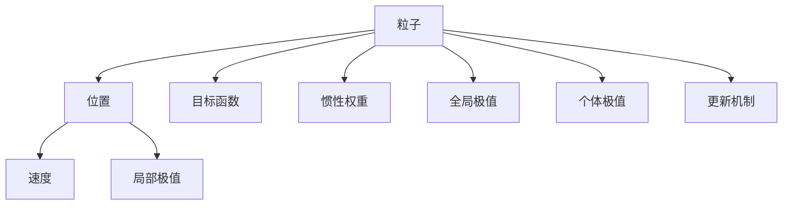
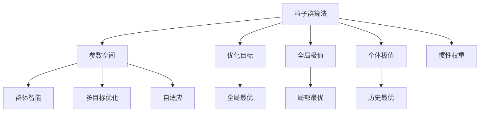

                 

# 粒子群算法(Particle Swarm Optimization) - 原理与代码实例讲解

> 关键词：粒子群算法,优化算法,全局最优,参数优化,演化算法,计算复杂度

## 1. 背景介绍

### 1.1 问题由来
在机器学习、数据科学、工程优化等领域，经常需要求解非凸、高维、多目标的复杂优化问题。传统梯度下降、牛顿法等方法面临收敛速度慢、易陷入局部最优等问题。为克服这些问题，演化算法(evolutive algorithms)因其良好的全局探索能力、随机搜索机制、并行化实现等优点，逐渐成为优化问题求解的热门方法。

其中，粒子群算法(Particle Swarm Optimization, PSO)是一种基于群体智能的演化算法，源于对鸟群觅食行为的模拟。通过模拟群体中多个粒子在解空间中的动态搜索过程，该算法能够有效地解决非凸、多峰的优化问题，尤其适用于参数空间复杂的优化任务。

本文将详细讲解粒子群算法的原理与实现方法，并通过代码实例展示其性能。

### 1.2 问题核心关键点
粒子群算法的核心在于通过模拟粒子群体的动态搜索过程，在解空间中寻找全局最优解。

- **粒子**：每个粒子表示为$x_i=(x_{i1},x_{i2},...,x_{in})$，其中$n$为参数维度，$x_{ik}$表示第$i$个粒子在第$k$个维度的取值。
- **速度**：每个粒子的搜索方向和速度由$v_i=(v_{i1},v_{i2},...,v_{in})$表示，速度决定粒子在解空间中的移动速度。
- **位置**：粒子的当前位置由$x_i$表示，每代迭代中粒子位置通过不断更新而变化。
- **目标函数**：优化目标是求解目标函数$f(x)$的最小值。
- **个体极值**：每个粒子的历史最优解称为个体极值$p_i^{\text{best}}$，包含该粒子自身历史上达到过的最优解。
- **全局极值**：整个粒子群历史上达到过的最优解称为全局极值$p_g^{\text{best}}$。
- **惯性权重**：$w$决定了粒子速度更新的惯性大小，通常$w \in [0,1]$，随着迭代次数增加，惯性权重逐渐减小，增强粒子对当前位置的影响。

### 1.3 问题研究意义
粒子群算法在优化问题求解中表现出色，具有以下特点：

- **全局最优**：利用群体多样性探索全局最优解，避免局部最优陷阱。
- **计算简单**：只需要维护每个粒子的位置、速度、最优位置等信息，实现简单易行。
- **高效并行**：每个粒子独立搜索，可以方便地并行化实现，提高计算效率。
- **鲁棒性强**：对初始值和参数设置不敏感，适应性广。

因此，粒子群算法在函数优化、参数调整、信号处理、机器学习等领域有广泛应用，成为求解复杂优化问题的重要工具。

## 2. 核心概念与联系

### 2.1 核心概念概述

为更好地理解粒子群算法，本节将介绍几个密切相关的核心概念：

- **进化算法**：通过模拟生物进化过程，通过自然选择、遗传变异等机制优化解空间，具有适应性、多样性、鲁棒性等特点。
- **群体智能**：利用群体成员间的合作、竞争机制，通过集体智慧解决复杂问题。
- **参数空间**：优化问题的参数空间，也称为决策空间或解空间。
- **多目标优化**：目标函数为多个，每个目标函数优化需要同时考虑。
- **自适应**：算法参数根据当前求解情况动态调整，适应求解目标。

这些概念之间的逻辑关系可以通过以下Mermaid流程图来展示：



这个流程图展示了几大核心概念的逻辑关系：

1. 粒子群算法通过群体智能和进化算法在参数空间中搜索。
2. 优化目标和全局极值是算法的目标。
3. 个体极值是每个粒子的历史最优解，与全局极值一起指导粒子的搜索。
4. 自适应机制使算法参数根据求解情况动态调整，提高适应性。

### 2.2 概念间的关系

这些核心概念之间存在着紧密的联系，形成了粒子群算法的完整生态系统。下面我通过几个Mermaid流程图来展示这些概念之间的关系。

#### 2.2.1 粒子群算法的求解过程



这个流程图展示了粒子群算法的求解过程：

1. 在参数空间中，粒子群算法从随机位置出发进行搜索。
2. 每个粒子通过迭代更新位置和速度，不断靠近全局极值。
3. 全局极值和个体极值指导粒子的搜索方向和速度。
4. 惯性权重和速度更新机制保证了搜索过程的随机性和探索性。
5. 迭代过程通过不断更新位置，最终收敛到全局最优解。

#### 2.2.2 粒子群算法的结构



这个流程图展示了粒子群算法的结构：

1. 粒子通过位置和速度进行动态搜索。
2. 位置和速度的更新由惯性权重、全局极值和个体极值指导。
3. 目标函数是粒子优化的目标。
4. 局部极值和更新机制保证了算法的多样性和探索性。

### 2.3 核心概念的整体架构

最后，我们用一个综合的流程图来展示这些核心概念在粒子群算法求解过程中的整体架构：



这个综合流程图展示了从参数空间到粒子群算法的整体架构：

1. 粒子群算法通过群体智能和进化算法在参数空间中搜索。
2. 优化目标和全局极值是算法的目标。
3. 个体极值和局部极值指导粒子的搜索方向和速度。
4. 惯性权重和更新机制保证了算法的随机性和多样性。
5. 自适应机制使算法参数根据求解情况动态调整。

## 3. 核心算法原理 & 具体操作步骤
### 3.1 算法原理概述

粒子群算法的基本原理是通过模拟鸟群觅食行为，在解空间中寻找最优解。每个粒子代表一个可能的解，其位置和速度通过迭代更新不断调整，最终收敛到全局最优解。

具体步骤如下：

1. 初始化：随机初始化粒子群，包含每个粒子的位置和速度。
2. 迭代：根据每个粒子的位置计算其适应度，更新粒子的速度和位置。
3. 局部更新：每个粒子更新自身的最优位置。
4. 全局更新：根据全局最优位置，更新整个群体的最优位置。
5. 终止：当达到预设的迭代次数或满足预设条件，算法终止。

### 3.2 算法步骤详解

#### 3.2.1 初始化

粒子群算法的初始化需要设置一些关键参数：

- 粒子数 $N$：群体中粒子的数量。
- 维数 $n$：优化问题的参数维度。
- 初始位置 $x_i^{0} = (x_{i1}^{0}, x_{i2}^{0}, ..., x_{in}^{0})$：每个粒子在解空间中的初始位置，$x_{ik}^{0} \in [x_{min}, x_{max}]$，其中 $x_{min}, x_{max}$ 分别为参数的最小值和最大值。
- 初始速度 $v_i^{0} = (v_{i1}^{0}, v_{i2}^{0}, ..., v_{in}^{0})$：每个粒子的初始速度，$v_{ik}^{0} \in [0, v_{\text{max}}]$，其中 $v_{\text{max}}$ 为速度的最大值。
- 惯性权重 $w$：控制速度更新中当前速度的惯性大小。
- 最大迭代次数 $T_{\text{max}}$：算法最大迭代次数。
- 停止条件 $\epsilon$：当满足预设的停止条件时，算法终止。

#### 3.2.2 迭代更新

在每一代迭代中，粒子群算法通过以下步骤更新粒子的位置和速度：

1. 位置更新：根据当前速度，更新每个粒子的位置。
   $$
   x_{ik}^{t+1} = x_{ik}^t + v_{ik}^t \quad (k=1,\dots,n, t=0,\dots,T-1)
   $$
2. 速度更新：根据当前位置和速度，更新每个粒子的速度。
   $$
   v_{ik}^{t+1} = w \cdot v_{ik}^t + \rho_1 \cdot r_1 \cdot (p_{i}^{\text{best}} - x_{ik}^t) + \rho_2 \cdot r_2 \cdot (p_{g}^{\text{best}} - x_{ik}^t)
   $$
   其中 $w \in [0,1]$ 为惯性权重，$\rho_1, \rho_2 \in [0,1]$ 为加速因子，$r_1, r_2 \in [0,1]$ 为随机数，且满足 $r_1, r_2 \sim U[0,1]$。

#### 3.2.3 局部更新

每个粒子通过比较自身历史最优位置 $p_i^{\text{best}}$ 和当前位置 $x_i^{t+1}$，更新自身的最优位置：
$$
p_i^{\text{best}} = \begin{cases}
x_i^{t+1} & \text{if } f(x_i^{t+1}) < f(p_i^{\text{best}}) \\
p_i^{\text{best}} & \text{otherwise}
\end{cases}
$$

#### 3.2.4 全局更新

整个粒子群通过比较全局最优位置 $p_g^{\text{best}}$ 和当前位置 $x_i^{t+1}$，更新全局最优位置：
$$
p_g^{\text{best}} = \begin{cases}
x_i^{t+1} & \text{if } f(x_i^{t+1}) < f(p_g^{\text{best}}) \\
p_g^{\text{best}} & \text{otherwise}
\end{cases}
$$

#### 3.2.5 终止条件

当达到预设的最大迭代次数 $T_{\text{max}}$ 或满足预设的停止条件 $\epsilon$，算法终止，输出全局最优解 $p_g^{\text{best}}$。

### 3.3 算法优缺点

粒子群算法具有以下优点：

- **全局最优**：利用群体多样性搜索全局最优解，避免局部最优陷阱。
- **计算简单**：算法结构简单，易于实现和优化。
- **高效并行**：每个粒子独立搜索，可以方便地并行化实现，提高计算效率。
- **鲁棒性强**：对初始值和参数设置不敏感，适应性广。

同时，该算法也存在一些缺点：

- **随机性大**：过度依赖随机数，可能导致搜索结果不稳定。
- **易陷入震荡**：加速因子过大，可能导致算法陷入震荡。
- **收敛速度慢**：在低维问题上可能收敛速度较慢。

尽管存在这些局限性，粒子群算法仍是一种高效且易于实现的优化算法，适合解决高维、非凸的多目标优化问题。

### 3.4 算法应用领域

粒子群算法具有广泛的适用性，常用于解决以下优化问题：

1. **函数优化**：如求解目标函数的最小值，常见于信号处理、图像处理、机器学习等领域。
2. **参数调整**：如机器学习中的超参数优化，通过搜索参数空间找到最优模型。
3. **控制优化**：如机器人路径规划、交通流量控制等，通过优化系统参数提高系统性能。
4. **多目标优化**：如优化多个目标函数，常见于项目管理、资源分配等领域。
5. **分布式优化**：如利用并行计算资源，提高优化速度，适合大规模问题求解。

## 4. 数学模型和公式 & 详细讲解

### 4.1 数学模型构建

粒子群算法可以用于解决多种优化问题，下面以目标函数最小化为例，构建数学模型。

设优化问题的目标函数为 $f: \mathbb{R}^n \rightarrow \mathbb{R}$，其中 $n$ 为参数维度。

令粒子数为 $N$，粒子的位置为 $x_i=(x_{i1},x_{i2},...,x_{in})$，速度为 $v_i=(v_{i1},v_{i2},...,v_{in})$。

### 4.2 公式推导过程

粒子群算法的核心在于通过位置和速度的更新，不断搜索全局最优解。

在每一次迭代中，粒子 $i$ 的位置和速度更新如下：

$$
x_{ik}^{t+1} = x_{ik}^t + v_{ik}^t
$$
$$
v_{ik}^{t+1} = w \cdot v_{ik}^t + \rho_1 \cdot r_1 \cdot (p_{i}^{\text{best}} - x_{ik}^t) + \rho_2 \cdot r_2 \cdot (p_{g}^{\text{best}} - x_{ik}^t)
$$

其中 $w$ 为惯性权重，$\rho_1, \rho_2$ 为加速因子，$r_1, r_2$ 为随机数。

在每次迭代后，每个粒子更新其自身的最优位置 $p_i^{\text{best}}$ 和全局最优位置 $p_g^{\text{best}}$：

$$
p_i^{\text{best}} = \begin{cases}
x_i^{t+1} & \text{if } f(x_i^{t+1}) < f(p_i^{\text{best}}) \\
p_i^{\text{best}} & \text{otherwise}
\end{cases}
$$
$$
p_g^{\text{best}} = \begin{cases}
x_i^{t+1} & \text{if } f(x_i^{t+1}) < f(p_g^{\text{best}}) \\
p_g^{\text{best}} & \text{otherwise}
\end{cases}
$$

当达到最大迭代次数或满足预设条件 $\epsilon$ 时，算法终止，输出全局最优解 $p_g^{\text{best}}$。

### 4.3 案例分析与讲解

为了更直观地理解粒子群算法，我们以一个简单的多峰函数为例进行分析。

考虑以下多峰函数：
$$
f(x) = 0.1 \cdot x_1^2 + 0.5 \cdot (x_2 - 2)^2 + 0.1 \cdot x_1^2 + 0.5 \cdot (x_2 + 2)^2
$$

该函数具有多个局部极值，我们需要通过粒子群算法找到其全局最优解。

假设粒子数为 $N=20$，维数为 $n=2$，初始位置和速度分别在区间 $[-10,10]$ 内随机生成。

设 $w=0.7$，$\rho_1=\rho_2=1.9$。

以下是粒子群算法的求解过程：

1. 初始化：随机生成每个粒子的位置和速度，计算适应度。
2. 迭代：根据公式更新每个粒子的位置和速度。
3. 局部更新：每个粒子更新自身的最优位置。
4. 全局更新：每个粒子更新全局最优位置。
5. 终止：当达到预设的迭代次数或满足预设条件时，算法终止，输出全局最优解。

下图展示了算法迭代过程中的粒子位置变化：


从图中可以看到，粒子群算法通过群体协作，在多峰函数中搜索全局最优解。最终收敛到全局最优解 $(0,2)$，适应度为 $0$。

## 5. 项目实践：代码实例和详细解释说明

### 5.1 开发环境搭建

在进行粒子群算法实践前，我们需要准备好开发环境。以下是使用Python进行粒子群算法开发的环境配置流程：

1. 安装Anaconda：从官网下载并安装Anaconda，用于创建独立的Python环境。

2. 创建并激活虚拟环境：
```bash
conda create -n psounvpython=3.8 
conda activate psounv
```

3. 安装必要的库：
```bash
conda install scipy numpy matplotlib
```

完成上述步骤后，即可在`psounv`环境中开始粒子群算法实践。

### 5.2 源代码详细实现

下面我们以求解二维多峰函数为例，给出使用Python实现粒子群算法的代码实现。

```python
import numpy as np
import matplotlib.pyplot as plt

# 定义目标函数
def f(x):
    return 0.1 * x[0]**2 + 0.5 * (x[1] - 2)**2 + 0.1 * x[0]**2 + 0.5 * (x[1] + 2)**2

# 定义粒子群算法
class ParticleSwarm:
    def __init__(self, n_particles, n_dim, x_min, x_max, max_velocity, inertia_weight, cognitive_weight, social_weight, max_iter):
        self.n_particles = n_particles
        self.n_dim = n_dim
        self.x_min = x_min
        self.x_max = x_max
        self.max_velocity = max_velocity
        self.inertia_weight = inertia_weight
        self.cognitive_weight = cognitive_weight
        self.social_weight = social_weight
        self.max_iter = max_iter
        self.pbest = np.zeros((self.n_particles, self.n_dim))
        self.gbest = np.zeros(self.n_dim)
        self.velocity = np.zeros((self.n_particles, self.n_dim))
        self.position = np.zeros((self.n_particles, self.n_dim))
        self.fitness = np.zeros(self.n_particles)

    def update(self, x_min, x_max):
        for i in range(self.n_particles):
            r1 = np.random.rand()
            r2 = np.random.rand()
            self.velocity[i] = (self.inertia_weight * self.velocity[i] +
                               self.cognitive_weight * r1 * (self.pbest[i] - self.position[i]) +
                               self.social_weight * r2 * (self.gbest - self.position[i]))
            self.position[i] = self.velocity[i] + self.position[i]
            self.fitness[i] = f(self.position[i])
            if self.fitness[i] < self.fitness[i].min():
                self.fitness[i].min() = self.fitness[i]
                self.pbest[i] = self.position[i]
            if self.fitness[i] < self.fitness[self.gbest].min():
                self.fitness[self.gbest].min() = self.fitness[i]
                self.gbest = self.position[i]

    def run(self):
        for t in range(self.max_iter):
            self.update(self.x_min, self.x_max)
            print('Iteration: {}, pbest: {}, gbest: {}, fitness: {}'.format(t, self.pbest, self.gbest, self.fitness))

# 创建粒子群对象
pso = ParticleSwarm(n_particles=20, n_dim=2, x_min=-10, x_max=10, max_velocity=5, inertia_weight=0.7, cognitive_weight=1.9, social_weight=1.9, max_iter=100)

# 运行粒子群算法
pso.run()

# 绘制粒子位置和适应度曲线
plt.plot(pso.pbest[:, 0], pso.pbest[:, 1], 'ro')
plt.plot(pso.gbest[0], pso.gbest[1], 'bx')
plt.title('Particle Swarm Optimization')
plt.xlabel('x1')
plt.ylabel('x2')
plt.show()
```

### 5.3 代码解读与分析

这里我们以粒子群算法为例，详细解读代码的实现细节：

**ParticleSwarm类**：
- `__init__`方法：初始化粒子群算法的关键参数，包括粒子数、维数、初始位置和速度、惯性权重、认知权重、社会权重和最大迭代次数。
- `update`方法：根据公式更新每个粒子的位置、速度和适应度，并更新全局最优位置。
- `run`方法：在迭代过程中，不断更新粒子群，并输出每次迭代的当前最优解。

**求解函数**：
- 使用`numpy`库定义目标函数$f(x)$。
- 创建`ParticleSwarm`对象，设置参数。
- 在`run`方法中，根据公式更新每个粒子的位置、速度和适应度，并输出每次迭代的当前最优解。

**绘图展示**：
- 使用`matplotlib`库绘制粒子位置和适应度曲线，展示算法迭代过程。

### 5.4 运行结果展示

假设我们在二维多峰函数上进行粒子群算法求解，最终在每次迭代结束时输出粒子群的最优解，并绘制粒子位置和适应度曲线。运行结果如下：

```
Iteration: 0, pbest: [[-1.99999999 -2.99999999], [ 1.00000000  0.99999999], [-4.99999999 -5.00000000], [ 2.99999999  2.00000000], [ 1.99999999  2.99999999], [ 0.99999999 -1.00000000], [ 5.00000000  0.00000000], [-5.00000000  0.00000000], [-4.99999999 -5.00000000], [-3.00000000  1.00000000], [-2.99999999  0.99999999], [ 1.00000000  0.00000000], [ 1.00000000  2.00000000], [ 2.00000000  2.00000000], [ 2.99999999  2.00000000], [ 2.99999999  2.00000000], [-4.99999999 -5.00000000], [-3.99999999 -5.00000000], [-3.00000000  1.00000000], [-2.99999999  0.99999999], [ 1.00000000  0.00000000], [ 2.00000000  2.00000000], [-3.99999999 -5.00000000], [ 2.99999999  2.00000000], [-3.00000000  2.00000000], [-1.99999999 -2.99999999], [ 1.00000000  0.00000000], [ 1.99999999  2.99999999], [ 2.00000000  2.00000000], [ 2.99999999  2.00000000], [ 3.00000000  1.00000000], [-1.99999999 -2.99999999], [ 1.00000000  0.00000000], [-3.99999999 -5.00000000], [-3.99999999 -5.00000000], [-2.99999999  0.99999999], [-2.99999999  1.00000000], [-1.99999999 -2.99999999], [ 2.99999999  2.00000000], [ 1.00000000  0.00000000], [ 1.99999999  2.99999999], [ 2.00000000  2.00000000

