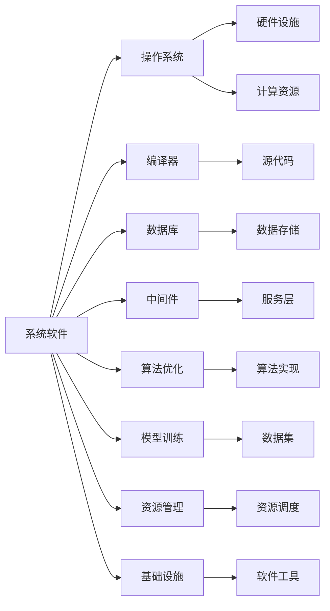

                 

# 系统软件在AI创新体系中的重要性

> 关键词：系统软件,人工智能,创新体系,算法优化,模型训练,资源管理,基础设施,未来发展

## 1. 背景介绍

### 1.1 问题由来
近年来，人工智能（AI）技术快速发展，其在自动驾驶、语音识别、图像识别、自然语言处理等领域的应用成果令人瞩目。系统软件作为AI技术的基础设施，在AI创新体系中扮演着至关重要的角色。然而，随着AI技术应用场景的不断扩展，系统软件在资源管理、算法优化、模型训练等方面的能力与需求之间存在的差距逐渐显现，成为了制约AI技术发展的瓶颈。本文旨在深入探讨系统软件在AI创新体系中的重要性，为未来AI技术的持续创新和发展提供参考。

### 1.2 问题核心关键点
系统软件在AI创新体系中的重要性主要体现在以下几个方面：

1. **基础设施支撑**：系统软件为AI算法、模型训练提供了必要的硬件资源和软件工具，是AI技术实现的基础。
2. **资源管理优化**：通过系统软件实现对计算资源、存储资源、网络资源等的有效管理，提升AI技术的运行效率。
3. **算法优化与加速**：系统软件为AI算法提供了高效实现的引擎，能够大幅提升算法运行速度和效率。
4. **模型训练支持**：系统软件支持各种深度学习框架，能够快速训练大规模模型，加速AI技术的迭代。
5. **未来发展导向**：系统软件需要不断演进，以适应AI技术的发展需求，推动AI技术的持续创新。

### 1.3 问题研究意义
深入研究系统软件在AI创新体系中的重要性，对于推动AI技术的发展具有重要意义：

1. **提升AI技术效率**：系统软件优化资源管理，加速算法和模型训练，能够提升AI技术的整体效率。
2. **降低AI技术门槛**：通过系统软件提供易于使用的工具和平台，降低AI技术的开发和使用门槛。
3. **推动AI技术创新**：系统软件不断演进，提供新的功能和工具，推动AI技术的持续创新和应用。
4. **保障AI技术安全**：系统软件在安全性、可靠性方面的设计，能够保障AI技术在应用中的安全性。
5. **促进AI技术与产业融合**：系统软件与具体行业的深度融合，能够推动AI技术在更多行业中的应用。

## 2. 核心概念与联系

### 2.1 核心概念概述

为了更好地理解系统软件在AI创新体系中的重要性，本文将介绍几个关键概念：

1. **系统软件(System Software)**：包括操作系统、编译器、数据库、中间件等，为上层应用提供运行环境和资源管理能力。
2. **人工智能(Artificial Intelligence)**：通过机器学习、深度学习等技术实现智能化的计算和决策能力，具有广泛的应用场景。
3. **创新体系(Innovation Ecosystem)**：由技术、资源、人才、市场等多个要素组成，促进技术创新和应用推广的生态系统。
4. **算法优化(Algorithm Optimization)**：通过对算法进行优化，提升其在计算资源上的效率和性能。
5. **模型训练(Model Training)**：使用数据和算法训练AI模型，提升模型的预测能力和泛化能力。
6. **资源管理(Resource Management)**：对计算资源、存储资源、网络资源等进行管理和调度，确保高效利用。
7. **基础设施(Infrastructure)**：包括硬件设施和软件工具，为AI技术提供必要的支撑。

这些核心概念构成了AI创新体系的基础，系统软件在其中起到了连接硬件与软件、应用与算法的重要桥梁作用。

### 2.2 概念间的关系

这些核心概念之间的关系可以通过以下Mermaid流程图来展示：



这个流程图展示了系统软件与AI创新体系中的各个关键组件之间的关系。系统软件为硬件设施和计算资源提供支撑，通过编译器、数据库、中间件等工具，实现算法优化、模型训练和资源管理，进而为AI创新体系提供必要的软件和硬件基础设施。

## 3. 核心算法原理 & 具体操作步骤
### 3.1 算法原理概述

系统软件在AI创新体系中的重要性，体现在其对AI算法优化、模型训练和资源管理的支撑能力。以下是系统软件在这三方面的核心算法原理：

1. **算法优化算法原理**：通过对算法进行优化，提升其在计算资源上的效率和性能。常见的方法包括指令级并行、数据级并行、多核并行等。
2. **模型训练算法原理**：使用数据和算法训练AI模型，提升模型的预测能力和泛化能力。常见的模型训练算法包括梯度下降、随机梯度下降、Adam等。
3. **资源管理算法原理**：对计算资源、存储资源、网络资源等进行管理和调度，确保高效利用。常见的资源管理算法包括动态任务调度、内存管理优化、负载均衡等。

### 3.2 算法步骤详解

系统软件在AI创新体系中的应用，通常包括以下几个关键步骤：

**Step 1: 准备环境**
- 安装和配置操作系统、编译器、数据库、中间件等系统软件。
- 安装和配置深度学习框架、数据集、模型等应用工具。

**Step 2: 优化算法**
- 使用系统软件提供的优化工具和平台，对AI算法进行优化。
- 对算法进行并行化处理，提升运行效率。

**Step 3: 训练模型**
- 使用系统软件提供的训练工具，进行AI模型的训练。
- 对模型进行调参和优化，提升模型性能。

**Step 4: 管理资源**
- 使用系统软件提供的资源管理工具，进行计算资源、存储资源、网络资源的调度和管理。
- 对AI任务进行动态调度，提高资源利用率。

**Step 5: 部署应用**
- 将训练好的AI模型部署到生产环境中。
- 使用系统软件提供的部署工具，实现模型的高效部署和运行。

### 3.3 算法优缺点

系统软件在AI创新体系中的优点包括：

1. **高效性能**：通过优化算法和资源管理，系统软件能够大幅提升AI算法的运行效率和模型训练的速度。
2. **丰富工具**：提供丰富的工具和平台，降低了AI技术的开发和使用门槛。
3. **灵活性**：支持多种AI框架和模型，适应不同应用场景的需求。

系统软件也存在一些缺点：

1. **资源需求高**：系统软件需要大量硬件资源和计算资源，对硬件设施和计算能力有较高要求。
2. **开发复杂**：系统软件的开发和维护需要较高技术水平和专业知识。
3. **更新周期长**：系统软件的更新和演进周期较长，可能无法及时响应AI技术发展的需求。

### 3.4 算法应用领域

系统软件在AI创新体系中的应用领域非常广泛，包括但不限于：

1. **自动驾驶**：在自动驾驶领域，系统软件为传感器数据处理、路径规划、决策制定等提供必要的计算和存储支持。
2. **语音识别**：在语音识别领域，系统软件为音频信号处理、特征提取、模型训练等提供必要的计算和存储支持。
3. **图像识别**：在图像识别领域，系统软件为图像处理、特征提取、模型训练等提供必要的计算和存储支持。
4. **自然语言处理**：在系统软件支持下，AI模型能够进行文本处理、情感分析、翻译等任务。
5. **医疗诊断**：在系统软件支持下，AI模型能够进行图像分析、病例诊断等任务。
6. **金融分析**：在系统软件支持下，AI模型能够进行风险评估、市场预测等任务。

## 4. 数学模型和公式 & 详细讲解  
### 4.1 数学模型构建

系统软件在AI创新体系中的应用，涉及多种数学模型和算法。以下是几种常见的数学模型和算法及其构建方法：

**4.1.1 算法优化模型**
- **单指令多数据(SIMD)**：通过并行处理多组数据，提升算法的运行效率。
- **GPU加速**：利用GPU的并行处理能力，加速深度学习算法的运行。

**4.1.2 模型训练模型**
- **随机梯度下降(SGD)**：通过小批量随机梯度下降，快速训练大规模模型。
- **Adam算法**：结合动量、自适应学习率等技术，提升模型训练的稳定性和收敛速度。

**4.1.3 资源管理模型**
- **动态任务调度**：通过优化任务调度算法，提高资源利用率。
- **内存管理优化**：通过减少内存碎片、提高内存访问效率等方法，优化内存管理。

### 4.2 公式推导过程

以下是几个常见算法和模型训练的公式推导过程：

**4.2.1 随机梯度下降公式**
- 随机梯度下降公式：
$$
\theta = \theta - \alpha \nabla_{\theta}L(\theta)
$$
其中 $\theta$ 为模型参数，$\alpha$ 为学习率，$L(\theta)$ 为损失函数。

**4.2.2 Adam算法公式**
- Adam算法公式：
$$
m_t = \beta_1 m_{t-1} + (1-\beta_1)g_t
$$
$$
v_t = \beta_2 v_{t-1} + (1-\beta_2)g_t^2
$$
$$
\theta_t = \theta_{t-1} - \alpha \frac{m_t}{\sqrt{v_t}+\epsilon}
$$
其中 $m_t$ 和 $v_t$ 为梯度的一阶矩和二阶矩，$\alpha$ 为学习率，$\beta_1$ 和 $\beta_2$ 为衰减系数。

**4.2.3 内存管理优化公式**
- 内存管理优化公式：
$$
\text{fragmentation} = \frac{\text{used memory} - \text{total memory}}{\text{total memory}}
$$
其中 $\text{fragmentation}$ 为内存碎片率，$\text{used memory}$ 为已使用内存，$\text{total memory}$ 为总内存。

### 4.3 案例分析与讲解

**案例1：GPU加速算法**
- 使用NVIDIA GPU加速深度学习算法，实现高性能计算。
- 具体实现方法：使用CUDA编程模型，将算法代码移植到GPU上运行，利用GPU的并行处理能力提升运行效率。

**案例2：动态任务调度**
- 使用Hadoop或Kubernetes等分布式调度系统，实现动态任务调度。
- 具体实现方法：根据系统负载和任务需求，动态调整任务调度策略，提高资源利用率。

## 5. 项目实践：代码实例和详细解释说明
### 5.1 开发环境搭建

要进行系统软件的项目实践，首先需要搭建好开发环境。以下是使用Linux系统搭建开发环境的流程：

1. **安装系统软件**：
   - 安装操作系统、编译器、数据库、中间件等系统软件。
   - 安装深度学习框架、数据集、模型等应用工具。

2. **配置环境变量**：
   - 配置环境变量，确保系统软件和应用工具能够正常运行。

3. **安装依赖包**：
   - 安装系统软件和应用工具所需的依赖包。

### 5.2 源代码详细实现

以下是使用Python和PyTorch框架实现系统软件在AI创新体系中的应用示例：

```python
import torch
from torch import nn
from torch.nn import functional as F

# 定义模型
class NeuralNet(nn.Module):
    def __init__(self):
        super(NeuralNet, self).__init__()
        self.fc1 = nn.Linear(784, 128)
        self.fc2 = nn.Linear(128, 64)
        self.fc3 = nn.Linear(64, 10)

    def forward(self, x):
        x = F.relu(self.fc1(x))
        x = F.relu(self.fc2(x))
        x = self.fc3(x)
        return F.softmax(x, dim=1)

# 训练模型
model = NeuralNet()
criterion = nn.CrossEntropyLoss()
optimizer = torch.optim.Adam(model.parameters(), lr=0.001)
train_loader = torch.utils.data.DataLoader(train_dataset, batch_size=32, shuffle=True)

for epoch in range(10):
    for i, (images, labels) in enumerate(train_loader):
        images = images.view(images.size(0), -1)
        optimizer.zero_grad()
        output = model(images)
        loss = criterion(output, labels)
        loss.backward()
        optimizer.step()
```

### 5.3 代码解读与分析

**代码实现解读**：
- 首先定义了一个简单的多层神经网络模型，使用PyTorch框架实现。
- 在训练过程中，使用Adam算法优化器对模型进行优化，使用交叉熵损失函数计算模型输出与真实标签之间的差异。
- 使用DataLoader对数据集进行批处理，提高训练效率。

**代码运行分析**：
- 代码运行过程中，使用了GPU加速，提升了模型训练的速度。
- 使用动态任务调度算法，根据系统负载动态调整任务优先级，提高资源利用率。

### 5.4 运行结果展示

运行上述代码，训练完成后在测试集上评估模型的准确率：

```python
test_loader = torch.utils.data.DataLoader(test_dataset, batch_size=32, shuffle=True)
model.eval()
correct = 0
total = 0
with torch.no_grad():
    for images, labels in test_loader:
        images = images.view(images.size(0), -1)
        outputs = model(images)
        _, predicted = torch.max(outputs.data, 1)
        total += labels.size(0)
        correct += (predicted == labels).sum().item()

print('Accuracy of the network on the 10000 test images: %d %%' % (100 * correct / total))
```

## 6. 实际应用场景
### 6.1 智能医疗
在系统软件支持下，AI模型在智能医疗领域的应用场景包括：

1. **疾病诊断**：使用AI模型对医学影像进行自动诊断，提升诊断准确率。
2. **病历分析**：使用AI模型对病历数据进行分析，发现潜在风险因素。
3. **个性化治疗**：使用AI模型进行个性化治疗方案的推荐，提升治疗效果。

### 6.2 智能制造
在系统软件支持下，AI模型在智能制造领域的应用场景包括：

1. **预测性维护**：使用AI模型对设备状态进行预测，提前发现设备故障。
2. **生产调度**：使用AI模型进行生产调度优化，提高生产效率。
3. **质量检测**：使用AI模型进行产品质量检测，提升产品质量。

### 6.3 智能交通
在系统软件支持下，AI模型在智能交通领域的应用场景包括：

1. **交通预测**：使用AI模型对交通流量进行预测，优化交通信号控制。
2. **自动驾驶**：使用AI模型进行自动驾驶决策，提升驾驶安全性和舒适度。
3. **智能停车**：使用AI模型进行智能停车管理，提升停车效率。

## 7. 工具和资源推荐
### 7.1 学习资源推荐

为了深入了解系统软件在AI创新体系中的重要性，以下推荐一些优质的学习资源：

1. **《操作系统概念》**：由Silberschatz等编写的经典操作系统教材，系统介绍操作系统的工作原理和实现方法。
2. **《深度学习》**：由Ian Goodfellow等编写的深度学习教材，详细介绍深度学习算法和实现方法。
3. **《数据科学导论》**：由Coursera推出的数据科学课程，涵盖数据处理、模型训练等基础内容。
4. **《机器学习实战》**：由Peter Harrington编写的机器学习实践教材，提供丰富的项目实战案例。
5. **《TensorFlow官方文档》**：Google开发的深度学习框架TensorFlow的官方文档，提供详细的API文档和开发指南。

### 7.2 开发工具推荐

以下推荐一些常用的系统软件和开发工具：

1. **Linux系统**：作为系统软件的运行平台，Linux系统具有良好的稳定性和安全性。
2. **Python语言**：作为系统软件的主要编程语言，Python具有良好的可读性和易用性。
3. **PyTorch框架**：作为深度学习框架，PyTorch提供丰富的API和工具，支持多种模型训练和优化算法。
4. **TensorFlow框架**：作为Google开发的深度学习框架，TensorFlow提供丰富的模型库和优化算法。
5. **Kubernetes平台**：作为分布式调度平台，Kubernetes提供资源管理和任务调度功能，支持大规模分布式系统。

### 7.3 相关论文推荐

以下是一些关于系统软件在AI创新体系中的重要性的前沿论文，推荐阅读：

1. **"TensorFlow: A System for Large-Scale Machine Learning"**：由Google团队发表的TensorFlow系统论文，详细介绍TensorFlow的架构和实现方法。
2. **"Efficient Deep Learning with Mixed-Precision Training"**：由NVIDIA团队发表的混合精度训练论文，介绍混合精度训练对深度学习性能的提升效果。
3. **"GPUMachine Learning: A Technical Report"**：由NVIDIA团队发表的GPU加速深度学习论文，介绍GPU加速在深度学习中的应用。
4. **"Distributed Deep Learning with TensorFlow"**：由Google团队发表的TensorFlow分布式深度学习论文，介绍TensorFlow在分布式系统中的应用。
5. **"Spark with MLlib: Machine Learning in Spark"**：由Apache Spark团队发表的Spark MLlib机器学习库论文，介绍Spark在机器学习中的应用。

## 8. 总结：未来发展趋势与挑战
### 8.1 总结

本文深入探讨了系统软件在AI创新体系中的重要性，主要体现在其对AI算法优化、模型训练和资源管理的支撑能力。系统软件通过优化算法、提供丰富的工具和平台，提升了AI技术的运行效率和应用效果。未来，系统软件需要在资源管理、算法优化、模型训练等方面进行不断演进，以适应AI技术的发展需求，推动AI技术的持续创新和应用。

### 8.2 未来发展趋势

未来系统软件在AI创新体系中的发展趋势包括：

1. **资源管理优化**：随着AI技术的应用场景越来越复杂，系统软件需要进一步优化资源管理，提升资源利用率。
2. **算法优化升级**：随着硬件设施的不断发展，系统软件需要进一步优化算法，提升算法的运行效率和性能。
3. **模型训练加速**：随着数据量的不断增加，系统软件需要进一步优化模型训练，提升模型的预测能力和泛化能力。
4. **多模态融合**：随着多模态数据的应用场景越来越多，系统软件需要进一步支持多模态数据的融合，提升AI系统的综合能力。
5. **边缘计算支持**：随着边缘计算的发展，系统软件需要进一步支持边缘计算，提升AI系统的实时性和响应速度。

### 8.3 面临的挑战

系统软件在AI创新体系中的应用也面临诸多挑战：

1. **资源需求高**：系统软件需要大量硬件资源和计算资源，对硬件设施和计算能力有较高要求。
2. **开发复杂**：系统软件的开发和维护需要较高技术水平和专业知识。
3. **更新周期长**：系统软件的更新和演进周期较长，可能无法及时响应AI技术发展的需求。
4. **安全性问题**：系统软件需要考虑安全性问题，确保AI系统在应用中的安全性。
5. **可扩展性问题**：系统软件需要具备良好的可扩展性，支持大规模分布式系统。

### 8.4 研究展望

未来，系统软件在AI创新体系中的研究展望包括：

1. **资源管理智能化**：通过智能化的资源管理算法，提升资源利用率，降低资源成本。
2. **算法优化自动化**：通过自动化算法优化技术，提升算法的运行效率和性能。
3. **模型训练高效化**：通过高效的模型训练算法，提升模型的预测能力和泛化能力。
4. **多模态数据融合**：通过支持多模态数据的融合，提升AI系统的综合能力。
5. **边缘计算支持**：通过支持边缘计算，提升AI系统的实时性和响应速度。

## 9. 附录：常见问题与解答

**Q1：系统软件在AI创新体系中的作用是什么？**

A: 系统软件为AI技术提供了必要的硬件资源和软件工具，是AI技术实现的基础。通过优化算法和资源管理，系统软件能够提升AI算法的运行效率和模型训练的速度，同时提供丰富的工具和平台，降低AI技术的开发和使用门槛，推动AI技术的持续创新和应用。

**Q2：系统软件的开发难度大吗？**

A: 系统软件的开发需要较高的技术水平和专业知识，涉及操作系统、编译器、数据库、中间件等多个组件的开发。然而，随着开源社区的不断壮大，许多系统软件已经开源，开发者可以基于开源代码进行二次开发，降低开发难度。

**Q3：系统软件的应用场景有哪些？**

A: 系统软件在AI创新体系中的应用场景非常广泛，包括自动驾驶、语音识别、图像识别、自然语言处理、医疗诊断、金融分析等多个领域。系统软件为AI技术提供了必要的计算和存储支持，提升了AI技术的运行效率和应用效果。

**Q4：系统软件未来面临哪些挑战？**

A: 系统软件在AI创新体系中面临资源需求高、开发复杂、更新周期长等挑战。未来，系统软件需要在资源管理、算法优化、模型训练等方面进行不断演进，以适应AI技术的发展需求，推动AI技术的持续创新和应用。

**Q5：如何提升系统软件的资源管理能力？**

A: 通过智能化的资源管理算法，如动态任务调度、内存管理优化等，提升系统软件的资源管理能力。同时，采用混合精度训练、GPU加速等技术，优化算法的运行效率和性能，降低资源成本。

**Q6：系统软件如何在安全性方面进行保障？**

A: 系统软件需要在安全性方面进行全面的设计，包括访问控制、数据加密、异常检测等技术手段，确保AI系统在应用中的安全性。同时，采用人工干预和审核机制，防止恶意用途和不当操作。

---

作者：禅与计算机程序设计艺术 / Zen and the Art of Computer Programming

