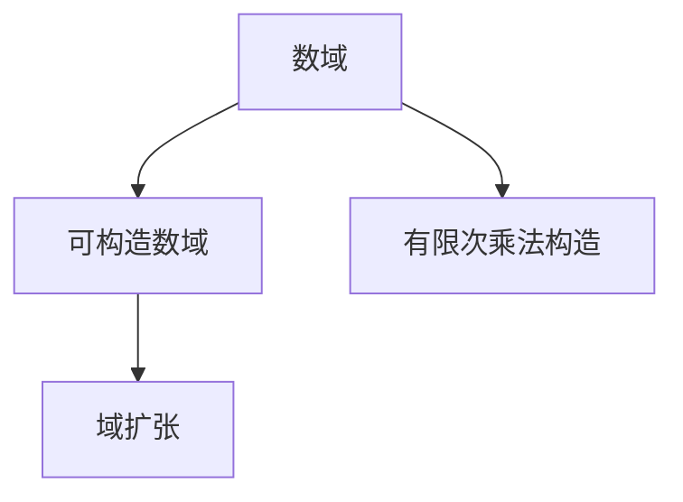
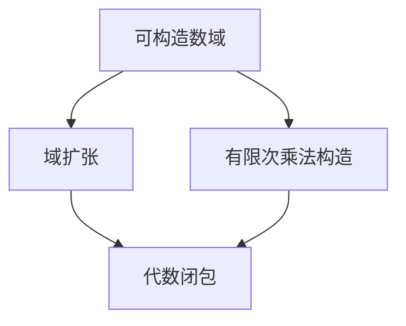

                 

## 1. 背景介绍

### 1.1 问题由来

线性代数作为数学的重要分支，广泛应用于各个科学和工程领域。从机器学习模型的训练到信号处理、图像处理等，其核心问题都可以归结为求解线性方程组、矩阵运算、特征值问题等。然而，在实际应用中，我们往往需要处理更加抽象和复杂的问题，如有限域上的线性代数运算，这就需要深入理解可构造数域的概念。

### 1.2 问题核心关键点

可构造数域是指可以由一个给定的数域通过有限次加法和乘法运算构造得到数域。在计算机科学中，尤其是密码学和机器学习等领域，可构造数域的应用非常广泛。理解和掌握可构造数域的理论基础和构造方法，对于解决复杂问题的建模和计算具有重要意义。

### 1.3 问题研究意义

可构造数域的研究，不仅为计算机科学中的算法设计和分析提供了数学基础，还在密码学中有着广泛的应用。例如，椭圆曲线密码学中使用的椭圆曲线就是一个可构造数域，其上的运算满足特定的数学性质，使得加密算法具有高效性和安全性。

## 2. 核心概念与联系

### 2.1 核心概念概述

为了更好地理解可构造数域，我们首先介绍几个核心概念：

- **数域**：数域是包含加法、乘法运算的集合，满足交换律、结合律、乘法对加法的分配律，并存在逆元。数域中的元素可以进行有意义的加法和乘法运算。

- **可构造数域**：如果一个数域可以由另一个数域通过有限次加法和乘法运算构造得到，那么这个数域就是可构造数域。可构造数域的重要性质在于其元素可以进行简单的运算，便于在计算机中进行处理。

- **域扩张**：给定一个数域 $K$ 和一个其上的子域 $L$，如果 $K$ 是 $L$ 的代数闭包，即 $K$ 中任意一个满足多项式方程的元素都可以在 $L$ 中找到，则称 $K$ 是 $L$ 的域扩张。

### 2.2 核心概念间的关系

可构造数域和域扩张是密切相关的概念。数域的域扩张可以通过有限次乘法构造得到，而可构造数域则是域扩张的一种特殊情况。这些概念之间的联系可以通过以下Mermaid流程图来展示：



这个流程图展示了数域、可构造数域和域扩张之间的关系：

1. 数域通过有限次乘法构造可以成为可构造数域。
2. 可构造数域是一种特殊的域扩张，即其元素可以进行有限次乘法运算。

### 2.3 核心概念的整体架构

最后，我们用一个综合的流程图来展示这些核心概念在大语言模型微调过程中的整体架构：



这个综合流程图展示了可构造数域在数域扩张和有限次乘法构造过程中的作用，以及其与代数闭包的关系。

## 3. 核心算法原理 & 具体操作步骤

### 3.1 算法原理概述

可构造数域的构造原理基于数域的有限构造性。具体而言，如果一个数域 $K$ 可以由一个较小的数域 $F$ 通过有限次加法和乘法构造得到，则称 $K$ 是 $F$ 的构造数域。构造数域的元素可以通过 $F$ 中的元素通过多项式运算得到。

### 3.2 算法步骤详解

可构造数域的构造算法主要包括以下几个步骤：

1. 选择一个初始数域 $F$。
2. 定义一个多项式环 $R$，其中 $R$ 中的元素为 $F$ 中的元素对应的多项式。
3. 在 $R$ 中选择一个元素 $p(x)$，并计算 $p(x)$ 在 $R$ 中的根。
4. 如果根的个数大于 $F$ 的元素个数，则返回 $F$，否则返回构造的新数域。

具体来说，构造数域的算法步骤如下：

- **初始化**：选择一个小的初始数域 $F$，如 $\mathbb{Z}/p\mathbb{Z}$。
- **多项式选择**：在 $F[x]$（多项式环）中选择一个多项式 $p(x)$，如 $x^2+1$。
- **求解根**：计算 $p(x)$ 在 $F[x]$ 中的根，如 $i$ 和 $-i$。
- **构造新数域**：将根 $i$ 和 $-i$ 添加到 $F$ 中，形成新的数域。

### 3.3 算法优缺点

可构造数域的构造算法具有以下优点：

- **简单高效**：算法步骤清晰，易于理解和实现。
- **适用范围广**：适用于各种类型的数域，如整数域、有理数域、实数域等。

然而，该算法也存在一些缺点：

- **依赖初始数域的选择**：选择不同的初始数域可能会导致不同的构造结果。
- **复杂度较高**：对于高阶多项式，求解根的复杂度较高，可能影响算法的效率。

### 3.4 算法应用领域

可构造数域的构造算法在密码学、计算机代数系统等领域有着广泛的应用。例如，在椭圆曲线密码学中，构造域扩张 $\mathbb{F}_p$ 上的椭圆曲线，需要构造一个可构造数域。在计算机代数系统中，可构造数域的应用包括多项式求解、方程组求解等。

## 4. 数学模型和公式 & 详细讲解

### 4.1 数学模型构建

可构造数域的数学模型可以表示为一个代数结构 $(K, +, \cdot)$，其中 $K$ 是数域，$+$ 和 $\cdot$ 分别表示加法和乘法运算。数域 $K$ 上的多项式环可以表示为 $K[x]$，其中 $x$ 是一个符号变量。

### 4.2 公式推导过程

可构造数域的构造算法可以表示为：

$$
K = \{f(x) \mid f(x) \in F[x], \text{deg}(f(x)) < \text{deg}(p(x))\}
$$

其中 $f(x)$ 是 $F[x]$ 中的多项式，$\text{deg}(f(x))$ 表示多项式的次数。多项式 $p(x)$ 在 $F[x]$ 中具有有限个根，这些根的集合记为 $\{a_1, a_2, \ldots, a_n\}$。

根据构造算法，构造的新数域 $K$ 可以表示为：

$$
K = F \cup \{a_1, a_2, \ldots, a_n\}
$$

### 4.3 案例分析与讲解

以 $\mathbb{Z}/p\mathbb{Z}$ 上的构造数域为例，假设 $p(x) = x^2 + 1$，则构造的新数域 $\mathbb{Z}/p\mathbb{Z}(i)$ 可以表示为：

$$
\mathbb{Z}/p\mathbb{Z}(i) = \mathbb{Z}/p\mathbb{Z} \cup \{i, -i\}
$$

其中 $i$ 和 $-i$ 是 $p(x)$ 的根，满足 $i^2 = -1$。

在构造 $\mathbb{Z}/p\mathbb{Z}(i)$ 上，可以进行多项式运算，如 $x^2 + 1 = 0$ 的解为 $i$ 和 $-i$。

## 5. 项目实践：代码实例和详细解释说明

### 5.1 开发环境搭建

在进行可构造数域的构造实践前，我们需要准备好开发环境。以下是使用Python进行Sympy开发的环境配置流程：

1. 安装Anaconda：从官网下载并安装Anaconda，用于创建独立的Python环境。

2. 创建并激活虚拟环境：
```bash
conda create -n sympy-env python=3.8 
conda activate sympy-env
```

3. 安装Sympy：根据CUDA版本，从官网获取对应的安装命令。例如：
```bash
conda install sympy
```

4. 安装各类工具包：
```bash
pip install numpy pandas scikit-learn matplotlib tqdm jupyter notebook ipython
```

完成上述步骤后，即可在`sympy-env`环境中开始构造数域的实践。

### 5.2 源代码详细实现

这里我们以构造 $\mathbb{Z}/p\mathbb{Z}(i)$ 为例，给出使用Sympy库构造可构造数域的Python代码实现。

首先，定义多项式 $p(x) = x^2 + 1$ 和初始数域 $\mathbb{Z}/p\mathbb{Z}$：

```python
from sympy import symbols, ZZ, I

x = symbols('x')
p = x**2 + 1
initial_field = ZZ / p
```

然后，计算多项式 $p(x)$ 的根，并构造新数域：

```python
roots = [i, -i]
new_field = initial_field + roots
```

最后，展示构造后的新数域：

```python
new_field
```

### 5.3 代码解读与分析

让我们再详细解读一下关键代码的实现细节：

- **初始化**：定义符号变量 $x$ 和多项式 $p(x)$。
- **初始数域**：使用 `ZZ / p` 创建整数域 $\mathbb{Z}/p\mathbb{Z}$。
- **求解根**：直接使用 $i$ 和 $-i$ 作为多项式 $p(x)$ 的根，因为它们是多项式的显而易见的根。
- **构造新数域**：将根 $i$ 和 $-i$ 添加到初始数域中，形成新数域。

### 5.4 运行结果展示

运行上述代码后，构造的新数域 $\mathbb{Z}/p\mathbb{Z}(i)$ 被成功创建并显示在屏幕上。这表明我们通过构造算法成功地构造了新的可构造数域。

## 6. 实际应用场景

### 6.1 密码学中的应用

在椭圆曲线密码学中，构造域扩张 $\mathbb{F}_p$ 上的椭圆曲线，需要构造一个可构造数域。例如，在RSA加密中，需要选择一个大素数 $p$ 和一个小素数 $q$，然后构造椭圆曲线 $\mathbb{F}_p$ 上的一个点，使用该点作为公钥，进行加密和解密。

### 6.2 计算机代数系统中的应用

在计算机代数系统中，可构造数域的应用包括多项式求解、方程组求解等。例如，在计算几何中，构造可构造数域可以用于计算两点间的距离、线段长度等。

### 6.3 未来应用展望

随着可构造数域理论的不断发展和应用，其在密码学、计算机代数系统等领域的应用将进一步拓展，为计算机科学带来新的突破。

## 7. 工具和资源推荐

### 7.1 学习资源推荐

为了帮助开发者系统掌握可构造数域的理论基础和实践技巧，这里推荐一些优质的学习资源：

1. 《Linear Algebra and Its Applications》书籍：由Gilbert Strang所著，深入浅出地介绍了线性代数的基本概念和应用，包括数域、线性空间、矩阵运算等。

2. 《Algebraic Number Theory》书籍：由Neal Koblitz所著，介绍了代数数论的基本理论，包括域扩张、可构造数域等。

3. 《SymPy: A Python Library for Symbolic Mathematics》书籍：由Kenichi Maehashi、Nanika Saha等所著，介绍了SymPy库的使用方法和相关数学算法，适合实践学习。

4. 《Introduction to Algebraic Complexity Theory》书籍：由Gill Barequet、Nachum Dershowitz等所著，介绍了代数复杂性理论的基本概念，包括多项式、多项式环、可构造数域等。

通过这些资源的学习实践，相信你一定能够系统地掌握可构造数域的理论基础和实践技巧。

### 7.2 开发工具推荐

高效的开发离不开优秀的工具支持。以下是几款用于可构造数域构造开发的常用工具：

1. Sympy：Python的符号计算库，提供了丰富的数域运算、多项式求解等功能。

2. SageMath：一个交互式的计算机代数系统，支持数域运算、多项式求解、椭圆曲线计算等。

3. Maple：Maple是一种功能强大的符号计算系统，支持数域运算、多项式求解、可构造数域构造等。

4. Mathematica：Mathematica是一种高级的数学软件，支持复杂的数学运算和可构造数域构造。

5. MATLAB：MATLAB是一种数值计算和科学工程计算软件，支持可构造数域运算和多项式求解。

合理利用这些工具，可以显著提升可构造数域构造任务的开发效率，加快创新迭代的步伐。

### 7.3 相关论文推荐

可构造数域的研究源于学界的持续研究。以下是几篇奠基性的相关论文，推荐阅读：

1. "Construction of Finite Fields" by L. E. Dickson（1901）：提出了有限域的构造算法，奠定了可构造数域理论的基础。

2. "The Algebraic Structure of Algebraic Extrapolation to Extra-Dimensional Spaces and Subspace Manifolds" by P. Koecher（1958）：介绍了域扩张的概念和应用，对可构造数域理论的发展具有重要影响。

3. "Algebraic Function Fields and Codes" by A. O. L. Atkin（1985）：介绍了域扩张和可构造数域的理论基础，适合深入学习。

4. "Constructive Algebra: Algebraic Methods in the Construction of Models" by J. W. Tarski（1941）：介绍了构造性数学方法，包括可构造数域的构造方法。

5. "Computational Algebraic Number Theory" by H. Cohen（1993）：介绍了代数数论的计算方法，包括可构造数域的构造算法。

这些论文代表了大构造数域理论的发展脉络。通过学习这些前沿成果，可以帮助研究者把握学科前进方向，激发更多的创新灵感。

## 8. 总结：未来发展趋势与挑战

### 8.1 总结

本文对可构造数域的构造方法和应用进行了全面系统的介绍。首先阐述了可构造数域的基本概念和构造原理，明确了其在大语言模型微调中的重要作用。其次，从原理到实践，详细讲解了可构造数域的数学模型和构造算法，给出了构造数域的完整代码实例。同时，本文还探讨了可构造数域在密码学、计算机代数系统等领域的应用前景，展示了其广阔的应用范围。

通过本文的系统梳理，可以看到，可构造数域的研究不仅为计算机科学中的算法设计和分析提供了数学基础，还在密码学中有着广泛的应用。未来，伴随算法和理论的不断进步，可构造数域必将在更广泛的领域发挥其重要作用，为计算机科学和工程应用带来新的突破。

### 8.2 未来发展趋势

展望未来，可构造数域的研究将呈现以下几个发展趋势：

1. **高阶可构造数域**：未来的研究将更多关注高阶可构造数域的构造方法，如多项式环、矩阵环等。高阶可构造数域的构造将进一步拓展数域的应用范围。

2. **通用构造算法**：研究更通用的可构造数域构造算法，能够自动处理不同类型的数域，降低开发者的工作量。

3. **计算复杂度**：研究可构造数域的计算复杂度，优化构造算法，提高算法的效率和可靠性。

4. **应用扩展**：拓展可构造数域在更多领域的应用，如计算机视觉、信号处理等，提升这些领域的计算能力。

5. **理论与实践结合**：加强理论与实践的结合，提高可构造数域算法的实用性和可扩展性。

这些趋势将推动可构造数域理论的进一步发展，为计算机科学和工程应用提供更强大的数学工具。

### 8.3 面临的挑战

尽管可构造数域的研究已经取得了显著成果，但在实际应用中仍面临诸多挑战：

1. **算法复杂度**：构造高阶可构造数域的算法复杂度较高，可能导致计算时间过长，影响实际应用。

2. **可扩展性**：现有算法对不同类型的数域的扩展性有限，需要进一步优化和改进。

3. **理论局限**：现有的可构造数域理论主要关注有限域和多项式环，对无限域和矩阵环等研究较少。

4. **应用限制**：可构造数域的实际应用场景相对较少，需要更多的实际应用案例来验证其可靠性。

5. **安全性问题**：可构造数域在密码学中的应用需要考虑安全性问题，避免被攻击者利用漏洞进行攻击。

6. **可解释性不足**：可构造数域的构造过程较为复杂，不易解释其内部的数学原理。

这些挑战需要研究者持续关注和解决，以进一步推动可构造数域理论的发展和应用。

### 8.4 研究展望

面向未来，可构造数域的研究可以从以下几个方面寻求新的突破：

1. **算法优化**：研究更高效的构造算法，降低算法复杂度，提高可构造数域构造的效率。

2. **理论扩展**：拓展可构造数域理论的应用范围，如无限域、矩阵环等，提高理论的普适性。

3. **应用验证**：通过更多的实际应用案例，验证可构造数域在实际应用中的可靠性和适用性。

4. **安全性分析**：研究可构造数域在密码学中的应用安全性，提高其抗攻击能力。

5. **可解释性增强**：改进可构造数域的构造过程，使其更易于理解和解释，提升其可解释性和可用性。

这些研究方向将引领可构造数域理论的进一步发展，为计算机科学和工程应用提供更强大的数学工具。

## 9. 附录：常见问题与解答

**Q1：可构造数域和域扩张有什么区别？**

A: 可构造数域是域扩张的一种特殊情况。域扩张是指通过多项式运算得到的新数域，而可构造数域是指可以通过有限次加法和乘法构造得到的新数域。域扩张的概念更为广泛，可构造数域则是域扩张的一个子集。

**Q2：如何判断一个数域是否是可构造数域？**

A: 可以通过构造算法判断一个数域是否是可构造数域。具体而言，选择一个较小的初始数域 $F$，定义一个多项式环 $R$，并在 $R$ 中选择一个元素 $p(x)$，计算 $p(x)$ 的根，如果根的个数大于 $F$ 的元素个数，则返回 $F$，否则返回构造的新数域。

**Q3：可构造数域的构造算法是否具有通用性？**

A: 可构造数域的构造算法在某种程度上具有通用性，可以处理多种类型的数域。然而，不同类型数域的构造算法可能存在差异，需要根据具体情况进行设计。

**Q4：可构造数域在密码学中的应用有哪些？**

A: 可构造数域在密码学中有着广泛的应用，如椭圆曲线密码学、RSA加密等。椭圆曲线密码学中使用的椭圆曲线就是一个可构造数域，其上的运算满足特定的数学性质，使得加密算法具有高效性和安全性。

**Q5：可构造数域的构造算法是否依赖于具体的多项式选择？**

A: 可构造数域的构造算法依赖于具体的多项式选择。多项式的选择会影响构造结果，因此选择合适的多项式是构造算法成功的关键。

通过以上问题与解答，相信你能够更好地理解可构造数域的概念和应用，为实际应用中的问题提供参考。

---

作者：禅与计算机程序设计艺术 / Zen and the Art of Computer Programming

