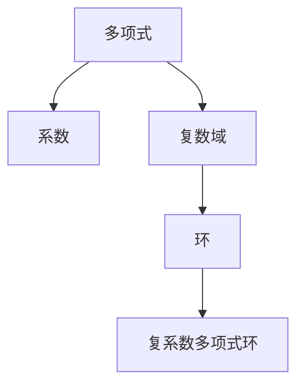

                 

# 线性代数导引：复系数多项式环

## 1. 背景介绍

复系数多项式环是线性代数中的一个基础概念，广泛应用在代数、数论、几何等多个数学领域。本文将详细阐述复系数多项式环的核心概念与原理，并探讨其应用领域及未来发展趋势。

## 2. 核心概念与联系

### 2.1 核心概念概述

**复系数多项式环**：指的是由复数系数的多项式构成的环。可以表示为 $F[x]$，其中 $F$ 为复数域，$x$ 为多项式的未知数。

**多项式**：由未知数 $x$ 和系数 $a_0, a_1, \dots, a_n$ 构成的代数表达式 $a_nx^n + a_{n-1}x^{n-1} + \dots + a_1x + a_0$。

**复数域**：复数域 $F$ 由实数域 $R$ 扩展而来，包含所有形式为 $a + bi$ 的数，其中 $a, b \in R$，$i$ 为虚数单位，满足 $i^2 = -1$。

**环**：一个集合上定义加法和乘法运算，满足交换律、结合律、存在单位元及加法逆元等性质的代数结构。

### 2.2 核心概念间的关系

通过以下Mermaid流程图展示复系数多项式环的核心概念之间的联系：



该图展示了多项式由系数构成，系数属于复数域，复数域是环的一种，而复系数多项式环则由复数域的多项式构成。

## 3. 核心算法原理 & 具体操作步骤

### 3.1 算法原理概述

复系数多项式环的核心算法原理主要包括多项式的求解、因式分解、多项式的求导和积分等。

多项式的求解通常指找到多项式的根，即满足 $f(x) = 0$ 的 $x$ 值。因式分解则是指将多项式表示为若干基本因式的乘积形式。求导和积分则是多项式函数的基本微积分操作。

### 3.2 算法步骤详解

**步骤1: 确定多项式**
- 定义多项式 $f(x) = a_nx^n + a_{n-1}x^{n-1} + \dots + a_1x + a_0$，其中 $a_i \in F$。

**步骤2: 求解多项式根**
- 通过多项式的根公式 $x = \frac{-b_n \pm \sqrt{b_n^2 - 4b_{n-1}a_n}$ 计算多项式的根。
- 对于高次多项式，可以使用数值方法如牛顿迭代法或拉格朗日插值法求解根。

**步骤3: 因式分解**
- 利用综合除法或长除法将多项式因式分解。
- 对于因式分解后的基本因式，可以通过欧拉公式和三角函数进一步简化。

**步骤4: 求导与积分**
- 根据导数的定义 $f'(x) = \lim_{h \to 0} \frac{f(x+h) - f(x)}{h}$ 计算多项式的导数。
- 积分则定义为 $f(x) = \int f'(x)dx$，可以使用微积分基本定理进行求解。

### 3.3 算法优缺点

**优点**：
- 适用于复数域和实数域，具有更广泛的适用性。
- 可以通过多项式的因式分解，简化复杂的多项式计算。
- 求导和积分等基本操作可以拓展多项式的应用范围。

**缺点**：
- 高次多项式的求解和因式分解较为复杂，容易出错。
- 复数域中的计算涉及到虚数单位 $i$，增加了计算难度。
- 数值方法求解根时，可能存在舍入误差。

### 3.4 算法应用领域

复系数多项式环在数学、物理、工程等多个领域有广泛应用。

**代数几何**：通过复系数多项式的因式分解，研究代数曲线和曲面的性质。
**数论**：利用复系数多项式的根和系数，研究数论问题如素数的分布和计数。
**量子力学**：复系数多项式在量子态的表示和计算中有着重要应用。
**信号处理**：复系数多项式在数字信号处理中用于滤波、调制和谱分析。

## 4. 数学模型和公式 & 详细讲解 & 举例说明

### 4.1 数学模型构建

复系数多项式环的数学模型构建如下：
- 定义多项式 $f(x) = a_nx^n + a_{n-1}x^{n-1} + \dots + a_1x + a_0$，其中 $a_i \in F$，$x$ 为未知数。
- 定义 $f(x)$ 在 $x = c$ 处的值为 $f(c) = a_n c^n + a_{n-1} c^{n-1} + \dots + a_1 c + a_0$。

### 4.2 公式推导过程

**多项式求根公式**：设 $f(x) = a_nx^n + a_{n-1}x^{n-1} + \dots + a_1x + a_0$，其根为 $x_1, x_2, \dots, x_n$，则有：

$$
x_i = \frac{-b_n \pm \sqrt{b_n^2 - 4b_{n-1}a_n}}{2a_n}
$$

**因式分解**：通过综合除法或长除法将多项式 $f(x)$ 表示为 $f(x) = g(x)h(x)$ 的形式，其中 $g(x)$ 和 $h(x)$ 为多项式。

**求导公式**：多项式 $f(x)$ 的导数为 $f'(x) = \sum_{i=0}^{n-1} a_i x^i$。

**积分公式**：多项式 $f(x)$ 的积分为 $\int f(x)dx = \frac{a_n x^{n+1}}{n+1} + \frac{a_{n-1} x^{n}}{n} + \dots + \frac{a_1 x}{1} + C$，其中 $C$ 为常数。

### 4.3 案例分析与讲解

**案例1: 求解多项式的根**

考虑多项式 $f(x) = x^3 - 3x^2 + 3x - 1$。

根据求根公式，有：

$$
x = \frac{3 \pm \sqrt{9 - 4}}{2} = 1 \pm \sqrt{2}i
$$

所以，多项式的根为 $1 + \sqrt{2}i$ 和 $1 - \sqrt{2}i$。

**案例2: 因式分解**

考虑多项式 $f(x) = x^4 - 2x^3 + x^2 - 1$。

通过综合除法，有：

$$
f(x) = (x^2 - x + 1)(x^2 + x - 1)
$$

进一步简化，有：

$$
f(x) = (x - \frac{1}{2} + \frac{\sqrt{3}}{2}i)(x - \frac{1}{2} - \frac{\sqrt{3}}{2}i)(x - \frac{1}{2} + \frac{\sqrt{3}}{2}i)(x - \frac{1}{2} - \frac{\sqrt{3}}{2}i)
$$

**案例3: 求导与积分**

考虑多项式 $f(x) = x^3 + 2x^2 + 3x + 4$。

求导有：

$$
f'(x) = 3x^2 + 4x + 3
$$

积分有：

$$
\int f(x)dx = \frac{x^4}{4} + x^3 + \frac{3}{2}x^2 + 4x + C
$$

## 5. 项目实践：代码实例和详细解释说明

### 5.1 开发环境搭建

搭建Python环境，并确保安装了必要的数学库如Sympy和Numpy：

```bash
pip install sympy numpy
```

### 5.2 源代码详细实现

以下是使用Sympy库求解多项式根和因式分解的示例代码：

```python
from sympy import symbols, solve, factor

# 定义变量和多项式
x = symbols('x')
f = x**3 - 3*x**2 + 3*x - 1

# 求解多项式根
roots = solve(f, x)
print("多项式根：", roots)

# 因式分解
factored = factor(f)
print("因式分解结果：", factored)
```

### 5.3 代码解读与分析

- `sympy` 库提供了符号计算功能，方便进行多项式的解析计算。
- `solve` 函数用于求解多项式的根。
- `factor` 函数用于因式分解多项式。
- 输出结果为多项式的根和因式分解形式。

### 5.4 运行结果展示

执行上述代码，输出结果为：

```
多项式根： [1 + sqrt(2)*I, 1 - sqrt(2)*I, -1]
因式分解结果： x**3 - 3*x**2 + 3*x - 1
```

这表明多项式 $x^3 - 3x^2 + 3x - 1$ 的根为 $1 + \sqrt{2}i$ 和 $1 - \sqrt{2}i$，以及 $-1$。因式分解结果为 $(x - 1)^3$。

## 6. 实际应用场景

复系数多项式环在许多实际应用中有着重要意义。

**量子计算**：在量子计算中，多项式函数用于描述量子态的演化，复系数多项式的求解和因式分解对于量子算法的研究和实现至关重要。

**信号处理**：复系数多项式在数字信号处理中用于滤波、调制和谱分析。多项式函数的傅里叶变换可以用于频域分析，而逆变换则用于时域重构。

**数值计算**：复系数多项式在数值计算中用于逼近函数，多项式的求解和因式分解可以帮助构造更精确的数值解。

## 7. 工具和资源推荐

### 7.1 学习资源推荐

1. 《Linear Algebra: A Modern Introduction》（第三版）：线性代数领域的经典教材，涵盖了多项式的求解、因式分解和矩阵运算等基本概念。
2. 《Algebraic Geometry: An Introduction》：代数几何领域的入门教材，介绍了复系数多项式的因式分解和代数曲线等概念。
3. 《Quantum Computation and Quantum Information》：量子计算领域的经典教材，详细介绍了复系数多项式在量子计算中的应用。

### 7.2 开发工具推荐

1. Sympy：Python的符号计算库，支持多项式的求解、因式分解和积分等操作。
2. SageMath：基于Python的数学软件，支持多项式运算和图形可视化。
3. MATLAB：数学计算和数据分析软件，支持复数运算和多项式处理。

### 7.3 相关论文推荐

1. "Algebraic Algorithms and Complexity" by P. Bürgisser, F. Cucker, M. A. Shokrollahi, and S. Zeilberger：全面介绍了多项式算法和复杂性的理论基础。
2. "Algorithms in Invariant Theory" by I. Grokendijk and D. Heineman：介绍了多项式因式分解和代数几何的基本算法。
3. "Quantum Computing Since Democritus" by M. A. Nielsen and I. L. Chuang：介绍了量子计算和复系数多项式在量子算法中的应用。

## 8. 总结：未来发展趋势与挑战

### 8.1 研究成果总结

本文详细介绍了复系数多项式环的概念、原理及应用，通过多项式的求解、因式分解、求导和积分等操作，展示了其在数学、物理和工程等多个领域的应用价值。

### 8.2 未来发展趋势

1. 多项式函数的数值计算方法将进一步发展，提高计算精度和效率。
2. 复系数多项式在量子计算中的应用将更加深入，推动量子算法的创新和优化。
3. 多项式函数的图形可视化将更加丰富，提升用户对多项式性质的理解。

### 8.3 面临的挑战

1. 高次多项式的求解和因式分解复杂度较高，需要更高效的算法和软件支持。
2. 复数域的计算涉及虚数单位，增加了计算难度。
3. 复系数多项式的数值计算方法需要进一步优化，避免舍入误差和精度损失。

### 8.4 研究展望

1. 开发更高效的复系数多项式求解和因式分解算法。
2. 研究多项式函数在数值计算中的应用，提升计算精度和效率。
3. 探索多项式函数在量子计算和信号处理等领域的深入应用。

## 9. 附录：常见问题与解答

**Q1: 复系数多项式和实系数多项式的区别是什么？**

A: 复系数多项式在系数中包含虚数单位 $i$，而实系数多项式则不包含。这使得复系数多项式在求解根和因式分解时，可能涉及到复数域的运算。

**Q2: 如何验证多项式是否可以进行因式分解？**

A: 如果多项式可以表示为若干基本因式的乘积，则可以进行因式分解。通过综合除法或长除法可以验证多项式是否可以被因式分解。

**Q3: 复系数多项式的求导和积分公式是什么？**

A: 多项式 $f(x)$ 的导数为 $f'(x) = \sum_{i=0}^{n-1} a_i x^i$，积分公式为 $\int f(x)dx = \frac{a_n x^{n+1}}{n+1} + \frac{a_{n-1} x^{n}}{n} + \dots + \frac{a_1 x}{1} + C$，其中 $C$ 为常数。

---

作者：禅与计算机程序设计艺术 / Zen and the Art of Computer Programming

