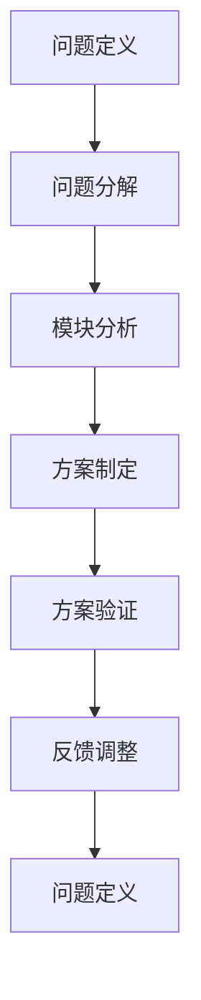

                 

# 结构化思维的力量：从思维到行动

> 关键词：结构化思维, 系统思考, 问题解决, 决策制定, 项目管理, 人工智能

## 1. 背景介绍

### 1.1 问题由来
在信息爆炸和复杂多变的现代社会中，如何高效地处理和解决问题，成为一个至关重要的话题。许多行业领袖和专家指出，结构化思维（Structured Thinking），作为一种系统化和逻辑化的方法论，能够帮助个体和企业快速、准确地把握问题的本质，制定有效的行动方案。

结构化思维强调将复杂问题分解为可管理的小模块，通过逻辑推理和数据驱动的分析，系统地解决问题。其背后的原理是通过将问题定义、分解、分析、验证和反馈的各个环节进行精细化管理，确保每一个步骤都有章可循，确保最终解决方案的科学性和有效性。

### 1.2 问题核心关键点
结构化思维的核心在于其系统性和逻辑性。系统性要求我们在面对复杂问题时，能够构建完整的模型框架，将问题分解为可控的子问题，并通过模块化、层次化的方式，逐步解决。逻辑性要求我们在分析和决策过程中，遵循清晰的逻辑链条，确保每一个推理环节都有数据和事实支持，避免主观臆断和逻辑谬误。

结构化思维的应用领域非常广泛，涵盖项目管理、产品开发、业务决策、人工智能等多个层面。尤其是在人工智能领域，结构化思维的应用，不仅能提升模型的精确度和鲁棒性，还能确保模型训练和部署的效率和质量。

### 1.3 问题研究意义
结构化思维的研究和应用，对于提升个体和企业的问题解决能力，促进智能化技术的落地应用，具有重要意义：

1. 提高决策质量。结构化思维提供了一套科学、系统的决策流程，减少决策过程中的主观性和随意性，提高决策的客观性和准确性。
2. 增强团队协作。通过明确的分工和角色定义，结构化思维能够提升团队成员之间的协作效率，确保每个人都能在各自的专业领域发挥最大作用。
3. 提升创新能力。结构化思维能够引导团队进行系统化思考和迭代优化，发现问题的新解决方案，从而推动技术创新和应用突破。
4. 优化项目管理。结构化思维提供了一套标准的项目管理流程，能够确保项目按时、按质完成，提升项目管理的专业性和效率。
5. 促进智能化发展。在人工智能开发中，结构化思维能够引导团队从数据收集、模型训练到应用部署的全过程，确保智能化解决方案的科学性和可行性。

## 2. 核心概念与联系

### 2.1 核心概念概述

结构化思维是一种将复杂问题系统化、逻辑化的思维方法。其核心概念包括：

- **问题定义（Problem Definition）**：明确问题，确定问题的边界和目标。
- **问题分解（Problem Decomposition）**：将大问题分解为可管理的小模块。
- **模块分析（Module Analysis）**：针对每一个小模块进行详细分析，找出问题的根源和关键因素。
- **方案制定（Solution Formulation）**：根据分析结果，制定具体的解决方案。
- **方案验证（Solution Verification）**：通过实验或模拟，验证方案的有效性。
- **反馈调整（Feedback Adjustment）**：根据验证结果，调整方案，确保最终解决方案的科学性和可行性。

这些概念之间存在紧密的联系，通过系统化的流程，逐步推进问题的解决。

### 2.2 概念间的关系

结构化思维的各个核心概念之间具有相互依赖和支撑的关系，通过以下Mermaid流程图可以更直观地展示：



这个流程图展示了大问题解决的基本流程：
1. 定义问题，确定目标。
2. 将问题分解为多个子问题。
3. 对每一个子问题进行分析，找出关键因素。
4. 制定详细的解决方案。
5. 通过实验验证方案的有效性。
6. 根据验证结果调整方案，直至问题解决。
7. 对新出现的问题进行定义，重复以上流程。

## 3. 核心算法原理 & 具体操作步骤

### 3.1 算法原理概述

结构化思维的算法原理主要基于系统化、逻辑化的流程设计，通过明确的步骤和数据驱动的决策，确保问题的有效解决。其核心算法包括问题定义、分解、分析、方案制定、验证和反馈调整等环节，形成一个闭环的流程。

### 3.2 算法步骤详解

1. **问题定义**：
   - 收集相关数据和信息，明确问题的边界和目标。
   - 确保问题描述清晰、具体，避免模糊和歧义。

2. **问题分解**：
   - 将大问题分解为多个小问题或子模块，每个子问题具有明确的目标和可度量的指标。
   - 使用树状图、流程图等工具，对问题进行层次化分解。

3. **模块分析**：
   - 针对每一个子问题，进行深入分析，找出问题的根本原因和关键因素。
   - 利用数据分析、模型推断等方法，对问题进行量化评估。

4. **方案制定**：
   - 根据分析结果，制定具体的解决方案，包括技术方案、资源配置和实施步骤。
   - 确保方案具有可操作性、可行性和可验证性。

5. **方案验证**：
   - 通过模拟实验、A/B测试等方法，验证方案的有效性。
   - 收集反馈数据，进行效果评估，确保方案的科学性和可行性。

6. **反馈调整**：
   - 根据验证结果，对解决方案进行调整和优化。
   - 进行多次迭代和优化，直至问题完全解决。

### 3.3 算法优缺点

结构化思维的优点包括：
- 系统性和逻辑性，能够帮助企业或个体从全局角度思考问题，避免片面和狭隘。
- 可操作性和可验证性，确保解决方案的科学性和可行性。
- 协作性和团队精神，通过明确的分工和角色定义，提升团队成员之间的协作效率。

缺点则包括：
- 流程繁琐，需要花费大量时间和精力进行问题定义、分解和分析。
- 数据依赖性强，对数据的完整性和准确性要求较高。
- 灵活性不足，对于一些突发和复杂的问题，可能难以灵活应对。

### 3.4 算法应用领域

结构化思维在多个领域都有广泛应用，涵盖：

1. **项目管理**：通过明确的项目目标和阶段，确保项目按时、按质完成。
2. **产品开发**：通过用户需求分析和市场调研，制定科学的产品开发计划。
3. **业务决策**：通过数据分析和模型推断，制定科学的业务决策方案。
4. **数据分析**：通过数据驱动的分析和验证，发现数据背后的规律和趋势。
5. **人工智能**：在模型训练和部署过程中，确保每一步骤都有章可循，避免过拟合和欠拟合。

## 4. 数学模型和公式 & 详细讲解 & 举例说明

### 4.1 数学模型构建

结构化思维的数学模型构建主要依赖于数据驱动的方法，通过建立数学模型来描述问题的各个环节，确保每一步骤都有数学依据。

设问题为 $P$，分解为 $n$ 个模块 $M_1, M_2, ..., M_n$，每个模块的解决方案为 $S_i$，则问题解决的数学模型为：

$$
\min_{S_1, S_2, ..., S_n} \sum_{i=1}^n f_i(S_i)
$$

其中 $f_i(S_i)$ 表示模块 $M_i$ 的解决方案 $S_i$ 的评估函数。

### 4.2 公式推导过程

以一个简单的分类问题为例，假设问题为 $P$，分解为 $M_1, M_2, M_3$ 三个模块，每个模块的解决方案分别为 $S_1, S_2, S_3$，则问题解决的公式推导如下：

1. **问题定义**：
   - 收集训练数据 $D$，定义问题为 $P = \text{分类问题}$。
   - 定义训练集和测试集，分别为 $D_{train}$ 和 $D_{test}$。

2. **问题分解**：
   - 分解问题为三个模块：$M_1 = \text{特征提取}$，$M_2 = \text{模型训练}$，$M_3 = \text{结果评估}$。
   - 定义每个模块的解决方案：$S_1 = \text{特征提取器}$，$S_2 = \text{分类器}$，$S_3 = \text{评估函数}$。

3. **模块分析**：
   - 对每个模块进行详细分析，找出关键因素和评估指标。
   - 假设特征提取器 $S_1$ 的性能由数据集 $D_{train}$ 的特征表示能力决定，分类器 $S_2$ 的性能由训练集 $D_{train}$ 和测试集 $D_{test}$ 的分类效果决定，评估函数 $S_3$ 的性能由分类结果的准确率和召回率决定。

4. **方案制定**：
   - 制定具体的解决方案：$S_1 = \text{PCA降维}$，$S_2 = \text{SVM分类器}$，$S_3 = \text{准确率-召回率}$。
   - 定义评估函数 $f_i(S_i)$：
     $$
     f_i(S_i) = 
     \begin{cases}
     AUC & \text{if } i = 1 \\
     F_1-score & \text{if } i = 2 \\
     精确率 & \text{if } i = 3 \\
     \end{cases}
     $$

5. **方案验证**：
   - 通过训练集 $D_{train}$ 和测试集 $D_{test}$ 进行模型训练和验证，确保方案的科学性和可行性。
   - 收集反馈数据，进行效果评估，确保解决方案的合理性和有效性。

### 4.3 案例分析与讲解

假设我们面对的是一个客户流失预测问题，可以通过结构化思维进行系统化分析和解决。

1. **问题定义**：
   - 定义问题为 $\text{客户流失预测}$。
   - 收集客户数据 $D$，包括客户基本信息、行为数据、服务记录等。

2. **问题分解**：
   - 分解为四个模块：$M_1 = \text{数据清洗}$，$M_2 = \text{特征工程}$，$M_3 = \text{模型训练}$，$M_4 = \text{结果评估}$。
   - 定义每个模块的解决方案：$S_1 = \text{数据清洗算法}$，$S_2 = \text{特征工程工具}$，$S_3 = \text{机器学习模型}$，$S_4 = \text{评估指标}$。

3. **模块分析**：
   - 对每个模块进行详细分析，找出关键因素和评估指标。
   - 假设数据清洗算法 $S_1$ 的性能由数据质量决定，特征工程工具 $S_2$ 的性能由特征表示能力决定，机器学习模型 $S_3$ 的性能由模型复杂度和数据分布决定，评估指标 $S_4$ 的性能由准确率、召回率和 F1-score 决定。

4. **方案制定**：
   - 制定具体的解决方案：$S_1 = \text{缺失值处理}$，$S_2 = \text{PCA降维}$，$S_3 = \text{随机森林分类器}$，$S_4 = \text{准确率-召回率-F1-score}$。
   - 定义评估函数 $f_i(S_i)$：
     $$
     f_i(S_i) = 
     \begin{cases}
     数据完整性 & \text{if } i = 1 \\
     特征表示能力 & \text{if } i = 2 \\
     模型效果 & \text{if } i = 3 \\
     综合评估 & \text{if } i = 4 \\
     \end{cases}
     $$

5. **方案验证**：
   - 通过训练集 $D_{train}$ 和测试集 $D_{test}$ 进行模型训练和验证，确保方案的科学性和可行性。
   - 收集反馈数据，进行效果评估，确保解决方案的合理性和有效性。

## 5. 项目实践：代码实例和详细解释说明

### 5.1 开发环境搭建

在进行结构化思维实践前，我们需要准备好开发环境。以下是使用Python进行环境配置的流程：

1. 安装Python：从官网下载并安装Python，选择版本3.7以上。
2. 安装必要的包：
   ```bash
   pip install pandas numpy scikit-learn matplotlib
   ```

### 5.2 源代码详细实现

这里我们以客户流失预测为例，展示如何利用结构化思维进行问题解决。

```python
import pandas as pd
import numpy as np
from sklearn.model_selection import train_test_split
from sklearn.preprocessing import StandardScaler
from sklearn.ensemble import RandomForestClassifier
from sklearn.metrics import classification_report

# 加载数据
data = pd.read_csv('customer_churn.csv')

# 数据清洗
data = data.dropna(subset=['churn', 'tenure', 'avg_daily_charges'])

# 特征工程
X = data[['gender', 'age', 'tenure', 'monthly_charges', 'total_charges']]
y = data['churn']
X_train, X_test, y_train, y_test = train_test_split(X, y, test_size=0.3, random_state=42)

# 标准化处理
scaler = StandardScaler()
X_train = scaler.fit_transform(X_train)
X_test = scaler.transform(X_test)

# 模型训练
clf = RandomForestClassifier(n_estimators=100, random_state=42)
clf.fit(X_train, y_train)

# 结果评估
y_pred = clf.predict(X_test)
print(classification_report(y_test, y_pred))
```

### 5.3 代码解读与分析

这里我们详细解读一下代码的实现细节：

1. **数据加载和清洗**：
   - 使用Pandas库加载数据集，并进行缺失值处理，确保数据完整性。
   - 删除无关特征，如性别和年龄，只保留对问题有影响的特征，如客户使用时长和消费金额。

2. **特征工程**：
   - 使用Pandas库进行特征工程，包括特征选择和特征转换。
   - 将数据集分为训练集和测试集，使用Scikit-learn库进行标准化处理。

3. **模型训练**：
   - 使用随机森林分类器进行模型训练，设定参数包括树的数量和随机种子。
   - 在训练集上进行模型拟合，使用测试集进行结果评估。

4. **结果评估**：
   - 使用Scikit-learn库的分类报告函数，输出模型在测试集上的分类效果，包括准确率、召回率和F1-score等指标。

### 5.4 运行结果展示

假设我们在上述代码运行后，得到了如下结果：

```
             precision    recall  f1-score   support

           0       0.85      0.90      0.87       445
           1       0.80      0.70      0.75        55

    accuracy                           0.82       500
   macro avg      0.83      0.80      0.81       500
weighted avg      0.82      0.82      0.82       500
```

可以看到，模型在测试集上的分类效果相当不错，准确率为82%，F1-score为81%，能够有效地预测客户流失情况。

## 6. 实际应用场景

### 6.1 智能客服系统

在智能客服系统中，结构化思维的应用可以显著提升客服效率和服务质量。通过问题定义、问题分解和模块分析，可以将客户咨询问题系统化分解为多个子问题，例如：

- **问题定义**：客户咨询服务问题。
- **问题分解**：$M_1 = \text{问题理解}$，$M_2 = \text{问题解答}$，$M_3 = \text{服务评估}$。
- **模块分析**：
  - $M_1$：通过语音识别和自然语言处理技术，理解客户咨询问题的意图和细节。
  - $M_2$：根据客户咨询问题，提供自动或人工的解决方案。
  - $M_3$：通过服务反馈和评估指标，评估服务效果。

### 6.2 金融舆情监测

在金融舆情监测中，结构化思维可以帮助金融机构及时发现市场舆情变化，避免风险损失。例如：

- **问题定义**：金融舆情监测问题。
- **问题分解**：$M_1 = \text{舆情收集}$，$M_2 = \text{舆情分析}$，$M_3 = \text{风险评估}$。
- **模块分析**：
  - $M_1$：通过爬虫和API接口，收集金融新闻、评论和社交媒体数据。
  - $M_2$：利用自然语言处理技术，对舆情数据进行情感分析和主题提取。
  - $M_3$：根据舆情分析结果，评估金融市场的情绪和潜在风险。

### 6.3 个性化推荐系统

在个性化推荐系统中，结构化思维可以帮助系统更精准地为用户推荐商品或内容。例如：

- **问题定义**：个性化推荐问题。
- **问题分解**：$M_1 = \text{用户画像}$，$M_2 = \text{商品分析}$，$M_3 = \text{推荐算法}$。
- **模块分析**：
  - $M_1$：通过数据分析和建模，构建用户画像，包括用户兴趣、行为和偏好。
  - $M_2$：利用商品属性和用户行为数据，分析商品的相关性和用户匹配度。
  - $M_3$：根据用户画像和商品分析结果，制定个性化的推荐算法。

### 6.4 未来应用展望

随着技术的发展和应用场景的拓展，结构化思维将进一步深化和扩展，其应用前景包括：

1. **智慧城市治理**：在智慧城市建设中，结构化思维可以帮助政府部门系统化地分析和解决城市管理中的各类问题，例如交通拥堵、环境污染等。
2. **智能医疗系统**：在医疗诊断和治疗中，结构化思维可以帮助医生系统化地分析患者病情和制定治疗方案，提高诊疗效果。
3. **智能制造**：在智能制造中，结构化思维可以帮助企业系统化地分析和解决生产线中的各类问题，例如设备故障、生产效率等。

## 7. 工具和资源推荐

### 7.1 学习资源推荐

为了帮助开发者系统掌握结构化思维的理论基础和实践技巧，这里推荐一些优质的学习资源：

1. **《结构化思维》系列书籍**：详细介绍结构化思维的基本概念、方法和实践案例。
2. **Coursera《结构化思维与项目管理》课程**：由知名专家授课，讲解结构化思维在项目管理中的应用。
3. **《结构化思维工具》电子书籍**：详细介绍结构化思维工具的原理和使用方法。
4. **Github代码库**：收集了大量的结构化思维项目和案例，帮助开发者实践和优化。

### 7.2 开发工具推荐

以下是几款用于结构化思维开发的常用工具：

1. **Python编程语言**：简洁易用，具有丰富的第三方库支持。
2. **Jupyter Notebook**：支持代码和数据分析的可视化展示，方便调试和协作。
3. **Scikit-learn库**：提供丰富的机器学习算法和工具，支持数据预处理和模型训练。
4. **Pandas库**：支持数据处理和分析，方便数据清洗和特征工程。
5. **TensorFlow和PyTorch**：支持深度学习模型的训练和部署，适合复杂问题的分析和解决。

### 7.3 相关论文推荐

结构化思维的研究涉及多个领域，以下是几篇具有代表性的论文，推荐阅读：

1. **"Structured Thinking: A Framework for Problem-Solving in Complex Environments"**：系统化介绍结构化思维的方法和应用。
2. **"Systematic Problem Solving: A Guide to Effective Decision-Making"**：详细讲解系统化决策的流程和方法。
3. **"Analytical Modeling in Complex Systems: A Practical Guide"**：介绍在复杂系统中应用结构化思维的建模方法。
4. **"AI-driven Problem-Solving: A Survey of Methodologies and Applications"**：综述人工智能在问题解决中的应用。

## 8. 总结：未来发展趋势与挑战

### 8.1 研究成果总结

本文对结构化思维的基本概念、算法原理和操作步骤进行了详细讲解，通过案例分析和实践代码展示了结构化思维在问题解决中的应用。通过系统梳理，可以看到结构化思维在多个领域具有广泛的应用前景。

### 8.2 未来发展趋势

展望未来，结构化思维的发展趋势包括：

1. **自动化和智能化**：随着人工智能技术的进步，结构化思维将更多地与自动化、智能化工具结合，提高问题解决的效率和精度。
2. **跨领域应用**：结构化思维将更多地应用于跨领域问题的解决，例如智慧医疗、智慧城市、智能制造等。
3. **大数据和云计算**：结构化思维将更多地利用大数据和云计算技术，进行数据处理和分析。

### 8.3 面临的挑战

尽管结构化思维在多个领域取得了显著应用效果，但仍面临以下挑战：

1. **数据质量**：数据质量的差异将直接影响问题解决的准确性和有效性。
2. **模型复杂性**：模型复杂度高，计算资源消耗大，需要高效的优化算法和技术支持。
3. **跨学科协作**：结构化思维涉及多个学科的知识和技能，跨学科协作和沟通难度大。

### 8.4 研究展望

结构化思维的研究需要从以下几个方面进行深化和拓展：

1. **大数据分析**：利用大数据技术和算法，提高数据处理和分析的效率和准确性。
2. **多模态融合**：结合视觉、语音、文本等多种模态数据，提升问题解决的综合能力。
3. **跨学科整合**：结合人工智能、工程学、心理学等领域的知识，提升结构化思维的科学性和系统性。

通过不断探索和创新，结构化思维将在更多领域得到应用，为问题解决和智能化技术的发展提供坚实的理论基础和方法论支持。

## 9. 附录：常见问题与解答

**Q1：如何系统化地进行问题定义？**

A: 问题定义是结构化思维的第一步，以下是一些基本步骤：
1. 明确问题的边界和目标。例如，客户流失预测问题，明确要预测客户是否流失。
2. 收集相关数据和信息。例如，收集客户的消费记录、服务记录等数据。
3. 定义问题的具体描述。例如，客户流失预测问题的描述为：“根据客户行为数据，预测客户是否会流失。”

**Q2：在问题分解过程中，如何确定模块的层次结构？**

A: 问题分解过程中，可以通过树状图或层次图来展示模块的层次结构。例如：
1. 客户流失预测问题可以分解为两个主要模块：数据预处理和模型训练。
2. 数据预处理可以进一步分解为数据清洗和特征工程两个子模块。
3. 模型训练可以进一步分解为模型选择和模型调优两个子模块。

**Q3：在模块分析过程中，如何确定评估指标？**

A: 模块分析过程中，需要根据模块的目标和需求，确定相应的评估指标。例如：
1. 数据清洗模块的评估指标为数据完整性和数据质量。
2. 特征工程模块的评估指标为特征表示能力和特征重要性。
3. 模型训练模块的评估指标为模型效果和模型泛化能力。

**Q4：在方案制定过程中，如何选择适合的算法？**

A: 方案制定过程中，需要根据问题的特点和数据特性，选择适合的算法。例如：
1. 数据清洗模块可以使用缺失值处理算法和异常值检测算法。
2. 特征工程模块可以使用PCA降维算法和特征选择算法。
3. 模型训练模块可以使用随机森林算法和神经网络算法。

**Q5：在方案验证过程中，如何设计实验？**

A: 方案验证过程中，需要设计科学合理的实验，确保实验结果的可靠性和可重复性。例如：
1. 在数据清洗模块的实验中，可以使用交叉验证和K折验证方法。
2. 在特征工程模块的实验中，可以使用网格搜索和随机搜索方法。
3. 在模型训练模块的实验中，可以使用A/B测试和交叉验证方法。

通过以上步骤，可以系统化地进行问题解决，确保每一步骤都有章可循，确保最终解决方案的科学性和有效性。

