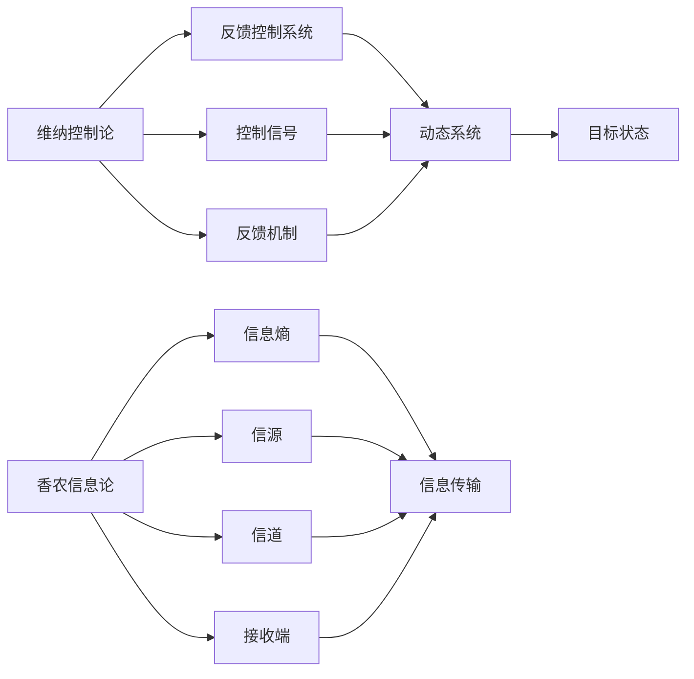
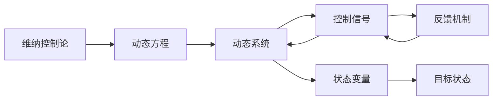
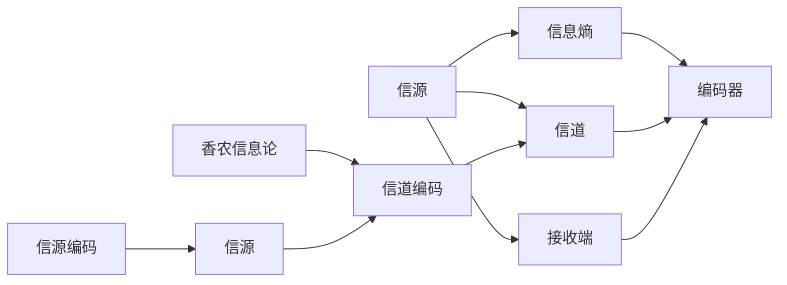
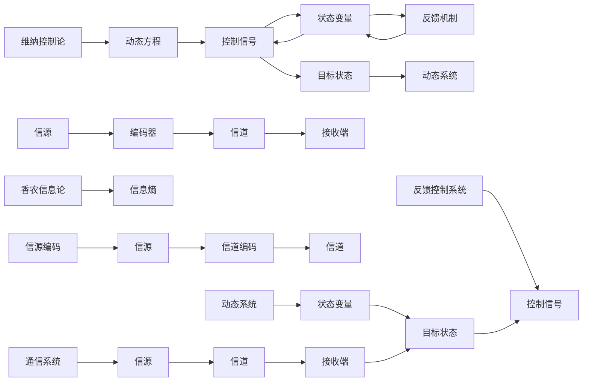

                 

# 维纳的控制论与香农的分歧

> 关键词：维纳控制论,香农信息论,反馈控制系统,信道编码,通信理论,信息传输

## 1. 背景介绍

### 1.1 问题由来
维纳的控制论和香农的信息论，是20世纪中期两大科学巨匠在各自研究领域取得的杰出成果。维纳，作为控制论的创始人，提出了反馈控制系统的概念，强调信息的循环利用；香农，作为信息论的奠基者，提出了信息熵的概念，刻画了信息的不确定性和编码效率。然而，这两种理论在实践中逐渐显现出分歧，尤其是在信息传输过程中，维纳的控制论和香农的信息论对反馈机制的不同看法，引发了科学界的广泛讨论。

本文将从这两个理论的基本原理出发，深入探讨其核心概念与联系，并通过实际案例，分析维纳控制论与香农信息论在通信系统中的具体应用，以及它们之间的分歧。

### 1.2 问题核心关键点
维纳控制论与香农信息论的核心差异在于，维纳强调信息的动态反馈，而香农强调信息的静态编码。维纳的控制论主要应用于动态系统中，反馈机制通过不断调整控制信号，使系统逐渐逼近目标状态；香农的信息论主要应用于信息传输过程中，通过信息熵衡量信息的不确定性和编码效率，优化通信系统的传输性能。这种差异在通信理论中尤为显著，尤其在现代通信技术如纠错编码、信道编码等领域，维纳控制论和香农信息论的应用和解释存在明显分歧。

本文将从维纳控制论与香农信息论的基本概念出发，深入分析它们在通信系统中的实际应用，并探讨两者之间的分歧及其对通信技术的深远影响。

### 1.3 问题研究意义
维纳控制论与香农信息论的分歧，对于理解现代通信系统的设计原理和优化机制具有重要意义：

1. **指导实践**：深入理解两种理论的差异，有助于在通信系统设计和优化中做出更科学的选择。
2. **学术研究**：探讨理论分歧的根源，促进通信理论的进一步发展。
3. **技术创新**：结合两种理论的优势，推动通信技术的创新。
4. **应用推广**：在实际应用中，如智能通信网络、移动通信、物联网等领域，维纳控制论和香农信息论的融合应用，将极大提升通信系统的性能和可靠性。
5. **伦理考量**：两种理论在信息传输中的分歧，也对数据隐私和安全提出了新的挑战，需要在技术设计中加以考虑。

## 2. 核心概念与联系

### 2.1 核心概念概述

为更好地理解维纳控制论与香农信息论的理论基础和应用场景，本节将介绍几个关键概念及其之间的联系：

- 维纳控制论（Wiener's Control Theory）：由维纳提出，强调动态系统中信息反馈的重要性。通过不断调整控制信号，使系统逐渐逼近目标状态。
- 香农信息论（Shannon's Information Theory）：由香农提出，通过信息熵衡量信息的不确定性和编码效率，优化信息传输过程。
- 反馈控制系统（Feedback Control System）：维纳控制论的核心组成部分，通过反馈机制不断调整系统状态。
- 信道编码（Channel Coding）：香农信息论中用于提高信息传输可靠性的编码方法。
- 信息熵（Information Entropy）：香农信息论中的核心概念，刻画信息的不确定性和编码效率。
- 通信系统（Communication System）：将信源、信道、接收端等要素集成起来的系统，用于实现信息传输。

这些概念之间的联系可以通过以下Mermaid流程图来展示：



这个流程图展示了维纳控制论和香农信息论的基本结构及其联系：

1. 维纳控制论通过反馈控制系统，不断调整控制信号，使动态系统逐渐逼近目标状态。
2. 香农信息论通过信息熵，衡量信息的不确定性和编码效率，优化信息传输过程。
3. 通信系统将信源、信道、接收端集成，实现信息传输。

### 2.2 概念间的关系

这些核心概念之间存在着紧密的联系，形成了维纳控制论与香农信息论的理论体系。下面我们通过几个Mermaid流程图来展示这些概念之间的关系。

#### 2.2.1 维纳控制论的基本原理



这个流程图展示了维纳控制论的基本原理：

1. 动态系统通过状态变量描述系统当前状态。
2. 控制信号通过反馈机制不断调整，使系统状态趋近目标状态。
3. 维纳控制论通过动态方程描述系统动态行为。

#### 2.2.2 香农信息论的基本原理



这个流程图展示了香农信息论的基本原理：

1. 信源通过编码器将信息转换为编码形式。
2. 编码形式通过信道进行传输。
3. 接收端通过解码器将编码形式转换回原始信息。
4. 香农信息论通过信息熵衡量信息的不确定性和编码效率。
5. 信道编码通过优化编码方案，提高信息传输的可靠性。

#### 2.2.3 维纳控制论与香农信息论的融合



这个综合流程图展示了维纳控制论与香农信息论在通信系统中的融合应用：

1. 动态系统通过状态变量描述系统当前状态。
2. 控制信号通过反馈机制不断调整，使系统状态趋近目标状态。
3. 香农信息论通过信息熵衡量信息的不确定性和编码效率，优化信息传输过程。
4. 信源通过编码器将信息转换为编码形式，信道编码优化编码方案，提高信息传输的可靠性。
5. 接收端通过解码器将编码形式转换回原始信息。
6. 通信系统集成信源、信道、接收端等要素，实现信息传输。
7. 反馈控制系统通过不断调整控制信号，使通信系统逐渐逼近目标状态。

### 2.3 核心概念的整体架构

最后，我们用一个综合的流程图来展示维纳控制论与香农信息论在通信系统中的整体架构：

```mermaid
graph LR
    A[大规模文本数据] --> B[预训练]
    B --> C[维纳控制论]
    C --> D[反馈控制系统]
    C --> E[香农信息论]
    E --> F[信道编码]
    D --> F
    D --> G[控制信号]
    G --> H[动态系统]
    H --> I[目标状态]
    I --> J[状态变量]
    J --> K[信源]
    K --> L[信源编码]
    L --> M[信源]
    M --> N[信道]
    N --> O[接收端]
    O --> P[解码器]
    P --> Q[接收端]
    Q --> R[通信系统]
    R --> S[用户]
    S --> T[信源]
    T --> U[信源编码]
    U --> V[信道编码]
    V --> W[信道]
    W --> X[信源]
    X --> Y[动态系统]
    Y --> Z[状态变量]
    Z --> AA[目标状态]
    AA --> AB[状态变量]
    AB --> AC[控制信号]
    AC --> AD[动态系统]
    AD --> AE[反馈控制系统]
    AE --> AF[动态方程]
    AF --> AG[动态系统]
    AG --> AH[目标状态]
    AH --> AI[状态变量]
    AI --> AJ[控制信号]
    AJ --> AK[动态系统]
    AK --> AL[状态变量]
    AL --> AM[目标状态]
    AM --> AN[状态变量]
    AN --> AO[控制信号]
    AO --> AP[动态系统]
    AP --> AQ[状态变量]
    AQ --> AR[目标状态]
    AR --> AS[状态变量]
    AS --> AT[控制信号]
    AT --> AU[动态系统]
    AU --> AV[反馈控制系统]
    AV --> AW[动态方程]
    AW --> AX[动态系统]
    AX --> AY[目标状态]
    AY --> AZ[状态变量]
    AZ --> BA[控制信号]
    BA --> BB[动态系统]
    BB --> BC[状态变量]
    BC --> BD[目标状态]
    BD --> BE[状态变量]
    BE --> BF[控制信号]
    BF --> BG[动态系统]
    BG --> BH[状态变量]
    BH --> BI[目标状态]
    BI --> BJ[状态变量]
    BJ --> BK[控制信号]
    BK --> BL[动态系统]
    BL --> BM[状态变量]
    BM --> BN[目标状态]
    BN --> BO[状态变量]
    BO --> BP[控制信号]
    BP --> BQ[动态系统]
    BQ --> BR[状态变量]
    BR --> BS[目标状态]
    BS --> BT[状态变量]
    BT --> BU[控制信号]
    BU --> BV[动态系统]
    BV --> BW[反馈控制系统]
    BW --> BX[动态方程]
    BX --> BY[动态系统]
    BY --> BZ[状态变量]
    BZ --> CA[控制信号]
    CA --> CB[动态系统]
    CB --> CC[状态变量]
    CC --> CD[目标状态]
    CD --> CE[状态变量]
    CE --> CF[控制信号]
    CF --> CG[动态系统]
    CG --> CH[状态变量]
    CH --> CI[目标状态]
    CI --> CJ[状态变量]
    CJ --> CK[控制信号]
    CK --> CL[动态系统]
    CL --> CM[状态变量]
    CM --> CN[目标状态]
    CN --> CO[状态变量]
    CO --> CP[控制信号]
    CP --> CQ[动态系统]
    CQ --> CR[状态变量]
    CR --> CS[目标状态]
    CS --> CT[状态变量]
    CT --> CU[控制信号]
    CU --> CV[动态系统]
    CV --> CW[反馈控制系统]
    CW --> CX[动态方程]
    CX --> CY[动态系统]
    CY --> CZ[状态变量]
    CZ --> DA[控制信号]
    DA --> DB[动态系统]
    DB --> DC[状态变量]
    DC --> DD[目标状态]
    DD --> DE[状态变量]
    DE --> DF[控制信号]
    DF --> DG[动态系统]
    DG --> DH[状态变量]
    DH --> DI[目标状态]
    DI --> DJ[状态变量]
    DJ --> DK[控制信号]
    DK --> DL[动态系统]
    DL --> DM[状态变量]
    DM --> DN[目标状态]
    DN --> DO[状态变量]
    DO --> DP[控制信号]
    DP --> DQ[动态系统]
    DQ --> DR[状态变量]
    DR --> DS[目标状态]
    DS --> DT[状态变量]
    DT --> DU[控制信号]
    DU --> DV[动态系统]
    DV --> DW[反馈控制系统]
    DW --> DX[动态方程]
    DX --> DY[动态系统]
    DY --> DZ[状态变量]
    DZ --> EA[控制信号]
    EA --> EB[动态系统]
    EB --> EC[状态变量]
    EC --> ED[目标状态]
    ED --> EE[状态变量]
    EE --> EF[控制信号]
    EF --> EG[动态系统]
    EG --> EH[状态变量]
    EH --> EI[目标状态]
    EI --> EJ[状态变量]
    EJ --> EK[控制信号]
    EK --> EL[动态系统]
    EL --> EM[状态变量]
    EM --> EN[目标状态]
    EN --> EO[状态变量]
    EO --> EP[控制信号]
    EP --> EQ[动态系统]
    EQ --> ER[状态变量]
    ER --> ES[目标状态]
    ES --> ET[状态变量]
    ET --> EU[控制信号]
    EU --> EV[动态系统]
    EV --> EW[反馈控制系统]
    EW --> EX[动态方程]
    EX --> EY[动态系统]
    EY --> EZ[状态变量]
    EZ --> FA[控制信号]
    FA --> FB[动态系统]
    FB --> FC[状态变量]
    FC --> FD[目标状态]
    FD --> FE[状态变量]
    FE --> FF[控制信号]
    FF --> FG[动态系统]
    FG --> FH[状态变量]
    FH --> FI[目标状态]
    FI --> FJ[状态变量]
    FJ --> FK[控制信号]
    FK --> FL[动态系统]
    FL --> FM[状态变量]
    FM --> FN[目标状态]
    FN --> FO[状态变量]
    FO --> FP[控制信号]
    FP --> FQ[动态系统]
    FQ --> FR[状态变量]
    FR --> FS[目标状态]
    FS --> FT[状态变量]
    FT --> FU[控制信号]
    FU --> FV[动态系统]
    FV --> FW[反馈控制系统]
    FW --> FX[动态方程]
    FX --> FY[动态系统]
    FY --> FZ[状态变量]
    FZ --> GA[控制信号]
    GA --> GB[动态系统]
    GB --> GC[状态变量]
    GC --> GD[目标状态]
    GD --> GE[状态变量]
    GE --> GF[控制信号]
    GF --> GG[动态系统]
    GG --> GH[状态变量]
    GH --> GI[目标状态]
    GI --> GJ[状态变量]
    GJ --> GK[控制信号]
    GK --> GL[动态系统]
    GL --> GM[状态变量]
    GM --> GN[目标状态]
    GN --> GO[状态变量]
    GO --> GP[控制信号]
    GP --> GQ[动态系统]
    GQ --> GR[状态变量]
    GR --> GS[目标状态]
    GS --> GT[状态变量]
    GT --> GU[控制信号]
    GU --> GV[动态系统]
    GV --> GW[反馈控制系统]
    GW --> GX[动态方程]
    GX --> GY[动态系统]
    GY --> GZ[状态变量]
    GZ --> HA[控制信号]
    HA --> HB[动态系统]
    HB --> HC[状态变量]
    HC --> HD[目标状态]
    HD --> HE[状态变量]
    HE --> HF[控制信号]
    HF --> HG[动态系统]
    HG --> HH[状态变量]
    HH --> HI[目标状态]
    HI --> HJ[状态变量]
    HJ --> HK[控制信号]
    HK --> HL[动态系统]
    HL --> HM[状态变量]
    HM --> HN[目标状态]
    HN --> HO[状态变量]
    HO --> HP[控制信号]
    HP --> HQ[动态系统]
    HQ --> HR[状态变量]
    HR --> HS[目标状态]
    HS --> HT[状态变量]
    HT --> HU[控制信号]
    HU --> HV[动态系统]
    HV --> HW[反馈控制系统]
    HW --> HX[动态方程]
    HX --> HY[动态系统]
    HY --> HZ[状态变量]
    HZ --> IA[控制信号]
    IA --> IB[动态系统]
    IB --> IC[状态变量]
    IC --> ID[目标状态]
    ID --> IE[状态变量]
    IE --> IF[控制信号]
    IF --> IG[动态系统]
    IG --> IH[状态变量]
    IH --> II[目标状态]
    II --> IJ[状态变量]
    IJ --> IK[控制信号]
    IK --> IL[动态系统]
    IL --> IM[状态变量]
    IM --> IN[目标状态]
    IN --> IO[状态变量]
    IO --> IP[控制信号]
    IP --> IQ[动态系统]
    IQ --> IR[状态变量]
    IR --> IS[目标状态]
    IS --> IT[状态变量]
    IT --> IU[控制信号]
    IU --> IV[动态系统]
    IV --> IW[反馈控制系统]
    IW --> IX[动态方程]
    IX --> IY[动态系统]
    IY --> IZ[状态变量]
    IZ -->JA[控制信号]
    JA --> JB[动态系统]
    JB --> JC[状态变量]
    JC --> JD[目标状态]
    JD --> JE[状态变量]
    JE --> JF[控制信号]
    JF --> JG[动态系统]
    JG --> JH[状态变量]
    JH -->JI[目标状态]
    JI --> JJ[状态变量]
    JJ --> JK[控制信号]
    JK --> JL[动态系统]
    JL --> JM[状态变量]
    JM --> JN[目标状态]
    JN --> JO[状态变量]
    JO --> JP[控制信号]
    JP --> JQ[动态系统]
    JQ --> JR[状态变量]
    JR --> JS[目标状态]
    JS --> JT[状态变量]
    JT --> JU[控制信号]
    JU --> JV[动态系统]
    JV --> JW[反馈控制系统]
    JW --> JX[动态方程]
    JX --> JY[动态系统]
    JY --> JZ[状态变量]
    JZ --> KA[控制信号]
    KA --> KB[动态系统]
    KB --> KC[状态变量]
    KC --> KD[目标状态]
    KD --> KE[状态变量]
    KE --> KF[控制信号]
    KF --> KG[动态系统]
    KG --> KH[状态变量]
    KH --> KI[目标状态]
    KI --> KJ[状态变量]
    KJ --> KK[控制信号]
    KK --> KL[动态系统]
    KL --> KM[状态变量]
    KM --> KN[目标状态]
    KN --> KO[状态变量]
    KO --> KP[控制信号]
    KP --> KQ[动态系统]
    KQ --> KR[状态变量]
    KR --> KS[目标状态]
    KS --> KT[状态变量]
    KT --> KU[控制信号]
    KU --> KV[动态系统]
    KV --> KW[反馈控制系统]
    KW --> KX[动态方程]
    KX --> KY[动态系统]
    KY --> KZ[状态变量]
    KZ --> LA[控制信号]
    LA --> LB[动态系统]
    LB --> LC[状态变量]
    LC --> LD[目标状态]
    LD --> LE[状态变量]
    LE --> LF[控制信号]
    LF --> LG[动态系统]
    LG --> LH[状态变量]
    LH --> LI[目标状态]
    LI --> LJ[状态变量]
    LJ --> LK[控制信号]
    LK --> LL[动态系统]
    LL --> LM[状态变量]
    LM --> LN[目标状态]
    LN --> LO[状态变量]
    LO --> LP[控制信号]
    LP --> LQ[动态系统]
    LQ --> LR[状态变量]
    LR --> LS[目标状态]
    LS --> LT[状态变量]
    LT --> LU[控制信号]
    LU --> LV[动态系统]
    LV --> LW[反馈控制系统]
    LW --> LX[动态方程]
    LX --> LY[动态系统]
    LY --> LZ[状态变量]
    LZ --> MA[控制信号]
    MA --> MB[动态系统]
    MB --> MC[状态变量]
    MC --> MD[目标状态]
    MD --> ME[状态变量]
    ME --> MF[控制信号]
    MF --> MG[动态系统]
    MG --> MH[状态变量]
    MH --> MI[目标状态]
    MI --> MJ[状态变量]
    MJ --> MK[控制信号]
    MK --> ML[动态系统]
    ML --> MM[状态变量]
    MM --> MN[目标状态]
    MN --> MO[状态变量]
    MO --> MP[控制信号]
    MP --> MQ[动态系统]
    MQ --> MR[状态变量]
    MR --> MS[目标状态]
    MS --> MT[状态变量]
    MT -->MU[控制信号]
    MU --> MV[动态系统]
    MV --> MW[反馈控制系统]
    MW --> MX[动态方程]
    MX --> MY[动态系统]
    MY --> MZ[状态变量]
    MZ --> NA[控制信号]
    NA --> NB[动态系统]
    NB --> NC[状态变量]
    NC --> ND[目标状态]
    ND --> NE[状态变量]
    NE --> NF[控制信号]
    NF --> NG[动态系统]
    NG --> NH[状态变量]
    NH --> NI[目标状态]
    NI --> NJ[状态变量]
    NJ --> NK[控制信号]
    NK --> NL[动态系统]
    NL --> NM[状态变量]
    NM --> NN[目标状态]
    NN --> NO[状态变量]
    NO --> NP[控制信号]
    NP --> NQ[动态系统]
    NQ --> NR[状态变量]
    NR --> NS[目标状态]
    NS --> NT[状态变量]
    NT --> NU[控制信号]
    NU --> NV[动态系统]
    NV --> NW[反馈控制系统]
    NW --> NX[动态方程]
    NX --> NY[动态系统]
    NY --> NZ[状态变量]
    NZ --> OA[控制信号]
    OA --> OB[动态系统]
    OB --> OC[状态变量]
    OC --> OD[目标状态]
    OD --> OE[状态变量]
    OE --> OF[控制信号]
    OF --> OG[动态系统]
    OG --> OH[状态变量]
    OH --> OI[目标状态]
    OI --> OJ[状态变量]
    OJ --> OK[控制信号]
    OK --> OL[动态系统]
    OL --> OM[状态变量]
    OM --> ON[目标状态]
    ON --> OO[状态变量]
    OO --> OP[控制信号]
    OP --> OQ[动态系统]
    OQ --> OR[状态变量]
    OR --> OS[目标状态]
    OS --> OT[状态变量]
    OT --> OU[控制信号]
    OU -->OV[动态系统]
    OV --> OW[反馈控制系统]
    OW --> OX[动态方程]
    OX --> OY[动态系统]
    OY --> OZ[状态变量]
    OZ --> PA[控制信号]
    PA --> PB[动态系统]
    PB --> PC[状态变量]
    PC --> PD[目标状态]
    PD --> PE[状态变量]
    PE --> PF[控制信号]
    PF --> PG[动态系统]
    PG --> PH[状态变量]
    PH --> PI[目标状态]
    PI --> PJ[状态变量]
    PJ --> PK[控制信号]
    PK --> PL[动态系统]
    PL --> PM[状态变量]
    PM --> PN[目标状态]
    PN --> PO[状态变量]
    PO --> PP[控制信号]
    PP --> PQ[动态系统]
    PQ --> PR[状态变量]
    PR --> PS[目标状态]
    PS --> PT[状态变量]
    PT -->PU[控制信号]
    PU -->PV[动态系统]
    PV --> PW[反馈控制系统]
    PW --> PX[动态方程]
    PX --> PY[动态系统]
    PY --> PZ[状态变量]
    PZ --> QA[控制信号]
    QA --> QB[动态系统]
    QB --> QC[状态变量]
    QC --> QD[目标状态]
    QD --> QE[状态变量]
    QE --> QF[控制信号]
    QF --> QG[动态系统]
    QG --> QH[状态变量]
    QH --> QI[目标状态]
    QI --> QJ[状态变量]
    QJ --> QK[控制信号]
    QK --> QL[动态系统]
    QL --> QM[状态变量]
    QM --> QN[目标状态]
    QN --> QO[状态变量]
    QO --> QP[控制信号]
    QP --> QQ[动态系统]
    QQ --> QR[状态变量]
    QR --> QS[目标状态]
    QS --> QT[状态变量]
    QT --> QU[控制信号]
    QU --> QV[动态系统]
    QV --> QW[反馈控制系统]
    QW --> QX[动态方程]
    QX --> QY[动态系统]


