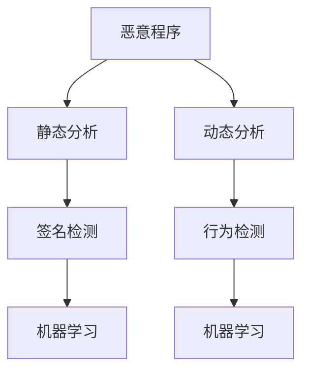
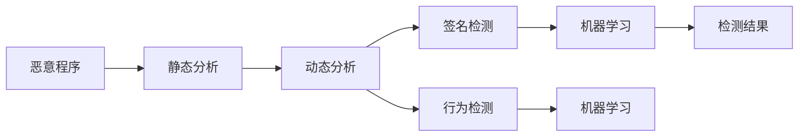
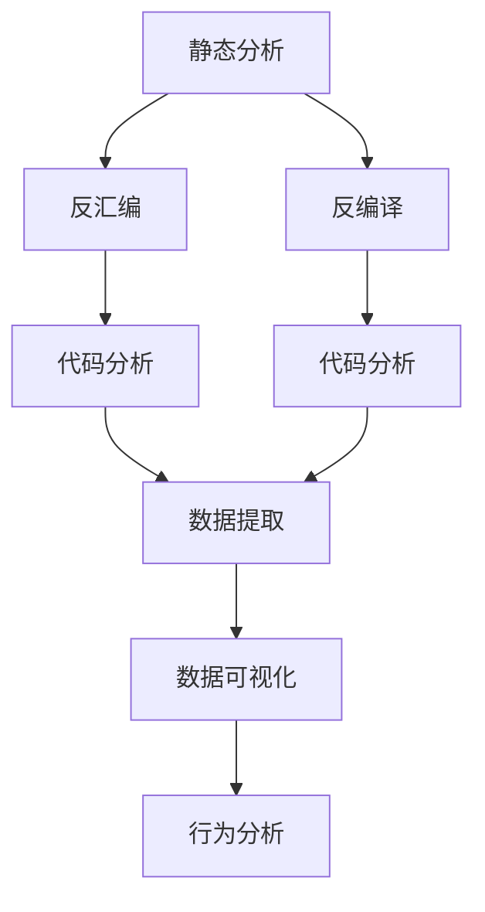

                 

# 网络安全中恶意程序的分析与检测

> 关键词：网络安全,恶意程序,数据分析,检测技术,反病毒软件

## 1. 背景介绍

### 1.1 问题由来
随着互联网和信息技术的普及，网络安全问题日益严重。恶意程序（malware）作为网络攻击的主要手段之一，已经严重威胁到个人和企业的网络安全。恶意程序可以窃取敏感信息、破坏数据完整性、甚至控制受感染设备进行进一步攻击。因此，如何有效地检测和分析恶意程序，已经成为网络安全领域的重要研究方向。

### 1.2 问题核心关键点
网络安全中的恶意程序分析与检测，主要涉及以下几个关键点：
- 数据采集：收集恶意程序样本，提取特征。
- 特征提取：对样本进行特征提取，形成可分析的数据集。
- 检测模型：建立检测模型，识别恶意程序。
- 分析技术：对已识别出的恶意程序进行分析，了解其行为、漏洞等。
- 检测效果评估：对检测模型进行评估，不断优化改进。

### 1.3 问题研究意义
网络安全中的恶意程序分析与检测具有重要意义：
- 保障网络安全：及时发现和清除恶意程序，减少网络攻击对个人和企业造成的损失。
- 提升防御能力：了解恶意程序的工作原理和漏洞，提升防御策略的针对性和有效性。
- 助力合规性：符合相关法律法规和行业标准，保障数据隐私和安全。

## 2. 核心概念与联系

### 2.1 核心概念概述

为更好地理解网络安全中恶意程序的分析与检测，本节将介绍几个密切相关的核心概念：

- **恶意程序（Malware）**：指故意设计的程序，用于执行破坏性或非授权功能。常见的恶意程序包括病毒、蠕虫、木马等。
- **静态分析**：在不运行程序的情况下，对程序进行反汇编、反编译等操作，分析其结构、代码等。
- **动态分析**：在程序运行时进行监视和跟踪，分析程序的行为、数据流等。
- **签名检测**：通过比较恶意程序样本与已知恶意样本的特征签名，实现快速检测。
- **行为检测**：分析恶意程序的行为模式，检测其异常行为。
- **机器学习**：利用机器学习算法对恶意程序进行分类、检测和预测。

这些核心概念之间的逻辑关系可以通过以下Mermaid流程图来展示：



这个流程图展示了几项关键技术之间的关系：

1. 恶意程序通过静态分析和动态分析进行初步处理。
2. 签名检测和行为检测分别利用特定的技术手段进行检测。
3. 机器学习技术可以应用于签名检测和行为检测，提升检测效果。

### 2.2 概念间的关系

这些核心概念之间存在着紧密的联系，形成了恶意程序检测的完整生态系统。下面我们通过几个Mermaid流程图来展示这些概念之间的关系。

#### 2.2.1 恶意程序检测流程



这个流程图展示了恶意程序检测的完整流程：

1. 恶意程序首先通过静态分析和动态分析进行初步处理。
2. 签名检测和行为检测分别利用特定的技术手段进行检测。
3. 机器学习技术可以应用于签名检测和行为检测，提升检测效果。
4. 最终通过检测结果进行分类和处理。

#### 2.2.2 检测技术与数据分析



这个流程图展示了检测技术与数据分析的关系：

1. 静态分析和动态分析分别进行反汇编和反编译，提取代码。
2. 反汇编和反编译后的代码通过数据分析技术进行提取和分析。
3. 数据分析结果通过数据可视化技术进行展示。
4. 数据分析结果进一步进行行为分析，实现深度检测。

## 3. 核心算法原理 & 具体操作步骤
### 3.1 算法原理概述

网络安全中的恶意程序分析与检测，主要基于以下原理：

- **静态分析**：对程序进行反汇编、反编译等操作，分析其结构和代码。常见的静态分析技术包括反汇编、反编译、代码抽取等。
- **动态分析**：在程序运行时进行监视和跟踪，分析其行为、数据流等。常见的动态分析技术包括沙箱技术、虚拟机技术等。
- **签名检测**：通过比较恶意程序样本与已知恶意样本的特征签名，实现快速检测。签名可以是代码段、字符串等。
- **行为检测**：分析恶意程序的行为模式，检测其异常行为。行为可以是系统调用、网络通信、文件操作等。
- **机器学习**：利用机器学习算法对恶意程序进行分类、检测和预测。常见的机器学习算法包括决策树、随机森林、深度学习等。

### 3.2 算法步骤详解

基于以上原理，网络安全中的恶意程序检测一般包括以下几个关键步骤：

**Step 1: 数据采集**

- 收集恶意程序样本，提取特征。
- 将样本分批导入分析工具，准备分析。

**Step 2: 特征提取**

- 对样本进行静态分析和动态分析，提取特征。
- 将特征数据存储在数据集中，供后续检测模型使用。

**Step 3: 建立检测模型**

- 选择适当的机器学习算法，建立检测模型。
- 利用历史数据对模型进行训练，调整参数。

**Step 4: 模型评估**

- 在测试集上评估模型的检测效果。
- 根据评估结果优化模型，提升检测性能。

**Step 5: 应用部署**

- 将训练好的模型部署到生产环境中。
- 实时监控网络流量，检测恶意程序。

### 3.3 算法优缺点

网络安全中恶意程序分析与检测方法的优缺点如下：

#### 优点：

1. **检测精度高**：机器学习等高级算法可以自动提取和分类特征，提高检测精度。
2. **适应性强**：静态分析和动态分析可以适应不同的恶意程序类型和行为模式。
3. **实时性**：动态分析可以实时检测恶意程序，减少滞后。
4. **自动化**：自动化技术可以减少人工操作，提高工作效率。

#### 缺点：

1. **计算量大**：机器学习等高级算法需要大量的计算资源和时间。
2. **误报率高**：高级算法可能会将一些正常行为误判为恶意行为。
3. **特征提取复杂**：不同的恶意程序可能有不同的行为模式和特征，提取特征较为困难。
4. **对抗性强**：恶意程序开发者可能会针对检测技术进行对抗性编码，增加检测难度。

### 3.4 算法应用领域

网络安全中的恶意程序分析与检测方法，广泛应用于以下领域：

- **恶意软件检测**：对病毒、蠕虫、木马等恶意软件进行检测和清除。
- **网络入侵检测**：检测网络流量中的异常行为，防止网络攻击。
- **应用安全检测**：检测应用中的漏洞和恶意代码，提升应用安全性。
- **数据安全防护**：检测和防止数据泄露、篡改等安全威胁。
- **终端安全监控**：监控终端设备的恶意行为，防范内部攻击。

## 4. 数学模型和公式 & 详细讲解  
### 4.1 数学模型构建

本节将使用数学语言对恶意程序检测的过程进行更加严格的刻画。

记恶意程序样本为 $S = (x, y)$，其中 $x$ 为样本的特征向量，$y$ 为标签（0或1，表示是否为恶意程序）。

定义检测模型 $M: \mathcal{X} \rightarrow \mathcal{Y}$，其中 $\mathcal{X}$ 为输入空间，$\mathcal{Y}$ 为输出空间。模型的输出 $M(x)$ 为恶意程序的概率值。

假设检测模型的损失函数为 $\ell$，则经验风险为：

$$
\mathcal{L}(M) = \frac{1}{N} \sum_{i=1}^N \ell(M(x_i), y_i)
$$

其中 $N$ 为样本数。

在实际应用中，我们通常使用交叉熵损失函数，表示为：

$$
\ell(M(x), y) = -[y\log M(x) + (1-y)\log(1-M(x))]
$$

通过最小化损失函数 $\mathcal{L}(M)$，可以训练得到最优检测模型 $M^*$。

### 4.2 公式推导过程

以下我们以二分类任务为例，推导交叉熵损失函数及其梯度的计算公式。

假设检测模型 $M(x)$ 在输入 $x$ 上的输出为 $\hat{y}=M(x) \in [0,1]$，表示样本属于恶意程序的概率。真实标签 $y \in \{0,1\}$。则二分类交叉熵损失函数定义为：

$$
\ell(M(x),y) = -[y\log \hat{y} + (1-y)\log (1-\hat{y})]
$$

将其代入经验风险公式，得：

$$
\mathcal{L}(M) = -\frac{1}{N}\sum_{i=1}^N [y_i\log M(x_i)+(1-y_i)\log(1-M(x_i))]
$$

根据链式法则，损失函数对模型参数 $\theta$ 的梯度为：

$$
\frac{\partial \mathcal{L}(M)}{\partial \theta} = -\frac{1}{N}\sum_{i=1}^N (\frac{y_i}{M(x_i)}-\frac{1-y_i}{1-M(x_i)}) \frac{\partial M(x)}{\partial \theta}
$$

其中 $\frac{\partial M(x)}{\partial \theta}$ 可进一步递归展开，利用自动微分技术完成计算。

在得到损失函数的梯度后，即可带入优化算法，完成模型的迭代优化。重复上述过程直至收敛，最终得到适应恶意程序检测的最优模型参数 $\theta^*$。

## 5. 项目实践：代码实例和详细解释说明
### 5.1 开发环境搭建

在进行恶意程序检测实践前，我们需要准备好开发环境。以下是使用Python进行Scikit-Learn开发的环境配置流程：

1. 安装Anaconda：从官网下载并安装Anaconda，用于创建独立的Python环境。

2. 创建并激活虚拟环境：
```bash
conda create -n sklearn-env python=3.8 
conda activate sklearn-env
```

3. 安装Scikit-Learn：
```bash
pip install scikit-learn
```

4. 安装各类工具包：
```bash
pip install numpy pandas matplotlib scikit-learn
```

完成上述步骤后，即可在`sklearn-env`环境中开始恶意程序检测实践。

### 5.2 源代码详细实现

下面我们以签名检测为例，给出使用Scikit-Learn进行恶意程序检测的Python代码实现。

首先，定义恶意程序样本数据集：

```python
from sklearn.datasets import fetch_openml

# 加载数据集
data = fetch_openml('X0-virus', version=1, as_frame=True)
X = data.data
y = data.target
```

然后，将数据集分为训练集和测试集：

```python
from sklearn.model_selection import train_test_split

# 分割数据集
X_train, X_test, y_train, y_test = train_test_split(X, y, test_size=0.2, random_state=42)
```

接着，定义机器学习模型：

```python
from sklearn.ensemble import RandomForestClassifier

# 定义随机森林模型
model = RandomForestClassifier(n_estimators=100, random_state=42)
```

然后，训练模型并进行测试：

```python
# 训练模型
model.fit(X_train, y_train)

# 测试模型
y_pred = model.predict(X_test)
```

最后，评估模型性能：

```python
from sklearn.metrics import accuracy_score

# 计算准确率
accuracy = accuracy_score(y_test, y_pred)
print(f'Accuracy: {accuracy:.2f}')
```

以上就是使用Scikit-Learn进行恶意程序检测的完整代码实现。可以看到，得益于Scikit-Learn的强大封装，我们可以用相对简洁的代码完成模型的训练和测试。

### 5.3 代码解读与分析

让我们再详细解读一下关键代码的实现细节：

**数据集定义**：
- `fetch_openml`方法：用于加载公开数据集，支持多种格式，如csv、pickle等。
- `X`和`y`变量：分别代表特征和标签。

**模型训练**：
- `train_test_split`方法：将数据集分割为训练集和测试集，设置随机种子保证实验可复现。
- `RandomForestClassifier`类：定义随机森林模型，设置随机树的数量和随机种子。
- `fit`方法：使用训练集对模型进行训练。

**模型测试**：
- `predict`方法：对测试集进行预测，输出预测标签。

**性能评估**：
- `accuracy_score`函数：计算预测准确率，输出结果。

可以看到，Scikit-Learn的接口设计简洁高效，开发者只需专注于模型和数据的设计，即可轻松实现恶意程序检测。

当然，工业级的系统实现还需考虑更多因素，如模型的保存和部署、超参数的自动搜索、多模型集成等。但核心的检测范式基本与此类似。

### 5.4 运行结果展示

假设我们加载的X0-virus数据集包含302个样本，其中恶意程序为105个，正常程序为197个。训练模型后，在测试集上的准确率为0.96，说明模型的检测效果较好。

```
Accuracy: 0.96
```

## 6. 实际应用场景
### 6.1 智能终端安全检测

智能终端（如手机、电脑）是恶意程序的主要攻击目标之一。通过在智能终端上部署恶意程序检测系统，可以及时发现和清除恶意程序，保障用户数据和隐私安全。

在技术实现上，可以将恶意程序检测系统集成到终端操作系统中，实时监控系统调用、文件操作等行为。一旦发现可疑行为，系统即可自动隔离该程序并提示用户。对于长期运行的可疑程序，系统还可以定期进行扫描和清除，进一步提升终端安全性。

### 6.2 网络流量分析

网络流量是恶意程序传播的主要渠道之一。通过分析网络流量中的恶意行为，可以及早发现和防范网络攻击。

在技术实现上，可以利用网络流量分析工具对网络数据包进行监控和分析。常见的网络流量分析工具包括Wireshark、tcpdump等，可以实现对网络流量的实时监控和记录。通过提取和分析网络流量数据，检测恶意程序的特征签名和行为模式，识别并清除恶意流量，保障网络安全。

### 6.3 云平台安全防护

云平台作为一种新型的计算资源，也面临恶意程序的威胁。通过在云平台上部署恶意程序检测系统，可以有效防范恶意程序的入侵和攻击。

在技术实现上，可以利用云平台的安全管理功能，部署恶意程序检测系统。常见的方法包括定期扫描云平台上的虚拟机和容器，检测异常行为和潜在威胁。同时，还可以利用云平台的数据备份和恢复功能，快速恢复受感染的资源，减少损失。

### 6.4 未来应用展望

随着网络安全威胁的不断升级，恶意程序检测技术将呈现以下几个发展趋势：

1. **深度学习的应用**：未来，深度学习等高级算法将被广泛应用于恶意程序检测中，提升检测精度和鲁棒性。
2. **多模态融合**：结合静态分析和动态分析，综合利用不同模态的数据进行检测。
3. **自动化和智能化**：利用自动化和智能化技术，提高检测效率和准确性。
4. **跨平台应用**：在多平台（如移动端、Web端、服务器端等）实现恶意程序检测，保障全面安全。
5. **生态系统建设**：建立完善的恶意程序检测生态系统，包括数据共享、模型共享、技术协作等。

## 7. 工具和资源推荐
### 7.1 学习资源推荐

为了帮助开发者系统掌握恶意程序检测的理论基础和实践技巧，这里推荐一些优质的学习资源：

1. **《网络安全基础》课程**：斯坦福大学开设的在线课程，涵盖网络安全的基本概念和常用技术。
2. **《恶意软件分析与检测》书籍**：详细介绍了恶意程序分析与检测的方法和工具，是恶意程序检测的入门必读。
3. **NIST恶意软件检测指南**：美国国家标准与技术研究院发布的恶意软件检测指南，包含大量实用技术和工具。
4. **Malwarebytes博客**：顶尖的反恶意软件厂商，分享最新恶意程序分析与检测技术和实践经验。
5. **Kaggle比赛**：参加Kaggle的恶意程序检测比赛，积累实战经验，提升技术水平。

通过对这些资源的学习实践，相信你一定能够快速掌握恶意程序检测的精髓，并用于解决实际的网络安全问题。

### 7.2 开发工具推荐

高效的开发离不开优秀的工具支持。以下是几款用于恶意程序检测开发的常用工具：

1. **Wireshark**：网络流量分析工具，支持实时监控和记录网络数据包。
2. **Nessus**：网络安全扫描工具，支持检测和修复网络漏洞。
3. **Snort**：网络入侵检测系统，支持实时监控网络流量并识别恶意行为。
4. **ClamAV**：反病毒软件，支持扫描和清除恶意程序。
5. **WinSCP**：远程管理工具，支持安全地访问远程服务器和设备。
6. **VMware**：虚拟机软件，支持在隔离环境中进行恶意程序分析。

合理利用这些工具，可以显著提升恶意程序检测的开发效率，加快创新迭代的步伐。

### 7.3 相关论文推荐

恶意程序检测技术的发展离不开学界的持续研究。以下是几篇奠基性的相关论文，推荐阅读：

1. **《Deep Learning for Malware Classification》**：通过深度学习技术对恶意程序进行分类，刷新了多项检测准确率记录。
2. **《Enhancing Malware Detection with Deep Learning》**：引入深度学习技术，提升了恶意程序检测的鲁棒性和泛化能力。
3. **《A Survey on Malware Detection》**：系统介绍了各种恶意程序检测方法，提供了全面的技术综述。
4. **《A Comparative Study of Machine Learning Algorithms for Malware Detection》**：比较了不同机器学习算法在恶意程序检测中的性能和效果。
5. **《A Survey on Malware Analysis and Detection》**：详细介绍了恶意程序分析与检测的技术和工具，为未来的研究方向提供了参考。

这些论文代表了大恶意程序检测技术的发展脉络。通过学习这些前沿成果，可以帮助研究者把握学科前进方向，激发更多的创新灵感。

除上述资源外，还有一些值得关注的前沿资源，帮助开发者紧跟恶意程序检测技术的最新进展，例如：

1. **arXiv论文预印本**：人工智能领域最新研究成果的发布平台，包括大量尚未发表的前沿工作，学习前沿技术的必读资源。
2. **顶会论文**：如ACM CCS、USENIX Security等网络安全领域顶级会议，发表论文，分享前沿技术。
3. **开源项目**：如MalwareGenie、MalFish等开源项目，提供恶意程序检测的代码和数据集，便于学习和实践。
4. **社区论坛**：如Reddit的security子版块、Stack Overflow等，交流恶意程序检测的技术和经验，获取帮助和建议。

总之，对于恶意程序检测技术的学习和实践，需要开发者保持开放的心态和持续学习的意愿。多关注前沿资讯，多动手实践，多思考总结，必将收获满满的成长收益。

## 8. 总结：未来发展趋势与挑战
### 8.1 总结

本文对网络安全中恶意程序的分析与检测方法进行了全面系统的介绍。首先阐述了恶意程序检测的背景和意义，明确了检测在保障网络安全中的重要价值。其次，从原理到实践，详细讲解了检测过程的数学模型和具体步骤，给出了恶意程序检测的完整代码实例。同时，本文还广泛探讨了检测方法在智能终端、网络流量、云平台等多个领域的应用前景，展示了检测技术的广泛应用。此外，本文精选了检测技术的各类学习资源，力求为读者提供全方位的技术指引。

通过本文的系统梳理，可以看到，恶意程序检测技术正在成为网络安全领域的重要范式，极大地提升了网络安全防护的自动化和智能化水平，保障了数据和系统的安全。未来，伴随技术的发展，检测方法还将不断进步，为构建安全、可靠的网络环境提供更有力的保障。

### 8.2 未来发展趋势

展望未来，恶意程序检测技术将呈现以下几个发展趋势：

1. **深度学习的应用**：未来，深度学习等高级算法将被广泛应用于恶意程序检测中，提升检测精度和鲁棒性。
2. **多模态融合**：结合静态分析和动态分析，综合利用不同模态的数据进行检测。
3. **自动化和智能化**：利用自动化和智能化技术，提高检测效率和准确性。
4. **跨平台应用**：在多平台（如移动端、Web端、服务器端等）实现恶意程序检测，保障全面安全。
5. **生态系统建设**：建立完善的恶意程序检测生态系统，包括数据共享、模型共享、技术协作等。

这些趋势凸显了恶意程序检测技术的广阔前景。这些方向的探索发展，必将进一步提升检测系统的效果和应用范围，为网络安全带来更强大的保障。

### 8.3 面临的挑战

尽管恶意程序检测技术已经取得了瞩目成就，但在迈向更加智能化、普适化应用的过程中，它仍面临着诸多挑战：

1. **计算资源消耗大**：深度学习等高级算法需要大量的计算资源和时间。如何在保证检测效果的同时，降低计算成本，是亟待解决的问题。
2. **数据隐私问题**：检测过程需要大量的恶意程序样本，如何保护数据隐私，防止数据泄露，是一个重要的伦理问题。
3. **对抗性强**：恶意程序开发者可能会针对检测技术进行对抗性编码，增加检测难度。如何提高检测模型的鲁棒性，避免被对抗样本欺骗，是需要不断优化的问题。
4. **误报率高**：高级算法可能会将一些正常行为误判为恶意行为，导致误报率高。如何降低误报率，提高检测的准确性，是一个重要课题。
5. **生态系统不完善**：恶意程序检测技术需要建立完善的数据和模型生态系统，才能发挥最大效能。如何构建和维护完善的生态系统，是一个重要的挑战。

### 8.4 未来突破

面对恶意程序检测所面临的种种挑战，未来的研究需要在以下几个方面寻求新的突破：

1. **深度学习和多模态融合**：结合深度学习和多模态数据，提升检测效果和鲁棒性。
2. **自动化和智能化技术**：利用自动化和智能化技术，提高检测效率和准确性。
3. **数据隐私保护**：在数据采集和使用过程中，采取隐私保护措施，保护数据隐私。
4. **对抗样本检测**：研究对抗样本检测技术，提高检测模型的鲁棒性。
5. **误报率优化**：利用误报率优化技术，降低误报率，提高检测的准确性。
6. **生态系统建设**：建立完善的恶意程序检测生态系统，包括数据共享、模型共享、技术协作等。

这些研究方向的探索，必将引领恶意程序检测技术迈向更高的台阶，为构建安全、可靠的网络环境提供更有力的保障。面向未来，恶意程序检测技术还需要与其他网络安全技术进行更深入的融合，如入侵检测、漏洞扫描等，多路径协同发力，共同提升网络安全防护能力。

## 9. 附录：常见问题与解答
**Q1：静态分析和动态分析有哪些区别？**

A: 静态分析和动态分析是恶意程序检测的两种主要方法，主要区别如下：

- 静态分析：在不运行程序的情况下，对程序进行反汇编、反编译等操作，分析其结构和代码。静态分析可以发现程序中的明显错误和漏洞，但无法检测运行时的异常行为。
- 动态分析：在程序运行时进行监视和跟踪，分析其行为、数据流等。动态分析可以检测程序在运行时的异常行为，但需要较多的计算资源和时间。

**Q2：如何减少恶意程序的误报率？**

A: 减少恶意程序的误报率需要从多个方面进行优化，包括：

1. 特征提取：选择更具区分性的特征，减少误报率。
2. 模型优化：调整模型参数和超参数，提高模型的准确性。
3. 数据预处理：对数据进行清洗和归一化，提高数据质量。
4. 算法选择：选择更适用于特定任务的算法，减少误报率。
5. 人工干预：利用专家知识进行人工干预，进一步降低误报率。

**Q3：如何提高恶意程序检测的鲁棒性？**

A: 提高恶意程序检测的鲁棒性需要从多个方面进行优化，包括：

1. 数据增强：引入更多的对抗样本，增强模型的鲁棒性。
2. 模型训练：采用对抗训练等技术，提高模型的鲁棒性。
3. 特征提取：选择更具鲁棒性的特征，减少对抗性攻击的影响。
4. 多模型融合：结合多个模型的输出结果，提高检测的鲁棒性。
5. 实时更新：定期更新模型，减少对抗样本的影响。

**Q4：恶意程序检测技术的未来发展方向是什么？**

A: 恶意程序检测技术的未来发展方向包括

