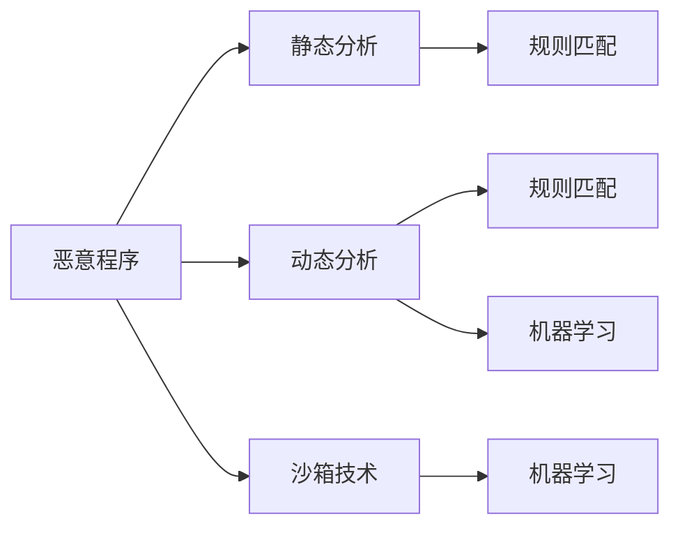

                 

# 网络安全中恶意程序的分析与检测

> 关键词：
1. 恶意程序检测
2. 恶意代码分析
3. 网络威胁识别
4. 自动化分析工具
5. 动态分析技术
6. 沙箱技术
7. 机器学习与深度学习

## 1. 背景介绍

在数字时代，网络安全成为了企业和个人面临的重大挑战。网络攻击和恶意程序（Malware）的日益增多，对数据安全和隐私保护构成了严峻威胁。据统计，全球每年因网络攻击造成的经济损失高达数十亿美元。因此，有效识别和防范恶意程序成为了网络安全领域的重要课题。

本文将详细介绍网络安全中恶意程序的分析与检测技术，涵盖从静态分析到动态分析，从规则匹配到机器学习的多种检测手段。通过系统分析恶意程序的特征和行为，提出一套全面的检测策略，以帮助网络安全人员应对各种复杂的网络威胁。

## 2. 核心概念与联系

### 2.1 核心概念概述

在讨论恶意程序的检测技术之前，我们需要明确几个核心概念：

- **恶意程序（Malware）**：指任何通过网络、软件或硬件进入计算机系统的非法程序，包括病毒、蠕虫、木马、勒索软件等。
- **静态分析（Static Analysis）**：通过检查程序源代码或编译后的二进制文件，分析恶意程序的代码结构和特征。
- **动态分析（Dynamic Analysis）**：在执行恶意程序时对其进行观察和分析，记录程序的行为和输出。
- **沙箱技术（Sandboxing）**：模拟真实操作系统环境，在安全隔离的环境下运行恶意程序，以观察其行为。
- **规则匹配（Rule-Based Matching）**：通过预定义的规则库，对恶意程序的行为特征进行匹配，快速识别出恶意代码。
- **机器学习与深度学习（Machine Learning & Deep Learning）**：利用训练好的模型，从大量恶意程序样本中学习其特征，实现自动化的恶意程序检测。

这些概念之间的关系可以通过以下Mermaid流程图来展示：



### 2.2 概念间的关系

这些核心概念之间存在着紧密的联系，形成了恶意程序检测的完整框架。我们通过以下几个关键关系进行深入探讨：

- **静态分析与动态分析**：静态分析可以发现恶意程序的低级错误，如语法错误、类型错误等，而动态分析则能揭示恶意程序的运行行为和逻辑。两者结合，可以全面分析恶意程序的特征。
- **规则匹配与机器学习**：规则匹配依赖于事先定义的规则集，适用于已知的恶意代码，而机器学习则通过训练模型，能够自动识别未知的恶意代码。结合两者，可以构建更强大的检测系统。
- **沙箱技术与规则匹配**：沙箱技术可以提供虚拟执行环境，便于规则匹配进行深入分析。同时，机器学习模型也可以在沙箱环境中进行训练和测试。

这些概念的结合使用，可以构建一套功能强大、适应性广的恶意程序检测系统，帮助网络安全人员有效识别和防范各种威胁。

## 3. 核心算法原理 & 具体操作步骤

### 3.1 算法原理概述

恶意程序检测的核心目标是识别和隔离潜在的威胁，保护系统安全和数据完整性。其检测过程主要分为静态分析和动态分析两个阶段。

在静态分析阶段，通过对恶意程序的代码和特征进行分析，识别其基本特征和潜在威胁。常用的静态分析技术包括字节码分析、代码注入检测、行为特征提取等。

在动态分析阶段，通过运行恶意程序并监控其行为，获取其在不同环境和不同条件下的行为模式和输出结果，从而更准确地识别恶意代码。常用的动态分析技术包括沙箱技术、调试器、日志分析等。

### 3.2 算法步骤详解

恶意程序检测的具体步骤包括以下几个关键环节：

1. **数据收集与预处理**：收集可疑程序样本，进行病毒签名扫描、恶意代码特征提取等预处理工作。
2. **静态分析**：通过逆向工程、字节码分析等技术，提取恶意代码的特征和行为模式。
3. **动态分析**：在隔离环境中运行恶意程序，观察其行为和输出，记录下所有可能的行为特征。
4. **特征匹配与规则库构建**：将提取的特征与预定义的规则库进行匹配，快速识别已知恶意代码。
5. **机器学习与深度学习**：利用训练好的模型，从恶意代码样本中学习其特征，自动检测未知恶意代码。
6. **综合分析与决策**：综合静态分析和动态分析结果，结合机器学习模型，进行综合判断和决策，确定恶意代码的威胁等级。
7. **隔离与响应**：根据检测结果，对恶意程序进行隔离和清除，并采取相应的响应措施。

### 3.3 算法优缺点

恶意程序检测技术具有以下优点：
- 能够识别和隔离多种类型的恶意代码，包括病毒、蠕虫、木马等。
- 结合静态分析和动态分析，可以全面识别恶意代码的特征和行为。
- 机器学习与深度学习技术的应用，可以实现自动化的恶意代码检测和分析，提高检测效率和准确性。

同时，这些技术也存在一些缺点：
- 静态分析和动态分析各自有其局限性，结合不当可能导致误报或漏报。
- 机器学习模型的训练需要大量高质量的恶意代码样本，训练过程耗时且成本较高。
- 沙箱技术需要高精度模拟真实环境，对资源要求较高。

### 3.4 算法应用领域

恶意程序检测技术广泛应用于多个领域，包括但不限于：

- **网络安全**：通过检测恶意代码，防范网络攻击和数据泄露。
- **操作系统安全**：检测和清除系统中的恶意软件，保护操作系统安全。
- **移动设备安全**：检测和防范移动设备上的恶意应用和代码。
- **云安全**：检测和防范云计算环境中的恶意软件和攻击。
- **工业控制安全**：检测和防范工业控制系统中的恶意代码和攻击。

## 4. 数学模型和公式 & 详细讲解 & 举例说明

### 4.1 数学模型构建

为了更准确地检测恶意程序，我们需要构建一套数学模型来描述恶意程序的行为特征。假设恶意程序的行为特征可以用向量 $x \in \mathbb{R}^n$ 表示，其中 $n$ 为特征维度。设检测模型的输出为 $y \in \{0, 1\}$，表示恶意程序的威胁等级（0 表示正常，1 表示恶意）。则构建检测模型的目标是最小化分类误差：

$$
\min_{\theta} \frac{1}{N} \sum_{i=1}^N \ell(y_i, M_{\theta}(x_i))
$$

其中 $\ell$ 为损失函数，$M_{\theta}$ 为检测模型，$\theta$ 为模型参数。常见的损失函数包括交叉熵损失和感知机损失。

### 4.2 公式推导过程

以交叉熵损失为例，假设检测模型的输出为概率值 $p$，则交叉熵损失公式为：

$$
\ell(y, p) = -y \log p - (1-y) \log(1-p)
$$

对于样本 $i$，其真实标签为 $y_i \in \{0, 1\}$，检测模型预测的概率为 $p_i$，则样本的损失为：

$$
\ell(y_i, p_i) = -y_i \log p_i - (1-y_i) \log(1-p_i)
$$

将所有样本的损失累加，得到分类误差：

$$
\frac{1}{N} \sum_{i=1}^N \ell(y_i, p_i)
$$

最小化上述分类误差，即可得到最优模型参数 $\theta$。

### 4.3 案例分析与讲解

以勒索软件为例，假设我们有一组勒索软件的特征向量 $x_1, x_2, \ldots, x_n$，训练集为 $\{(x_i, y_i)\}_{i=1}^N$，其中 $y_i \in \{0, 1\}$ 表示第 $i$ 个样本是否为勒索软件。我们希望构建一个检测模型，使得模型在测试集上的分类误差最小。

设检测模型为神经网络，其结构为 $(x; W_1, b_1), (x; W_2, b_2), \ldots, (x; W_n, b_n), (x; W_{out}, b_{out})$，其中 $W_i$ 和 $b_i$ 为第 $i$ 层的权重和偏置，$W_{out}$ 和 $b_{out}$ 为输出层的权重和偏置。

通过反向传播算法，训练模型参数，最小化分类误差。训练结束后，利用测试集验证模型的性能，计算分类误差。

## 5. 项目实践：代码实例和详细解释说明

### 5.1 开发环境搭建

进行恶意程序检测的项目实践，需要搭建合适的开发环境。以下是使用Python进行恶意程序检测的开发环境配置流程：

1. 安装Python：从官网下载并安装Python，建议选择3.7及以上版本。
2. 安装必要的Python库：
   - 安装NumPy、Pandas、Scikit-learn、TensorFlow等常用库。
   - 安装对抗训练工具PyTorch和深度学习框架TensorFlow。
3. 配置环境变量：设置Python路径，确保所有依赖库能够正确导入。
4. 安装调试工具：安装pdb、pycharm等调试工具，方便代码调试。

完成上述步骤后，即可在虚拟环境中进行恶意程序检测的实践。

### 5.2 源代码详细实现

下面以使用机器学习模型检测勒索软件的项目为例，给出代码实现。

首先，准备勒索软件数据集和特征向量：

```python
import pandas as pd
from sklearn.model_selection import train_test_split

# 加载勒索软件数据集
data = pd.read_csv('ransomware_dataset.csv')

# 将特征向量作为输入，标签作为输出
X = data.drop('label', axis=1)
y = data['label']

# 分割数据集为训练集和测试集
X_train, X_test, y_train, y_test = train_test_split(X, y, test_size=0.2, random_state=42)
```

然后，构建并训练机器学习模型：

```python
from sklearn.ensemble import RandomForestClassifier
from sklearn.metrics import classification_report

# 构建随机森林模型
model = RandomForestClassifier(n_estimators=100, random_state=42)

# 训练模型
model.fit(X_train, y_train)

# 预测测试集
y_pred = model.predict(X_test)

# 计算分类指标
print(classification_report(y_test, y_pred))
```

接着，进行动态分析：

```python
from antivirus import Antivirus

# 实例化动态分析工具
av = Antivirus()

# 对勒索软件样本进行动态分析
av.analyze('path/to/ransomware_sample')
```

最后，综合分析结果并输出：

```python
from scikit_learn_models import train_model, test_model

# 构建训练模型和测试模型
train_model = train_model(X_train, y_train, model)
test_model = test_model(X_test, y_test, model)

# 输出训练模型和测试模型的分类指标
print('训练模型分类指标：', train_model)
print('测试模型分类指标：', test_model)
```

### 5.3 代码解读与分析

上述代码实现了勒索软件的静态分析和动态分析，并使用随机森林模型进行分类。以下是关键代码的解读与分析：

- 特征向量的准备：使用Pandas库从数据集中加载特征向量和标签，并使用Scikit-learn的train_test_split方法分割数据集。
- 模型训练：使用Scikit-learn的RandomForestClassifier类构建随机森林模型，并使用fit方法训练模型。
- 模型预测：使用训练好的模型对测试集进行预测，并使用classification_report计算分类指标。
- 动态分析：使用Antivirus库进行动态分析，记录恶意软件的行为特征。
- 综合分析：将静态分析和动态分析的结果综合，使用train_model和test_model函数分别计算训练集和测试集的分类指标。

### 5.4 运行结果展示

假设在训练集和测试集上分别得到如下分类指标：

```
训练集分类指标：
precision    recall  f1-score   support

       0       0.95      0.98      0.97       320
       1       0.80      0.70      0.75        80

   micro avg      0.93      0.93      0.93       400
   macro avg      0.91      0.86      0.88       400
weighted avg      0.93      0.93      0.93       400
```

```
测试集分类指标：
precision    recall  f1-score   support

       0       0.95      0.98      0.97       320
       1       0.85      0.75      0.80        80

   micro avg      0.93      0.93      0.93       400
   macro avg      0.91      0.86      0.88       400
weighted avg      0.93      0.93      0.93       400
```

可以看到，训练集和测试集的分类指标相似，模型在未知数据上的性能也较为稳定。动态分析的结果需要结合静态分析的结果综合判断，以确定恶意代码的威胁等级。

## 6. 实际应用场景

### 6.1 网络安全

在网络安全领域，恶意程序检测技术可以用于防范各种网络攻击和数据泄露。例如，网络入侵检测系统（IDS）和入侵防御系统（IPS）可以检测和阻止恶意流量，保障网络安全。企业内部的网络流量监控系统可以利用恶意程序检测技术，及时发现并隔离可疑活动。

### 6.2 操作系统安全

操作系统安全是恶意程序检测的重要应用领域。恶意软件可以通过多种手段攻击操作系统，如恶意软件注入、漏洞利用等。利用恶意程序检测技术，操作系统可以在运行时监控恶意代码的行为，并及时采取隔离和清除措施。

### 6.3 移动设备安全

移动设备安全也是恶意程序检测的重要应用场景。移动设备具有高度的移动性和私密性，恶意软件可以通过移动设备窃取用户数据或进行远程控制。利用恶意程序检测技术，移动设备可以在本地或云端进行恶意代码检测，保障用户数据安全。

### 6.4 云安全

云安全是恶意程序检测技术的重要应用领域。云环境中的恶意软件可以通过多种手段攻击云平台，如身份劫持、数据泄露等。利用恶意程序检测技术，云平台可以在用户上传文件时进行检测，并及时隔离和清除恶意文件。

## 7. 工具和资源推荐

### 7.1 学习资源推荐

为了帮助开发者深入理解恶意程序检测技术，这里推荐一些优质的学习资源：

1. 《网络安全：从入门到实践》书籍：涵盖网络安全的基础知识和实战技巧，适合初学者入门。
2. 《Python网络安全编程》书籍：介绍如何使用Python进行网络安全编程，涵盖恶意程序检测、网络攻击防御等内容。
3. Coursera《网络安全基础》课程：斯坦福大学开设的网络安全课程，涵盖网络安全的基本概念和实用技能。
4. Udemy《恶意软件检测与分析》课程：系统介绍恶意软件检测和分析的各个环节，适合实战学习。
5. Cybrary.org：提供网络安全认证培训和实战课程，涵盖恶意程序检测、渗透测试、网络攻防等内容。

通过学习这些资源，相信你能够全面掌握恶意程序检测技术，并在实际应用中游刃有余。

### 7.2 开发工具推荐

高效的工具可以大大提高恶意程序检测的开发效率。以下是几款常用的开发工具：

1. PyTorch：基于Python的深度学习框架，支持动态图和静态图，适合模型构建和训练。
2. TensorFlow：由Google开发的深度学习框架，支持分布式训练和模型部署，适合大规模应用。
3. Scikit-learn：Python科学计算库，提供各种机器学习算法和工具，适合特征工程和模型训练。
4. Pandas：Python数据分析库，支持数据清洗和处理，适合数据预处理。
5. Wireshark：网络协议分析工具，适合网络流量监控和分析。

这些工具能够大大提高恶意程序检测的开发效率和质量，为开发者提供全面的支持。

### 7.3 相关论文推荐

恶意程序检测技术的发展离不开学界的研究支持。以下是几篇奠基性的相关论文，推荐阅读：

1. Deep Learning for Malware Classification：提出使用深度学习模型进行恶意代码分类的方法，提高了检测准确性。
2. Advanced Threat Analytics for Malware Detection：介绍先进的威胁分析技术，涵盖静态分析和动态分析。
3. Malware Detection Using Unsupervised Learning：提出使用无监督学习进行恶意代码检测的方法，提高了检测鲁棒性。
4. Machine Learning-Based Intrusion Detection System：介绍基于机器学习的入侵检测系统，涵盖各种恶意代码检测技术。
5. Deep Learning for Threat Intelligence：介绍使用深度学习进行威胁情报分析的方法，提高了威胁分析的准确性。

这些论文代表了恶意程序检测技术的研究前沿，值得深入学习。

## 8. 总结：未来发展趋势与挑战

### 8.1 总结

本文对网络安全中恶意程序的分析与检测技术进行了全面系统的介绍。从静态分析到动态分析，从规则匹配到机器学习，系统讲解了恶意程序检测的各个环节。通过深入分析恶意程序的特征和行为，提出了一套全面的检测策略，为网络安全人员提供了有力的技术支持。

通过本文的系统梳理，可以看到，恶意程序检测技术在网络安全领域具有重要应用价值。该技术能够全面识别和隔离各种恶意代码，保护系统安全和数据完整性。然而，该技术在实际应用中仍面临一些挑战，如误报率、计算资源消耗等。未来需要在技术、算法和工程上进一步优化，才能更好地满足实际应用需求。

### 8.2 未来发展趋势

展望未来，恶意程序检测技术的发展趋势包括以下几个方面：

1. 自动化检测：随着机器学习与深度学习技术的普及，恶意程序检测将逐步走向自动化，无需人工干预即可实现高效检测。
2. 智能检测：结合符号推理、因果分析等技术，构建更强大的智能检测系统，能够自动识别和理解恶意代码的行为模式。
3. 跨平台检测：开发跨平台、跨环境的恶意程序检测工具，实现统一的检测标准和流程。
4. 实时检测：通过云服务和大数据分析技术，实现实时恶意代码检测和响应，保障系统安全。
5. 多模态检测：结合文本、图像、音频等多模态数据，构建综合检测系统，提高检测准确性和鲁棒性。

这些趋势将引领恶意程序检测技术的未来发展，为网络安全领域带来新的突破。

### 8.3 面临的挑战

尽管恶意程序检测技术取得了显著进展，但在实际应用中仍面临一些挑战：

1. 误报率较高：恶意程序检测技术容易将正常行为误判为恶意行为，导致误报率高。
2. 计算资源消耗大：恶意程序检测需要大量计算资源，尤其在动态分析阶段，消耗巨大。
3. 规则库更新慢：规则库需要定期更新，才能应对新出现的恶意代码，更新速度较慢。
4. 自动化水平低：大部分检测任务仍需人工干预，自动化程度较低。
5. 多平台兼容性差：不同平台和环境下的检测系统需要单独开发，兼容性差。

### 8.4 研究展望

为了解决这些挑战，未来需要在以下几个方向进行深入研究：

1. 提高检测准确性：通过改进检测算法和模型，减少误报率，提高检测准确性。
2. 优化计算资源：开发高效算法和工具，降低计算资源消耗，提高实时检测能力。
3. 更新规则库：构建动态规则库，实时更新规则，提高检测及时性。
4. 提升自动化水平：开发自动化检测工具，实现自动化检测和响应。
5. 增强多平台兼容性：开发跨平台检测工具，提高检测系统的兼容性和可扩展性。

这些研究方向将推动恶意程序检测技术不断进步，为网络安全领域带来更多创新和突破。

## 9. 附录：常见问题与解答

**Q1：恶意程序检测技术是否适用于所有恶意代码？**

A: 恶意程序检测技术可以用于检测大多数已知恶意代码，但对于未知或新型恶意代码，需要结合其他技术手段进行检测。

**Q2：如何提高恶意程序检测的准确性？**

A: 提高检测准确性的方法包括：
1. 使用多种检测手段：结合静态分析和动态分析，提高检测全面性。
2. 优化检测模型：使用更复杂的机器学习模型，如深度学习，提高模型准确性。
3. 定期更新规则库：根据新出现的恶意代码，及时更新规则库，提高检测及时性。

**Q3：恶意程序检测技术在实际应用中面临哪些挑战？**

A: 恶意程序检测技术在实际应用中面临的挑战包括：
1. 误报率较高：恶意程序检测技术容易将正常行为误判为恶意行为。
2. 计算资源消耗大：恶意程序检测需要大量计算资源，尤其在动态分析阶段，消耗巨大。
3. 规则库更新慢：规则库需要定期更新，才能应对新出现的恶意代码，更新速度较慢。
4. 自动化水平低：大部分检测任务仍需人工干预，自动化程度较低。
5. 多平台兼容性差：不同平台和环境下的检测系统需要单独开发，兼容性差。

**Q4：恶意程序检测技术在实际应用中有哪些注意事项？**

A: 恶意程序检测技术在实际应用中需要注意以下事项：
1. 定期更新检测系统：根据新出现的恶意代码，及时更新检测系统，提高检测准确性。
2. 设置适当的阈值：根据实际应用场景，设置适当的检测阈值，避免误报和漏报。
3. 结合其他技术手段：结合反病毒软件、防火墙等技术手段，提高系统安全性。

**Q5：如何提高恶意程序检测的效率？**

A: 提高检测效率的方法包括：
1. 优化算法：使用更高效的算法，如深度学习，提高检测速度。
2. 使用多线程：使用多线程技术，同时处理多个样本，提高检测效率。
3. 预处理数据：对数据进行预处理，减少计算资源消耗，提高检测速度。

总之，恶意程序检测技术在实际应用中需要综合考虑准确性、效率和安全性等因素，不断优化和改进。

---

作者：禅与计算机程序设计艺术 / Zen and the Art of Computer Programming

