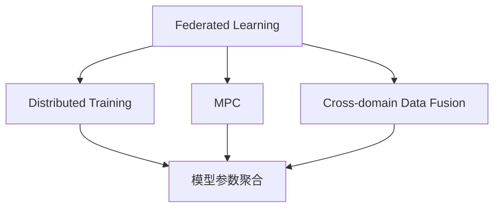
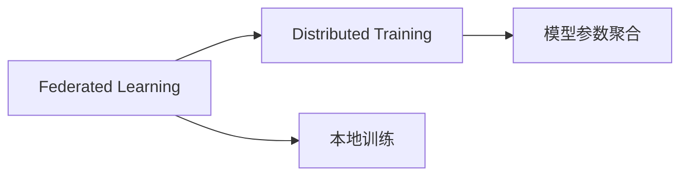
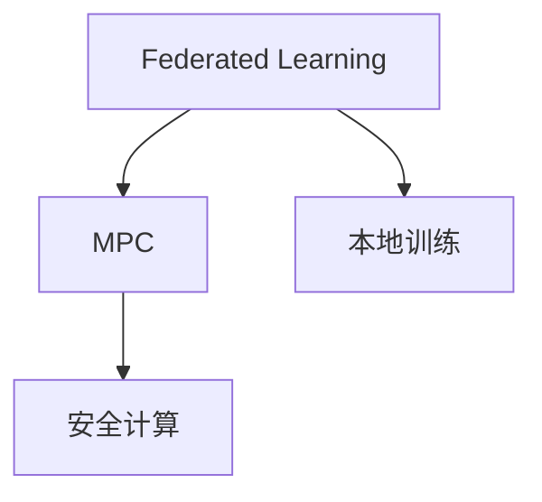
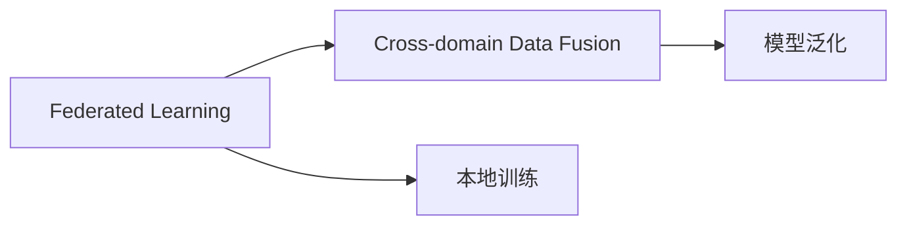

                 

# 联邦学习大模型:多方安全共享数据

> 关键词：联邦学习,大模型,多方安全计算,分布式学习,隐私保护,跨域数据融合

## 1. 背景介绍

### 1.1 问题由来
在当今数据驱动的时代，大模型（如BERT、GPT-3等）在自然语言处理（NLP）、计算机视觉（CV）、语音识别（ASR）等领域展现了强大的能力，但其训练通常需要耗费大量的计算资源和存储资源。为了缓解这一问题，研究者提出了分布式训练（Distributed Training）的策略，即将大规模数据集分割为多个部分，分别在多个计算节点上进行训练，最终将各节点上的模型参数合并，得到整体的大模型。

然而，分布式训练面临诸多挑战。首先，数据分割导致各节点之间需要频繁的通信和数据传输，增加了网络延迟和带宽消耗。其次，数据和模型参数在传输过程中可能被窃取或篡改，存在严重的安全问题。第三，跨域数据融合带来的数据偏见、模型漂移等问题也不容忽视。

为了解决这些问题，联邦学习（Federated Learning）应运而生。联邦学习是一种分布式机器学习框架，通过在多个本地节点上训练模型，仅在必要时进行模型参数的聚合更新，而无需将数据集和模型参数完全传输到中心服务器，从而保证了数据隐私和安全。

## 2. 核心概念与联系

### 2.1 核心概念概述

为更好地理解联邦学习在分布式训练中的应用，本节将介绍几个密切相关的核心概念：

- 联邦学习（Federated Learning）：一种分布式机器学习范式，通过在多个本地节点上训练模型，仅在必要时进行模型参数的聚合更新，从而实现分布式数据上的机器学习。
- 分布式训练（Distributed Training）：在多个计算节点上并行训练模型，以加速模型收敛的过程。
- 多方安全计算（MPC）：一种在数据不离开本地的情况下，实现计算功能的安全计算模型。
- 跨域数据融合（Cross-domain Data Fusion）：将来自不同来源的数据整合在一起，以提升模型的泛化能力和数据利用效率。
- 隐私保护（Privacy Preservation）：在模型训练和数据处理过程中，保护用户隐私和数据安全。

这些概念之间的逻辑关系可以通过以下Mermaid流程图来展示：

这个流程图展示了联邦学习与分布式训练、多方安全计算、跨域数据融合之间的关系：

1. 联邦学习通过分布式训练在多个本地节点上训练模型，通过模型参数聚合更新，实现分布式数据上的机器学习。
2. 多方安全计算保证了模型训练过程中数据的隐私和安全。
3. 跨域数据融合提升了模型的泛化能力和数据利用效率。

### 2.2 概念间的关系

这些核心概念之间存在着紧密的联系，形成了联邦学习的完整生态系统。下面我们通过几个Mermaid流程图来展示这些概念之间的关系。

#### 2.2.1 联邦学习与分布式训练的关系

这个流程图展示了联邦学习与分布式训练的基本流程：

1. 联邦学习通过分布式训练在多个本地节点上训练模型。
2. 每个本地节点在本地数据上独立训练模型。
3. 联邦学习定期聚合各节点的模型参数，进行模型更新。

#### 2.2.2 联邦学习与多方安全计算的关系

这个流程图展示了联邦学习与多方安全计算的关系：

1. 联邦学习通过多方安全计算保证本地训练过程中的数据隐私和安全。
2. 本地训练在本地计算资源上进行，不泄露任何数据。
3. 安全计算模型在模型参数聚合时保护数据的隐私。

#### 2.2.3 联邦学习与跨域数据融合的关系

这个流程图展示了联邦学习与跨域数据融合的关系：

1. 联邦学习通过跨域数据融合整合来自不同来源的数据，提升模型的泛化能力。
2. 本地训练在本地数据上进行，不泄露任何数据。
3. 跨域数据融合将不同数据源的数据整合并用于训练。

## 3. 核心算法原理 & 具体操作步骤
### 3.1 算法原理概述

联邦学习大模型的核心思想是通过在多个本地节点上训练模型，仅在必要时进行模型参数的聚合更新，从而实现分布式数据上的机器学习。联邦学习过程包括以下几个关键步骤：

1. 数据集分割：将大规模数据集分割为多个子集，分配到不同的本地节点上进行训练。
2. 本地训练：在每个本地节点上，使用本地数据训练一个局部模型。
3. 模型聚合：周期性地从各个本地节点收集模型参数，计算平均值或加权平均值，更新全局模型。
4. 模型更新：根据全局模型的更新结果，在本地节点上更新局部模型。
5. 测试和评估：在测试集上评估模型的性能，并进行必要的调整。

### 3.2 算法步骤详解

以下是联邦学习大模型的详细操作步骤：

**Step 1: 数据集分割**

1. 将大规模数据集分割为 $N$ 个子集，每个子集分配到一个本地节点上进行训练。
2. 子集大小应保持均衡，避免某些节点的计算负担过重。
3. 子集应尽量保持数据分布的相似性，避免出现偏差。

**Step 2: 本地训练**

1. 在每个本地节点上，使用本地数据 $D_i$ 训练一个局部模型 $M_i$。
2. 本地训练可以使用任何常见的优化算法，如梯度下降、Adam等。
3. 本地训练过程中，可以使用一些加速技巧，如模型并行、数据并行、分布式训练框架等。

**Step 3: 模型聚合**

1. 周期性地从各个本地节点收集模型参数 $\theta_i$，计算全局模型参数 $\theta$。
2. 模型聚合可以使用平均聚合、加权聚合、梯度聚合等方法。
3. 模型聚合过程中，应尽可能地减少通信量和计算负担。

**Step 4: 模型更新**

1. 根据全局模型参数 $\theta$，更新本地模型 $M_i$。
2. 模型更新可以使用反向传播算法等技术，更新本地模型参数。
3. 模型更新过程中，应尽可能地减少通信量和计算负担。

**Step 5: 测试和评估**

1. 在测试集上评估模型性能。
2. 根据测试结果，进行必要的调整。
3. 如果测试集上的性能不理想，可以重新分配数据集，调整模型参数等。

### 3.3 算法优缺点

联邦学习大模型具有以下优点：

1. 分布式训练：多个节点并行训练，加速模型收敛。
2. 数据隐私保护：本地数据不离开本地节点，保证了数据隐私。
3. 跨域数据融合：多个数据源的数据可以整合使用，提升模型泛化能力。
4. 灵活性：可以根据需要动态调整节点和数据分布。

同时，联邦学习大模型也存在以下缺点：

1. 通信开销：模型参数聚合需要频繁的通信，增加了网络延迟和带宽消耗。
2. 异构性：不同节点之间硬件差异较大，可能导致训练效果不一致。
3. 同步问题：模型参数更新需要同步，增加了计算负担。
4. 安全问题：模型参数在传输过程中可能被窃取或篡改。

### 3.4 算法应用领域

联邦学习大模型已经在多个领域得到了广泛应用，例如：

1. 医疗领域：在多方医疗数据中心上进行联邦学习，训练疾病诊断模型，提升医疗服务的智能化水平。
2. 金融领域：在多个金融机构之间进行联邦学习，训练信用评估模型，提升金融服务的精准性。
3. 零售领域：在多个零售企业之间进行联邦学习，训练客户画像模型，提升个性化推荐系统的性能。
4. 智能交通领域：在多个交通管理部门之间进行联邦学习，训练交通流量预测模型，提升城市交通管理水平。
5. 能源领域：在多个能源公司之间进行联邦学习，训练能源需求预测模型，提升能源分配的效率。

除了上述这些经典应用外，联邦学习大模型还被创新性地应用到更多场景中，如无人驾驶、智慧城市、社会治理等，为各行业的数字化转型升级提供了新的技术路径。

## 4. 数学模型和公式 & 详细讲解 & 举例说明

### 4.1 数学模型构建

假设在 $N$ 个本地节点上，使用本地数据 $D_i$ 训练局部模型 $M_i$，联邦学习的目标是最小化全局损失函数 $\mathcal{L}(\theta)$。全局模型参数 $\theta$ 可以表示为：

$$
\theta = \frac{1}{N}\sum_{i=1}^N \theta_i
$$

其中，$\theta_i$ 为本地模型 $M_i$ 的参数。

在训练过程中，每个本地节点 $i$ 使用本地数据 $D_i$ 训练模型 $M_i$，损失函数为 $\mathcal{L}_i(\theta_i)$，其更新公式为：

$$
\theta_i = \theta_i - \eta \nabla_{\theta_i}\mathcal{L}_i(\theta_i)
$$

其中，$\eta$ 为学习率，$\nabla_{\theta_i}\mathcal{L}_i(\theta_i)$ 为损失函数对局部模型参数的梯度。

### 4.2 公式推导过程

以下是联邦学习大模型的详细推导过程：

**Step 1: 数据集分割**

假设大规模数据集 $D$ 分割为 $N$ 个子集 $D_i$，每个子集 $D_i$ 分配到一个本地节点上进行训练。

**Step 2: 本地训练**

在每个本地节点 $i$ 上，使用本地数据 $D_i$ 训练局部模型 $M_i$。假设本地训练的损失函数为 $\mathcal{L}_i(\theta_i)$，其更新公式为：

$$
\theta_i = \theta_i - \eta_i \nabla_{\theta_i}\mathcal{L}_i(\theta_i)
$$

其中，$\eta_i$ 为本地训练的学习率。

**Step 3: 模型聚合**

周期性地从各个本地节点收集模型参数 $\theta_i$，计算全局模型参数 $\theta$。假设模型聚合使用平均聚合方法，则有：

$$
\theta = \frac{1}{N}\sum_{i=1}^N \theta_i
$$

**Step 4: 模型更新**

根据全局模型参数 $\theta$，更新本地模型 $M_i$。假设模型更新使用反向传播算法，则有：

$$
M_i(\theta_i) = M_i(\theta) - \eta_i \nabla_{M_i}\mathcal{L}_i(\theta_i)
$$

其中，$\nabla_{M_i}\mathcal{L}_i(\theta_i)$ 为损失函数对局部模型 $M_i$ 的梯度。

**Step 5: 测试和评估**

在测试集上评估模型性能。假设测试集为 $D_{test}$，评估指标为 $P$，则有：

$$
P = \frac{1}{|D_{test}|}\sum_{x \in D_{test}} \mathcal{L}_{test}(M(x))
$$

其中，$\mathcal{L}_{test}(M(x))$ 为测试集上的损失函数。

### 4.3 案例分析与讲解

以医疗数据集为例，介绍联邦学习大模型的具体应用。假设在多个医疗中心之间进行联邦学习，训练疾病诊断模型。

**Step 1: 数据集分割**

将大规模医疗数据集分割为多个子集，每个子集分配到一个医疗中心上进行训练。

**Step 2: 本地训练**

在每个医疗中心上，使用本地患者数据训练局部模型 $M_i$。假设本地训练的损失函数为 $\mathcal{L}_i(\theta_i)$，其更新公式为：

$$
\theta_i = \theta_i - \eta_i \nabla_{\theta_i}\mathcal{L}_i(\theta_i)
$$

其中，$\eta_i$ 为本地训练的学习率。

**Step 3: 模型聚合**

周期性地从各个医疗中心收集模型参数 $\theta_i$，计算全局模型参数 $\theta$。假设模型聚合使用平均聚合方法，则有：

$$
\theta = \frac{1}{N}\sum_{i=1}^N \theta_i
$$

**Step 4: 模型更新**

根据全局模型参数 $\theta$，更新本地模型 $M_i$。假设模型更新使用反向传播算法，则有：

$$
M_i(\theta_i) = M_i(\theta) - \eta_i \nabla_{M_i}\mathcal{L}_i(\theta_i)
$$

其中，$\nabla_{M_i}\mathcal{L}_i(\theta_i)$ 为损失函数对局部模型 $M_i$ 的梯度。

**Step 5: 测试和评估**

在测试集上评估模型性能。假设测试集为 $D_{test}$，评估指标为 $P$，则有：

$$
P = \frac{1}{|D_{test}|}\sum_{x \in D_{test}} \mathcal{L}_{test}(M(x))
$$

其中，$\mathcal{L}_{test}(M(x))$ 为测试集上的损失函数。

## 5. 项目实践：代码实例和详细解释说明

### 5.1 开发环境搭建

在进行联邦学习大模型的实践前，我们需要准备好开发环境。以下是使用Python进行TensorFlow联邦学习开发的环

