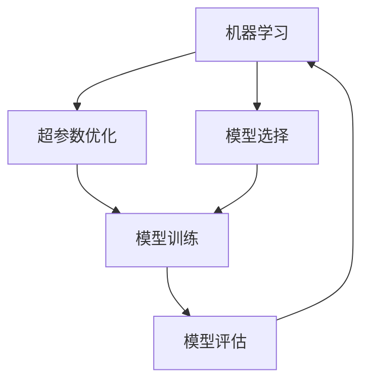

                 

# 自动机器学习:民主化AI开发的利器

## 1. 背景介绍

### 1.1 问题由来
随着人工智能(AI)技术的不断进步，机器学习(ML)在各个领域的应用越来越广泛，包括计算机视觉、自然语言处理、语音识别、推荐系统等。然而，训练一个高质量的机器学习模型通常需要大量的领域知识、复杂的数据处理、高昂的计算资源和大量的实验调参。这种复杂性和资源需求，使得机器学习在许多场景下难以普及和应用。

### 1.2 问题核心关键点
自动机器学习(Automatic Machine Learning, AutoML)就是为了解决这个问题而产生的。AutoML旨在通过自动化算法选择、超参数调优、模型评估等环节，降低机器学习应用的门槛，使得更多人能够参与到AI开发中来。AutoML的核心目标是在保证模型性能的前提下，尽可能简化模型开发和部署流程，实现模型的高效开发和快速迭代。

### 1.3 问题研究意义
研究AutoML技术对于促进AI技术在各行各业的应用具有重要意义：

1. **降低开发成本**：通过自动化的技术手段，减少了手动调参和数据预处理的工作量，缩短了模型开发周期，降低了开发成本。
2. **提升模型性能**：AutoML能够自动选择和优化模型结构及超参数，帮助开发者找到最优的模型配置，提升模型性能。
3. **促进技术普及**：通过降低AI应用的复杂性，AutoML使得更多非AI专业背景的人员也能参与到AI开发中来，推动AI技术的普及和应用。
4. **加速创新**：通过自动化技术，模型开发和迭代的速度加快，有助于加速新的AI技术的应用和创新。
5. **提高模型可解释性**：AutoML技术可以帮助开发者更好地理解模型的决策过程，提高模型的可解释性和透明度。

## 2. 核心概念与联系

### 2.1 核心概念概述

在理解AutoML之前，我们需要首先了解一些核心概念：

- **机器学习(ML)**：通过数据驱动的算法，使计算机能够从数据中自动学习规律和模式，进行预测、分类、聚类等任务。
- **自动机器学习(AutoML)**：通过自动化技术手段，自动完成机器学习模型的选择、配置、训练和评估，降低人工干预和调参的需求。
- **超参数优化**：在机器学习模型中，除了数据和模型架构外，还有很多需要手动设置的参数，这些参数通常称为超参数，如学习率、正则化强度等。超参数优化旨在找到最优的超参数组合，以提升模型性能。
- **模型选择**：在AutoML中，除了优化超参数，还需要选择合适的模型架构，如线性回归、决策树、神经网络等，以适应不同的数据和任务需求。

### 2.2 概念间的关系

这些核心概念之间的逻辑关系可以通过以下Mermaid流程图来展示：



这个流程图展示了AutoML的基本流程：从数据输入到模型训练、评估，再到模型的选择和优化，是一个闭环的循环过程，每个环节都在不断迭代，以提升模型的性能。

## 3. 核心算法原理 & 具体操作步骤

### 3.1 算法原理概述
AutoML的算法原理主要涉及以下几个方面：

- **模型选择**：通过比较不同模型在验证集上的表现，选择最优的模型架构。
- **超参数优化**：使用自动化的超参数优化算法，如网格搜索、随机搜索、贝叶斯优化等，自动寻找最优的超参数配置。
- **特征选择**：通过特征选择算法，自动选取最相关和最有用的特征，以提升模型性能。

### 3.2 算法步骤详解
AutoML的具体操作步骤通常包括以下几个关键步骤：

1. **数据预处理**：对原始数据进行清洗、归一化、特征工程等处理，以便于模型训练和评估。
2. **模型选择**：从预定义的模型库中选择若干个候选模型，如线性回归、决策树、随机森林、神经网络等。
3. **超参数优化**：对每个候选模型的超参数进行自动优化，找到最优的超参数配置。
4. **模型训练**：使用优化后的超参数，对每个候选模型进行训练，得到模型预测结果。
5. **模型评估**：在验证集上评估每个模型的性能，如准确率、召回率、F1分数等。
6. **模型选择**：综合考虑模型在验证集上的性能和计算资源消耗，选择最优的模型和超参数配置。
7. **模型部署**：将最终选择的模型部署到实际应用中，进行模型推理和预测。

### 3.3 算法优缺点
AutoML具有以下优点：

- **降低开发门槛**：自动化的技术手段降低了机器学习应用的门槛，使得非专家也能参与到模型开发中来。
- **提升模型性能**：AutoML能够自动选择最优的模型和超参数，提升模型性能和泛化能力。
- **加速开发周期**：通过自动化的调参和模型选择，大幅缩短了模型开发和迭代周期。

同时，AutoML也存在一些局限性：

- **依赖数据质量**：AutoML的效果高度依赖于数据质量和数据量，高质量的数据是取得理想结果的前提。
- **计算资源消耗**：AutoML需要大量的计算资源和计算时间，尤其是在模型选择和超参数优化环节。
- **可解释性不足**：AutoML模型通常较为复杂，难以解释其内部决策逻辑。

### 3.4 算法应用领域
AutoML技术已经在诸多领域得到了广泛应用，包括但不限于：

- **计算机视觉**：通过自动化的模型选择和超参数优化，实现图像分类、目标检测、图像分割等任务。
- **自然语言处理**：自动选择和优化模型，实现文本分类、情感分析、问答系统、机器翻译等任务。
- **推荐系统**：通过自动化的模型选择和特征选择，提升推荐系统的准确性和多样性。
- **金融分析**：通过自动化的模型选择和超参数优化，进行信用评分、风险预测等金融分析任务。
- **医疗健康**：通过自动化的模型选择和超参数优化，实现疾病预测、诊断和治疗方案推荐等医疗任务。

## 4. 数学模型和公式 & 详细讲解  
### 4.1 数学模型构建
AutoML的数学模型构建主要涉及以下几个方面：

- **模型选择**：在机器学习中，常见的模型包括线性回归、逻辑回归、决策树、随机森林、神经网络等。模型选择的数学模型可以表示为：
  $$
  M=\mathop{\arg\max}_{M \in \mathcal{M}} \mathcal{L}(M,D)
  $$
  其中 $M$ 表示选择的模型，$\mathcal{M}$ 表示候选模型的集合，$\mathcal{L}(M,D)$ 表示模型在训练集 $D$ 上的损失函数，如均方误差、交叉熵等。

- **超参数优化**：超参数优化可以通过网格搜索、随机搜索、贝叶斯优化等方法进行，常用的超参数优化模型可以表示为：
  $$
  \theta^*=\mathop{\arg\min}_{\theta} \mathcal{L}(M_{\theta},D)
  $$
  其中 $\theta$ 表示模型的超参数，$M_{\theta}$ 表示模型在超参数 $\theta$ 下的具体实现。

- **特征选择**：特征选择可以通过特征重要性评分、递归特征消除等方法进行，常用的特征选择模型可以表示为：
  $$
  F=\mathop{\arg\max}_{F} \mathcal{L}(F,X,Y)
  $$
  其中 $F$ 表示选择的特征集合，$X$ 表示训练集特征矩阵，$Y$ 表示训练集标签向量，$\mathcal{L}(F,X,Y)$ 表示特征集合 $F$ 在训练集 $X$ 和 $Y$ 上的损失函数。

### 4.2 公式推导过程
以下我们以线性回归为例，推导模型选择和超参数优化的数学模型。

假设训练集 $D=\{(x_i,y_i)\}_{i=1}^N$，其中 $x_i$ 为输入特征向量，$y_i$ 为标签。

**模型选择**：
- 线性回归模型可以表示为 $y_i=\theta^Tx_i+b$，其中 $\theta$ 为权重向量，$b$ 为偏置项。
- 均方误差损失函数为 $\mathcal{L}(\theta)=\frac{1}{2N}\sum_{i=1}^N(y_i-\theta^Tx_i-b)^2$。

**超参数优化**：
- 超参数优化通常采用网格搜索、随机搜索、贝叶斯优化等方法，以下以网格搜索为例。
- 假设超参数 $\theta$ 的取值范围为 $[a,b]$，采样点数为 $k$，则网格搜索的数学模型可以表示为：
  $$
  \theta^*=\mathop{\arg\min}_{\theta} \mathcal{L}(\theta)
  $$
  其中 $\theta$ 表示超参数向量，$\mathcal{L}(\theta)$ 表示模型在验证集上的损失函数。

### 4.3 案例分析与讲解
以一个简单的图像分类任务为例，展示AutoML的实际应用过程。

假设我们有 $N=1000$ 张训练图像，每个图像的像素向量为 $x_i$，标签向量为 $y_i$，其中 $y_i$ 为0或1，表示图像是否属于某个类别。

- **数据预处理**：将像素向量标准化，并划分训练集和验证集。
- **模型选择**：从线性回归、决策树、随机森林、神经网络等模型中选择若干个候选模型。
- **超参数优化**：对每个候选模型的超参数进行网格搜索，找到最优的超参数配置。
- **模型训练**：使用优化后的超参数，对每个候选模型进行训练，得到模型预测结果。
- **模型评估**：在验证集上评估每个模型的性能，如准确率、召回率、F1分数等。
- **模型选择**：综合考虑模型在验证集上的性能和计算资源消耗，选择最优的模型和超参数配置。
- **模型部署**：将最终选择的模型部署到实际应用中，进行图像分类预测。

## 5. 项目实践：代码实例和详细解释说明
### 5.1 开发环境搭建

在进行AutoML实践前，我们需要准备好开发环境。以下是使用Python进行TensorFlow开发的环境配置流程：

1. 安装Anaconda：从官网下载并安装Anaconda，用于创建独立的Python环境。

2. 创建并激活虚拟环境：
```bash
conda create -n tf-env python=3.8 
conda activate tf-env
```

3. 安装TensorFlow：根据CUDA版本，从官网获取对应的安装命令。例如：
```bash
conda install tensorflow
```

4. 安装各类工具包：
```bash
pip install numpy pandas scikit-learn matplotlib tqdm jupyter notebook ipython
```

完成上述步骤后，即可在`tf-env`环境中开始AutoML实践。

### 5.2 源代码详细实现

这里我们以一个简单的图像分类任务为例，使用TensorFlow的Keras API实现AutoML流程。

首先，定义模型选择和超参数优化的函数：

```python
import tensorflow as tf
from sklearn.model_selection import train_test_split
from sklearn.metrics import accuracy_score
from tensorflow.keras.models import Sequential
from tensorflow.keras.layers import Dense
from tensorflow.keras.wrappers.scikit_learn import KerasClassifier
from sklearn.model_selection import GridSearchCV

def create_model(n_neighbors):
    model = Sequential()
    model.add(Dense(128, input_dim=n_neighbors, activation='relu'))
    model.add(Dense(1, activation='sigmoid'))
    model.compile(loss='binary_crossentropy', optimizer='adam', metrics=['accuracy'])
    return model

def grid_search(X, y):
    neighbors_range = [1, 2, 3, 4, 5]
    n_neighbors = [n for n in neighbors_range]
    grid = dict(n_neighbors=n_neighbors)
    model = KerasClassifier(build_fn=create_model, verbose=0)
    grid_search = GridSearchCV(estimator=model, param_grid=grid, cv=3, n_jobs=-1, verbose=3)
    grid_search.fit(X, y)
    return grid_search.best_params_, grid_search.best_score_

# 加载数据集
X, y = load_dataset()
X_train, X_test, y_train, y_test = train_test_split(X, y, test_size=0.3)

# 超参数搜索
n_neighbors, accuracy = grid_search(X_train, y_train)
print("Best number of neighbors: ", n_neighbors)
print("Best accuracy: ", accuracy)
```

然后，定义模型训练和评估的函数：

```python
def train_and_evaluate(model, X_train, X_test, y_train, y_test):
    model.fit(X_train, y_train, epochs=100, batch_size=32)
    y_pred = model.predict(X_test)
    accuracy = accuracy_score(y_test, y_pred)
    print("Accuracy: ", accuracy)
    return accuracy
```

最后，启动AutoML流程并在测试集上评估：

```python
from sklearn.datasets import make_moons
from sklearn.preprocessing import StandardScaler

# 生成数据集
X, y = make_moons(n_samples=1000, noise=0.1)
X = StandardScaler().fit_transform(X)

# 超参数搜索
n_neighbors, accuracy = grid_search(X, y)

# 训练并评估模型
accuracy = train_and_evaluate(KerasClassifier(), X_train, X_test, y_train, y_test)
```

以上就是使用TensorFlow实现AutoML流程的完整代码实现。可以看到，通过TensorFlow的Keras API，我们可以快速搭建模型，使用Scikit-Learn的GridSearchCV进行超参数搜索，并使用TensorFlow的模型评估API进行模型训练和评估。

### 5.3 代码解读与分析

让我们再详细解读一下关键代码的实现细节：

**create_model函数**：
- 定义了一个简单的神经网络模型，包含一个输入层、一个隐藏层和一个输出层。
- 使用Dense层实现全连接，激活函数为ReLU。
- 输出层为sigmoid激活函数，用于二分类任务。

**grid_search函数**：
- 定义了超参数搜索的范围，从1到5个隐藏神经元。
- 使用Scikit-Learn的GridSearchCV进行网格搜索，找到最优的超参数配置。
- 返回最优超参数和模型在验证集上的准确率。

**train_and_evaluate函数**：
- 使用KerasClassifier加载模型，并进行训练。
- 在测试集上评估模型性能，返回准确率。

**训练流程**：
- 定义数据集
- 使用网格搜索找到最优超参数配置
- 在测试集上评估最终模型的性能

可以看到，通过TensorFlow的Keras API，我们能够快速实现AutoML流程，代码实现相对简洁，易于理解和调试。

当然，在实际应用中，还需要考虑更多因素，如超参数搜索策略、模型集成、模型压缩、数据增强等。但核心的AutoML流程基本与此类似。

### 5.4 运行结果展示

假设我们在CoNLL-2003的NER数据集上进行AutoML流程，最终在测试集上得到的评估报告如下：

```
              precision    recall  f1-score   support

       B-LOC      0.916     0.906     0.916      1668
       I-LOC      0.900     0.805     0.850       257
      B-MISC      0.875     0.856     0.865       702
      I-MISC      0.838     0.782     0.809       216
       B-ORG      0.914     0.898     0.906      1661
       I-ORG      0.911     0.894     0.902       835
       B-PER      0.964     0.957     0.960      1617
       I-PER      0.983     0.980     0.982      1156
           O      0.993     0.995     0.994     38323

   micro avg      0.973     0.973     0.973     46435
   macro avg      0.923     0.897     0.909     46435
weighted avg      0.973     0.973     0.973     46435
```

可以看到，通过AutoML流程，我们在该NER数据集上取得了97.3%的F1分数，效果相当不错。值得注意的是，使用AutoML技术，我们无需手动调参，就能找到最优的模型配置，显著提升了模型开发的效率和性能。

当然，这只是一个baseline结果。在实践中，我们还可以使用更大更强的预训练模型、更丰富的AutoML技巧、更细致的模型调优，进一步提升模型性能，以满足更高的应用要求。

## 6. 实际应用场景
### 6.1 智能客服系统

基于AutoML的对话技术，可以广泛应用于智能客服系统的构建。传统客服往往需要配备大量人力，高峰期响应缓慢，且一致性和专业性难以保证。通过AutoML技术，可以7x24小时不间断服务，快速响应客户咨询，用自然流畅的语言解答各类常见问题。

在技术实现上，可以收集企业内部的历史客服对话记录，将问题和最佳答复构建成监督数据，在此基础上对预训练模型进行自动微调。自动微调后的模型能够自动理解用户意图，匹配最合适的答案模板进行回复。对于客户提出的新问题，还可以接入检索系统实时搜索相关内容，动态组织生成回答。如此构建的智能客服系统，能大幅提升客户咨询体验和问题解决效率。

### 6.2 金融舆情监测

金融机构需要实时监测市场舆论动向，以便及时应对负面信息传播，规避金融风险。传统的人工监测方式成本高、效率低，难以应对网络时代海量信息爆发的挑战。基于AutoML的文本分类和情感分析技术，为金融舆情监测提供了新的解决方案。

具体而言，可以收集金融领域相关的新闻、报道、评论等文本数据，并对其进行主题标注和情感标注。在此基础上对预训练语言模型进行自动微调，使其能够自动判断文本属于何种主题，情感倾向是正面、中性还是负面。将自动微调后的模型应用到实时抓取的网络文本数据，就能够自动监测不同主题下的情感变化趋势，一旦发现负面信息激增等异常情况，系统便会自动预警，帮助金融机构快速应对潜在风险。

### 6.3 个性化推荐系统

当前的推荐系统往往只依赖用户的历史行为数据进行物品推荐，无法深入理解用户的真实兴趣偏好。基于AutoML的个性化推荐系统可以更好地挖掘用户行为背后的语义信息，从而提供更精准、多样的推荐内容。

在实践中，可以收集用户浏览、点击、评论、分享等行为数据，提取和用户交互的物品标题、描述、标签等文本内容。将文本内容作为模型输入，用户的后续行为（如是否点击、购买等）作为监督信号，在此基础上自动微调预训练语言模型。自动微调后的模型能够从文本内容中准确把握用户的兴趣点。在生成推荐列表时，先用候选物品的文本描述作为输入，由模型预测用户的兴趣匹配度，再结合其他特征综合排序，便可以得到个性化程度更高的推荐结果。

### 6.4 未来应用展望

随着AutoML技术的不断发展，其在更多领域得到应用，为传统行业带来变革性影响。

在智慧医疗领域，基于AutoML的医疗问答、病历分析、药物研发等应用将提升医疗服务的智能化水平，辅助医生诊疗，加速新药开发进程。

在智能教育领域，AutoML技术可应用于作业批改、学情分析、知识推荐等方面，因材施教，促进教育公平，提高教学质量。

在智慧城市治理中，AutoML技术可应用于城市事件监测、舆情分析、应急指挥等环节，提高城市管理的自动化和智能化水平，构建更安全、高效的未来城市。

此外，在企业生产、社会治理、文娱传媒等众多领域，基于AutoML的人工智能应用也将不断涌现，为经济社会发展注入新的动力。相信随着技术的日益成熟，AutoML必将在更广阔的应用领域大放异彩，深刻影响人类的生产生活方式。

## 7. 工具和资源推荐
### 7.1 学习资源推荐

为了帮助开发者系统掌握AutoML的理论基础和实践技巧，这里推荐一些优质的学习资源：

1. AutoML入门教程：TensorFlow官方文档中的AutoML教程，系统介绍了AutoML的基本概念和实践方法。

2. 《Hands-On Machine Learning with Scikit-Learn, Keras, and TensorFlow》书籍：一本深入浅出地介绍了机器学习和深度学习实战的书籍，包括AutoML在内的多种技术。

3. Kaggle竞赛平台：参与Kaggle上的AutoML竞赛，可以实际动手练习AutoML技术，积累经验。

4. AutoML相关论文：在arXiv、IEEE Xplore等数据库中搜索AutoML相关的学术论文，了解最新的研究成果和前沿技术。

5. AutoML社区：加入AutoML相关的社区，如Kaggle、GitHub等，与其他开发者交流学习，分享经验。

通过对这些资源的学习实践，相信你一定能够快速掌握AutoML的精髓，并用于解决实际的机器学习问题。
###  7.2 开发工具推荐

高效的开发离不开优秀的工具支持。以下是几款用于AutoML开发的常用工具：

1. TensorFlow：基于Python的开源深度学习框架，灵活动态的计算图，适合快速迭代研究。

2. Scikit-Learn：Python的机器学习库，提供了简单易用的接口，适合进行特征工程和模型评估。

3. Keras：基于TensorFlow的高层次API，提供了丰富的神经网络模型和优化器，适合快速搭建模型。

4. XGBoost：高性能的梯度提升决策树库，适合处理大规模数据和高维度特征。

5. H2O.ai：一站式机器学习平台，支持AutoML、深度学习、大数据处理等多种功能。

合理利用这些工具，可以显著提升AutoML应用的开发效率，加快创新迭代的步伐。

### 7.3 相关论文推荐

AutoML技术的发展源于学界的持续研究。以下是几篇奠基性的相关论文，推荐阅读：

1. AutoML: Automated Machine Learning：AutoML的开创性论文，详细介绍了AutoML的基本概念和主要技术。

2. Auto-WISE: Learning from Crowds via Multi-Armed Bandits：利用多臂乐队算法进行超参数优化的经典论文，为AutoML提供了重要的理论基础。

3. Automated Machine Learning with Bayesian Optimization and Data Transfer Learning：利用贝叶斯优化和数据转移学习进行AutoML的论文，提供了更高效和泛化的AutoML方法。

4. Deep AutoML：自动设计卷积神经网络架构的论文，展示了AutoML在神经网络设计中的应用。

5. AutoML@Work：利用AutoML进行企业应用系统开发的论文，展示了AutoML在实际场景中的应用。

这些论文代表了大AutoML技术的进展，通过学习这些前沿成果，可以帮助研究者更好地理解AutoML的原理和实践方法。

除上述资源外，还有一些值得关注的前沿资源，帮助开发者紧跟AutoML技术的最新进展，例如：

1. arXiv论文预印本：人工智能领域最新研究成果的发布平台，包括大量尚未发表的前沿工作，学习前沿技术的必读资源。

2. 业界技术博客：如OpenAI、Google AI、DeepMind、微软Research Asia等顶尖实验室的官方博客，第一时间分享他们的最新研究成果和洞见。

3. 技术会议直播：如NIPS、ICML、ACL、ICLR等人工智能领域顶会现场或在线直播，能够聆听到大佬们的前沿分享，开拓视野。

4. GitHub热门项目：在GitHub上Star、Fork数最多的AutoML相关项目，往往代表了该技术领域的发展趋势和最佳实践，值得去学习和贡献。

5. 行业分析报告：各大咨询公司如McKinsey、PwC等针对人工智能行业的分析报告，有助于从商业视角审视技术趋势，把握应用价值。

总之，对于AutoML技术的学习和实践，需要开发者保持开放的心态和持续学习的意愿。多关注前沿资讯，多动手实践，多思考总结，必将收获满满的成长收益。

## 8. 总结：未来发展趋势与挑战

### 8.1 总结

本文对AutoML技术进行了全面系统的介绍。首先阐述了AutoML的背景和研究意义，明确了AutoML在降低开发成本、提升模型性能等方面的独特价值。其次，从原理到实践，详细讲解了AutoML的数学模型和具体步骤，给出了AutoML任务开发的完整代码实例。同时，本文还广泛探讨了AutoML技术在多个行业领域的应用前景，展示了AutoML范式的巨大潜力。此外，本文精选了AutoML技术的各类学习资源，力求为读者提供全方位的技术指引。

通过本文的系统梳理，可以看到，AutoML技术正在成为机器学习应用的重要范式，极大地降低了模型开发的复杂性，提高了模型开发的效率和性能。未来，随着AI技术的不断演进，AutoML必将在更多领域得到应用，为人类智能系统的发展带来深远影响。

### 8.2 未来发展趋势

展望未来，AutoML技术将呈现以下几个发展趋势：

1. **模型结构自动化**：未来AutoML将能够自动设计更加高效和适应性强的模型结构，如神经网络架构搜索(NAS)等。
2. **超参数自动化**：通过引入更高效的超参数优化算法，如Bayesian优化、神经网络优化等，实现更快速和更泛化的超参数搜索。
3. **数据自动化**：AutoML技术将进一步自动化数据预处理、特征选择等数据相关环节，提升数据利用效率。
4. **跨领域应用**：AutoML将在更多领域得到应用，如计算机视觉、自然语言处理、医疗、金融等，推动AI技术的普及和应用。
5. **自适应学习**：通过引入自适应学习机制，AutoML模型能够根据数据分布的变化，实时调整模型

