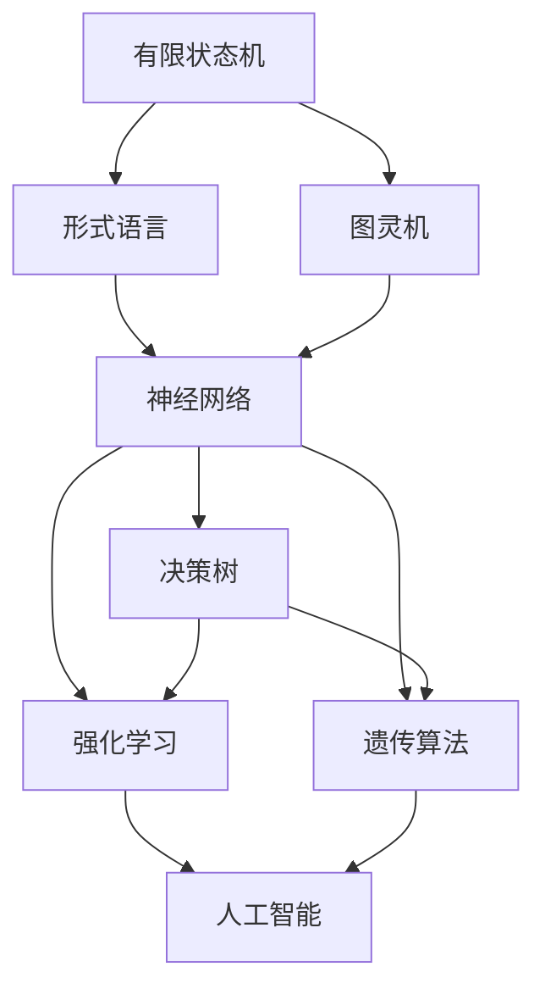
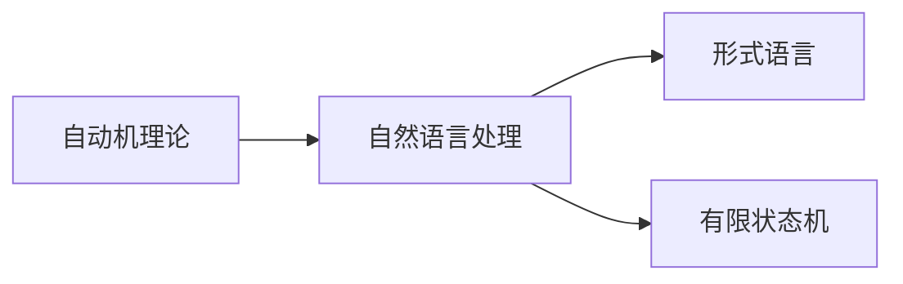
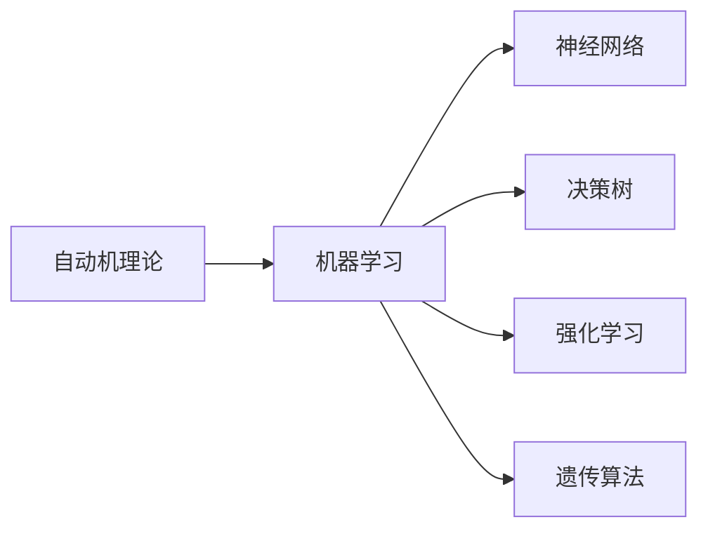
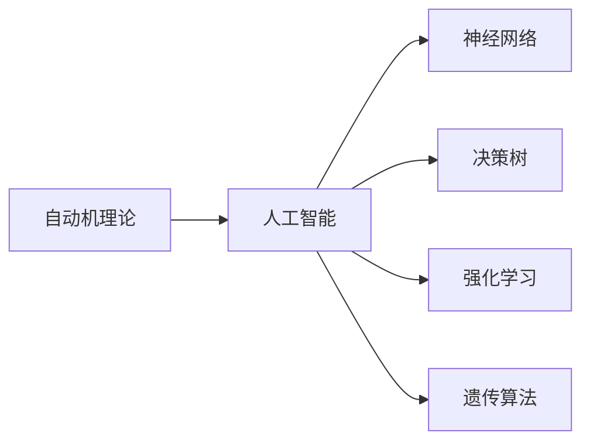
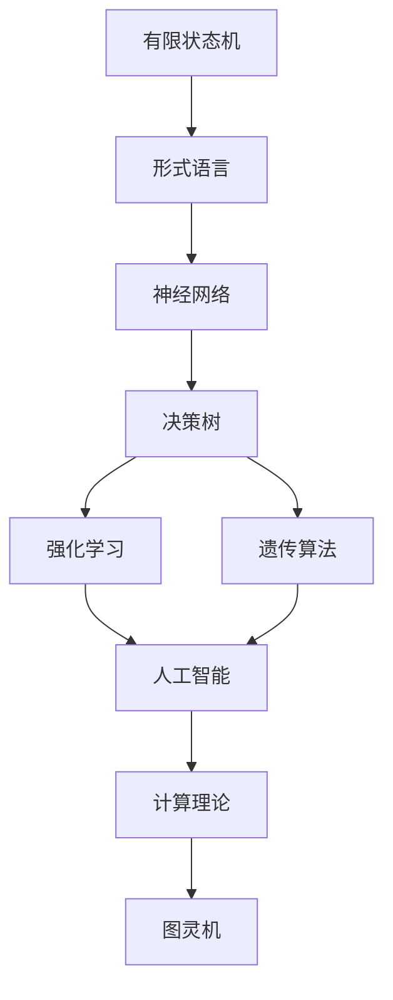

                 

## 1. 背景介绍

### 1.1 问题由来

自动机理论（Automata Theory）与人工智能（Artificial Intelligence, AI）之间的联系和互动已经历了半个多世纪的演进。最初，自动机理论被用作计算理论的基础，研究机器如何执行确定性的任务。随着计算理论的发展，自动机理论逐渐与人工智能结合，为解决各种智能问题提供了理论和方法的支持。

在20世纪50年代到60年代，图灵机被视为智能的极限，而自动机理论则关注于图灵机的通用性和表达能力。然而，随着1967年罗杰·彭罗斯的《不可解性与通用图灵机》一书出版，人们开始意识到任何计算机都可以模拟另一个计算机，自动机理论开始向人工智能领域拓展，旨在解决实际问题，而不是仅仅作为计算理论的基础。

### 1.2 问题核心关键点

自动机理论与人工智能之间的关系主要体现在以下几个方面：

1. **逻辑推理与知识表示**：自动机理论中的有限状态机（Finite State Machine, FSM）等基本概念，被广泛应用于人工智能中的逻辑推理和知识表示。
2. **语言处理与自然语言理解**：自动机理论中的形式语言理论，被用来分析和处理自然语言，推动了自然语言处理（NLP）技术的发展。
3. **控制理论与决策制定**：自动机理论中的决策过程和控制理论，被广泛应用于智能系统的决策制定和行为规划。
4. **计算复杂性与算法设计**：自动机理论为解决计算复杂性和算法设计问题提供了理论基础，帮助设计高效的人工智能算法。
5. **机器学习与数据处理**：自动机理论中的有限自动机（Finite Automaton, FA）等概念，被用于数据处理和机器学习中的模式识别与分类。

### 1.3 问题研究意义

自动机理论与人工智能的结合，为解决实际问题提供了强有力的理论和方法支持。其研究意义包括：

1. **理论基础**：自动机理论为人工智能提供了坚实的理论基础，有助于理解智能系统的本质和行为。
2. **方法支持**：自动机理论中的各种模型和算法，为解决智能系统中的问题提供了有效的解决方案。
3. **技术推进**：自动机理论与人工智能的结合，推动了自然语言处理、机器学习、智能控制等领域的技术进步。
4. **应用拓展**：自动机理论在智能系统中得到了广泛应用，包括机器翻译、语音识别、图像处理、自动驾驶等，具有重要的实际应用价值。
5. **未来发展**：自动机理论的研究，为未来人工智能的发展提供了方向和启发，促进了AI的创新和进步。

## 2. 核心概念与联系

### 2.1 核心概念概述

为了更好地理解自动机理论与人工智能的联系，本节将介绍几个关键的核心概念：

1. **有限状态机（FSM）**：一种简单的自动机模型，由有限数量的状态、输入符号、输出符号和状态转移函数组成。FSM常用于建模有限上下文环境的逻辑推理和决策过程。

2. **形式语言**：由有限符号集合和一组生成规则构成的语言，形式语言理论是自动机理论的核心。通过形式语言，可以表示和处理自然语言、程序代码等文本信息。

3. **图灵机（Turing Machine）**：一种通用计算模型，可以模拟任何计算机的计算过程。图灵机理论是计算理论的基础，奠定了人工智能的理论基础。

4. **决策树（Decision Tree）**：一种基于树结构的分类模型，用于决策制定和模式识别。决策树理论在人工智能中广泛应用于数据挖掘和机器学习。

5. **神经网络（Neural Network）**：一种通过多个节点（神经元）的连接和权重调节进行信息处理的模型。神经网络理论为人工智能中的模式识别和机器学习提供了理论支持。

6. **强化学习（Reinforcement Learning, RL）**：一种通过与环境互动，学习最优策略的机器学习技术。强化学习理论在智能系统中广泛应用于游戏、机器人控制等领域。

7. **遗传算法（Genetic Algorithm）**：一种模拟自然选择和遗传机制的优化算法，用于解决复杂问题。遗传算法理论在人工智能中广泛应用于优化问题和组合问题。

这些核心概念之间的逻辑关系可以通过以下Mermaid流程图来展示：



这个流程图展示了自动机理论中的关键概念及其与人工智能的关系：

1. 有限状态机和图灵机是计算理论的基础，为人工智能提供了理论支持。
2. 形式语言理论用于分析和处理自然语言，推动了自然语言处理技术的发展。
3. 神经网络理论为人工智能中的模式识别和机器学习提供了理论支持。
4. 决策树和遗传算法是优化问题的有效解决方案，广泛应用于智能系统的决策制定和优化。
5. 强化学习理论在智能系统中广泛应用于决策制定和行为规划。
6. 以上所有理论和技术均被广泛应用于人工智能的各个领域，推动了AI技术的发展。

### 2.2 概念间的关系

这些核心概念之间存在着紧密的联系，形成了自动机理论与人工智能的完整生态系统。下面我们通过几个Mermaid流程图来展示这些概念之间的关系。

#### 2.2.1 自动机理论与计算理论的关系


这个流程图展示了自动机理论与计算理论之间的关系。自动机理论是计算理论的重要组成部分，图灵机作为计算理论的基石，奠定了人工智能的理论基础。

#### 2.2.2 自动机理论与自然语言处理的关系



这个流程图展示了自动机理论在自然语言处理中的应用。形式语言理论用于分析和处理自然语言，有限状态机则用于建模自然语言处理中的逻辑推理和决策过程。

#### 2.2.3 自动机理论与机器学习的关系



这个流程图展示了自动机理论在机器学习中的应用。神经网络、决策树、强化学习、遗传算法等都是自动机理论在机器学习中的重要应用，推动了机器学习技术的发展。

#### 2.2.4 自动机理论与人工智能的关系



这个流程图展示了自动机理论在人工智能中的应用。自动机理论为人工智能提供了坚实的理论基础和多种解决方案，推动了人工智能技术的全面发展。

### 2.3 核心概念的整体架构

最后，我们用一个综合的流程图来展示这些核心概念在自动机理论与人工智能中的整体架构：



这个综合流程图展示了自动机理论中的关键概念及其与人工智能的完整架构：

1. 有限状态机和图灵机是计算理论的基础，为人工智能提供了理论支持。
2. 形式语言理论用于分析和处理自然语言，推动了自然语言处理技术的发展。
3. 神经网络、决策树、强化学习、遗传算法等都是自动机理论在机器学习中的重要应用，推动了机器学习技术的发展。
4. 以上所有理论和技术均被广泛应用于人工智能的各个领域，推动了AI技术的发展。

## 3. 核心算法原理 & 具体操作步骤

### 3.1 算法原理概述

自动机理论与人工智能的结合，主要体现在以下几个核心算法中：

1. **有限状态机（FSM）**：用于建模有限上下文环境的逻辑推理和决策过程。在人工智能中，FSM被广泛应用于自然语言处理、智能控制等领域。

2. **形式语言（Regular Expression）**：用于描述和处理文本信息。在人工智能中，形式语言理论被用来分析和处理自然语言，推动了自然语言处理技术的发展。

3. **图灵机（Turing Machine）**：一种通用计算模型，可以模拟任何计算机的计算过程。图灵机理论奠定了人工智能的理论基础，为AI的发展提供了坚实的理论支持。

4. **神经网络（Neural Network）**：一种通过多个节点（神经元）的连接和权重调节进行信息处理的模型。神经网络理论为人工智能中的模式识别和机器学习提供了理论支持。

5. **决策树（Decision Tree）**：一种基于树结构的分类模型，用于决策制定和模式识别。决策树理论在人工智能中广泛应用于数据挖掘和机器学习。

6. **强化学习（Reinforcement Learning, RL）**：一种通过与环境互动，学习最优策略的机器学习技术。强化学习理论在智能系统中广泛应用于游戏、机器人控制等领域。

7. **遗传算法（Genetic Algorithm）**：一种模拟自然选择和遗传机制的优化算法，用于解决复杂问题。遗传算法理论在人工智能中广泛应用于优化问题和组合问题。

### 3.2 算法步骤详解

以下是自动机理论中的几种核心算法及其详细步骤：

#### 3.2.1 有限状态机（FSM）

**算法步骤：**

1. 定义状态集合 $\mathcal{S}$、输入符号集合 $\mathcal{X}$ 和输出符号集合 $\mathcal{Y}$。
2. 定义状态转移函数 $\delta: \mathcal{S} \times \mathcal{X} \rightarrow \mathcal{S}$。
3. 定义初始状态 $s_0 \in \mathcal{S}$ 和终止状态集合 $F \subseteq \mathcal{S}$。
4. 定义输出函数 $g: \mathcal{S} \rightarrow \mathcal{Y}$。

**算法示例：**

```python
class FiniteStateMachine:
    def __init__(self, states, input_symbols, output_symbols, transition_function, initial_state, final_states, output_function):
        self.states = states
        self.input_symbols = input_symbols
        self.output_symbols = output_symbols
        self.transition_function = transition_function
        self.initial_state = initial_state
        self.final_states = final_states
        self.output_function = output_function
    
    def transition(self, state, symbol):
        next_state = self.transition_function(state, symbol)
        return next_state
    
    def is_final(self, state):
        return state in self.final_states
    
    def output(self, state):
        return self.output_function(state)
```

**算法优点：**

1. 简单高效：有限状态机具有直观、易于理解的特点，适用于各种简单的逻辑推理和决策过程。
2. 易于实现：有限状态机的实现相对简单，可以使用Python等常见编程语言进行实现。
3. 可扩展性强：有限状态机可以方便地扩展和修改，适用于不同上下文环境。

**算法缺点：**

1. 局限性大：有限状态机适用于简单的逻辑推理和决策过程，对于复杂的问题，可能无法提供有效的解决方案。
2. 状态爆炸问题：当状态数量和输入符号数量增加时，有限状态机可能面临状态爆炸问题，导致计算复杂度增加。

#### 3.2.2 形式语言（Regular Expression）

**算法步骤：**

1. 定义正则表达式 $\mathcal{L}$。
2. 定义字符集合 $\Sigma$。
3. 定义正则表达式匹配函数 $M: \Sigma^* \rightarrow \mathcal{L}$。

**算法示例：**

```python
import re

def match(text, pattern):
    return re.match(pattern, text) is not None
```

**算法优点：**

1. 高效灵活：正则表达式具有高效、灵活的特点，适用于各种文本信息的处理。
2. 易于实现：正则表达式可以使用Python等常见编程语言进行实现。
3. 应用广泛：正则表达式广泛应用于自然语言处理、数据挖掘等领域。

**算法缺点：**

1. 正则表达式语言复杂：正则表达式的语法较为复杂，需要一定的学习成本。
2. 难以处理复杂问题：正则表达式适用于简单的文本匹配和处理，对于复杂的问题，可能需要结合其他算法进行解决。

#### 3.2.3 图灵机（Turing Machine）

**算法步骤：**

1. 定义输入符号集合 $\mathcal{X}$ 和输出符号集合 $\mathcal{Y}$。
2. 定义读写头的位置 $p \in \mathcal{X}$。
3. 定义读写头在磁带上移动的函数 $\delta: (p, s) \rightarrow (p', s', d)$，其中 $p'$ 为下一个读写头的位置，$s'$ 为下一个读写头的状态，$d$ 为读写头的操作（读取或写入）。
4. 定义初始状态 $s_0$ 和终止状态集合 $F$。
5. 定义读写头在磁带上的读写操作。

**算法示例：**

```python
class TuringMachine:
    def __init__(self, tape, symbols, states, transitions, initial_state, final_states):
        self.tape = tape
        self.symbols = symbols
        self.states = states
        self.transitions = transitions
        self.initial_state = initial_state
        self.final_states = final_states
    
    def step(self, symbol):
        current_state = self.tape[0]
        next_state = self.transitions[(current_state, symbol)][0]
        new_symbol = self.transitions[(current_state, symbol)][1]
        self.tape[0] = new_symbol
        return next_state
    
    def is_final(self, state):
        return state in self.final_states
```

**算法优点：**

1. 通用性强：图灵机可以模拟任何计算机的计算过程，适用于各种复杂问题的解决。
2. 理论基础坚实：图灵机理论奠定了人工智能的理论基础，为AI的发展提供了坚实的理论支持。

**算法缺点：**

1. 计算复杂度高：图灵机适用于解决复杂的问题，但计算复杂度高，需要较高的计算资源。
2. 实现复杂：图灵机的实现较为复杂，需要考虑读写头的位置、状态转移等细节。

#### 3.2.4 神经网络（Neural Network）

**算法步骤：**

1. 定义输入层、隐藏层和输出层的神经元数量。
2. 定义各个神经元之间的连接权重和偏置。
3. 定义激活函数和损失函数。
4. 定义前向传播和反向传播算法。
5. 定义优化算法和训练数据集。

**算法示例：**

```python
import numpy as np

class NeuralNetwork:
    def __init__(self, input_size, hidden_size, output_size):
        self.input_size = input_size
        self.hidden_size = hidden_size
        self.output_size = output_size
        
        # 初始化权重和偏置
        self.weights1 = np.random.randn(input_size, hidden_size)
        self.bias1 = np.zeros((1, hidden_size))
        self.weights2 = np.random.randn(hidden_size, output_size)
        self.bias2 = np.zeros((1, output_size))
    
    def forward(self, x):
        # 前向传播
        self.hidden_layer = np.dot(x, self.weights1) + self.bias1
        self.hidden_layer = np.tanh(self.hidden_layer)
        self.output_layer = np.dot(self.hidden_layer, self.weights2) + self.bias2
        self.output_layer = np.tanh(self.output_layer)
        return self.output_layer
    
    def backward(self, x, y, learning_rate=0.01):
        # 反向传播
        error = y - self.output_layer
        d_error = np.diagflat(error) * self.output_layer * (1 - np.square(self.output_layer))
        delta_output = np.dot(d_error, self.weights2.T)
        delta_hidden = np.dot(delta_output, self.weights1.T)
        
        d_weights2 = np.dot(self.hidden_layer.T, delta_output)
        d_bias2 = np.sum(delta_output, axis=0, keepdims=True)
        d_weights1 = np.dot(x.T, delta_hidden)
        d_bias1 = np.sum(delta_hidden, axis=0, keepdims=True)
        
        # 更新权重和偏置
        self.weights1 -= learning_rate * d_weights1
        self.bias1 -= learning_rate * d_bias1
        self.weights2 -= learning_rate * d_weights2
        self.bias2 -= learning_rate * d_bias2
    
    def train(self, x, y, epochs=1000):
        for epoch in range(epochs):
            y_pred = self.forward(x)
            self.backward(x, y)
```

**算法优点：**

1. 强大的表达能力：神经网络具有强大的表达能力，适用于各种复杂的模式识别和分类问题。
2. 高效灵活：神经网络适用于处理大规模的数据集，具有高效的计算能力。

**算法缺点：**

1. 模型复杂：神经网络模型复杂，训练和调参较为困难。
2. 易过拟合：神经网络容易出现过拟合问题，需要结合正则化等技术进行优化。

#### 3.2.5 决策树（Decision Tree）

**算法步骤：**

1. 定义训练数据集 $\mathcal{D}$ 和特征集合 $\mathcal{F}$。
2. 定义信息熵 $H$ 和信息增益 $IG$。
3. 定义决策树的生成算法。

**算法示例：**

```python
class DecisionTree:
    def __init__(self, max_depth):
        self.max_depth = max_depth
    
    def entropy(self, data):
        entropy = 0
        classes = np.unique(data[:, -1])
        for cls in classes:
            prob = np.sum(data[:, -1] == cls) / len(data)
            entropy += -prob * np.log2(prob)
        return entropy
    
    def information_gain(self, data, feature):
        split = np.unique(data[:, feature])
        gains = []
        for s in split:
            gain = self.entropy(data[data[:, feature] == s]) - self.entropy(data[data[:, feature] == s, :-1])
            gains.append(gain)
        return np.average(gains)
    
    def build_tree(self, data):
        best_feature = None
        best_gain = -1
        for feature in range(data.shape[1] - 1):
            gain = self.information_gain(data, feature)
            if gain > best_gain:
                best_feature = feature
                best_gain = gain
        
        # 终止条件
        if best_feature is None or self.max_depth == 0:
            return best_feature
        
        # 递归构建决策树
        threshold = np.median(data[:, best_feature])
        left_data = data[data[:, best_feature] < threshold]
        right_data = data[data[:, best_feature] >= threshold]
        left_tree = DecisionTree(self.max_depth - 1).build_tree(left_data)
        right_tree = DecisionTree(self.max_depth - 1).build_tree(right_data)
        return {'feature': best_feature, 'threshold': threshold, 'left': left_tree, 'right': right_tree}
```

**算法优点：**

1. 易于理解：决策树易于理解和解释，适用于各种分类和回归问题。
2. 高效灵活：决策树具有高效的计算能力，适用于处理大规模的数据集。

**算法缺点：**

1. 易过拟合：决策树容易出现过拟合问题，需要结合正则化等技术进行优化。
2. 模型复杂：决策树模型复杂，需要考虑树的深度、特征选择等问题。

#### 3.2.6 强化学习（Reinforcement Learning, RL）

**算法步骤：**

1. 定义状态集合 $\mathcal{S}$ 和动作集合 $\mathcal{A}$。
2. 定义奖励函数 $R: \mathcal{S} \times \mathcal{A} \rightarrow [0, 1]$。
3. 定义策略 $\pi: \mathcal{S} \rightarrow \mathcal{A}$。
4. 定义状态转移函数 $P: \mathcal{S} \times \mathcal{A} \rightarrow \mathcal{S}$。
5. 定义价值函数 $V: \mathcal{S} \rightarrow [0, 1]$。

**算法示例：**

```python
import numpy as np

class ReinforcementLearning:
    def __init__(self, state_size, action_size):
        self.state_size = state_size
        self.action_size = action_size
        
        # 初始化Q值表
        self.Q = np.zeros((state_size, action_size))
    
    def choose_action(self, state):
        return np.random.choice(range(self.action_size), p=self.epsilon_greedy(self.Q[state]))
    
    def epsilon_greedy(self, Q, epsilon=0.1):
        if np.random.rand() < epsilon:
            return np.random.choice(range(Q.shape[1]))
        else:
            return np.argmax(Q)
    
    def update_Q(self, state, action, reward, next_state):
        old_q = self.Q[state, action]
        next_max_q = np.max(self.Q[next_state])
        self.Q[state, action] = (1 - alpha) * self.Q[state, action] + alpha * (reward + gamma * next_max_q)
```

**算法优点：**

1. 高效灵活：强化学习适用于各种复杂问题的解决，具有高效的计算能力。
2. 可以处理非结构化数据：强化学习可以处理非结构化数据，适用于各种复杂问题的解决。

**算法缺点：**

1. 计算复杂度高：强化学习适用于解决复杂的问题，但计算复杂度高，需要较高的计算资源。
2. 需要大量的训练数据：强化学习需要大量的训练数据，才能得到较好的效果。

#### 3.2.7 遗传算法（Genetic Algorithm）

**算法步骤：**

1. 定义问题表示方法 $\mathcal{X}$。
2. 定义适应度函数 $F: \mathcal{X} \rightarrow [0, 1]$。
3. 定义选择算子 $\text{Sel}(\mathcal{X}) \rightarrow \mathcal{X}$。
4. 定义交叉算子 $\text{Cross}(\mathcal{X}) \rightarrow \mathcal{X}$。
5. 定义变异算子 $\text{Mut}(\mathcal{X}) \rightarrow \mathcal{X}$。

**算法示例：**

```python
class GeneticAlgorithm:
    def __init__(self, population_size, chromosome_size, mutation_rate):
        self.population_size = population_size
        self.chromosome_size = chromosome_size
        self.mutation_rate = mutation_rate
    
    def generate_population(self):
        self.population = [np.random.randint(0, 2, self.chromosome_size) for _ in range(self.population_size)]
    
    def evaluate_fitness(self):
        self.fitness = np.zeros(self.population_size)
        for i, chromosome in enumerate(self.population):
            self.fitness[i] = self.adaptation(chromosome)
    
    def select_parents(self):
        fitness_sum = np.sum(self.fitness)
        selected_population = []
        for _ in range(self.population_size):
            cumulative_fitness = self.fitness / fitness_sum
            i = np.random.choice(len(self.fitness), p=cumulative_fitness)
            selected_population.append(self.population[i])
        return selected_population
    
    def crossover(self, parents):
        children = []
        for i in range(len(parents) // 2):
            child = np.concatenate((parents[i], parents[i+1]))
            child[np.random.randint(0, len(child))] = 1 - child[np.random.randint(0, len(child))]
            children.append(child)
        return children
    
    def mutate(self, children):
        for child in children:
            if np.random.rand() < self.mutation_rate:
                child[np.random.randint(0, len(child))] = 1 - child[np.random.randint(0, len(child))]
        return children
    
    def adaptation(self, chromosome):
        return np.sum(chromosome)
```

**算法优点：**

1. 高效灵活：遗传算法适用于各种复杂问题的解决，具有高效的计算能力。
2. 可以处理非结构化数据：遗传算法可以处理非结构化数据，适用于各种复杂问题的解决。

**算法缺点：**

1. 计算复杂度高：遗传算法适用于解决复杂的问题，但计算复杂度高，需要较高的计算资源。
2. 需要大量的训练数据：遗传算法需要大量的训练数据，才能得到较好的效果。

### 3.3 算法优缺点

#### 3.3.1 有限状态机（FSM）

**优点：**

1. 简单高效：有限状态机具有直观、易于理解的特点，适用于各种简单的逻辑推理和决策过程。
2. 易于实现：有限状态机的实现相对简单，可以使用Python等常见编程语言进行实现。
3. 可扩展性强：有限状态机可以方便地扩展和修改，适用于不同上下文环境。

**缺点：**

1. 局限性大：有限状态机适用于简单的逻辑推理和决策过程，对于复杂的问题，可能无法提供有效的解决方案。
2. 状态爆炸问题：当状态数量和输入符号数量增加时，有限状态机可能面临状态爆炸问题，导致计算复杂度增加。

#### 3.3.2 形式语言（Regular Expression）

**优点：**

1. 高效灵活：正则表达式具有高效、灵活的特点，适用于各种文本信息的处理。
2. 易于实现：正则表达式可以使用Python等常见编程语言进行实现。
3. 应用广泛：正则表达式广泛应用于自然语言处理、数据挖掘等领域。

**缺点：**

1. 正则表达式语言复杂：正则表达式的语法较为复杂，需要一定的学习成本。
2. 难以处理复杂问题：正则表达式适用于

