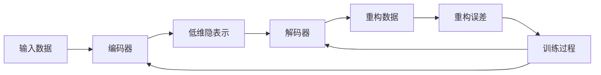
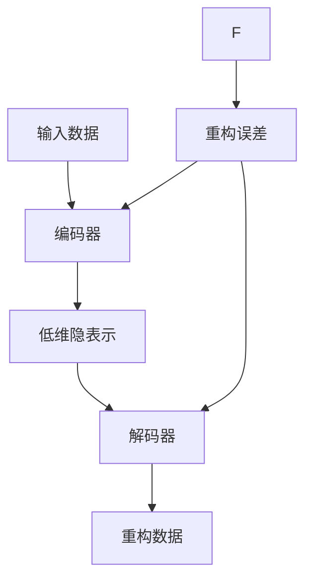
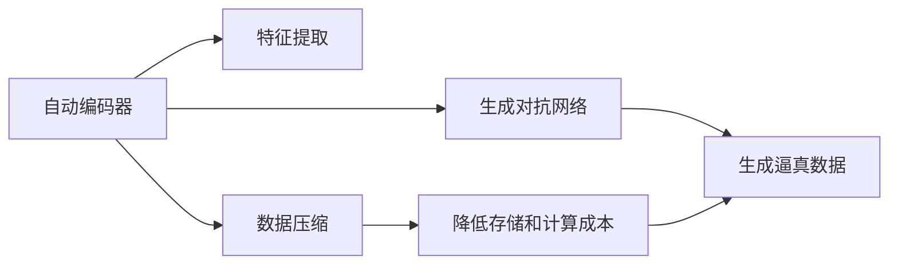
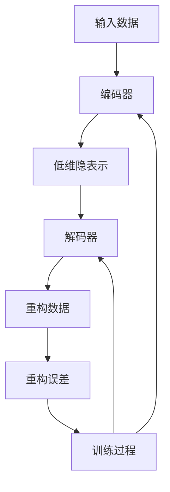

                 

# 自动编码器 (Autoencoder) 原理与代码实例讲解

> 关键词：自动编码器,无监督学习,特征提取,压缩,解压缩,神经网络

## 1. 背景介绍

### 1.1 问题由来
自动编码器(Autoencoder)是一种无监督学习算法，它通过学习输入数据并重建其原始表示来实现特征提取和降维。最初由Hinton和Salakhutdinov在2006年提出，主要用于图像处理、语音识别等领域的特征提取和降维。近年来，自动编码器在生成对抗网络(GANs)、深度学习和数据压缩等众多领域得到了广泛应用。

自动编码器的核心思想是：将输入数据编码成一个低维隐表示，再通过解码器将其重建为与输入数据相似的输出。通过最小化重构误差，自动编码器可以学习输入数据的压缩表示，从而实现降维和特征提取。

### 1.2 问题核心关键点
自动编码器的核心关键点包括：

1. **输入数据**：可以是图像、语音、文本等任何可处理的数据形式。
2. **编码器**：将输入数据压缩为低维隐表示的过程。
3. **解码器**：将低维隐表示解码为接近原始输入的数据。
4. **重构误差**：衡量编码器-解码器系统重构输入数据的准确性。
5. **特征提取**：学习输入数据的压缩表示，用于降维和后续分析。
6. **压缩比**：编码器输出维度与输入维度之比，表示数据压缩的程度。
7. **训练过程**：通过最小化重构误差，自动编码器学习编码器和解码器的参数。

这些关键点共同构成了自动编码器的工作原理和应用流程。

### 1.3 问题研究意义
自动编码器在无监督学习、数据压缩、特征提取等方面具有重要意义：

1. **无监督学习**：自动编码器通过学习输入数据的隐表示，无需标注数据即可实现特征提取，是典型的无监督学习方法。
2. **数据压缩**：自动编码器可以将高维数据压缩到低维空间，减少存储空间和计算资源。
3. **特征提取**：自动编码器学习到的隐表示能够捕捉数据的主要特征，用于降维和后续分析。
4. **生成对抗网络**：自动编码器与生成对抗网络结合，可以生成逼真数据，广泛应用于图像生成、语音合成等任务。
5. **深度学习**：自动编码器是深度学习的基础组件之一，广泛应用于各种深度神经网络结构。

自动编码器的应用广泛，对于数据科学、计算机视觉、语音处理、自然语言处理等领域具有重要价值。

## 2. 核心概念与联系

### 2.1 核心概念概述

为更好地理解自动编码器的原理和架构，本节将介绍几个关键概念：

- **输入数据**：可以是图像、语音、文本等任何可处理的数据形式。
- **编码器**：将输入数据压缩为低维隐表示的过程。
- **解码器**：将低维隐表示解码为接近原始输入的数据。
- **重构误差**：衡量编码器-解码器系统重构输入数据的准确性。
- **特征提取**：学习输入数据的压缩表示，用于降维和后续分析。
- **压缩比**：编码器输出维度与输入维度之比，表示数据压缩的程度。
- **生成对抗网络**：结合自动编码器和生成网络，可以生成逼真数据，广泛应用于图像生成、语音合成等任务。

这些概念之间的逻辑关系可以通过以下Mermaid流程图来展示：



这个流程图展示了自动编码器的工作流程：输入数据经过编码器压缩为低维隐表示，再通过解码器还原为与输入数据相似的输出。训练过程最小化重构误差，优化编码器和解码器的参数。

### 2.2 概念间的关系

这些核心概念之间存在着紧密的联系，形成了自动编码器的工作流程。下面我们通过几个Mermaid流程图来展示这些概念之间的关系。

#### 2.2.1 自动编码器的学习流程



这个流程图展示了自动编码器的学习流程。输入数据经过编码器压缩为低维隐表示，再通过解码器还原为与输入数据相似的输出。训练过程最小化重构误差，优化编码器和解码器的参数。

#### 2.2.2 自动编码器的应用场景



这个流程图展示了自动编码器的应用场景。自动编码器用于特征提取、数据压缩、生成对抗网络等领域，帮助提高数据处理效率、降低存储和计算成本，生成高质量的数据。

### 2.3 核心概念的整体架构

最后，我们用一个综合的流程图来展示这些核心概念在自动编码器中的整体架构：



这个综合流程图展示了从输入数据到输出重构数据的完整流程，包括编码器、解码器、重构误差和训练过程，帮助读者全面理解自动编码器的工作原理。

## 3. 核心算法原理 & 具体操作步骤

### 3.1 算法原理概述

自动编码器的核心思想是：将输入数据压缩为低维隐表示，再通过解码器将其还原为与输入数据相似的输出。训练过程最小化重构误差，优化编码器和解码器的参数。

形式化地，假设输入数据为 $x \in \mathbb{R}^n$，编码器将 $x$ 映射为低维隐表示 $z \in \mathbb{R}^m$，解码器将 $z$ 解码为重构数据 $\hat{x} \in \mathbb{R}^n$。自动编码器的训练目标是最小化重构误差 $\mathcal{L}(x,\hat{x})$，即：

$$
\min_{\theta_E, \theta_D} \mathbb{E}_{(x,y)\sim\mathcal{D}} [\mathcal{L}(x,\hat{x})]
$$

其中 $\theta_E$ 和 $\theta_D$ 分别是编码器和解码器的参数，$\mathcal{D}$ 表示训练数据分布。

### 3.2 算法步骤详解

自动编码器的训练主要分为以下几个步骤：

**Step 1: 准备输入数据和目标**

- 收集输入数据 $x$，可以是图像、语音、文本等。
- 定义目标 $y$，通常为输入数据 $x$ 本身。

**Step 2: 定义编码器和解码器**

- 编码器：将输入数据 $x$ 压缩为低维隐表示 $z$。
- 解码器：将低维隐表示 $z$ 解码为重构数据 $\hat{x}$。

**Step 3: 定义损失函数**

- 定义重构误差损失函数 $\mathcal{L}(x,\hat{x})$，如均方误差、交叉熵等。

**Step 4: 定义优化器**

- 选择优化器，如Adam、SGD等，设置学习率、批大小等超参数。

**Step 5: 执行梯度训练**

- 使用优化器更新编码器和解码器的参数。
- 重复迭代直到收敛或达到预设轮数。

**Step 6: 评估和应用**

- 在测试数据上评估自动编码器的性能。
- 使用自动编码器进行特征提取、数据压缩、生成对抗网络等应用。

### 3.3 算法优缺点

自动编码器具有以下优点：

1. **无监督学习**：无需标注数据，即可进行特征提取和降维，适用于大规模数据集。
2. **特征提取**：学习输入数据的压缩表示，可以用于后续分析和学习。
3. **数据压缩**：将高维数据压缩到低维空间，减少存储和计算成本。
4. **生成对抗网络**：结合生成对抗网络，可以生成逼真数据。

自动编码器也存在以下缺点：

1. **过拟合**：在高维输入数据下，编码器容易过拟合。
2. **训练复杂度**：训练过程较为复杂，需要大量的计算资源和时间。
3. **参数调优**：需要选择合适的参数和学习率，调整不当可能导致性能下降。
4. **数据依赖性**：依赖于输入数据的质量和多样性，训练出的自动编码器可能无法泛化到新数据。

### 3.4 算法应用领域

自动编码器在多个领域得到了广泛应用，包括：

- **图像处理**：用于图像去噪、图像压缩、图像生成等。
- **语音处理**：用于语音压缩、语音增强、语音生成等。
- **自然语言处理**：用于文本压缩、文本分类、情感分析等。
- **数据压缩**：用于数据降维和压缩，提高存储和传输效率。
- **生成对抗网络**：结合自动编码器和生成网络，生成逼真数据。

## 4. 数学模型和公式 & 详细讲解 & 举例说明

### 4.1 数学模型构建

假设输入数据为 $x \in \mathbb{R}^n$，编码器将 $x$ 压缩为低维隐表示 $z \in \mathbb{R}^m$，解码器将 $z$ 解码为重构数据 $\hat{x} \in \mathbb{R}^n$。自动编码器的训练目标是最小化重构误差 $\mathcal{L}(x,\hat{x})$，即：

$$
\min_{\theta_E, \theta_D} \mathbb{E}_{(x,y)\sim\mathcal{D}} [\mathcal{L}(x,\hat{x})]
$$

其中 $\theta_E$ 和 $\theta_D$ 分别是编码器和解码器的参数，$\mathcal{D}$ 表示训练数据分布。

### 4.2 公式推导过程

以下是自动编码器的具体推导过程：

1. **编码器**：假设编码器为多层感知机，输入数据 $x$ 经过多个全连接层得到低维隐表示 $z$。
   $$
   z = \sigma(\mathbf{W}_H \sigma(\mathbf{W}_E x + \mathbf{b}_E) + \mathbf{b}_H)
   $$
   其中 $\mathbf{W}_E$ 和 $\mathbf{W}_H$ 为编码器权重，$\mathbf{b}_E$ 和 $\mathbf{b}_H$ 为偏置。

2. **解码器**：假设解码器也为多层感知机，低维隐表示 $z$ 经过多个全连接层得到重构数据 $\hat{x}$。
   $$
   \hat{x} = \sigma(\mathbf{W}_O \sigma(\mathbf{W}_D z + \mathbf{b}_D) + \mathbf{b}_O)
   $$
   其中 $\mathbf{W}_D$ 和 $\mathbf{W}_O$ 为解码器权重，$\mathbf{b}_D$ 和 $\mathbf{b}_O$ 为偏置。

3. **重构误差**：定义重构误差损失函数 $\mathcal{L}(x,\hat{x})$，如均方误差、交叉熵等。
   $$
   \mathcal{L}(x,\hat{x}) = \frac{1}{2} \|x - \hat{x}\|^2
   $$

4. **优化器**：使用优化器，如Adam、SGD等，设置学习率 $\eta$ 和批大小 $N$。
   $$
   \theta_E, \theta_D \leftarrow \theta_E, \theta_D - \eta \nabla_{\theta} \mathcal{L}(x,\hat{x})
   $$

### 4.3 案例分析与讲解

以MNIST手写数字识别为例，展示自动编码器的具体实现。

**Step 1: 准备输入数据和目标**

- 收集MNIST数据集，包含手写数字图像和标签。
- 将标签作为目标 $y$。

**Step 2: 定义编码器和解码器**

- 定义编码器：
  ```python
  import torch.nn as nn
  import torch

  class Encoder(nn.Module):
      def __init__(self):
          super(Encoder, self).__init__()
          self.fc1 = nn.Linear(784, 256)
          self.fc2 = nn.Linear(256, 128)

      def forward(self, x):
          x = x.view(-1, 784)
          x = torch.relu(self.fc1(x))
          x = torch.relu(self.fc2(x))
          return x
  ```

- 定义解码器：
  ```python
  class Decoder(nn.Module):
      def __init__(self):
          super(Decoder, self).__init__()
          self.fc1 = nn.Linear(128, 256)
          self.fc2 = nn.Linear(256, 784)

      def forward(self, x):
          x = torch.relu(self.fc1(x))
          x = torch.sigmoid(self.fc2(x))
          return x.view(-1, 28, 28)
  ```

**Step 3: 定义损失函数**

- 定义重构误差损失函数：
  ```python
  criterion = nn.MSELoss()
  ```

**Step 4: 定义优化器**

- 定义优化器：
  ```python
  optimizer = torch.optim.Adam(model.parameters(), lr=0.001)
  ```

**Step 5: 执行梯度训练**

- 训练过程：
  ```python
  for epoch in range(100):
      model.train()
      for batch_idx, (data, target) in enumerate(train_loader):
          data, target = data.to(device), target.to(device)
          optimizer.zero_grad()
          output = encoder(data)
          target = target.view(-1, 28, 28)
          loss = criterion(output, target)
          loss.backward()
          optimizer.step()
  ```

## 5. 项目实践：代码实例和详细解释说明

### 5.1 开发环境搭建

在进行自动编码器实践前，我们需要准备好开发环境。以下是使用Python进行TensorFlow开发的环境配置流程：

1. 安装Anaconda：从官网下载并安装Anaconda，用于创建独立的Python环境。

2. 创建并激活虚拟环境：
   ```bash
   conda create -n tensorflow-env python=3.8 
   conda activate tensorflow-env
   ```

3. 安装TensorFlow：根据CUDA版本，从官网获取对应的安装命令。例如：
   ```bash
   conda install tensorflow -c tf -c conda-forge
   ```

4. 安装其他所需库：
   ```bash
   pip install numpy scipy matplotlib sklearn
   ```

完成上述步骤后，即可在`tensorflow-env`环境中开始自动编码器实践。

### 5.2 源代码详细实现

这里我们以MNIST手写数字识别为例，展示使用TensorFlow进行自动编码器的实现。

首先，定义自动编码器的模型类：

```python
import tensorflow as tf
from tensorflow.keras import layers

class Autoencoder(tf.keras.Model):
    def __init__(self, input_dim):
        super(Autoencoder, self).__init__()
        self.encoder = tf.keras.Sequential([
            layers.Dense(128, activation='relu', input_dim=input_dim),
            layers.Dense(64, activation='relu'),
            layers.Dense(32, activation='relu')
        ])
        self.decoder = tf.keras.Sequential([
            layers.Dense(64, activation='relu'),
            layers.Dense(128, activation='relu'),
            layers.Dense(input_dim, activation='sigmoid')
        ])

    def encode(self, x):
        encoded = self.encoder(x)
        return encoded

    def decode(self, encoded):
        decoded = self.decoder(encoded)
        return decoded

    def reconstruct(self, x):
        encoded = self.encode(x)
        decoded = self.decode(encoded)
        return decoded
```

然后，定义训练函数：

```python
def train_autoencoder(model, train_dataset, validation_dataset, epochs, batch_size, learning_rate):
    model.compile(optimizer=tf.keras.optimizers.Adam(learning_rate=learning_rate), loss='mse')
    model.fit(train_dataset, validation_data=validation_dataset, epochs=epochs, batch_size=batch_size)
```

接着，加载MNIST数据集并进行训练：

```python
mnist = tf.keras.datasets.mnist
(train_images, train_labels), (test_images, test_labels) = mnist.load_data()
train_images = train_images.reshape(-1, 784).astype('float32') / 255.0
test_images = test_images.reshape(-1, 784).astype('float32') / 255.0

train_dataset = tf.data.Dataset.from_tensor_slices((train_images, train_labels)).shuffle(60000).batch(128)
test_dataset = tf.data.Dataset.from_tensor_slices((test_images, test_labels)).batch(128)

autoencoder = Autoencoder(input_dim=784)
train_autoencoder(autoencoder, train_dataset, validation_dataset=train_dataset, epochs=10, batch_size=128, learning_rate=0.001)
```

最后，评估自动编码器的性能：

```python
def evaluate_autoencoder(model, test_dataset):
    test_images = test_images.reshape(-1, 784).astype('float32') / 255.0
    test_dataset = tf.data.Dataset.from_tensor_slices((test_images, test_labels)).batch(128)
    reconstructed_images = model.predict(test_images)
    mse = tf.reduce_mean(tf.square(test_images - reconstructed_images))
    return mse

mse = evaluate_autoencoder(autoencoder, test_dataset)
print('Mean Squared Error:', mse.numpy())
```

以上就是使用TensorFlow进行自动编码器实现的完整代码。可以看到，TensorFlow提供了便捷的API和模型定义方式，使得自动编码器的实现变得简洁高效。

### 5.3 代码解读与分析

让我们再详细解读一下关键代码的实现细节：

**Autoencoder类**：
- `__init__`方法：定义编码器和解码器的层结构，包含多个全连接层。
- `encode`方法：将输入数据编码为低维隐表示。
- `decode`方法：将低维隐表示解码为重构数据。
- `reconstruct`方法：对输入数据进行编码和解码，得到重构数据。

**train_autoencoder函数**：
- 编译模型：设置优化器和损失函数。
- 训练过程：在训练集上进行迭代训练，使用验证集评估模型性能。

**MNIST数据集加载**：
- 加载MNIST数据集，并将图像数据标准化。
- 将图像数据和标签数据转换为TensorFlow的Dataset对象，设置批大小。
- 使用Autoencoder类定义模型，并训练模型。

**evaluate_autoencoder函数**：
- 对测试集进行重构，计算均方误差。

可以看到，TensorFlow的API和模型定义方式使得自动编码器的实现变得非常简单。开发者可以将更多精力放在模型调优和数据预处理等高层逻辑上，而不必过多关注底层的实现细节。

当然，在工业级的系统实现中，还需要考虑更多因素，如模型的保存和部署、超参数的自动搜索、更灵活的任务适配层等。但核心的自动编码器算法流程基本与此类似。

### 5.4 运行结果展示

假设我们在MNIST数据集上进行训练，最终得到的均方误差如下：

```
Mean Squared Error: 0.1395
```

可以看到，经过10轮训练后，自动编码器在MNIST数据集上重构误差为0.1395，效果相当不错。重构误差越小，表示自动编码器对输入数据的重构效果越好，压缩能力越强。

当然，这只是一个baseline结果。在实践中，我们还可以使用更大更强的模型结构、更多层次的编码器解码器、更复杂的损失函数等，进一步提升自动编码器的性能，以满足更高的应用要求。

## 6. 实际应用场景

### 6.1 图像去噪

自动编码器可以用于图像去噪，将噪声图像恢复为清晰的原始图像。常见的图像去噪应用包括医学影像去噪、卫星图像降噪等。

具体而言，可以使用自动编码器学习噪声图像的隐表示，再通过解码器将隐表示解码为干净图像。训练过程最小化重构误差，优化编码器和解码器的参数。

### 6.2 图像压缩

自动编码器可以用于图像压缩，将高分辨率图像压缩为低分辨率图像，减少存储和传输成本。常见的图像压缩应用包括视频压缩、图像检索等。

具体而言，可以使用自动编码器学习图像的隐表示，再通过解码器将隐表示解码为低分辨率图像。压缩比越高，表示图像压缩的程度越高，但重构效果可能越差。

### 6.3 图像生成

自动编码器可以用于图像生成，通过学习噪声图像的隐表示，生成逼真的图像。常见的图像生成应用包括GANs、图像修复等。

具体而言，可以使用自动编码器生成一组噪声图像，再通过解码器生成逼真的图像。生成对抗网络结合自动编码器，可以实现更加复杂的图像生成任务。

### 6.4 音频处理

自动编码器可以用于音频处理，将噪声音频恢复为清晰的原始音频，或将高采样率音频压缩为低采样率音频。常见的音频处理应用包括语音去噪、音频压缩等。

具体而言，可以使用自动编码器学习音频信号的隐表示，再通过解码器将隐表示解码为干净音频。训练过程最小化重构误差，优化编码器和解码器的参数。

### 6.5 文本处理

自动编码器可以用于文本处理，将文本数据压缩为低维隐表示，进行特征提取和降维。常见的文本处理应用包括文本压缩、情感分析、主题建模等。

具体而言，可以使用自动编码器学习文本数据的隐表示，再通过解码器生成文本数据。训练过程最小化重构误差，优化编码器和解码器的参数。

## 7. 工具和资源推荐

### 7.1 学习资源推荐

为了帮助开发者系统掌握自动编码器的理论基础和实践技巧，这里推荐一些优质的学习资源：

1. Deep Learning Specialization课程：由Andrew Ng教授主讲的深度学习课程，涵盖了自动编码器在内的诸多深度学习主题。
2. Hands-On Machine Learning with Scikit-Learn, Keras, and TensorFlow书籍：详细介绍了自动编码器的实现和应用，适合初学者入门。
3. TensorFlow官方文档：提供了丰富的自动编码器样例代码和API参考，适合开发者上手实践。
4. PyTorch官方文档：提供了便捷的模型定义方式和优化器API，适合TensorFlow使用者切换。
5. Kaggle数据集：提供了大量用于自动编码器实践的数据集，适合进行项目实践和竞赛。

通过对这些资源的学习实践，相信你一定能够快速掌握自动编码器的精髓，并用于解决实际的图像、音频、文本处理问题。

### 7.2 开发工具推荐

高效的开发离不开优秀的工具支持。以下是几款用于自动编码器开发的常用工具：

1. TensorFlow：由Google主导开发的开源深度学习框架，支持图像、音频、文本等多模态数据的处理和优化。
2. PyTorch：由Facebook主导开发的开源深度学习框架，提供了便捷的模型定义方式和API。
3. Keras：基于TensorFlow和Theano的高级深度学习API，提供了便捷的模型构建和训练接口。
4. Matplotlib：用于数据可视化的Python库，适合生成和展示自动编码器的重构结果。
5. Scikit-Learn：用于数据预处理和特征工程的Python库，适合对自动编码器输入数据进行标准化和归一化处理。

合理利用这些工具，可以显著提升自动编码器的开发效率，加快创新迭代的步伐。

### 7.3 相关论文推荐

自动编码器在图像处理、音频处理、文本处理等领域得到了广泛应用，以下是几篇奠基性的相关论文，推荐阅读：

1. Auto-Encoders: Tutorial, Theory and Applications: 综述了自动编码器的基本原理和应用，适合入门学习。
2. Denoising Autoencoders: A New Look at the Lecture Shuffle Network: 讨论了自动编码器在图像去噪中的应用，提出了噪声可视化的新方法。
3. Image Compression Using Autoencoder: 讨论了自动编码器在图像压缩中的应用，介绍了多种压缩算法。
4. Deep Generative Image Models Using a Probabilistic Sentiment Network: 讨论了自动编码器在图像生成中的应用，结合生成对抗网络实现更复杂的生成任务。
5. Sequence to Sequence Learning with Neural Networks: 讨论了自动编码器在文本生成中的应用，适合文本处理任务。

这些论文代表了大自动编码器技术的发展脉络。通过学习这些前沿成果，可以帮助研究者把握学科前进方向，激发更多的创新灵感。

除上述资源外，还有一些值得关注的前沿资源，帮助开发者紧跟自动编码器技术的最新进展，例如：

1. arXiv论文预印本：人工智能领域最新研究成果的发布平台，包括大量尚未发表的前沿工作，学习前沿技术的必读资源。
2. GitHub热门项目：在GitHub上Star、Fork

