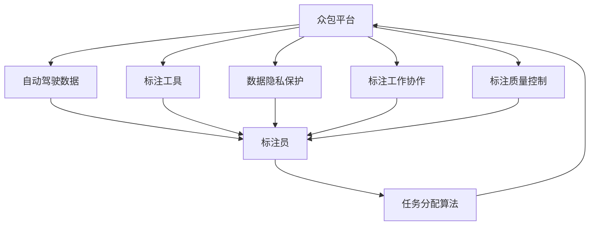
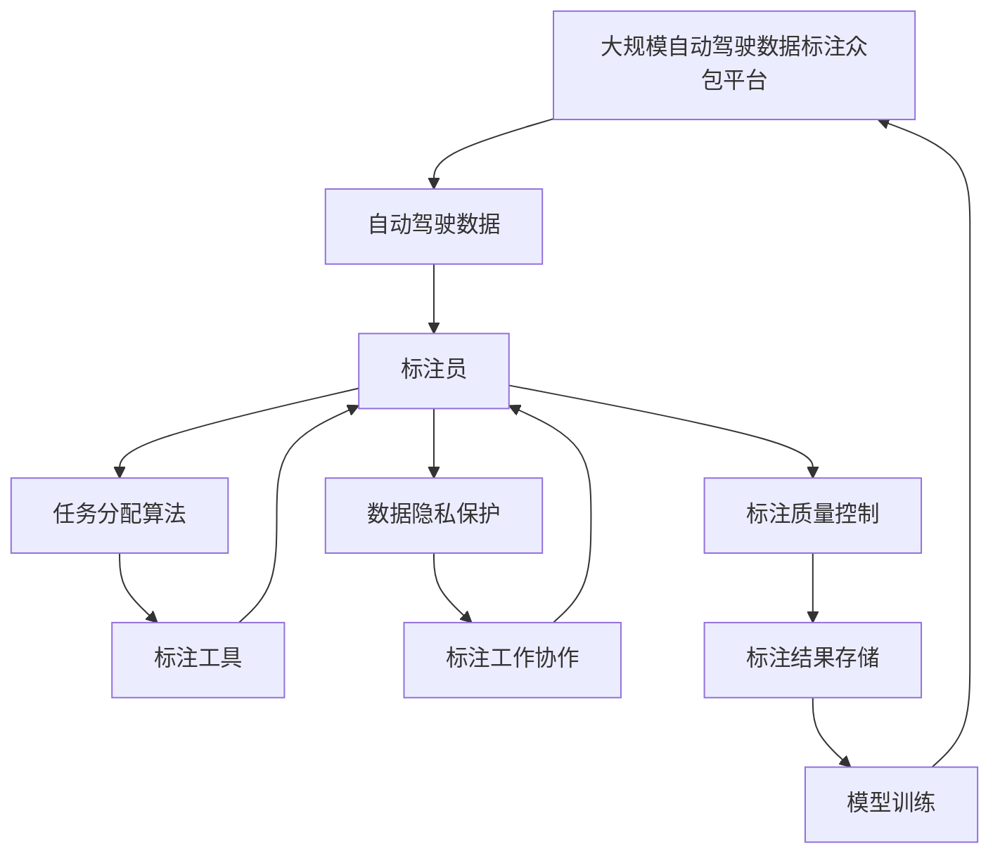

                 

## 1. 背景介绍

### 1.1 问题由来

随着自动驾驶技术的快速发展，数据标注在自动驾驶公司的数据开发过程中扮演着至关重要的角色。由于自动驾驶涉及的场景复杂多样，仅靠内部团队进行数据标注，无法满足大规模数据需求。因此，自动驾驶公司纷纷寻求利用众包平台，借助外部的标注员资源来提高数据标注效率。但当前市面上的众包平台普遍存在标注质量参差不齐、标注工作分配不合理、数据隐私保障不足等问题，难以满足自动驾驶公司的业务需求。

### 1.2 问题核心关键点

自动驾驶公司的数据标注众包平台需要解决的核心问题包括：

- **标注质量控制**：确保标注数据的质量和一致性，避免低质量标注数据影响模型性能。
- **任务分配优化**：合理分配标注任务，保障标注工作的进度和效率。
- **数据隐私保护**：严格管理标注数据的隐私和安全，避免数据泄露。
- **标注工具便捷性**：提供简单易用的标注工具，降低标注员的使用门槛。
- **标注工作协作**：支持多人协同标注，减少重复标注，提高标注效率。

### 1.3 问题研究意义

构建高效、可靠、安全的自动驾驶数据标注众包平台，对于推动自动驾驶技术的快速迭代和产业化进程具有重要意义：

1. **提升数据标注效率**：利用众包平台，自动驾驶公司可以显著降低数据标注成本，加速数据积累，提升模型训练速度和效果。
2. **保障标注数据质量**：众包平台提供多轮审核机制，保证标注数据的一致性和准确性，避免低质量标注影响模型性能。
3. **促进技术创新**：众包平台汇聚全球优秀标注员资源，促进技术交流和创新，推动自动驾驶技术的不断进步。
4. **加速产业化进程**：众包平台能够快速适配自动驾驶公司业务需求，缩短从技术研发到商业应用的时间周期。
5. **提升用户信任度**：众包平台通过严格的数据隐私和安全管理，提升用户信任度，保障数据标注的合法合规性。

## 2. 核心概念与联系

### 2.1 核心概念概述

在构建自动驾驶公司的数据标注众包平台过程中，涉及多个关键概念，包括：

- **众包平台**：利用互联网平台，将数据标注任务发布给全球标注员，收集标注结果的过程。
- **自动驾驶数据**：自动驾驶系统需要的道路场景、交通标志、行人行为等各类数据。
- **标注员**：通过众包平台接收和完成数据标注任务的标注员。
- **任务分配算法**：根据标注员的标注能力和当前任务需求，合理分配标注任务，提高标注效率。
- **数据隐私保护**：采用数据脱敏、访问控制等手段，保护标注数据的隐私和安全性。
- **标注工具**：提供简单易用的标注界面和API，降低标注员的操作门槛。
- **标注工作协作**：支持多人协作标注，减少重复标注，提高标注效率。
- **标注质量控制**：通过多轮审核和质量评估，保证标注数据的一致性和准确性。

这些概念之间存在着紧密的联系，形成了一个完整的自动驾驶数据标注众包平台生态系统。通过理解这些概念，我们可以更好地把握平台构建的逻辑和细节。

### 2.2 概念间的关系

这些核心概念之间存在着紧密的联系，可以用以下Mermaid流程图来展示：



这个流程图展示了众包平台在自动驾驶数据标注过程中的关键环节：

1. 自动驾驶数据通过众包平台发布，分配给标注员。
2. 标注员使用标注工具进行数据标注。
3. 任务分配算法根据标注员能力和任务需求，优化任务分配，提高标注效率。
4. 数据隐私保护机制保护标注数据的隐私和安全。
5. 标注工作协作工具支持多人协作，提高标注效率。
6. 标注质量控制机制通过多轮审核，保障标注数据的一致性和准确性。

### 2.3 核心概念的整体架构

最后，我们用一个综合的流程图来展示这些核心概念在大规模自动驾驶数据标注众包平台中的整体架构：



这个综合流程图展示了众包平台在大规模自动驾驶数据标注中的应用流程：

1. 自动驾驶数据通过众包平台发布。
2. 标注员使用标注工具进行数据标注。
3. 任务分配算法优化任务分配，提高标注效率。
4. 数据隐私保护机制保障标注数据的安全。
5. 标注工作协作工具支持多人协作，提高标注效率。
6. 标注质量控制机制保障标注数据的一致性和准确性。
7. 标注结果存储和模型训练模块集成标注数据，用于自动驾驶模型的训练和优化。

通过这个架构，我们可以看到，自动驾驶公司的数据标注众包平台不仅需要高效地收集和分配标注数据，还需要严格控制标注数据的质量和隐私，并提供便捷的标注工具和协作机制，以支持大规模自动驾驶数据标注的需求。

## 3. 核心算法原理 & 具体操作步骤

### 3.1 算法原理概述

自动驾驶数据标注众包平台的构建，涉及多个关键算法，包括任务分配算法、数据隐私保护算法、标注质量控制算法等。这些算法共同构成了一个完整的标注生态系统，确保标注数据的质量和安全性，同时提高标注效率。

### 3.2 算法步骤详解

#### 3.2.1 任务分配算法

任务分配算法是众包平台的核心算法之一，其目的是根据标注员的标注能力和当前任务需求，合理分配标注任务，提高标注效率。通常，任务分配算法包括以下几个步骤：

1. **标注员能力评估**：根据标注员的历史标注数据和反馈，评估其标注能力和质量。
2. **任务类型匹配**：根据任务需求，选择最合适的标注员，确保标注任务能够高效完成。
3. **任务分配**：将任务分配给最匹配的标注员，并设定任务优先级和时间要求。

#### 3.2.2 数据隐私保护算法

数据隐私保护是众包平台的重要环节，其目的是保障标注数据的隐私和安全。通常，数据隐私保护算法包括以下几个步骤：

1. **数据脱敏**：对标注数据进行去标识化处理，保护用户隐私。
2. **访问控制**：通过身份验证和权限管理，限制对标注数据的访问。
3. **加密传输**：采用加密技术，确保标注数据在传输过程中的安全。

#### 3.2.3 标注质量控制算法

标注质量控制算法是保障标注数据一致性和准确性的重要手段。通常，标注质量控制算法包括以下几个步骤：

1. **多轮审核**：通过多轮审核机制，保证标注数据的一致性和准确性。
2. **质量评估**：使用自动评估和人工审核，评估标注数据的质量。
3. **异常检测**：通过异常检测技术，发现和纠正标注数据中的异常情况。

### 3.3 算法优缺点

自动驾驶数据标注众包平台的构建，涉及的任务分配算法、数据隐私保护算法和标注质量控制算法，各有其优缺点：

- **任务分配算法的优点**：可以高效地匹配任务和标注员，提高标注效率；缺点是无法完全避免标注质量参差不齐的问题。
- **数据隐私保护算法的优点**：可以保护标注数据的隐私和安全；缺点是可能增加数据处理的复杂性。
- **标注质量控制算法的优点**：可以保障标注数据的一致性和准确性；缺点是可能增加标注时间和成本。

### 3.4 算法应用领域

自动驾驶数据标注众包平台的应用领域非常广泛，包括但不限于：

- **自动驾驶系统训练**：通过众包平台收集大量标注数据，用于训练和优化自动驾驶模型。
- **道路场景模拟**：利用标注数据生成各种道路场景，用于自动驾驶系统的测试和验证。
- **交通行为分析**：通过标注数据进行交通行为分析，提高自动驾驶系统的鲁棒性和安全性。
- **交通标志识别**：通过标注数据训练交通标志识别模型，提高自动驾驶系统的感知能力。
- **行人行为预测**：通过标注数据训练行人行为预测模型，提高自动驾驶系统的智能水平。

## 4. 数学模型和公式 & 详细讲解 & 举例说明

### 4.1 数学模型构建

在自动驾驶数据标注众包平台的构建过程中，涉及多个数学模型，包括任务分配模型、数据隐私保护模型和标注质量控制模型。这些模型通常使用机器学习算法进行建模，以提高标注过程的效率和准确性。

### 4.2 公式推导过程

#### 4.2.1 任务分配模型

任务分配模型是一个典型的优化问题，可以使用线性规划或随机优化算法进行求解。假设众包平台有N个标注员和M个标注任务，每个标注员i的标注能力为 $C_i$，每个任务的标注需求为 $D_j$，任务分配的目标是最大化标注效率，即最小化任务完成时间。假设任务i分配给标注员j的概率为 $P_{ij}$，则任务分配模型的优化目标为：

$$
\min_{P_{ij}} \sum_{i=1}^N \sum_{j=1}^M P_{ij} \times \text{Time}_{ij}
$$

其中 $\text{Time}_{ij}$ 表示任务i分配给标注员j所需时间，可以通过评估历史数据获得。

#### 4.2.2 数据隐私保护模型

数据隐私保护模型主要关注数据脱敏和访问控制两个方面。假设原始标注数据为 $X$，保护后的数据为 $Y$，数据脱敏的目标是最大程度保留数据信息，同时确保隐私安全。数据脱敏的公式可以表示为：

$$
Y = f(X, \epsilon)
$$

其中 $f$ 为脱敏函数，$\epsilon$ 为脱敏参数，控制数据隐私保护的强度。

#### 4.2.3 标注质量控制模型

标注质量控制模型主要关注多轮审核和异常检测两个方面。假设标注数据为 $X$，经过多轮审核后的数据为 $Y$，多轮审核的目标是提高标注数据的一致性和准确性。多轮审核的公式可以表示为：

$$
Y = g(X, \text{Round}_{n})
$$

其中 $\text{Round}_{n}$ 表示第n轮审核过程，通过多轮审核逐步提高标注数据的质量。

### 4.3 案例分析与讲解

#### 案例分析：自动驾驶数据标注平台

某自动驾驶公司构建了一个基于云平台的众包标注平台，通过任务分配算法、数据隐私保护算法和标注质量控制算法，实现了高效、可靠、安全的标注服务。该平台的关键技术和优势包括：

1. **任务分配算法**：平台采用了基于协同过滤和随机优化算法相结合的任务分配策略，确保标注任务能够高效完成。
2. **数据隐私保护算法**：平台采用数据脱敏和访问控制相结合的隐私保护策略，保护标注数据的隐私和安全。
3. **标注质量控制算法**：平台通过多轮审核和异常检测，保障标注数据的一致性和准确性。

通过这些算法和技术，平台在短时间内高效收集了大量高质量的标注数据，用于自动驾驶模型的训练和优化，显著提升了自动驾驶系统的感知和决策能力。

## 5. 项目实践：代码实例和详细解释说明

### 5.1 开发环境搭建

在搭建自动驾驶数据标注众包平台前，需要先准备好开发环境。以下是使用Python进行Django开发的环境配置流程：

1. 安装Anaconda：从官网下载并安装Anaconda，用于创建独立的Python环境。

2. 创建并激活虚拟环境：
```bash
conda create -n django-env python=3.8 
conda activate django-env
```

3. 安装Django：根据官网安装命令，安装Django开发框架。

4. 安装其他工具包：
```bash
pip install django psycopg2 postgresql postgresql-psycopg2-simple
```

5. 初始化Django项目：
```bash
django-admin startproject annoint 
cd annoint
```

6. 创建应用：
```bash
python manage.py startapp annotation
```

完成上述步骤后，即可在`django-env`环境中开始开发。

### 5.2 源代码详细实现

下面我们以自动驾驶数据标注众包平台为例，给出使用Django开发标注任务的Python代码实现。

首先，定义任务模型和标注员模型：

```python
from django.db import models
from django.contrib.auth.models import User

class Task(models.Model):
    title = models.CharField(max_length=255)
    description = models.TextField()
    assignee = models.ForeignKey(User, on_delete=models.CASCADE, related_name='tasks')
    status = models.CharField(max_length=20, choices=[('open', 'Open'), ('closed', 'Closed')])
    created_at = models.DateTimeField(auto_now_add=True)
    updated_at = models.DateTimeField(auto_now=True)

class Worker(models.Model):
    username = models.CharField(max_length=255)
    status = models.CharField(max_length=20, choices=[('active', 'Active'), ('inactive', 'Inactive')])
    created_at = models.DateTimeField(auto_now_add=True)
    updated_at = models.DateTimeField(auto_now=True)
```

然后，定义任务分配视图和函数：

```python
from django.shortcuts import render, redirect
from django.http import HttpResponse
from .models import Task, Worker
from .forms import TaskForm

def task_list(request):
    tasks = Task.objects.all().order_by('-created_at')
    return render(request, 'task_list.html', {'tasks': tasks})

def assign_task(request, task_id):
    task = Task.objects.get(id=task_id)
    workers = Worker.objects.filter(status='active').order_by('username')
    return render(request, 'assign_task.html', {'task': task, 'workers': workers})

def assign_task_submit(request, task_id):
    task = Task.objects.get(id=task_id)
    worker = Worker.objects.get(username=request.POST['worker'])
    task.assignee = worker
    task.save()
    return redirect('task_list')
```

接着，定义数据隐私保护视图和函数：

```python
from django.shortcuts import render, redirect
from django.http import HttpResponse
from .models import Task, Worker
from .forms import TaskForm

def task_privacy(request, task_id):
    task = Task.objects.get(id=task_id)
    return render(request, 'task_privacy.html', {'task': task})

def task_privacy_submit(request, task_id):
    task = Task.objects.get(id=task_id)
    task.publish = False
    task.save()
    return redirect('task_list')
```

最后，定义标注质量控制视图和函数：

```python
from django.shortcuts import render, redirect
from django.http import HttpResponse
from .models import Task, Worker
from .forms import TaskForm

def task_quality(request, task_id):
    task = Task.objects.get(id=task_id)
    return render(request, 'task_quality.html', {'task': task})

def task_quality_submit(request, task_id):
    task = Task.objects.get(id=task_id)
    task.status = 'closed'
    task.save()
    return redirect('task_list')
```

完成上述代码后，启动Django开发环境，启动开发服务器：

```bash
python manage.py runserver
```

通过浏览器访问 `http://127.0.0.1:8000/`，即可在浏览器中看到标注任务的管理界面。

### 5.3 代码解读与分析

让我们再详细解读一下关键代码的实现细节：

**任务模型**：
- `Task` 类：用于存储标注任务信息，包括任务标题、描述、分配状态等。
- `Worker` 类：用于存储标注员信息，包括用户名、状态等。

**任务分配视图**：
- `task_list` 函数：列出所有待分配的任务，并显示在管理界面。
- `assign_task` 函数：列出当前任务的未分配标注员，并显示在分配界面。
- `assign_task_submit` 函数：将任务分配给标注员，并将任务状态设置为已分配。

**数据隐私保护视图**：
- `task_privacy` 函数：显示任务隐私设置界面，允许管理员发布任务。
- `task_privacy_submit` 函数：将任务隐私设置为公开或私有。

**标注质量控制视图**：
- `task_quality` 函数：显示任务质量控制界面，允许管理员关闭任务。
- `task_quality_submit` 函数：将任务状态设置为已完成。

**运行结果展示**：
在启动开发服务器后，通过浏览器访问 `http://127.0.0.0:8000/`，即可看到标注任务的管理界面。在管理界面中，可以列出所有待分配的任务，并通过分配界面选择标注员进行任务分配。

## 6. 实际应用场景

### 6.1 智能交通管理

自动驾驶公司的数据标注众包平台可以应用于智能交通管理，帮助交通管理部门实时获取交通数据，优化交通管理策略。例如，通过标注大量交通事故场景，交通管理部门可以更好地理解交通事故发生的规律和原因，从而制定更加科学的交通管理措施。

在技术实现上，可以利用标注平台收集交通事故的文本描述、视频和图片等数据，标注人员对数据进行标注，标注结果用于训练交通行为预测模型，进而优化交通管理策略，减少交通事故发生率。

### 6.2 智慧城市建设

自动驾驶公司的数据标注众包平台可以应用于智慧城市建设，帮助城市管理部门获取城市运行数据，提升城市治理能力。例如，通过标注大量城市基础设施和环境数据，城市管理部门可以更好地理解城市运行状态，制定更加科学的决策方案。

在技术实现上，可以利用标注平台收集城市基础设施和环境数据，标注人员对数据进行标注，标注结果用于训练城市运行预测模型，进而优化城市治理策略，提升城市治理效率。

### 6.3 物流配送优化

自动驾驶公司的数据标注众包平台可以应用于物流配送优化，帮助物流公司优化配送路线和货物运输策略。例如，通过标注大量货物配送场景，物流公司可以更好地理解配送过程的复杂性，制定更加科学的配送策略。

在技术实现上，可以利用标注平台收集货物配送的文本描述、视频和图片等数据，标注人员对数据进行标注，标注结果用于训练货物配送预测模型，进而优化物流配送策略，提升物流配送效率。

### 6.4 未来应用展望

随着自动驾驶技术的不断发展，自动驾驶公司的数据标注众包平台将具备更广泛的应用场景，进一步推动自动驾驶技术的产业化进程。未来，基于自动驾驶数据标注众包平台，可以实现以下创新应用：

1. **智能交通监管**：通过标注平台收集交通监管数据，训练交通监管模型，提高交通监管效率。
2. **智慧城市建设**：通过标注平台收集城市运行数据，训练城市运行预测模型，提升城市治理能力。
3. **物流配送优化**：通过标注平台收集物流配送数据，训练物流配送预测模型，优化物流配送策略。
4. **自动驾驶模拟训练**：通过标注平台收集道路场景数据，训练自动驾驶模拟训练模型，提高自动驾驶系统的鲁棒性。
5. **智能交通预警**：通过标注平台收集交通事故数据，训练智能交通预警模型，提高交通安全性。

总之，自动驾驶公司的数据标注众包平台将为自动驾驶技术的落地应用提供有力支持，推动自动驾驶技术的快速迭代和产业化进程。

## 7. 工具和资源推荐

### 7.1 学习资源推荐

为了帮助开发者系统掌握自动驾驶数据标注众包平台的理论基础和实践技巧，这里推荐一些优质的学习资源：

1. **Django官方文档**：Django框架的官方文档，提供了详细的Django开发指南和示例代码。
2. **Django REST framework官方文档**：Django REST framework框架的官方文档，提供了详细的API开发指南和示例代码。
3. **Django tutorial**：Django官方提供的教程，涵盖Django开发基础和进阶内容，适合初学者学习。
4. **Django by example**：Django实战开发教程，通过实际项目案例讲解Django开发技巧和最佳实践。
5. **Django REST framework by example**：Django REST framework实战开发教程，通过实际项目案例讲解API开发技巧和最佳实践。

通过这些资源的学习，相信你一定能够快速掌握自动驾驶数据标注众包平台的开发技巧，并用于解决实际的自动驾驶数据标注问题。

### 7.2 开发工具推荐

高效的开发离不开优秀的工具支持。以下是几款用于自动驾驶数据标注众包平台开发的常用工具：

1. **Django**：Python Web框架，提供强大的ORM和模板系统，适合构建Web应用。
2. **PostgreSQL**：开源关系型数据库，支持复杂查询和事务处理，适合存储和管理标注数据。
3. **Django REST framework**：Django框架的RESTful API开发工具，提供高效的API开发和版本控制功能。
4. **SQLAlchemy**：Python ORM框架，支持复杂的数据模型设计和查询优化。
5. **Pillow**：Python图像处理库，支持图像读取、处理和保存。
6. **Flask**：轻量级Web框架，支持构建微服务和高性能API。

合理利用这些工具，可以显著提升自动驾驶数据标注众包平台的开发效率，加快创新迭代的步伐。

### 7.3 相关论文推荐

自动驾驶数据标注众包平台的构建涉及多个前沿领域，以下是几篇奠基性的相关论文，推荐阅读：

1. **Django: The web framework for perfectionists with deadlines**：Django框架的官方文档，提供了详细的Django开发指南和示例代码。
2. **Django REST framework: A lightweight extension to Django for building Web APIs**：Django REST framework框架的官方文档，提供了详细的API开发指南和示例代码。
3. **Django tutorial**：Django官方提供的教程，涵盖Django开发基础和进阶内容，适合初学者学习。
4. **Django by example**：Django实战开发教程，通过实际项目案例讲解Django开发技巧和最佳实践。
5. **Django REST framework by example**：Django REST framework实战开发教程，通过实际项目案例讲解API开发技巧和最佳实践。

这些论文代表了大数据标注众包平台的研究进展，通过学习这些前沿成果，可以帮助研究者把握学科前进方向，激发更多的创新灵感。

除上述资源外，还有一些值得关注的前沿资源，帮助开发者紧跟自动驾驶数据标注平台技术的最新进展，例如：

1. **arXiv论文预印本**：人工智能领域最新研究成果的发布平台，包括大量尚未发表的前沿工作，学习前沿技术的必读资源。
2. **知乎、CSDN等技术社区**：技术交流和分享平台，可以获取最新的技术动态和开发经验。
3. **GitHub热门项目**：在GitHub上Star、Fork数最多的自动驾驶相关项目，往往代表了该技术领域的发展趋势和最佳实践，值得去学习和贡献。
4. **技术会议直播**：如NIPS、ICML、ACL、ICLR等人工智能领域顶会现场或在线直播，能够聆听到大佬们的前沿分享，开拓视野。
5. **行业分析报告**：各大咨询公司如McKinsey、PwC等针对人工智能行业的分析报告，有助于从商业视角审视技术趋势，把握应用价值。

总之，对于自动驾驶数据标注众包平台的开发和学习，需要开发者保持开放的心态和持续学习的意愿。多关注前沿资讯，多动手实践，多思考总结，必将收获满满的成长收益。

## 8. 总结：未来发展趋势与挑战

### 8.1 总结

本文对自动驾驶公司的数据标注众包平台进行了全面系统的介绍。首先阐述了自动驾驶数据标注众包平台的研究背景和意义，明确了平台构建的目标和核心问题。其次，从原理到实践，详细讲解了自动驾驶数据标注众包平台的核心算法和具体操作步骤，给出了详细代码实现和运行结果展示。同时，本文还探讨了平台在自动驾驶、智能交通、物流配送等领域的实际应用场景，展示了平台的巨大潜力。最后，本文精选了平台开发和学习所需的工具和资源，力求为读者提供全方位的技术指引。

通过本文的系统梳理，可以看到，自动驾驶公司的数据标注众包平台不仅需要高效地收集和分配标注数据，还需要严格控制标注数据的质量和隐私，并提供便捷的标注工具和协作机制，以支持大规模自动驾驶数据标注的需求。未来，基于自动驾驶数据标注众包平台，可以实现更加智能化、可靠、安全的自动驾驶系统，推动自动驾驶技术的产业化进程。

### 8.2 未来发展趋势

展望未来，自动驾驶数据标注众包平台将呈现以下几个发展趋势：

1. **智能标注技术**：引入自动化标注技术，如深度学习、计算机视觉等，提高标注效率和准确性。
2. **多模态数据标注**：支持文本、图像、视频等多种数据类型，丰富标注内容。
3. **区块链技术**：利用区块链技术，确保标注数据的安全和透明性，保障数据隐私。
4. **联邦学习**：采用联邦学习技术，将标注数据分布式存储和训练，提高数据隐私保护。
5. **边缘计算**：利用边缘计算技术，减少数据传输时间和成本，提高标注效率。
6. **实时标注**：支持实时标注，快速响应新的标注需求，提高标注效率。

这些趋势将进一步提升自动驾驶数据标注众包平台的智能化水平和应用范围，推动自动驾驶技术的快速迭代和产业化进程。

### 8.3 面临的挑战

尽管自动驾驶数据标注众包平台已经取得了一定的进展，但在实际应用过程中，仍面临诸多挑战：

1

