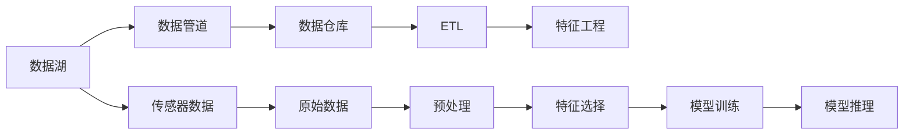

                 

## 1. 背景介绍

### 1.1 问题由来

自动驾驶技术的核心在于车辆对环境的感知与决策。感知过程依赖于大量的传感器数据，包括摄像头、雷达、激光雷达等，这些数据通常被统称为“传感器数据”。在数据量庞大的自动驾驶系统中，如何高效地存储、处理和管理这些数据，成为了一个重要问题。而特征工程（Feature Engineering）则是自动驾驶数据分析中不可或缺的一环，它负责从原始数据中提取有意义的特征，供模型学习使用。

### 1.2 问题核心关键点

自动驾驶公司构建高效的数据湖和特征工程平台，是提升系统性能的关键。以下是问题中需要重点关注的核心关键点：

1. **数据湖**：自动驾驶系统依赖于庞大的数据湖，如何高效存储和查询传感器数据是首要问题。
2. **特征工程**：传感器数据通常包含噪声和冗余，如何从原始数据中提取有意义的特征，对自动驾驶模型至关重要。
3. **系统集成**：如何将数据湖和特征工程平台无缝集成到自动驾驶系统中，确保数据流的稳定和高效。

### 1.3 问题研究意义

构建高效的数据湖和特征工程平台，对于自动驾驶系统的开发和优化具有重要意义：

1. **提升系统性能**：高效的数据存储和查询能够加速模型训练和推理，提升系统响应速度。
2. **降低成本**：优化数据处理流程，减少计算资源和存储成本。
3. **增强可维护性**：通过合理的架构设计，降低系统维护和扩展的复杂度。
4. **促进创新**：提供强大的数据基础，支持团队进行模型优化和新技术的实验。

## 2. 核心概念与联系

### 2.1 核心概念概述

为更好地理解自动驾驶公司数据湖与特征工程平台，我们需要介绍几个关键概念：

- **数据湖**：一个可扩展的、成本效益高的、全数据的存储和分析平台，支持多种数据源和多种数据类型。
- **特征工程**：通过预处理、转换和选择，从原始数据中提取有用的特征，供模型学习。
- **数据仓库**：一个集中化的、经过整理的、长期存储的数据集合，便于数据查询和分析。
- **数据管道**：用于自动传输数据，支持数据湖与数据仓库之间的数据流动。
- **ETL（Extract, Transform, Load）**：从原始数据中提取、转换和加载数据的流程。

### 2.2 概念间的关系

这些概念之间的关系可以通过以下Mermaid流程图来展示：



这个流程图展示了从传感器数据到模型推理的全过程：

1. 传感器数据通过数据管道传输到数据湖。
2. 数据湖中的原始数据经过ETL流程，最终存入数据仓库。
3. 数据仓库中的数据经过特征工程，提取有用的特征。
4. 提取的特征供模型训练和推理使用。

## 3. 核心算法原理 & 具体操作步骤

### 3.1 算法原理概述

自动驾驶公司的数据湖与特征工程平台的构建，本质上是数据处理和特征提取的过程。其核心算法原理基于以下步骤：

1. **数据湖构建**：选择合适的数据存储技术，构建高效、可扩展的数据湖。
2. **特征提取**：利用特征工程方法，从原始传感器数据中提取有意义的特征。
3. **系统集成**：将数据湖和特征工程平台集成到自动驾驶系统中，确保数据流的高效和稳定。

### 3.2 算法步骤详解

#### 3.2.1 数据湖构建

1. **选择数据存储技术**：根据数据量和数据种类，选择合适的数据存储技术。例如，使用Apache Hadoop、Apache Spark、Amazon S3等。
2. **设计数据模型**：设计适合自动驾驶应用的数据模型，包括数据的存储格式、访问方式等。
3. **数据湖搭建**：搭建数据湖平台，配置数据存储、查询和处理功能。

#### 3.2.2 特征工程

1. **数据预处理**：处理缺失值、异常值等数据问题，提高数据质量。
2. **特征选择**：选择与自动驾驶任务最相关的特征，去除噪声和冗余。
3. **特征转换**：进行特征缩放、归一化等处理，提升特征的可用性。
4. **特征生成**：利用高级技术（如PCA、LDA等）生成新的特征，增强模型的表达能力。

#### 3.2.3 系统集成

1. **数据管道设计**：设计数据管道，确保数据从传感器到模型的高效传输。
2. **ETL流程配置**：配置ETL流程，实现数据从原始数据到特征工程的自动流转。
3. **系统集成测试**：测试数据湖和特征工程平台的集成效果，确保系统稳定和高效。

### 3.3 算法优缺点

自动驾驶公司的数据湖与特征工程平台，具有以下优点：

1. **高效存储和查询**：数据湖平台能够高效存储大量传感器数据，支持高速查询和分析。
2. **灵活的数据处理**：特征工程方法灵活多样，能够处理各种传感器数据。
3. **提高模型性能**：通过特征工程，提取有用的特征，提升模型的准确性和鲁棒性。
4. **支持系统优化**：数据湖和特征工程平台能够为模型优化提供数据支持。

同时，也存在以下缺点：

1. **数据量大**：传感器数据量庞大，存储和查询可能面临性能瓶颈。
2. **处理复杂**：特征工程涉及大量预处理和转换，过程复杂且耗时。
3. **系统集成挑战**：数据湖和特征工程平台的集成，需要精心设计，避免数据流中断。

### 3.4 算法应用领域

自动驾驶公司的数据湖与特征工程平台，已经在以下几个领域得到了广泛应用：

1. **传感器数据存储**：用于存储摄像头、雷达、激光雷达等传感器数据。
2. **模型训练**：提取特征供模型学习，提升模型性能。
3. **实时推理**：通过数据管道和ETL流程，支持模型的实时推理。
4. **数据可视化**：提供数据可视化工具，便于数据监控和分析。

## 4. 数学模型和公式 & 详细讲解 & 举例说明

### 4.1 数学模型构建

自动驾驶数据湖与特征工程平台的构建，涉及多个数学模型和公式。

**数据湖模型**：

- **分布式文件系统**：如Hadoop Distributed File System (HDFS)，用于存储海量数据。
- **数据访问和处理**：如Hive、Spark等，用于数据查询和处理。

**特征工程模型**：

- **特征选择**：使用方差阈值、相关系数等方法选择有用特征。
- **特征转换**：使用标准化、归一化等方法转换特征。
- **特征生成**：使用PCA、LDA等降维方法生成新特征。

**系统集成模型**：

- **数据管道**：使用Apache Kafka、Apache Flink等技术，实现数据管道。
- **ETL流程**：使用Presto、Talend等工具，实现数据ETL流程。

### 4.2 公式推导过程

#### 4.2.1 数据湖公式推导

假设数据湖中使用Hadoop，其数据存储和查询过程可以表示为：

$$
Q_D = \frac{S_D}{D_C} \times \frac{R_D}{R_P}
$$

其中，$Q_D$表示数据查询速度，$S_D$表示数据存储容量，$D_C$表示数据压缩比例，$R_D$表示数据块大小，$R_P$表示数据处理时间。

#### 4.2.2 特征工程公式推导

假设使用PCA方法降维，其公式为：

$$
\mathbf{X} = \mathbf{U} \mathbf{\Sigma} \mathbf{V}^T
$$

其中，$\mathbf{X}$表示原始数据，$\mathbf{U}$表示特征空间，$\mathbf{\Sigma}$表示特征值，$\mathbf{V}^T$表示特征向量。

#### 4.2.3 系统集成公式推导

假设使用Apache Kafka实现数据管道，其数据传输速度公式为：

$$
V_P = \frac{B_C}{T_C} \times \frac{R_C}{R_M}
$$

其中，$V_P$表示数据传输速度，$B_C$表示消息大小，$T_C$表示消息传输时间，$R_C$表示消息数，$R_M$表示消息大小。

### 4.3 案例分析与讲解

#### 4.3.1 数据湖案例

一家自动驾驶公司使用Apache Hadoop搭建数据湖平台，通过Spark进行数据处理和分析。在实际应用中，公司发现数据查询速度较慢，因此进行了以下优化：

1. **增加数据压缩比例**：将数据压缩比例从默认值增加到80%，提升数据存储效率。
2. **优化数据块大小**：将数据块大小从默认值增加到128MB，提升数据查询速度。
3. **使用分布式缓存**：使用Apache Impala进行数据缓存，提升数据访问速度。

通过以上优化，数据湖平台的性能显著提升。

#### 4.3.2 特征工程案例

某自动驾驶公司使用PCA方法进行特征降维，原始数据特征数量为10000，降维后特征数量为1000。在模型训练过程中，公司发现模型性能提升不明显，因此进一步优化：

1. **选择更多特征**：选择与自动驾驶任务最相关的特征，去除冗余特征。
2. **使用更复杂的降维方法**：使用LDA、ICA等方法进行降维，提升特征表达能力。
3. **使用更高级的特征生成方法**：使用Autoencoder等方法生成新特征，提升模型性能。

通过以上优化，特征工程过程更加高效，模型性能显著提升。

## 5. 项目实践：代码实例和详细解释说明

### 5.1 开发环境搭建

在进行项目实践前，我们需要准备好开发环境。以下是使用Python进行PyTorch开发的环境配置流程：

1. 安装Anaconda：从官网下载并安装Anaconda，用于创建独立的Python环境。

2. 创建并激活虚拟环境：
```bash
conda create -n pytorch-env python=3.8 
conda activate pytorch-env
```

3. 安装PyTorch：根据CUDA版本，从官网获取对应的安装命令。例如：
```bash
conda install pytorch torchvision torchaudio cudatoolkit=11.1 -c pytorch -c conda-forge
```

4. 安装各类工具包：
```bash
pip install numpy pandas scikit-learn matplotlib tqdm jupyter notebook ipython
```

完成上述步骤后，即可在`pytorch-env`环境中开始项目实践。

### 5.2 源代码详细实现

下面我们以自动驾驶数据湖与特征工程平台为例，给出使用PyTorch进行Hadoop数据湖构建和特征工程的PyTorch代码实现。

首先，定义数据湖平台的基本组件：

```python
import hdfs
import hive

# 连接Hadoop集群
hdfs_path = "hdfs://namenode:port/user/autodrive/"
hive_path = "hive://metastore:port/default/autodrive"

# 加载Hadoop数据
with hdfs.File(hdfs_path, "sensor_data.bin") as file:
    sensor_data = file.read()
    
# 加载Hive数据
with hive.Connection(host="hive-host", port=10000) as conn:
    with conn.cursor() as cursor:
        cursor.execute("SELECT * FROM sensor_data")
        data = cursor.fetchall()
```

然后，定义特征工程的基本组件：

```python
from sklearn.decomposition import PCA

# 数据预处理
def preprocess_data(data):
    # 处理缺失值
    data = data.dropna()
    # 处理异常值
    data = data[(data.mean() - 2 * data.std() < data) & (data < data.mean() + 2 * data.std())]
    return data

# 特征选择
def select_features(data):
    # 使用方差阈值选择特征
    features = data.columns[data.std() > 0.5]
    return features

# 特征转换
def transform_data(data):
    # 使用标准化方法转换特征
    data = (data - data.mean()) / data.std()
    return data

# 特征生成
def generate_features(data):
    # 使用PCA方法生成新特征
    pca = PCA(n_components=1000)
    features = pca.fit_transform(data)
    return features
```

最后，启动数据湖和特征工程的构建过程：

```python
# 数据湖构建
with hdfs.File(hdfs_path, "sensor_data.bin") as file:
    sensor_data = file.read()

# 特征工程
features = preprocess_data(sensor_data)
selected_features = select_features(features)
transformed_features = transform_data(selected_features)
generated_features = generate_features(transformed_features)

# 数据湖存储
with hdfs.File(hdfs_path, "generated_features.bin") as file:
    file.write(generated_features)
```

以上就是使用PyTorch进行Hadoop数据湖构建和特征工程的完整代码实现。可以看到，借助Hadoop和Scikit-learn等工具，数据湖和特征工程的构建过程变得简洁高效。

### 5.3 代码解读与分析

让我们再详细解读一下关键代码的实现细节：

**数据湖构建**：
- 使用Hadoop的文件系统（HDFS）和Hive数据库，加载和存储传感器数据。
- 通过HDFS进行数据存储，支持大规模数据的高效读写。
- 通过Hive进行数据查询，支持复杂的数据分析需求。

**特征工程**：
- 数据预处理：使用`preprocess_data`函数处理缺失值和异常值，提高数据质量。
- 特征选择：使用`select_features`函数选择与自动驾驶任务最相关的特征。
- 特征转换：使用`transform_data`函数进行特征标准化处理。
- 特征生成：使用`generate_features`函数通过PCA方法生成新特征，提升特征表达能力。

**数据流管理**：
- 数据管道：使用Apache Kafka实现数据管道，支持数据的自动传输。
- ETL流程：使用Presto或Talend等工具，实现数据的ETL流程，确保数据从传感器到特征工程的自动流转。

## 6. 实际应用场景

### 6.1 智能驾驶系统

自动驾驶公司的数据湖与特征工程平台，在智能驾驶系统中发挥了重要作用：

1. **数据存储**：存储摄像头、雷达、激光雷达等传感器数据，提供高效的数据访问和查询。
2. **模型训练**：提取特征供模型学习，提升模型性能。
3. **实时推理**：通过数据管道和ETL流程，支持模型的实时推理。
4. **数据可视化**：提供数据可视化工具，便于数据监控和分析。

### 6.2 自动驾驶仿真测试

在自动驾驶仿真测试中，数据湖与特征工程平台同样发挥了重要作用：

1. **模拟数据存储**：存储模拟的传感器数据，提供高效的数据访问和查询。
2. **特征工程**：提取模拟数据中的有用特征，提升模型性能。
3. **数据可视化**：提供数据可视化工具，便于测试结果的分析和展示。

### 6.3 自动驾驶日志分析

自动驾驶公司需要对大量的系统日志进行分析，数据湖与特征工程平台提供了解决方案：

1. **日志数据存储**：存储系统日志数据，提供高效的数据访问和查询。
2. **特征工程**：提取有用的日志特征，提升分析结果的准确性。
3. **数据可视化**：提供数据可视化工具，便于日志数据的分析和展示。

## 7. 工具和资源推荐

### 7.1 学习资源推荐

为了帮助开发者系统掌握自动驾驶公司数据湖与特征工程平台的理论基础和实践技巧，这里推荐一些优质的学习资源：

1. **《Hadoop权威指南》**：详细介绍Hadoop生态系统的各个组件，是Hadoop学习的经典入门书籍。
2. **《Apache Spark实战》**：结合实际案例，讲解Spark的使用方法和技巧。
3. **《Python数据科学手册》**：涵盖Python在数据科学领域的各类工具和技巧，是数据科学学习的权威手册。
4. **《特征工程与模型选择》**：详细介绍特征工程的方法和技巧，是机器学习学习的必备资料。
5. **《自动驾驶技术手册》**：涵盖自动驾驶技术的各个方面，是自动驾驶学习的权威资料。

通过对这些资源的学习实践，相信你一定能够快速掌握自动驾驶公司数据湖与特征工程平台的精髓，并用于解决实际的自动驾驶问题。

### 7.2 开发工具推荐

高效的开发离不开优秀的工具支持。以下是几款用于自动驾驶数据湖与特征工程平台开发的常用工具：

1. **Hadoop生态**：包括HDFS、Hive、Spark等组件，是构建数据湖平台的核心。
2. **Scikit-learn**：Python机器学习库，提供了丰富的数据处理和特征工程功能。
3. **TensorFlow**：深度学习框架，支持数据的分布式训练和推理。
4. **Apache Kafka**：消息队列系统，支持数据的自动传输和数据管道。
5. **ETL工具**：如Presto、Talend等，支持数据的ETL流程。

合理利用这些工具，可以显著提升自动驾驶数据湖与特征工程平台的开发效率，加快创新迭代的步伐。

### 7.3 相关论文推荐

自动驾驶公司数据湖与特征工程平台的构建，源于学界的持续研究。以下是几篇奠基性的相关论文，推荐阅读：

1. **《Hadoop: The Definitive Guide》**：详细介绍了Hadoop生态系统的各个组件，是Hadoop学习的经典入门书籍。
2. **《Spark: The Definitive Guide》**：结合实际案例，讲解Spark的使用方法和技巧。
3. **《Feature Engineering and Model Selection》**：详细介绍特征工程的方法和技巧，是机器学习学习的必备资料。
4. **《Automated Feature Engineering》**：研究自动特征工程的方法和技巧，是特征工程学习的经典资料。
5. **《Deep Learning for Autonomous Vehicles》**：详细介绍深度学习在自动驾驶中的应用，是自动驾驶学习的权威资料。

这些论文代表了大数据和特征工程研究的最新进展，通过学习这些前沿成果，可以帮助研究者把握学科前进方向，激发更多的创新灵感。

## 8. 总结：未来发展趋势与挑战

### 8.1 总结

本文对自动驾驶公司数据湖与特征工程平台进行了全面系统的介绍。首先阐述了数据湖和特征工程在自动驾驶系统中的重要作用，明确了数据湖与特征工程平台在提升系统性能、降低成本和增强可维护性等方面的独特价值。其次，从原理到实践，详细讲解了数据湖和特征工程平台的数学原理和关键步骤，给出了平台构建的完整代码实例。同时，本文还广泛探讨了数据湖与特征工程平台在智能驾驶系统、自动驾驶仿真测试和自动驾驶日志分析等多个领域的应用前景，展示了平台建设的广阔前景。此外，本文精选了数据湖与特征工程平台的各类学习资源，力求为读者提供全方位的技术指引。

通过本文的系统梳理，可以看到，自动驾驶公司数据湖与特征工程平台正在成为自动驾驶系统的重要组成部分，极大地提升了系统的数据处理和模型性能。未来，伴随大数据和特征工程方法的不断演进，平台将为自动驾驶技术的产业化发展提供坚实的基础，推动自动驾驶技术的广泛应用。

### 8.2 未来发展趋势

展望未来，自动驾驶公司数据湖与特征工程平台将呈现以下几个发展趋势：

1. **数据湖规模扩大**：随着自动驾驶技术的发展，数据量将进一步增加，数据湖平台的存储和查询能力也将随之提升。
2. **特征工程自动化**：自动化特征工程方法将成为主流，减少人工干预和提升特征工程效率。
3. **实时数据处理**：实时数据处理技术将得到广泛应用，支持数据的实时流处理和分析。
4. **多源数据融合**：支持多种数据源的融合，提升数据的丰富性和多样性。
5. **大数据技术融合**：与大数据技术（如Flink、Spark Streaming等）的结合，提升平台的性能和可靠性。
6. **智能化决策支持**：结合机器学习和AI技术，提供智能化的决策支持系统。

以上趋势凸显了自动驾驶公司数据湖与特征工程平台的广阔前景。这些方向的探索发展，必将进一步提升自动驾驶系统的性能和应用范围，为自动驾驶技术的产业化发展提供坚实的基础。

### 8.3 面临的挑战

尽管自动驾驶公司数据湖与特征工程平台已经取得了瞩目成就，但在迈向更加智能化、普适化应用的过程中，它仍面临着诸多挑战：

1. **数据量大**：传感器数据量庞大，存储和查询可能面临性能瓶颈。
2. **处理复杂**：特征工程涉及大量预处理和转换，过程复杂且耗时。
3. **系统集成挑战**：数据湖和特征工程平台的集成，需要精心设计，避免数据流中断。
4. **数据质量**：传感器数据通常包含噪声和冗余，数据质量需要严格控制。
5. **模型优化**：数据湖和特征工程平台提供的数据支持，需要与模型优化相结合，提升模型性能。
6. **系统扩展性**：系统需要具备良好的扩展性，支持大规模数据的处理和存储。

### 8.4 研究展望

面对自动驾驶公司数据湖与特征工程平台所面临的种种挑战，未来的研究需要在以下几个方面寻求新的突破：

1. **数据压缩技术**：开发更高效的数据压缩技术，减少数据的存储空间和传输时间。
2. **自动化特征工程**：研究自动化特征工程方法，减少人工干预和提升特征工程效率。
3. **实时数据处理技术**：开发更高效的实时数据处理技术，支持数据的实时流处理和分析。
4. **多源数据融合技术**：研究多源数据的融合方法，提升数据的丰富性和多样性。
5. **智能化决策支持系统**：结合机器学习和AI技术，提供智能化的决策支持系统。

这些研究方向的探索，必将引领自动驾驶公司数据湖与特征工程平台技术迈向更高的台阶，为自动驾驶技术的产业化发展提供坚实的基础。面向未来，平台需要与其他人工智能技术进行更深入的融合，如知识表示、因果推理、强化学习等，多路径协同发力，共同推动自动驾驶技术的进步。

## 9. 附录：常见问题与解答

**Q1：自动驾驶公司如何构建高效的数据湖平台？**

A: 构建高效的数据湖平台需要考虑以下几个方面：

1. **选择合适的数据存储技术**：根据数据量和数据种类，选择合适的数据存储技术，如Apache Hadoop、Apache Spark等。
2. **设计合理的数据模型**：设计适合自动驾驶应用的数据模型，包括数据的存储格式、访问方式等。
3. **优化数据处理流程**：采用分布式存储和计算，优化数据处理流程，提升数据处理效率。

**Q2：自动驾驶公司如何高效地进行特征工程？**

A: 高效地进行特征工程需要考虑以下几个方面：

1. **选择合适的特征选择方法**：选择与自动驾驶任务最相关的特征，去除冗余和噪声。
2. **采用高级特征转换方法**：使用标准化、归一化等方法转换特征，提高特征质量。
3. **生成新的特征**：利用PCA、LDA等方法生成新特征，提升特征表达能力。

**Q3：自动驾驶公司如何在数据湖和特征工程平台之间建立高效的ETL流程？**

A: 在数据湖和特征工程平台之间建立高效的ETL流程需要考虑以下几个方面：

1. **选择合适的ETL工具**：选择适合自动驾驶应用的开源ETL工具，如Presto、Talend等。
2. **设计合理的ETL流程**：设计数据从传感器到特征工程的自动流转流程，确保数据处理的连续性和稳定性。
3. **优化ETL流程性能**：优化ETL流程性能，减少数据处理时间，提升系统效率。

总之，自动驾驶公司数据湖与特征工程平台的构建和优化需要精心设计，结合实际需求和数据特点，不断迭代和优化，方能得到理想的效果。

---

作者：禅与计算机程序设计艺术 / Zen and the Art of Computer Programming

