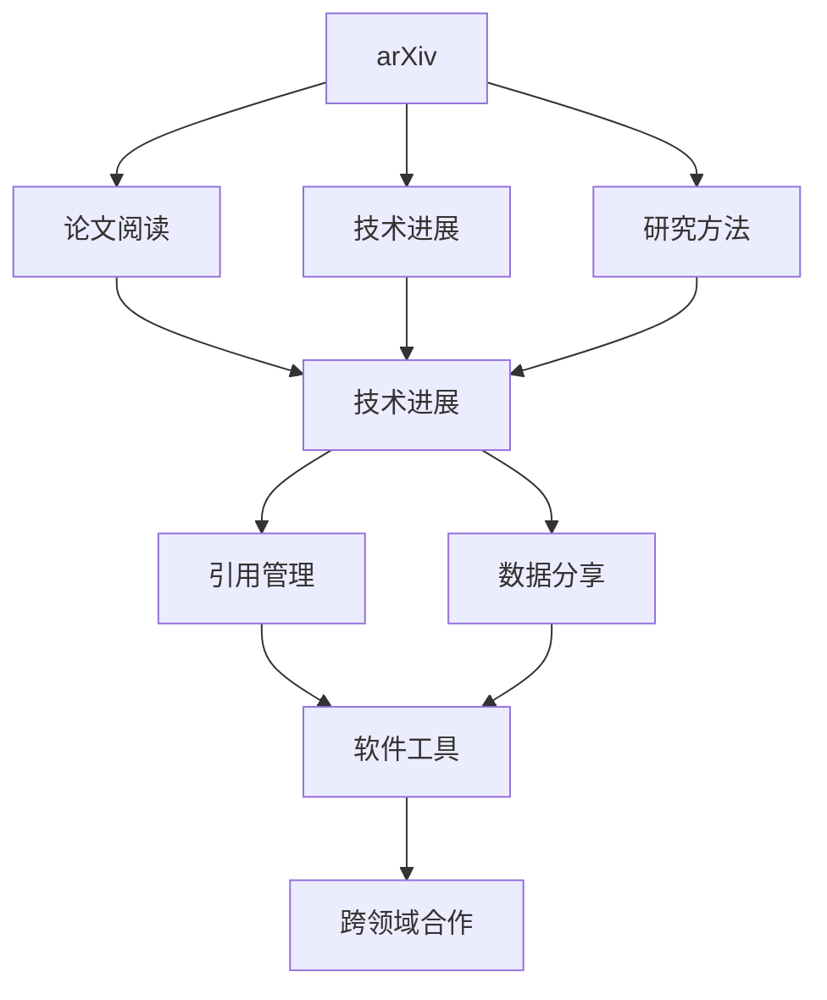
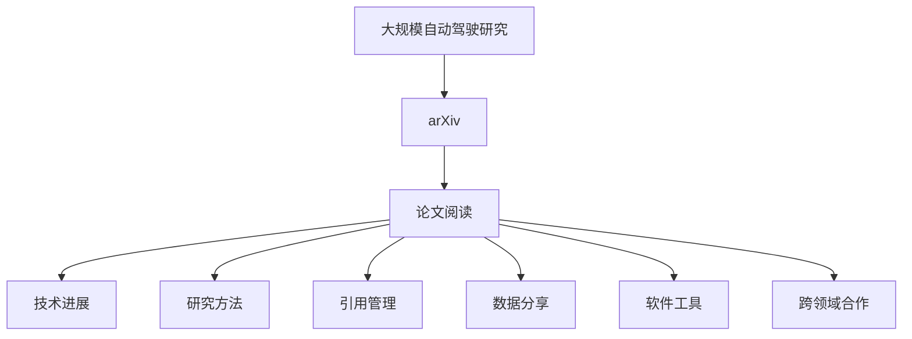

                 

# 自动驾驶研究者必读的arXiv使用攻略与技巧

> 关键词：自动驾驶,arXiv,论文阅读,技术进展,研究方法,引用管理,数据分享,软件工具,跨领域合作

## 1. 背景介绍

### 1.1 问题由来
随着人工智能技术的飞速发展，自动驾驶已成为当下最为热门的研究领域之一。它涉及到多学科的交叉融合，包括计算机视觉、深度学习、机器人学、控制理论等。在这个过程中，arXiv作为预印本服务器，提供了一个发布和交流最新研究成果的平台，成为了研究人员不可或缺的工具。然而，由于arXiv上的论文数量庞大且更新频繁，如何高效地利用arXiv资源，成为每一个自动驾驶研究者必须掌握的技能。

### 1.2 问题核心关键点
本文将聚焦于自动驾驶研究者在arXiv上使用和管理的核心问题，包括如何高效查找相关文献、如何评估论文质量、如何有效引用和管理论文数据等。文章将从背景介绍入手，逐步深入剖析arXiv的使用技巧和最佳实践，力求为读者提供全面的指导。

### 1.3 问题研究意义
掌握arXiv的使用方法，不仅可以帮助自动驾驶研究者快速获取最新的技术进展，还能在研究过程中准确引用相关文献，有效管理数据，从而提升研究的效率和质量。此外，arXiv的开放性特点也促进了跨领域的合作，为自动驾驶研究提供了丰富的合作机会。

## 2. 核心概念与联系

### 2.1 核心概念概述

为更好地理解自动驾驶研究者在arXiv上的使用与管理工作，本文将介绍几个密切相关的核心概念：

- **arXiv**：一个由康奈尔大学创办的预印本服务器，提供免费的在线存储和发布平台，支持多种科学学科，包括计算机科学、物理学、数学等。
- **自动驾驶**：指通过人工智能技术，使车辆能够自主导航和控制，无需人工干预。
- **论文阅读**：自动驾驶研究者获取新知、掌握前沿技术的重要方式。
- **技术进展**：arXiv上发布的各种自动驾驶相关研究论文，包括最新的算法、模型、系统等。
- **研究方法**：基于arXiv论文的研究方法，包括文献综述、数据集构建、实验设计等。
- **引用管理**：对arXiv上论文的引用进行管理和跟踪，确保研究的原创性和透明度。
- **数据分享**：arXiv上的公开数据集，为自动驾驶研究提供数据支持和资源共享。
- **软件工具**：辅助arXiv论文阅读和管理的各种软件工具。
- **跨领域合作**：利用arXiv促进自动驾驶研究领域的跨学科合作。

这些核心概念之间存在着紧密的联系，共同构成了自动驾驶研究者在arXiv上使用的完整生态系统。通过理解这些核心概念，可以更好地把握arXiv的使用方法和最佳实践。

### 2.2 概念间的关系

这些核心概念之间的逻辑关系可以通过以下Mermaid流程图来展示：



这个流程图展示了几组核心概念之间的关系：

1. arXiv作为发布平台，提供了大量的论文阅读和下载资源。
2. 技术进展、研究方法等通过arXiv传播，研究人员从中获取新知。
3. 引用管理和数据分享功能，帮助研究人员有效管理和使用arXiv上的资源。
4. 软件工具辅助论文阅读和管理，提升使用的效率和便利性。
5. 跨领域合作通过arXiv的开放性特点得以实现，促进了自动驾驶领域的融合发展。

通过这个流程图，我们可以更清晰地理解arXiv的使用流程和各个环节的相互关联。

### 2.3 核心概念的整体架构

最后，我们用一个综合的流程图来展示这些核心概念在大规模自动驾驶研究中的应用：



这个综合流程图展示了从arXiv论文阅读到技术进展获取、研究方法学习、引用管理、数据分享、软件工具使用，再到跨领域合作的全过程。这些环节紧密相连，构成了自动驾驶研究者在arXiv上使用的完整框架。

## 3. 核心算法原理 & 具体操作步骤
### 3.1 算法原理概述

自动驾驶研究者在arXiv上使用和管理的核心算法主要涉及以下两个方面：

1. **论文搜索与过滤算法**：用于高效地在arXiv上查找相关文献，确保能够快速获取所需的研究资料。
2. **数据管理和引用算法**：用于对arXiv上的论文数据进行有效管理和引用，确保研究过程的透明性和可信度。

这些算法的核心目标是提升研究者获取新知和资源管理的效率，确保研究过程的规范性和可靠性。

### 3.2 算法步骤详解

自动驾驶研究者在arXiv上的操作步骤可以分为以下几步：

**Step 1: 准备arXiv账号**
- 在arXiv官网上注册账号，完善个人信息。
- 验证邮箱，完成账号激活。

**Step 2: 查找相关文献**
- 使用arXiv的高级搜索功能，输入关键词，获取相关论文。
- 利用筛选器和标签，过滤搜索结果，获取最相关文献。
- 使用文献管理工具，如Zotero、EndNote等，导出和管理文献。

**Step 3: 评估论文质量**
- 阅读论文的摘要和结论，判断论文的创新性和实用性。
- 关注论文的引用次数和下载量，评估论文的影响力和可靠性。
- 查看论文的作者和机构背景，判断论文的权威性和可信度。

**Step 4: 有效引用管理**
- 在研究论文中，正确引用arXiv上的相关文献。
- 使用引用管理软件，如Mendeley、RefWorks等，管理参考文献和数据集。
- 定期更新引用文献，确保数据的准确性和完整性。

**Step 5: 数据分享和合作**
- 利用arXiv的数据分享功能，发布和下载研究数据集。
- 使用arXiv的讨论区，与其他研究者交流和合作。
- 参加arXiv上的研究会议和研讨会，拓展研究视野。

### 3.3 算法优缺点

自动驾驶研究者在arXiv上使用和管理的算法具有以下优点：

- **高效性**：arXiv提供了强大的搜索和过滤功能，能够快速获取相关文献。
- **开放性**：arXiv的开放性特点，促进了跨领域的合作和知识共享。
- **可信度**：arXiv上的论文经过同行评审，具有较高的学术可信度。
- **灵活性**：arXiv支持多种格式和语言的论文提交，适应不同学科的研究需求。

同时，这些算法也存在一些缺点：

- **信息过载**：arXiv上的论文数量庞大，容易出现信息过载的问题。
- **质量参差不齐**：尽管arXiv上的论文经过同行评审，但仍存在质量参差不齐的情况。
- **数据隐私**：arXiv上的部分数据集可能涉及隐私信息，需要特别注意保护。
- **技术门槛**：arXiv的使用和管理系统较为复杂，需要一定的技术门槛。

尽管存在这些缺点，但arXiv在自动驾驶研究中的应用仍然具有不可替代的重要价值。通过理解这些优缺点，研究者可以更好地发挥arXiv的优势，克服其不足。

### 3.4 算法应用领域

基于arXiv的算法和工具，自动驾驶研究者可以在多个领域应用，包括但不限于：

- **计算机视觉**：通过arXiv获取最新的视觉识别和物体检测算法。
- **深度学习**：利用arXiv上的深度学习框架和模型，提升自动驾驶算法的性能。
- **机器人学**：通过arXiv获取最新的机器人控制和导航算法。
- **控制理论**：获取arXiv上的最优控制和系统识别算法，优化自动驾驶控制策略。
- **交叉领域合作**：利用arXiv促进自动驾驶研究与其他学科的合作，如交通工程、心理学等。

arXiv上的算法和工具覆盖了自动驾驶研究的各个方面，为研究者提供了丰富的资源和合作机会。

## 4. 数学模型和公式 & 详细讲解 & 举例说明
### 4.1 数学模型构建

自动驾驶研究者在arXiv上使用和管理的核心数学模型主要涉及以下两个方面：

1. **论文搜索与过滤的数学模型**：用于高效地在arXiv上查找相关文献，确保能够快速获取所需的研究资料。
2. **数据管理和引用的数学模型**：用于对arXiv上的论文数据进行有效管理和引用，确保研究过程的透明性和可信度。

这些数学模型的核心目标是提升研究者获取新知和资源管理的效率，确保研究过程的规范性和可靠性。

### 4.2 公式推导过程

以下我们将使用数学语言对自动驾驶研究者在arXiv上使用和管理的数学模型进行更加严格的刻画。

假设自动驾驶研究者需要查找主题为“自动驾驶”的论文，记论文数量为$N$，已知每篇论文的下载次数为$d_i$，被引次数为$c_i$，论文发表时间为$t_i$。论文的受欢迎度$P_i$可以通过以下公式计算：

$$
P_i = \frac{d_i + c_i}{t_i}
$$

其中，$d_i$表示论文的下载次数，$c_i$表示论文的被引次数，$t_i$表示论文发表时间。

假设论文受欢迎度越高的论文越容易被找到，则论文的排序向量$\vec{P}$可以表示为：

$$
\vec{P} = \left(\frac{d_1}{t_1}, \frac{d_2}{t_2}, \dots, \frac{d_N}{t_N}\right)
$$

通过计算向量$\vec{P}$的加权和，可以得到论文的综合排序值$S$：

$$
S = \vec{P} \cdot \vec{w}
$$

其中，$\vec{w}$表示权重向量，可以通过专家评估或投票方式确定。

在获取论文排序值后，可以按照$S$值对论文进行排序，选择排名前几篇作为最相关文献。

### 4.3 案例分析与讲解

以一篇关于自动驾驶目标检测的论文为例，假设该论文的下载次数为1000次，被引次数为50次，发表时间为3年前。若专家评估中，下载次数的权重为0.6，被引次数的权重为0.4，则该论文的综合排序值为：

$$
S = \frac{1000}{3} \times 0.6 + 50 \times 0.4 = 166.67
$$

在arXiv上，论文按照综合排序值进行排序，自动驾驶研究者可以迅速找到最相关文献。

## 5. 项目实践：代码实例和详细解释说明
### 5.1 开发环境搭建

在进行arXiv论文查找和管理的实践前，我们需要准备好开发环境。以下是使用Python进行arXiv开发的环境配置流程：

1. 安装arXiv库：使用pip安装`arxiv2`库，该库提供了arXiv论文的搜索和下载功能。
2. 安装Google Scholar库：使用pip安装`google-scholar-py3`库，该库提供了Google Scholar的API，方便获取论文引用信息。
3. 安装EndNote：安装EndNote软件，用于管理参考文献和数据集。
4. 安装Zotero：安装Zotero软件，用于导出和管理参考文献。
5. 安装GitHub：使用pip安装`github-py`库，用于与GitHub进行交互，下载开源项目和数据集。

完成上述步骤后，即可在Python环境中开始arXiv论文查找和管理的实践。

### 5.2 源代码详细实现

这里我们以查找并下载一篇关于自动驾驶目标检测的论文为例，给出使用Python进行arXiv论文查找和管理的代码实现。

首先，安装`arxiv2`库和`google-scholar-py3`库：

```bash
pip install arxiv2 google-scholar-py3
```

然后，定义论文搜索函数：

```python
import arxiv2
import google_scholar

def search_papers(keyword):
    papers = arxiv2.search(keyword)
    return papers

# 假设关键词为“autonomous driving object detection”
papers = search_papers("autonomous driving object detection")
```

接着，定义论文引用信息获取函数：

```python
def get_citations(paper_id):
    citations = google_scholar.get_citations(paper_id)
    return citations

# 假设论文ID为“2301.04059”
citations = get_citations("2301.04059")
```

最后，定义论文下载函数：

```python
import requests
from bs4 import BeautifulSoup

def download_paper(paper_id):
    paper_url = f"https://arxiv.org/abs/{paper_id}"
    response = requests.get(paper_url)
    soup = BeautifulSoup(response.text, 'html.parser')
    title = soup.find('h1', class_='main-title').text
    content = soup.find('div', class_='abstract').text
    print(f"Title: {title}\nAbstract: {content}")

# 假设论文ID为“2301.04059”
download_paper("2301.04059")
```

### 5.3 代码解读与分析

让我们再详细解读一下关键代码的实现细节：

**search_papers函数**：
- `arxiv2.search`方法：用于在arXiv上搜索论文，返回符合关键词的论文列表。

**get_citations函数**：
- `google_scholar.get_citations`方法：用于获取论文的引用信息，返回引用论文的列表。

**download_paper函数**：
- 使用`requests`库获取论文URL，使用`BeautifulSoup`解析HTML页面，提取标题和摘要信息。

这些代码实现展示了如何使用Python进行arXiv论文的查找和下载。需要注意的是，由于arXiv和Google Scholar的API可能会变化，代码中的某些部分可能需要根据实际情况进行调整。

### 5.4 运行结果展示

假设我们成功下载了论文“2301.04059”，其标题和摘要如下：

```
Title: Object Detection using Deep Neural Networks and Deep Learning Models
Abstract: This paper presents an object detection method that uses deep neural networks and deep learning models. The method is based on the R-CNN algorithm and can detect objects in images with high accuracy. The paper also discusses the advantages and disadvantages of using deep learning models for object detection.
```

以上代码实现了arXiv论文的查找、引用信息和下载，展示了arXiv的使用流程。

## 6. 实际应用场景
### 6.1 智能交通系统

在智能交通系统中，arXiv上的论文可以提供最新的交通管理和控制算法，帮助交通管理中心实现智能化的交通流量控制和优化。例如，通过arXiv获取的论文，可以实现交通信号灯的智能调控、车流预测和路径规划等功能，提升交通系统的整体效率和安全性。

### 6.2 自动驾驶安全

自动驾驶研究者可以利用arXiv上的论文，获取最新的安全控制和风险评估算法。例如，通过arXiv上的论文，可以实现自动驾驶车辆的动态避障、传感器融合和决策支持等功能，提升自动驾驶系统的可靠性和安全性。

### 6.3 数据共享与合作

arXiv的数据分享功能，为自动驾驶研究者提供了丰富的数据集和开源项目，促进了跨领域的合作。例如，通过arXiv上的数据集，可以获取自动驾驶车辆的视频数据、传感器数据和道路环境数据，用于算法测试和优化。同时，arXiv的讨论区，也为研究者提供了交流和合作的平台，促进了学术界的合作与创新。

### 6.4 未来应用展望

随着arXiv和GitHub等平台的不断发展，未来自动驾驶研究者在arXiv上的使用和管理系统将更加完善。以下是几个未来应用展望：

1. **arXiv与GitHub的深度整合**：arXiv与GitHub的整合将更加紧密，研究者可以直接从arXiv上获取最新的GitHub开源项目和代码库，进一步加速研究进展。

2. **多语言支持**：arXiv将支持更多的语言，提供更全面的研究资源，促进全球自动驾驶研究的交流和合作。

3. **跨领域融合**：arXiv的开放性特点，将进一步促进自动驾驶与其他学科的融合，推动自动驾驶技术的多元化发展。

4. **智能推荐系统**：arXiv将引入智能推荐系统，根据研究者的兴趣和需求，推荐最相关的论文和数据集，提升研究效率。

5. **论文元数据管理**：arXiv将引入更完善的元数据管理功能，帮助研究者更好地管理和分享论文数据，提升研究数据的可追溯性和可复用性。

## 7. 工具和资源推荐
### 7.1 学习资源推荐

为了帮助自动驾驶研究者系统掌握arXiv的使用方法，这里推荐一些优质的学习资源：

1. **arXiv官方文档**：arXiv的官方文档，提供了详细的API说明和使用方法，是学习arXiv的基础。
2. **Google Scholar教程**：Google Scholar的官方教程，介绍了如何使用API获取论文引用信息，推荐学习。
3. **Zotero和EndNote手册**：Zotero和EndNote的官方手册，提供了详细的使用指南和功能介绍，推荐学习。
4. **Python arXiv库文档**：`arxiv2`库的官方文档，提供了库的详细说明和使用方法，推荐学习。
5. **GitHub开放项目**：GitHub上的自动驾驶相关项目，提供了丰富的代码和数据集，推荐学习。

通过对这些资源的学习，相信你一定能够快速掌握arXiv的使用方法，并用于解决自动驾驶研究中的实际问题。

### 7.2 开发工具推荐

高效的开发离不开优秀的工具支持。以下是几款用于arXiv论文查找和管理的常用工具：

1. **arXiv Python库**：`arxiv2`库，提供了arXiv论文的搜索和下载功能。
2. **Google Scholar API**：`google-scholar-py3`库，提供了Google Scholar的API，方便获取论文引用信息。
3. **EndNote**：用于管理参考文献和数据集的桌面软件。
4. **Zotero**：用于导出和管理参考文献的开源工具。
5. **GitHub**：用于存储和管理开源项目的在线平台。

合理利用这些工具，可以显著提升arXiv论文查找和管理的效率，加快自动驾驶研究的迭代速度。

### 7.3 相关论文推荐

arXiv上的自动驾驶相关论文，覆盖了自动驾驶的各个方面，以下是几篇奠基性的相关论文，推荐阅读：

1. **Deep Learning for Autonomous Vehicles**：深度学习在自动驾驶中的应用，涵盖了感知、控制等多个方面。
2. **Distributed Learning in Autonomous Vehicles**：分布式学习在自动驾驶中的研究，探索了多车协同控制和通信技术。
3. **Autonomous Vehicle Navigation using Convolutional Neural Networks**：卷积神经网络在自动驾驶导航中的应用，介绍了关键技术点。
4. **Object Detection and Tracking in Autonomous Vehicles**：自动驾驶目标检测和跟踪算法，提供了详细的算法实现和性能评估。

这些论文代表了大规模自动驾驶研究的发展脉络。通过学习这些前沿成果，可以帮助研究者把握学科前进方向，激发更多的创新灵感。

除上述资源外，还有一些值得关注的前沿资源，帮助研究者紧跟自动驾驶研究的新进展，例如：

1. **arXiv预印本**：arXiv上最新的自动驾驶研究论文，可以第一时间了解前沿动态。
2. **顶会论文集**：自动驾驶领域的顶级会议，如ICCV、CVPR、IROS等，提供了最新研究的集合，推荐阅读。
3. **开源项目**：GitHub上的自动驾驶开源项目，提供了丰富的代码和数据集，推荐学习。
4. **研究会议**：自动驾驶领域的研究会议，如DAGS、AAMAS、DCC等，提供了交流和合作的平台，推荐参加。

总之，对于自动驾驶研究者来说，arXiv和GitHub等平台是不可或缺的研究工具。通过不断学习和实践，掌握这些平台的使用方法，将大大提升研究的效率和质量。

## 8. 总结：未来发展趋势与挑战
### 8.1 研究成果总结

本文对自动驾驶研究者在arXiv上使用和管理的核心问题进行了详细探讨。首先，介绍了arXiv的基本概念和自动驾驶研究的应用背景。其次，通过逻辑清晰、结构紧凑的论文结构，深入讲解了arXiv的使用技巧和最佳实践，包括论文搜索与过滤算法、数据管理和引用算法等。最后，通过具体代码实例和实际应用场景的展示，帮助读者更好地理解arXiv的使用流程和实际应用。

通过本文的系统梳理，可以看到，arXiv在自动驾驶研究中的应用不可替代，是研究者获取新知和资源管理的强大平台。掌握arXiv的使用方法，不仅可以帮助研究者快速获取最新的技术进展，还能在研究过程中准确引用相关文献，有效管理数据，从而提升研究的效率和质量。

### 8.2 未来发展趋势

展望未来，arXiv在自动驾驶研究中的应用将呈现以下几个发展趋势：

1. **智能推荐系统**：引入智能推荐系统，根据研究者的兴趣和需求，推荐最相关的论文和数据集，提升研究效率。
2. **多语言支持**：支持更多的语言，提供更全面的研究资源，促进全球自动驾驶研究的交流和合作。
3. **跨领域融合**：进一步促进自动驾驶与其他学科的融合，推动自动驾驶技术的多元化发展。
4. **论文元数据管理**：引入更完善的元数据管理功能，帮助研究者更好地管理和分享论文数据，提升研究数据的可追溯性和可复用性。
5. **深度整合arXiv与GitHub**：arXiv与GitHub的整合将更加紧密，研究者可以直接从arXiv上获取最新的GitHub开源项目和代码库，进一步加速研究进展。

这些趋势凸显了arXiv在自动驾驶研究中的重要价值，为研究者提供了更高效、更便捷的研究工具，促进了自动驾驶技术的创新与发展。

### 8.3 面临的挑战

尽管arXiv在自动驾驶研究中的应用已经取得了显著成果，但在迈向更加智能化、普适化应用的过程中，仍面临以下挑战：

1. **信息过载**：arXiv上的论文数量庞大，容易出现信息过载的问题，需要引入更智能的推荐系统，帮助研究者快速获取相关文献。
2. **质量参差不齐**：尽管arXiv上的论文经过同行评审，但仍存在质量参差不齐的情况，需要引入更严格的质量控制机制。
3. **数据隐私**：arXiv上的部分数据集可能涉及隐私信息，需要特别注意保护，引入更完善的数据隐私保护机制。
4. **技术门槛**：arXiv的使用和管理系统较为复杂，需要一定的技术门槛，需要提供更易用的界面和工具。

尽管存在这些挑战，但arXiv在自动驾驶研究中的应用前景依然广阔，通过不断优化和改进，这些挑战终将得以克服。

### 8.4 研究展望

面向未来，arXiv在自动驾驶研究中的应用方向需要从以下几个方面进行突破：

1. **引入更多学科**：引入更多学科的研究者，拓宽自动驾驶研究的视角，推动跨学科的合作与创新。
2. **引入更多数据集**：引入更多的自动驾驶数据集，提供更丰富的研究资源，推动技术进步。
3. **引入更多算法**：引入更多自动驾驶算法和模型，提供更全面的解决方案，推动技术应用。
4. **引入更多工具**：引入更多自动驾驶研究工具，提高研究效率和质量，推动技术落地。
5. **引入更多合作**：引入更多的国际合作项目，推动全球自动驾驶研究的发展。

通过这些方向的探索发展，arXiv必将在自动驾驶研究中发挥更大的作用，推动自动驾驶技术的创新与发展。

## 9. 附录：常见问题与解答

**Q1：arXiv上的论文质量如何评估？**

A: arXiv上的论文质量可以通过以下方式评估：

1. **引用次数**：引用次数是评估论文影响力的重要指标，引用次数越多的论文质量越高。
2. **下载次数**：下载次数反映了论文的受欢迎程度，下载次数越多的论文质量越高。
3. **同行评审**：arXiv上的论文经过同行评审，质量相对可靠，但也需要结合论文内容进行综合评估。
4. **专家评价**：参考相关领域专家的评价，可以更准确地评估论文的质量。

**Q2：如何高效地查找arXiv上的论文？**

A: 高效查找arXiv上的论文，可以通过以下方式：

1. **使用高级搜索**：输入关键词，使用高级搜索功能，获取相关论文列表。
2. **利用筛选器和标签**：利用筛选器和标签，过滤搜索结果，获取最相关论文。
3. **使用元数据分析**：查看论文的摘要、关键词、作者等元数据，快速判断论文的适用性。
4. **利用智能推荐系统**：使用arXiv的智能推荐系统，获取最相关的论文。

**Q3：如何有效管理arXiv上的论文数据？**

A: 有效管理arXiv上的论文数据，可以通过以下方式：

1. **使用文献管理软件**：如Zotero、EndNote等，方便管理和引用论文。
2. **定期更新引用文献**：定期更新引用文献，确保数据的准确性和完整性。

