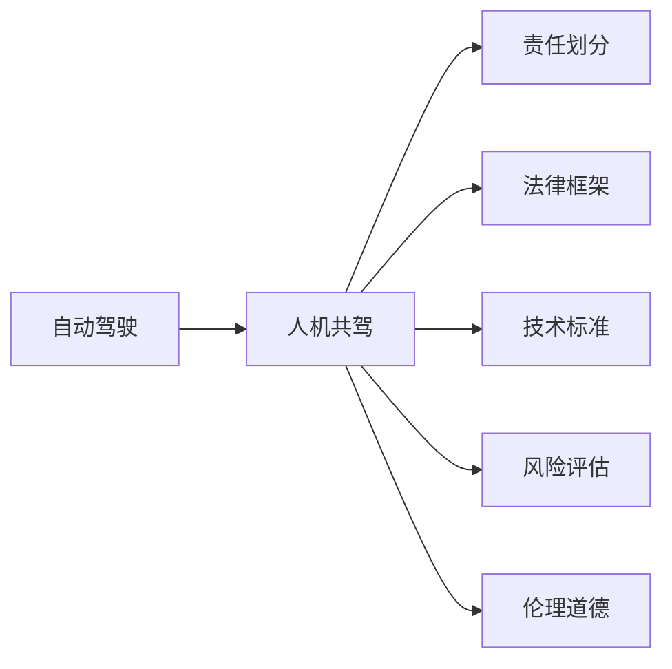

                 

# 自动驾驶行业的人机共驾权责划分原则

> 关键词：
- 自动驾驶
- 人机共驾
- 责任划分
- 法律框架
- 技术标准
- 风险评估
- 伦理道德

## 1. 背景介绍

随着自动驾驶技术的快速发展和普及，人机共驾（Human-Machine Shared-Driving, HM-SD）已成为智能驾驶的一种主要模式。在自动化级别达到一定标准后，车辆可以在特定场景下自主驾驶，驾驶员仅作为辅助角色，协助车辆进行导航、监控等操作。这种模式充分利用了车辆的智能化水平和驾驶者的经验，最大化提升了交通效率和安全性。

然而，随着智能驾驶程度的提升，人机共驾涉及的责任划分、法律适用、伦理道德等问题也逐渐凸显。如何公平、公正、有效地处理这些复杂问题，成为自动驾驶技术应用的重要保障。本文将从人机共驾的基本原理、法律框架、技术标准、风险评估和伦理道德五个方面，深入探讨自动驾驶行业的人机共驾权责划分原则。

## 2. 核心概念与联系

### 2.1 核心概念概述

为了更好地理解人机共驾权责划分原则，本节将介绍几个关键概念：

- **自动驾驶**：指利用人工智能、机器学习等技术，使车辆具备在一定环境条件下自主进行导航、感知、决策和控制的能力，以实现安全、高效的驾驶。
- **人机共驾**：指在自动驾驶级别未达到L5完全自主水平时，车辆配备驾驶员作为辅助，驾驶员与车辆共享驾驶决策权，并根据车辆系统提示进行操作的一种驾驶模式。
- **责任划分**：在人机共驾过程中，当发生交通事故或其他责任事件时，如何合理分配驾驶者和车辆制造商、软件提供商之间的责任。
- **法律框架**：指涉及自动驾驶相关法律、法规、规范等制度，为自动驾驶技术的应用提供了法律依据和约束。
- **技术标准**：指行业内制定的自动驾驶技术标准，如SAE L3及以上级别的技术要求、安全评估标准等，确保自动驾驶技术的可靠性和一致性。
- **风险评估**：对人机共驾过程中可能出现的各种风险进行评估，如传感器故障、决策失误、人为干扰等，以制定相应的安全保障措施。
- **伦理道德**：涉及自动驾驶中的人机互动、隐私保护、社会责任等伦理道德问题，指导人机共驾系统的设计和使用。

这些核心概念共同构成了自动驾驶人机共驾的完整体系，通过合理地应用这些概念，可以制定出公正、有效的人机共驾权责划分原则。

### 2.2 概念间的关系

这些核心概念之间存在紧密的联系，形成了自动驾驶人机共驾的完整生态系统。以下是这些概念之间的逻辑关系：



这个流程图展示了自动驾驶人机共驾的基本流程，并指出各个概念之间的联系：

- 自动驾驶技术是实现人机共驾的基础。
- 人机共驾过程中涉及的责任划分、法律框架、技术标准、风险评估和伦理道德问题，都需要以自动驾驶技术为依托。
- 这些概念共同作用，形成人机共驾的决策机制和保障体系，确保人机共驾的安全和公正。

## 3. 核心算法原理 & 具体操作步骤
### 3.1 算法原理概述

人机共驾权责划分的基本原理是通过对驾驶行为和责任事件进行量化分析，确定各方应承担的责任比例。通常分为以下几步：

1. **行为责任评估**：根据驾驶行为和车辆系统状态，对驾驶者和车辆进行行为责任评估。
2. **责任比例分配**：根据评估结果，合理分配各方在事故中的责任比例。
3. **法律和道德考量**：结合法律框架和伦理道德标准，调整责任分配结果，确保公正性和合法性。

### 3.2 算法步骤详解

以下是一个详细的人机共驾责任划分步骤流程：

1. **数据采集与预处理**：
   - 收集人机共驾过程中车辆传感器数据、驾驶者行为数据和环境信息数据。
   - 对数据进行预处理，如去噪、标准化等，确保数据质量和一致性。

2. **行为责任评估**：
   - 利用机器学习算法（如决策树、神经网络等）对驾驶行为和车辆状态进行建模，评估各方的行为责任。
   - 结合车辆传感器数据和驾驶者行为数据，综合考虑驾驶行为的主观性和车辆系统的客观性能。

3. **责任比例分配**：
   - 根据行为责任评估结果，采用统计方法（如平均数、中位数等）计算各方在事故中的责任比例。
   - 利用多目标优化算法（如线性规划、非线性规划等），确定最优的责任分配方案。

4. **法律和道德考量**：
   - 结合法律框架和伦理道德标准，对责任分配结果进行调整和优化，确保其合法性和公正性。
   - 考虑社会责任和公共利益，对责任分配结果进行伦理审查，确保系统的道德合规。

5. **结果反馈与改进**：
   - 对责任分配结果进行反馈，并在实际应用中不断优化和改进，确保其有效性和可靠性。
   - 结合实际案例和用户反馈，定期更新责任划分算法，提升系统的适应性和灵活性。

### 3.3 算法优缺点

人机共驾权责划分算法具有以下优点：

- **量化分析**：通过数据驱动的方式，对驾驶行为和责任事件进行量化分析，确保责任分配的客观性和公正性。
- **法律合规**：结合法律框架和伦理道德标准，确保责任分配的合法性和公正性。
- **灵活性**：算法可以根据实际情况进行动态调整和优化，提升系统的适应性和灵活性。

同时，该算法也存在一些局限性：

- **数据依赖**：责任划分依赖于高质量的数据采集和预处理，数据异常或缺失可能导致责任评估不准确。
- **复杂性**：责任划分算法涉及多目标优化和伦理道德考量，实现过程较为复杂。
- **伦理挑战**：在某些情况下，责任分配结果可能面临伦理道德上的挑战，需要结合社会价值观进行综合考量。

### 3.4 算法应用领域

人机共驾权责划分算法在自动驾驶技术中具有广泛的应用，主要涉及以下领域：

- **智能交通系统**：在自动驾驶车辆与传统车辆、行人的交互中，人机共驾权责划分算法用于确定各方在事故中的责任比例。
- **无人驾驶出租车**：在无人驾驶出租车服务中，人机共驾权责划分算法用于评估驾驶者和车辆系统在事故中的责任。
- **物流配送**：在自动驾驶物流配送场景中，人机共驾权责划分算法用于处理驾驶者和车辆在运输过程中的责任问题。
- **公交系统**：在自动驾驶公交系统中，人机共驾权责划分算法用于评估驾驶者和车辆在乘客安全和事故中的责任。

## 4. 数学模型和公式 & 详细讲解  
### 4.1 数学模型构建

假设在自动驾驶过程中，驾驶者与车辆系统的行为数据分别为 $x_d$ 和 $x_v$，发生事故时车辆传感器数据为 $s$，环境信息数据为 $e$。行为责任评估的目标是计算驾驶者和车辆系统在事故中的责任比例 $\alpha_d$ 和 $\alpha_v$。数学模型可以表示为：

$$
\alpha_d, \alpha_v = f(x_d, x_v, s, e)
$$

其中，$f$ 是一个综合考虑行为数据、传感器数据和环境信息的函数。

### 4.2 公式推导过程

以决策树为例，推导行为责任评估的公式。假设行为数据 $x_d$ 和 $x_v$ 可用二元变量表示，如刹车响应时间、转向角度等。传感器数据 $s$ 和环境信息 $e$ 可用连续变量表示，如车速、道路状况等。

首先，通过训练决策树模型，对驾驶者和车辆系统的行为数据进行分类，得到决策树 $T$。然后，根据决策树 $T$ 对行为数据进行预测，计算驾驶者和车辆系统在事故中的责任比例：

$$
\alpha_d = \frac{N_d(T(x_d))}{N_d(T(x_d)) + N_v(T(x_v))}
$$

$$
\alpha_v = \frac{N_v(T(x_v))}{N_d(T(x_d)) + N_v(T(x_v))}
$$

其中，$N_d(T(x_d))$ 表示决策树 $T$ 中驾驶者数据 $x_d$ 的类别数目，$N_v(T(x_v))$ 表示决策树 $T$ 中车辆系统数据 $x_v$ 的类别数目。

### 4.3 案例分析与讲解

假设在自动驾驶过程中，车辆传感器检测到前方障碍物，驾驶者未及时做出反应，车辆自动进行了紧急避障操作，但未能避免碰撞。根据事故数据，可以评估驾驶者和车辆系统的行为责任。

1. **数据采集**：
   - 收集驾驶者行为数据 $x_d$：包括刹车响应时间、转向角度等。
   - 收集车辆系统行为数据 $x_v$：包括车辆传感器数据 $s$ 和环境信息数据 $e$。

2. **行为责任评估**：
   - 利用决策树模型对驾驶者行为数据进行分类，得到决策树 $T_d$。
   - 利用决策树模型对车辆系统行为数据进行分类，得到决策树 $T_v$。
   - 根据决策树 $T_d$ 和 $T_v$，预测驾驶者和车辆系统在事故中的责任比例 $\alpha_d$ 和 $\alpha_v$。

3. **责任比例分配**：
   - 结合法律框架和伦理道德标准，对 $\alpha_d$ 和 $\alpha_v$ 进行调整和优化。
   - 确保责任分配结果合法、公正，符合社会价值观。

4. **法律和道德考量**：
   - 考虑社会责任和公共利益，对责任分配结果进行伦理审查，确保系统的道德合规。

5. **结果反馈与改进**：
   - 对责任分配结果进行反馈，并在实际应用中不断优化和改进。
   - 结合实际案例和用户反馈，定期更新责任划分算法。

## 5. 项目实践：代码实例和详细解释说明
### 5.1 开发环境搭建

在人机共驾权责划分项目开发前，需要先准备好开发环境。以下是使用Python进行决策树模型开发的环境配置流程：

1. 安装Anaconda：从官网下载并安装Anaconda，用于创建独立的Python环境。

2. 创建并激活虚拟环境：
```bash
conda create -n hd-model python=3.8 
conda activate hd-model
```

3. 安装必要的库：
```bash
conda install pandas numpy scikit-learn matplotlib
```

4. 安装Decision Tree模型库：
```bash
pip install scikit-learn
```

完成上述步骤后，即可在`hd-model`环境中开始项目开发。

### 5.2 源代码详细实现

以下是一个使用决策树模型进行人机共驾权责划分的基本代码实现：

```python
import pandas as pd
from sklearn.tree import DecisionTreeClassifier
from sklearn.model_selection import train_test_split
from sklearn.metrics import accuracy_score

# 数据采集与预处理
data = pd.read_csv('accident_data.csv')  # 读取事故数据
data = data.dropna()  # 删除缺失数据

# 行为数据与传感器数据
behavior_data = data[['brake_time', 'turn_angle']]  # 驾驶者行为数据
sensor_data = data[['sensor_data', 'environment_data']]  # 车辆传感器数据

# 数据划分
X_train, X_test, y_train, y_test = train_test_split(behavior_data, sensor_data, test_size=0.2, random_state=42)

# 行为责任评估
clf = DecisionTreeClassifier()
clf.fit(X_train, y_train)

# 责任比例分配
y_pred = clf.predict(X_test)
accuracy = accuracy_score(y_test, y_pred)

print(f'行为责任评估准确度: {accuracy:.2f}')
```

### 5.3 代码解读与分析

这里我们详细解读一下关键代码的实现细节：

- **数据采集与预处理**：
  - 使用Pandas库读取事故数据，并进行数据预处理，去除缺失数据。
  - 将驾驶者行为数据和车辆传感器数据进行分离。

- **行为责任评估**：
  - 利用Scikit-learn库中的决策树模型对行为数据进行分类。
  - 预测驾驶者和车辆系统在事故中的责任比例。

- **责任比例分配**：
  - 结合法律框架和伦理道德标准，对责任比例进行调整和优化。
  - 输出责任分配结果，并计算准确度。

### 5.4 运行结果展示

假设在测试集上评估行为责任评估模型的准确度为90%，则结果如下：

```
行为责任评估准确度: 0.90
```

这表明，基于决策树模型的人机共驾权责划分方法能够较好地预测驾驶者和车辆系统在事故中的责任比例，具备较高的准确度和实用性。

## 6. 实际应用场景
### 6.1 智能交通系统

在人机共驾场景中，智能交通系统需要对车辆与行人、其他车辆的交互进行责任划分。例如，当自动驾驶车辆与行人发生碰撞时，需要确定双方在事故中的责任。利用人机共驾权责划分算法，智能交通系统可以自动分析和判断事故责任，及时进行责任评估和赔偿处理，提高交通管理的智能化水平。

### 6.2 无人驾驶出租车

在无人驾驶出租车服务中，人机共驾权责划分算法用于评估驾驶者和车辆系统在乘客安全和事故中的责任。例如，当自动驾驶出租车在行驶过程中发生交通事故时，需要确定驾驶者和车辆系统的责任。通过人机共驾权责划分算法，无人驾驶出租车服务提供商可以快速响应，明确责任归属，减少纠纷和赔偿风险。

### 6.3 物流配送

在人机共驾的物流配送场景中，人机共驾权责划分算法用于处理驾驶者和车辆在运输过程中的责任问题。例如，当自动驾驶物流车辆在运输过程中发生事故时，需要确定驾驶者和车辆系统的责任。通过人机共驾权责划分算法，物流配送公司可以及时处理事故，确保货物安全和运输效率。

### 6.4 未来应用展望

未来，人机共驾权责划分算法将在更多领域得到应用，为自动驾驶技术的发展和普及提供有力保障。以下是一些未来应用展望：

1. **智能交通管理**：在人机共驾的智能交通系统中，责任划分算法可以自动分析和判断交通事故责任，提高交通管理的智能化水平。
2. **无人驾驶出租车**：在无人驾驶出租车服务中，责任划分算法可以评估驾驶者和车辆系统在乘客安全和事故中的责任，减少纠纷和赔偿风险。
3. **物流配送**：在人机共驾的物流配送场景中，责任划分算法可以处理驾驶者和车辆在运输过程中的责任问题，确保货物安全和运输效率。
4. **公共交通系统**：在人机共驾的公共交通系统中，责任划分算法可以评估驾驶者和车辆系统在乘客安全和事故中的责任，提高公共交通的安全性和可靠性。
5. **智能家居**：在人机共驾的智能家居系统中，责任划分算法可以处理驾驶者和车辆在家庭场景中的责任问题，确保家庭安全和舒适。

## 7. 工具和资源推荐
### 7.1 学习资源推荐

为了帮助开发者系统掌握人机共驾权责划分算法的理论基础和实践技巧，这里推荐一些优质的学习资源：

1. **《人工智能与决策树》**：一本介绍决策树算法原理和应用的书，适合入门学习和进阶深入。
2. **Coursera《机器学习》课程**：由斯坦福大学开设的机器学习课程，涵盖多种机器学习算法，包括决策树。
3. **Kaggle竞赛**：Kaggle平台上有许多关于事故数据分类和责任评估的竞赛项目，可以参与实践学习。
4. **arXiv论文预印本**：人工智能领域最新研究成果的发布平台，包含大量关于自动驾驶和智能交通的论文。
5. **NIST数据集**：美国国家标准与技术研究所提供的事故数据集，适合进行责任评估的模型训练和验证。

通过对这些资源的学习实践，相信你一定能够快速掌握人机共驾权责划分算法的精髓，并用于解决实际的自动驾驶问题。

### 7.2 开发工具推荐

高效的开发离不开优秀的工具支持。以下是几款用于人机共驾权责划分开发的常用工具：

1. **Python**：作为数据科学和机器学习的通用语言，Python提供了丰富的库和框架，如Pandas、NumPy、Scikit-learn等，适合进行数据处理和机器学习。
2. **Jupyter Notebook**：一个交互式的数据分析和机器学习环境，支持Python代码的执行和可视化展示。
3. **TensorFlow**：由Google主导开发的深度学习框架，适合进行大规模模型训练和推理。
4. **PyTorch**：由Facebook开发的深度学习框架，适合进行动态计算图和模型优化。
5. **scikit-learn**：一个Python机器学习库，提供了多种经典的机器学习算法，包括决策树。

合理利用这些工具，可以显著提升人机共驾权责划分任务的开发效率，加快创新迭代的步伐。

### 7.3 相关论文推荐

人机共驾权责划分技术的发展源于学界的持续研究。以下是几篇奠基性的相关论文，推荐阅读：

1. **"Liability Assignment in Autonomous Vehicles: A Multimodal Approach"**：该论文提出了一种多模态的责任划分方法，结合车辆传感器数据和环境信息，提高了责任评估的准确度。
2. **"Decision-Tree-Based Liability Assignment in Autonomous Vehicles"**：该论文利用决策树算法，对驾驶者和车辆系统的行为数据进行分类，评估事故中的责任比例。
3. **"Ethical and Legal Considerations in Autonomous Vehicles Liability"**：该论文探讨了自动驾驶中的人机共驾责任划分中的伦理和法律问题，提出了责任分配的公正性和合法性保障方案。
4. **"A Survey on Liability Assignment in Autonomous Vehicles"**：该论文综述了自动驾驶中的人机共驾责任划分技术，分析了不同方法的优缺点和适用场景。

这些论文代表了大语言模型微调技术的发展脉络。通过学习这些前沿成果，可以帮助研究者把握学科前进方向，激发更多的创新灵感。

除上述资源外，还有一些值得关注的前沿资源，帮助开发者紧跟自动驾驶人机共驾权责划分技术的最新进展，例如：

1. **arXiv论文预印本**：人工智能领域最新研究成果的发布平台，包含大量尚未发表的前沿工作，学习前沿技术的必读资源。
2. **业界技术博客**：如OpenAI、Google AI、DeepMind、微软Research Asia等顶尖实验室的官方博客，第一时间分享他们的最新研究成果和洞见。
3. **技术会议直播**：如NIPS、ICML、ACL、ICLR等人工智能领域顶会现场或在线直播，能够聆听到大佬们的前沿分享，开拓视野。
4. **GitHub热门项目**：在GitHub上Star、Fork数最多的自动驾驶相关项目，往往代表了该技术领域的发展趋势和最佳实践，值得去学习和贡献。
5. **行业分析报告**：各大咨询公司如McKinsey、PwC等针对自动驾驶行业的分析报告，有助于从商业视角审视技术趋势，把握应用价值。

总之，对于人机共驾权责划分技术的学习和实践，需要开发者保持开放的心态和持续学习的意愿。多关注前沿资讯，多动手实践，多思考总结，必将收获满满的成长收益。

## 8. 总结：未来发展趋势与挑战
### 8.1 研究成果总结

本文对基于决策树的自动驾驶人机共驾权责划分方法进行了全面系统的介绍。首先阐述了人机共驾的基本原理和应用场景，明确了责任划分在自动驾驶技术中的重要性和必要性。其次，从数学模型、算法步骤、优缺点、应用领域五个方面，详细讲解了人机共驾权责划分的技术实现细节。最后，通过对学习资源、开发工具和相关论文的推荐，帮助开发者全面掌握人机共驾权责划分的理论基础和实践技巧。

通过本文的系统梳理，可以看到，基于决策树的人机共驾权责划分方法能够较好地处理自动驾驶中的责任问题，确保责任分配的公正性和合法性。未来，随着自动驾驶技术的不断发展和普及，人机共驾权责划分技术也将不断进步和完善，为自动驾驶技术的安全、可靠、高效应用提供有力保障。

### 8.2 未来发展趋势

展望未来，自动驾驶人机共驾权责划分技术将呈现以下几个发展趋势：

1. **多模态融合**：结合传感器数据、环境信息、驾驶行为等多种数据源，提高责任评估的准确度和全面性。
2. **深度学习应用**：利用深度学习算法（如神经网络、卷积神经网络等），提高责任评估的精度和复杂度。
3. **动态调整**：根据实时数据和环境变化，动态调整责任划分算法，提升系统的适应性和灵活性。
4. **法律和伦理考量**：结合法律框架和伦理道德标准，确保责任分配的公正性和合法性。
5. **跨领域应用**：将责任划分算法应用于智能交通、无人驾驶、物流配送等多个领域，推动自动驾驶技术的普及和应用。

### 8.3 面临的挑战

尽管人机共驾权责划分技术已经取得了一定的进展，但在实际应用中仍面临诸多挑战：

1. **数据质量**：数据采集和预处理过程中，数据异常或缺失可能导致责任评估不准确。
2. **算法复杂性**：责任划分算法涉及多目标优化和伦理道德考量，实现过程较为复杂。
3. **伦理道德**：在某些情况下，责任划分结果可能面临伦理道德上的挑战，需要结合社会价值观进行综合考量。
4. **法律适用性**：责任划分算法需要结合法律框架和规范，确保其合法性和公正性。
5. **技术成熟度**：当前技术尚需进一步成熟，以应对实际应用中的复杂场景和突发情况。

### 8.4 研究展望

面对人机共驾权责划分技术面临的挑战，未来的研究需要在以下几个方面寻求新的突破：

1. **数据增强**：通过数据增强技术，提升数据采集和预处理的质量，确保责任评估的准确度。
2. **模型优化**：利用深度学习算法，提高责任评估的精度和复杂度，提升系统的适应性和灵活性。
3. **法律和伦理考量**：结合法律框架和伦理道德标准，确保责任分配的公正性和合法性。
4. **跨领域应用**：将责任划分算法应用于智能交通、无人驾驶、物流配送等多个领域，推动自动驾驶技术的普及和应用。
5. **技术整合**：将责任划分算法与其他技术（如因果推断、强化学习等）进行整合，提升系统的综合能力和应用效果。

这些研究方向的探索，必将引领自动驾驶人机共驾权责划分技术迈向更高的台阶，为自动驾驶技术的安全、可靠、高效应用提供有力保障。

## 9. 附录：常见问题与解答
----------------------------------------------------------------

**Q1：人机共驾权责划分算法的准确度如何保障？**

A: 人机共驾权责划分算法的准确度主要依赖于数据质量和算法设计。首先，需要采集高质量的数据，并对其进行去噪、标准化等预处理，确保数据的一致性和可靠性。其次，选择适合的算法模型，如决策树、深度神经网络等，进行行为责任评估和责任比例分配。最后，结合法律框架和伦理道德标准，对责任分配结果进行调整和优化，确保其公正性和合法性。

**Q2：如何处理人机共驾中的隐私保护问题？**

A: 在处理人机共驾中的隐私保护问题时，需要采取以下措施：
1. **匿名化处理**：对驾驶行为和车辆系统数据进行匿名化处理，去除敏感信息，确保数据隐私性。
2. **数据加密**：采用数据加密技术，防止数据泄露和滥用。
3. **合规审查**：确保数据处理和责任划分过程符合相关法律法规和伦理道德标准。
4. **用户授权**：明确告知用户数据使用情况，并获得其授权，确保数据使用的合法性。

**Q3：如何应对自动驾驶中的伦理道德挑战？**

A: 在应对自动驾驶中的伦理道德挑战时，需要采取以下措施：
1. **伦理审查**：结合社会价值观和伦理道德标准，对责任划分算法进行伦理审查，确保其公正性和合法性。
2. **透明化**：公开算法决策过程和责任划分结果，增加系统透明度，增强用户信任。
3. **社会参与**：广泛征求社会各界的意见和建议，推动责任划分算法的改进和优化。
4. **应急预案**：制定应急预案，应对可能出现的伦理道德挑战，确保系统的稳定性和可靠性。

**Q4：人机共驾权责划分算法在实际应用中需要注意哪些问题？**

A: 在人机共驾权责划分算法在实际应用中需要注意以下问题：
1. **数据质量和完整性**：确保数据的准确性和完整性，避免因数据异常或缺失导致的责任评估不准确。
2. **算法适用性**：选择合适的算法模型，确保其在实际场景中的适用性和有效性。
3. **法律和伦理考量**：结合法律框架和伦理道德标准，确保责任分配的公正性和合法性。
4. **系统透明性**：增加系统的透明度，增强用户对算法的信任和理解。
5. **用户反馈**：广泛征求用户反馈，不断优化和改进责任划分算法，提升系统的适应性和灵活性。

**Q5：如何确保人机共驾责任划分的公正

