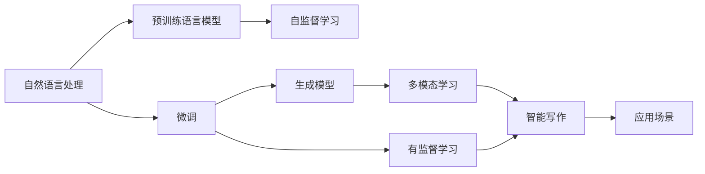
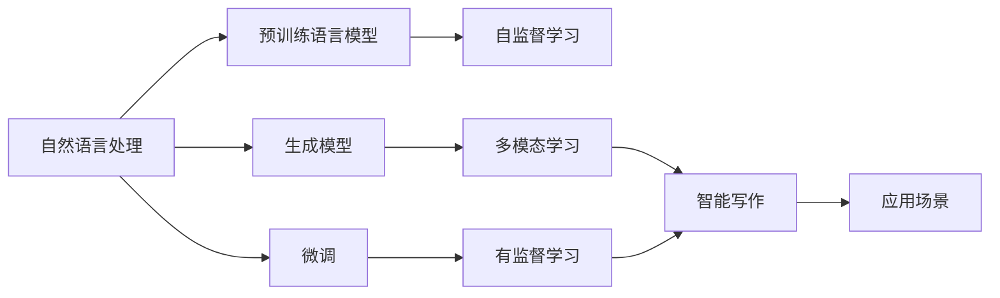
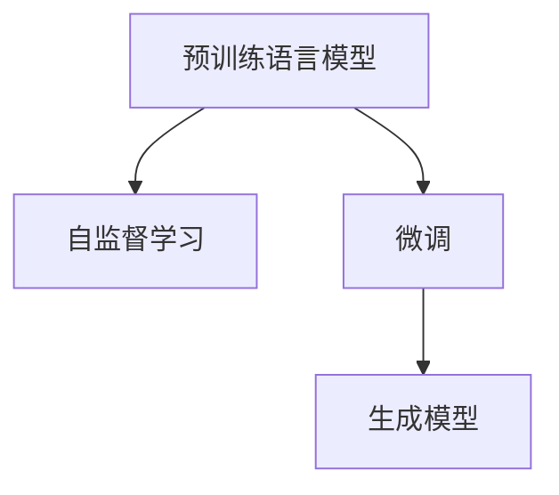
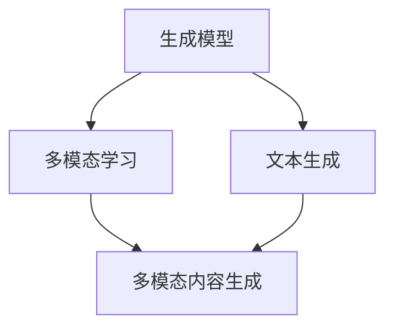

                 

# 自然语言处理的应用：AI内容创作革命

> 关键词：自然语言处理, 内容创作, 语言生成, 深度学习, Transformer, 多模态, 智能写作, 应用场景

## 1. 背景介绍

### 1.1 问题由来
自然语言处理（Natural Language Processing, NLP）作为人工智能（AI）的重要分支，长期以来在语言理解和生成方面取得了重大进展。从简单的文本分类和信息抽取，到复杂的机器翻译和文本生成，NLP技术不断拓展其应用领域和深度。然而，传统NLP技术往往依赖于手动编写规则和特征工程，难以自动生成高质量的自然语言内容。

近年来，随着深度学习和大规模预训练语言模型（Large Language Models, LLMs）的兴起，AI内容创作（Content Creation）成为可能。通过大模型的自监督预训练和有监督微调，AI能够自动学习语言规律，生成流畅、连贯、具有丰富语义的信息。这种“创作”能力不仅限于文学作品，还包括新闻报道、科技文章、广告文案等各类文本内容。

### 1.2 问题核心关键点
AI内容创作的核心理念是通过预训练模型在特定任务上进行微调，使模型能够理解和生成符合任务要求的自然语言。其核心步骤包括：
1. **预训练**：在大规模无标签文本数据上，通过自监督学习任务训练通用语言模型，学习语言的通用表示。
2. **微调**：在预训练模型的基础上，使用下游任务的少量标注数据，通过有监督学习优化模型在该任务上的性能。
3. **生成**：微调后的模型能够自动生成符合任务要求的文本内容。

这些步骤共同构成了AI内容创作的完整流程，使其在各类应用场景中展现出巨大的潜力。

### 1.3 问题研究意义
AI内容创作技术的广泛应用，对于提升内容创作效率、降低成本、提高内容质量等方面具有重要意义：
1. **提升效率**：AI内容创作可以自动生成各类文本，减轻人工创作压力，提高生产效率。
2. **降低成本**：无需再聘请大量内容创作人员，减少了人力成本和时间成本。
3. **提高质量**：AI模型能够生成高质量的文本内容，保证信息的准确性和权威性。
4. **个性化内容**：根据用户偏好和需求，生成个性化推荐和定制化内容，提升用户体验。
5. **大规模应用**：AI内容创作可以应用于各类行业，如新闻、电商、教育、医疗等，推动行业数字化转型。

本文聚焦于自然语言处理在AI内容创作中的应用，通过深入分析其原理和操作步骤，探讨具体实现方法和应用场景，希望能为相关开发者提供全面的技术指导。

## 2. 核心概念与联系

### 2.1 核心概念概述

为更好地理解AI内容创作的原理，本节将介绍几个密切相关的核心概念：

- **自然语言处理 (NLP)**：涉及计算机科学、人工智能和语言学的交叉领域，旨在使计算机能够理解和生成自然语言。
- **预训练语言模型 (Pre-training Language Models)**：如BERT、GPT等，通过在大规模无标签文本数据上进行自监督学习，学习语言的通用表示。
- **微调 (Fine-tuning)**：在预训练模型的基础上，使用下游任务的少量标注数据，通过有监督学习优化模型在该任务上的性能。
- **生成模型 (Generative Models)**：如LSTM、RNN、Transformer等，能够生成符合特定语法和语义的文本内容。
- **多模态学习 (Multimodal Learning)**：结合文本、图像、语音等多种模态信息，提高内容的丰富性和多样性。
- **智能写作 (Intelligent Writing)**：指利用AI技术，自动创作新闻、文章、广告等文本内容。
- **应用场景 (Application Scenarios)**：如内容生成、文本摘要、机器翻译、问答系统等，AI内容创作在这些场景中都有广泛应用。

这些核心概念之间的逻辑关系可以通过以下Mermaid流程图来展示：



这个流程图展示了大语言模型在自然语言处理中的应用流程，从预训练到微调，再到生成模型，最后应用到多模态和智能写作领域。

### 2.2 概念间的关系

这些核心概念之间存在着紧密的联系，形成了AI内容创作的完整生态系统。下面我们通过几个Mermaid流程图来展示这些概念之间的关系。

#### 2.2.1 自然语言处理的应用框架



这个流程图展示了自然语言处理的应用框架，从预训练到微调，再到生成模型，最后应用到智能写作和多种应用场景中。

#### 2.2.2 预训练与微调的关系



这个流程图展示了预训练与微调的关系，预训练模型通过自监督学习任务学习语言的通用表示，微调则在有监督任务上进行优化，生成模型则负责生成符合特定语法和语义的文本内容。

#### 2.2.3 生成模型与多模态学习的关系



这个流程图展示了生成模型和多模态学习的关系，生成模型负责生成文本内容，多模态学习则结合文本、图像、语音等多种模态信息，提高内容的丰富性和多样性。

#### 2.2.4 智能写作的应用场景

```mermaid
graph LR
    A[智能写作] --> B[内容生成]
    A --> C[文本摘要]
    A --> D[机器翻译]
    A --> E[问答系统]
    B --> F[新闻报道]
    C --> G[科技文章]
    D --> H[广告文案]
    E --> I[个性化推荐]
    F --> J[影视评论]
    G --> K[学术文章]
    H --> L[产品描述]
    I --> M[用户反馈]
    J --> N[娱乐资讯]
    K --> O[技术报告]
    L --> P[用户手册]
    M --> Q[社交媒体]
    N --> R[文化评论]
    O --> S[学术论文]
    P --> T[技术文档]
    Q --> U[博客文章]
    R --> V[艺术评论]
    S --> W[数据分析]
    T --> X[系统文档]
    U --> Y[专业文章]
    V --> Z[生活指南]
    W --> AA[科学报告]
    X --> AB[软件使用手册]
    Y --> AC[研究报告]
    Z --> AD[旅行指南]
    AA --> AE[技术白皮书]
    AB --> AF[技术手册]
    AC --> AG[技术综述]
    AD --> AH[旅游手册]
    AE --> AI[技术案例]
    AF --> AJ[技术指南]
    AG --> AK[技术专题]
    AH --> AL[旅游攻略]
    AI --> AM[技术分享]
    AJ --> AN[技术教程]
    AK --> AO[技术白皮书]
    AL --> AP[旅游小贴士]
    AM --> AQ[技术博客]
    AN --> AR[技术专栏]
    AO --> AS[技术综述]
    AP --> AT[旅游指南]
    AQ --> AU[技术文章]
    AR --> AV[技术教程]
    AS --> AW[技术报告]
    AT --> AX[旅游小贴士]
    AU --> AY[技术博客]
    AV --> AZ[技术专栏]
    AW --> BA[技术综述]
    AX --> BB[旅游攻略]
    AY --> BC[技术分享]
    AZ --> BD[技术教程]
    BA --> BE[技术白皮书]
    BB --> BF[技术手册]
    BC --> BG[技术案例]
    BD --> BH[技术指南]
    BE --> BI[技术专题]
    BF --> BJ[技术综述]
    BG --> BK[技术专题]
    BH --> BL[技术白皮书]
    BI --> BM[技术分享]
    BJ --> BN[技术教程]
    BK --> BO[技术白皮书]
    BL --> BP[技术白皮书]
    BM --> BQ[技术案例]
    BN --> BR[技术教程]
    BO --> BS[技术白皮书]
    BP --> BT[技术案例]
    BQ --> BU[技术教程]
    BR --> BV[技术专栏]
    BS --> BW[技术白皮书]
    BT --> BX[技术案例]
    BU --> BY[技术专栏]
    BV --> BZ[技术专栏]
    BW --> CA[技术综述]
    BX --> CB[技术案例]
    BY --> CC[技术分享]
    BZ --> CD[技术教程]
    CA --> CE[技术白皮书]
    CB --> CF[技术手册]
    CC --> CG[技术案例]
    CD --> CH[技术指南]
    CE --> CI[技术专题]
    CF --> CJ[技术白皮书]
    CG --> CK[技术专题]
    CH --> CL[技术白皮书]
    CI --> CM[技术分享]
    CJ --> CN[技术教程]
    CK --> CO[技术白皮书]
    CL --> CM[技术白皮书]
    CM --> CN[技术文章]
    CN --> CO[技术案例]
    CP --> CR[技术教程]
    CQ --> CR[技术教程]
    CR --> CS[技术白皮书]
    CS --> CT[技术案例]
    CT --> CU[技术教程]
    CU --> CV[技术专栏]
    CV --> CW[技术白皮书]
    CW --> CX[技术白皮书]
    CX --> CY[技术综述]
    CY --> CZ[技术专栏]
    CZ --> DA[技术白皮书]
    DA --> DB[技术手册]
    DB --> DC[技术案例]
    DC --> DD[技术指南]
    DD --> DE[技术专题]
    DE --> DF[技术白皮书]
    DF --> DG[技术白皮书]
    DG --> DH[技术案例]
    DH --> DI[技术教程]
    DI --> DJ[技术白皮书]
    DJ --> DK[技术白皮书]
    DK --> DL[技术白皮书]
    DL --> DM[技术专栏]
    DM --> DN[技术案例]
    DN --> DO[技术教程]
    DO --> DP[技术白皮书]
    DP --> DQ[技术白皮书]
    DQ --> DR[技术白皮书]
    DR --> DS[技术案例]
    DS --> DT[技术教程]
    DT --> DU[技术白皮书]
    DU --> DV[技术白皮书]
    DV --> DW[技术白皮书]
    DW --> DX[技术白皮书]
    DX --> DY[技术白皮书]
    DY --> DZ[技术白皮书]
    DZ --> EA[技术白皮书]
    EA --> EB[技术手册]
    EB --> EC[技术案例]
    EC --> ED[技术指南]
    ED --> EE[技术专题]
    EE --> EF[技术白皮书]
    EF --> EG[技术白皮书]
    EG --> EH[技术案例]
    EH --> EI[技术教程]
    EI --> EJ[技术白皮书]
    EJ --> EK[技术白皮书]
    EK --> EL[技术白皮书]
    EL --> EM[技术专栏]
    EM --> EN[技术案例]
    EN --> EO[技术教程]
    EO --> EP[技术白皮书]
    EP --> EQ[技术白皮书]
    EQ --> ER[技术白皮书]
    ER --> ES[技术案例]
    ES --> ET[技术教程]
    ET --> EU[技术白皮书]
    EU --> EV[技术白皮书]
    EV --> EW[技术白皮书]
    EW --> EX[技术白皮书]
    EX --> EY[技术白皮书]
    EY --> EZ[技术白皮书]
    EZ --> FA[技术白皮书]
    FA --> FB[技术手册]
    FB --> FC[技术案例]
    FC --> FD[技术指南]
    FD --> FE[技术专题]
    FE --> FF[技术白皮书]
    FF --> FG[技术白皮书]
    FG --> FH[技术案例]
    FH --> FI[技术教程]
    FI --> FJ[技术白皮书]
    FJ --> FK[技术白皮书]
    FK --> FL[技术白皮书]
    FL --> FM[技术专栏]
    FM --> FN[技术案例]
    FN --> FO[技术教程]
    FO --> FP[技术白皮书]
    FP --> FQ[技术白皮书]
    FQ --> FR[技术白皮书]
    FR --> FS[技术案例]
    FS --> FT[技术教程]
    FT --> FU[技术白皮书]
    FU --> FV[技术白皮书]
    FV --> FW[技术白皮书]
    FW --> FX[技术白皮书]
    FX --> FY[技术白皮书]
    FY --> FZ[技术白皮书]
    FZ --> GA[技术白皮书]
    GA --> GB[技术手册]
    GB --> GC[技术案例]
    GC --> GD[技术指南]
    GD --> GE[技术专题]
    GE --> GF[技术白皮书]
    GF --> GG[技术白皮书]
    GG --> GH[技术案例]
    GH --> GI[技术教程]
    GI --> GJ[技术白皮书]
    GJ --> GK[技术白皮书]
    GK --> GL[技术白皮书]
    GL --> GM[技术专栏]
    GM --> GN[技术案例]
    GN --> GO[技术教程]
    GO --> GP[技术白皮书]
    GP --> GQ[技术白皮书]
    GQ --> GR[技术白皮书]
    GR --> GS[技术案例]
    GS --> GT[技术教程]
    GT --> GU[技术白皮书]
    GU --> GV[技术白皮书]
    GV --> GW[技术白皮书]
    GW --> GX[技术白皮书]
    GX --> GY[技术白皮书]
    GY --> GZ[技术白皮书]
    GZ --> HA[技术白皮书]
    HA --> HB[技术手册]
    HB --> HC[技术案例]
    HC --> HD[技术指南]
    HD --> HE[技术专题]
    HE --> HF[技术白皮书]
    HF --> HG[技术白皮书]
    HG --> HH[技术案例]
    HH --> HI[技术教程]
    HI --> HJ[技术白皮书]
    HJ --> HK[技术白皮书]
    HK --> HL[技术白皮书]
    HL --> HM[技术专栏]
    HM --> HN[技术案例]
    HN --> HO[技术教程]
    HO --> HP[技术白皮书]
    HP --> HQ[技术白皮书]
    HQ --> HR[技术白皮书]
    HR --> HS[技术案例]
    HS --> HT[技术教程]
    HT --> HU[技术白皮书]
    HU --> HV[技术白皮书]
    HV --> HW[技术白皮书]
    HW --> HX[技术白皮书]
    HX --> HY[技术白皮书]
    HY --> HZ[技术白皮书]
    HZ --> IA[技术白皮书]
    IA --> IB[技术手册]
    IB --> IC[技术案例]
    IC --> ID[技术指南]
    ID --> IE[技术专题]
    IE --> IF[技术白皮书]
    IF --> IG[技术白皮书]
    IG --> IH[技术案例]
    IH --> II[技术教程]
    II --> IJ[技术白皮书]
    IJ --> IK[技术白皮书]
    IK --> IL[技术白皮书]
    IL --> IM[技术专栏]
    IM --> IN[技术案例]
    IN --> IO[技术教程]
    IO --> IP[技术白皮书]
    IP --> IQ[技术白皮书]
    IQ --> IR[技术白皮书]
    IR --> IS[技术案例]
    IS --> IT[技术教程]
    IT --> IU[技术白皮书]
    IU --> IV[技术白皮书]
    IV --> IW[技术白皮书]
    IW --> IX[技术白皮书]
    IX --> IY[技术白皮书]
    IY --> IZ[技术白皮书]
    IZ -->JA[技术白皮书]
    JA --> JB[技术手册]
    JB --> JC[技术案例]
    JC --> JD[技术指南]
    JD -->JE[技术专题]
    JE --> JF[技术白皮书]
    JF --> JG[技术白皮书]
    JG --> JH[技术案例]
    JH --> JI[技术教程]
    JI --> JJ[技术白皮书]
    JJ --> JK[技术白皮书]
    JK --> JL[技术白皮书]
    JL --> JM[技术专栏]
    JM --> JN[技术案例]
    JN --> JO[技术教程]
    JO --> JP[技术白皮书]
    JP --> JQ[技术白皮书]
    JQ --> JR[技术白皮书]
    JR --> JS[技术案例]
    JS --> JT[技术教程]
    JT --> JU[技术白皮书]
    JU --> JV[技术白皮书]
    JV --> JW[技术白皮书]
    JW --> JX[技术白皮书]
    JX --> JY[技术白皮书]
    JY --> JZ[技术白皮书]
    JZ --> KA[技术白皮书]
    KA --> KB[技术手册]
    KB --> KC[技术案例]
    KC --> KD[技术指南]
    KD --> KE[技术专题]
    KE --> KF[技术白皮书]
    KF --> KG[技术白皮书]
    KG --> KH[技术案例]
    KH --> KI[技术教程]
    KI --> KJ[技术白皮书]
    KJ --> KK[技术白皮书]
    KK --> KL[技术白皮书]
    KL --> KM[技术专栏]
    KM --> KN[技术案例]
    KN --> KO[技术教程]
    KO --> KP[技术白皮书]
    KP --> KQ[技术白皮书]
    KQ --> KR[技术白皮书]
    KR --> KS[技术案例]
    KS --> KT[技术教程]
    KT --> KU[技术白皮书]
    KU --> KV[技术白皮书]
    KV --> KW[技术白皮书]
    KW --> KX[技术白皮书]
    KX --> KY[技术白皮书]
    KY --> KZ[技术白皮书]
    KZ --> LA[技术白皮书]
    LA --> LB[技术手册]
    LB --> LC[技术案例]
    LC --> LD[技术指南]
    LD --> LE[技术专题]
    LE --> LF[技术白皮书]
    LF --> LG[技术白皮书]
    LG --> LH[技术案例]
    LH --> LI[技术教程]
    LI --> LJ[技术白皮书]
    LJ --> LK[技术白皮书]
    LK --> LL[技术白皮书]
    LL --> LM[技术专栏]
    LM --> LN[技术案例]
    LN --> LO[技术教程]
    LO --> LP[技术白皮书]
    LP --> LQ[技术白皮书]
    LQ --> LR[技术白皮书]
    LR --> LS[技术案例]
    LS --> LT[技术教程]
    LT --> LU[技术白皮书]
    LU --> LV[技术白皮书]
    LV --> LW[技术白皮书]
    LW --> LX[技术白皮书]
    LX --> LY[技术白皮书]
    LY --> LZ[技术白皮书]
    LZ --> MA[技术白皮书]
    MA --> MB[技术手册]
    MB --> MC[技术案例]
    MC --> MD[技术指南]
    MD --> ME[技术专题]
    ME --> MF[技术白皮书]
    MF --> MG[技术白皮书]
    MG --> MH[技术案例]
    MH --> MI[技术教程]
    MI --> MJ[技术白皮书]
    MJ --> MK[技术白皮书]
    MK --> ML[技术白皮书]
    ML --> MM[技术专栏]
    MM --> MN[技术案例]
    MN --> MO[技术教程]
    MO --> MP[技术白皮书]
    MP --> MQ[技术白皮书]
    MQ --> MR[技术白皮书]
    MR --> MS[技术案例]
    MS --> MT[技术教程]
    MT --> MU[技术白皮书]
    MU --> MV[技术白皮书]
    MV --> MW[技术白皮书]
    MW --> MX[技术白皮书]
    MX --> MY[技术白皮书]
    MY --> MZ[技术白皮书]
    MZ --> NA[技术白皮书]
    NA --> NB[技术手册]
    NB --> NC[技术案例]
    NC --> ND[技术指南]
    ND --> NE[技术专题]
    NE --> NF[技术白皮书]
    NF --> NG[技术白皮书]
    NG --> NH[技术案例]
    NH --> NI[技术教程]
    NI --> NJ[技术白皮书]
    NJ --> NK[技术白皮书]
    NK --> NL[技术白皮书]
    NL --> NM[技术专栏]
    NM --> NN[技术案例]
    NN --> NO[技术教程]
    NO --> NP[技术白皮书]
    NP --> NQ[技术白皮书]
    NQ --> NR[技术白皮书]
    NR --> NS[技术案例]
    NS --> NT[技术教程]
    NT --> NU[技术白皮书]
    NU --> NV[技术白皮书]
    NV --> NW[技术白皮书]
    NW --> NX[技术白皮书]
    NX --> NY[技术白皮书]
    NY --> NZ[技术白皮书]
    NZ --> OA[技术白皮书]
    OA --> OB[技术手册]
    OB --> OC[技术案例]
    OC --> OD[技术指南]
    OD --> OE[技术专题]
    OE --> OF[技术白皮书]
    OF --> OG[技术白皮书]
    OG --> OH[技术案例]
    OH --> OI[技术教程]
    OI --> OJ[技术白皮书]
    OJ --> OK[技术白皮书]
    OK --> OL[技术白皮书]
    OL --> OM[技术专栏]
    OM --> ON[技术案例]
    ON --> OO[技术教程]
    OO --> OP[技术白皮书]
    OP --> OQ[技术白皮书]
    OQ --> OR[技术白皮书]
    OR --> OS[技术案例]
    OS --> OT[技术教程]
    OT --> OU[技术白皮书]
    OU -->OV[技术白皮书]
    OV --> OW[技术白皮书]
    OW --> OX[技术白皮书]
    OX --> OY[技术白皮书]
    OY --> OZ[技术白皮书]
    OZ --> PA[技术白皮书]
    PA --> PB[技术手册]
    PB --> PC[技术案例]
    PC --> PD[技术指南]
    PD --> PE[技术专题]
    PE --> PF[技术白皮书]
    PF --> PG[技术白皮书]
    PG --> PH[技术案例]
    PH --> PI[技术教程]
    PI --> PJ[技术白皮书]
    PJ --> PK[技术白皮书]
    PK --> PL[技术白皮书]
    PL --> PM[技术专栏]
    PM --> PN[技术案例]
    PN --> PO[技术教程]
    PO --> PP[技术白皮书]
    PP --> PQ[技术白皮书]
    PQ --> PR[技术白皮书]
    PR --> PS[技术案例]
    PS --> PT[技术教程]
    PT -->PU[技术白皮书]
    PU --> PV[技术白皮书]
    PV --> PW[技术白皮书]
    PW --> PX[技术白皮书]
    PX --> PY[技术白皮书]
    PY --> PZ[技术白皮书]
    PZ --> QA[技术白皮书]
    QA --> QB[技术手册]
    QB --> QC[技术案例]
    QC --> QD[技术指南]
    QD --> QE[技术专题]
    QE --> QF[技术白皮书]
    QF --> QG[技术白皮书]
    QG --> QH[技术案例]
    QH --> QI[技术教程]
    QI --> QJ[技术白皮书]
    QJ --> QK[技术白皮书]
    QK --> QL[技术白皮书]
    QL --> QM[技术专栏]
    QM --> QN[技术案例]
    QN --> QO[技术教程]
    QO --> QP[技术白皮书]
    QP --> QQ[技术白皮书]
    QQ --> QR[技术白皮书]
    QR --> QS[技术案例]
    QS --> QT[技术教程]
    QT --> QU[技术白皮书]
    QU --> QV[技术白皮书]
    QV --> QW[技术白皮书]
    QW --> QX[技术白皮书]
    QX --> QY[技术白皮书]
    QY -->

