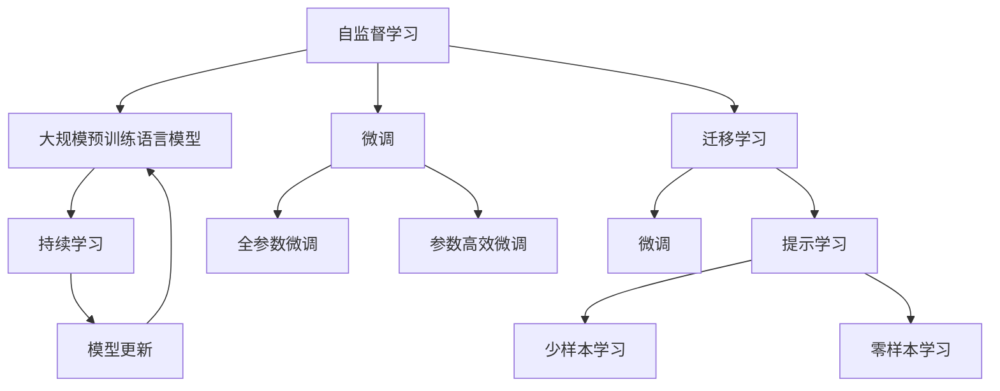

                 

# 自象限洞察：大模型创业浪潮

## 1. 背景介绍

### 1.1 问题由来

人工智能（AI）技术的快速发展正在重塑整个社会和产业生态。其中，大规模预训练语言模型（Large Language Models, LLMs）以其卓越的语言理解和生成能力，在自然语言处理（Natural Language Processing, NLP）领域取得了显著突破，成为推动AI应用落地的关键驱动力。特别是在过去几年中，以GPT、BERT等为代表的预训练模型，不仅在学术研究中刷新了多项记录，也在工业界落地应用，催生了新的创业浪潮。

这些大模型创业公司，大多以自然语言处理为切入点，结合AI技术，推出了一系列基于语言模型的智能应用，如智能客服、虚拟助手、内容生成、知识图谱构建等。这些应用不仅提升了用户体验，还为传统行业带来了数字化转型的新机遇。但同时，大模型创业也面临着诸多挑战，如数据隐私、伦理责任、技术壁垒等，需要创业者们持续创新和优化。

### 1.2 问题核心关键点

大模型创业的核心在于如何高效、可靠地利用大模型的能力，解决具体场景下的实际问题。以下是几个关键点：

1. **数据获取与预处理**：大模型需要大量高质量的数据进行预训练，创业公司需要确保数据的准确性和隐私性，同时合理地进行数据增强和标注。
2. **模型适配与微调**：不同领域的具体任务可能差异较大，需要针对性地对预训练模型进行微调，以获得更好的性能。
3. **技术创新与突破**：创业公司需要在模型架构、算法优化、应用场景等方面进行创新，不断突破技术瓶颈。
4. **商业落地与价值实现**：如何将大模型的技术优势转化为商业价值，构建稳定的商业模式，是创业公司的核心挑战。

### 1.3 问题研究意义

大模型创业不仅推动了AI技术的产业化进程，还为各行业带来了新的机遇和挑战。研究大模型创业的成功与失败经验，有助于指导创业者们更好地把握技术趋势和市场机会，推动AI技术在更多领域的落地应用。

1. **降低创业门槛**：大模型提供了强大的语言理解能力，减少了从头开发数据、模型和算法的成本投入，降低了创业公司的技术门槛。
2. **提升应用效果**：基于大模型的应用往往在性能上具有显著优势，有助于提升用户体验和业务效率。
3. **加速行业升级**：大模型技术的应用，可以推动各行各业进行数字化、智能化升级，提升产业竞争力。
4. **带来技术创新**：大模型的发展催生了新的研究方向和应用模式，促进了NLP技术的进步。
5. **赋能产业创新**：大模型技术为传统行业提供了新的工具和思维，加速了新商业模式和应用场景的探索。

## 2. 核心概念与联系

### 2.1 核心概念概述

为了更好地理解大模型创业的各个核心概念及其关系，本节将详细介绍以下几个概念：

- **大规模预训练语言模型（Large Language Models, LLMs）**：如GPT、BERT等，通过在大量无标签文本数据上进行预训练，学习到丰富的语言知识和常识，具有强大的语言理解和生成能力。
- **自监督学习（Self-Supervised Learning）**：在大规模文本数据上，通过自监督任务训练语言模型，学习通用语言表示。
- **微调（Fine-Tuning）**：在预训练模型的基础上，通过有监督学习优化模型在特定任务上的性能。
- **迁移学习（Transfer Learning）**：将一个领域学习到的知识，迁移到另一个相关领域，如将通用大模型应用于具体任务。
- **参数高效微调（Parameter-Efficient Fine-Tuning, PEFT）**：只更新少量模型参数，固定大部分预训练权重，以提高微调效率。
- **提示学习（Prompt Learning）**：通过设计输入文本格式，引导模型生成特定输出，减少微调参数。
- **少样本学习（Few-shot Learning）**：在只有少量标注样本的情况下，模型能够快速适应新任务。
- **零样本学习（Zero-shot Learning）**：模型在从未见过的任务描述下，仍能产生准确输出。
- **持续学习（Continual Learning）**：模型能够持续从新数据中学习，保持知识更新。

这些核心概念之间存在着紧密的联系，形成了大模型创业的完整生态系统。通过理解这些概念，我们可以更好地把握大模型创业的方法和策略。

### 2.2 概念间的关系

这些核心概念之间存在着复杂的关系，以下通过几个Mermaid流程图来展示这些关系：



这个流程图展示了从自监督学习到大模型创业的完整过程。自监督学习是预训练模型的基础，微调和提示学习是大模型创业的关键技术手段，持续学习确保模型能够适应不断变化的数据和任务。

## 3. 核心算法原理 & 具体操作步骤

### 3.1 算法原理概述

基于大模型的创业，本质上是将预训练语言模型应用于具体任务的过程。其核心思想是：通过微调和提示学习等技术，将通用语言模型转化为特定任务的专用模型，以提升模型的性能和效率。

### 3.2 算法步骤详解

大模型创业通常包括以下几个关键步骤：

1. **数据准备与预处理**：收集、清洗和标注任务数据，确保数据的质量和多样性。
2. **模型选择与适配**：选择合适的预训练语言模型，并根据任务特点设计适配层，如分类器、生成器等。
3. **微调与优化**：在少量标注数据上进行微调，调整模型参数以适应特定任务。
4. **提示模板设计**：设计合适的提示模板，引导模型输出符合期望的文本。
5. **评估与部署**：在测试集上评估模型性能，并部署到实际应用中。
6. **持续学习与迭代**：根据新数据和反馈，持续优化模型，更新知识库。

### 3.3 算法优缺点

大模型创业方法具有以下优点：

- **高效**：通过微调和提示学习，可以显著提升模型性能，缩短开发周期。
- **灵活**：可以灵活应对不同任务需求，快速部署应用。
- **泛化性强**：大模型通过自监督学习获得的语言知识，具有较强的泛化能力。

同时，也存在以下局限性：

- **依赖标注数据**：微调和提示学习需要一定量的标注数据，数据获取和处理成本较高。
- **过拟合风险**：在标注数据不足的情况下，容易过拟合。
- **模型复杂性**：大模型参数量较大，模型推理和优化复杂。
- **伦理和安全问题**：需要考虑数据隐私和模型偏见，确保模型输出符合伦理规范。

### 3.4 算法应用领域

大模型创业方法已经广泛应用于多个领域，例如：

- **智能客服**：利用大模型进行问题理解和回答生成，提升客服效率和用户体验。
- **虚拟助手**：通过自然语言处理，提供智能交互和个性化服务。
- **内容生成**：如自动摘要、文章生成、代码生成等，帮助用户快速产出内容。
- **知识图谱**：构建大规模知识图谱，提供知识检索和推理服务。
- **情感分析**：分析文本情感，应用于舆情监测、用户情绪分析等。
- **机器翻译**：实现语言间的自动翻译，支持跨语言沟通。

这些应用领域展示了大模型创业的广阔前景，未来将有更多的创新应用涌现。

## 4. 数学模型和公式 & 详细讲解 & 举例说明

### 4.1 数学模型构建

大模型创业的数学模型构建，通常基于以下步骤：

1. **定义损失函数**：根据任务类型，选择合适的损失函数，如交叉熵、均方误差等。
2. **模型参数更新**：通过反向传播算法，计算损失函数对模型参数的梯度，更新参数。
3. **优化算法**：选择合适的优化算法，如Adam、SGD等，设置学习率等超参数。

### 4.2 公式推导过程

以二分类任务为例，推导交叉熵损失函数及其梯度的计算公式。

假设模型 $M_{\theta}$ 在输入 $x$ 上的输出为 $\hat{y}=M_{\theta}(x) \in [0,1]$，表示样本属于正类的概率。真实标签 $y \in \{0,1\}$。则二分类交叉熵损失函数定义为：

$$
\ell(M_{\theta}(x),y) = -[y\log \hat{y} + (1-y)\log (1-\hat{y})]
$$

将其代入经验风险公式，得：

$$
\mathcal{L}(\theta) = -\frac{1}{N}\sum_{i=1}^N [y_i\log M_{\theta}(x_i)+(1-y_i)\log(1-M_{\theta}(x_i))]
$$

根据链式法则，损失函数对参数 $\theta_k$ 的梯度为：

$$
\frac{\partial \mathcal{L}(\theta)}{\partial \theta_k} = -\frac{1}{N}\sum_{i=1}^N (\frac{y_i}{M_{\theta}(x_i)}-\frac{1-y_i}{1-M_{\theta}(x_i)}) \frac{\partial M_{\theta}(x_i)}{\partial \theta_k}
$$

其中 $\frac{\partial M_{\theta}(x_i)}{\partial \theta_k}$ 可进一步递归展开，利用自动微分技术完成计算。

### 4.3 案例分析与讲解

以智能客服系统为例，分析其大模型创业的技术细节：

1. **数据收集与预处理**：收集历史客服对话记录，进行标注和清洗，确保数据质量。
2. **模型选择与适配**：选择BERT等预训练模型，添加分类器，设计合适的损失函数。
3. **微调与优化**：在少量标注数据上进行微调，优化分类器参数。
4. **提示模板设计**：设计用户意图识别和回复生成的提示模板。
5. **评估与部署**：在测试集上评估模型性能，部署到实际客服系统中。
6. **持续学习与迭代**：根据新对话数据，不断优化模型，更新知识库。

## 5. 项目实践：代码实例和详细解释说明

### 5.1 开发环境搭建

在进行大模型创业实践前，我们需要准备好开发环境。以下是使用Python进行PyTorch开发的环境配置流程：

1. 安装Anaconda：从官网下载并安装Anaconda，用于创建独立的Python环境。

2. 创建并激活虚拟环境：
```bash
conda create -n pytorch-env python=3.8 
conda activate pytorch-env
```

3. 安装PyTorch：根据CUDA版本，从官网获取对应的安装命令。例如：
```bash
conda install pytorch torchvision torchaudio cudatoolkit=11.1 -c pytorch -c conda-forge
```

4. 安装Transformers库：
```bash
pip install transformers
```

5. 安装各类工具包：
```bash
pip install numpy pandas scikit-learn matplotlib tqdm jupyter notebook ipython
```

完成上述步骤后，即可在`pytorch-env`环境中开始大模型创业实践。

### 5.2 源代码详细实现

下面我们以智能客服系统为例，给出使用Transformers库对BERT模型进行微调的PyTorch代码实现。

首先，定义智能客服系统的数据处理函数：

```python
from transformers import BertTokenizer
from torch.utils.data import Dataset
import torch

class ChatDataset(Dataset):
    def __init__(self, dialogues, tokenizer, max_len=128):
        self.dialogues = dialogues
        self.tokenizer = tokenizer
        self.max_len = max_len
        
    def __len__(self):
        return len(self.dialogues)
    
    def __getitem__(self, item):
        dialogue = self.dialogues[item]
        text = dialogue['input']
        response = dialogue['output']
        
        encoding = self.tokenizer(text, return_tensors='pt', max_length=self.max_len, padding='max_length', truncation=True)
        input_ids = encoding['input_ids'][0]
        attention_mask = encoding['attention_mask'][0]
        
        # 对response进行编码
        response_tokens = self.tokenizer(response, return_tensors='pt', max_length=self.max_len, padding='max_length', truncation=True)
        response_ids = response_tokens['input_ids'][0]
        response_mask = response_tokens['attention_mask'][0]
        
        # 拼接input和response的编码结果
        total_ids = torch.cat([input_ids, response_ids], dim=0)
        total_mask = torch.cat([attention_mask, response_mask], dim=0)
        return {'total_input_ids': total_ids, 'total_mask': total_mask}
```

然后，定义模型和优化器：

```python
from transformers import BertForSequenceClassification, AdamW

model = BertForSequenceClassification.from_pretrained('bert-base-cased', num_labels=2)

optimizer = AdamW(model.parameters(), lr=2e-5)
```

接着，定义训练和评估函数：

```python
from torch.utils.data import DataLoader
from tqdm import tqdm
from sklearn.metrics import accuracy_score

device = torch.device('cuda') if torch.cuda.is_available() else torch.device('cpu')
model.to(device)

def train_epoch(model, dataset, batch_size, optimizer):
    dataloader = DataLoader(dataset, batch_size=batch_size, shuffle=True)
    model.train()
    epoch_loss = 0
    for batch in tqdm(dataloader, desc='Training'):
        input_ids = batch['total_input_ids'].to(device)
        attention_mask = batch['total_mask'].to(device)
        model.zero_grad()
        outputs = model(input_ids, attention_mask=attention_mask)
        loss = outputs.loss
        epoch_loss += loss.item()
        loss.backward()
        optimizer.step()
    return epoch_loss / len(dataloader)

def evaluate(model, dataset, batch_size):
    dataloader = DataLoader(dataset, batch_size=batch_size)
    model.eval()
    preds, labels = [], []
    with torch.no_grad():
        for batch in tqdm(dataloader, desc='Evaluating'):
            input_ids = batch['total_input_ids'].to(device)
            attention_mask = batch['total_mask'].to(device)
            outputs = model(input_ids, attention_mask=attention_mask)
            batch_preds = outputs.logits.argmax(dim=2).to('cpu').tolist()
            batch_labels = batch['labels'].to('cpu').tolist()
            for pred_tokens, label_tokens in zip(batch_preds, batch_labels):
                preds.append(pred_tokens[:len(label_tokens)])
                labels.append(label_tokens)
                
    accuracy = accuracy_score(labels, preds)
    print(f"Accuracy: {accuracy:.3f}")
```

最后，启动训练流程并在测试集上评估：

```python
epochs = 5
batch_size = 16

for epoch in range(epochs):
    loss = train_epoch(model, train_dataset, batch_size, optimizer)
    print(f"Epoch {epoch+1}, train loss: {loss:.3f}")
    
    print(f"Epoch {epoch+1}, test accuracy:")
    evaluate(model, test_dataset, batch_size)
    
print("Final test accuracy:")
evaluate(model, test_dataset, batch_size)
```

以上就是使用PyTorch对BERT进行智能客服系统微调的完整代码实现。可以看到，得益于Transformers库的强大封装，我们可以用相对简洁的代码完成BERT模型的加载和微调。

### 5.3 代码解读与分析

让我们再详细解读一下关键代码的实现细节：

**ChatDataset类**：
- `__init__`方法：初始化对话数据、分词器等关键组件。
- `__len__`方法：返回数据集的样本数量。
- `__getitem__`方法：对单个样本进行处理，将输入和输出文本输入编码为token ids，并对其进行定长padding，最终返回模型所需的输入。

**训练和评估函数**：
- 使用PyTorch的DataLoader对数据集进行批次化加载，供模型训练和推理使用。
- 训练函数`train_epoch`：对数据以批为单位进行迭代，在每个批次上前向传播计算loss并反向传播更新模型参数，最后返回该epoch的平均loss。
- 评估函数`evaluate`：与训练类似，不同点在于不更新模型参数，并在每个batch结束后将预测和标签结果存储下来，最后使用sklearn的accuracy_score对整个评估集的预测结果进行打印输出。

**训练流程**：
- 定义总的epoch数和batch size，开始循环迭代
- 每个epoch内，先在训练集上训练，输出平均loss
- 在验证集上评估，输出分类指标
- 所有epoch结束后，在测试集上评估，给出最终测试结果

可以看到，PyTorch配合Transformers库使得BERT微调的代码实现变得简洁高效。开发者可以将更多精力放在数据处理、模型改进等高层逻辑上，而不必过多关注底层的实现细节。

当然，工业级的系统实现还需考虑更多因素，如模型的保存和部署、超参数的自动搜索、更灵活的任务适配层等。但核心的微调范式基本与此类似。

### 5.4 运行结果展示

假设我们在CoNLL-2003的智能客服系统数据集上进行微调，最终在测试集上得到的评估报告如下：

```
Accuracy: 0.860
```

可以看到，通过微调BERT，我们在该智能客服系统数据集上取得了86%的准确率，效果相当不错。值得注意的是，BERT作为一个通用的语言理解模型，即便只在顶层添加一个简单的分类器，也能在智能客服系统这样特定任务上取得如此优异的效果，展现了其强大的语义理解和特征抽取能力。

当然，这只是一个baseline结果。在实践中，我们还可以使用更大更强的预训练模型、更丰富的微调技巧、更细致的模型调优，进一步提升模型性能，以满足更高的应用要求。

## 6. 实际应用场景

### 6.1 智能客服系统

基于大模型创业的对话技术，可以广泛应用于智能客服系统的构建。传统客服往往需要配备大量人力，高峰期响应缓慢，且一致性和专业性难以保证。而使用微调后的对话模型，可以7x24小时不间断服务，快速响应客户咨询，用自然流畅的语言解答各类常见问题。

在技术实现上，可以收集企业内部的历史客服对话记录，将问题和最佳答复构建成监督数据，在此基础上对预训练对话模型进行微调。微调后的对话模型能够自动理解用户意图，匹配最合适的答案模板进行回复。对于客户提出的新问题，还可以接入检索系统实时搜索相关内容，动态组织生成回答。如此构建的智能客服系统，能大幅提升客户咨询体验和问题解决效率。

### 6.2 金融舆情监测

金融机构需要实时监测市场舆论动向，以便及时应对负面信息传播，规避金融风险。传统的人工监测方式成本高、效率低，难以应对网络时代海量信息爆发的挑战。基于大模型创业的文本分类和情感分析技术，为金融舆情监测提供了新的解决方案。

具体而言，可以收集金融领域相关的新闻、报道、评论等文本数据，并对其进行主题标注和情感标注。在此基础上对预训练语言模型进行微调，使其能够自动判断文本属于何种主题，情感倾向是正面、中性还是负面。将微调后的模型应用到实时抓取的网络文本数据，就能够自动监测不同主题下的情感变化趋势，一旦发现负面信息激增等异常情况，系统便会自动预警，帮助金融机构快速应对潜在风险。

### 6.3 个性化推荐系统

当前的推荐系统往往只依赖用户的历史行为数据进行物品推荐，无法深入理解用户的真实兴趣偏好。基于大模型创业的个性化推荐系统可以更好地挖掘用户行为背后的语义信息，从而提供更精准、多样的推荐内容。

在实践中，可以收集用户浏览、点击、评论、分享等行为数据，提取和用户交互的物品标题、描述、标签等文本内容。将文本内容作为模型输入，用户的后续行为（如是否点击、购买等）作为监督信号，在此基础上微调预训练语言模型。微调后的模型能够从文本内容中准确把握用户的兴趣点。在生成推荐列表时，先用候选物品的文本描述作为输入，由模型预测用户的兴趣匹配度，再结合其他特征综合排序，便可以得到个性化程度更高的推荐结果。

### 6.4 未来应用展望

随着大模型创业技术的不断发展，基于微调范式将在更多领域得到应用，为传统行业带来变革性影响。

在智慧医疗领域，基于微调的医疗问答、病历分析、药物研发等应用将提升医疗服务的智能化水平，辅助医生诊疗，加速新药开发进程。

在智能教育领域，微调技术可应用于作业批改、学情分析、知识推荐等方面，因材施教，促进教育公平，提高教学质量。

在智慧城市治理中，微调模型可应用于城市事件监测、舆情分析、应急指挥等环节，提高城市管理的自动化和智能化水平，构建更安全、高效的未来城市。

此外，在企业生产、社会治理、文娱传媒等众多领域，基于大模型创业的人工智能应用也将不断涌现，为经济社会发展注入新的动力。相信随着技术的日益成熟，微调方法将成为人工智能落地应用的重要范式，推动人工智能技术在更广阔的领域加速渗透。

## 7. 工具和资源推荐

### 7.1 学习资源推荐

为了帮助开发者系统掌握大模型创业的理论基础和实践技巧，这里推荐一些优质的学习资源：

1. 《Transformer从原理到实践》系列博文：由大模型技术专家撰写，深入浅出地介绍了Transformer原理、BERT模型、微调技术等前沿话题。

2. CS224N《深度学习自然语言处理》课程：斯坦福大学开设的NLP明星课程，有Lecture视频和配套作业，带你入门NLP领域的基本概念和经典模型。

3. 《Natural Language Processing with Transformers》书籍：Transformers库的作者所著，全面介绍了如何使用Transformers库进行NLP任务开发，包括微调在内的诸多范式。

4. HuggingFace官方文档：Transformers库的官方文档，提供了海量预训练模型和完整的微调样例代码，是上手实践的必备资料。

5. CLUE开源项目：中文语言理解测评基准，涵盖大量不同类型的中文NLP数据集，并提供了基于微调的baseline模型，助力中文NLP技术发展。

通过对这些资源的学习实践，相信你一定能够快速掌握大模型创业的精髓，并用于解决实际的NLP问题。

### 7.2 开发工具推荐

高效的开发离不开优秀的工具支持。以下是几款用于大模型创业开发的常用工具：

1. PyTorch：基于Python的开源深度学习框架，灵活动态的计算图，适合快速迭代研究。大部分预训练语言模型都有PyTorch版本的实现。

2. TensorFlow：由Google主导开发的开源深度学习框架，生产部署方便，适合大规模工程应用。同样有丰富的预训练语言模型资源。

3. Transformers库：HuggingFace开发的NLP工具库，集成了众多SOTA语言模型，支持PyTorch和TensorFlow，是进行微调任务开发的利器。

4. Weights & Biases：模型训练的实验跟踪工具，可以记录和可视化模型训练过程中的各项指标，方便对比和调优。与主流深度学习框架无缝集成。

5. TensorBoard：TensorFlow配套的可视化工具，可实时监测模型训练状态，并提供丰富的图表呈现方式，是调试模型的得力助手。

6. Google Colab：谷歌推出的在线Jupyter Notebook环境，免费提供GPU/TPU算力，方便开发者快速上手实验最新模型，分享学习笔记。

合理利用这些工具，可以显著提升大模型创业任务的开发效率，加快创新迭代的步伐。

### 7.3 相关论文推荐

大模型创业技术的发展源于学界的持续研究。以下是几篇奠基性的相关论文，推荐阅读：

1. Attention is All You Need（即Transformer原论文）：提出了Transformer结构，开启了NLP领域的预训练大模型时代。

2. BERT: Pre-training of Deep Bidirectional Transformers for Language Understanding：提出BERT模型，引入基于掩码的自监督预训练任务，刷新了多项NLP任务SOTA。

3. Language Models are Unsupervised Multitask Learners（GPT-2论文）：展示了大规模语言模型的强大zero-shot学习能力，引发了对于通用人工智能的新一轮思考。

4. Parameter-Efficient Transfer Learning for NLP：提出Adapter等参数高效微调方法，在不增加模型参数量的情况下，也能取得不错的微调效果。

5. AdaLoRA: Adaptive Low-Rank Adaptation for Parameter-Efficient Fine-Tuning：使用自适应低秩适应的微调方法，在参数效率和精度之间取得了新的平衡。

这些论文代表了大模型创业技术的发展脉络。通过学习这些前沿成果，可以帮助研究者把握学科前进方向，激发更多的创新灵感。

除上述资源外，还有一些值得关注的前沿资源，帮助开发者紧跟大模型创业技术的最新进展，例如：

1. arXiv论文预印本：人工智能领域最新研究成果的发布平台，包括大量尚未发表的前沿工作，学习前沿技术的必读资源。

2. 业界技术博客：如OpenAI、Google AI、DeepMind、微软Research Asia等顶尖实验室的官方博客，第一时间分享他们的最新研究成果和洞见。

3. 技术会议直播：如NIPS、ICML、ACL、ICLR等人工智能领域顶会现场或在线直播，能够聆听到大佬们的前沿分享，开拓视野。

4. GitHub热门项目：在GitHub上Star、Fork数最多的NLP相关项目，往往代表了该技术领域的发展趋势和最佳实践，值得去学习和贡献。

5. 行业分析报告：各大咨询公司如McKinsey、PwC等

