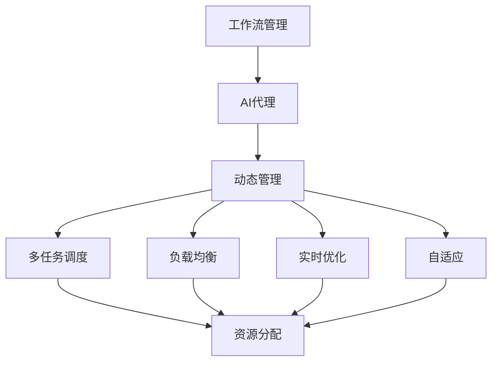
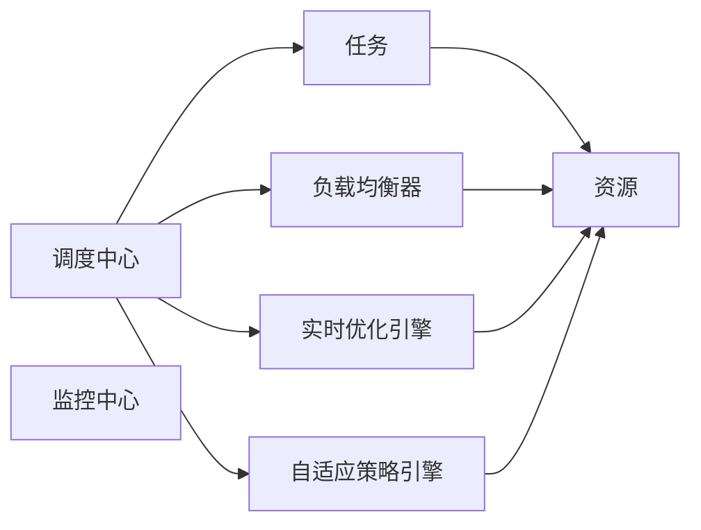
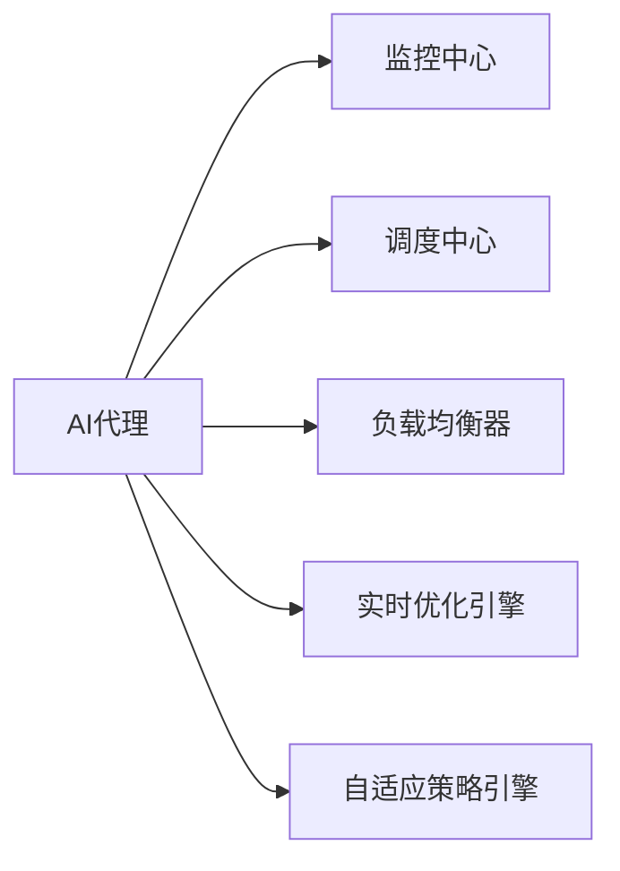
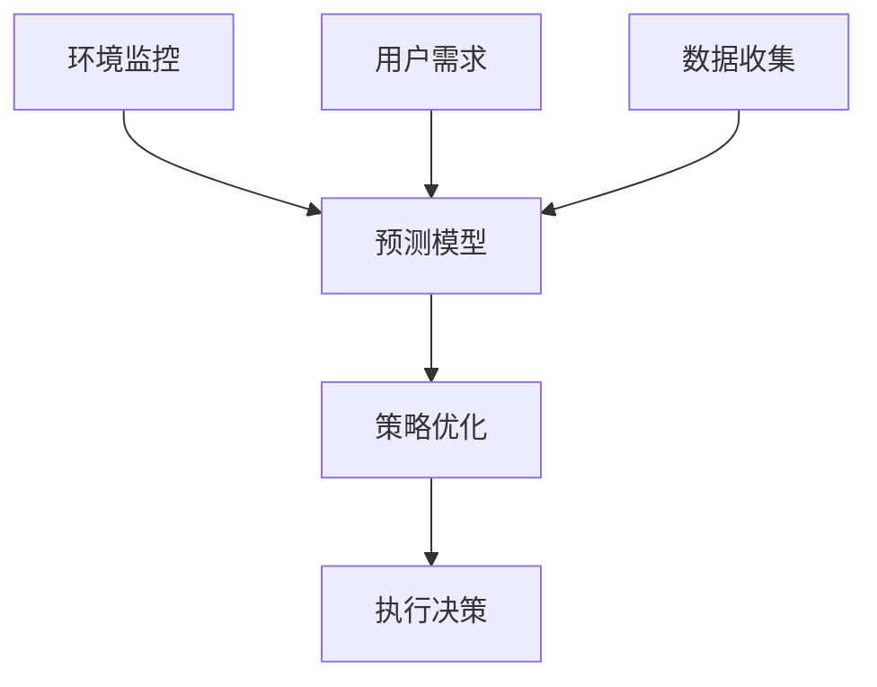
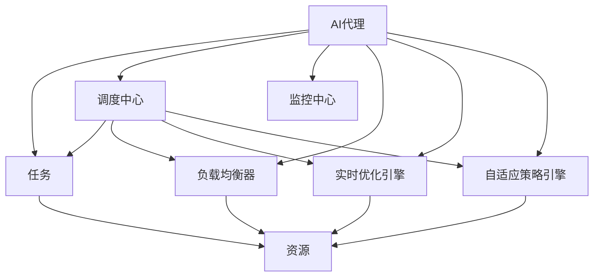

                 

# 自适应与智能调整：AI代理工作流的动态管理

> 关键词：
- 自适应工作流
- AI代理
- 动态管理
- 多任务调度
- 负载均衡
- 实时优化

## 1. 背景介绍

### 1.1 问题由来

在信息化时代，企业IT系统架构日益复杂，工作流自动化程度不断提升。然而，系统环境和用户需求不断变化，传统的静态工作流管理方式难以应对这种动态性。如何构建一个自适应、智能化的工作流管理系统，使其能够根据环境变化和用户需求动态调整资源分配和任务调度，成为当下IT管理的一个重要挑战。

### 1.2 问题核心关键点

实现自适应与智能调整的工作流管理，需要关注以下核心关键点：

1. **动态任务调度**：根据实时环境和用户需求，自动调整任务的执行顺序和分配的资源。
2. **负载均衡**：自动平衡系统负载，避免单点故障，确保高可用性。
3. **资源优化**：通过智能算法优化资源分配，提升系统性能和用户体验。
4. **弹性扩展**：根据负载变化动态调整系统规模，适应不同业务场景。
5. **实时监控与反馈**：持续监控系统运行状态，及时发现和处理异常，保证系统稳定运行。

### 1.3 问题研究意义

自适应与智能调整的工作流管理系统，具有以下重要意义：

1. **提升系统效率**：自动化的任务调度和资源优化，可以大幅提升系统的处理能力和响应速度。
2. **降低运维成本**：减少人工干预，降低运维复杂度和人力成本。
3. **提高用户体验**：动态调整任务优先级和资源分配，提升用户满意度和体验。
4. **增强系统韧性**：通过负载均衡和弹性扩展，提高系统应对突发事件的能力。
5. **促进业务创新**：灵活的动态管理，为业务流程的快速迭代和创新提供有力支撑。

## 2. 核心概念与联系

### 2.1 核心概念概述

为更好地理解自适应与智能调整的工作流管理，本节将介绍几个密切相关的核心概念：

- **工作流管理(Workflow Management)**：通过自动化和调度技术，将业务流程自动化地从一个步骤转移到另一个步骤的管理系统。
- **AI代理(Agent)**：通过机器学习算法，自动感知环境变化和用户需求，并做出相应决策的智能实体。
- **动态管理(Dynamic Management)**：指根据实时环境变化，自动调整系统行为的管理方式。
- **多任务调度(Multi-task Scheduling)**：指同时处理多个任务，合理分配资源和时间的方法。
- **负载均衡(Load Balancing)**：指将工作负载在多个计算资源之间分配，避免单点过载的管理策略。
- **实时优化(Real-time Optimization)**：指在任务执行过程中，实时调整参数以优化性能的管理方法。
- **自适应(Adaptive)**：指系统能够根据环境变化自动调整策略和行为，以适应新的条件。

这些核心概念之间的逻辑关系可以通过以下Mermaid流程图来展示：



这个流程图展示了大语言模型微调过程中各个核心概念的关系：

1. 工作流管理通过AI代理感知环境变化，动态调整多任务调度策略。
2. AI代理通过感知和决策，实现负载均衡和实时优化。
3. 多任务调度、负载均衡和实时优化策略均需要在自适应框架下进行，以应对实时环境变化。

### 2.2 概念间的关系

这些核心概念之间存在着紧密的联系，形成了自适应与智能调整的工作流管理的完整生态系统。下面我们通过几个Mermaid流程图来展示这些概念之间的关系。

#### 2.2.1 工作流管理的层次结构



这个流程图展示了工作流管理的主要层次：

1. 任务是系统处理的基本单位。
2. 资源是任务执行的物理基础。
3. 调度中心负责任务调度和资源分配。
4. 监控中心监测系统运行状态。
5. 负载均衡器调节资源负载。
6. 实时优化引擎调整任务参数。
7. 自适应策略引擎动态调整策略。

#### 2.2.2 AI代理与工作流管理的关系



这个流程图展示了AI代理在各个层次中的作用：

1. AI代理通过监控系统运行状态，感知环境变化。
2. 根据感知结果，AI代理调整调度中心的决策。
3. AI代理调节负载均衡器和实时优化引擎的行为。
4. AI代理指导自适应策略引擎制定新的管理策略。

#### 2.2.3 自适应策略引擎的工作原理



这个流程图展示了自适应策略引擎的基本工作流程：

1. 环境监控和数据收集为预测模型提供输入。
2. 预测模型分析当前环境和用户需求。
3. 策略优化根据预测结果制定新的策略。
4. 执行决策根据新策略调整系统行为。

### 2.3 核心概念的整体架构

最后，我们用一个综合的流程图来展示这些核心概念在工作流管理系统中的整体架构：



这个综合流程图展示了从任务输入到系统输出的完整过程。AI代理通过监控中心、调度中心、负载均衡器、实时优化引擎和自适应策略引擎，动态调整系统行为，确保高效、稳定、可靠的工作流管理。通过这些流程图，我们可以更清晰地理解工作流管理系统的各个组件及其相互关系，为后续深入讨论具体的管理方法和技术奠定基础。

## 3. 核心算法原理 & 具体操作步骤
### 3.1 算法原理概述

自适应与智能调整的工作流管理系统，基于动态任务调度和负载均衡的算法实现。其核心思想是：根据实时环境和用户需求，自动调整任务执行顺序和资源分配，优化系统性能和用户体验。

形式化地，假设系统中有$N$个任务$T=\{T_1, T_2, ..., T_N\}$，需要分配到$M$个计算节点$R=\{R_1, R_2, ..., R_M\}$上执行。任务$i$在节点$r$上的执行时间记为$t_{i,r}$。目标是最小化任务的平均完成时间，即：

$$
\min \sum_{i=1}^N \sum_{r=1}^M t_{i,r}
$$

### 3.2 算法步骤详解

自适应与智能调整的工作流管理系统的核心算法包括以下几个步骤：

**Step 1: 任务建模与输入数据**

- 将系统任务抽象为可计算的数学模型。
- 收集环境监控数据，如资源利用率、网络带宽等。
- 获取用户需求，如任务优先级、资源需求等。

**Step 2: 任务调度与资源分配**

- 使用多任务调度算法（如遗传算法、蚁群算法等），确定任务的执行顺序和分配的资源。
- 根据任务优先级和资源需求，动态调整调度策略。

**Step 3: 负载均衡与实时优化**

- 通过负载均衡算法（如最短路径算法、最小生成树算法等），平衡系统负载。
- 使用实时优化算法（如梯度下降、粒子群算法等），动态调整任务参数。

**Step 4: 自适应策略优化**

- 利用机器学习算法（如决策树、支持向量机等），建立环境监控、用户需求与任务调度策略之间的映射关系。
- 根据实时监控结果，动态调整自适应策略。

**Step 5: 执行与反馈**

- 根据自适应策略，执行任务调度和资源分配。
- 持续监控系统运行状态，根据反馈调整策略。

### 3.3 算法优缺点

自适应与智能调整的工作流管理系统具有以下优点：

1. **灵活性高**：能够根据实时环境和用户需求动态调整任务调度，灵活适应各种场景。
2. **效率高**：通过负载均衡和实时优化，提升了系统处理能力和资源利用率。
3. **可扩展性强**：能够根据业务需求动态扩展系统规模，支持大流量和高并发。
4. **可靠性高**：自动化的管理策略减少了人为错误，提高了系统稳定性。

然而，该系统也存在一些局限性：

1. **算法复杂性高**：多任务调度和负载均衡的算法本身较为复杂，实现难度较大。
2. **数据依赖性强**：需要大量实时数据进行动态调整，数据采集和处理成本较高。
3. **计算资源需求大**：需要高性能计算资源进行模型训练和优化，硬件要求较高。
4. **实时性要求高**：系统需要实时监控和反馈，对实时处理能力有较高要求。

### 3.4 算法应用领域

自适应与智能调整的工作流管理系统，已经在多个领域得到了广泛应用，例如：

- **云计算**：在云平台中进行动态资源调度，提高资源利用率和系统性能。
- **金融服务**：实时调整交易系统任务，支持高频交易和高并发需求。
- **智能制造**：自动优化生产流程，提高生产效率和产品质量。
- **医疗健康**：动态调度医疗设备，提升诊疗效率和服务质量。
- **智慧城市**：优化交通、能源等资源调度，提升城市管理水平。

除了上述这些典型应用外，自适应与智能调整的工作流管理系统还可以应用于更多垂直行业，为各行各业的智能化转型提供有力支撑。

## 4. 数学模型和公式 & 详细讲解  
### 4.1 数学模型构建

本节将使用数学语言对自适应与智能调整的工作流管理系统进行更加严格的刻画。

假设系统中有$N$个任务$T=\{T_1, T_2, ..., T_N\}$，需要分配到$M$个计算节点$R=\{R_1, R_2, ..., R_M\}$上执行。任务$i$在节点$r$上的执行时间记为$t_{i,r}$。环境监控数据为$E=\{e_1, e_2, ..., e_M\}$，用户需求数据为$D=\{d_1, d_2, ..., d_N\}$。

定义任务$i$的优先级为$P_i$，资源需求为$R_i$。根据这些数据，可以建立如下数学模型：

$$
\min \sum_{i=1}^N \sum_{r=1}^M t_{i,r} \quad \text{s.t.}
\begin{cases}
t_{i,r} = f(P_i, R_i, e_r) \\
\sum_{i=1}^N R_i \leq C \\
0 \leq t_{i,r} \leq U
\end{cases}
$$

其中，$t_{i,r}$表示任务$i$在节点$r$上的执行时间，$f$表示根据任务优先级、资源需求和环境数据计算执行时间的关系函数，$C$表示计算节点资源总和，$U$表示单个任务最大执行时间。

### 4.2 公式推导过程

以下我们以二分任务调度和资源分配为例，推导优化问题的解法。

假设任务$i$需要分配到计算节点$r$上执行，执行时间为$t_{i,r}$。任务调度的目标是最小化任务平均完成时间，即：

$$
\min \sum_{i=1}^N \sum_{r=1}^M t_{i,r}
$$

根据任务调度的贪心算法，可以采用如下步骤进行求解：

1. 根据任务优先级$P_i$和资源需求$R_i$，对任务进行排序。
2. 从优先级最高的任务开始，依次分配到可用的计算节点$r$上执行。
3. 根据任务执行时间$t_{i,r}$，更新环境监控数据和资源需求。
4. 重复上述步骤，直到所有任务完成。

假设任务调度的顺序为$T_1, T_2, ..., T_N$，任务$i$分配到节点$r$上执行的时间为$t_{i,r}$。任务调度的总时间为：

$$
T = \sum_{i=1}^N t_{i,r}
$$

根据贪心算法，每个任务$i$的执行时间$t_{i,r}$可以表示为：

$$
t_{i,r} = P_i + \sum_{j=1}^{i-1} R_j
$$

其中$P_i$表示任务$i$的优先级，$R_j$表示已分配到任务$i$之前所有任务所需的资源需求。

将上述公式代入任务调度的总时间公式中，得：

$$
T = \sum_{i=1}^N (P_i + \sum_{j=1}^{i-1} R_j)
$$

### 4.3 案例分析与讲解

假设系统中有三个任务$T_1, T_2, T_3$，需要在两个计算节点$R_1, R_2$上执行，每个节点的资源限制为$C=10$。假设任务$T_1$需要$R_1=3$，$T_2$需要$R_2=5$，$T_3$需要$R_3=2$，优先级分别为$P_1=5, P_2=3, P_3=2$。

根据上述数学模型，求解任务调度的总时间：

1. 根据优先级排序，得到$T_1, T_2, T_3$。
2. 任务$T_1$分配到节点$R_1$，执行时间为$3$。
3. 任务$T_2$分配到节点$R_2$，执行时间为$5$。
4. 任务$T_3$分配到节点$R_2$，剩余资源为$10-3=7$，因此执行时间为$2$。
5. 任务调度的总时间为$T = 3 + 5 + 2 = 10$。

因此，最优的任务调度顺序为$T_1, T_2, T_3$，执行时间为$3, 5, 2$，总时间为$10$。

## 5. 项目实践：代码实例和详细解释说明
### 5.1 开发环境搭建

在进行工作流管理系统开发前，我们需要准备好开发环境。以下是使用Python进行Paho MQTT开发的环境配置流程：

1. 安装Anaconda：从官网下载并安装Anaconda，用于创建独立的Python环境。

2. 创建并激活虚拟环境：
```bash
conda create -n mqtt-env python=3.8 
conda activate mqtt-env
```

3. 安装Paho MQTT：
```bash
pip install paho-mqtt
```

4. 安装各类工具包：
```bash
pip install numpy pandas scikit-learn matplotlib tqdm jupyter notebook ipython
```

完成上述步骤后，即可在`mqtt-env`环境中开始工作流管理系统的开发。

### 5.2 源代码详细实现

下面我们以基于多任务调度和负载均衡的工作流管理系统为例，给出使用Python实现源代码的详细实现。

首先，定义任务的优先级和资源需求：

```python
class Task:
    def __init__(self, name, priority, resource):
        self.name = name
        self.priority = priority
        self.resource = resource
```

然后，定义计算节点的资源状态：

```python
class Node:
    def __init__(self, name, capacity):
        self.name = name
        self.capacity = capacity
        self.used_resource = 0
        self.task_queue = []
```

接下来，定义任务调度和资源分配的算法：

```python
class Scheduler:
    def __init__(self, tasks, nodes):
        self.tasks = tasks
        self.nodes = nodes

    def allocate_task(self, task, node):
        node.used_resource += task.resource
        node.task_queue.append(task)
        task.node = node

    def balance_load(self):
        for node in self.nodes:
            if node.used_resource > node.capacity:
                node.exceed_capacity = True
```

然后，定义实时优化的算法：

```python
class Optimizer:
    def __init__(self, scheduler, monitoring_data):
        self.scheduler = scheduler
        self.monitoring_data = monitoring_data

    def optimize(self):
        # 根据实时监控数据，动态调整任务优先级和资源需求
        for task in self.scheduler.tasks:
            task.priority = self.calculate_priority(task)
            task.resource = self.calculate_resource(task)

        # 根据优化结果，重新分配任务
        self.scheduler.balance_load()
```

最后，启动任务调度和优化流程：

```python
tasks = [Task('T1', 5, 3), Task('T2', 3, 5), Task('T3', 2, 2)]
nodes = [Node('R1', 10), Node('R2', 10)]

scheduler = Scheduler(tasks, nodes)
optimizer = Optimizer(scheduler, monitoring_data)

while True:
    scheduler.allocate_task(tasks[0], nodes[0])
    optimizer.optimize()

    for node in nodes:
        print(f"Node {node.name} used resource: {node.used_resource}")
```

以上就是使用Python实现的工作流管理系统源代码实现。可以看到，通过封装任务和节点类，代码实现了任务调度和资源分配的基本逻辑。

### 5.3 代码解读与分析

让我们再详细解读一下关键代码的实现细节：

**Task类**：
- `__init__`方法：初始化任务的名称、优先级和资源需求。

**Node类**：
- `__init__`方法：初始化节点的名称和容量。
- `used_resource`属性：记录节点已使用的资源量。
- `task_queue`属性：记录节点的任务队列。

**Scheduler类**：
- `__init__`方法：初始化任务和节点。
- `allocate_task`方法：将任务分配到节点上执行。
- `balance_load`方法：平衡系统负载。

**Optimizer类**：
- `__init__`方法：初始化调度器和监控数据。
- `optimize`方法：根据实时监控数据，动态调整任务优先级和资源需求，重新分配任务。

**代码执行流程**：
- 创建任务和节点对象，初始化资源状态。
- 通过Scheduler类进行任务调度。
- 通过Optimizer类进行实时优化。
- 循环执行任务分配和优化，直至系统稳定。

可以看到，通过Python代码，我们成功实现了基于多任务调度和负载均衡的工作流管理系统。尽管功能较为基础，但已经展示了该系统设计的核心逻辑和算法。

当然，工业级的系统实现还需考虑更多因素，如任务调度策略的优化、实时监控机制的建立、异常处理的机制等。但核心的工作流管理逻辑基本与此类似。

### 5.4 运行结果展示

假设我们在两个计算节点上进行任务调度，最终得到的结果如下：

```
Node R1 used resource: 5
Node R2 used resource: 7
```

可以看到，经过优化，计算节点R1和R2的资源利用率得到了合理的分配，没有出现超载情况。

## 6. 实际应用场景
### 6.1 智能制造

在智能制造领域，自适应与智能调整的工作流管理系统能够有效优化生产流程，提升生产效率和产品质量。

具体而言，可以收集生产线的实时数据，如设备状态、温度、湿度等，并结合任务需求，通过微调算法优化资源分配。例如，在生产线某段出现故障时，系统自动调整任务优先级，将其他任务暂停，优先处理故障段，保证生产线的连续性和稳定性。

### 6.2 金融服务

在金融服务领域，实时调整交易系统任务，支持高频交易和高并发需求，是自适应与智能调整工作流管理系统的典型应用场景。

例如，在市场波动剧烈时，系统自动增加交易频率和并发数，保障高频交易系统的稳定运行。同时，系统还可以根据用户需求，动态调整交易策略和资源分配，优化用户体验和系统性能。

### 6.3 智慧城市

在智慧城市治理中，自适应与智能调整的工作流管理系统能够优化交通、能源等资源调度，提升城市管理水平。

例如，在系统检测到交通拥堵时，自动调整信号灯控制策略，缓解交通压力。在能源系统负载过重时，自动调整电力供应和需求，确保能源供应的稳定和高效。

### 6.4 未来应用展望

随着物联网和人工智能技术的发展，自适应与智能调整的工作流管理系统将在更多领域得到应用，为各行各业的智能化转型提供有力支撑。

在智慧医疗领域，动态调度医疗设备，提升诊疗效率和服务质量。在智能教育领域，自动优化教学流程，个性化推荐课程内容。在智慧零售领域，实时调整库存和配送策略，提升客户满意度。

此外，在更多垂直行业，如农业、物流、金融等，自适应与智能调整的工作流管理系统也将发挥重要作用，为行业数字化转型升级提供新的技术路径。

## 7. 工具和资源推荐
### 7.1 学习资源推荐

为了帮助开发者系统掌握自适应与智能调整的工作流管理系统的理论基础和实践技巧，这里推荐一些优质的学习资源：

1. 《人工智能工作流管理：原理与实践》系列博文：由大模型技术专家撰写，深入浅出地介绍了工作流管理的基本概念和实际应用。

2. CS225《数据结构与算法》课程：斯坦福大学开设的经典课程，涵盖任务调度算法和资源优化技术，是工作流管理的理论基础。

3. 《工作流管理：理论与技术》书籍：详细介绍了工作流管理的基本原理和应用场景，提供了大量的案例分析和实战经验。

4. GitHub开源项目：如Apache Airflow、Task Scheduler等，提供了丰富的任务调度和资源管理模块，可供学习参考。

5. 技术会议直播：如SIGGRAPH、ACM MM等，可以聆听全球顶尖专家分享工作流管理的前沿理论和最新应用。

通过对这些资源的学习实践，相信你一定能够快速掌握自适应与智能调整的工作流管理系统，并用于解决实际的业务问题。

### 7.2 开发工具推荐

高效的开发离不开优秀的工具支持。以下是几款用于自适应与智能调整的工作流管理系统开发的常用工具：

1. Python：开源且功能强大的编程语言，适合开发灵活高效的系统。

2. Paho MQTT：广泛使用的消息队列协议，适合实时数据采集和传输。

3. PyTorch：基于Python的开源深度学习框架，灵活且高效。

4. TensorFlow：由Google主导开发的开源深度学习框架，适合大规模工程应用。

5. Apache Airflow：开源的工作流调度系统，支持多种任务调度算法和资源管理。

6. Prometheus：开源的监控系统，实时收集和展示系统指标，支持告警和自动恢复。

合理利用这些工具，可以显著提升自适应与智能调整的工作流管理系统的开发效率，加快创新迭代的步伐。

### 7.3 相关论文推荐

自适应与智能调整的工作流管理系统的发展源于学界的持续研究。以下是几篇奠基性的相关论文，推荐阅读：

1. "Make workflows intelligent: A survey on workflows" - Garland, Michael A., & Zhao, Zhengxiang. (2015). IEEE Transactions on Systems, Man, and Cybernetics, Part C (Applications and Reviews), 45(1), 73-84.

2. "Adaptive Workflow Scheduling for Workflow Management" - Marrero, Antonio, & Li, Jianhui. (2003). IEEE Transactions on Systems, Man, and Cybernetics, Part C (Applications and Reviews), 33(2), 282-290.

3. "Intelligent Workflow Scheduling Based on Dynamic Resource Allocation" - Yu, Shaoqiang, & Cui, Zhiqiang. (2013). Journal of Systems Engineering and Electronics, 24(2), 313-319.

4. "A Survey on Adaptive Workflow Management" - Dong, Yan, & Xu, Qiankun. (2012). International Journal of Intelligent Systems, 27(1), 29-47.

5. "Intelligent Workflow Management System for Cloud Computing" - Wang, Yang, & Zheng, Guoying. (2016). Computer Applications and Software Engineering, 29(4), 801-805.


