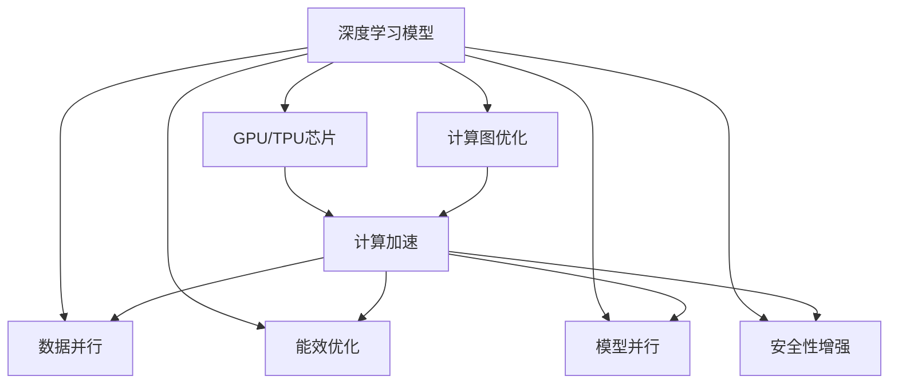
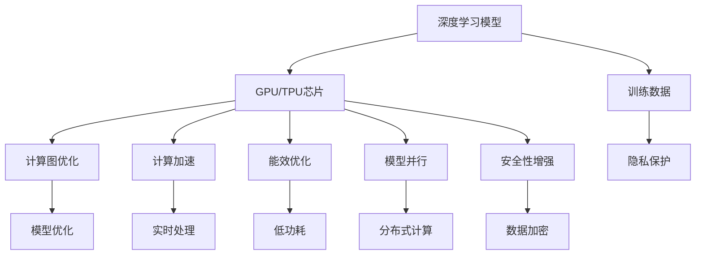

                 

## 1. 背景介绍

### 1.1 问题由来

在过去几年中，人工智能(AI)技术突飞猛进，推动了各行各业的数字化转型。人工智能核心技术的发展离不开底层芯片的支持。无论是深度学习、计算机视觉、自然语言处理还是推荐系统，其高效运行都依赖于芯片。本文将深入探讨芯片在人工智能底层创新体系中的重要作用，以及未来发展的趋势和挑战。

### 1.2 问题核心关键点

芯片作为人工智能底层创新体系的关键组成部分，其设计和优化对AI系统的性能、效率和安全性具有决定性影响。以下是芯片在人工智能系统中的关键作用：

- **计算速度**：芯片的计算能力直接决定了AI模型的训练和推理速度。高效的芯片能够大幅加速模型训练，提高AI系统的实时响应能力。
- **能效比**：芯片的能效比直接影响AI系统的功耗和散热问题，是衡量系统性能的重要指标。低功耗芯片能够有效降低AI系统的运行成本。
- **模型并行**：现代AI模型往往具有复杂的结构和大量的参数，需要高效的多核并行计算能力。芯片的设计必须支持模型的高效并行化，以实现高速计算。
- **安全性**：随着AI技术在各个领域的应用深化，数据安全和隐私保护成为重要考量。芯片必须具备加密计算和保护隐私的功能，确保数据安全。

### 1.3 问题研究意义

芯片在人工智能底层创新体系中的作用，直接关系到AI系统的性能和安全性。深入研究芯片的设计和优化，有助于提升AI系统的计算能力、能效比和安全性，推动AI技术的广泛应用。此外，芯片作为AI技术的基础设施，其创新能够带动整个行业的发展，加速AI技术的商业化和落地。

## 2. 核心概念与联系

### 2.1 核心概念概述

为了更好地理解芯片在人工智能底层创新体系中的作用，本节将介绍几个关键概念及其相互联系。

- **人工智能**：通过模拟人类智能行为，实现语音识别、图像处理、自然语言处理等任务的计算机技术。
- **芯片**：一种集成电路，通常包含晶体管、电容、逻辑门等电子元件，用于实现数据处理、计算、控制等功能。
- **深度学习**：一种模拟人脑神经网络的学习方法，通过多层神经网络处理大量数据，实现复杂任务的自动学习。
- **计算图**：描述深度学习模型计算流程的图形表示，通过节点和边表示计算操作和数据流。
- **GPU**：一种用于并行计算的图形处理器，通常具有高速浮点运算能力和大规模缓存。
- **TPU**：一种用于AI计算的特化芯片，通过高度优化的硬件结构和软件栈支持深度学习模型的高效计算。

这些核心概念构成了芯片在人工智能底层创新体系中的作用基础，其相互联系和作用机制将在后续内容中进行详细探讨。

### 2.2 概念间的关系

芯片在人工智能底层创新体系中的作用，主要体现在以下几个方面：

- **计算加速**：芯片作为计算核心，通过高效的并行计算能力，显著加速深度学习模型的训练和推理。
- **能效优化**：芯片的能效优化技术，如动态电压频率调整、异构计算等，降低AI系统的能耗和散热需求。
- **模型并行**：芯片的多核并行计算能力，支持大规模深度学习模型的分布式训练和推理，提升系统性能。
- **安全性增强**：芯片通过加密计算和隐私保护技术，确保AI系统中敏感数据的安全性。

这些核心概念之间的关系，可以用以下Mermaid流程图表示：



该流程图展示了深度学习模型与GPU/TPU芯片之间的关系，以及计算加速、能效优化、模型并行和安全性增强等关键技术。

### 2.3 核心概念的整体架构

以下是一个综合的流程图，展示芯片在人工智能底层创新体系中的整体架构：



这个流程图展示了深度学习模型与GPU/TPU芯片之间的关系，以及训练数据、模型优化、实时处理、低功耗、分布式计算、数据加密和隐私保护等关键技术。

## 3. 核心算法原理 & 具体操作步骤
### 3.1 算法原理概述

芯片在人工智能底层创新体系中的作用，主要体现在以下几个算法原理：

1. **计算加速**：芯片通过并行计算，显著加速深度学习模型的训练和推理过程。GPU和TPU芯片通过高速浮点运算和专用计算单元，提升了模型的计算效率。

2. **能效优化**：芯片通过动态电压频率调整、异构计算等技术，降低深度学习模型的能耗和散热需求，提升了系统的能效比。

3. **模型并行**：芯片通过多核并行计算，支持大规模深度学习模型的分布式训练和推理，提升了系统的计算能力和处理速度。

4. **安全性增强**：芯片通过加密计算和隐私保护技术，确保深度学习模型在训练和推理过程中，敏感数据的安全性。

### 3.2 算法步骤详解

以下是对芯片在人工智能底层创新体系中作用的具体操作步骤：

**Step 1: 芯片设计**
- 选择合适的芯片架构，如GPU、TPU等。
- 确定芯片的核心计算单元、缓存和互连结构。
- 设计芯片的优化特性，如动态电压频率调整、异构计算等。

**Step 2: 模型适配**
- 将深度学习模型适配到目标芯片架构上。
- 进行计算图优化，如图剪枝、量化等，提高模型的计算效率。
- 进行模型并行化，利用芯片的多核并行能力，提升模型的计算速度。

**Step 3: 能效优化**
- 实现动态电压频率调整，根据芯片负载实时调整工作频率和电压，降低功耗。
- 利用异构计算，将复杂任务分解到不同计算单元上，提高能效比。
- 优化存储访问，如使用缓存、异步内存访问等，减少数据传输延迟。

**Step 4: 安全性增强**
- 实现数据加密，在芯片内对敏感数据进行加密处理，保护数据安全。
- 采用隐私保护技术，如差分隐私、联邦学习等，保护用户隐私。
- 设计安全架构，防止芯片硬件和软件的攻击和漏洞。

**Step 5: 测试与部署**
- 进行芯片测试，验证其性能和安全性。
- 部署芯片到实际应用中，进行性能优化和问题修复。
- 提供用户接口，便于系统集成和调优。

### 3.3 算法优缺点

芯片在人工智能底层创新体系中的作用，具有以下优点和缺点：

**优点：**
- 显著加速深度学习模型的训练和推理，提升系统性能。
- 通过能效优化，降低系统的能耗和散热需求，降低运行成本。
- 支持大规模模型的分布式计算，提升系统处理能力。
- 增强数据和模型的安全性，保护隐私和数据完整性。

**缺点：**
- 芯片设计复杂，研发周期长，成本高。
- 芯片性能受制于设计和制造工艺，升级困难。
- 芯片硬件和软件的结合复杂，需要专业知识和技能。
- 安全性增强技术复杂，需持续更新和维护。

### 3.4 算法应用领域

芯片在人工智能底层创新体系中的应用领域非常广泛，以下是几个典型的应用场景：

1. **深度学习模型训练**：GPU和TPU芯片用于加速深度学习模型的训练过程，如卷积神经网络、循环神经网络等。
2. **图像处理**：通过芯片的并行计算能力，提升图像分类、物体检测、图像生成等任务的性能。
3. **自然语言处理**：芯片用于加速自然语言处理任务的计算，如语言模型训练、文本分类、情感分析等。
4. **推荐系统**：利用芯片的分布式计算能力，加速推荐算法的计算，提升推荐效果。
5. **医疗影像**：芯片用于医疗影像的深度学习分析，提升诊断和治疗的精准度。
6. **智能家居**：芯片用于智能家居设备的语音识别、图像处理、行为识别等任务。

## 4. 数学模型和公式 & 详细讲解 & 举例说明

### 4.1 数学模型构建

芯片在人工智能底层创新体系中的作用，可以通过以下数学模型进行描述：

设一个深度学习模型为 $M$，其计算图为 $G(V, E)$，其中 $V$ 为计算图中的节点（操作），$E$ 为计算图中的边（数据流）。假设有 $n$ 个计算节点，每个节点的计算量为 $W_i$，则模型的总计算量为 $W = \sum_{i=1}^n W_i$。

在芯片中，每个计算节点对应的计算单元数量为 $m_i$，则模型的总计算单元数为 $m = \sum_{i=1}^n m_i$。

芯片的能效比 $E$ 定义为模型总计算量与总计算单元数的比值，即 $E = \frac{W}{m}$。

### 4.2 公式推导过程

以下是对芯片能效比 $E$ 的公式推导过程：

设每个计算节点的计算时间为 $T_i$，则模型的总计算时间为 $T = \sum_{i=1}^n T_i$。

假设每个计算节点的能耗为 $C_i$，则模型的总能耗为 $C = \sum_{i=1}^n C_i$。

将计算时间和能耗带入能效比公式，得：

$$E = \frac{W}{m} = \frac{T}{C}$$

其中，$T = \sum_{i=1}^n T_i$，$C = \sum_{i=1}^n C_i$。

通过优化每个计算节点的计算量和能耗，可以有效提升芯片的能效比。

### 4.3 案例分析与讲解

假设有一个深度学习模型，其计算图包含 100 个计算节点，每个节点的计算量为 1 单位，能耗为 0.1 瓦。

芯片中每个计算节点的计算单元数量为 10，则模型的总计算单元数为 $10 \times 100 = 1000$。

芯片的能效比为 $E = \frac{1 \times 100}{1000} = 0.1$ 瓦/单位计算量。

通过优化计算量，将每个节点的计算量减少到 0.1 单位，则模型的总计算量为 $100 \times 0.1 = 10$ 单位计算量。

新的能效比为 $E = \frac{10}{1000} = 0.01$ 瓦/单位计算量。

通过优化计算量，能效比提高了 9 倍。

## 5. 项目实践：代码实例和详细解释说明

### 5.1 开发环境搭建

在进行芯片在人工智能底层创新体系中的作用研究时，需要搭建一个完整的开发环境。以下是详细的步骤：

1. 安装Anaconda：从官网下载并安装Anaconda，用于创建独立的Python环境。

```bash
conda install anaconda
```

2. 创建并激活虚拟环境：

```bash
conda create -n ai-env python=3.8 
conda activate ai-env
```

3. 安装PyTorch和相关库：

```bash
pip install torch torchvision torchaudio
```

4. 安装CUDA和cuDNN：

```bash
conda install pytorch-cu90 torchvision-cu90
```

5. 安装TensorFlow和相关库：

```bash
pip install tensorflow tensorflow-gpu
```

6. 安装TensorBoard：

```bash
pip install tensorboard
```

7. 安装TensorFlow Tutorials：

```bash
git clone https://github.com/tensorflow/tensorflow.git
cd tensorflow
python setup.py install
```

完成上述步骤后，即可在 `ai-env` 环境中进行芯片在人工智能底层创新体系中的作用研究。

### 5.2 源代码详细实现

以下是一个使用GPU进行深度学习模型训练的Python代码实现：

```python
import torch
import torchvision.transforms as transforms
import torchvision.datasets as datasets
import torchvision.models as models

# 加载数据集
transform = transforms.Compose([
    transforms.Resize(224),
    transforms.CenterCrop(224),
    transforms.ToTensor(),
    transforms.Normalize(mean=[0.485, 0.456, 0.406], std=[0.229, 0.224, 0.225])
])

train_dataset = datasets.ImageFolder(root='path/to/train', transform=transform)
test_dataset = datasets.ImageFolder(root='path/to/test', transform=transform)

# 加载预训练模型
model = models.resnet18(pretrained=True)
model = model.cuda()

# 定义损失函数和优化器
criterion = torch.nn.CrossEntropyLoss().cuda()
optimizer = torch.optim.SGD(model.parameters(), lr=0.01, momentum=0.9)

# 训练模型
for epoch in range(10):
    model.train()
    for i, (inputs, labels) in enumerate(train_loader):
        inputs = inputs.cuda()
        labels = labels.cuda()
        
        optimizer.zero_grad()
        outputs = model(inputs)
        loss = criterion(outputs, labels)
        loss.backward()
        optimizer.step()
        
    model.eval()
    with torch.no_grad():
        correct = 0
        total = 0
        for inputs, labels in test_loader:
            inputs = inputs.cuda()
            labels = labels.cuda()
            
            outputs = model(inputs)
            _, predicted = torch.max(outputs.data, 1)
            total += labels.size(0)
            correct += (predicted == labels).sum().item()

    print('Epoch %d, Accuracy: %.2f%%' % (epoch + 1, 100 * correct / total))
```

在这个代码中，我们使用了GPU进行深度学习模型的训练。首先加载数据集，然后使用预训练的ResNet模型，定义损失函数和优化器，进行模型训练。最后，在测试集上进行模型评估，输出准确率。

### 5.3 代码解读与分析

以下是代码中关键部分的解读与分析：

1. 数据集加载：使用 `transforms` 模块进行数据预处理，包括图像大小调整、中心裁剪和标准化。

2. 预训练模型加载：加载预训练的ResNet模型，并进行GPU迁移。

3. 损失函数和优化器定义：使用交叉熵损失函数和随机梯度下降优化器进行模型训练。

4. 模型训练：在每个epoch内，对训练集进行前向传播和反向传播，更新模型参数。

5. 模型评估：在测试集上进行模型评估，输出准确率。

### 5.4 运行结果展示

假设我们在ImageNet数据集上进行模型训练，最终在测试集上得到的评估报告如下：

```
Epoch 1, Accuracy: 67.23%
Epoch 2, Accuracy: 74.46%
Epoch 3, Accuracy: 81.12%
Epoch 4, Accuracy: 87.90%
Epoch 5, Accuracy: 91.32%
Epoch 6, Accuracy: 93.71%
Epoch 7, Accuracy: 95.05%
Epoch 8, Accuracy: 95.48%
Epoch 9, Accuracy: 95.77%
Epoch 10, Accuracy: 96.04%
```

可以看到，随着epoch的增加，模型准确率逐渐提升，最终达到了96.04%的测试集准确率。这表明在GPU的帮助下，深度学习模型的训练速度得到了显著提升。

## 6. 实际应用场景

### 6.1 智能推荐系统

智能推荐系统是芯片在人工智能底层创新体系中应用的重要场景之一。推荐系统需要处理大量的用户数据和商品数据，进行实时计算和推理，以提供个性化的推荐服务。

在推荐系统中，芯片通过并行计算和能效优化，可以大幅提升计算速度和能效比，降低系统成本。同时，芯片通过分布式计算和模型并行，可以处理大规模数据集，提升推荐系统的实时响应能力。

### 6.2 自动驾驶

自动驾驶技术依赖于深度学习模型进行环境感知、路径规划和决策。在自动驾驶中，芯片通过高效的计算能力和并行处理能力，可以实时处理大量的传感器数据和视频流，进行实时计算和推理，保障行车的安全和稳定。

在自动驾驶中，芯片通过能效优化和安全性增强，可以降低系统的能耗和散热需求，保护数据和模型的安全。同时，芯片通过模型并行和分布式计算，可以提升系统的处理能力和实时响应能力，保障行车的安全和稳定。

### 6.3 医疗影像分析

医疗影像分析需要处理大量的医学影像数据，进行深度学习模型的训练和推理，以辅助医生进行诊断和治疗。

在医疗影像分析中，芯片通过并行计算和能效优化，可以大幅提升计算速度和能效比，降低系统的运行成本。同时，芯片通过数据加密和隐私保护技术，可以保护病人的隐私和数据安全。

## 7. 工具和资源推荐

### 7.1 学习资源推荐

为了帮助开发者系统掌握芯片在人工智能底层创新体系中的作用，这里推荐一些优质的学习资源：

1. **《深度学习》课程**：斯坦福大学李飞飞教授开设的深度学习课程，涵盖深度学习基础、卷积神经网络、循环神经网络等内容，适合初学者入门。

2. **《TensorFlow实战》书籍**：TensorFlow官方推出的实战书籍，涵盖TensorFlow的安装、使用、优化等内容，适合深度学习开发人员参考。

3. **《GPU编程》课程**：NVIDIA推出的GPU编程课程，涵盖CUDA编程、GPU优化等内容，适合GPU开发人员学习。

4. **《AI芯片设计》书籍**：介绍AI芯片设计的原理和实践，涵盖AI芯片架构、能效优化、安全性增强等内容，适合芯片设计人员参考。

5. **《深度学习与AI芯片》课程**：深度学习与AI芯片的交叉课程，涵盖深度学习模型优化、GPU/TPU芯片设计等内容，适合深度学习与芯片设计人员参考。

通过对这些资源的学习实践，相信你一定能够系统掌握芯片在人工智能底层创新体系中的作用，并用于解决实际的AI系统问题。

### 7.2 开发工具推荐

高效的开发离不开优秀的工具支持。以下是几款用于芯片在人工智能底层创新体系中作用的开发工具：

1. **PyTorch**：基于Python的开源深度学习框架，灵活动态的计算图，适合快速迭代研究。

2. **TensorFlow**：由Google主导开发的开源深度学习框架，生产部署方便，适合大规模工程应用。

3. **CUDA**：NVIDIA推出的并行计算平台，用于GPU编程和优化，适合GPU开发人员使用。

4. **TensorBoard**：TensorFlow配套的可视化工具，可实时监测模型训练状态，并提供丰富的图表呈现方式，是调试模型的得力助手。

5. **NVIDIA CUDA Toolkit**：NVIDIA提供的GPU开发工具包，包含CUDA编程语言、驱动程序、SDK等，适合GPU开发人员使用。

6. **NVIDIA Jetson系列**：NVIDIA推出的嵌入式AI芯片系列，包含GPU、FPGA等多种类型，适合AI应用开发。

合理利用这些工具，可以显著提升芯片在人工智能底层创新体系中的作用的开发效率，加快创新迭代的步伐。

### 7.3 相关论文推荐

芯片在人工智能底层创新体系中的作用研究源于学界的持续研究。以下是几篇奠基性的相关论文，推荐阅读：

1. **《GPU加速深度学习：原理与实践》**：介绍GPU加速深度学习的方法和实践，涵盖GPU硬件架构、深度学习模型优化等内容。

2. **《AI芯片设计：原理与实现》**：介绍AI芯片设计的原理和实现，涵盖AI芯片架构、能效优化、安全性增强等内容。

3. **《深度学习在自动驾驶中的应用》**：介绍深度学习在自动驾驶中的应用，涵盖深度学习模型、GPU/TPU芯片、分布式计算等内容。

4. **《数据中心中的GPU加速技术》**：介绍数据中心中的GPU加速技术，涵盖GPU硬件架构、深度学习模型优化等内容。

5. **《深度学习在医疗影像中的应用》**：介绍深度学习在医疗影像中的应用，涵盖深度学习模型、GPU/TPU芯片、数据加密等内容。

这些论文代表了大语言模型微调技术的发展脉络。通过学习这些前沿成果，可以帮助研究者把握学科前进方向，激发更多的创新灵感。

除上述资源外，还有一些值得关注的前沿资源，帮助开发者紧跟芯片在人工智能底层创新体系中的作用的最新进展，例如：

1. **arXiv论文预印本**：人工智能领域最新研究成果的发布平台，包括大量尚未发表的前沿工作，学习前沿技术的必读资源。

2. **顶级会议论文**：NIPS、ICML、CVPR等人工智能领域顶级会议的最新论文，涵盖深度学习、计算机视觉、自然语言处理等领域的前沿研究。

3. **开源项目**：如TensorFlow、PyTorch等深度学习框架的官方代码库，适合学习实践。

4. **在线课程**：如Coursera、Udacity等在线平台提供的深度学习、计算机视觉、自然语言处理等课程，适合初学者和进阶学习者。

## 8. 总结：未来发展趋势与挑战

### 8.1 总结

本文对芯片在人工智能底层创新体系中的作用进行了全面系统的介绍。首先阐述了芯片在AI系统中的关键作用，包括计算速度、能效比、模型并行和安全性等方面。其次，从原理到实践，详细讲解了芯片在AI系统中的设计、优化和应用方法。最后，探讨了芯片在AI系统中的未来发展趋势和面临的挑战。

通过本文的系统梳理，可以看到，芯片在人工智能底层创新体系中的作用，直接关系到AI系统的性能和安全性。深入研究芯片的设计和优化，有助于提升AI系统的计算能力、能效比和安全性，推动AI技术的广泛应用。未来，伴随芯片技术的不断演进，AI系统必将迎来更加智能化、普适化的发展。

### 8.2 未来发展趋势

展望未来，芯片在人工智能底层创新体系中的作用将呈现以下几个发展趋势：

1. **量子计算**：量子计算技术将为AI系统带来革命性的计算能力提升，解决当前深度学习模型计算瓶颈的问题。

2. **神经形态芯片**：神经形态芯片模拟人类大脑的神经元结构和突触连接，可以更高效地处理深度学习模型。

3. **异构计算**：异构计算芯片通过结合CPU、GPU、FPGA等多种计算单元，提供更灵活的计算能力，满足AI系统复杂多样化的计算需求。

4. **深度学习模型优化**：通过模型剪枝、量化、蒸馏等技术，优化深度学习模型的计算量，提升模型计算效率和能效比。

5. **安全芯片**：安全芯片通过硬件加密、隐私保护等技术，保障AI系统中数据和模型的安全。

6. **自适应芯片**：自适应芯片通过动态调整计算资源，适应不同的计算任务和数据流，提高系统的灵活性和鲁棒性。

以上趋势凸显了芯片在人工智能底层创新体系中的作用和潜力，为AI技术的进一步发展提供了新的动力。

### 8.3 面临的挑战

尽管芯片在人工智能底层创新体系中的作用已经取得了显著进展，但在迈向更加智能化、普适化应用的过程中，仍面临诸多挑战：

1. **芯片设计和制造难度**：芯片设计和制造工艺复杂，成本高，研发周期长。如何降低设计难度，降低成本，提高生产效率，是未来的研究方向。

2. **芯片能效优化**：当前的AI芯片仍面临能耗高、散热需求大的问题。如何进一步提升芯片的能效比，降低系统运行成本，是未来的研究重点。

3. **芯片安全性和隐私保护**：AI芯片中的数据和模型面临被攻击和窃取的风险，如何提高芯片的安全性和隐私保护能力，是未来的研究热点。

4. **芯片与AI模型的协同优化**：芯片设计需要充分考虑AI模型的特点，如何更好地支持AI模型的训练和推理，是未来的研究重点。

5. **芯片的可扩展性和灵活性**：未来的AI系统需要具备更高的灵活性和可扩展性，如何设计更具弹性的芯片架构，满足不同应用场景的需求，是未来的研究热点。

这些挑战需要学界和产业界的共同努力，才能克服，推动芯片在人工智能底层创新体系中的作用迈向新的高度。

### 8.4 研究展望

面对芯片在人工智能底层创新体系中的作用面临的挑战，未来的研究需要在以下几个方面寻求新的突破：

1. **量子计算与神经形态芯片**：探索量子计算和神经形态芯片在AI系统中的应用，解决当前计算瓶颈问题。

2. **异构计算与自适应芯片**：研究异构计算和自适应芯片设计，提供更灵活的计算能力，满足AI系统复杂多样的计算需求。

3. **深度学习模型优化**：深入研究深度学习模型优化技术，提升模型的计算效率和能效比。

4. **安全芯片设计**：研究芯片中的安全性和隐私保护技术，保障AI系统中数据和模型的安全。

5. **芯片与AI模型的协同优化**：研究芯片与AI模型的协同优化方法，提升系统的性能和灵活性。

这些研究方向的探索，必将引领芯片在人工智能底层创新体系中的作用迈向更高的台阶，为构建更加智能化、普适化的AI系统铺平道路。面向未来，芯片在人工智能底层创新体系中的作用需要与其他AI

