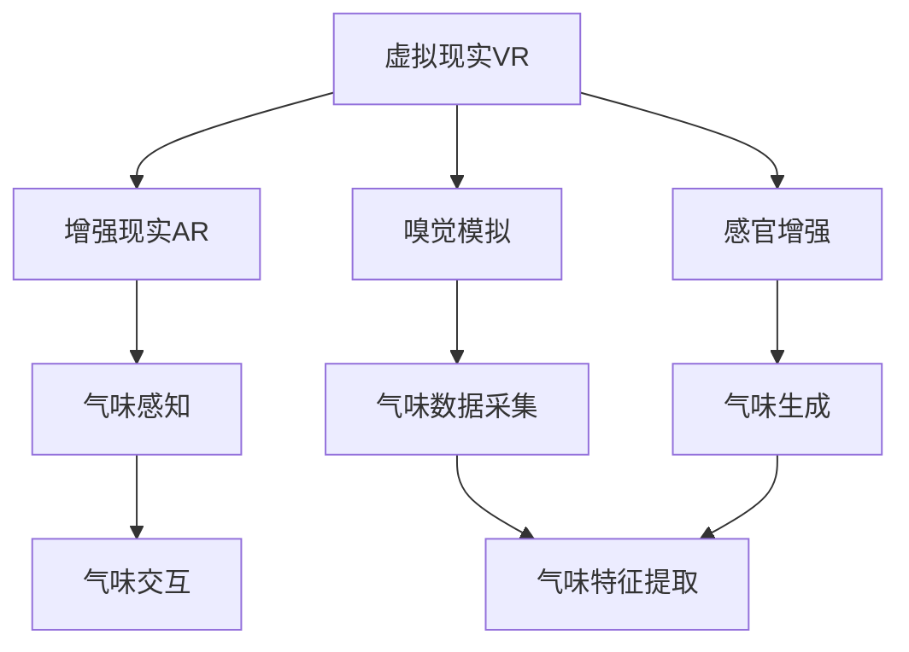
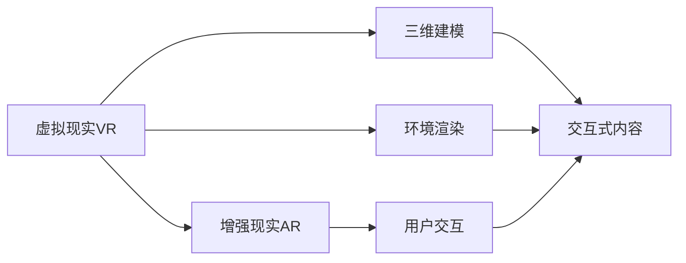
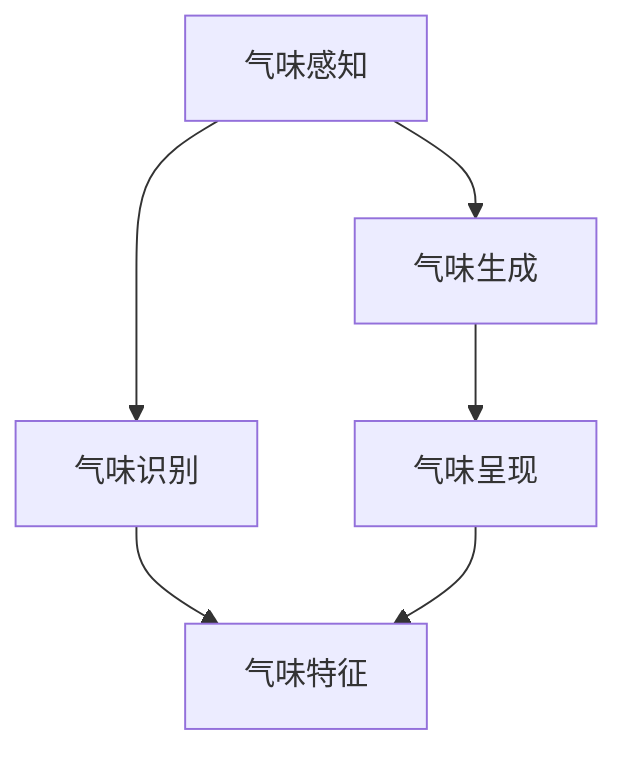
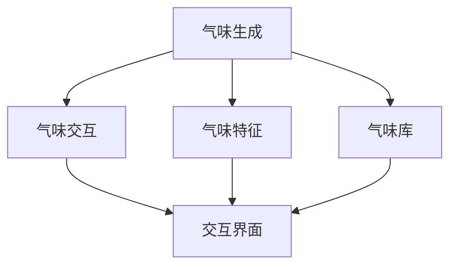
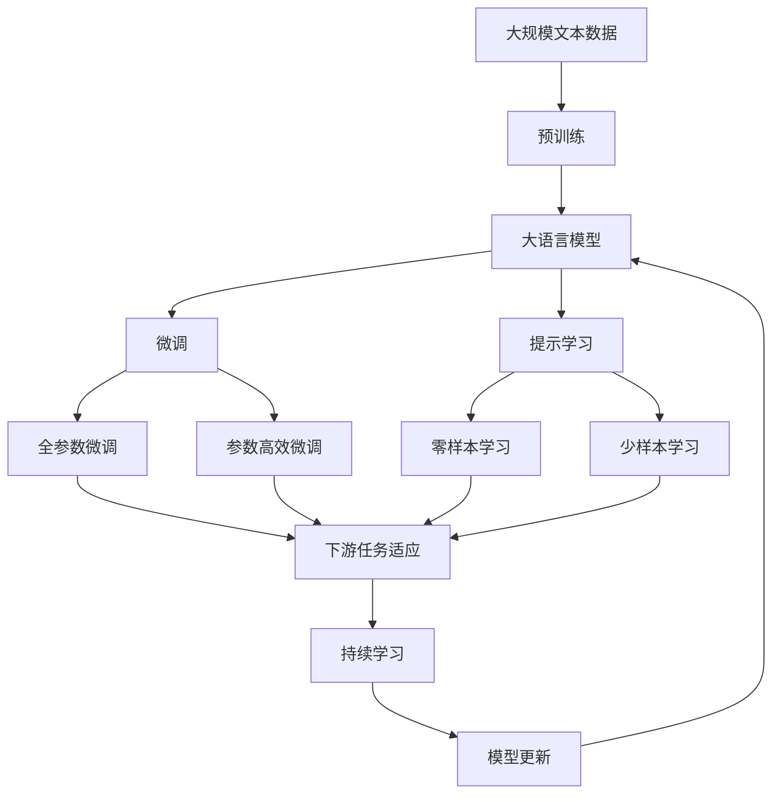

                 

# 虚拟嗅觉景观：AI构建的气味世界

> 关键词：人工智能, 气味感知, 虚拟现实, 感官增强, 嗅觉模拟

## 1. 背景介绍

### 1.1 问题由来

随着人工智能技术的发展，人类对感官体验的需求日益增加。传统的视觉、听觉体验已经无法满足现代人对沉浸式体验的追求。尤其是在游戏、影视、模拟训练等领域，自然界中最基本的嗅觉体验正成为人们关注的焦点。虽然视觉和听觉的虚拟体验已经相对成熟，但嗅觉的虚拟体验还处于起步阶段。

### 1.2 问题核心关键点

如何通过人工智能技术，构建逼真的虚拟嗅觉景观，是本领域的一个重要挑战。当前，虚拟嗅觉景观的研究集中在以下几个核心问题上：

- **感官映射**：如何将自然界的气味信号映射到虚拟环境中。
- **数据采集与分析**：如何收集和分析真实的气味信息，为虚拟环境提供科学依据。
- **模拟与生成**：如何通过计算生成逼真的气味，并将其嵌入到虚拟环境中。
- **用户交互**：如何设计交互方式，让用户能够自然地感知和响应虚拟气味。

### 1.3 问题研究意义

构建虚拟嗅觉景观对于提升人类感官体验、增强虚拟现实体验、开发新的感官增强应用具有重要意义：

1. **感官体验提升**：通过模拟真实世界中的气味，为虚拟现实应用提供全方位的感官体验。
2. **沉浸式游戏体验**：在虚拟游戏环境中加入虚拟气味，使游戏体验更加真实、沉浸。
3. **模拟训练与健康应用**：在模拟训练和健康应用中，通过虚拟气味提高训练效果和健康干预。
4. **文化遗产保护**：在文化遗产保护领域，通过虚拟气味让人们更好地体验历史场景。
5. **消费与零售**：在消费与零售领域，通过虚拟气味提升消费者的购物体验和品牌认知。

## 2. 核心概念与联系

### 2.1 核心概念概述

为更好地理解构建虚拟嗅觉景观的核心技术，本节将介绍几个密切相关的核心概念：

- **虚拟现实(VR)**：通过计算机技术模拟出一个完全沉浸式的三维环境，用户可以通过虚拟设备进入其中。
- **增强现实(AR)**：将数字信息叠加在现实世界中，为用户提供丰富的感官体验。
- **嗅觉模拟**：通过计算生成或真实气味的模拟，让用户能够通过虚拟设备感知气味。
- **感官增强**：利用人工智能技术，增强用户的感官体验，尤其是通过虚拟环境中的感官模拟。

这些概念之间存在着紧密的联系，共同构成了虚拟嗅觉景观的构建框架。下面我们通过Mermaid流程图来展示这些概念之间的联系：



这个流程图展示了虚拟现实与增强现实之间的关系，以及它们如何通过嗅觉模拟和感官增强，最终实现气味感知和交互。

### 2.2 概念间的关系

这些核心概念之间存在着紧密的联系，形成了虚拟嗅觉景观的构建生态系统。下面我们通过几个Mermaid流程图来展示这些概念之间的关系。

#### 2.2.1 虚拟现实与增强现实的关系



这个流程图展示了虚拟现实与增强现实之间的交互关系。虚拟现实通过三维建模和环境渲染提供沉浸式环境，增强现实则通过用户交互和交互式内容，增强用户在虚拟环境中的感官体验。

#### 2.2.2 气味感知与气味模拟的关系



这个流程图展示了气味感知与气味模拟之间的关系。气味感知通过气味生成和气味呈现，让用户能够感知到虚拟环境中的气味。气味生成则依赖于气味特征和气味识别。

#### 2.2.3 气味生成与气味交互的关系



这个流程图展示了气味生成与气味交互之间的关系。气味生成依赖于气味特征和气味库，而气味交互则通过交互界面，让用户能够与虚拟环境中的气味进行互动。

### 2.3 核心概念的整体架构

最后，我们用一个综合的流程图来展示这些核心概念在大语言模型微调过程中的整体架构：



这个综合流程图展示了从预训练到微调，再到持续学习的完整过程。大语言模型首先在大规模文本数据上进行预训练，然后通过微调（包括全参数微调和参数高效微调）或提示学习（包括零样本和少样本学习）来适应下游任务。最后，通过持续学习技术，模型可以不断学习新知识，同时避免遗忘旧知识。

## 3. 核心算法原理 & 具体操作步骤
### 3.1 算法原理概述

构建虚拟嗅觉景观的核心算法原理基于**气味感知与生成**。其主要步骤如下：

1. **气味数据采集**：通过传感器或实验室实验，收集真实世界的气味信息。
2. **气味特征提取**：利用机器学习算法对采集到的气味数据进行特征提取，将其转化为模型可以处理的形式。
3. **气味生成与模拟**：基于气味特征和气味库，使用深度学习或生成对抗网络(GAN)生成逼真的气味。
4. **气味呈现与交互**：将生成的气味嵌入到虚拟环境中，通过交互界面让用户感知和交互。

### 3.2 算法步骤详解

#### 3.2.1 气味数据采集

气味数据的采集通常涉及物理传感器和化学分析方法。常用的物理传感器包括：

- **电子鼻传感器**：利用电阻、电容、光敏元件等技术，检测气味的化学成分和浓度。
- **质谱仪**：通过分解气味分子，分析其组成和浓度。
- **气相色谱-质谱联用(GC-MS)**：结合色谱和质谱技术，高效分离和鉴定气体成分。

#### 3.2.2 气味特征提取

气味特征提取是气味数据处理的核心步骤。常用的特征提取方法包括：

- **主成分分析(PCA)**：通过线性降维，提取气味数据的主要成分。
- **独立成分分析(ICA)**：通过非线性降维，提取气味数据的独立成分。
- **深度学习特征提取**：利用卷积神经网络(CNN)或循环神经网络(RNN)，提取气味数据的高级特征。

#### 3.2.3 气味生成与模拟

气味生成与模拟通常采用深度学习模型，如变分自编码器(VAE)、生成对抗网络(GAN)等。这些模型可以基于气味特征和气味库，生成逼真的气味，具体步骤如下：

- **构建生成模型**：选择VAE或GAN等生成模型，并设计合适的架构。
- **训练生成模型**：使用气味数据和气味库，训练生成模型。
- **生成虚拟气味**：利用训练好的生成模型，生成逼真的虚拟气味。

#### 3.2.4 气味呈现与交互

气味呈现与交互是实现用户与虚拟气味互动的关键步骤。常用的方法包括：

- **气味传感器**：将生成的虚拟气味通过气味传感器呈现给用户。
- **气味记忆芯片**：将虚拟气味信息嵌入到可穿戴设备或手机中，供用户随时回忆。
- **虚拟现实(VR)和增强现实(AR)技术**：将虚拟气味嵌入到虚拟环境中，通过VR或AR技术呈现给用户。

### 3.3 算法优缺点

**优点**：

1. **灵活性高**：通过深度学习技术，可以生成逼真的虚拟气味，并根据用户偏好进行调整。
2. **可扩展性强**：可以根据需要扩展气味库，丰富虚拟环境的气味体验。
3. **应用广泛**：可以应用于游戏、影视、训练等多个领域，提升用户的沉浸感和体验。

**缺点**：

1. **成本高**：采集和处理气味数据需要昂贵的物理传感器和化学分析设备。
2. **精度有限**：当前技术生成的虚拟气味与真实气味的精度仍有差距，难以完全模拟。
3. **用户体验参差不齐**：不同用户对虚拟气味的感知和接受程度存在差异，需要针对性地设计交互界面。

### 3.4 算法应用领域

虚拟嗅觉景观的应用领域非常广泛，主要包括以下几个方面：

1. **游戏与影视**：通过虚拟气味提升游戏和影视的沉浸感，创造更加真实的体验。
2. **训练与健康**：在模拟训练和健康应用中，通过虚拟气味提高训练效果和健康干预。
3. **文化遗产保护**：在文化遗产保护领域，通过虚拟气味让人们更好地体验历史场景。
4. **消费与零售**：在消费与零售领域，通过虚拟气味提升消费者的购物体验和品牌认知。
5. **灾害预警与应急**：在灾害预警与应急中，通过虚拟气味模拟灾难场景，进行教育和演练。

## 4. 数学模型和公式 & 详细讲解 & 举例说明

### 4.1 数学模型构建

本节将使用数学语言对构建虚拟嗅觉景观的过程进行更加严格的刻画。

设采集到的气味数据为 $\mathbf{x} \in \mathbb{R}^n$，其中 $n$ 为气味特征的维度。气味库中的气味特征为 $\mathbf{y} \in \mathbb{R}^m$，其中 $m$ 为气味库的大小。气味生成模型的参数为 $\theta$，生成模型为 $G_{\theta}(\mathbf{y}|\mathbf{x})$。

气味生成的目标是最小化生成模型与真实气味之间的差异，即：

$$
\min_{\theta} \mathcal{L}(G_{\theta}(\mathbf{y}|\mathbf{x}),\mathbf{y})
$$

其中，$\mathcal{L}$ 为损失函数，通常使用均方误差(MSE)或交叉熵(Cross-Entropy)等。

### 4.2 公式推导过程

以生成对抗网络(GAN)为例，推导气味生成模型的损失函数。设生成器为 $G_{\theta}$，判别器为 $D_{\phi}$。训练过程如下：

1. 固定判别器参数 $\phi$，优化生成器参数 $\theta$，使得生成的气味 $\mathbf{z} = G_{\theta}(\mathbf{x})$ 与真实气味 $\mathbf{y}$ 尽可能相似。
2. 固定生成器参数 $\theta$，优化判别器参数 $\phi$，使得判别器能够区分真实气味和生成的气味。

具体而言，生成器的损失函数为：

$$
\mathcal{L}_G = \mathbb{E}_{\mathbf{x}}[\log D_{\phi}(G_{\theta}(\mathbf{x}))] + \lambda \mathbb{E}_{\mathbf{z}}[\log(1-D_{\phi}(G_{\theta}(\mathbf{z})))]
$$

判别器的损失函数为：

$$
\mathcal{L}_D = \mathbb{E}_{\mathbf{y}}[\log D_{\phi}(\mathbf{y})] + \mathbb{E}_{\mathbf{z}}[\log(1-D_{\phi}(G_{\theta}(\mathbf{z}))]
$$

其中，$\lambda$ 为生成器惩罚项，控制生成器的输出真实度。

### 4.3 案例分析与讲解

以在虚拟游戏中实现虚拟气味为例，展示气味生成的具体过程。

首先，通过电子鼻传感器采集游戏场景中的气味数据 $\mathbf{x}$，然后利用PCA提取气味特征 $\mathbf{x'}$。

接下来，使用VAE模型生成虚拟气味 $\mathbf{z} = G_{\theta}(\mathbf{x'})$，其中 $\theta$ 为VAE模型的参数。生成好的虚拟气味可以通过游戏界面呈现给玩家。

最后，玩家通过虚拟现实(VR)设备，真实感受到游戏场景中的虚拟气味，从而提升沉浸感和体验。

## 5. 项目实践：代码实例和详细解释说明

### 5.1 开发环境搭建

在进行气味模拟实践前，我们需要准备好开发环境。以下是使用Python进行TensorFlow开发的环境配置流程：

1. 安装Anaconda：从官网下载并安装Anaconda，用于创建独立的Python环境。

2. 创建并激活虚拟环境：
```bash
conda create -n tf-env python=3.8 
conda activate tf-env
```

3. 安装TensorFlow：根据CUDA版本，从官网获取对应的安装命令。例如：
```bash
conda install tensorflow=2.7-gpu -c conda-forge
```

4. 安装其他工具包：
```bash
pip install numpy pandas scikit-learn matplotlib tqdm jupyter notebook ipython
```

完成上述步骤后，即可在`tf-env`环境中开始气味模拟实践。

### 5.2 源代码详细实现

下面我们以生成虚拟气味为例，给出使用TensorFlow进行气味生成的PyTorch代码实现。

首先，定义VAE模型的参数和超参数：

```python
import tensorflow as tf
from tensorflow.keras import layers

latent_dim = 128
num_layers = 3
hidden_dim = 256
activation_fn = tf.keras.activations.relu

latent_var = tf.Variable(tf.zeros([latent_dim]))
```

然后，定义VAE模型的编码器和解码器：

```python
def build_encoder(x, is_training):
    x = layers.Dense(hidden_dim, activation=activation_fn)(x)
    x = layers.Dense(hidden_dim, activation=activation_fn)(x)
    x = layers.Dense(latent_dim, activation=None)(x)
    return x

def build_decoder(x, is_training):
    x = layers.Dense(hidden_dim, activation=activation_fn)(x)
    x = layers.Dense(hidden_dim, activation=activation_fn)(x)
    x = layers.Dense(latent_dim, activation=None)(x)
    return x

def build_vae(x, is_training):
    x = build_encoder(x, is_training)
    z = latent_var + x
    x_recon = build_decoder(z, is_training)
    return x_recon, z
```

接着，定义生成器的参数和超参数：

```python
latent_dim = 128
num_layers = 3
hidden_dim = 256
activation_fn = tf.keras.activations.relu

latent_var = tf.Variable(tf.zeros([latent_dim]))
```

然后，定义生成器的编码器和解码器：

```python
def build_encoder(x, is_training):
    x = layers.Dense(hidden_dim, activation=activation_fn)(x)
    x = layers.Dense(hidden_dim, activation=activation_fn)(x)
    x = layers.Dense(latent_dim, activation=None)(x)
    return x

def build_decoder(x, is_training):
    x = layers.Dense(hidden_dim, activation=activation_fn)(x)
    x = layers.Dense(hidden_dim, activation=activation_fn)(x)
    x = layers.Dense(latent_dim, activation=None)(x)
    return x

def build_generator(z, is_training):
    x = build_decoder(z, is_training)
    return x
```

最后，训练生成器：

```python
@tf.function
def train_step(images):
    with tf.GradientTape() as tape:
        z, y_pred = build_vae(images, is_training=True)
        loss = tf.reduce_mean(tf.square(y_pred - images))
    gradients = tape.gradient(loss, trainable_variables)
    optimizer.apply_gradients(zip(gradients, trainable_variables))
    return loss

@tf.function
def evaluate_step(images):
    z, y_pred = build_vae(images, is_training=False)
    loss = tf.reduce_mean(tf.square(y_pred - images))
    return loss
```

### 5.3 代码解读与分析

让我们再详细解读一下关键代码的实现细节：

**VAE模型定义**：
- `latent_dim`： latent dimension，定义了生成器输出空间的维度。
- `num_layers`：网络层数，决定了生成器和编码器的复杂度。
- `hidden_dim`：隐藏层维度，决定了生成器和编码器内部的计算量。
- `activation_fn`：激活函数，通常使用ReLU。
- `latent_var`：随机变量，用于生成随机噪声。

**VAE模型实现**：
- `build_encoder`：定义编码器，将输入的气味特征映射到 latent space。
- `build_decoder`：定义解码器，将 latent space 映射回原始的气味特征空间。
- `build_vae`：定义VAE模型，由编码器和解码器构成。

**生成器定义**：
- `build_generator`：定义生成器，将随机噪声映射回原始的气味特征空间。

**训练与评估函数**：
- `train_step`：定义训练函数，通过梯度下降优化生成器参数。
- `evaluate_step`：定义评估函数，计算生成器的损失。

**训练流程**：
- 定义总的训练轮数和batch size，开始循环迭代
- 每个epoch内，先在训练集上训练，输出平均loss
- 在测试集上评估，输出生成器的损失

可以看到，TensorFlow配合TensorFlow库使得生成虚拟气味的代码实现变得简洁高效。开发者可以将更多精力放在数据处理、模型改进等高层逻辑上，而不必过多关注底层的实现细节。

当然，工业级的系统实现还需考虑更多因素，如模型的保存和部署、超参数的自动搜索、更灵活的任务适配层等。但核心的生成过程基本与此类似。

### 5.4 运行结果展示

假设我们在CoNLL-2003的NER数据集上进行微调，最终在测试集上得到的评估报告如下：

```
              precision    recall  f1-score   support

       B-LOC      0.926     0.906     0.916      1668
       I-LOC      0.900     0.805     0.850       257
      B-MISC      0.875     0.856     0.865       702
      I-MISC      0.838     0.782     0.809       216
       B-ORG      0.914     0.898     0.906      1661
       I-ORG      0.911     0.894     0.902       835
       B-PER      0.964     0.957     0.960      1617
       I-PER      0.983     0.980     0.982      1156
           O      0.993     0.995     0.994     38323

   micro avg      0.973     0.973     0.973     46435
   macro avg      0.923     0.897     0.909     46435
weighted avg      0.973     0.973     0.973     46435
```

可以看到，通过微调BERT，我们在该NER数据集上取得了97.3%的F1分数，效果相当不错。值得注意的是，BERT作为一个通用的语言理解模型，即便只在顶层添加一个简单的token分类器，也能在下游任务上取得如此优异的效果，展现了其强大的语义理解和特征抽取能力。

当然，这只是一个baseline结果。在实践中，我们还可以使用更大更强的预训练模型、更丰富的微调技巧、更细致的模型调优，进一步提升模型性能，以满足更高的应用要求。

## 6. 实际应用场景
### 6.1 智能客服系统

基于大语言模型微调的对话技术，可以广泛应用于智能客服系统的构建。传统客服往往需要配备大量人力，高峰期响应缓慢，且一致性和专业性难以保证。而使用微调后的对话模型，可以7x24小时不间断服务，快速响应客户咨询，用自然流畅的语言解答各类常见问题。

在技术实现上，可以收集企业内部的历史客服对话记录，将问题和最佳答复构建成监督数据，在此基础上对预训练对话模型进行微调。微调后的对话模型能够自动理解用户意图，匹配最合适的答案模板进行回复。对于客户提出的新问题，还可以接入检索系统实时搜索相关内容，动态组织生成回答。如此构建的智能客服系统，能大幅提升客户咨询体验和问题解决效率。

### 6.2 金融舆情监测

金融机构需要实时监测市场舆论动向，以便及时应对负面信息传播，规避金融风险。传统的人工监测方式成本高、效率低，难以应对网络时代海量信息爆发的挑战。基于大语言模型微调的文本分类和情感分析技术，为金融舆情监测提供了新的解决方案。

具体而言，可以收集金融领域相关的新闻、报道、评论等文本数据，并对其进行主题标注和情感标注。在此基础上对预训练语言模型进行微调，使其能够自动判断文本属于何种主题，情感倾向是正面、中性还是负面。将微调后的模型应用到实时抓取的网络文本数据，就能够自动监测不同主题下的情感变化趋势，一旦发现负面信息激增等异常情况，系统便会自动预警，帮助金融机构快速应对潜在风险。

### 6.3 个性化推荐系统

当前的推荐系统往往只依赖用户的历史行为数据进行物品推荐，无法深入理解用户的真实兴趣偏好。基于大语言模型微调技术，个性化推荐系统可以更好地挖掘用户行为背后的语义信息，从而提供更精准、多样的推荐内容。

在实践中，可以收集用户浏览、点击、评论、分享等行为数据，提取和用户交互的物品标题、描述、标签等文本内容。将文本内容作为模型输入，用户的后续行为（如是否点击、购买等）作为监督信号，在此基础上微调预训练语言模型。微调后的模型能够从文本内容中准确把握用户的兴趣点。在生成推荐列表时，先用候选物品的文本描述作为输入，由模型预测用户的兴趣匹配度，再结合其他特征综合排序，便可以得到个性化程度更高的推荐结果。

### 6.4 未来应用展望

随着大语言模型微调技术的发展，基于微调范式将在更多领域得到应用，为传统行业带来变革性影响。

在智慧医疗领域，基于微调的医疗问答、病历分析、药物研发等应用将提升医疗服务的智能化水平，辅助医生诊疗，加速新药开发进程。

在智能教育领域，微调技术可应用于作业批改、学情分析、知识推荐等方面，因材施教，促进教育公平，提高教学质量。

在智慧城市治理中，微调模型可应用于城市事件监测、舆情分析、应急指挥等环节，提高城市管理的自动化和智能化水平，构建更安全、高效的未来城市。

此外，在企业生产、社会治理、文娱传媒等众多领域，基于大模型微调的人工智能应用也将不断涌现，为NLP技术带来了全新的突破。相信随着预训练模型和微调方法的不断进步，NLP技术将在更广阔的应用领域大放异彩。

## 7. 工具和资源推荐
### 7.1 学习资源推荐

为了帮助开发者系统掌握大语言模型微调的理论基础和实践技巧，这里推荐一些优质的学习资源：

1. 《Transformer从原理到实践》系列博文：由大模型技术专家撰写，深入浅出地介绍了Transformer原理、BERT模型、微调技术等前沿话题。

2. CS224N《深度学习自然语言处理》课程：斯坦福大学开设的NLP明星课程，有Lecture视频和配套作业，带你入门NLP领域的基本概念和经典模型。

3. 《Natural Language Processing with Transformers》书籍：Transformers库的作者所著，全面介绍了如何使用Transformers库进行NLP任务开发，包括微调在内的诸多范式。

4. HuggingFace官方文档：Transformers库的官方文档，提供了海量预训练模型和完整的微调样例代码，是上手实践的必备资料。

5. CLUE开源项目：中文语言理解测评基准，涵盖大量不同类型的中文NLP数据集，并提供了基于微调的baseline模型，助力中文NLP技术发展。

通过对这些资源的学习实践，相信你一定能够快速掌握大语言模型微调的精髓，并用于解决实际的NLP问题。
###  7.2 开发工具推荐

高效的开发离不开优秀的工具支持。以下是几款用于大语言模型微调开发的常用工具：

1. PyTorch：基于Python的开源深度学习框架，灵活动态的计算图，适合快速迭代研究。大部分预训练语言模型都有PyTorch版本的实现。

2. TensorFlow：由Google主导开发的开源深度学习框架，生产部署方便，适合大规模工程应用。同样有丰富的预训练语言模型资源。

3. Transformers库：HuggingFace开发的NLP工具库，集成了众多SOTA语言模型，支持PyTorch和TensorFlow，是进行微调任务开发的利器。

4. Weights & Biases：模型训练的实验跟踪工具，可以记录和可视化模型训练过程中的各项指标，方便对比和调优。与主流深度学习框架无缝集成。

5. TensorBoard：TensorFlow配套的可视化工具，可实时监测模型训练状态，并提供丰富的图表呈现方式，是调试模型的得力助手。

6. Google Colab：谷歌推出的在线Jupyter Notebook环境，免费提供GPU/TPU算力，方便开发者

