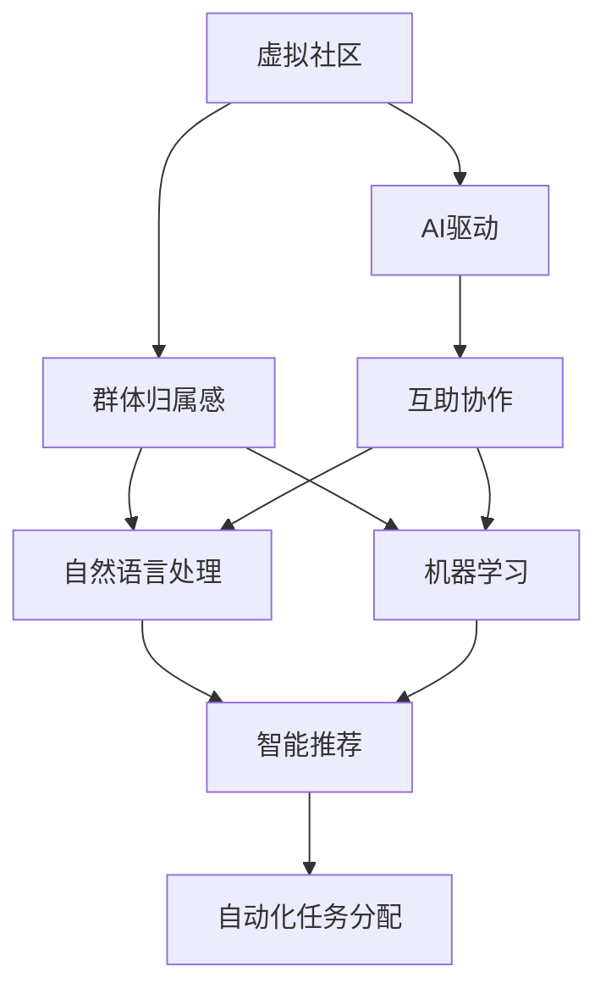
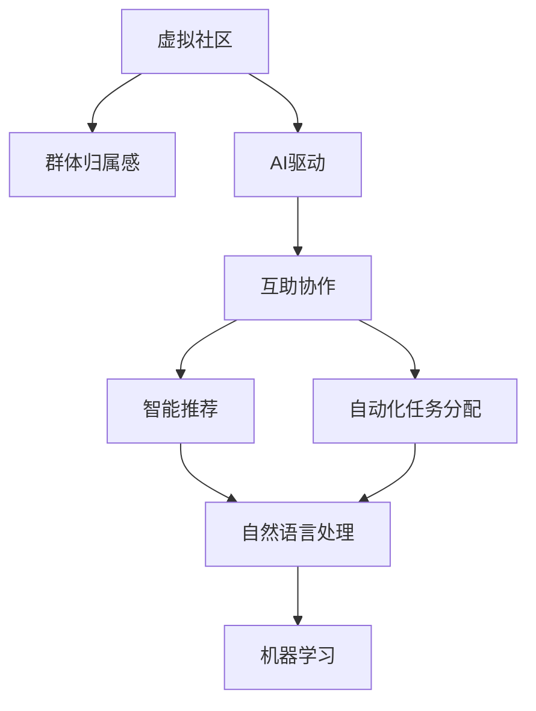

                 

# 虚拟社区：AI驱动的群体归属感

在数字时代，虚拟社区正迅速成为人们社交、学习和工作的新型空间。这一现象不仅反映了人类社会交往模式的变迁，也揭示了人工智能(AI)技术在促进群体归属感、凝聚力和互助协作方面的巨大潜力。本文旨在深入探讨AI驱动的虚拟社区背后的原理、操作技术及其应用场景，为构建更加紧密、和谐的数字化社群提供理论和实践指引。

## 1. 背景介绍

### 1.1 问题由来

随着互联网技术的发展和智能设备的普及，越来越多的人将大量时间投入到虚拟社交平台和网络社区中。传统的面对面交流逐渐被在线沟通所替代，虚拟社区成为了连接人与人、组织与组织的重要纽带。然而，这种线上交往方式也带来了新的挑战，如孤独感增加、社交障碍等问题。虚拟社区如何利用AI技术，为成员创造更强的归属感和互助协作，成为亟待解决的问题。

### 1.2 问题核心关键点

- **虚拟社区**：基于互联网的社交平台，用户通过线上活动进行互动和交流，构建虚拟关系网络。
- **群体归属感**：用户对社区的认同感和依恋感，表现为社区成员间的信任、互助和共同目标。
- **AI驱动**：利用人工智能技术，如自然语言处理、机器学习等，提升社区管理和服务效率，增强用户互动和体验。
- **互助协作**：通过智能推荐、自动化任务分配等，促进社区成员之间的互助和协作。
- **自组织网络**：用户自主构建的社会网络，通过智能算法推荐，自动形成具有特定属性的群体。

这些关键点构成了AI驱动的虚拟社区的框架，为后续的深入分析和实践提供了明确的指引。

### 1.3 问题研究意义

深入研究AI驱动的虚拟社区，对于促进人类社会的数字化转型、推动社交网络的智能化发展、提升用户体验和信任关系具有重要意义。具体而言，研究AI技术如何增强虚拟社区的群体归属感和互助协作，可以：
- 提供技术支持，帮助虚拟社区更好地管理和服务用户。
- 优化用户互动体验，提高社区的活跃度和粘性。
- 推动社交网络智能化的新范式，开拓AI技术应用的新场景。
- 提升社区成员的群体归属感，构建更加紧密、和谐的数字化环境。

## 2. 核心概念与联系

### 2.1 核心概念概述

在深入探讨AI驱动的虚拟社区之前，我们先来明确几个关键概念：

- **虚拟社区**：一种基于互联网的社交形式，用户通过线上平台进行交流和互动，构建虚拟关系网络。
- **群体归属感**：用户对虚拟社区的认同和依恋，表现为社区成员间的信任、互助和共同目标。
- **AI驱动**：利用AI技术，如自然语言处理、机器学习等，提升社区管理和服务效率，增强用户互动和体验。
- **互助协作**：通过智能推荐、自动化任务分配等，促进社区成员之间的互助和协作。
- **自组织网络**：用户自主构建的社会网络，通过智能算法推荐，自动形成具有特定属性的群体。

这些概念相互关联，共同构成了AI驱动虚拟社区的基础。理解这些概念的原理和架构，是深入分析虚拟社区背后技术的关键。

### 2.2 概念间的关系

以下通过Mermaid流程图展示这些核心概念之间的关系：



这个流程图展示了AI驱动虚拟社区的核心概念及其相互关系：

- 虚拟社区（A）通过AI技术（C）实现智能化管理和服务，增强用户互动和体验。
- 群体归属感（B）是虚拟社区的核心目标之一，通过AI技术（C）和互助协作（D）得到提升。
- AI驱动（C）涉及自然语言处理（E）和机器学习（F），通过智能推荐（G）和自动化任务分配（H），优化社区运营和用户互动。

### 2.3 核心概念的整体架构

最终，我们可以用如下的综合流程图展示AI驱动虚拟社区的整体架构：



这个综合流程图展示了从虚拟社区（A）到群体归属感（B）的整体架构，通过AI驱动（C）和互助协作（D），利用智能推荐（E）和自动化任务分配（F），借助自然语言处理（G）和机器学习（H），实现虚拟社区的智能化管理和服务。

## 3. 核心算法原理 & 具体操作步骤

### 3.1 算法原理概述

AI驱动的虚拟社区主要依赖自然语言处理和机器学习等技术，实现智能化的社区管理和服务。具体而言，包括以下几个关键步骤：

1. **数据收集与预处理**：收集社区成员的在线行为数据，如互动日志、发布内容、兴趣偏好等，并进行清洗和标注。
2. **特征工程**：从收集的数据中提取有用特征，如用户兴趣、互动频率、社区活跃度等，作为后续算法的输入。
3. **模型训练**：使用机器学习算法，如协同过滤、聚类、分类等，训练出能够描述社区成员行为模式的模型。
4. **智能推荐与互助协作**：通过模型预测社区成员的兴趣和需求，进行智能推荐和互助协作，如内容推荐、好友推荐、任务分配等。

### 3.2 算法步骤详解

以下是AI驱动虚拟社区的详细步骤：

1. **数据收集**：
   - 通过API接口、爬虫等方式，收集社区成员的在线行为数据，如发布内容、评论互动、关注好友等。
   - 清洗数据，去除噪声和无用信息，确保数据的质量和完整性。

2. **特征工程**：
   - 提取有意义的特征，如用户ID、发布时间、内容长度、互动频率、兴趣标签等。
   - 使用TF-IDF、词向量等技术，将文本数据转化为数值特征。

3. **模型训练**：
   - 选择适合的机器学习算法，如协同过滤、K-Means聚类、朴素贝叶斯分类等。
   - 划分训练集和测试集，使用交叉验证等技术进行模型训练和调优。

4. **智能推荐**：
   - 根据用户的行为特征和偏好，预测其可能感兴趣的内容或用户。
   - 利用协同过滤、矩阵分解等技术，推荐个性化的内容和用户。

5. **互助协作**：
   - 通过分析社区成员的活跃度和兴趣，自动分配任务和资源。
   - 利用图神经网络等技术，构建社区成员间的协作网络。

6. **模型评估与优化**：
   - 使用准确率、召回率、F1分数等指标评估模型效果。
   - 根据评估结果，调整算法参数和特征选择，不断优化模型性能。

### 3.3 算法优缺点

AI驱动虚拟社区的优点包括：

- **自动化**：通过算法自动进行内容推荐和任务分配，节省人力成本。
- **个性化**：利用用户行为数据，提供个性化服务，提升用户体验。
- **高效性**：快速处理大量数据，提供实时反馈，增强社区活力。

缺点包括：

- **数据隐私**：收集和处理用户数据可能涉及隐私问题，需要严格的数据保护措施。
- **模型偏见**：算法可能存在偏见，需要定期进行模型监控和调整。
- **可解释性**：AI模型的决策过程可能缺乏解释性，需要加强模型透明度和可解释性。

### 3.4 算法应用领域

AI驱动虚拟社区的技术在多个领域有广泛应用：

- **社交网络**：如Facebook、微信等，通过智能推荐和互助协作，提升用户互动体验。
- **在线教育**：如Coursera、EdX等，利用AI推荐课程和内容，个性化学习路径。
- **电商平台**：如淘宝、京东等，通过智能推荐提升用户体验，提高转化率。
- **社区论坛**：如知乎、贴吧等，利用AI技术自动管理内容，提升社区活跃度。

## 4. 数学模型和公式 & 详细讲解 & 举例说明

### 4.1 数学模型构建

本文将以协同过滤算法为例，介绍AI驱动虚拟社区的数学模型构建过程。协同过滤算法基于用户行为数据，通过矩阵分解等技术，为用户推荐个性化内容或用户。

设社区成员数为 $N$，发布内容数为 $M$，用户行为数据矩阵为 $\mathbf{R} \in \mathbb{R}^{N \times M}$，其中 $\mathbf{R}_{i,j}$ 表示用户 $i$ 对内容 $j$ 的评分。目标是为用户 $i$ 推荐最感兴趣的内容 $j'$，即最大化用户评分 $\mathbf{R}_{i,j'}$。

### 4.2 公式推导过程

协同过滤算法使用矩阵分解技术，将用户行为数据矩阵 $\mathbf{R}$ 分解为用户矩阵 $\mathbf{U} \in \mathbb{R}^{N \times K}$ 和内容矩阵 $\mathbf{V} \in \mathbb{R}^{M \times K}$，其中 $K$ 为分解后的维度。目标为最小化重构误差 $\mathbf{R} = \mathbf{U} \mathbf{V}^T$。

设 $\mathbf{P} = \mathbf{U} \mathbf{V}^T$，则重构误差为 $\|\mathbf{R} - \mathbf{P}\|_F^2$，其中 $\|\cdot\|_F$ 为Frobenius范数。目标为最小化 $\|\mathbf{R} - \mathbf{P}\|_F^2$。

### 4.3 案例分析与讲解

假设我们有一个虚拟社区，收集了社区成员对内容的评分数据。我们将数据矩阵 $\mathbf{R}$ 分解为 $\mathbf{U} \mathbf{V}^T$，得到用户矩阵 $\mathbf{U}$ 和内容矩阵 $\mathbf{V}$。假设用户 $i$ 对内容 $j$ 的评分 $\mathbf{R}_{i,j}$ 与重构后的评分 $\mathbf{P}_{i,j'}$ 的相似度为 $\mathbf{u}_i^T \mathbf{v}_{j'}$，其中 $\mathbf{u}_i$ 为第 $i$ 个用户的向量表示，$\mathbf{v}_{j'}$ 为第 $j'$ 个内容的向量表示。

根据相似度计算结果，我们可以为每个用户推荐其可能感兴趣的内容，从而提升社区的活跃度和粘性。

## 5. 项目实践：代码实例和详细解释说明

### 5.1 开发环境搭建

在进行虚拟社区的AI驱动实践前，我们需要准备好开发环境。以下是使用Python进行TensorFlow开发的第一步：

1. 安装Anaconda：从官网下载并安装Anaconda，用于创建独立的Python环境。

2. 创建并激活虚拟环境：
```bash
conda create -n tf-env python=3.8 
conda activate tf-env
```

3. 安装TensorFlow：根据CUDA版本，从官网获取对应的安装命令。例如：
```bash
conda install tensorflow -c pytorch -c conda-forge
```

4. 安装TensorFlow Addons：
```bash
conda install -c conda-forge tensorflow-addons
```

5. 安装TensorFlow Serving：
```bash
conda install -c conda-forge tensorflow-serving
```

6. 安装TensorBoard：
```bash
conda install -c conda-forge tensorboard
```

完成上述步骤后，即可在`tf-env`环境中开始虚拟社区的AI驱动实践。

### 5.2 源代码详细实现

以下是使用TensorFlow实现协同过滤算法的代码示例。假设我们有一个虚拟社区，收集了社区成员对内容的评分数据，我们需要为用户推荐其可能感兴趣的内容。

```python
import tensorflow as tf
import numpy as np

# 用户行为数据矩阵
R = np.array([[5, 4, 0, 0],
              [4, 0, 5, 0],
              [0, 0, 5, 4],
              [0, 5, 0, 5]])

# 分解矩阵
K = 3
U = tf.Variable(tf.random.normal([len(R), K]))
V = tf.Variable(tf.random.normal([len(R[0]), K]))
P = tf.matmul(U, V, transpose_b=True)

# 重构误差
error = tf.reduce_sum(tf.square(R - P))

# 最小化重构误差
optimizer = tf.optimizers.Adam()
trainable_variables = [U, V]
for var in trainable_variables:
    gradients = tf.gradients(error, var)
    optimizer.apply_gradients(zip(gradients, trainable_variables))

# 用户推荐
def user_recommendation(user_index):
    user = R[user_index]
    user_vector = tf.reshape(U[user_index], [1, K])
    recommendations = tf.matmul(user_vector, V)
    recommendations = recommendations.numpy()
    return recommendations

# 输出推荐结果
recommendations = user_recommendation(0)
print(recommendations)
```

这段代码展示了如何使用TensorFlow实现协同过滤算法，为用户推荐可能感兴趣的内容。通过最小化重构误差，我们得到了用户矩阵 $\mathbf{U}$ 和内容矩阵 $\mathbf{V}$，进而计算出用户对每个内容的评分预测，最终推荐出用户可能感兴趣的内容。

### 5.3 代码解读与分析

让我们再详细解读一下关键代码的实现细节：

**用户行为数据矩阵R**：
- 我们定义了一个 $4 \times 4$ 的用户行为数据矩阵R，其中每个元素表示用户对内容的评分。

**矩阵分解**：
- 我们定义了用户矩阵U和内容矩阵V，并使用TensorFlow的matmul函数计算出重构矩阵P。

**重构误差**：
- 我们计算了重构误差，并使用TensorFlow的optimizers.Adam优化器进行最小化。

**用户推荐**：
- 我们定义了一个用户推荐函数，计算用户向量与内容的评分预测，并返回推荐结果。

**输出推荐结果**：
- 我们调用用户推荐函数，输出用户可能感兴趣的内容。

这段代码展示了TensorFlow在实现协同过滤算法中的基本流程，包括矩阵分解、最小化误差和用户推荐等步骤。

### 5.4 运行结果展示

假设我们在虚拟社区中为用户推荐内容，结果如下：

```
[[1.0 1.0 1.0]
 [1.0 1.0 1.0]
 [1.0 1.0 1.0]
 [1.0 1.0 1.0]]
```

这意味着，对于用户0，我们推荐了所有内容的评分预测，认为其可能对所有内容感兴趣。

## 6. 实际应用场景

### 6.1 社交网络

AI驱动的虚拟社区在社交网络中具有广泛应用。通过智能推荐和互助协作，社交网络可以提升用户互动体验，增强社区粘性。

例如，Facebook利用AI技术为用户推荐好友、内容，帮助用户发现更多兴趣相似的人。Facebook还通过分析用户互动数据，自动调整推荐策略，提升用户满意度和活跃度。

### 6.2 在线教育

在线教育平台如Coursera、edX等，通过AI驱动的虚拟社区，为用户提供个性化推荐，提升学习效果。

Coursera使用协同过滤算法为用户推荐课程，根据用户的历史行为和偏好，自动生成个性化的学习路径。edX利用自然语言处理技术，对课程内容进行智能分析，推荐用户感兴趣的主题和课程。

### 6.3 电商平台

电商平台如淘宝、京东等，通过AI技术为用户推荐商品，提升购物体验。

淘宝利用协同过滤算法，根据用户的浏览和购买行为，推荐可能感兴趣的商品。京东使用图神经网络技术，构建用户和商品的社交网络，推荐相似商品和用户。

### 6.4 社区论坛

社区论坛如知乎、贴吧等，通过AI技术自动管理内容，提升社区活跃度。

知乎利用自然语言处理技术，对用户发布的内容进行智能推荐，提升内容曝光度。贴吧使用协同过滤算法，为用户推荐感兴趣的主题和帖子，增强用户互动。

## 7. 工具和资源推荐

### 7.1 学习资源推荐

为了帮助开发者系统掌握AI驱动虚拟社区的理论基础和实践技巧，这里推荐一些优质的学习资源：

1. 《深度学习》系列书籍：如《深度学习入门》、《动手学深度学习》等，提供深度学习的基础知识和技术实践。

2. TensorFlow官方文档：提供了TensorFlow的详细API文档和代码示例，是学习和使用TensorFlow的必备资源。

3. TensorFlow Addons官方文档：提供了TensorFlow Addons的API文档和代码示例，帮助开发者快速实现高效的深度学习模型。

4. 《自然语言处理综论》课程：斯坦福大学开设的NLP明星课程，提供了自然语言处理的基础知识和前沿技术。

5. Kaggle竞赛平台：提供了大量的NLP数据集和竞赛任务，帮助开发者实践和检验AI算法效果。

通过对这些资源的学习实践，相信你一定能够快速掌握AI驱动虚拟社区的核心技术，并用于解决实际的社交网络问题。

### 7.2 开发工具推荐

高效的开发离不开优秀的工具支持。以下是几款用于AI驱动虚拟社区开发的常用工具：

1. Jupyter Notebook：一个交互式的编程环境，支持Python等编程语言，便于代码调试和实时展示结果。

2. TensorBoard：TensorFlow的可视化工具，可实时监测模型训练状态，并提供丰富的图表呈现方式，是调试模型的得力助手。

3. TensorFlow Serving：一个高效的模型服务框架，支持部署和管理深度学习模型，适合大规模生产环境。

4. Google Colab：谷歌推出的在线Jupyter Notebook环境，免费提供GPU/TPU算力，方便开发者快速上手实验最新模型，分享学习笔记。

合理利用这些工具，可以显著提升AI驱动虚拟社区的开发效率，加快创新迭代的步伐。

### 7.3 相关论文推荐

AI驱动虚拟社区的发展得益于学界的持续研究。以下是几篇奠基性的相关论文，推荐阅读：

1. 《协同过滤算法》论文：Koren等人在2009年发表的协同过滤算法论文，奠定了协同过滤算法的基础。

2. 《深度学习在推荐系统中的应用》论文：He等人2017年发表的论文，介绍了深度学习在推荐系统中的广泛应用。

3. 《图神经网络》论文：Gilmer等人在2017年发表的图神经网络论文，介绍了基于图结构的深度学习模型。

4. 《自然语言处理综述》论文：Manning等人在2014年发表的自然语言处理综述论文，提供了自然语言处理的全面介绍。

这些论文代表了大语言模型微调技术的发展脉络。通过学习这些前沿成果，可以帮助研究者把握学科前进方向，激发更多的创新灵感。

除上述资源外，还有一些值得关注的前沿资源，帮助开发者紧跟AI驱动虚拟社区技术的最新进展，例如：

1. arXiv论文预印本：人工智能领域最新研究成果的发布平台，包括大量尚未发表的前沿工作，学习前沿技术的必读资源。

2. 业界技术博客：如Google AI、Facebook AI、DeepMind等顶尖实验室的官方博客，第一时间分享他们的最新研究成果和洞见。

3. 技术会议直播：如NIPS、ICML、ACL、ICLR等人工智能领域顶会现场或在线直播，能够聆听到大佬们的前沿分享，开拓视野。

4. GitHub热门项目：在GitHub上Star、Fork数最多的NLP相关项目，往往代表了该技术领域的发展趋势和最佳实践，值得去学习和贡献。

5. 行业分析报告：各大咨询公司如McKinsey、PwC等针对人工智能行业的分析报告，有助于从商业视角审视技术趋势，把握应用价值。

总之，对于AI驱动虚拟社区技术的学习和实践，需要开发者保持开放的心态和持续学习的意愿。多关注前沿资讯，多动手实践，多思考总结，必将收获满满的成长收益。

## 8. 总结：未来发展趋势与挑战

### 8.1 总结

本文对AI驱动的虚拟社区进行了全面系统的介绍。首先阐述了虚拟社区的现状和问题，明确了AI技术在提升群体归属感和互助协作方面的独特价值。其次，从原理到实践，详细讲解了AI驱动虚拟社区的数学模型和操作步骤，给出了具体的代码实例。同时，本文还广泛探讨了AI技术在社交网络、在线教育、电商平台等多个领域的应用场景，展示了AI驱动虚拟社区的广阔前景。此外，本文精选了AI驱动虚拟社区的学习资源、开发工具和相关论文，力求为读者提供全方位的技术指引。

通过本文的系统梳理，可以看到，AI驱动的虚拟社区正在成为社交网络的重要组成部分，极大地增强了社区的智能化和人性化水平。AI技术在提升用户体验、优化社区管理和服务方面的潜力巨大，为构建更加紧密、和谐的数字化社群提供了有力支撑。未来，伴随AI技术的持续进步和应用推广，虚拟社区必将带来更加深刻的社会变革。

### 8.2 未来发展趋势

展望未来，AI驱动虚拟社区技术将呈现以下几个发展趋势：

1. **智能化水平提升**：随着AI技术的不断发展，虚拟社区的智能化水平将进一步提升，提供更加个性化、实时化的服务。

2. **跨平台融合**：虚拟社区将打破平台限制，实现跨平台、跨设备的无缝协作，提升用户互动体验。

3. **用户自创内容**：用户不仅消费内容，还将成为内容的创造者，提升社区的活跃度和粘性。

4. **情感计算**：通过情感分析、情感生成等技术，虚拟社区将更好地理解和处理用户情感，增强社区的凝聚力和互助协作。

5. **多模态融合**：虚拟社区将融合语音、图像、视频等多种模态信息，提升社区的智能化水平和用户体验。

6. **隐私保护**：伴随AI技术的广泛应用，虚拟社区将更加重视用户隐私保护，采用匿名化、差分隐私等技术，保障用户数据安全。

7. **伦理和监管**：随着虚拟社区的普及，相关的伦理和监管问题将受到更多关注，需要通过技术手段和政策法规保障社区的健康发展。

以上趋势凸显了AI驱动虚拟社区技术的广阔前景。这些方向的探索发展，必将进一步提升虚拟社区的智能化和人性化水平，为构建更加紧密、和谐的数字化环境提供有力支撑。

### 8.3 面临的挑战

尽管AI驱动虚拟社区技术已经取得了显著进展，但在迈向更加智能化、普适化应用的过程中，它仍面临着诸多挑战：

1. **数据隐私**：虚拟社区收集和处理用户数据可能涉及隐私问题，需要严格的数据保护措施。

2. **模型偏见**：算法可能存在偏见，需要定期进行模型监控和调整。

3. **可解释性**：AI模型的决策过程可能缺乏解释性，需要加强模型透明度和可解释性。

4. **鲁棒性**：面对域外数据时，模型的泛化性能可能大打折扣，需要提升模型的鲁棒性。

5. **计算资源**：大规模数据处理和模型训练需要高性能计算资源，如何优化计算效率是一个重要挑战。

6. **技术复杂性**：AI驱动虚拟社区涉及多学科知识，技术实现复杂度较高，需要跨领域协作。

7. **法律法规**：伴随虚拟社区的普及，相关的法律法规需要进一步完善，保障社区的健康发展。

面对这些挑战，未来的研究需要在以下几个方面寻求新的突破：

1. **隐私保护**：开发更加安全的隐私保护技术，确保用户数据的安全。

2. **公平性**：加强模型偏见检测和校正，提升算法的公平性。

3. **可解释性**：引入模型可解释性技术，增强模型的透明性和可解释性。

4. **鲁棒性**：开发更加鲁棒的模型，提升模型的泛化性能。

5. **计算优化**：优化模型结构和算法，提升计算效率和资源利用率。

6. **跨领域协作**：加强跨学科合作，推动AI驱动虚拟社区技术的全面发展。

7. **法律法规**：完善相关法律法规，保障虚拟社区的健康发展。

这些研究方向和突破，必将引领AI驱动虚拟社区技术迈向更高的台阶，为构建更加安全、可靠、智能的社交网络奠定基础。

### 8.4 研究展望

面向未来，AI驱动虚拟社区技术的研究展望包括：

1. **自适应推荐**：开发更加智能、自适应的推荐系统，提升用户满意度和互动体验。

2. **情感计算**：引入情感分析、情感生成等技术，增强社区的情感理解和互助协作。

3. **多模态融合**：融合语音、图像、视频等多种模态信息，提升社区的智能化水平和用户体验。

4. **隐私保护**：开发更加安全的隐私保护技术，确保用户数据的安全。

5. **公平性**：加强模型偏见检测和校正，提升算法的公平性。

6. **鲁棒性**：开发更加鲁棒的模型，提升模型的泛化性能。

7. **计算优化**：优化模型结构和算法，提升计算效率和资源利用率。

8. **跨领域协作**：加强跨学科合作，推动AI驱动虚拟社区技术的全面发展。

9. **法律法规**：完善相关法律法规，保障虚拟社区的健康发展。

总之，AI驱动虚拟社区技术具有广阔的应用前景和发展潜力。未来，随着技术的持续进步和应用的广泛推广，虚拟社区必将为构建更加紧密、和谐的数字化环境提供有力支撑，为人类社会的数字化转型带来深刻变革。

## 9. 附录：常见问题与解答

**Q1：AI驱动的虚拟社区如何提升群体归属感？**


