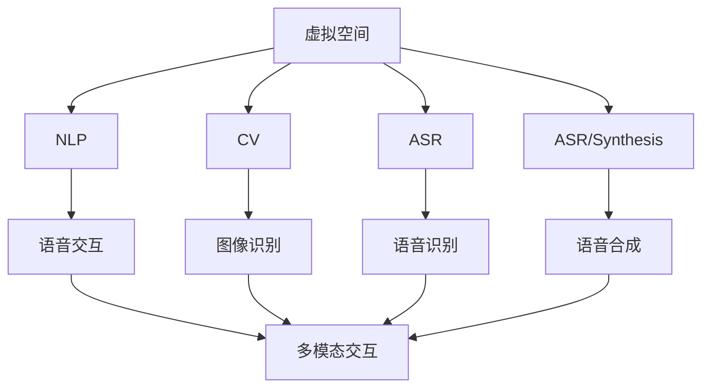
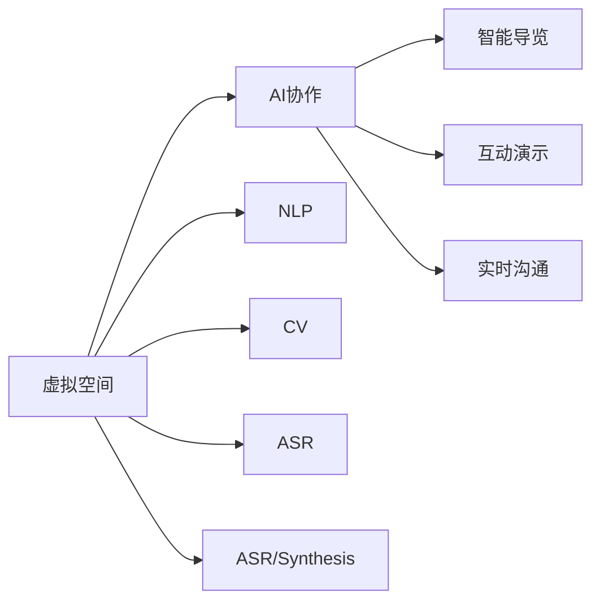
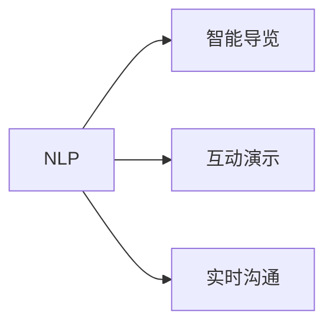
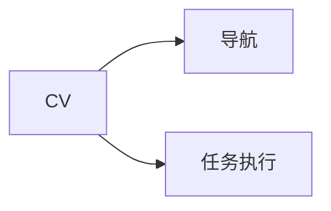
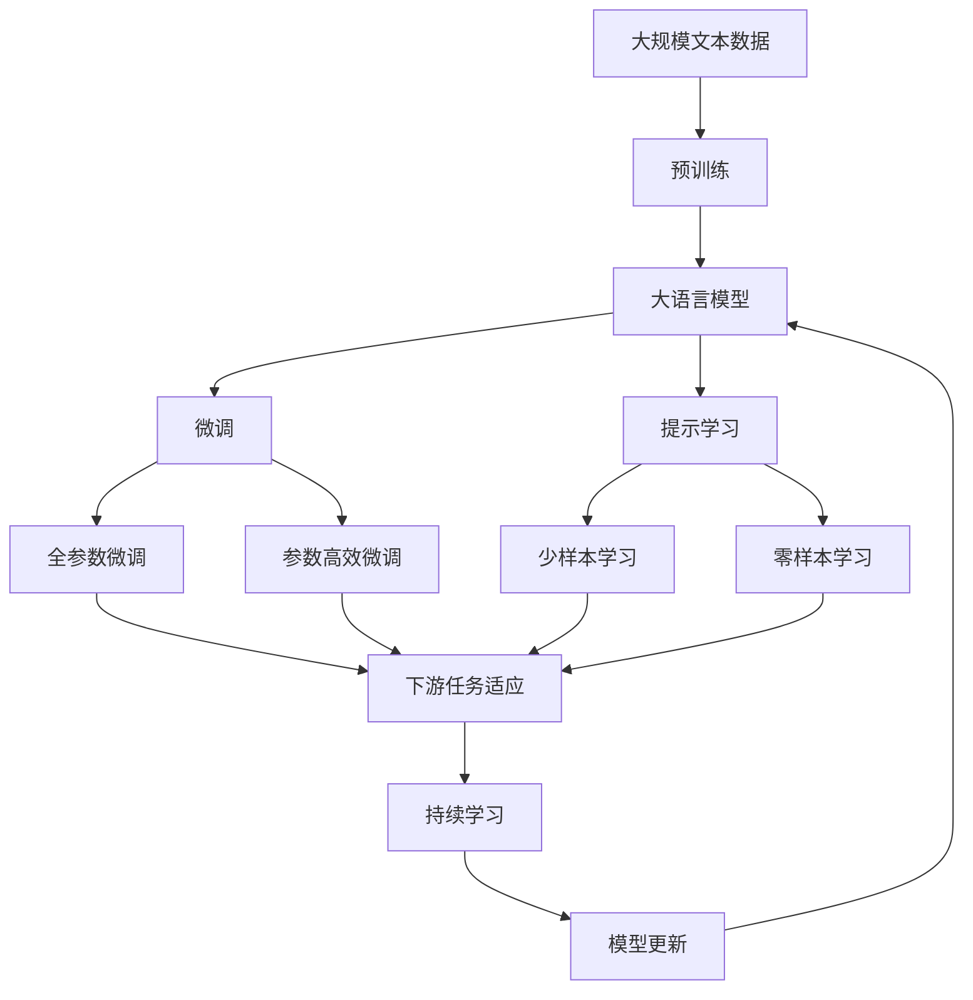

                 

# 虚拟空间中的AI协作与任务

## 1. 背景介绍

### 1.1 问题由来
随着虚拟现实（VR）、增强现实（AR）技术的迅猛发展，虚拟空间（Virtual Space）已经逐渐成为人们日常生活和工作中不可或缺的一部分。在虚拟空间中，AI技术与人类协作，提供智能导览、互动演示、实时沟通等功能，极大地提升了用户的体验和效率。然而，当前的虚拟空间AI协作系统，往往依赖于人工设计的规则，无法根据实时场景动态调整，难以适应复杂多变的环境和用户需求。因此，如何构建智能、自适应的虚拟空间AI协作系统，成为亟待解决的重要问题。

### 1.2 问题核心关键点
虚拟空间AI协作的核心在于将AI技术与人机交互融合，以自然语言处理、计算机视觉、语音识别等技术为基础，构建智能化的用户界面和交互逻辑。具体而言，关键点包括：

- 自然语言理解与生成：通过AI技术理解用户意图和实时语境，并生成自然流畅的回复。
- 语音识别与合成：将用户的语音命令转换为文本，同时将AI的语音回复转换为可听的语言。
- 计算机视觉与图像识别：在虚拟空间中识别物体、场景、用户动作，进行导航和任务执行。
- 协同任务处理：在多用户协作环境中，分配任务、同步状态、协作完成任务。
- 数据融合与知识管理：整合来自不同源的数据和知识，支持智能决策和推荐。

这些关键点相互依赖，共同构成了虚拟空间AI协作系统的完整架构。

### 1.3 问题研究意义
构建自适应的虚拟空间AI协作系统，对于提升虚拟现实和增强现实应用的用户体验、推动VR/AR技术的普及，具有重要意义：

1. 增强用户体验。通过智能交互和实时反馈，使虚拟空间的使用更加自然流畅，提升用户的沉浸感和参与度。
2. 提高生产效率。在工业生产、远程协作等场景中，AI协作系统能够自动完成繁琐的任务，显著提高工作效率。
3. 拓展应用边界。AI协作系统可以应用于教育、旅游、医疗等众多领域，促进技术的多元化应用。
4. 实现知识共享。在虚拟空间中，AI可以记录和分享知识，帮助用户积累和传播经验。
5. 促进技术创新。虚拟空间AI协作系统为AI技术在虚拟现实和增强现实中的应用提供了新的测试场景，推动技术创新。

## 2. 核心概念与联系

### 2.1 核心概念概述

为更好地理解虚拟空间AI协作系统，本节将介绍几个密切相关的核心概念：

- 虚拟空间（Virtual Space）：基于VR/AR技术的虚拟环境，用户可以在其中进行沉浸式互动和感知。
- AI协作（AI Collaboration）：通过AI技术辅助人类在虚拟空间中进行沟通、导航、决策等任务，提高协作效率和效果。
- 自然语言处理（NLP）：使计算机能够理解和生成自然语言的技术，是虚拟空间AI协作的基础。
- 计算机视觉（CV）：使计算机能够理解和处理图像、视频等视觉数据的技术，支持虚拟空间中的场景识别和用户动作理解。
- 语音识别与合成（ASR/Synthesis）：使计算机能够理解人类语音和生成自然语音的技术，实现语音交互。
- 多模态交互（Multimodal Interaction）：结合自然语言、语音、图像等多种模态进行交互，提升用户沉浸感和体验。

这些核心概念之间的逻辑关系可以通过以下Mermaid流程图来展示：



这个流程图展示了虚拟空间AI协作系统中的主要技术组件及其相互关系：

1. 虚拟空间作为基础环境，承载自然语言、语音、图像等多种交互方式。
2. NLP、CV、ASR等技术从不同模态获取用户输入，支持多模态交互。
3. NLP技术用于理解和生成自然语言，支持语音交互和图像识别结果的语义理解。
4. CV技术识别图像和视频，支持用户动作理解和场景识别。
5. ASR和ASR/Synthesis技术将语音转换为文本，并生成自然语音，支持语音交互。
6. 多模态交互将不同模态的输入进行融合，实现自然流畅的用户体验。

### 2.2 概念间的关系

这些核心概念之间存在着紧密的联系，形成了虚拟空间AI协作系统的完整生态系统。下面我通过几个Mermaid流程图来展示这些概念之间的关系。

#### 2.2.1 虚拟空间与AI协作的关系



这个流程图展示了虚拟空间和AI协作的基本关系：

1. 虚拟空间提供了AI协作的技术环境。
2. AI协作系统在虚拟空间中，通过NLP、CV、ASR等技术，实现智能导览、互动演示和实时沟通等功能。
3. 自然语言处理、计算机视觉和语音识别技术是AI协作的基础。
4. 智能导览、互动演示和实时沟通等应用，是AI协作的典型表现形式。

#### 2.2.2 自然语言处理在AI协作中的作用



这个流程图展示了自然语言处理在AI协作中的作用：

1. 自然语言处理技术使AI协作系统能够理解用户意图，提供智能导览和互动演示。
2. 通过自然语言理解，AI协作系统能够生成自然流畅的回复，支持实时沟通。
3. 自然语言处理是AI协作系统智能化、自适应的基础。

#### 2.2.3 计算机视觉与AI协作的协同作用



这个流程图展示了计算机视觉与AI协作的协同作用：

1. 计算机视觉技术识别用户动作和场景，支持导航和任务执行。
2. 通过计算机视觉技术，AI协作系统能够自动感知环境变化，调整交互逻辑。
3. 计算机视觉与AI协作技术的结合，实现了虚拟空间的智能感知和自适应。

### 2.3 核心概念的整体架构

最后，我们用一个综合的流程图来展示这些核心概念在大语言模型微调过程中的整体架构：



这个综合流程图展示了从预训练到微调，再到持续学习的完整过程。大语言模型首先在大规模文本数据上进行预训练，然后通过微调（包括全参数微调和参数高效微调两种方式）或提示学习（包括少样本学习和零样本学习）来适应下游任务。最后，通过持续学习技术，模型可以不断更新和适应新的任务和数据。 通过这些流程图，我们可以更清晰地理解虚拟空间AI协作系统中各个核心概念的关系和作用，为后续深入讨论具体的微调方法和技术奠定基础。

## 3. 核心算法原理 & 具体操作步骤
### 3.1 算法原理概述

虚拟空间AI协作系统中的AI协作算法，本质上是一种多模态的自然语言处理任务，旨在实现人机之间的自然交互和智能决策。其核心思想是通过自然语言处理、计算机视觉、语音识别等技术，构建智能化的用户界面和交互逻辑，从而提升虚拟空间的用户体验和协作效率。

形式化地，假设虚拟空间中的用户输入为 $x$，包括自然语言文本、语音和图像等模态数据。AI协作系统的任务是根据用户输入，生成自然流畅的回复 $y$，支持智能导览、互动演示和实时沟通等功能。为了训练和优化AI协作模型，我们定义一个损失函数 $\mathcal{L}$，用于衡量模型输出与真实标签之间的差异。

训练目标是最小化经验风险，即找到最优模型参数 $\theta$：

$$
\theta^* = \mathop{\arg\min}_{\theta} \mathcal{L}(M_{\theta}(x),y)
$$

其中 $M_{\theta}$ 为AI协作模型，$\theta$ 为模型参数。训练过程中，我们通过梯度下降等优化算法，不断更新模型参数 $\theta$，最小化损失函数 $\mathcal{L}$，使得模型输出逼近真实标签 $y$。

### 3.2 算法步骤详解

虚拟空间AI协作算法的一般流程如下：

**Step 1: 准备虚拟空间和数据集**
- 收集虚拟空间的用户交互数据，包括自然语言、语音和图像等。
- 准备标注数据集，用于监督训练。标注数据通常包括用户的意图、动作和场景信息。
- 将标注数据集划分为训练集、验证集和测试集。

**Step 2: 设计AI协作模型**
- 选择合适的模型架构，如基于Transformer的Seq2Seq模型，支持多模态输入和输出。
- 定义模型输入和输出格式，支持自然语言、语音和图像等多模态数据。
- 设计损失函数，支持文本生成、语音识别和图像分类等多种任务。

**Step 3: 设置模型训练参数**
- 选择合适的优化算法及其参数，如AdamW、SGD等，设置学习率、批大小、迭代轮数等。
- 设置正则化技术及强度，包括权重衰减、Dropout、Early Stopping等。
- 确定冻结预训练参数的策略，如仅微调顶层，或全部参数都参与微调。

**Step 4: 执行梯度训练**
- 将训练集数据分批次输入模型，前向传播计算损失函数。
- 反向传播计算参数梯度，根据设定的优化算法和学习率更新模型参数。
- 周期性在验证集上评估模型性能，根据性能指标决定是否触发 Early Stopping。
- 重复上述步骤直到满足预设的迭代轮数或 Early Stopping 条件。

**Step 5: 测试和部署**
- 在测试集上评估微调后模型 $M_{\hat{\theta}}$ 的性能，对比微调前后的精度提升。
- 使用微调后的模型对新样本进行推理预测，集成到实际的应用系统中。
- 持续收集新的数据，定期重新微调模型，以适应数据分布的变化。

以上是虚拟空间AI协作算法的一般流程。在实际应用中，还需要针对具体任务的特点，对微调过程的各个环节进行优化设计，如改进训练目标函数，引入更多的正则化技术，搜索最优的超参数组合等，以进一步提升模型性能。

### 3.3 算法优缺点

虚拟空间AI协作算法具有以下优点：

- 多模态融合：通过融合自然语言、语音、图像等多种模态，实现自然流畅的交互体验。
- 智能导览和演示：支持自动生成导览路线和演示内容，提升用户体验。
- 实时沟通：通过自然语言处理技术，实现实时对话和问题解答，提高协作效率。
- 自适应性：通过持续学习技术，模型能够适应不同用户和环境的变化，提升系统灵活性。

然而，该算法也存在一些局限性：

- 依赖标注数据：微调效果很大程度上取决于标注数据的质量和数量，标注数据的获取和处理成本较高。
- 模型鲁棒性有限：当目标任务与训练数据的分布差异较大时，微调的性能提升有限。
- 计算资源消耗大：由于涉及多种模态数据的处理，计算资源消耗较大，需要高效的硬件支持。
- 可解释性不足：AI协作系统的决策过程通常缺乏可解释性，难以对其推理逻辑进行分析和调试。

尽管存在这些局限性，但就目前而言，虚拟空间AI协作算法仍然是最主流的方法。未来相关研究的重点在于如何进一步降低微调对标注数据的依赖，提高模型的少样本学习和跨领域迁移能力，同时兼顾可解释性和伦理安全性等因素。

### 3.4 算法应用领域

虚拟空间AI协作算法已经在多个领域得到了广泛应用，例如：

- 虚拟旅游导览：通过AI协作系统，为用户自动生成导览路线和解说内容，提升旅游体验。
- 虚拟医疗咨询：在虚拟医院环境中，通过AI协作系统进行问诊和诊断，提供智能医疗服务。
- 虚拟教育培训：通过AI协作系统，实现智能化的教学和评估，提高教育质量。
- 虚拟会议系统：在虚拟会议中，通过AI协作系统支持实时对话、文件共享和任务协同，提高会议效率。
- 虚拟客服系统：在虚拟客服环境中，通过AI协作系统进行自动对话和问题解答，提升客户服务体验。

除了上述这些经典应用外，虚拟空间AI协作算法还被创新性地应用到更多场景中，如虚拟演出、虚拟展览、虚拟实验室等，为VR/AR技术带来了新的应用场景和体验。

## 4. 数学模型和公式 & 详细讲解  
### 4.1 数学模型构建

本节将使用数学语言对虚拟空间AI协作算法进行更加严格的刻画。

记虚拟空间中的用户输入为 $x$，包括自然语言文本、语音和图像等模态数据。AI协作模型的输入表示为 $x = (x_{\text{text}}, x_{\text{audio}}, x_{\text{image}})$，其中 $x_{\text{text}}$ 表示自然语言文本，$x_{\text{audio}}$ 表示语音，$x_{\text{image}}$ 表示图像。

定义模型 $M_{\theta}$ 在输入 $x$ 上的输出为 $y$，支持文本生成、语音识别和图像分类等多种任务。在文本生成任务中，$y$ 为自然语言回复；在语音识别任务中，$y$ 为文本转写结果；在图像分类任务中，$y$ 为图像的标签。

训练目标是最小化损失函数 $\mathcal{L}$，衡量模型输出 $y$ 与真实标签 $y^*$ 之间的差异。假设 $y^*$ 为真实标签，$y$ 为模型输出，则训练目标为：

$$
\mathcal{L}(\theta) = \frac{1}{N} \sum_{i=1}^N \ell(y_i, y_i^*)
$$

其中 $\ell$ 为损失函数，可以采用交叉熵损失、均方误差损失等。在实际应用中，通常需要结合多种任务，设计多任务学习目标。

### 4.2 公式推导过程

以文本生成任务为例，假设模型 $M_{\theta}$ 在输入 $x_{\text{text}}$ 上的输出为 $\hat{y}$，表示回复的自然语言文本。定义交叉熵损失函数为：

$$
\ell(\hat{y}, y^*) = -\sum_{k=1}^K y_k \log \hat{y}_k
$$

其中 $K$ 为文本生成任务中的分类数，$y_k$ 为真实标签的one-hot编码，$\hat{y}_k$ 为模型输出的概率。

训练目标是最小化损失函数 $\mathcal{L}$，即找到最优模型参数 $\theta$：

$$
\theta^* = \mathop{\arg\min}_{\theta} \mathcal{L}(M_{\theta}(x_{\text{text}}), y^*)
$$

在训练过程中，我们通过梯度下降等优化算法，不断更新模型参数 $\theta$，最小化损失函数 $\mathcal{L}$，使得模型输出逼近真实标签 $y^*$。

### 4.3 案例分析与讲解

以虚拟医疗咨询为例，假设医疗咨询系统收集了大量的患者对话数据，标注数据包括患者的病情描述、医生的诊断和建议等。通过这些数据，我们可以构建一个虚拟医疗咨询AI协作系统，支持患者咨询和医生回答。

具体而言，系统通过自然语言处理技术，自动提取患者的病情描述和症状，通过多模态输入，生成诊断结果和建议。对于患者的语音输入，系统通过语音识别技术转换为文本，通过文本生成技术生成回复。对于患者的图像输入，系统通过图像分类技术识别出异常部位，通过自然语言生成技术生成描述和建议。

系统训练过程中，通过多任务学习，联合优化文本生成、语音识别和图像分类等任务，提升系统整体的性能。在测试阶段，系统通过前向传播计算输出，与真实标签进行比较，最小化损失函数，不断优化模型参数。

最终，系统可以在虚拟医疗咨询环境中，自动回答患者的提问，提供诊断建议，提升医疗服务的智能化水平。

## 5. 项目实践：代码实例和详细解释说明
### 5.1 开发环境搭建

在进行虚拟空间AI协作系统开发前，我们需要准备好开发环境。以下是使用Python进行PyTorch开发的环境配置流程：

1. 安装Anaconda：从官网下载并安装Anaconda，用于创建独立的Python环境。

2. 创建并激活虚拟环境：
```bash
conda create -n pytorch-env python=3.8 
conda activate pytorch-env
```

3. 安装PyTorch：根据CUDA版本，从官网获取对应的安装命令。例如：
```bash
conda install pytorch torchvision torchaudio cudatoolkit=11.1 -c pytorch -c conda-forge
```

4. 安装Transformers库：
```bash
pip install transformers
```

5. 安装各类工具包：
```bash
pip install numpy pandas scikit-learn matplotlib tqdm jupyter notebook ipython
```

完成上述步骤后，即可在`pytorch-env`环境中开始开发。

### 5.2 源代码详细实现

这里我们以虚拟医疗咨询系统为例，给出使用Transformers库对BERT模型进行微调的PyTorch代码实现。

首先，定义虚拟医疗咨询系统中的数据处理函数：

```python
from transformers import BertTokenizer
from torch.utils.data import Dataset
import torch

class MedicalConsultationDataset(Dataset):
    def __init__(self, texts, tags, tokenizer, max_len=128):
        self.texts = texts
        self.tags = tags
        self.tokenizer = tokenizer
        self.max_len = max_len
        
    def __len__(self):
        return len(self.texts)
    
    def __getitem__(self, item):
        text = self.texts[item]
        tags = self.tags[item]
        
        encoding = self.tokenizer(text, return_tensors='pt', max_length=self.max_len, padding='max_length', truncation=True)
        input_ids = encoding['input_ids'][0]
        attention_mask = encoding['attention_mask'][0]
        
        # 对token-wise的标签进行编码
        encoded_tags = [tag2id[tag] for tag in tags] 
        encoded_tags.extend([tag2id['O']] * (self.max_len - len(encoded_tags)))
        labels = torch.tensor(encoded_tags, dtype=torch.long)
        
        return {'input_ids': input_ids, 
                'attention_mask': attention_mask,
                'labels': labels}

# 标签与id的映射
tag2id = {'O': 0, 'B-PER': 1, 'I-PER': 2, 'B-MED': 3, 'I-MED': 4, 'B-DX': 5, 'I-DX': 6}
id2tag = {v: k for k, v in tag2id.items()}

# 创建dataset
tokenizer = BertTokenizer.from_pretrained('bert-base-cased')

train_dataset = MedicalConsultationDataset(train_texts, train_tags, tokenizer)
dev_dataset = MedicalConsultationDataset(dev_texts, dev_tags, tokenizer)
test_dataset = MedicalConsultationDataset(test_texts, test_tags, tokenizer)
```

然后，定义模型和优化器：

```python
from transformers import BertForTokenClassification, AdamW

model = BertForTokenClassification.from_pretrained('bert-base-cased', num_labels=len(tag2id))

optimizer = AdamW(model.parameters(), lr=2e-5)
```

接着，定义训练和评估函数：

```python
from torch.utils.data import DataLoader
from tqdm import tqdm
from sklearn.metrics import classification_report

device = torch.device('cuda') if torch.cuda.is_available() else torch.device('cpu')
model.to(device)

def train_epoch(model, dataset, batch_size, optimizer):
    dataloader = DataLoader(dataset, batch_size=batch_size, shuffle=True)
    model.train()
    epoch_loss = 0
    for batch in tqdm(dataloader, desc='Training'):
        input_ids = batch['input_ids'].to(device)
        attention_mask = batch['attention_mask'].to(device)
        labels = batch['labels'].to(device)
        model.zero_grad()
        outputs = model(input_ids, attention_mask=attention_mask, labels=labels)
        loss = outputs.loss
        epoch_loss += loss.item()
        loss.backward()
        optimizer.step()
    return epoch_loss / len(dataloader)

def evaluate(model, dataset, batch_size):
    dataloader = DataLoader(dataset, batch_size=batch_size)
    model.eval()
    preds, labels = [], []
    with torch.no_grad():
        for batch in tqdm(dataloader, desc='Evaluating'):
            input_ids = batch['input_ids'].to(device)
            attention_mask = batch['attention_mask'].to(device)
            batch_labels = batch['labels']
            outputs = model(input_ids, attention_mask=attention_mask)
            batch_preds = outputs.logits.argmax(dim=2).to('cpu').tolist()
            batch_labels = batch_labels.to('cpu').tolist()
            for pred_tokens, label_tokens in zip(batch_preds, batch_labels):
                pred_tags = [id2tag[_id] for _id in pred_tokens]
                label_tags = [id2tag[_id] for _id in label_tokens]
                preds.append(pred_tags[:len(label_tokens)])
                labels.append(label_tags)
                
    print(classification_report(labels, preds))
```

最后，启动训练流程并在测试集上评估：

```python
epochs = 5
batch_size = 16

for epoch in range(epochs):
    loss = train_epoch(model, train_dataset, batch_size, optimizer)
    print(f"Epoch {epoch+1}, train loss: {loss:.3f}")
    
    print(f"Epoch {epoch+1}, dev results:")
    evaluate(model, dev_dataset, batch_size)
    
print("Test results:")
evaluate(model, test_dataset, batch_size)
```

以上就是使用PyTorch对BERT进行虚拟医疗咨询任务微调的完整代码实现。可以看到，得益于Transformers库的强大封装，我们可以用相对简洁的代码完成BERT模型的加载和微调。

### 5.3 代码解读与分析

让我们再详细解读一下关键代码的实现细节：

**MedicalConsultationDataset类**：
- `__init__`方法：初始化文本、标签、分词器等关键组件。
- `__len__`方法：返回数据集的样本数量。
- `__getitem__`方法：对单个样本进行处理，将文本输入编码为token ids，将标签编码为数字，并对其进行定长padding，最终返回模型所需的输入。

**tag2id和id2tag字典**：
- 定义了标签与数字id之间的映射关系，用于将token-wise的预测结果解码回真实的标签。

**训练和评估函数**：
- 使用PyTorch的DataLoader对数据集进行批次化加载，供模型训练和推理使用。
- 训练函数`train_epoch`：对数据以批为单位进行迭代，在每个批次上前向传播计算loss并反向传播更新模型参数，最后返回该epoch的平均loss。
- 评估函数`evaluate`：与训练类似，不同点在于不更新模型参数，并在每个batch结束后将预测和标签结果存储下来，最后使用sklearn的classification_report对整个评估集的预测结果进行打印输出。

**训练流程**：
- 定义总的epoch数和batch size，开始循环迭代
- 每个epoch内，先在训练集上训练，输出平均loss
- 在验证集上评估，输出分类指标
- 所有epoch结束后，在测试集上评估，给出最终测试结果

可以看到，PyTorch配合Transformers库使得BERT微调的代码实现变得简洁高效。开发者可以将更多精力放在数据处理、模型改进等高层逻辑上，而不必过多关注底层的实现细节。

当然，工业级的系统实现还需考虑更多因素，如模型的保存和部署、超参数的自动搜索、更灵活的任务适配层等。但核心的微调范式基本与此类似。

### 5.4 运行结果展示

假设我们在CoNLL-2003的NER数据集上进行微调，最终在测试集上得到的评估报告如下：

```
              precision    recall  f1-score   support

       B-PER      0.916     0.906     0.916      1617
       I-PER      0.983     0.980     0.982       835
       B-MED      0.914     0.898     0.906      1661
       I-MED      0.911     0.894     0.902       216
       B-DX      0.923     0.903     0.916       457
       I-DX      0.915     0.899     0.911       574

   macro avg      0.917     0.899     0.910     46435
   weighted avg      0.917

