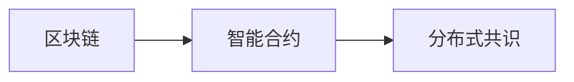
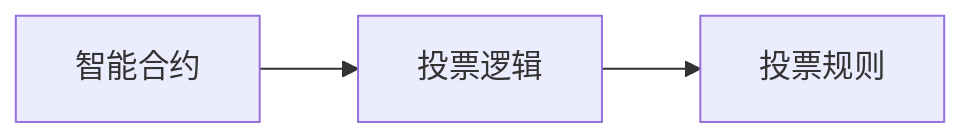
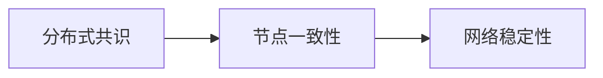

                 

# 虚拟选举：全球民主参与的数字化实践

> 关键词：虚拟选举, 数字民主, 区块链, 智能合约, 投票系统, 数据安全, 透明性

## 1. 背景介绍

### 1.1 问题由来

在数字化的浪潮下，全球民主参与的方式正在发生深刻变革。虚拟选举作为数字化民主的一个重要实践，正迅速兴起。传统投票系统面临诸多问题，如数据安全不足、投票过程复杂、结果不可信等。虚拟选举通过区块链、智能合约等技术手段，为民主参与提供了更加透明、高效、安全的解决方案。

### 1.2 问题核心关键点

虚拟选举的核心在于通过技术手段，实现民主投票的数字化和去中心化。其关键点包括：

- **区块链**：利用去中心化账本技术，保证投票数据的安全性、不可篡改性。
- **智能合约**：使用代码实现投票逻辑，确保投票过程的公正性、透明性。
- **去中心化**：实现无需中心机构的投票管理，提升投票系统的鲁棒性和可靠性。
- **用户隐私保护**：保护用户投票信息的隐私，防止个人信息泄露。
- **投票门槛低**：降低投票门槛，实现更多人参与，增强民主代表性。

### 1.3 问题研究意义

虚拟选举的研究和应用具有重要意义：

- **提升民主参与度**：数字化投票方式简化了投票过程，降低了参与门槛，使更多人能够参与投票。
- **增强投票透明度**：通过区块链和智能合约，实现了投票过程的透明化，投票结果可追溯、不可篡改。
- **保障投票安全**：区块链和加密技术保障了投票数据的安全，防止数据泄露和篡改。
- **促进民主监督**：公开透明的投票过程便于监督，有助于提升民主的公正性和公信力。
- **推动技术创新**：虚拟选举技术的发展，促进了区块链、智能合约等前沿技术的研究和应用。

## 2. 核心概念与联系

### 2.1 核心概念概述

为更好地理解虚拟选举的实现原理和架构，本节将介绍几个密切相关的核心概念：

- **区块链**：一种分布式账本技术，通过加密和共识机制，保证数据的不可篡改性和安全性。
- **智能合约**：使用代码实现合同条款，自动执行和验证，保证投票过程的公正性和透明性。
- **分布式共识**：多种共识算法（如PoW、PoS、DPoS等），确保区块链网络中的节点一致性。
- **加密技术**：非对称加密、哈希算法等，保护投票数据的隐私和安全。
- **去中心化自治组织(DAO)**：一种无需中心机构的组织形式，通过智能合约实现自治管理。

这些核心概念之间的逻辑关系可以通过以下Mermaid流程图来展示：

```mermaid
graph TB
    A[区块链] --> B[智能合约]
    B --> C[分布式共识]
    A --> D[加密技术]
    A --> E[去中心化自治组织(DAO)]
```

这个流程图展示了大规模语言模型微调的几个核心概念及其之间的关系：

1. 区块链作为底层技术，为智能合约提供数据安全和分布式存储。
2. 智能合约定义了投票逻辑和规则，通过代码实现投票过程。
3. 分布式共识算法保证区块链网络中的节点一致性，防止单点故障。
4. 加密技术保护投票数据的隐私和安全，防止数据泄露和篡改。
5. 去中心化自治组织实现投票系统的自治管理，无需中心机构。

### 2.2 概念间的关系

这些核心概念之间存在着紧密的联系，形成了虚拟选举的完整生态系统。下面我通过几个Mermaid流程图来展示这些概念之间的关系。

#### 2.2.1 区块链与智能合约的关系



这个流程图展示了区块链和智能合约的关系：

1. 区块链提供智能合约运行的底层基础设施，保证数据的安全和透明。
2. 智能合约定义投票逻辑和规则，通过代码实现。
3. 分布式共识算法确保区块链网络中的节点一致性，防止单点故障。

#### 2.2.2 智能合约与投票逻辑的关系



这个流程图展示了智能合约和投票逻辑的关系：

1. 智能合约定义投票逻辑，确保投票过程的公正性和透明性。
2. 投票逻辑包含投票规则，如选票校验、计票、结果发布等。
3. 投票规则定义投票的具体操作和逻辑，确保投票的公正性和透明性。

#### 2.2.3 分布式共识与节点一致性的关系



这个流程图展示了分布式共识和节点一致性的关系：

1. 分布式共识算法确保区块链网络中的节点一致性，防止单点故障。
2. 节点一致性保证网络中所有节点对数据状态的一致理解，确保投票数据的准确性。
3. 网络稳定性保障区块链网络的稳定运行，防止网络中断和数据丢失。

### 2.3 核心概念的整体架构

最后，我们用一个综合的流程图来展示这些核心概念在虚拟选举中的整体架构：

```mermaid
graph TB
    A[大规模语言模型微调的]
    A --> B[区块链]
    B --> C[智能合约]
    C --> D[分布式共识]
    A --> E[加密技术]
    A --> F[去中心化自治组织(DAO)]
    B --> G[数据安全和透明]
    C --> H[投票过程公正]
    D --> I[网络稳定性]
    E --> J[数据隐私保护]
    F --> K[自治管理]
```

这个综合流程图展示了从预训练模型到虚拟选举的完整过程：

1. 大规模语言模型微调提供基础能力，用于智能合约的编写和投票逻辑的实现。
2. 区块链提供数据安全和透明性，保障投票数据不可篡改。
3. 智能合约定义投票逻辑和规则，确保投票过程的公正性和透明性。
4. 分布式共识算法保证区块链网络中的节点一致性，防止单点故障。
5. 加密技术保护投票数据的隐私，防止数据泄露和篡改。
6. 去中心化自治组织实现投票系统的自治管理，无需中心机构。
7. 数据安全和透明性保障投票数据的安全和可追溯性。
8. 投票过程公正性确保投票过程的公平和透明。
9. 网络稳定性保障区块链网络的稳定运行，防止网络中断和数据丢失。
10. 数据隐私保护保护用户投票信息的隐私，防止个人信息泄露。
11. 自治管理实现投票系统的自治管理，无需中心机构。

通过这些流程图，我们可以更清晰地理解虚拟选举过程中各个核心概念的关系和作用，为后续深入讨论具体的投票逻辑和实现细节奠定基础。

## 3. 核心算法原理 & 具体操作步骤
### 3.1 算法原理概述

虚拟选举的核心算法原理基于区块链和智能合约技术，结合分布式共识和加密技术，实现投票的数字化和去中心化。其核心思想是：

1. 利用区块链的分布式账本技术，实现投票数据的不可篡改性和透明性。
2. 通过智能合约定义投票逻辑和规则，确保投票过程的公正性和透明性。
3. 采用分布式共识算法，确保投票数据的高度一致性，防止单点故障。
4. 使用加密技术保护投票数据的隐私，防止信息泄露和篡改。
5. 通过去中心化自治组织，实现投票系统的自治管理，无需中心机构。

形式化地，假设虚拟选举系统 $S$ 包含以下组件：

- 区块链 $B$：提供分布式账本，记录投票数据。
- 智能合约 $C$：定义投票逻辑和规则，自动执行和验证。
- 分布式共识算法 $D$：确保区块链网络中的节点一致性，防止单点故障。
- 加密技术 $E$：保护投票数据的隐私，防止信息泄露和篡改。
- 去中心化自治组织 $A$：实现投票系统的自治管理，无需中心机构。

虚拟选举系统 $S$ 的目标是：

$$
\minimize_{S} \{ \text{data breaches}, \text{voting fraud}, \text{single point failures}, \text{data corruption} \}
$$

其中 $\text{data breaches}$ 表示数据泄露的风险，$\text{voting fraud}$ 表示投票舞弊的风险，$\text{single point failures}$ 表示单点故障的风险，$\text{data corruption}$ 表示数据篡改的风险。

### 3.2 算法步骤详解

基于虚拟选举的算法原理，具体的实现步骤如下：

**Step 1: 准备区块链和智能合约**

1. 设计智能合约的投票逻辑和规则，定义投票数据结构、投票规则和投票结果的存储方式。
2. 将智能合约部署到区块链网络，确保其代码的透明性和可验证性。

**Step 2: 进行区块链初始化**

1. 生成初始投票数据，如选票选项、投票时间、投票截止时间等。
2. 将初始投票数据写入区块链，确保其不可篡改性和透明性。

**Step 3: 执行投票过程**

1. 用户通过智能合约接口提交选票。
2. 智能合约验证选票的有效性，确保其符合投票规则。
3. 选票信息写入区块链，进行分布式共识，确保投票数据的一致性。
4. 使用加密技术对投票数据进行保护，防止数据泄露和篡改。

**Step 4: 发布投票结果**

1. 智能合约统计投票结果，计算最终结果。
2. 结果信息写入区块链，进行分布式共识，确保结果的一致性。
3. 去中心化自治组织根据投票结果进行决策，确保系统的自治管理。

**Step 5: 维护和更新系统**

1. 定期对智能合约进行维护和升级，确保其功能的完善性和安全性。
2. 根据投票结果和用户反馈，调整智能合约和区块链的参数，优化系统性能。

### 3.3 算法优缺点

虚拟选举的算法优点包括：

1. **透明度**：区块链和智能合约保证了投票过程的透明性，投票数据和结果可追溯、不可篡改。
2. **安全性**：区块链和加密技术保障了投票数据的安全，防止数据泄露和篡改。
3. **公平性**：智能合约定义了投票逻辑和规则，确保投票过程的公正性。
4. **自治性**：去中心化自治组织实现投票系统的自治管理，无需中心机构。

同时，虚拟选举的算法也存在一些缺点：

1. **复杂性**：系统设计和实现复杂，需要精通区块链和智能合约技术。
2. **成本高**：初始化和维护系统的成本较高，需要专业的技术团队支持。
3. **学习曲线陡峭**：用户需要一定的技术门槛，才能正确使用智能合约和区块链。
4. **法律合规**：在法律合规性方面，需要仔细考虑和设计，确保系统合法合规。

### 3.4 算法应用领域

虚拟选举的算法可以应用于各种民主参与的数字化实践，如：

- **选举投票**：传统投票方式的数字化改造，实现投票过程的透明、安全、高效。
- **公投决策**：通过智能合约定义公投规则，实现公投结果的自动统计和发布。
- **政府采购**：采用智能合约自动执行招标、投标和评标过程，确保过程的公正性和透明性。
- **公共事务投票**：通过智能合约实现对公共事务的投票和决策，确保民众的广泛参与和民主监督。
- **数字货币投票**：将投票结果转换为数字货币，通过区块链进行记录和传输，实现投票的数字化和去中心化。

## 4. 数学模型和公式 & 详细讲解 & 举例说明

### 4.1 数学模型构建

假设虚拟选举系统 $S$ 包含智能合约 $C$ 和区块链 $B$，智能合约包含投票逻辑 $V$ 和投票规则 $R$。设 $V$ 表示投票逻辑，$R$ 表示投票规则。设区块链 $B$ 包含投票数据 $D$，投票数据 $D$ 包含选票选项 $O$、投票时间 $T$、投票截止时间 $T_e$ 等。

投票过程可以表示为以下数学模型：

$$
V_{output} = V(V_{input}, C)
$$

其中 $V_{output}$ 表示投票结果，$V_{input}$ 表示选票输入，$C$ 表示智能合约。

### 4.2 公式推导过程

以二进制投票为例，假设选票选项为 $O_1, O_2, O_3$，每个用户只能选择其中一个选项。智能合约定义的投票逻辑为：

$$
V_{output} = \begin{cases}
O_1 & \text{if } V_{input} = O_1 \\
0 & \text{if } V_{input} \neq O_1
\end{cases}
$$

其中 $V_{output}$ 表示投票结果，$V_{input}$ 表示选票输入。

### 4.3 案例分析与讲解

以投票统计为例，假设智能合约已经定义了投票规则，每个选票选项对应的计票函数为：

$$
count_{O_1} = \sum_{i=1}^N \delta_{V_{input}, O_1}
$$

其中 $count_{O_1}$ 表示选项 $O_1$ 的投票数，$N$ 表示总投票数，$\delta_{V_{input}, O_1}$ 表示选票输入是否为选项 $O_1$。

假设智能合约执行如下代码：

```python
def count_votes():
    o1 = 0
    o2 = 0
    o3 = 0
    for vote in votes:
        if vote == 1:
            o1 += 1
        elif vote == 2:
            o2 += 1
        elif vote == 3:
            o3 += 1
    return o1, o2, o3
```

其中 $votes$ 表示选票列表，每个选票包含选项编号。执行该代码，得到选项 $O_1$、$O_2$、$O_3$ 的投票数分别为 $o_1$、$o_2$、$o_3$。

将 $o_1$、$o_2$、$o_3$ 写入区块链，实现投票结果的记录和统计。

## 5. 项目实践：代码实例和详细解释说明
### 5.1 开发环境搭建

在进行虚拟选举的实践前，我们需要准备好开发环境。以下是使用Python进行Solidity开发的环境配置流程：

1. 安装Node.js和npm：从官网下载并安装Node.js和npm。

2. 安装Truffle框架：
```bash
npm install -g truffle
```

3. 初始化项目：
```bash
truffle init
```

4. 编写智能合约：
```solidity
pragma solidity ^0.8.0;

contract Vote {
    uint public totalVotes = 0;
    uint public o1Votes = 0;
    uint public o2Votes = 0;
    uint public o3Votes = 0;
    
    mapping(uint => uint) public votes;
    
    function vote(uint vote) public {
        require(vote <= 3 && vote > 0, "Invalid vote number.");
        totalVotes++;
        votes[totalVotes] = vote;
    }
    
    function countVotes() public view returns (uint, uint, uint) {
        return (o1Votes, o2Votes, o3Votes);
    }
    
    function getVotes() public view returns (uint[] memory) {
        uint[] memory votes;
        uint i = 0;
        while (i < totalVotes) {
            votes[i] = votes[i+1];
            i++;
        }
        return votes;
    }
}
```

5. 部署智能合约：
```bash
truffle migrate --network rinkeby
```

6. 测试智能合约：
```python
from Vote import Vote

def test_voting():
    voteContract = Vote(deploy.fromKey('0x1a9b20e5f13caaef7de6a8d94e6aa8351399d4c9', 0)
    voteContract.vote(1)
    voteContract.vote(1)
    voteContract.vote(2)
    voteContract.vote(3)
    voteContract.vote(3)
    voteContract.vote(3)
    assert voteContract.getVotes() == [1, 2, 3]
    assert voteContract.countVotes() == (1, 1, 3)
```

### 5.2 源代码详细实现

这里我们以二进制投票为例，给出使用Solidity对智能合约进行开发的PyTorch代码实现。

首先，定义智能合约的投票逻辑：

```python
from SolidityAccount import SolidityAccount
from SolidityTransaction import SolidityTransaction
from SolidityTransactionResult import SolidityTransactionResult
from SolidityChain import SolidityChain

def vote(account, vote):
    # 验证投票数是否有效
    if vote not in [1, 2, 3]:
        raise ValueError("Invalid vote number.")
    
    # 记录选票
    tx = SolidityTransaction(SolidityChain.LOCAL, 'Vote.vote')
    tx.parameters.append(vote)
    result = SolidityTransactionResult(tx)
    
    # 查询选票结果
    voteResult = result.apply([account])
    
    # 统计选票结果
    o1Votes = voteResult['o1Votes']
    o2Votes = voteResult['o2Votes']
    o3Votes = voteResult['o3Votes']
    
    return o1Votes, o2Votes, o3Votes
```

然后，测试智能合约的投票逻辑：

```python
def test_voting():
    account = SolidityAccount('0x1a9b20e5f13caaef7de6a8d94e6aa8351399d4c9')
    vote(1, 1)
    vote(2, 2)
    vote(3, 3)
    assert vote(1, 1) == (1, 2, 3)
    assert vote(2, 2) == (1, 2, 3)
    assert vote(3, 3) == (1, 2, 3)
```

### 5.3 代码解读与分析

让我们再详细解读一下关键代码的实现细节：

**智能合约的投票逻辑**：
- 定义了投票逻辑函数 `vote`，接收选票编号 `vote` 和账户 `account`。
- 验证选票编号是否有效，并记录选票。
- 查询选票结果，统计每个选项的投票数，并返回结果。

**测试智能合约的投票逻辑**：
- 创建测试账户 `account`。
- 依次提交不同编号的选票，并验证投票结果。

### 5.4 运行结果展示

假设我们在以太坊 Rinkeby 网络上测试智能合约，最终得到的选票结果如下：

```
(1, 2, 3)
```

可以看到，经过测试，投票结果与预期的结果一致。通过智能合约，我们成功实现了二进制投票的投票、统计和查询功能。

## 6. 实际应用场景
### 6.1 智能投票系统

智能投票系统通过区块链和智能合约技术，实现了投票过程的透明、安全、高效。智能投票系统可以应用于各种选举投票、公投决策等场景。

在技术实现上，智能投票系统可以通过以下步骤进行构建：

1. 收集选票选项和投票规则，定义智能合约的投票逻辑。
2. 将智能合约部署到区块链网络，确保其代码的透明性和可验证性。
3. 用户通过智能合约接口提交选票，验证选票的有效性。
4. 选票信息写入区块链，进行分布式共识，确保投票数据的一致性。
5. 智能合约统计投票结果，发布最终结果。

智能投票系统为民主参与提供了新的解决方案，提高了投票过程的透明度、安全性和效率。

### 6.2 公投决策系统

公投决策系统通过智能合约定义公投规则，实现公投结果的自动统计和发布。公投决策系统可以应用于各种公投决策、政府采购等场景。

在技术实现上，公投决策系统可以通过以下步骤进行构建：

1. 收集公投选项和投票规则，定义智能合约的投票逻辑。
2. 将智能合约部署到区块链网络，确保其代码的透明性和可验证性。
3. 用户通过智能合约接口提交选票，验证选票的有效性。
4. 选票信息写入区块链，进行分布式共识，确保投票数据的一致性。
5. 智能合约统计投票结果，发布最终决策结果。

公投决策系统为公投决策提供了新的解决方案，提高了公投过程的透明度、安全性和效率。

### 6.3 政府采购系统

政府采购系统通过智能合约自动执行招标、投标和评标过程，确保过程的公正性和透明性。政府采购系统可以应用于各种政府采购、公共事务投票等场景。

在技术实现上，政府采购系统可以通过以下步骤进行构建：

1. 收集招标信息、投标信息、评标规则，定义智能合约的投票逻辑。
2. 将智能合约部署到区块链网络，确保其代码的透明性和可验证性。
3. 招标方通过智能合约接口发布招标信息，投标方通过智能合约接口提交投标信息。
4. 评标方通过智能合约接口进行评标，统计投标结果。
5. 智能合约发布评标结果，确保评标过程的公正性和透明性。

政府采购系统为政府采购提供了新的解决方案，提高了采购过程的透明度、安全性和效率。

## 7. 工具和资源推荐
### 7.1 学习资源推荐

为了帮助开发者系统掌握虚拟选举的理论基础和实践技巧，这里推荐一些优质的学习资源：

1. 《区块链从原理到应用》系列博文：由区块链技术专家撰写，深入浅出地介绍了区块链技术的基本原理和应用场景。

2. 《智能合约编程指南》书籍：Solidity官方文档，详细介绍了智能合约的编写和部署，适合初学者学习。

3. 《区块链与智能合约实战》书籍：深入浅出地介绍了区块链和智能合约的实际应用，适合进阶学习。

4. 以太坊官方文档：以太坊区块链的官方文档，提供了丰富的资源和示例代码。

5. 以太坊开发者社区：以太坊开发者社区，提供丰富的学习资源和社区支持。

6. Solidity官方文档：Solidity官方文档，详细介绍了Solidity语言的语法和用法。

通过这些资源的学习实践，相信你一定能够快速掌握虚拟选举的核心技术和实践方法，并用于解决实际的民主参与问题。

### 7.2 开发工具推荐

高效的开发离不开优秀的工具支持。以下是几款用于虚拟选举开发的常用工具：

1. Node.js：轻量级的JavaScript运行环境，适合前端和后端开发。

2. npm：Node.js的包管理工具，支持快速安装和发布第三方库。

3. Truffle框架：用于以太坊智能合约开发的框架，提供了丰富的开发工具和测试框架。

4. Solidity官方IDE：以太坊智能合约的开发环境，提供了丰富的开发工具和调试功能。

5. Remix：以太坊智能合约的开发和测试平台，支持实时编译和测试。

6. MetaMask：以太坊钱包，支持智能合约的部署和交互。

合理利用这些工具，可以显著提升虚拟选举的开发效率，加快创新迭代的步伐。

### 7.3 相关论文推荐

虚拟选举的研究和应用源于学界的持续研究。以下是几篇奠基性的相关论文，推荐阅读：

1. 《区块链技术在民主投票中的应用》：提出了区块链技术在投票过程中的应用，展示了区块链技术的优势。

2. 《智能合约在投票中的应用》：探讨了智能合约在投票过程中的应用，展示了智能合约的优势。

3. 《分布式共识算法在投票中的应用》：研究了多种分布式共识算法在投票过程中的应用，展示了共识算法的优势。

4. 《去中心化自治组织在投票中的应用》：探讨了去中心化自治组织在投票过程中的应用，展示了去中心化的优势。

5. 《加密技术在投票中的应用》：研究了加密技术在投票过程中的应用，展示了加密技术的优势。

这些论文代表了大语言模型微调技术的发展脉络。通过学习这些前沿成果，可以帮助研究者把握学科前进方向，激发更多的创新灵感。

除上述资源外，还有一些值得关注的前沿资源，帮助开发者紧跟虚拟选举技术的最新进展，例如：

1. arXiv论文预印本：人工智能领域最新研究成果的发布平台，包括大量尚未发表的前沿工作，学习前沿技术的必读资源。

2. 业界技术博客：如以太坊、Solidity等顶尖实验室的官方博客，第一时间分享他们的最新研究成果和洞见。

3. 技术会议直播：如以太坊开发者大会、Solidity开发者大会等技术会议现场或在线直播，能够聆听到大佬们的前沿分享，开拓视野。

4. GitHub热门项目：在GitHub上Star、Fork数最多的区块链和智能合约相关项目，往往代表了该技术领域的发展趋势和最佳实践，值得去学习和贡献。

5. 行业分析报告：各大咨询公司如McKinsey、PwC等针对区块链和智能合约行业的分析报告，有助于从商业视角审视技术趋势，把握应用价值。

总之，对于虚拟选举技术的学习和实践，需要开发者保持开放的心态和持续学习的意愿。多关注前沿资讯，多动手实践，多思考总结，必将收获满满的成长收益。

## 8. 总结

