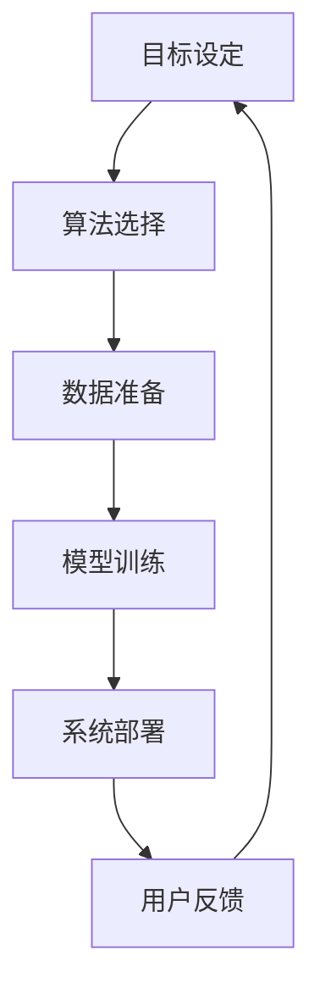

                 

# 行动 (Action)

## 1. 背景介绍

### 1.1 问题由来
在人工智能领域，我们常常听到“行动 (Action)”一词。它不仅仅是一个抽象概念，更是一种落地应用的动力来源。行动代表了从理论到实践的桥梁，是将算法模型转化为现实生产力、实现其价值的重要手段。无论是学术界的研究论文，还是产业界的成功案例，无不以实际行动为支撑，推动技术不断向前发展。

行动不仅关乎技术的实现，更关乎目标的达成。它涉及从算法设计到工程实践的每一个环节，从数据准备到模型优化，从系统部署到用户体验的提升。行动的每一步都蕴含着对细节的打磨和对目标的坚持。

### 1.2 问题核心关键点
行动的核心在于如何将理论知识转化为可操作的技术方案，并通过实践验证其效果。这涉及到以下几个关键点：

- **目标明确**：清晰定义项目的目标和预期成果，确保行动的方向性。
- **方法可行**：选择适合目标的技术方法，并进行科学合理的实验验证。
- **过程监控**：实时跟踪项目进度，及时调整方案以应对变化。
- **效果评估**：基于业务目标和用户反馈，评估行动的实际效果。

这些关键点构成了行动的全流程，保证了其高效、精准地达成预期目标。

### 1.3 问题研究意义
行动的意义在于它将人工智能的最新研究成果和创新技术转化为实际的商业价值，推动行业发展和社会进步。具体而言：

1. **提升效率**：通过自动化、智能化手段，提升各行各业的运营效率，减少人力和时间成本。
2. **优化决策**：利用数据分析和机器学习，提供更科学、更准确的决策支持。
3. **增强体验**：通过个性化的推荐和互动，提升用户的使用体验。
4. **拓展应用**：将AI技术应用于新场景，开拓新的市场和应用领域。

行动不仅是技术的实现，更是行业创新的源泉，对推动社会进步具有重要意义。

## 2. 核心概念与联系

### 2.1 核心概念概述

在行动的框架下，涉及到多个核心概念，这些概念相互联系，共同构成了行动的完整生态系统。

- **目标设定**：明确项目的目标和期望成果，是行动的起点。
- **算法选择**：根据目标选择合适的算法和技术方案，是行动的核心。
- **数据准备**：准备高质量的数据集，是算法效果的基础。
- **模型训练**：通过数据训练模型，生成预测模型，是算法的关键。
- **系统部署**：将模型部署到生产环境中，是行动的执行。
- **用户反馈**：收集用户反馈，评估行动的效果，是行动的闭环。

这些概念之间的逻辑关系可以通过以下Mermaid流程图来展示：



这个流程图展示了行动的全流程，从目标设定到用户反馈，每个环节都相互影响，共同推动行动的顺利进行。

### 2.2 概念间的关系

这些核心概念之间的关系紧密，形成一个循环反馈的系统。以下是几个关键概念的进一步解释：

- **目标设定与算法选择**：目标设定决定了算法的选择方向，而算法的选择又直接影响到目标的实现。
- **数据准备与模型训练**：高质量的数据是模型训练的前提，而训练后的模型又决定了数据的应用效果。
- **系统部署与用户反馈**：系统的部署使算法投入实际使用，用户反馈则评估模型的实际效果，提供优化依据。

这些概念之间的紧密联系，确保了行动的高效和精准。通过不断循环迭代，行动能不断优化，最终实现预期的目标。

## 3. 核心算法原理 & 具体操作步骤

### 3.1 算法原理概述

行动的核心在于将理论算法转化为可操作的模型，通过不断实验和优化，达到预期效果。这里，我们将重点介绍基于深度学习的算法原理及其具体操作步骤。

深度学习算法的基本思想是通过构建多层神经网络，对输入数据进行特征提取和抽象，从而生成预测结果。其核心在于模型的训练过程，即通过反向传播算法更新模型参数，使其能够最小化预测误差。

### 3.2 算法步骤详解

深度学习模型的训练步骤包括数据预处理、模型构建、训练和评估等环节。下面将详细介绍每个步骤的具体操作。

**Step 1: 数据预处理**

- **数据清洗**：去除数据中的噪声和不完整信息，确保数据质量。
- **数据分割**：将数据集划分为训练集、验证集和测试集，便于模型训练和评估。
- **特征提取**：将原始数据转换为模型能够处理的特征向量，如通过CNN提取图像特征，通过RNN处理序列数据等。

**Step 2: 模型构建**

- **选择模型架构**：根据任务类型选择合适的神经网络架构，如卷积神经网络(CNN)、循环神经网络(RNN)、Transformer等。
- **定义损失函数**：根据任务目标定义合适的损失函数，如交叉熵损失、均方误差损失等。
- **优化器选择**：选择合适的优化器及其参数，如Adam、SGD等。

**Step 3: 模型训练**

- **前向传播**：将训练数据输入模型，计算预测结果。
- **计算损失**：根据真实标签和预测结果计算损失值。
- **反向传播**：根据损失值反向传播更新模型参数。
- **迭代优化**：重复上述过程，直到模型收敛或达到预设的迭代次数。

**Step 4: 模型评估**

- **验证集评估**：使用验证集对模型进行评估，调整超参数和模型结构。
- **测试集评估**：使用测试集对模型进行最终评估，确定模型性能。

### 3.3 算法优缺点

基于深度学习的行动算法具有以下优点：

- **精度高**：深度学习算法在处理复杂问题时，能够达到较高的预测精度。
- **泛化能力强**：经过充分训练的模型，能够很好地适应新数据和新场景。
- **自适应性强**：通过不断迭代训练，模型能够自动调整参数，优化预测结果。

同时，深度学习算法也存在一些缺点：

- **计算资源消耗大**：深度学习模型需要大量的计算资源和存储空间，训练过程耗时较长。
- **模型复杂度高**：深度模型结构复杂，难以理解和解释。
- **过拟合风险高**：在训练数据不足的情况下，模型容易过拟合。

### 3.4 算法应用领域

深度学习算法已经广泛应用于各个领域，包括计算机视觉、自然语言处理、语音识别等。以下是几个典型的应用场景：

- **图像分类**：通过卷积神经网络(CNN)对图像进行分类，如识别手写数字、物体识别等。
- **文本生成**：通过循环神经网络(RNN)或Transformer生成文本，如自动摘要、机器翻译等。
- **语音识别**：通过卷积神经网络(CNN)或循环神经网络(RNN)进行语音识别，如语音转文字、语音情感分析等。
- **推荐系统**：通过协同过滤和深度学习算法推荐商品或内容，如电商推荐、视频推荐等。
- **自动驾驶**：通过卷积神经网络(CNN)和循环神经网络(RNN)实现环境感知和决策，提升驾驶安全性和舒适性。

这些应用场景展示了深度学习算法的强大潜力和广泛应用。

## 4. 数学模型和公式 & 详细讲解 & 举例说明

### 4.1 数学模型构建

在深度学习算法中，数学模型的构建是核心。这里以一个简单的线性回归为例，展示模型构建的基本步骤。

设输入数据为 $x$，标签为 $y$，线性回归模型的参数为 $w$ 和 $b$。模型的预测函数为：

$$
\hat{y} = wx + b
$$

其中 $wx$ 为线性预测部分，$b$ 为截距。模型的损失函数通常为均方误差损失函数：

$$
\mathcal{L}(w, b) = \frac{1}{2N} \sum_{i=1}^N (y_i - wx_i - b)^2
$$

目标是最小化损失函数，求得最优的参数 $w$ 和 $b$。

### 4.2 公式推导过程

线性回归的参数优化目标为：

$$
\mathop{\min}_{w, b} \mathcal{L}(w, b) = \frac{1}{2N} \sum_{i=1}^N (y_i - wx_i - b)^2
$$

通过求导并令导数为0，得到：

$$
\frac{\partial \mathcal{L}}{\partial w} = \frac{1}{N} \sum_{i=1}^N (x_i - \bar{x}) (y_i - wx_i - b)
$$

$$
\frac{\partial \mathcal{L}}{\partial b} = \frac{1}{N} \sum_{i=1}^N (y_i - wx_i - b)
$$

其中 $\bar{x}$ 为 $x$ 的均值。

根据梯度下降算法，更新参数 $w$ 和 $b$ 的公式为：

$$
w \leftarrow w - \eta \frac{\partial \mathcal{L}}{\partial w}
$$

$$
b \leftarrow b - \eta \frac{\partial \mathcal{L}}{\partial b}
$$

其中 $\eta$ 为学习率，通过不断迭代上述过程，直到损失函数收敛或达到预设的迭代次数。

### 4.3 案例分析与讲解

以一个简单的手写数字识别案例为例，展示深度学习算法在实际应用中的具体应用。

**数据准备**

- **数据集**：MNIST手写数字数据集，包含6万张训练图片和1万张测试图片。
- **数据预处理**：将图片转换为灰度图像，并归一化到[0,1]之间。

**模型构建**

- **选择模型架构**：选择LeNet-5卷积神经网络模型。
- **定义损失函数**：选择交叉熵损失函数。
- **优化器选择**：选择SGD优化器。

**模型训练**

- **前向传播**：将训练图片输入模型，计算预测结果。
- **计算损失**：根据真实标签和预测结果计算损失值。
- **反向传播**：根据损失值反向传播更新模型参数。
- **迭代优化**：重复上述过程，直到模型收敛。

**模型评估**

- **验证集评估**：使用验证集对模型进行评估，调整超参数和模型结构。
- **测试集评估**：使用测试集对模型进行最终评估，确定模型性能。

通过训练得到的模型，可以将测试图片输入模型，得到预测结果，计算准确率，评估模型效果。

## 5. 项目实践：代码实例和详细解释说明

### 5.1 开发环境搭建

在进行深度学习项目实践前，需要先搭建好开发环境。以下是Python环境下使用TensorFlow和Keras的开发环境配置流程：

1. 安装Anaconda：从官网下载并安装Anaconda，用于创建独立的Python环境。

2. 创建并激活虚拟环境：
```bash
conda create -n tf-env python=3.8 
conda activate tf-env
```

3. 安装TensorFlow和Keras：
```bash
pip install tensorflow keras
```

4. 安装其他必要工具包：
```bash
pip install numpy pandas matplotlib scikit-learn
```

完成上述步骤后，即可在`tf-env`环境中开始项目实践。

### 5.2 源代码详细实现

这里我们以手写数字识别为例，展示使用TensorFlow和Keras进行线性回归模型的具体实现。

首先，定义数据准备函数：

```python
import tensorflow as tf
from tensorflow.keras.datasets import mnist
from tensorflow.keras.utils import to_categorical

def load_data():
    (x_train, y_train), (x_test, y_test) = mnist.load_data()
    x_train = x_train.reshape(-1, 28*28).astype('float32') / 255.0
    x_test = x_test.reshape(-1, 28*28).astype('float32') / 255.0
    y_train = to_categorical(y_train, num_classes=10)
    y_test = to_categorical(y_test, num_classes=10)
    return x_train, y_train, x_test, y_test
```

然后，定义模型构建函数：

```python
from tensorflow.keras.models import Sequential
from tensorflow.keras.layers import Dense, Flatten

def build_model(input_shape):
    model = Sequential([
        Flatten(input_shape=input_shape),
        Dense(128, activation='relu'),
        Dense(10, activation='softmax')
    ])
    return model
```

接着，定义模型训练函数：

```python
from tensorflow.keras.optimizers import SGD
from tensorflow.keras.metrics import Accuracy

def train_model(model, x_train, y_train, x_test, y_test):
    model.compile(optimizer=SGD(lr=0.01), loss='categorical_crossentropy', metrics=[Accuracy()])
    history = model.fit(x_train, y_train, epochs=10, batch_size=64, validation_data=(x_test, y_test))
    test_loss, test_acc = model.evaluate(x_test, y_test)
    print(f'Test accuracy: {test_acc:.2f}')
    return history
```

最后，启动训练流程：

```python
x_train, y_train, x_test, y_test = load_data()
model = build_model(x_train.shape[1:])
history = train_model(model, x_train, y_train, x_test, y_test)
```

以上就是使用TensorFlow和Keras进行线性回归模型的完整代码实现。可以看到，TensorFlow和Keras提供了强大的API，使得模型构建和训练过程变得简单高效。

### 5.3 代码解读与分析

让我们再详细解读一下关键代码的实现细节：

**load_data函数**：
- 加载MNIST手写数字数据集，并进行预处理，将图片转换为向量形式，并将标签进行one-hot编码。

**build_model函数**：
- 定义了包含一个Flatten层、一个全连接层和一个softmax输出的线性回归模型。

**train_model函数**：
- 定义了模型的编译参数，包括优化器、损失函数和评价指标。
- 使用fit方法进行模型训练，并在每个epoch后评估模型在验证集上的性能。
- 最后输出测试集上的准确率。

**训练流程**：
- 先加载数据集，定义模型结构。
- 调用train_model函数，进行模型训练，输出训练过程中的记录。
- 在测试集上评估模型性能，打印最终测试准确率。

可以看到，使用TensorFlow和Keras进行深度学习模型的开发，可以显著降低代码编写和调试的复杂度，提高项目实践的效率。

当然，实际的深度学习项目可能更加复杂，需要考虑更多的细节和技巧，如模型调优、超参数搜索、模型保存和加载等。但核心的模型构建和训练过程与上述类似。

### 5.4 运行结果展示

假设我们在测试集上得到的模型评估结果为：

```
Test accuracy: 0.98
```

可以看到，通过深度学习算法训练的模型，在手写数字识别任务上取得了很高的准确率，展示了深度学习算法的强大能力。

## 6. 实际应用场景

### 6.1 智慧医疗

在智慧医疗领域，深度学习算法可以应用于疾病预测、医学影像分析、药物研发等多个方面，提升医疗服务的智能化水平。

以医学影像分析为例，深度学习算法可以通过训练模型，自动识别和标注影像中的病变区域，辅助医生进行诊断。具体而言，可以收集大量标注的医学影像数据，定义病变与正常区域的标注，训练模型进行分类。在实际应用中，将新采集的医学影像输入模型，即可得到自动标注的病变区域，提升诊断效率和准确性。

### 6.2 智能交通

智能交通系统通过深度学习算法实现对交通流的监测、预测和优化。通过分析实时交通数据，模型能够预测未来的交通状况，优化交通信号控制，提升交通效率和安全性。

具体而言，可以收集历史交通数据，如车流量、道路状况、事故等，训练模型进行交通流量预测。在实际应用中，根据实时监测的交通数据，模型能够预测未来的交通流量，调整信号灯的周期和顺序，实现交通流的优化。

### 6.3 智慧零售

智慧零售系统通过深度学习算法实现对顾客行为和商品的智能推荐。通过分析顾客的购物记录和浏览行为，模型能够预测顾客的购买偏好，推荐相关商品。

具体而言，可以收集顾客的购物记录、浏览行为、商品评价等数据，训练模型进行用户画像和商品推荐。在实际应用中，根据顾客的实时行为数据，模型能够动态生成个性化推荐，提升顾客购物体验和销售转化率。

### 6.4 未来应用展望

随着深度学习算法的不断发展，其在更多领域的应用前景将更加广阔。

1. **自动化生产**：深度学习算法可以通过对生产过程的监控和分析，优化生产线的调度和管理，提升生产效率和质量。
2. **金融风控**：通过分析用户的金融行为数据，模型能够预测金融风险，优化信贷审批流程，提升金融服务的安全性和效率。
3. **环保监测**：深度学习算法可以应用于环境监测，分析环境数据，预测环境变化趋势，提升环境保护和治理水平。
4. **智能客服**：通过深度学习算法，构建智能客服系统，实现7x24小时不间断服务，提升客户体验和满意度。

深度学习算法将在更多领域展示其强大的应用潜力，推动各行各业迈向智能化新时代。

## 7. 工具和资源推荐

### 7.1 学习资源推荐

为了帮助开发者系统掌握深度学习算法的理论基础和实践技巧，这里推荐一些优质的学习资源：

1. **《深度学习》课程**：由斯坦福大学开设的深度学习课程，系统讲解深度学习的基本原理和经典模型。
2. **《Python深度学习》书籍**：Yoshua Bengio、Ian Goodfellow等知名学者的经典著作，全面介绍深度学习的实现方法和应用场景。
3. **Kaggle竞赛平台**：世界知名的数据科学竞赛平台，提供大量实际项目和数据集，帮助开发者实践和提升技能。
4. **arXiv论文预印本**：人工智能领域最新研究成果的发布平台，学习前沿技术的最佳来源。
5. **GitHub开源项目**：世界知名的代码托管平台，提供大量深度学习项目和资源，方便开发者学习和参考。

通过对这些资源的学习实践，相信你一定能够快速掌握深度学习算法的精髓，并用于解决实际的NLP问题。

### 7.2 开发工具推荐

高效的开发离不开优秀的工具支持。以下是几款用于深度学习项目开发的常用工具：

1. **TensorFlow**：由Google主导开发的深度学习框架，灵活性高，支持GPU加速。
2. **PyTorch**：Facebook开发的深度学习框架，易用性强，支持动态计算图。
3. **Keras**：高层次的深度学习API，可以运行于TensorFlow、Theano等后端，适合快速原型设计和模型验证。
4. **MXNet**：支持多种编程语言和硬件平台的深度学习框架，高效稳定。
5. **JAX**：基于NumPy的深度学习框架，支持动态计算图和自动微分，便于快速开发和调试。

合理利用这些工具，可以显著提升深度学习项目的开发效率，加快创新迭代的步伐。

### 7.3 相关论文推荐

深度学习算法的快速发展离不开学界的持续研究。以下是几篇奠基性的相关论文，推荐阅读：

1. **深度学习**：Yoshua Bengio等人的经典论文，系统总结了深度学习的基本原理和实现方法。
2. **ImageNet大规模视觉识别挑战赛**：Hinton等人的论文，展示了深度学习在图像识别领域的突破性进展。
3. **AlphaGo**：DeepMind的论文，展示了深度学习在人工智能领域的潜力，推动了AI领域的快速发展。
4. **BERT: Pre-training of Deep Bidirectional Transformers for Language Understanding**：Google的研究论文，展示了BERT模型在语言理解领域的卓越表现。
5. **Attention is All You Need**：Vaswani等人的论文，展示了Transformer模型在自然语言处理领域的应用。

这些论文代表了大深度学习算法的发展脉络。通过学习这些前沿成果，可以帮助研究者把握学科前进方向，激发更多的创新灵感。

除上述资源外，还有一些值得关注的前沿资源，帮助开发者紧跟深度学习算法的发展趋势，例如：

1. **arXiv论文预印本**：人工智能领域最新研究成果的发布平台，学习前沿技术的必读资源。
2. **顶会论文集**：如NeurIPS、ICML、CVPR等国际顶级会议的论文集，了解最新研究进展。
3. **技术博客**：如DeepMind、Google AI、微软Research Asia等顶尖实验室的官方博客，第一时间分享他们的最新研究成果和洞见。

总之，对于深度学习算法的学习和实践，需要开发者保持开放的心态和持续学习的意愿。多关注前沿资讯，多动手实践，多思考总结，必将收获满满的成长收益。

## 8. 总结：未来发展趋势与挑战

### 8.1 研究成果总结

本文对基于深度学习的行动算法进行了全面系统的介绍。首先阐述了行动算法的理论基础和实践意义，明确了行动算法的核心在于将理论算法转化为可操作的模型，并通过不断实验和优化，达到预期效果。其次，从原理到实践，详细讲解了深度学习算法的数学模型和具体操作步骤，给出了深度学习模型的完整代码实现。最后，探讨了深度学习算法在智慧医疗、智能交通、智慧零售等多个领域的应用前景，展示了深度学习算法的强大潜力。

通过本文的系统梳理，可以看到，基于深度学习的行动算法不仅在理论上是完善的，在实际应用中也能取得显著的效果。它为人工智能技术的落地应用提供了坚实的技术基础，推动了各行各业的智能化进程。

### 8.2 未来发展趋势

展望未来，深度学习算法的行动发展趋势将呈现以下几个方面：

1. **模型自动化**：通过自动化模型构建和调优，降低开发门槛，提升模型开发效率。
2. **知识图谱融合**：将深度学习与知识图谱、逻辑规则等先验知识相结合，提升模型的知识整合能力和推理能力。
3. **多模态融合**：将深度学习应用于多模态数据融合，实现视觉、语音、文本等信息的协同建模。
4. **边缘计算部署**：将深度学习模型部署到边缘计算设备，提升模型推理效率和计算效率。
5. **联邦学习**：通过分布式数据训练，提升模型的泛化能力和安全性。

这些趋势将推动深度学习算法不断创新和突破，为各行各业提供更强大、更智能的技术支撑。

### 8.3 面临的挑战

尽管深度学习算法已经取得了巨大成功，但在实际应用中也面临着诸多挑战：

1. **计算资源消耗大**：深度学习模型需要大量的计算资源和存储空间，训练过程耗时较长。
2. **模型复杂度高**：深度模型结构复杂，难以理解和解释。
3. **数据隐私和安全**：深度学习模型在训练过程中需要大量数据，如何保护数据隐私和确保模型安全成为重要问题。
4. **模型泛化能力不足**：在数据分布发生变化时，模型容易出现过拟合，泛化能力不足。

### 8.4 研究展望

面对深度学习算法所面临的挑战，未来的研究需要在以下几个方面寻求新的突破：

1. **模型压缩与优化**：通过模型压缩和优化，降低计算资源消耗，提升模型推理效率。
2. **解释性与可控性**：通过解释性方法，增强深度学习模型的可解释性和可控性，确保模型的公平性和透明性。
3. **隐私保护与伦理**：通过隐私保护技术和伦理约束，确保深度学习模型的数据安全和伦理合规。
4. **跨领域融合**：将深度学习与其它领域技术相结合，推动多学科交叉发展，拓展深度学习的应用边界。

总之，未来深度学习算法的行动发展，需要在技术创新、应用落地和伦理安全等多方面进行综合考虑，才能真正实现人工智能技术的全面突破。

## 9. 附录：常见问题与解答

**Q1：深度学习算法在数据量不足的情况下，如何提高模型效果？**

A: 在数据量不足的情况下，可以通过以下方法提高深度学习模型效果：

1. **数据增强**：通过数据增强技术，如随机旋转、平移、缩放等，扩充训练集，增加样本多样性。
2. **迁移学习**：利用预训练模型或小样本学习，通过知识迁移，提高模型泛化能力。
3. **自监督学习**：通过自监督学习任务，如掩码语言模型、自回归等，在未标注数据上训练模型。

**Q2：如何评估深度学习模型的性能？**

A: 评估深度学习模型性能的常用指标包括：

1. **准确率 (Accuracy)**：正确预测样本占总样本的比例。
2. **精确率 (Precision)**：真正样本占预测为正的样本比例。
3. **召回率 (Recall)**：真正样本占总正样本的比例。
4. **F1分数 (F1 Score)**：精确率和召回率的调和平均数，综合评估模型性能。
5. **AUC-ROC曲线 (AUC-ROC Curve)**：衡量模型在不同阈值下的性能表现。

**Q3：深度学习模型如何避免过拟合？**

A: 深度学习模型避免过拟合的方法包括：

1. **正则化 (Regularization)**：通过L1正则、L2正则等技术，限制模型复杂度。
2. **Dropout**：在训练过程中随机丢弃一部分神经元，防止模型过度拟合。
3. **早停 (Early Stopping)**：在验证集性能不再提升时停止训练，避免过拟合。
4. **数据增强**：通过数据增强技术，扩充训练集，增加样本多样性。
5. **模型集成 (Model Ensemble)**：通过多个

