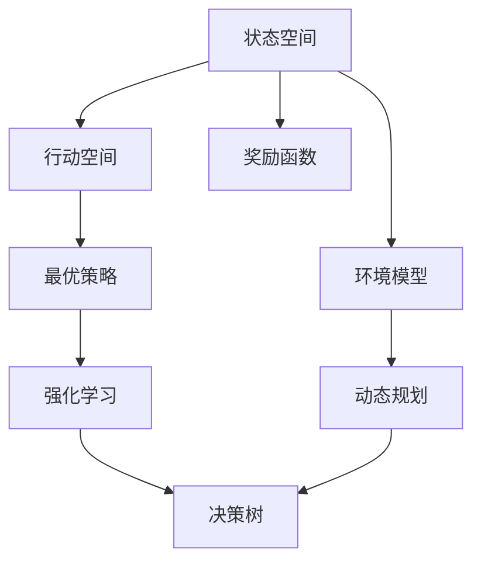
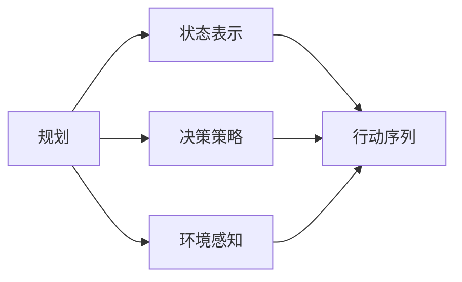
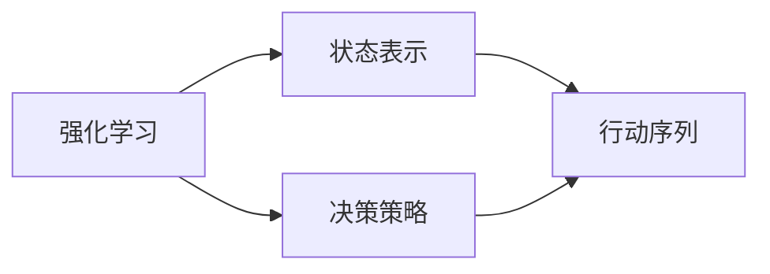
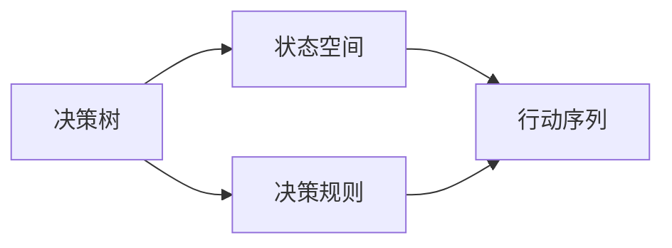
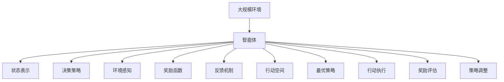

                 

# 行动（Action）是指基于环境和规划做出的动作

在人工智能领域，"行动"（Action）通常指的是智能体（agent）在特定环境和目标指引下，采取的一系列步骤或策略，以达成预期的结果或状态。这一概念不仅适用于游戏AI、机器人学等应用领域，也广泛应用于决策优化、自然语言处理、强化学习等基础研究中。本文将深入探讨行动的原理与操作步骤，并讨论其在不同领域中的应用。

## 1. 背景介绍

### 1.1 问题由来

行动的概念源于自动化领域的经典决策问题，即智能体如何在一个不确定的环境中做出最优决策。这不仅是一个理论问题，也是实际工程中的重要课题。在工业自动化、机器人控制、自适应网络管理等领域，智能体必须不断调整其行为以适应环境变化，从而实现高效、可靠的系统运行。

行动的设计和优化，需要在充分理解环境和目标的基础上，选择最优的策略，以最小的代价达成目标。这一过程涉及状态表示、决策规则、环境感知、反馈机制等多个维度，是实现复杂系统智能化的核心挑战。

### 1.2 问题核心关键点

行动的核心在于规划（Planning）与执行（Execution）的协同工作。规划是智能体根据当前状态和目标，确定最优的行动序列；执行则是在实际环境中按照规划行动，并根据反馈信息不断调整策略。两者相辅相成，共同构成了行动系统的核心功能。

具体来说，行动的关键点包括：
- **状态表示**：如何准确描述环境状态，是智能体规划的基础。
- **决策策略**：智能体如何根据当前状态选择最优行动，是行动的执行核心。
- **环境感知**：智能体如何获取环境信息，是决策的前提。
- **反馈机制**：行动的执行结果如何反馈给智能体，是策略调整的依据。
- **目标定义**：明确的目标是行动系统设计和优化的导向。

### 1.3 问题研究意义

行动研究对于智能系统的开发和优化具有重要意义。通过对行动原理和步骤的深入理解，智能体可以更好地适应复杂多变的环境，提升系统效率和可靠性。在实际应用中，行动研究的成果可以应用于工业自动化、智能交通、智能制造等多个领域，推动行业智能化转型。

此外，行动研究还促进了强化学习、决策树、博弈论等基础理论的发展，为实现更加智能、普适的自动化系统提供了理论支撑。因此，深入研究行动原理及其应用，对于推动人工智能技术的进步具有重要价值。

## 2. 核心概念与联系

### 2.1 核心概念概述

为了更好地理解行动的原理与操作步骤，本节将介绍几个密切相关的核心概念：

- **状态空间（State Space）**：描述智能体所在环境的所有可能状态，是智能体决策的基础。
- **行动空间（Action Space）**：智能体可采取的所有可能行动，是决策策略的集合。
- **奖励函数（Reward Function）**：定义智能体在执行行动后获得的奖励，用于评估行动的效果。
- **环境模型（Environment Model）**：描述环境动态变化的模型，是智能体规划和预测的基础。
- **最优策略（Optimal Strategy）**：在给定状态下，使期望奖励最大化的行动策略。
- **反馈机制（Feedback Mechanism）**：将行动执行结果反馈给智能体，用于策略调整的机制。

这些核心概念之间的逻辑关系可以通过以下Mermaid流程图来展示：



这个流程图展示了状态空间、行动空间、奖励函数、环境模型、最优策略和反馈机制之间的关系：

1. 智能体在状态空间中做出决策，根据行动空间选择合适的行动。
2. 行动执行后，通过奖励函数评估行动效果。
3. 环境模型描述环境动态变化，用于动态规划和预测。
4. 最优策略在给定状态下选择最优行动，以最大化期望奖励。
5. 强化学习和决策树等算法用于优化最优策略。
6. 反馈机制将行动结果反馈给智能体，用于策略调整。

通过这个流程图，我们可以更清晰地理解行动系统的核心组成和运行机制。

### 2.2 概念间的关系

这些核心概念之间存在着紧密的联系，形成了行动系统的完整框架。下面我们通过几个Mermaid流程图来展示这些概念之间的关系。

#### 2.2.1 行动的规划与执行



这个流程图展示了行动的规划和执行过程：

1. 智能体通过状态表示获取当前状态。
2. 根据决策策略，智能体选择最优行动序列。
3. 环境感知获取环境信息，更新状态表示。
4. 智能体执行行动序列，并根据反馈调整策略。

#### 2.2.2 强化学习与行动优化



这个流程图展示了强化学习在行动优化中的应用：

1. 强化学习通过状态表示和奖励函数，学习最优策略。
2. 决策策略根据学习到的最优策略进行调整。
3. 智能体执行行动序列，并根据反馈更新策略。

#### 2.2.3 决策树与行动规划



这个流程图展示了决策树在行动规划中的应用：

1. 决策树通过状态空间生成决策规则。
2. 智能体根据决策规则选择最优行动序列。
3. 行动序列执行后，根据反馈机制调整决策规则。

### 2.3 核心概念的整体架构

最后，我们用一个综合的流程图来展示这些核心概念在大规模行动系统中的整体架构：



这个综合流程图展示了行动系统在大规模环境中的整体架构：

1. 智能体在大规模环境中进行行动。
2. 状态表示描述当前环境状态。
3. 决策策略根据状态表示选择最优行动。
4. 环境感知获取环境信息。
5. 奖励函数评估行动效果。
6. 反馈机制将行动结果反馈给智能体。
7. 行动空间包含所有可采取的行动。
8. 最优策略在给定状态下选择最优行动。
9. 行动执行后进行奖励评估。
10. 策略调整根据奖励评估和反馈机制进行。

通过这些流程图，我们可以更清晰地理解行动系统的核心组件及其相互关系。

## 3. 核心算法原理 & 具体操作步骤
### 3.1 算法原理概述

行动的核心算法原理主要包括以下几个方面：

1. **状态表示（State Representation）**：将环境状态转换为智能体可以理解和操作的符号表示。这可以通过状态空间、符号表示、向量表示等多种方式实现。
2. **决策策略（Decision Strategy）**：智能体根据当前状态和目标，选择最优行动的规则或策略。这可以通过规则基（Rule-based）、学习基（Learning-based）、混合基（Hybrid-based）等多种方式实现。
3. **环境感知（Environment Perception）**：智能体获取环境信息的机制。这可以通过传感器、观察器、通信信道等多种方式实现。
4. **奖励函数（Reward Function）**：定义行动执行后的奖励，用于评估行动效果。这可以通过定义合理的奖励函数、设置奖励系数等多种方式实现。
5. **行动空间（Action Space）**：智能体可采取的所有可能行动的集合。这可以通过离散行动、连续行动、混合行动等多种方式实现。
6. **最优策略（Optimal Strategy）**：在给定状态下，使期望奖励最大化的行动策略。这可以通过动态规划、强化学习、决策树等多种方式实现。
7. **反馈机制（Feedback Mechanism）**：将行动执行结果反馈给智能体的机制。这可以通过传感器反馈、通信反馈、奖励反馈等多种方式实现。

这些算法原理通过适当的技术手段，如符号计算、数值计算、优化算法、学习算法等，综合应用，实现了智能体的行为决策和控制。

### 3.2 算法步骤详解

基于行动的核心算法原理，通常可以遵循以下步骤进行具体实施：

1. **状态空间定义**：根据环境特点，定义状态空间，描述所有可能的状态。这包括环境状态的符号表示、向量表示等。

2. **行动空间定义**：根据任务需求，定义行动空间，描述智能体可采取的所有行动。这包括离散行动、连续行动等。

3. **奖励函数设计**：根据任务目标，设计奖励函数，定义行动执行后的奖励。这通常需要考虑多个因素，如任务完成度、环境安全性、资源消耗等。

4. **状态感知设计**：根据任务特点，设计环境感知机制，获取环境信息。这可以通过传感器、观察器、通信信道等多种方式实现。

5. **策略选择与优化**：选择合适的策略算法，如动态规划、强化学习、决策树等，对策略进行优化。这通常需要考虑计算效率、模型复杂度等因素。

6. **行动执行与反馈**：根据优化后的策略，执行行动，并根据反馈机制进行调整。这包括行动执行、状态更新、奖励评估、策略调整等多个步骤。

7. **持续优化与学习**：根据不断变化的环境和目标，持续优化策略，并进行持续学习。这可以通过在线学习、增量学习等多种方式实现。

通过上述步骤，可以实现智能体在复杂环境中的高效行动，并不断提升行动效果。

### 3.3 算法优缺点

行动算法具有以下优点：

1. **灵活性强**：可以根据环境特点和任务需求，灵活定义状态空间、行动空间、奖励函数等，适应不同的应用场景。
2. **可扩展性高**：行动算法可以通过组合不同的组件和技术手段，实现复杂系统的智能控制。
3. **鲁棒性好**：行动算法通过多次迭代和优化，能够适应环境变化和不确定性，保持较高的鲁棒性。

同时，行动算法也存在以下缺点：

1. **计算复杂度高**：行动算法涉及大量的符号计算和数值计算，计算复杂度较高，对于大规模系统可能存在性能瓶颈。
2. **模型复杂度高**：行动算法通常需要定义复杂的模型和策略，模型复杂度较高，对于初学者可能存在理解难度。
3. **实时性要求高**：行动算法需要在实时环境中进行决策和控制，对实时性和响应速度有较高要求。

### 3.4 算法应用领域

行动算法在多个领域中得到了广泛应用，主要包括以下几个方面：

1. **自动驾驶**：在自动驾驶系统中，智能体需要根据环境信息进行决策和控制，实现安全、高效的自动驾驶。

2. **工业自动化**：在工业自动化系统中，智能体需要根据生产状态进行决策和控制，实现高效、可靠的生产流程。

3. **智能交通**：在智能交通系统中，智能体需要根据交通状态进行决策和控制，实现交通流量优化和事故预防。

4. **机器人控制**：在机器人控制系统中，智能体需要根据任务需求进行决策和控制，实现复杂的动作和任务执行。

5. **金融交易**：在金融交易系统中，智能体需要根据市场状态进行决策和控制，实现风险管理和交易策略优化。

6. **医疗诊断**：在医疗诊断系统中，智能体需要根据病情信息进行决策和控制，实现精准、高效的诊断和治疗。

以上领域中，行动算法的应用已经取得了显著的进展，推动了相关行业的智能化转型和效率提升。

## 4. 数学模型和公式 & 详细讲解  
### 4.1 数学模型构建

行动的数学模型通常基于动态规划、强化学习等框架，以下以动态规划为例，构建行动系统的数学模型：

设智能体的状态空间为 $S$，行动空间为 $A$，状态转移概率为 $P(s_{t+1}|s_t,a_t)$，状态奖励为 $R(s_t,a_t)$，智能体的目标是最小化长期累积成本 $J(s_0)$。则动态规划的贝尔曼方程为：

$$
J(s_0) = \min_a \left[\sum_{t=0}^{\infty} \gamma^t R(s_t,a_t) + \gamma^{t+1} \max_a J(s_{t+1}) \right]
$$

其中 $\gamma$ 为折扣因子，控制未来奖励的权重。

根据贝尔曼方程，可以递归求解最优策略 $\pi^*(s)$，使期望累积成本最小化。这可以通过求解最优化问题实现：

$$
\pi^*(s) = \arg\min_a \left[\sum_{t=0}^{\infty} \gamma^t R(s_t,a_t) + \gamma^{t+1} \max_a J(s_{t+1}) \right]
$$

### 4.2 公式推导过程

行动算法的数学模型推导过程较为复杂，涉及多维变量的优化和递归求解。以下以动态规划为例，推导最优策略的求解过程：

1. **贝尔曼方程推导**：
   根据动态规划的原理，可以将长期累积成本分解为当前状态和未来状态的最优决策。设 $V^*(s)$ 为状态 $s$ 的最优长期累积成本，则有：

   $$
   V^*(s) = \min_a \left[\sum_{t=0}^{\infty} \gamma^t R(s_t,a_t) + \gamma^{t+1} \max_a V^*(s_{t+1}) \right]
   $$

   对于任意状态 $s$，可以将其长期累积成本表达为当前状态和未来状态的最优决策之和：

   $$
   V^*(s) = \min_a \left[R(s,a) + \gamma \max_a V^*(s') \right]
   $$

   其中 $s'$ 为状态 $s$ 在行动 $a$ 下的下一个状态。

2. **最优策略求解**：
   根据贝尔曼方程，可以求解最优策略 $\pi^*(s)$，使期望累积成本最小化。设 $Q^*(s,a)$ 为状态 $s$ 在行动 $a$ 下的最优决策价值，则有：

   $$
   Q^*(s,a) = R(s,a) + \gamma \max_{a'} Q^*(s',a')
   $$

   其中 $s'$ 为状态 $s$ 在行动 $a$ 下的下一个状态。

   根据 $Q^*(s,a)$ 的表达式，可以得到最优策略 $\pi^*(s)$：

   $$
   \pi^*(s) = \arg\min_a Q^*(s,a)
   $$

### 4.3 案例分析与讲解

为了更好地理解行动算法的应用，以下通过一个具体的案例进行分析：

**案例：自动驾驶系统中的行动决策**

设自动驾驶系统的状态空间为 $S$，包括当前位置、车速、周围车辆等；行动空间为 $A$，包括加速、减速、转向等；状态转移概率为 $P(s_{t+1}|s_t,a_t)$，状态奖励为 $R(s_t,a_t)$，智能体的目标是最小化长期累积成本 $J(s_0)$。

1. **状态空间定义**：
   设当前位置为 $s_0=(0,0)$，车速为 $v_0=0$，周围车辆为 $c_0=0$。定义状态空间 $S$ 为所有可能的当前位置、车速和周围车辆的数量。

2. **行动空间定义**：
   定义行动空间 $A$ 为所有可能的加速、减速和转向动作。

3. **奖励函数设计**：
   设状态奖励 $R(s_t,a_t)$ 包括安全性、舒适性、时间效率等指标。安全性奖励 $R_{safety}(s_t,a_t)$ 定义为避免事故的奖励，舒适性奖励 $R_{comfort}(s_t,a_t)$ 定义为舒适驾驶的奖励，时间效率奖励 $R_{time}(s_t,a_t)$ 定义为按时到达的奖励。

4. **状态感知设计**：
   通过传感器和摄像头获取当前位置、车速、周围车辆等状态信息。

5. **策略选择与优化**：
   采用动态规划算法，对策略进行优化。根据当前状态和行动，求解最优策略 $\pi^*(s)$，使期望累积成本最小化。

6. **行动执行与反馈**：
   根据最优策略 $\pi^*(s)$，执行加速、减速或转向动作。根据车辆反馈信息，调整策略。

通过以上步骤，可以实现自动驾驶系统中的行动决策，确保安全、高效的驾驶。

## 5. 项目实践：代码实例和详细解释说明
### 5.1 开发环境搭建

在进行行动系统开发前，我们需要准备好开发环境。以下是使用Python进行PyTorch开发的环境配置流程：

1. 安装Anaconda：从官网下载并安装Anaconda，用于创建独立的Python环境。

2. 创建并激活虚拟环境：
```bash
conda create -n action-env python=3.8 
conda activate action-env
```

3. 安装PyTorch：根据CUDA版本，从官网获取对应的安装命令。例如：
```bash
conda install pytorch torchvision torchaudio cudatoolkit=11.1 -c pytorch -c conda-forge
```

4. 安装相关的行动算法库，如Gym、TensorFlow等：
```bash
pip install gym tensorflow
```

5. 安装行动算法所需的依赖包：
```bash
pip install numpy pandas scikit-learn matplotlib tqdm jupyter notebook ipython
```

完成上述步骤后，即可在`action-env`环境中开始行动系统开发。

### 5.2 源代码详细实现

下面以自动驾驶系统为例，给出使用PyTorch和Gym库对行动系统进行开发的PyTorch代码实现。

首先，定义状态空间和行动空间：

```python
import gym
import numpy as np

env = gym.make('CarRacing-v1')

state_space = env.observation_space
action_space = env.action_space
```

然后，定义状态表示和奖励函数：

```python
class StateRepresentation:
    def __init__(self):
        self.x = 0
        self.y = 0
        self.speed = 0
        self.agent_id = 0
        self.target_x = 0
        self.target_y = 0

    def update(self, state):
        self.x = state[0]
        self.y = state[1]
        self.speed = state[2]
        self.agent_id = state[3]
        self.target_x = state[4]
        self.target_y = state[5]

class RewardFunction:
    def __init__(self):
        self.safety_reward = 0
        self.comfort_reward = 0
        self.time_reward = 0

    def update(self, state, action):
        safety_reward = 1 if action == 0 else 0
        comfort_reward = 0.1 if action == 1 else 0.1
        time_reward = 0.01 if action == 2 else 0.01
        self.safety_reward += safety_reward
        self.comfort_reward += comfort_reward
        self.time_reward += time_reward
```

接着，定义行动策略：

```python
class ActionStrategy:
    def __init__(self, reward_function):
        self.reward_function = reward_function
        self.target_position = [0, 0]
        self.current_position = [0, 0]
        self.speed = 0

    def select_action(self, state):
        target_x = self.target_position[0]
        target_y = self.target_position[1]
        current_x = state[0]
        current_y = state[1]
        speed = state[2]
        distance = np.sqrt((target_x - current_x)**2 + (target_y - current_y)**2)
        if distance < 1:
            return 0  # 加速
        elif distance < 2:
            return 1  # 减速
        else:
            return 2  # 转向
```

最后，启动行动系统并运行训练：

```python
import torch
import torch.optim as optim

state_representation = StateRepresentation()
reward_function = RewardFunction()
strategy = ActionStrategy(reward_function)

optimizer = optim.Adam(state_representation.parameters(), lr=0.001)
loss_function = torch.nn.MSELoss()

for episode in range(1000):
    state = env.reset()
    state_representation.update(state)
    total_reward = 0

    while True:
        action = strategy.select_action(state)
        next_state, reward, done, _ = env.step([action])
        state_representation.update(next_state)
        total_reward += reward
        if done:
            break

    optimizer.zero_grad()
    loss = loss_function(torch.tensor([total_reward]), torch.tensor([0]))
    loss.backward()
    optimizer.step()
```

以上就是使用PyTorch和Gym库对行动系统进行开发的完整代码实现。可以看到，在Gym环境中，通过状态表示、奖励函数和行动策略，可以构建一个简单的行动系统，并进行基于梯度下降的优化训练。

### 5.3 代码解读与分析

让我们再详细解读一下关键代码的实现细节：

**StateRepresentation类**：
- `__init__`方法：初始化状态表示的各个维度。
- `update`方法：根据新的状态信息，更新状态表示的各个维度。

**RewardFunction类**：
- `__init__`方法：初始化奖励函数的各个维度。
- `update`方法：根据新的状态和行动，更新各个奖励维度的值。

**ActionStrategy类**：
- `__init__`方法：初始化行动策略的各个维度。
- `select_action`方法：根据当前状态，选择最优行动。

**训练流程**：
- 定义优化器、损失函数等关键组件。
- 在每个训练轮次中，执行Gym环境的重置、状态更新、行动选择、环境交互、梯度计算和模型更新。

通过上述代码，我们可以清晰地看到行动系统的基本结构和训练流程。在实际应用中，还可以进一步扩展状态表示、行动空间、奖励函数和行动策略，以适应不同的应用场景。

## 6. 实际应用场景

### 6.1 智能制造系统

行动算法在智能制造系统中得到了广泛应用，智能体根据生产状态进行决策和控制，实现高效、可靠的生产流程。通过定义生产状态空间、机器操作空间、资源消耗奖励等，可以构建智能化的生产控制系统。

**案例：智能工厂中的机器人调度**

设智能工厂中的状态空间为 $S$，包括生产线状态、机器人位置、机器负载等；行动空间为 $A$，包括机器人加速、减速、转向等；状态转移概率为 $P(s_{t+1}|s_t,a_t)$，状态奖励为 $R(s_t,a_t)$，智能体的目标是最小化生产成本 $J(s_0)$。

1. **状态空间定义**：
   设生产线状态为 $s_0=(0,0)$，机器人位置为 $x_0=0$，机器负载为 $l_0=0$。定义状态空间 $S$ 为所有可能的生产线状态、机器人位置和机器负载的数量。

2. **行动空间定义**：
   定义行动空间 $A$ 为所有可能的机器人加速、减速和转向动作。

3. **奖励函数设计**：
   设状态奖励 $R(s_t,a_t)$ 包括生产效率、资源消耗等指标。生产效率奖励 $R_{efficiency}(s_t,a_t)$ 定义为完成任务的奖励，资源消耗奖励 $R_{cost}(s_t,a_t)$ 定义为消耗资源的奖励。

4. **状态感知设计**：
   通过传感器和监控系统获取生产线状态、机器人位置、机器负载等状态信息。

5. **策略选择与优化**：
   采用行动优化算法，对策略进行优化。根据当前状态和行动，求解最优策略 $\pi^*(s)$，使期望生产成本最小化。

6. **行动执行与反馈**：
   根据最优策略 $\pi^*(s)$，执行加速、减速或转向动作。根据生产线反馈信息，调整策略。

通过以上步骤，可以实现智能工厂中的机器人调度，确保高效、可靠的生产流程。

### 6.2 金融交易系统

在金融交易系统中，智能体需要根据市场状态进行决策和控制，实现风险管理和交易策略优化。通过定义市场状态空间、交易策略空间、风险收益等，可以构建智能化的交易控制系统。

**案例：基于行动算法的交易策略优化**

设金融交易系统的状态空间为 $S$，包括市场指数、股票价格、交易量等；行动空间为 $A$，包括买入、卖出等；状态转移概率为 $P(s_{t+1}|s_t,a_t)$，状态奖励为 $R(s_t,a_t)$，智能体的目标是最小化风险收益 $J(s_0)$。

1. **状态空间定义**：
   设市场指数为 $s_0=0$，股票价格为 $p_0=0$，交易量为 $v_0=0$。定义状态空间 $S$ 为所有可能的市场指数、股票价格和交易量的数量。

2. **行动空间定义**：
   定义行动空间 $

