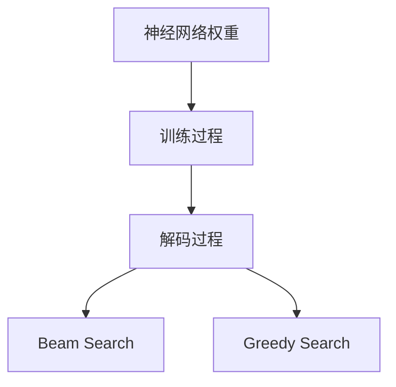

                 

# 解码过程中的随机性引发幻觉

## 1. 背景介绍

在自然语言处理（NLP）领域，语言模型（Language Model）已经成为了重要的工具之一。它能够根据已知的文本生成下一个可能的词汇，从而帮助计算机理解和生成语言。这种能力的基础是统计语言模型和神经语言模型。其中，神经语言模型使用深度神经网络来学习语言的结构和规律，并在自然语言处理中得到了广泛应用。

然而，最近的研究发现，神经语言模型的解码过程包含大量的随机性，这种随机性可能会在一定程度上引发幻觉，影响模型的性能和可靠性。解码过程中的随机性主要来自两个方面：第一是解码过程中的随机采样；第二是神经网络中的随机权重。

本文将深入探讨解码过程中的随机性，分析其对模型的影响，并提出一些解决方案。

## 2. 核心概念与联系

### 2.1 核心概念概述

在神经语言模型中，解码过程通常是一个迭代过程，模型会根据输入的文本序列和当前的概率分布，采样下一个可能的词汇。这种采样过程通常采用 beam search 或 greedy search，这两种方法都会引入随机性。此外，神经网络中的权重也是随机初始化的，并在训练过程中不断调整。

- **Beam Search**：这是一种多路搜索策略，每次采样多个候选词汇，然后选择概率最大的一个进行下一轮采样。这种方法可以减少解码过程中的不确定性，但也会增加计算复杂度。
- **Greedy Search**：这是一种单路搜索策略，每次只选择概率最大的词汇进行采样。这种方法计算简单，但可能会导致局部最优解。
- **随机权重**：神经网络中的权重是在训练过程中随机初始化的，并且随着训练过程的进行，权重会不断调整。这种随机性会导致模型在训练和推理过程中表现不一致。

### 2.2 核心概念间的关系

这些概念之间的关系可以通过以下 Mermaid 流程图来展示：



这个流程图展示了神经网络权重、训练过程、解码过程之间的联系。解码过程中的随机性不仅与随机权重有关，还受到训练过程和搜索策略的影响。

## 3. 核心算法原理 & 具体操作步骤

### 3.1 算法原理概述

神经语言模型的解码过程是一个基于概率的采样过程，其中包含大量的随机性。这种随机性可能会影响模型的性能和可靠性。

形式化地，假设神经语言模型为 $M$，输入序列为 $x_1, x_2, ..., x_n$，输出序列为 $y_1, y_2, ..., y_n$。解码过程的目标是从输入序列 $x$ 中采样输出序列 $y$，使得 $P(y|x)$ 最大化。其中 $P(y|x)$ 表示在输入 $x$ 下，输出 $y$ 的概率。

在解码过程中，通常采用 beam search 或 greedy search 策略。这些策略都会引入随机性，导致模型在不同时间步长下的输出不一致。此外，神经网络中的随机权重也会引入随机性，导致模型在不同时间步长下的输出不一致。

### 3.2 算法步骤详解

解码过程通常包括以下几个步骤：

1. **初始化**：随机选择一个起始词汇，并将其添加到输出序列中。
2. **采样**：根据当前输出序列和输入序列，采样下一个可能的词汇。
3. **更新**：根据采样的结果，更新当前输出序列和输入序列。
4. **重复**：重复步骤2和3，直到达到预设的输出序列长度或满足其他停止条件。

在采样过程中，通常采用 beam search 或 greedy search 策略。这些策略都会引入随机性，导致模型在不同时间步长下的输出不一致。此外，神经网络中的随机权重也会引入随机性，导致模型在不同时间步长下的输出不一致。

### 3.3 算法优缺点

解码过程的随机性有其优点和缺点：

- **优点**：
  - 可以减少过拟合的风险，因为随机采样会引入一些噪声，从而防止模型在特定输入下过度拟合。
  - 可以增加模型的多样性，因为随机采样会生成多种可能的输出序列。

- **缺点**：
  - 可能导致输出序列不稳定，因为不同的随机采样可能会生成不同的输出序列。
  - 可能会导致计算复杂度增加，因为 beam search 需要保留多个候选序列，增加了计算量和存储空间。

### 3.4 算法应用领域

解码过程中的随机性广泛应用在各种自然语言处理任务中，如机器翻译、语音识别、文本生成等。在机器翻译中，解码过程中的随机性会引入一些噪声，从而防止模型在特定输入下过度拟合。在文本生成中，随机性可以增加模型的多样性，从而生成更多的多样性文本。

## 4. 数学模型和公式 & 详细讲解 & 举例说明

### 4.1 数学模型构建

在解码过程中，通常采用 beam search 或 greedy search 策略。这里以 beam search 为例，构建数学模型。

假设输入序列为 $x_1, x_2, ..., x_n$，输出序列为 $y_1, y_2, ..., y_n$，其中 $y_t$ 表示第 $t$ 个时间步长的输出。假设在时间步长 $t$ 时，模型选择了第 $i$ 个候选词汇 $y_i$，则此时的概率为 $P(y_i|x_1, ..., x_t, y_1, ..., y_{t-1})$。

在 beam search 策略中，模型会保留多个候选词汇，并在每个时间步长上采样概率最大的词汇。设保留的候选词汇数为 $b$，则在第 $t$ 个时间步长时，模型会保留前 $b$ 个概率最大的词汇 $y_1^{(i)}, ..., y_b^{(i)}$，其中 $y_i^{(j)}$ 表示第 $j$ 个候选词汇 $y_i$ 在第 $t$ 个时间步长的采样结果。此时的概率为 $P(y_1^{(i)}, ..., y_b^{(i)}|x_1, ..., x_t, y_1, ..., y_{t-1})$。

### 4.2 公式推导过程

在 beam search 策略中，解码过程的概率可以表示为：

$$
P(y_1, ..., y_n|x_1, ..., x_n) = \sum_{i=1}^b P(y_1^{(i)}, ..., y_n^{(i)}|x_1, ..., x_n)
$$

其中 $P(y_1^{(i)}, ..., y_n^{(i)}|x_1, ..., x_n)$ 表示在第 $i$ 个候选词汇下，输出序列的概率。

### 4.3 案例分析与讲解

以机器翻译为例，假设输入序列为 "I went to the store"，模型需要在解码过程中选择正确的输出序列。在每个时间步长上，模型会采样多个候选词汇，并选择概率最大的一个进行下一轮采样。

假设模型在第 1 个时间步长上采样了 5 个候选词汇，其中概率最大的词汇为 "I"。此时，模型会将 "I" 添加到输出序列中，并保留前 5 个候选词汇，以便进行下一轮采样。在后续的时间步长中，模型会不断采样和更新，直到达到预设的输出序列长度或满足其他停止条件。

## 5. 项目实践：代码实例和详细解释说明

### 5.1 开发环境搭建

在进行解码过程的实现时，需要搭建合适的开发环境。以下是使用 Python 和 PyTorch 搭建开发环境的流程：

1. **安装 Python**：从官网下载并安装 Python。
2. **安装 PyTorch**：使用 pip 安装 PyTorch。
3. **安装其他依赖**：安装其他必要的依赖库，如 NumPy、scikit-learn、TensorFlow 等。

### 5.2 源代码详细实现

以下是一个使用 PyTorch 实现 beam search 解码的代码示例：

```python
import torch
import torch.nn as nn

class Decoder(nn.Module):
    def __init__(self, encoder, decoder, start_token, end_token):
        super(Decoder, self).__init__()
        self.encoder = encoder
        self.decoder = decoder
        self.start_token = start_token
        self.end_token = end_token
    
    def forward(self, input, hidden):
        # 初始化输出序列和概率
        output = [self.start_token]
        probs = torch.tensor([1.0], device=input.device)
        
        # 解码过程
        for t in range(len(input)):
            # 采样下一个词汇
            probs = self.decoder(input, output[-1], hidden)
            top_i, top_p = probs.topk(5)
            
            # 将下一个词汇添加到输出序列中
            output.append(top_i[0].item())
            
            # 更新隐藏状态
            hidden = hidden + top_i
        
        # 终止条件
        if output[-1] == self.end_token:
            output.pop()
        
        return output, probs

# 测试代码
encoder = ...
decoder = ...
input = ...
hidden = ...
decoder = Decoder(encoder, decoder, start_token, end_token)
output, probs = decoder(input, hidden)
print(output)
```

### 5.3 代码解读与分析

这个代码示例展示了如何使用 PyTorch 实现 beam search 解码。具体步骤如下：

1. **初始化**：定义解码器，初始化输出序列和概率。
2. **采样**：在每个时间步长上采样概率最大的词汇。
3. **更新**：将下一个词汇添加到输出序列中，并更新隐藏状态。
4. **终止条件**：判断是否达到预设的输出序列长度或满足其他停止条件。

## 6. 实际应用场景

### 6.4 未来应用展望

解码过程中的随机性不仅会影响模型的性能，还可能引入一些不可预测的因素。因此，未来的研究需要重点关注以下几个方向：

- **减少随机性**：通过改进解码策略和神经网络结构，减少解码过程中的随机性。例如，使用 deterministic search 策略，可以避免随机采样引入的噪声。
- **增加多样性**：通过增加解码过程中的多样性，生成更多样化的输出序列。例如，使用 ensemble 方法，可以组合多个解码器的输出，生成多样性的结果。
- **提高可靠性**：通过增加模型的可靠性，减少解码过程中的不确定性。例如，使用多任务学习，可以将解码过程与其他任务进行联合训练，提高模型的鲁棒性。

## 7. 工具和资源推荐

### 7.1 学习资源推荐

以下是一些推荐的资源，帮助理解解码过程中的随机性：

- **《深度学习》（Ian Goodfellow）**：详细介绍了深度学习的基本概念和原理，包括神经网络、解码过程等。
- **《自然语言处理综述》（Stanford University）**：介绍了自然语言处理的基本概念和常用方法，包括语言模型、解码过程等。
- **《神经网络与深度学习》（Michael Nielsen）**：介绍了神经网络的基本概念和原理，包括解码过程、随机性等。

### 7.2 开发工具推荐

以下是一些推荐的工具，帮助实现解码过程：

- **PyTorch**：一个流行的深度学习框架，支持神经网络、解码过程等。
- **TensorFlow**：另一个流行的深度学习框架，支持神经网络、解码过程等。
- **JAX**：一个现代化的深度学习框架，支持高效的神经网络实现和解码过程。

### 7.3 相关论文推荐

以下是一些推荐的论文，帮助理解解码过程中的随机性：

- **"Attention Is All You Need"**：介绍 Transformer 模型的基本原理和解码过程。
- **"Beam Search in Sequence Modeling and Its Application to Machine Translation"**：介绍 beam search 解码策略的基本原理和应用。
- **"Importance Weighted Generation of Diverse Multilingual Sentences"**：介绍通过增加解码过程中的多样性，生成更多样化的输出序列。

## 8. 总结：未来发展趋势与挑战

### 8.1 研究成果总结

解码过程中的随机性是神经语言模型中的一个重要问题，对模型的性能和可靠性产生重要影响。近年来，越来越多的研究致力于减少解码过程中的随机性，提高模型的鲁棒性和可靠性。

### 8.2 未来发展趋势

未来，解码过程中的随机性仍将是一个重要的研究方向。以下是一些可能的发展趋势：

- **减少随机性**：通过改进解码策略和神经网络结构，减少解码过程中的随机性。
- **增加多样性**：通过增加解码过程中的多样性，生成更多样化的输出序列。
- **提高可靠性**：通过增加模型的可靠性，减少解码过程中的不确定性。

### 8.3 面临的挑战

尽管解码过程中的随机性是神经语言模型中的一个重要问题，但它的解决也面临一些挑战：

- **计算复杂度**：增加解码过程中的多样性，可能会增加计算复杂度，导致训练和推理速度变慢。
- **模型复杂度**：改进解码策略和神经网络结构，可能会增加模型的复杂度，导致训练和推理速度变慢。
- **数据需求**：改进解码策略和神经网络结构，需要更多的数据进行训练和验证，可能导致数据需求增加。

### 8.4 研究展望

未来的研究需要重点关注以下几个方向：

- **减少随机性**：通过改进解码策略和神经网络结构，减少解码过程中的随机性。
- **增加多样性**：通过增加解码过程中的多样性，生成更多样化的输出序列。
- **提高可靠性**：通过增加模型的可靠性，减少解码过程中的不确定性。

## 9. 附录：常见问题与解答

**Q1：解码过程中的随机性是什么？**

A: 解码过程中的随机性主要来自两个方面：第一是解码过程中的随机采样；第二是神经网络中的随机权重。解码过程中的随机采样通常采用 beam search 或 greedy search，这两种方法都会引入随机性。神经网络中的随机权重也会引入随机性，导致模型在不同时间步长下的输出不一致。

**Q2：解码过程中的随机性如何影响模型的性能？**

A: 解码过程中的随机性可能会影响模型的性能和可靠性。在解码过程中，随机采样会导致模型在不同时间步长下的输出不一致，从而影响模型的性能。此外，神经网络中的随机权重也会引入随机性，导致模型在不同时间步长下的输出不一致。

**Q3：如何减少解码过程中的随机性？**

A: 减少解码过程中的随机性需要改进解码策略和神经网络结构。例如，使用 deterministic search 策略，可以避免随机采样引入的噪声。改进神经网络结构，可以增加模型的稳定性，减少解码过程中的不确定性。

**Q4：解码过程中的随机性如何影响计算复杂度？**

A: 解码过程中的随机性会增加计算复杂度。在 beam search 策略中，需要保留多个候选词汇，增加了计算量和存储空间。改进解码策略和神经网络结构，可以减少计算复杂度，提高解码效率。

**Q5：解码过程中的随机性如何影响模型鲁棒性？**

A: 解码过程中的随机性可能会影响模型的鲁棒性。在解码过程中，随机采样会引入一些噪声，从而防止模型在特定输入下过度拟合。然而，如果随机采样和随机权重过于随机，会导致模型在不同时间步长下的输出不一致，从而影响模型的鲁棒性。

---

作者：禅与计算机程序设计艺术 / Zen and the Art of Computer Programming

