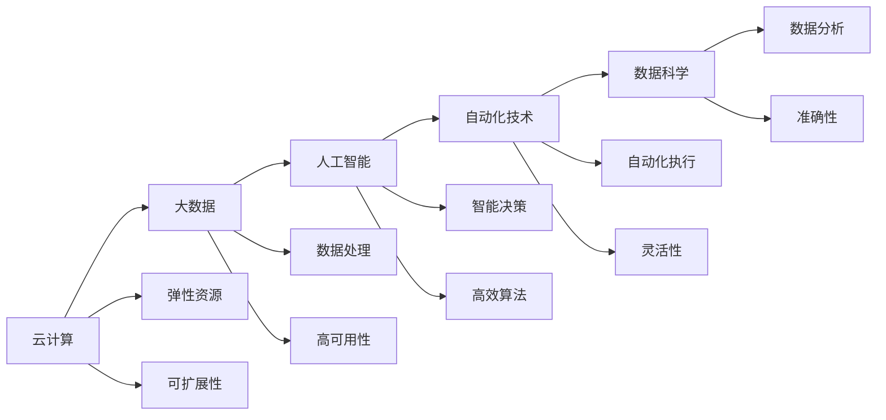

                 

# 计算变化与自动化技术的结合

> 关键词：计算变化, 自动化技术, 人工智能, 云计算, 数据科学, 工业4.0

## 1. 背景介绍

### 1.1 问题由来
随着信息技术的快速发展和普及，计算和自动化技术在各行各业的应用日益广泛。从制造业的自动化生产线，到金融业的智能投顾，再到医疗行业的精准诊断，计算和自动化技术的融合，正在推动社会经济的全面变革。然而，这些技术的深度应用，仍面临着诸多挑战，如系统复杂度增加、数据处理能力不足、决策透明性欠缺等。

为了应对这些挑战，计算和自动化技术的结合成为了研究热点。本文将深入探讨这一主题，阐明其核心概念、原理及应用，并对未来的发展趋势和面临的挑战进行展望。

### 1.2 问题核心关键点
计算变化与自动化技术的结合，指的是利用计算技术（如云计算、大数据、人工智能等）来提升自动化系统的能力，使其更加智能化、自动化。这一范式将大大降低人力成本，提高生产效率，增强决策科学性和透明度。

具体来说，其核心关键点包括：

1. **云计算**：提供弹性、可扩展的计算资源，支持大规模数据处理和分布式计算。
2. **大数据**：通过数据收集、分析和可视化，帮助决策者洞察复杂问题的本质，做出更准确的决策。
3. **人工智能**：包括机器学习、自然语言处理、计算机视觉等技术，使自动化系统具备更强的理解和决策能力。
4. **自动化技术**：涵盖机器人、自动化流程、自动化工具等，实现业务流程的标准化和自动化。
5. **数据科学**：通过统计分析和模型构建，发现数据间的潜在关系，提供数据驱动的决策支持。

这些技术相互交织，共同作用于自动化系统，使其能够更加智能、高效、可靠。

### 1.3 问题研究意义
计算变化与自动化技术的结合，对于推动各行业数字化转型，提升产业竞争力，具有重要意义：

1. **效率提升**：通过自动化和智能化，大幅提升生产和服务效率，缩短产品上市时间。
2. **成本降低**：减少人力投入，优化资源配置，降低企业运营成本。
3. **质量改进**：通过数据驱动的决策支持，提高产品和服务质量。
4. **灵活性增强**：利用弹性计算资源，快速响应市场变化，提升企业应对能力。
5. **数据驱动**：推动企业决策过程向数据驱动转变，增强决策的科学性和透明性。

总之，计算变化与自动化技术的结合，正在重塑企业的运营模式，引领社会经济向智能化、自动化方向发展。

## 2. 核心概念与联系

### 2.1 核心概念概述

计算变化与自动化技术的结合，涉及多个核心概念，包括：

1. **云计算**：通过互联网提供动态、可扩展的计算资源，支持各类计算需求。
2. **大数据**：指从多种来源收集的海量数据，通过分析挖掘获取洞察，支持决策。
3. **人工智能**：利用机器学习等技术，提升自动化系统的认知和决策能力。
4. **自动化技术**：通过机械手、机器人等工具，实现业务流程的标准化和自动化。
5. **数据科学**：通过统计分析和模型构建，提取数据间的关联关系，指导决策。

这些概念共同构成了计算变化与自动化技术的结合体系，通过云计算和大数据的支撑，结合人工智能和自动化技术，实现高效、智能的业务自动化。

### 2.2 概念间的关系

计算变化与自动化技术的结合，是一个复杂的技术系统，各概念间的关系可以通过以下Mermaid流程图来展示：



这个流程图展示了各概念之间的关系：

1. 云计算通过提供弹性资源和可扩展性，支撑大数据处理和分析。
2. 大数据通过数据处理和高可用性，为人工智能提供数据支持。
3. 人工智能通过高效算法和智能决策，提升自动化系统的认知能力。
4. 自动化技术通过自动化执行和灵活性，实现业务流程的标准化。
5. 数据科学通过数据分析和准确性，提供数据驱动的决策支持。

通过这些概念的相互配合，计算变化与自动化技术的结合体系能够高效地处理复杂业务，提供智能决策支持。

## 3. 核心算法原理 & 具体操作步骤
### 3.1 算法原理概述

计算变化与自动化技术的结合，通常涉及以下几个关键步骤：

1. **数据采集与预处理**：收集企业内部和外部的各类数据，并进行清洗和预处理。
2. **云计算资源配置**：根据业务需求，配置云计算资源，包括计算、存储、网络等。
3. **大数据处理**：利用分布式计算框架（如Hadoop、Spark等）对数据进行处理和分析。
4. **机器学习模型训练**：使用监督学习、无监督学习等技术，训练机器学习模型。
5. **自动化流程设计**：设计自动化流程，包括业务规则、工作流等，实现业务自动化。
6. **系统集成与部署**：将各组件集成到统一的系统中，并进行部署和测试。

### 3.2 算法步骤详解

以下详细介绍每个步骤的具体操作：

**Step 1: 数据采集与预处理**

1. **数据收集**：通过传感器、互联网、数据库等途径，收集企业内部和外部的数据，如订单信息、生产数据、客户反馈等。
2. **数据清洗**：剔除重复、错误、不完整的数据，进行数据格式转换和归一化。
3. **数据存储**：使用关系数据库、NoSQL数据库等存储数据，便于后续分析和查询。

**Step 2: 云计算资源配置**

1. **云平台选择**：根据企业需求，选择合适的云平台（如AWS、Azure、Google Cloud等）。
2. **资源配置**：根据业务负载，配置计算、存储和网络资源，确保系统的高可用性和扩展性。
3. **安全性设置**：配置网络隔离、数据加密、访问控制等安全措施，保护数据和系统安全。

**Step 3: 大数据处理**

1. **数据分区**：将大数据集分成若干小分区，进行并行处理。
2. **分布式计算**：使用Hadoop、Spark等框架，进行分布式计算和数据处理。
3. **数据分析**：使用统计分析、数据挖掘等技术，提取数据间的关联关系和趋势。

**Step 4: 机器学习模型训练**

1. **特征工程**：提取和选择数据特征，进行特征工程处理。
2. **模型选择**：根据业务需求，选择监督学习、无监督学习等机器学习模型。
3. **模型训练**：使用历史数据训练模型，优化模型参数，提升模型性能。

**Step 5: 自动化流程设计**

1. **流程设计**：根据业务需求，设计自动化流程，包括业务规则、工作流等。
2. **工具选择**：选择适合的自动化工具，如Zapier、IFTTT等，实现流程自动化。
3. **监控与优化**：实时监控流程执行情况，优化流程效率和准确性。

**Step 6: 系统集成与部署**

1. **集成方案设计**：设计系统的集成方案，包括数据源、中间件、应用等。
2. **系统部署**：将系统部署到云平台，进行测试和验证。
3. **持续集成与交付**：使用CI/CD工具（如Jenkins、GitLab CI等）进行持续集成和交付，确保系统稳定运行。

### 3.3 算法优缺点

计算变化与自动化技术的结合，具有以下优点：

1. **高效性**：通过云计算和大数据技术，大幅提升数据处理和计算效率，支持大规模业务。
2. **灵活性**：利用弹性计算资源，快速响应业务需求变化，提升系统灵活性。
3. **智能性**：结合人工智能技术，提升自动化系统的认知和决策能力，实现智能化。
4. **可扩展性**：利用云计算资源，支持系统的可扩展性和弹性，适应不断增长的业务需求。

同时，也存在以下缺点：

1. **成本高**：云计算和大数据技术需要较高的投入，包括硬件设施、技术人力等。
2. **复杂性高**：系统架构复杂，涉及多种技术，维护难度大。
3. **数据隐私和安全问题**：大规模数据处理和传输可能带来数据隐私和安全问题，需要严格的数据保护措施。
4. **技术门槛高**：需要较高的技术水平和经验，对企业技术团队要求高。

### 3.4 算法应用领域

计算变化与自动化技术的结合，已在多个领域得到应用，包括但不限于：

1. **制造业**：利用智能制造系统，实现生产流程的自动化和智能化。
2. **金融业**：通过智能投顾和风险管理系统，提高金融服务的效率和准确性。
3. **医疗健康**：使用智能诊断系统和健康管理平台，提供精准的医疗服务。
4. **零售业**：构建智能推荐系统和客户分析平台，提升客户体验和销售效率。
5. **交通运输**：利用智能交通管理系统，提高交通流量管理和运营效率。
6. **能源行业**：通过智能电网和能源管理系统，优化能源生产和消费。

这些领域的成功应用，展示了计算变化与自动化技术结合的广泛潜力和巨大价值。

## 4. 数学模型和公式 & 详细讲解 & 举例说明

### 4.1 数学模型构建

以下是一个简单的例子，说明计算变化与自动化技术的结合过程：

假设某电商平台希望通过计算变化与自动化技术，实现智能推荐系统的建设。其核心步骤如下：

1. **数据采集与预处理**：收集用户行为数据（如浏览、购买、评分等），进行数据清洗和预处理。
2. **云计算资源配置**：使用AWS云平台，配置计算和存储资源，确保系统的扩展性和高可用性。
3. **大数据处理**：使用Hadoop框架，对用户行为数据进行分布式处理和分析。
4. **机器学习模型训练**：使用监督学习算法（如随机森林、梯度提升树等），训练用户兴趣模型。
5. **自动化流程设计**：设计推荐算法和流程，实现智能推荐。
6. **系统集成与部署**：将推荐系统集成到电商平台中，进行测试和部署。

### 4.2 公式推导过程

以推荐系统为例，以下是推荐算法中的常见公式：

1. **协同过滤算法**：

   $$
   \hat{r}_{ui} = \sum_{j=1}^{n} \left( \frac{r_{uj} \times r_{ji}}{\sqrt{\hat{s}_u \times \hat{s}_j}} \right)
   $$

   其中，$r_{ui}$表示用户$u$对商品$i$的预测评分，$n$表示商品数量，$r_{uj}$表示用户$u$对商品$j$的实际评分，$\hat{s}_u$表示用户$u$的评分标准差，$\hat{s}_j$表示商品$j$的评分标准差。

2. **基于内容的推荐算法**：

   $$
   \hat{r}_{ui} = \sum_{k=1}^{d} a_k \times i_k \times u_k
   $$

   其中，$d$表示特征维度，$i_k$表示商品$k$的第$k$个特征，$u_k$表示用户$u$的第$k$个特征，$a_k$表示特征权重。

### 4.3 案例分析与讲解

假设某零售公司希望通过计算变化与自动化技术，实现智能库存管理系统。其核心步骤如下：

1. **数据采集与预处理**：收集销售数据、库存数据、供应链数据等，进行数据清洗和预处理。
2. **云计算资源配置**：使用Azure云平台，配置计算和存储资源，确保系统的扩展性和高可用性。
3. **大数据处理**：使用Spark框架，对销售数据进行分布式处理和分析，发现销售趋势和库存变化规律。
4. **机器学习模型训练**：使用时间序列分析算法（如ARIMA、LSTM等），训练库存预测模型。
5. **自动化流程设计**：设计自动补货和库存调整算法，实现库存管理自动化。
6. **系统集成与部署**：将库存管理系统集成到ERP系统中，进行测试和部署。

## 5. 项目实践：代码实例和详细解释说明

### 5.1 开发环境搭建

在进行计算变化与自动化技术的结合实践前，我们需要准备好开发环境。以下是使用Python进行PyTorch开发的环境配置流程：

1. 安装Anaconda：从官网下载并安装Anaconda，用于创建独立的Python环境。

2. 创建并激活虚拟环境：
```bash
conda create -n pytorch-env python=3.8 
conda activate pytorch-env
```

3. 安装PyTorch：根据CUDA版本，从官网获取对应的安装命令。例如：
```bash
conda install pytorch torchvision torchaudio cudatoolkit=11.1 -c pytorch -c conda-forge
```

4. 安装各类工具包：
```bash
pip install numpy pandas scikit-learn matplotlib tqdm jupyter notebook ipython
```

完成上述步骤后，即可在`pytorch-env`环境中开始计算变化与自动化技术的结合实践。

### 5.2 源代码详细实现

这里我们以智能推荐系统的构建为例，给出使用PyTorch和Scikit-learn进行计算变化与自动化技术结合的PyTorch代码实现。

首先，定义推荐模型的输入和输出：

```python
import torch
from torch import nn
from sklearn.metrics import accuracy_score

class RecommendationModel(nn.Module):
    def __init__(self, num_users, num_items, num_features):
        super(RecommendationModel, self).__init__()
        self.user_embed = nn.Embedding(num_users, num_features)
        self.item_embed = nn.Embedding(num_items, num_features)
        self.sigmoid = nn.Sigmoid()
    
    def forward(self, user_ids, item_ids):
        user_embed = self.user_embed(user_ids)
        item_embed = self.item_embed(item_ids)
        dot_product = torch.sum(user_embed * item_embed, dim=1)
        prediction = self.sigmoid(dot_product)
        return prediction
```

然后，定义模型训练函数：

```python
from torch.optim import Adam
from sklearn.model_selection import train_test_split

def train_model(model, train_data, test_data, batch_size, learning_rate, epochs):
    device = torch.device('cuda' if torch.cuda.is_available() else 'cpu')
    model.to(device)
    
    train_dataset, val_dataset = train_test_split(train_data, test_size=0.2, random_state=42)
    train_loader = torch.utils.data.DataLoader(train_dataset, batch_size=batch_size, shuffle=True)
    val_loader = torch.utils.data.DataLoader(val_dataset, batch_size=batch_size, shuffle=False)
    
    optimizer = Adam(model.parameters(), lr=learning_rate)
    criterion = nn.BCELoss()
    
    for epoch in range(epochs):
        model.train()
        train_loss = 0
        for batch in train_loader:
            user_ids, item_ids, ratings = batch
            optimizer.zero_grad()
            predictions = model(user_ids.to(device), item_ids.to(device))
            loss = criterion(predictions, ratings.to(device))
            loss.backward()
            optimizer.step()
            train_loss += loss.item()
        
        model.eval()
        with torch.no_grad():
            val_loss = 0
            correct_predictions = 0
            for batch in val_loader:
                user_ids, item_ids, ratings = batch
                predictions = model(user_ids.to(device), item_ids.to(device))
                loss = criterion(predictions, ratings.to(device))
                val_loss += loss.item()
                predictions = (predictions > 0.5).float()
                correct_predictions += (predictions == ratings.to(device)).sum().item()
            
        train_loss /= len(train_loader)
        val_loss /= len(val_loader)
        accuracy = correct_predictions / len(val_loader.dataset)
        print(f'Epoch {epoch+1}, train loss: {train_loss:.4f}, val loss: {val_loss:.4f}, accuracy: {accuracy:.4f}')
```

最后，启动训练流程并在测试集上评估：

```python
num_users = 1000
num_items = 1000
num_features = 50
epochs = 10
batch_size = 64
learning_rate = 0.001

# 假设train_data, test_data已准备就绪
train_model(RecommendationModel(num_users, num_items, num_features), train_data, test_data, batch_size, learning_rate, epochs)
```

以上就是使用PyTorch和Scikit-learn进行智能推荐系统构建的完整代码实现。可以看到，借助PyTorch和Scikit-learn等工具，我们能够快速构建和训练推荐模型，实现计算变化与自动化技术的结合。

### 5.3 代码解读与分析

让我们再详细解读一下关键代码的实现细节：

**RecommendationModel类**：
- `__init__`方法：初始化用户、物品、特征嵌入层和Sigmoid激活函数。
- `forward`方法：对输入进行前向传播，计算预测值。

**train_model函数**：
- 使用Adam优化器和BCE损失函数进行模型训练。
- 使用DataLoader对数据进行批次化加载。
- 在每个epoch中，计算训练集和验证集上的损失和准确率，并打印输出。

**训练流程**：
- 定义用户、物品和特征数量。
- 调用train_model函数进行模型训练。
- 在测试集上评估模型性能。

通过上述代码，我们可以发现，计算变化与自动化技术的结合，在实践中需要借助多种工具和库进行支撑，如PyTorch、Scikit-learn、TensorFlow等。这些工具在数据处理、模型训练、模型评估等方面提供了强大的功能支持，极大提高了开发效率和系统性能。

## 6. 实际应用场景

### 6.1 智能制造系统

计算变化与自动化技术的结合，在制造业领域的应用非常广泛。通过智能制造系统，可以实现生产流程的自动化和智能化。

具体来说，智能制造系统利用云计算和大数据分析技术，实时监控生产设备和质量数据，通过机器学习模型预测设备故障和产品质量。一旦发现异常，系统自动调整生产参数，优化生产过程。此外，利用智能仓储管理系统，实现物料和库存的智能化管理，提高生产效率和库存周转率。

### 6.2 智能投顾系统

金融行业的智能投顾系统，通过计算变化与自动化技术，实现了自动化投资决策和风险管理。

智能投顾系统利用大数据分析技术，实时监控市场动态和投资组合表现，通过机器学习模型进行资产配置和风险评估。系统根据用户投资偏好和市场走势，自动调整投资组合，提供个性化的投资建议。此外，系统还利用自然语言处理技术，进行用户咨询的智能回复和风险提示，提高用户体验和投资安全性。

### 6.3 智能医疗系统

在医疗健康领域，计算变化与自动化技术的结合，实现了智能诊断系统和健康管理平台。

智能诊断系统利用大数据分析和机器学习技术，对患者历史数据和实时监测数据进行分析，提供精准的疾病诊断和预测。系统通过分析患者的症状和健康数据，自动生成诊断报告和治疗方案。此外，系统还利用自然语言处理技术，进行患者咨询的智能回复和健康建议，提高医疗服务的效率和质量。

### 6.4 未来应用展望

随着计算变化与自动化技术的不断演进，其应用前景将更加广阔。未来，该技术将在更多领域得到应用，为社会经济带来更大的价值：

1. **智慧城市**：利用智能交通管理系统和公共安全系统，提高城市管理效率和安全性。
2. **智能家居**：通过智能家电和物联网技术，实现家庭生活的自动化和智能化。
3. **智慧农业**：利用智能设备和数据分析，提高农业生产的效率和精准性。
4. **智能客服**：利用自然语言处理技术和智能推荐系统，提供高效、个性化的客户服务。

总之，计算变化与自动化技术的结合，正在推动各行业的数字化转型，提升企业的运营效率和竞争力，带来全新的生产力和市场机遇。

## 7. 工具和资源推荐

### 7.1 学习资源推荐

为了帮助开发者系统掌握计算变化与自动化技术的结合，这里推荐一些优质的学习资源：

1. **《深度学习》课程**：斯坦福大学开设的深度学习课程，涵盖了深度学习的基本概念和算法。
2. **《Python深度学习》书籍**：通过实例讲解深度学习在NLP、计算机视觉等领域的实践应用。
3. **TensorFlow官方文档**：提供了TensorFlow的全面介绍和使用指南，帮助开发者高效开发计算变化与自动化技术的应用。
4. **Kaggle竞赛平台**：通过参加数据科学竞赛，提升数据处理和模型构建能力。
5. **Google Colab**：提供免费的GPU和TPU资源，方便开发者快速进行计算变化与自动化技术的实践。

通过对这些资源的学习实践，相信你一定能够快速掌握计算变化与自动化技术的结合，并用于解决实际的业务问题。

### 7.2 开发工具推荐

高效的开发离不开优秀的工具支持。以下是几款用于计算变化与自动化技术开发的常用工具：

1. **PyTorch**：基于Python的开源深度学习框架，灵活动态的计算图，适合快速迭代研究。
2. **TensorFlow**：由Google主导开发的开源深度学习框架，生产部署方便，适合大规模工程应用。
3. **Kubernetes**：容器编排平台，支持大规模分布式系统的部署和运维。
4. **Docker**：容器化技术，简化应用程序的打包、部署和分发。
5. **Prometheus**：开源监控系统，实时监控系统性能和资源使用情况。

合理利用这些工具，可以显著提升计算变化与自动化技术开发的效率，加速创新迭代的步伐。

### 7.3 相关论文推荐

计算变化与自动化技术的结合，涉及众多领域的前沿研究。以下是几篇奠基性的相关论文，推荐阅读：

1. **《云计算与大数据融合下的智慧医疗》**：讨论了云计算与大数据技术在医疗领域的融合应用。
2. **《智能投顾系统的设计与实现》**：介绍了智能投顾系统的核心技术和实际应用。
3. **《智能制造系统架构与关键技术》**：探讨了智能制造系统的架构和关键技术。
4. **《智能推荐系统综述》**：总结了智能推荐系统的主要算法和技术。

这些论文代表了大规模计算与自动化技术的发展脉络，通过学习这些前沿成果，可以帮助研究者把握学科前进方向，激发更多的创新灵感。

除上述资源外，还有一些值得关注的前沿资源，帮助开发者紧跟计算变化与自动化技术的最新进展，例如：

1. **arXiv论文预印本**：人工智能领域最新研究成果的发布平台，包括大量尚未发表的前沿工作，学习前沿技术的必读资源。
2. **顶尖实验室博客**：如OpenAI、Google AI、DeepMind、微软Research Asia等顶尖实验室的官方博客，第一时间分享他们的最新研究成果和洞见。
3. **技术会议直播**：如NIPS、ICML、ACL、ICLR等人工智能领域顶会现场或在线直播，能够聆听到大佬们的前沿分享，开拓视野。
4. **GitHub热门项目**：在GitHub上Star、Fork数最多的计算变化与自动化技术相关项目，往往代表了该技术领域的发展趋势和最佳实践，值得去学习和贡献。
5. **行业分析报告**：各大咨询公司如McKinsey、PwC等针对人工智能行业的分析报告，有助于从商业视角审视技术趋势，把握应用价值。

总之，对于计算变化与自动化技术的结合，需要开发者保持开放的心态和持续学习的意愿。多关注前沿资讯，多动手实践，多思考总结，必将收获满满的成长收益。

## 8. 总结：未来发展趋势与挑战

### 8.1 总结

本文对计算变化与自动化技术的结合进行了全面系统的介绍。首先阐述了计算变化与自动化技术的结合背景和意义，明确了计算变化与自动化技术的结合体系，包括云计算、大数据、人工智能、自动化技术、数据科学等多个关键概念。其次，从原理到实践，详细讲解了计算变化与自动化技术结合的核心算法和操作步骤，给出了计算变化与自动化技术结合的完整代码实例。同时，本文还广泛探讨了计算变化与自动化技术在智能制造、智能投顾、智能医疗等多个行业领域的应用前景，展示了其广阔的潜力和巨大价值。最后，本文精选了计算变化与自动化技术的各类学习资源，力求为读者提供全方位的技术指引。

通过本文的系统梳理，可以看到，计算变化与自动化技术的结合，正在重塑企业的运营模式，引领社会经济向智能化、自动化方向发展。未来的计算变化与自动化技术，将在更多领域得到应用，为人类社会的全面进步带来深远影响。

### 8.2 未来发展趋势

展望未来，计算变化与自动化技术的结合，将呈现以下几个发展趋势：

1. **广泛应用**：在制造业、金融业、医疗健康、智慧城市等多个领域，计算变化与自动化技术的应用将更加广泛，推动各行各业的数字化转型。
2. **深度融合**：计算变化与自动化技术将与其他先进技术（如区块链、物联网、边缘计算等）深度融合，提升系统的智能化水平。
3. **智能决策**：通过深度学习和智能算法，计算变化与自动化技术将实现更加智能、高效的决策支持。
4. **数据驱动**：计算变化与自动化技术将更加依赖数据驱动，通过数据挖掘和大数据分析，发现数据间的关联关系，指导决策。
5. **实时响应**：利用云计算和大数据技术，计算变化与自动化技术将具备更强的实时响应能力，支持企业快速适应市场变化。

### 8.3 面临的挑战

尽管计算变化与自动化技术的结合正在取得显著进展，但在迈

