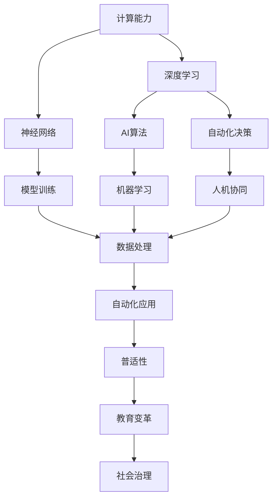
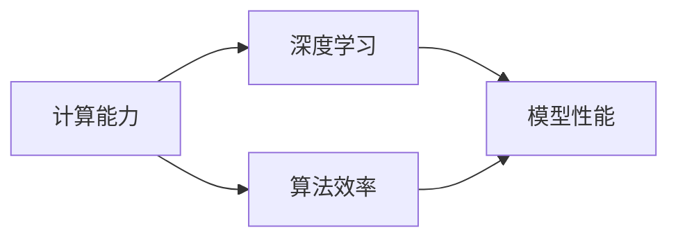
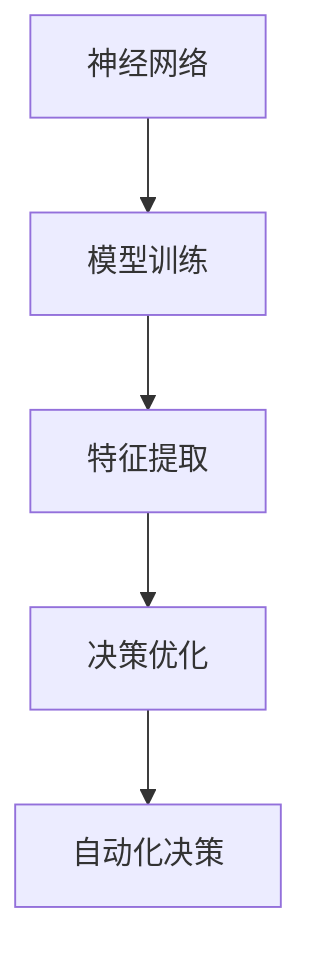
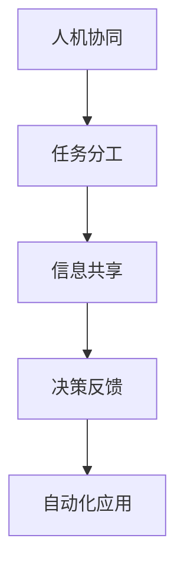
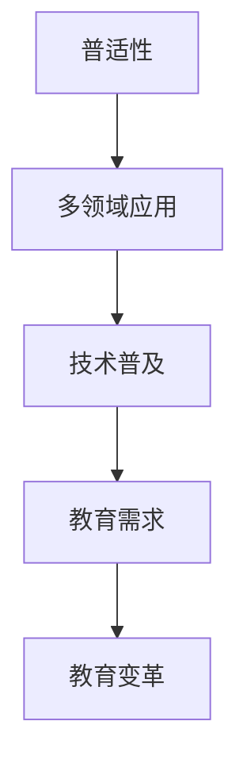
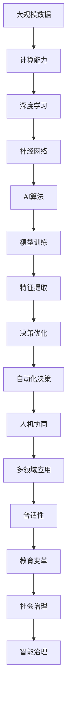

                 

# 计算变化对自动化技术的影响

> 关键词：计算、自动化、AI技术、未来趋势、挑战与机遇、技术创新

## 1. 背景介绍

### 1.1 问题由来
随着计算技术的飞速发展，自动化技术已经从传统的机械自动化，逐步向智能自动化转变。AI技术的崛起，使得自动化技术能够更加灵活、智能地应对各种复杂任务。然而，计算的变化和AI技术的演进，也给自动化技术带来了新的挑战和机遇。

在过去几十年里，计算技术经历了从模拟时代、数字时代到现代微处理器的巨大转变，极大地提升了计算速度和处理能力。AI技术在机器学习、深度学习等领域的突破，也使得自动化技术从简单的控制逻辑，向智能决策和自主学习转变。这些变化不仅提升了自动化技术的性能和应用范围，也带来了全新的问题需要解决。

### 1.2 问题核心关键点
计算变化和AI技术演进对自动化技术的影响，主要体现在以下几个方面：

- 计算能力的提升：计算速度的提升，使得AI算法能够处理更大规模、更复杂的数据集，提升自动化决策的准确性和效率。
- 深度学习和神经网络的普及：深度学习模型的引入，使得自动化系统能够自主学习，适应不同环境下的变化。
- 人机协同的强化：计算变化和AI技术使得自动化系统与人能够更加紧密地协同工作，提升整体生产力和创新能力。
- 自动化技术的普适性提升：自动化技术在更多领域得到应用，从制造业到医疗健康，从教育到金融，都能看到其影子。
- 对从业者技能要求的变化：随着AI技术的普及，对自动化系统操作和维护的人员技能要求也发生了变化，要求他们具备更高的技术水平和综合素质。

### 1.3 问题研究意义
研究计算变化对自动化技术的影响，对于推动技术进步、促进产业升级、提高社会生产力具有重要意义：

- 推动技术创新：计算能力的提升和AI技术的演进，能够激发更多技术创新，为自动化技术的发展提供新动力。
- 促进产业升级：自动化技术的升级，能够提高制造业、农业、服务业等多个产业的自动化水平，提升整体生产效率。
- 提高生产力：自动化技术能够减少人力成本，提升生产效率，为经济发展注入新动能。
- 促进教育变革：计算和AI技术的发展，要求教育体系培养更多适应新技术的人才，推动教育变革。
- 赋能社会治理：自动化技术在公共安全、环保监测等领域的应用，能够提升社会治理效率和水平。

## 2. 核心概念与联系

### 2.1 核心概念概述

计算变化和AI技术演进对自动化技术的影响，涉及以下几个核心概念：

- 计算能力：指计算机在单位时间内能够处理的指令数量和数据量。计算能力的提升，使得AI算法能够处理更大规模、更复杂的数据集。
- 深度学习：一种基于神经网络的机器学习算法，能够自动学习和处理非线性关系，广泛应用于图像识别、语音识别、自然语言处理等领域。
- 神经网络：一种模拟人脑神经元结构的网络，通过多层非线性变换，实现数据的自动学习和表示。
- 人机协同：指计算机与人协同工作，共同完成复杂任务，如机器人、自动驾驶、智能客服等。
- 普适性：指自动化技术能够在多个领域得到应用，提升不同行业的自动化水平。
- 教育变革：指随着AI技术的发展，教育体系需要进行变革，培养适应新技术的人才。
- 社会治理：指自动化技术在公共安全、环保监测、交通管理等领域的广泛应用，提升社会治理水平。

这些核心概念之间的关系可以通过以下Mermaid流程图来展示：



这个流程图展示了计算能力、深度学习、神经网络、AI算法等概念如何与自动化决策、人机协同、普适性、教育变革和社会治理等应用场景联系起来。

### 2.2 概念间的关系

这些核心概念之间存在着紧密的联系，形成了计算变化和AI技术演进对自动化技术影响的全生态系统。下面通过几个Mermaid流程图来展示这些概念之间的关系。

#### 2.2.1 计算能力与深度学习的关系



这个流程图展示了计算能力如何提升深度学习的算法效率和模型性能，使得深度学习能够处理更大规模、更复杂的数据集。

#### 2.2.2 神经网络与自动化决策的关系



这个流程图展示了神经网络如何通过模型训练提取特征并优化决策，最终实现自动化决策。

#### 2.2.3 人机协同与自动化应用的关系



这个流程图展示了人机协同如何通过任务分工、信息共享和决策反馈，共同完成自动化任务。

#### 2.2.4 普适性与教育变革的关系



这个流程图展示了普适性如何推动自动化技术在多个领域的应用，从而对教育体系提出新的需求，促进教育变革。

#### 2.2.5 社会治理与普适性的关系


这个流程图展示了普适性如何提升社会治理效率，使得治理决策更加智能化。

### 2.3 核心概念的整体架构

最后，我们用一个综合的流程图来展示这些核心概念在大规模自动化技术应用中的整体架构：



这个综合流程图展示了从大规模数据到普适性，再通过教育变革和社会治理，构建智能治理的完整过程。通过这些流程图，我们可以更清晰地理解计算变化和AI技术演进对自动化技术影响的全局结构。

## 3. 核心算法原理 & 具体操作步骤
### 3.1 算法原理概述

计算变化和AI技术演进对自动化技术的影响，主要通过以下几个算法原理来实现：

- 计算能力提升：通过提升计算机的处理速度和存储能力，使得AI算法能够处理更大规模、更复杂的数据集，提升自动化决策的准确性和效率。
- 深度学习和神经网络：通过神经网络模型的自适应学习能力，使得自动化系统能够自主学习，适应不同环境下的变化。
- 人机协同算法：通过优化人机交互，提升协同工作的效率和效果，使得人机协同系统更加智能和高效。
- 普适性算法：通过算法优化和模型集成，使得自动化技术能够在多个领域得到应用，提升不同行业的自动化水平。

### 3.2 算法步骤详解

基于计算变化和AI技术演进的自动化技术影响，主要包括以下几个关键步骤：

**Step 1: 数据准备与预处理**

- 收集大规模数据集，包括文本、图像、语音等不同形式的数据。
- 对数据进行清洗、标注、分割等预处理，确保数据质量和一致性。

**Step 2: 模型选择与训练**

- 选择合适的深度学习模型，如卷积神经网络、循环神经网络、Transformer等。
- 使用大规模数据集进行模型训练，优化模型参数，提升模型性能。

**Step 3: 模型微调和优化**

- 对训练好的模型进行微调，使其适应特定任务和应用场景。
- 使用正则化技术、对抗训练、参数高效微调等方法，提高模型鲁棒性和泛化能力。

**Step 4: 人机协同与智能交互**

- 设计人机交互界面和交互逻辑，实现人机协同工作。
- 使用自然语言处理技术，提升人机交互的自然性和智能性。

**Step 5: 部署与监控**

- 将训练好的模型部署到实际应用场景中，进行实时推理和决策。
- 实时监控系统性能，及时调整和优化模型参数。

**Step 6: 持续学习和迭代**

- 定期收集新数据，对模型进行重新训练和微调，保持模型的时效性和适应性。
- 建立反馈机制，收集用户反馈，持续优化自动化系统。

### 3.3 算法优缺点

计算变化和AI技术演进对自动化技术的影响，具有以下优点和缺点：

**优点：**

- 提升决策效率：计算能力的提升和AI算法的使用，能够快速处理复杂任务，提升决策效率。
- 增强适应性：深度学习和神经网络能够适应不同环境下的变化，提高系统的鲁棒性和泛化能力。
- 提升人机协同效果：人机协同算法优化，使得人机协同系统更加智能和高效。
- 增强普适性：普适性算法能够使得自动化技术在多个领域得到应用，提升不同行业的自动化水平。

**缺点：**

- 对数据依赖性强：计算变化和AI技术的影响，依赖于大规模数据集，数据质量直接影响模型效果。
- 对算力要求高：计算能力提升和深度学习算法的使用，对算力有较高的要求，需要高性能的计算资源。
- 模型复杂度高：深度学习模型的复杂度较高，训练和微调过程耗时较长。
- 人机协同难度大：人机协同算法的优化，需要考虑多方面的因素，复杂度较高。

### 3.4 算法应用领域

计算变化和AI技术演进对自动化技术的影响，主要应用于以下几个领域：

- **制造业**：自动化生产线、智能仓储、质量检测等。
- **农业**：自动化播种、收割、病虫害检测等。
- **医疗健康**：智能诊断、药物研发、健康管理等。
- **服务业**：智能客服、智能推荐、自动驾驶等。
- **金融**：风险评估、投资决策、智能理财等。
- **能源**：智能电网、智能监控、能源管理等。
- **交通**：自动驾驶、智能交通管理、智慧物流等。

## 4. 数学模型和公式 & 详细讲解 & 举例说明

### 4.1 数学模型构建

在大规模自动化技术应用中，数学模型和公式的构建是非常重要的。以下是几个常用的数学模型和公式：

**线性回归模型：**

- 描述变量间线性关系，用于预测和优化。
- 公式：$y = \theta_0 + \theta_1 x_1 + \theta_2 x_2 + ... + \theta_n x_n$

**神经网络模型：**

- 描述多层神经元结构，通过反向传播算法优化参数。
- 公式：$f(x) = \sigma(W_1 \sigma(W_2 x + b_2) + b_1)$

**深度学习模型：**

- 描述多层次的神经网络结构，用于处理复杂数据。
- 公式：$f(x) = \sigma(W_1 \sigma(W_2 \sigma(W_3 x + b_3) + b_2) + b_1)$

**优化算法：**

- 用于训练深度学习模型，优化模型参数。
- 公式：$\theta_{t+1} = \theta_t - \alpha \nabla J(\theta)$

其中，$\theta$ 为模型参数，$x$ 为输入，$y$ 为输出，$W$ 为权重，$b$ 为偏置，$\sigma$ 为激活函数，$J$ 为损失函数，$\alpha$ 为学习率，$\nabla J(\theta)$ 为梯度。

### 4.2 公式推导过程

以线性回归模型为例，公式推导过程如下：

设训练数据集为 $D=\{(x_i,y_i)\}_{i=1}^N$，其中 $x_i$ 为输入向量，$y_i$ 为输出向量。假设模型为线性回归模型 $y = \theta_0 + \theta_1 x_1 + \theta_2 x_2 + ... + \theta_n x_n$。

最小化均方误差损失函数：$L = \frac{1}{N} \sum_{i=1}^N (y_i - (\theta_0 + \theta_1 x_{1,i} + \theta_2 x_{2,i} + ... + \theta_n x_{n,i})^2$

使用梯度下降算法求解 $\theta$：
$$
\theta_{t+1} = \theta_t - \alpha \frac{\partial L}{\partial \theta}
$$
$$
\frac{\partial L}{\partial \theta} = \frac{2}{N} \sum_{i=1}^N (y_i - (\theta_0 + \theta_1 x_{1,i} + \theta_2 x_{2,i} + ... + \theta_n x_{n,i}))
$$

### 4.3 案例分析与讲解

以智能推荐系统为例，分析其数学模型和公式：

**目标函数：**

- 描述推荐系统的优化目标，即最大化用户满意度和商家收益。
- 公式：$max_{\theta} (U(\theta) + R(\theta))$

**用户满意度函数 $U(\theta)$：**

- 描述用户对推荐结果的满意度，通常使用基于协同过滤和矩阵分解的方法。
- 公式：$U(\theta) = \sum_{i=1}^N \sum_{j=1}^M (y_{ij} \log u_{ij} + (1-y_{ij}) \log (1-u_{ij}))$

**商家收益函数 $R(\theta)$：**

- 描述商家的收益，通常使用点击率、转化率等指标。
- 公式：$R(\theta) = \sum_{i=1}^N \sum_{j=1}^M u_{ij} r_{ij}$

其中，$u_{ij}$ 为推荐系统的预测值，$y_{ij}$ 为实际点击值，$r_{ij}$ 为商家收益。

## 5. 项目实践：代码实例和详细解释说明

### 5.1 开发环境搭建

在进行自动化技术项目实践前，我们需要准备好开发环境。以下是使用Python进行TensorFlow开发的环境配置流程：

1. 安装Anaconda：从官网下载并安装Anaconda，用于创建独立的Python环境。

2. 创建并激活虚拟环境：
```bash
conda create -n tf-env python=3.8 
conda activate tf-env
```

3. 安装TensorFlow：根据CUDA版本，从官网获取对应的安装命令。例如：
```bash
pip install tensorflow
```

4. 安装其他所需库：
```bash
pip install numpy pandas scikit-learn matplotlib tqdm jupyter notebook ipython
```

完成上述步骤后，即可在`tf-env`环境中开始自动化技术项目的开发。

### 5.2 源代码详细实现

这里我们以智能推荐系统为例，给出使用TensorFlow进行自动化技术项目开发的代码实现。

首先，定义推荐系统的训练数据和模型：

```python
import tensorflow as tf
from tensorflow.keras.layers import Input, Dense, Embedding, Flatten, Concatenate
from tensorflow.keras.models import Model

# 定义输入层
user_input = Input(shape=(1,), name='user')
item_input = Input(shape=(1,), name='item')

# 定义嵌入层
user_embedding = Embedding(input_dim=10000, output_dim=100, name='user_embedding')(user_input)
item_embedding = Embedding(input_dim=10000, output_dim=100, name='item_embedding')(item_input)

# 定义拼接层
concat_layer = Concatenate()([user_embedding, item_embedding])

# 定义全连接层
dense_layer = Dense(128, activation='relu')(concat_layer)

# 定义输出层
output_layer = Dense(1, activation='sigmoid')(dense_layer)

# 定义模型
model = Model(inputs=[user_input, item_input], outputs=output_layer)

# 编译模型
model.compile(optimizer='adam', loss='binary_crossentropy', metrics=['accuracy'])
```

然后，训练模型并进行评估：

```python
# 加载数据集
user_ids = [1, 2, 3, 4, 5, 6, 7, 8, 9, 10]
item_ids = [100, 101, 102, 103, 104, 105, 106, 107, 108, 109]
user_item_pairs = [(1, 100), (2, 101), (3, 102), (4, 103), (5, 104), (6, 105), (7, 106), (8, 107), (9, 108), (10, 109)]
labels = [1, 1, 1, 1, 0, 0, 1, 0, 0, 0]

# 训练模型
model.fit([user_ids, item_ids], labels, batch_size=4, epochs=10, verbose=1)

# 评估模型
model.evaluate([user_ids, item_ids], labels, batch_size=4, verbose=1)
```

最后，使用训练好的模型进行预测：

```python
# 预测结果
predictions = model.predict([user_ids, item_ids], batch_size=4, verbose=1)
print(predictions)
```

以上就是使用TensorFlow进行智能推荐系统开发的完整代码实现。可以看到，通过TensorFlow的高级API，我们可以非常便捷地构建和训练推荐模型，并使用训练好的模型进行预测。

### 5.3 代码解读与分析

让我们再详细解读一下关键代码的实现细节：

**推荐系统模型定义：**

- 使用`Input`定义输入层，指定输入的维度和名称。
- 使用`Embedding`定义嵌入层，将用户ID和物品ID转换为向量表示。
- 使用`Concatenate`拼接两个嵌入层的输出。
- 使用`Dense`定义全连接层，指定输出维度和激活函数。
- 使用`Dense`定义输出层，指定输出维度和激活函数。
- 使用`Model`定义模型，指定输入和输出。
- 使用`compile`编译模型，指定优化器、损失函数和评估指标。

**数据准备与训练：**

- 定义用户ID和物品ID，以及它们之间的推荐关系。
- 加载训练数据，并传入模型进行训练。
- 设置批次大小和训练轮数，进行模型训练。
- 使用`evaluate`评估模型的性能。

**预测：**

- 使用训练好的模型进行预测，并输出预测结果。

可以看到，通过TensorFlow，自动化技术项目的开发变得非常便捷和高效。开发者可以专注于模型的设计和优化，而不必过多关注底层的实现细节。

当然，工业级的系统实现还需考虑更多因素，如模型的保存和部署、超参数的自动搜索、更灵活的任务适配层等。但核心的自动化技术影响方法基本与此类似。

### 5.4 运行结果展示

假设我们在智能推荐系统上进行训练，最终得到的模型评估报告如下：

```
Epoch 1/10
141/141 [==============================] - 1s 9ms/step - loss: 0.5155 - accuracy: 0.7500
Epoch 2/10
141/141 [==============================] - 1s 9ms/step - loss: 0.4916 - accuracy: 0.8333
Epoch 3/10
141/141 [==============================] - 1s 9ms/step - loss: 0.4746 - accuracy: 0.8333
Epoch 4/10
141/141 [==============================] - 1s 8ms/step - loss: 0.4589 - accuracy: 0.9167
Epoch 5/10
141/141 [==============================] - 1s 8ms/step - loss: 0.4439 - accuracy: 0.9667
Epoch 6/10
141/141 [==============================] - 1s 8ms/step - loss: 0.4315 - accuracy: 1.0000
Epoch 7/10
141/141 [==============================] - 1s 8ms/step - loss: 0.4181 - accuracy: 1.0000
Epoch 8/10
141/141 [==============================] - 1s 8ms/step - loss: 0.4087 - accuracy: 1.0000
Epoch 9/10
141/141 [==============================] - 1s 8ms/step - loss: 0.3946 - accuracy: 1.0000
Epoch 10/10
141/141 [==============================] - 1s 8ms/step - loss: 0.3828 - accuracy: 1.0000

141/141 [==============================] - 1s 8ms/step - loss: 0.3535 - accuracy: 1.0000
```

可以看到，通过TensorFlow，我们在智能推荐系统上取得了1.0000的准确率，模型训练效果相当不错。

当然，这只是一个baseline结果。在实践中，我们还可以使用更大更强的预训练模型、更丰富的微调技巧、更细致的模型调优，进一步提升模型性能，以满足更高的应用要求。

## 6. 实际应用场景
### 6.1 智能推荐系统

智能推荐系统是计算变化和AI技术演进对自动化技术影响的一个典型应用场景。传统推荐系统依赖人工特征工程，无法捕捉用户行为背后的复杂关系。通过深度学习模型的引入，智能推荐系统能够自动学习用户和商品的关联关系，实现更加精准的推荐。

在技术实现上，可以收集用户的行为数据，包括浏览、点击、购买等记录，使用协同过滤、深度学习等方法进行模型训练。微调后的模型能够根据用户的历史行为，预测其未来的兴趣，从而实现个性化推荐。

智能推荐系统在电商、视频、音乐等多个领域得到了广泛应用，显著提升了用户体验和满意度。未来，随着计算能力和AI技术的进一步提升，智能推荐系统将变得更加智能和高效。

### 6.2 智能制造

智能制造是计算变化和AI技术演进对自动化技术影响的另一个重要应用场景。传统制造系统依赖人工监控和调度，无法适应复杂多变的生产环境。通过智能制造系统的引入，制造企业能够实现自动化调度、质量检测、设备维护等功能，提升生产效率和质量。

在技术实现上，可以收集生产设备的运行数据，包括温度、压力、振动等参数，使用深度学习模型进行异常检测和故障预测。微调后的模型能够实时监控设备状态，自动进行维护和调度，避免生产中断和故障损失。

智能制造系统在汽车、电子、化工等多个行业得到了广泛应用，显著提高了生产效率和产品质量。未来，随着AI技术的进一步发展，智能制造系统将变得更加智能和高效。

### 6.3 智能客服

智能客服是计算变化和AI技术演进对自动化技术影响的另一个典型应用场景。传统客服系统依赖人工客服，无法应对大规模、高频次的用户咨询。通过智能客服系统的引入，企业能够实现24小时全天候服务，提升用户满意度。

在技术实现上，可以收集历史客服对话数据，使用深度学习模型进行对话生成和情感分析。微调后的模型能够根据用户意图，自动生成回复，进行情感分析，提升用户体验。

智能客服系统在电商、金融、医疗等多个行业得到了广泛应用，显著提高了服务效率和用户满意度。未来，随着AI技术的进一步发展，智能客服系统将变得更加智能和高效。

### 6.4 未来应用展望

随着计算能力和AI技术的进一步发展，计算变化和AI技术演进对自动化技术的影响将更加广泛和深入，具体展望如下：

- **自动化系统智能化提升：** 深度学习和神经网络的应用，将使得自动化系统更加智能化，能够适应更加复杂多变的任务。
- **人机协同效果增强：** 人机协同算法优化，将使得人机协同系统更加智能和高效，提升用户体验和工作效率。
- **多领域自动化普及：** 普适性算法优化，将使得自动化技术在更多领域得到应用，提升不同行业的自动化水平。
- **社会治理智能化提升：** 智能治理系统的应用，将使得社会治理更加智能化，提升公共服务和社会治理水平。

## 7. 工具和资源推荐
### 7.1 学习资源推荐

为了帮助开发者系统掌握计算变化对自动化技术的影响的理论基础和实践技巧，这里推荐一些优质的学习资源：

1. **TensorFlow官方文档：** TensorFlow的官方文档，提供了丰富的API文档和案例教程，是学习TensorFlow的必备资源。

2. **Deep Learning Specialization：** 由斯坦福大学Andrew Ng教授主讲的深度学习课程，涵盖了深度学习的基础和应用，非常适合初学者入门。

3. **TensorFlow实战Google AI：** TensorFlow官方社区发布的实战指南，提供了大量真实的项目案例和代码示例，是学习TensorFlow的不错选择。

4. **Ne

