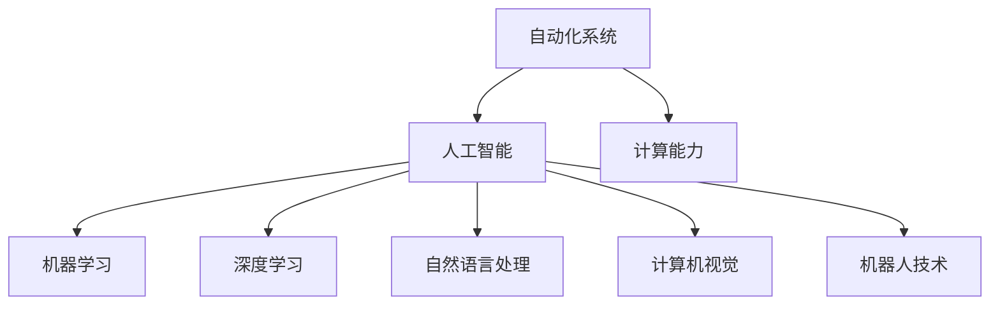

                 

# 计算变化带来的自动化新机遇

> 关键词：自动化,计算能力,人工智能,自动化技术,未来趋势

## 1. 背景介绍

### 1.1 问题由来

随着计算能力的飞速发展，特别是高性能计算机和云计算的普及，自动化技术正在迅速崛起。各行各业都在探索如何利用自动化技术提高效率、降低成本、提升竞争力。自动化技术的本质是通过计算能力实现任务自动化，从而解放人力，让机器去处理重复性和规律性的工作。

自动化技术在传统工业领域已经得到了广泛应用，如机器人自动化、生产线自动化、智能制造等。这些应用使得生产效率显著提升，产品质量更加稳定，企业运营成本大幅降低。

然而，在软件开发、数据分析、金融分析、医疗诊断等知识密集型行业，自动化技术的应用还相对较少。这些领域的技术复杂度高，数据量庞大，对计算资源的需求也更高。如何利用计算能力实现这些领域的自动化，成为新的技术挑战和研究热点。

### 1.2 问题核心关键点

自动化技术的应用涉及以下几个关键点：

- 计算能力：计算能力是自动化技术的基础，提供底层支撑。
- 算法设计：好的算法能够高效地处理大量数据，识别复杂模式。
- 数据采集：获取高质量的数据是自动化技术成功的关键。
- 集成部署：将自动化技术与现有系统集成，实现无缝衔接。
- 持续优化：自动化技术需要不断迭代优化，适应环境变化。

### 1.3 问题研究意义

自动化技术的应用不仅能提高企业的运营效率，还能带来深远的社会效益：

1. 提高生产效率：自动化技术可以处理重复性、高负荷的工作，减少人工错误，提高生产效率。
2. 降低运营成本：自动化技术减少了人工成本和生产成本，降低了运营费用。
3. 提升产品质量：自动化技术可以保证一致性和精度，提升产品质量。
4. 支持决策分析：自动化技术能够快速处理大量数据，提供决策支持，提高决策准确性。
5. 推动技术创新：自动化技术加速了技术的迭代和升级，促进技术进步。
6. 赋能产业升级：自动化技术为传统行业带来了新的技术和应用模式，推动产业升级。

## 2. 核心概念与联系

### 2.1 核心概念概述

自动化技术主要涉及以下几个核心概念：

- 自动化系统：通过计算能力实现任务自动化的系统，可以是软件、硬件或两者的结合。
- 人工智能(AI)：利用算法实现自主学习和决策，从而实现更高层次的自动化。
- 机器学习(ML)：通过数据训练模型，自动优化算法，实现自动化任务。
- 深度学习(Deep Learning)：一种特殊形式的机器学习，使用神经网络处理高维非线性数据。
- 自然语言处理(NLP)：利用算法处理和理解自然语言数据，实现自动化任务。
- 计算机视觉(CV)：利用算法处理和分析图像、视频数据，实现自动化任务。
- 机器人技术：结合机械、电子、计算机等多学科技术，实现自动化任务。

这些概念之间有紧密的联系，共同构成了自动化技术的基础架构：



### 2.2 概念间的关系

这些概念之间有复杂的关联，形成了一个多层次的自动化技术架构：

1. 计算能力是基础，提供了自动化系统的底层支撑。
2. 人工智能通过算法实现自主学习，是自动化技术的高层次应用。
3. 机器学习和深度学习是实现人工智能的重要手段，提供了自动化算法模型。
4. 自然语言处理和计算机视觉是处理特定类型数据的重要技术，提供了自动化的数据处理和分析能力。
5. 机器人技术是将自动化技术应用于物理世界的有力工具，提供了自动化的执行能力。

## 3. 核心算法原理 & 具体操作步骤
### 3.1 算法原理概述

自动化技术的核心算法原理主要包括：

- 监督学习：利用标注数据训练模型，自动识别模式，进行分类、预测等任务。
- 无监督学习：从非标注数据中自动提取特征，自动识别模式，进行聚类、降维等任务。
- 强化学习：通过与环境的互动，利用奖励信号训练模型，实现最优策略选择。
- 迁移学习：利用已有模型的知识，快速适应新任务，提升模型性能。
- 参数高效微调：在固定大部分模型参数的情况下，只更新少量参数，提高模型效率。
- 数据增强：通过变换、旋转、镜像等方法扩充训练数据，提升模型泛化能力。
- 对抗训练：引入对抗样本，提高模型鲁棒性，避免过拟合。
- 分布式训练：利用多台计算资源，加速模型训练，提升效率。

### 3.2 算法步骤详解

自动化技术的实现流程主要包括以下几个步骤：

**Step 1: 数据收集与预处理**
- 收集需要自动化的任务数据，如生产数据、市场数据、业务数据等。
- 对数据进行清洗、归一化、转换等预处理操作，使其满足模型的输入要求。

**Step 2: 模型选择与训练**
- 根据任务需求选择合适的算法模型，如监督学习、无监督学习、深度学习等。
- 利用预处理后的数据，使用训练集训练模型，优化模型参数。
- 使用验证集评估模型性能，调整模型参数，确保模型泛化能力。

**Step 3: 模型评估与优化**
- 在测试集上评估模型性能，判断模型效果是否达到预期。
- 根据评估结果，优化模型参数，提高模型性能。
- 利用数据增强、对抗训练等技术，提高模型鲁棒性。

**Step 4: 模型部署与应用**
- 将训练好的模型部署到生产环境中，进行实时数据处理。
- 对处理结果进行后处理操作，如数据可视化、决策支持等。
- 持续监控模型性能，根据新数据进行模型更新，保持模型持续优化。

### 3.3 算法优缺点

自动化技术的算法原理具有以下优点：

- 自动化处理：通过算法自动处理大量数据，提高处理效率。
- 算法优化：算法模型可以不断优化，提升处理效果。
- 泛化能力强：算法模型具有较好的泛化能力，可以处理复杂数据。
- 可解释性高：算法模型具有较高的可解释性，便于理解与调试。

同时，算法原理也存在一些缺点：

- 数据依赖：算法模型的性能依赖于数据的质量和数量，数据不足时难以取得理想效果。
- 算法复杂：部分算法模型较为复杂，需要较高的计算资源和时间。
- 应用场景限制：部分算法模型只适用于特定类型的任务，应用范围有限。
- 模型可解释性：部分算法模型存在"黑盒"问题，难以解释内部决策过程。

### 3.4 算法应用领域

自动化技术在各个领域都有广泛的应用：

- 制造业：通过机器人自动化生产线，实现智能制造，提高生产效率。
- 金融业：利用算法模型进行风险评估、欺诈检测、股票预测等。
- 医疗行业：利用算法模型进行疾病诊断、医疗影像分析、个性化治疗等。
- 物流行业：利用算法模型进行路径规划、仓储管理、配送优化等。
- 零售行业：利用算法模型进行市场分析、客户推荐、销售预测等。
- 教育行业：利用算法模型进行个性化学习、知识图谱构建、教育资源推荐等。
- 农业行业：利用算法模型进行病虫害检测、精准农业、农业机械自动化等。

## 4. 数学模型和公式 & 详细讲解
### 4.1 数学模型构建

自动化技术中的数学模型主要包括以下几个方面：

- 线性回归模型：用于建立输入与输出的线性关系，进行预测和回归分析。
- 决策树模型：用于分类和回归，通过树形结构表示决策过程。
- 支持向量机模型：用于分类和回归，通过寻找最优超平面进行分类。
- 随机森林模型：用于分类和回归，通过集成多个决策树提高模型泛化能力。
- 神经网络模型：用于处理高维数据，进行分类、回归、生成等任务。
- 卷积神经网络模型：用于图像处理和计算机视觉任务。
- 循环神经网络模型：用于序列数据处理和自然语言处理任务。

### 4.2 公式推导过程

以下以线性回归模型为例，推导其基本公式和推导过程。

线性回归模型的目标是最小化预测值与真实值之间的平方误差：

$$
\min_{\theta} \frac{1}{2m} \sum_{i=1}^m(y^{(i)}-\theta^T\mathbf{x}^{(i)})^2
$$

其中，$\theta$ 为模型参数，$\mathbf{x}^{(i)}$ 为输入数据，$y^{(i)}$ 为真实标签，$m$ 为样本数量。

根据最小二乘法，求解上述最优化问题的解析解为：

$$
\theta = (\mathbf{X}^T\mathbf{X})^{-1}\mathbf{X}^T\mathbf{y}
$$

其中，$\mathbf{X}$ 为输入数据的矩阵形式，$\mathbf{y}$ 为真实标签的向量形式。

该公式展示了线性回归模型的基本推导过程，其关键在于求解最小二乘解，以最小化预测误差。通过不断迭代求解，可以获得最优的模型参数 $\theta$。

### 4.3 案例分析与讲解

以金融欺诈检测为例，展示自动化技术的应用：

假设我们有一批金融交易数据，包括用户ID、交易金额、交易时间等特征。我们的目标是识别出可疑交易，防止欺诈行为。

首先，对数据进行预处理，去除缺失值、异常值等，转换为模型所需格式。然后，使用线性回归模型进行训练，得到预测模型：

$$
y = \theta^T\mathbf{x} + \epsilon
$$

其中，$y$ 为预测标签，$\mathbf{x}$ 为输入特征向量，$\theta$ 为模型参数，$\epsilon$ 为误差项。

在训练完成后，我们将新交易数据输入模型，得到预测标签，并根据阈值判断是否为欺诈交易。通过不断迭代优化模型参数，可以提高模型的预测准确率，实现自动化欺诈检测。

## 5. 项目实践：代码实例和详细解释说明
### 5.1 开发环境搭建

在进行自动化项目实践前，我们需要准备好开发环境。以下是使用Python进行自动化开发的环境配置流程：

1. 安装Python：从官网下载并安装Python，建议安装最新版本。
2. 安装Pip：从官网下载并安装Pip，用于安装和管理Python包。
3. 安装依赖包：安装必要的依赖包，如NumPy、SciPy、Matplotlib等。

```bash
pip install numpy scipy matplotlib
```

4. 安装自动化框架：安装自动化框架，如TensorFlow、PyTorch、scikit-learn等，选择适合的框架进行开发。

```bash
pip install tensorflow pytorch scikit-learn
```

5. 安装数据处理库：安装数据处理库，如Pandas、NumPy、Scikit-learn等，用于数据预处理和特征工程。

```bash
pip install pandas numpy scikit-learn
```

完成上述步骤后，即可在Python环境中开始自动化项目实践。

### 5.2 源代码详细实现

这里我们以自动化图像识别为例，展示TensorFlow和Keras框架的实现代码。

首先，定义模型：

```python
from tensorflow.keras.models import Sequential
from tensorflow.keras.layers import Conv2D, MaxPooling2D, Flatten, Dense

model = Sequential()
model.add(Conv2D(32, (3, 3), activation='relu', input_shape=(28, 28, 1)))
model.add(MaxPooling2D((2, 2)))
model.add(Conv2D(64, (3, 3), activation='relu'))
model.add(MaxPooling2D((2, 2)))
model.add(Flatten())
model.add(Dense(128, activation='relu'))
model.add(Dense(10, activation='softmax'))

model.compile(optimizer='adam', loss='categorical_crossentropy', metrics=['accuracy'])
```

然后，加载数据：

```python
import numpy as np
import os

train_data = []
train_labels = []
for filename in os.listdir('train'):
    data = np.load(os.path.join('train', filename))
    train_data.append(data)
    train_labels.append(np.argmax(data))
train_data = np.array(train_data)
train_labels = np.array(train_labels)
```

接着，训练模型：

```python
model.fit(train_data, train_labels, epochs=10, batch_size=32)
```

最后，进行测试：

```python
test_data = np.load(os.path.join('test', filename))
test_labels = np.argmax(test_data)
print(model.predict(test_data), test_labels)
```

以上就是使用TensorFlow和Keras框架进行图像识别的完整代码实现。可以看到，TensorFlow和Keras框架提供了强大的模型定义和训练功能，使得自动化项目开发更加高效便捷。

### 5.3 代码解读与分析

让我们再详细解读一下关键代码的实现细节：

**定义模型**：
- `Sequential`类：定义一个线性堆叠的神经网络模型。
- `Conv2D`层：定义卷积层，用于处理图像数据。
- `MaxPooling2D`层：定义池化层，用于降维和特征提取。
- `Flatten`层：定义扁平化层，将多维数据转换为一维数据。
- `Dense`层：定义全连接层，用于输出分类结果。

**加载数据**：
- `os.listdir`函数：列出指定目录下的所有文件名。
- `np.load`函数：从文件中加载数据。
- `np.argmax`函数：获取数组中最大值的索引。

**训练模型**：
- `model.fit`方法：进行模型训练，指定训练数据、标签、轮数和批次大小。

**进行测试**：
- `model.predict`方法：进行模型预测，输入测试数据，输出预测结果。

可以看到，TensorFlow和Keras框架的代码实现相对简洁，且易于理解。开发者可以更加专注于模型设计和算法优化，而不需要过多关注底层实现细节。

## 6. 实际应用场景

### 6.1 制造业自动化

在制造业中，自动化技术可以广泛应用于生产线自动化、设备维护、质量检测等环节，实现智能制造。通过部署自动化系统，可以大幅提升生产效率，降低生产成本，提高产品质量。

以汽车制造业为例，通过自动化系统对生产线进行监控和调度，可以实现设备自动上下料、组装自动化、质量检测自动化等，使得生产过程更加高效、稳定。

### 6.2 金融业自动化

在金融业中，自动化技术可以应用于风险评估、欺诈检测、投资分析等环节，提高金融服务的智能化水平。通过自动化系统，可以实时处理大量金融数据，进行风险评估和欺诈检测，提升金融服务的准确性和效率。

以银行风控为例，通过自动化系统对客户交易数据进行分析，可以实时识别出可疑交易，防止欺诈行为，保障客户资金安全。

### 6.3 医疗行业自动化

在医疗行业中，自动化技术可以应用于疾病诊断、医疗影像分析、医疗文书处理等环节，提升医疗服务的智能化水平。通过自动化系统，可以实现智能诊断、影像处理、医疗文书生成等，提高医疗服务的效率和质量。

以智能诊断为例，通过自动化系统对患者影像数据进行分析，可以自动识别出病变区域，提供疾病诊断建议，辅助医生进行决策。

## 7. 工具和资源推荐

### 7.1 学习资源推荐

为了帮助开发者系统掌握自动化技术的相关知识，这里推荐一些优质的学习资源：

1. 《机器学习实战》书籍：全面介绍了机器学习的基本概念和实现方法，适合入门学习。
2. 《深度学习入门》课程：由斯坦福大学开设的深度学习课程，系统讲解深度学习的基本原理和应用实例。
3. 《TensorFlow官方文档》：TensorFlow的官方文档，包含丰富的教程和示例代码，适合学习和实践。
4. 《Keras官方文档》：Keras的官方文档，包含丰富的教程和示例代码，适合学习和实践。
5. 《PyTorch官方文档》：PyTorch的官方文档，包含丰富的教程和示例代码，适合学习和实践。
6. 《Python数据分析实战》课程：由数据科学家开设的Python数据分析课程，包含丰富的案例和实践项目，适合学习和应用。

通过对这些资源的学习实践，相信你一定能够快速掌握自动化技术的精髓，并用于解决实际的业务问题。

### 7.2 开发工具推荐

高效的开发离不开优秀的工具支持。以下是几款用于自动化项目开发的常用工具：

1. TensorFlow：由Google主导开发的深度学习框架，适合大规模分布式训练。
2. Keras：基于TensorFlow的高级深度学习框架，提供简单易用的API接口，适合快速原型开发。
3. PyTorch：由Facebook主导开发的深度学习框架，适合动态图计算，适合研究和实验。
4. Scikit-learn：Python数据分析和机器学习库，包含丰富的机器学习算法和工具，适合快速原型开发。
5. Pandas：Python数据分析库，适合数据处理和特征工程，适合数据预处理和分析。
6. NumPy：Python数值计算库，适合高效矩阵运算，适合数值计算和模型训练。
7. Jupyter Notebook：Python交互式笔记本，适合快速原型开发和数据探索。

合理利用这些工具，可以显著提升自动化项目的开发效率，加快创新迭代的步伐。

### 7.3 相关论文推荐

自动化技术的研究源于学界的持续研究。以下是几篇奠基性的相关论文，推荐阅读：

1. A Survey of Optimisation Algorithms for the Hyperparameter Optimisation of Deep Learning（深度学习超参数优化综述）：介绍了深度学习中常用的超参数优化算法。
2. Automated Machine Learning: Methods, Systems, Challenges（自动化机器学习：方法、系统、挑战）：介绍了自动化机器学习的基本概念和研究现状。
3. Deep Learning with Feedback Loops（带反馈循环的深度学习）：介绍了带反馈循环的深度学习模型及其应用。
4. Automation of Machine Learning Algorithms using Feature-Independent Optimization（基于特征独立优化的机器学习算法自动化）：介绍了机器学习算法的自动化优化方法。
5. Neural Architecture Search: A Comprehensive Survey（神经网络架构搜索综述）：介绍了神经网络架构搜索的基本原理和应用实例。

这些论文代表了大规模自动化技术的研究方向，通过学习这些前沿成果，可以帮助研究者把握学科前进方向，激发更多的创新灵感。

除上述资源外，还有一些值得关注的前沿资源，帮助开发者紧跟自动化技术的发展趋势，例如：

1. arXiv论文预印本：人工智能领域最新研究成果的发布平台，包括大量尚未发表的前沿工作，学习前沿技术的必读资源。
2. 业界技术博客：如TensorFlow、Keras、PyTorch等顶尖框架的官方博客，第一时间分享他们的最新研究成果和洞见。
3. 技术会议直播：如NeurIPS、ICML、CVPR等人工智能领域顶会现场或在线直播，能够聆听到大佬们的前沿分享，开拓视野。
4. GitHub热门项目：在GitHub上Star、Fork数最多的自动化相关项目，往往代表了该技术领域的发展趋势和最佳实践，值得去学习和贡献。
5. 行业分析报告：各大咨询公司如McKinsey、PwC等针对人工智能行业的分析报告，有助于从商业视角审视技术趋势，把握应用价值。

总之，对于自动化技术的学习和实践，需要开发者保持开放的心态和持续学习的意愿。多关注前沿资讯，多动手实践，多思考总结，必将收获满满的成长收益。

## 8. 总结：未来发展趋势与挑战

### 8.1 总结

本文对自动化技术的发展进行了全面系统的介绍。首先阐述了自动化技术的背景和意义，明确了其在提高生产效率、降低成本、提升服务质量等方面的重要作用。其次，从原理到实践，详细讲解了自动化技术的算法原理和关键步骤，给出了自动化项目开发的完整代码实例。同时，本文还广泛探讨了自动化技术在制造业、金融业、医疗行业等领域的广泛应用前景，展示了自动化技术的巨大潜力。最后，本文精选了自动化技术的各类学习资源，力求为读者提供全方位的技术指引。

通过本文的系统梳理，可以看到，自动化技术正在成为各行各业的重要支撑，极大地推动了生产力和服务质量的提升。未来，随着计算能力的不断提升和算法的不断进步，自动化技术将在更多领域得到广泛应用，为各行各业带来深远的变革性影响。

### 8.2 未来发展趋势

展望未来，自动化技术的发展将呈现以下几个趋势：

1. 人工智能与自动化结合：自动化技术将与人工智能紧密结合，实现更高级别的智能化，推动各行业向智能化方向发展。
2. 自动化技术普及：随着技术的发展，自动化技术将逐步普及到更多行业，改变传统业务模式，提升效率和质量。
3. 人机协同工作：自动化技术将与人类协作，共同完成复杂任务，提高工作效率，降低出错率。
4. 自动化工具的丰富化：随着工具的不断进步，自动化工具将更加智能化、高效化，操作更加简便，使用更加广泛。
5. 自动化技术标准化：随着标准的不断完善，自动化技术将逐步标准化，促进不同系统之间的互操作性。
6. 自动化技术与物联网结合：物联网技术将与自动化技术结合，实现智能制造、智慧城市等新应用，推动技术进步。

这些趋势凸显了自动化技术的发展前景，自动化技术必将为各行各业带来深远的变革性影响，推动人类社会的进步。

### 8.3 面临的挑战

尽管自动化技术已经取得了瞩目成就，但在迈向更加智能化、普适化应用的过程中，它仍面临着诸多挑战：

1. 技术复杂度高：自动化技术的实施需要高技术门槛，特别是在数据处理、模型优化等方面。
2. 数据依赖性强：自动化技术对数据的质量和数量要求高，数据不足时难以取得理想效果。
3. 应用场景复杂：不同行业的应用场景差异大，自动化技术需要适配不同场景，实现精准应用。
4. 算法优化困难：自动化算法的优化需要大量实验和调试，技术难度大。
5. 安全性和隐私问题：自动化技术的应用涉及大量敏感数据，需要确保数据安全和隐私保护。
6. 技术标准化问题：自动化技术的标准化问题尚未解决，不同系统之间的互操作性不足。

### 8.4 研究展望

面对自动化技术面临的挑战，未来的研究需要在以下几个方面寻求新的突破：

1. 提高数据质量：采用更先进的数据采集和处理技术，提高数据质量，减少数据偏差。
2. 优化算法模型：开发更高效、更准确的自动化算法模型，提升模型泛化能力和鲁棒性。
3. 实现标准化：推动自动化技术标准化，促进不同系统之间的互操作性，实现资源共享和协同应用。
4. 引入先进技术：引入先进技术，如区块链、量子计算等，提高自动化系统的安全性和隐私保护能力。
5. 探索新应用：探索自动化技术在更多领域的应用，推动技术进步和行业升级。

这些研究方向的探索，必将引领自动化技术迈向更高的台阶，为各行各业带来深远的变革性影响。面向未来，自动化技术还需要与其他人工智能技术进行更深入的融合，如深度学习、自然语言处理、计算机视觉等，多路径协同发力，共同推动智能技术的进步。

## 9. 附录：常见问题与解答

**Q1: 自动化技术在工业领域的应用有哪些？**

A: 自动化技术在工业领域的应用非常广泛，主要包括以下几个方面：

1. 生产线自动化：通过自动化机器人、自动化设备等，实现生产线自动化，提高生产效率，降低生产成本。
2. 设备维护自动化：通过自动化传感器、自动化监测系统等，实现设备状态监测和预测维护，降低设备故障率，延长设备寿命。
3. 质量检测自动化：通过自动化检测设备、自动化质量管理系统等，实现质量检测自动化，提高产品质量，降低人工检测成本。
4. 库存管理自动化：通过自动化库存管理系统、自动化仓储设备等，实现库存管理自动化，提高库存利用率，降低库存成本。

**Q2: 自动化技术在制造业中的应用有哪些？**

A: 自动化技术在制造业中的应用主要包括以下几个方面：

1. 智能制造：通过自动化系统对生产线进行优化，实现智能制造，提高生产效率，降低生产成本。
2. 柔性生产：通过自动化系统对生产线和设备进行灵活调整，实现柔性生产，提高生产灵活性和适应性。
3. 供应链管理：通过自动化系统对供应链进行管理，实现自动化采购、自动化库存、自动化配送等，提高供应链管理效率，降低供应链成本。
4. 质量控制：通过自动化系统对产品质量进行检测和控制，实现质量控制自动化，提高产品质量，降低质量成本。
5. 设备维护：通过自动化系统对设备进行状态监测和预测维护，实现设备维护自动化，提高设备运行效率，降低设备故障率。

**Q3: 自动化技术在金融行业中的应用有哪些？**

A: 自动化技术在金融行业中的应用主要包括以下几个方面：

1. 风险评估：通过自动化系统对客户数据进行分析和处理，实现风险评估自动化，提高风险评估准确性，降低风险成本。
2. 欺诈检测：通过自动化系统对交易数据进行分析和处理，实现欺诈检测自动化，提高欺诈检测准确性，降低欺诈损失。
3. 投资分析：通过自动化系统对市场数据进行分析和处理，实现投资分析自动化，提高投资决策准确性，降低投资成本。
4. 客户服务：通过自动化系统对客户数据进行分析和处理，实现客户服务自动化，提高客户服务效率，降低客户服务成本。
5. 智能投顾：通过自动化系统对客户数据进行分析和处理，实现智能投顾自动化，提供个性化投资建议，提高客户满意度，降低投资风险。

**Q4: 自动化技术在医疗行业中的应用有哪些？**

A: 自动化技术在医疗行业中的应用主要包括以下几个方面：

1. 疾病诊断：通过自动化系统

