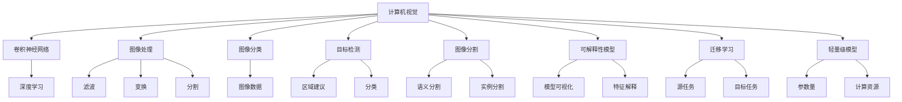
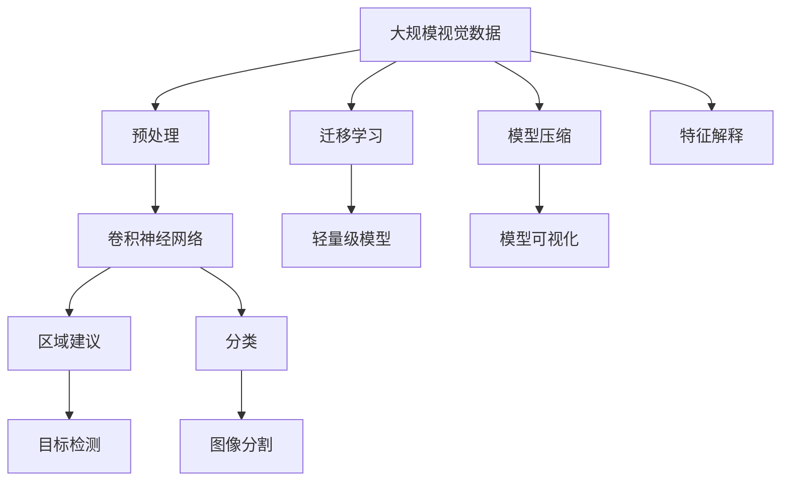

                 

# 计算机视觉 原理与代码实例讲解

> 关键词：计算机视觉,深度学习,卷积神经网络,图像处理,物体检测,图像分割,图像分类

## 1. 背景介绍

### 1.1 问题由来
计算机视觉(CV)作为人工智能的一个重要分支，其核心任务是从视觉信号（如图像、视频）中提取出有用的信息，并加以理解和应用。这包括了图像分类、目标检测、语义分割、姿态估计等多个方向。传统的计算机视觉研究大多基于手动提取的特征进行模式识别，随着深度学习技术的发展，基于神经网络的端到端学习范式成为主流。

近年来，计算机视觉领域取得了显著进展，其中以卷积神经网络(CNN)为代表的深度学习模型在图像处理、目标检测等方面展现出强大的能力。然而，深度学习模型在实际应用中，仍面临诸如计算资源消耗大、模型解释性差、训练成本高、可迁移性不足等问题。如何在保证性能的前提下，提高模型的效率、可解释性及适应性，成为CV领域的核心挑战。

### 1.2 问题核心关键点
计算机视觉的核心在于将高维的视觉信号转化为结构化的信息。现有的大多数CV模型都依赖于卷积神经网络，通过在图像数据上端到端训练获得目标识别、分割、跟踪等能力。但这些模型往往存在参数多、复杂度高、泛化能力有限等缺点。

针对这些问题，当前CV研究主要集中在以下几个方向：
1. 轻量级模型：降低模型复杂度，减少计算资源消耗。
2. 模型压缩：压缩模型参数和大小，提高模型效率。
3. 可解释性模型：提高模型的可解释性，便于调试和优化。
4. 迁移学习：使模型具备更强的泛化能力，适用于多种场景。
5. 模型自适应：使模型能够动态适应不同场景的视觉信号，提高应用灵活性。

### 1.3 问题研究意义
计算机视觉技术的应用范围非常广泛，涵盖了无人驾驶、医疗影像分析、智能安防、零售商超等多个领域。随着技术不断发展，CV技术能够处理更为复杂的视觉任务，从而提升行业智能化水平，创造巨大的经济价值。

## 2. 核心概念与联系

### 2.1 核心概念概述

为更好地理解计算机视觉的基本原理，本节将介绍几个密切相关的核心概念：

- 计算机视觉(Computer Vision)：指通过计算机技术对图像和视频进行处理，从而获得有用的结构化信息。CV技术广泛用于图像识别、目标检测、语义分割、动作识别等领域。

- 卷积神经网络(Convolutional Neural Networks, CNNs)：一种特殊的深度神经网络，利用卷积、池化等操作提取图像中的空间特征。CNNs在CV任务中表现优异，已经成为现代CV技术的核心。

- 图像处理(Image Processing)：指通过一系列算法和操作，改善图像的视觉效果，提高图像的信息量和可理解性。常见的图像处理技术包括滤波、变换、分割等。

- 图像分类(Image Classification)：指将图像分为预设的类别，是CV任务中最基本也是最基础的子任务。分类模型通常使用CNNs实现，通过训练得到输入图像与类别的映射关系。

- 目标检测(Object Detection)：指在图像中定位出物体的位置，并给出物体的类别。目标检测模型通常包括两个步骤：区域建议和分类。R-CNN、Faster R-CNN、YOLO等模型是其代表。

- 图像分割(Image Segmentation)：指将图像划分为多个部分，每个部分对应特定的类别。语义分割和实例分割是其中的两种主要类型，常用的模型包括FCN、U-Net、Mask R-CNN等。

- 可解释性模型(Interpretable Models)：指能够提供模型预测结果的直观解释，如模型可视化和特征解释。这有助于开发者更好地理解模型的决策过程，进行调试和优化。

- 迁移学习(Transfer Learning)：指将一个领域学习到的知识，迁移应用到另一个不同但相关的领域。通过迁移学习，CV模型能够在新的数据集上快速适应，提升性能。

- 轻量级模型(Lightweight Models)：指参数量少、计算资源消耗低的模型。轻量级模型可以提高推理速度，适应低计算资源的设备。

### 2.2 概念间的关系

这些核心概念之间存在着紧密的联系，形成了计算机视觉的整体框架。通过以下Mermaid流程图，我们可以更清晰地理解这些概念之间的关系：



这个流程图展示了计算机视觉的多个子任务及其与核心概念的关系：

1. 计算机视觉通过卷积神经网络等深度学习模型实现。
2. 图像处理、图像分类、目标检测、图像分割等CV子任务，均基于图像数据。
3. 图像分类、目标检测和图像分割模型，通常需要经过区域建议和分类两步。
4. 模型可视化、特征解释等技术，用于提高模型的可解释性。
5. 迁移学习、轻量级模型等技术，用于提高模型的泛化能力和适应性。

### 2.3 核心概念的整体架构

最后，我们用一个综合的流程图来展示这些核心概念在大规模视觉数据处理中的应用：



这个综合流程图展示了从大规模视觉数据预处理到最终输出的完整过程。大规模视觉数据首先进行预处理，接着通过卷积神经网络提取特征，最后进行区域建议、分类等操作，并利用迁移学习、轻量级模型等技术进一步优化模型性能，同时通过模型可视化和特征解释提升模型可解释性。

## 3. 核心算法原理 & 具体操作步骤
### 3.1 算法原理概述

计算机视觉的核心算法原理主要基于卷积神经网络，通过卷积操作提取图像的空间特征，通过池化操作减小特征图尺寸，通过全连接层进行分类或回归等任务。深度学习模型的核心优势在于通过端到端学习，自动提取数据的高层次特征。

以图像分类任务为例，模型接收输入图像 $X \in \mathbb{R}^{H \times W \times C}$，其中 $H$ 和 $W$ 分别为图像的高度和宽度，$C$ 为通道数。卷积层通过滤波器 $F$ 对图像进行卷积操作，生成特征图 $X^1 \in \mathbb{R}^{H' \times W' \times K}$，其中 $H'$ 和 $W'$ 分别为特征图尺寸，$K$ 为滤波器数目。池化层将特征图尺寸缩小为 $H'' \times W''$，通常采用最大池化或平均池化等操作。全连接层将池化层输出的特征图展开成一维向量 $V \in \mathbb{R}^{N}$，其中 $N$ 为全连接层的输出维度，最后经过softmax函数输出图像的类别概率分布 $P \in \mathbb{R}^{K}$，其中 $K$ 为类别数。

卷积神经网络的训练过程包括前向传播和反向传播两个步骤。前向传播计算损失函数，反向传播计算梯度并更新模型参数。常用的损失函数包括交叉熵损失、均方误差损失等。

### 3.2 算法步骤详解

以下是计算机视觉任务（以图像分类为例）的详细步骤：

**Step 1: 数据准备**
- 收集并准备图像数据集 $D=\{(x_i, y_i)\}_{i=1}^N$，其中 $x_i$ 表示第 $i$ 张图像，$y_i$ 表示其类别标签。

**Step 2: 数据预处理**
- 将图像缩放到固定尺寸，并进行归一化处理。
- 随机生成训练集和验证集的划分比例。

**Step 3: 模型构建**
- 设计卷积神经网络结构，包括卷积层、池化层、全连接层等。
- 确定优化器及其参数，如AdamW、SGD等，设置学习率、批大小等。

**Step 4: 模型训练**
- 使用PyTorch、TensorFlow等深度学习框架搭建和训练模型。
- 迭代训练数据集，前向传播计算损失，反向传播计算梯度并更新参数。
- 周期性在验证集上评估模型性能，避免过拟合。

**Step 5: 模型评估与部署**
- 在测试集上评估模型性能，输出准确率、精度等指标。
- 将模型导出并部署到生产环境，进行实时推理。
- 定期收集新数据，进行模型更新和重新训练。

### 3.3 算法优缺点

计算机视觉中基于卷积神经网络的深度学习模型具有以下优点：

1. 强大的特征提取能力：卷积层可以自动提取图像的空间特征，无需手动设计特征提取器。
2. 端到端学习：模型能够自动学习图像数据的内在表示，无需手动设计中间层。
3. 泛化能力强：深度模型能够自动学习到高层次的抽象特征，适用于多种CV任务。

同时，这些模型也存在一些缺点：

1. 参数量大：深度学习模型通常需要大量的参数进行训练，计算资源消耗大。
2. 训练时间长：大模型的训练时间往往较长，对计算资源和算法优化要求较高。
3. 可解释性差：深度模型通常是"黑盒"系统，难以解释模型的决策过程。
4. 过拟合风险高：大模型容易过拟合，对标注数据依赖性强。
5. 迁移能力有限：通用模型难以适应特定领域的数据，需要大量自定义训练。

### 3.4 算法应用领域

计算机视觉技术在各行各业中得到了广泛应用，例如：

- 智能安防：监控视频中的人脸识别、异常行为检测、入侵预警等。
- 医疗影像分析：CT、MRI等影像的自动分析，辅助医生诊断。
- 自动驾驶：图像处理和目标检测技术，帮助自动驾驶车辆进行环境感知和决策。
- 智能零售：通过图像分析，对商品识别、顾客行为分析、库存管理等提供支持。
- 工业制造：通过视觉检测技术，对产品质量进行自动检测，提升生产效率。
- 娱乐游戏：人脸识别、图像特效、角色建模等应用。

除了上述应用外，计算机视觉技术还不断拓展到其他领域，如遥感图像分析、地质勘探、天文学观测等，显示了其在解决实际问题中的巨大潜力。

## 4. 数学模型和公式 & 详细讲解  
### 4.1 数学模型构建

计算机视觉中的数学模型主要基于深度学习模型，特别是卷积神经网络。本节将介绍深度学习模型在计算机视觉中的构建过程。

**Step 1: 网络结构设计**
- 确定网络层数、各层的参数配置等。
- 引入激活函数，如ReLU、Sigmoid等。

**Step 2: 损失函数定义**
- 定义模型输出与真实标签之间的差异函数，如交叉熵损失、均方误差损失等。

**Step 3: 优化器选择**
- 选择适当的优化器，如AdamW、SGD等，设置学习率、批大小等参数。

**Step 4: 模型训练过程**
- 通过反向传播计算梯度并更新模型参数。
- 周期性在验证集上评估模型性能。

**Step 5: 模型预测与评估**
- 在测试集上输出模型预测结果，并计算评估指标，如准确率、精度、召回率等。

### 4.2 公式推导过程

以图像分类任务为例，下面我们将详细推导CNN模型的训练公式。

**Step 1: 前向传播**
输入图像 $X \in \mathbb{R}^{H \times W \times C}$，卷积层 $F$ 的参数为 $\theta$，输出特征图 $X^1 \in \mathbb{R}^{H' \times W' \times K}$，其中 $H'$ 和 $W'$ 分别为特征图尺寸，$K$ 为滤波器数目。

$$
X^1 = \sigma(\mathcal{F}(X; \theta)) = \sigma\left(\sum_k \omega_k * X + b_k\right)
$$

其中，$\sigma$ 为激活函数，$\omega_k$ 和 $b_k$ 分别为第 $k$ 个滤波器的权重和偏置。

**Step 2: 后向传播**
损失函数 $L$ 为交叉熵损失，输出概率分布 $P \in \mathbb{R}^{K}$，真实标签 $y \in \{0,1\}^K$。

$$
L = -\frac{1}{N} \sum_i \sum_k y_{ik} \log P_k(x_i)
$$

前向传播的特征图 $X^1$ 通过全连接层生成概率分布 $P$，反向传播计算梯度并更新参数：

$$
\frac{\partial L}{\partial \theta} = \frac{\partial L}{\partial P} \frac{\partial P}{\partial X^1} \frac{\partial X^1}{\partial \theta}
$$

其中 $\frac{\partial L}{\partial P}$ 为交叉熵梯度，$\frac{\partial P}{\partial X^1}$ 为全连接层的梯度。

### 4.3 案例分析与讲解

下面以目标检测任务为例，详细分析基于卷积神经网络的目标检测模型。

**模型结构**
- 使用预训练的ResNet-50作为特征提取器。
- 在特征图上进行区域建议，如RPN（Region Proposal Network）。
- 对建议区域进行分类，如Fast R-CNN或YOLO。

**训练过程**
- 通过IoU（Intersection over Union）阈值过滤建议区域。
- 将剩余区域输入分类器进行分类。
- 优化器通常采用AdamW或SGD，学习率通常较小。

**评估指标**
- 精度（Precision）：正确预测的正样本数与预测的正样本数之比。
- 召回率（Recall）：正确预测的正样本数与实际的正样本数之比。
- AP（Average Precision）：精度-召回率曲线下的面积。

**示例**
- 使用Python的PyTorch框架搭建YOLO模型。
- 在COCO数据集上进行训练和评估。

## 5. 项目实践：代码实例和详细解释说明
### 5.1 开发环境搭建

在计算机视觉项目中，常用的开发环境包括Python、PyTorch、TensorFlow等。本节将详细介绍如何搭建深度学习开发环境。

**Step 1: 安装Python**
- 从官网下载并安装Python，建议使用3.7或以上版本。

**Step 2: 安装PyTorch**
- 使用pip安装PyTorch及其相关依赖，如Torchvision、torchtext等。
- 根据CUDA版本选择PyTorch版本，如PyTorch 1.9.0+cu102。

**Step 3: 安装TensorFlow**
- 使用pip安装TensorFlow及其相关依赖，如Tensorboard、TensorFlow Datasets等。
- 根据CUDA版本选择TensorFlow版本，如TensorFlow 2.7.0+cu111。

**Step 4: 安装其他库**
- 安装NumPy、Pandas、Scikit-learn等常用库。
- 安装Tensorboard、Pillow等工具。

**Step 5: 环境配置**
- 配置Python环境，添加必要的库路径。
- 配置GPU设备，使用CUDA进行计算。

### 5.2 源代码详细实现

以下是使用PyTorch搭建图像分类模型的代码实现：

```python
import torch
import torch.nn as nn
import torch.optim as optim
import torchvision
import torchvision.transforms as transforms

# 数据准备
train_transform = transforms.Compose([
    transforms.RandomResizedCrop(224),
    transforms.RandomHorizontalFlip(),
    transforms.ToTensor(),
    transforms.Normalize(mean=[0.485, 0.456, 0.406], std=[0.229, 0.224, 0.225])
])

train_dataset = torchvision.datasets.CIFAR10(root='./data', train=True, download=True, transform=train_transform)
train_loader = torch.utils.data.DataLoader(train_dataset, batch_size=64, shuffle=True)

# 模型定义
class Net(nn.Module):
    def __init__(self):
        super(Net, self).__init__()
        self.conv1 = nn.Conv2d(3, 64, kernel_size=3, stride=1, padding=1)
        self.conv2 = nn.Conv2d(64, 128, kernel_size=3, stride=1, padding=1)
        self.conv3 = nn.Conv2d(128, 256, kernel_size=3, stride=1, padding=1)
        self.fc1 = nn.Linear(256 * 7 * 7, 4096)
        self.fc2 = nn.Linear(4096, 10)

    def forward(self, x):
        x = nn.functional.relu(self.conv1(x))
        x = nn.functional.max_pool2d(x, 2, 2)
        x = nn.functional.relu(self.conv2(x))
        x = nn.functional.max_pool2d(x, 2, 2)
        x = nn.functional.relu(self.conv3(x))
        x = nn.functional.max_pool2d(x, 2, 2)
        x = x.view(-1, 256 * 7 * 7)
        x = nn.functional.relu(self.fc1(x))
        x = self.fc2(x)
        return x

# 模型训练
net = Net()
criterion = nn.CrossEntropyLoss()
optimizer = optim.SGD(net.parameters(), lr=0.01, momentum=0.9, weight_decay=0.0005)
device = torch.device("cuda:0" if torch.cuda.is_available() else "cpu")

# 训练循环
for epoch in range(10):
    for i, (inputs, labels) in enumerate(train_loader):
        inputs, labels = inputs.to(device), labels.to(device)
        optimizer.zero_grad()
        outputs = net(inputs)
        loss = criterion(outputs, labels)
        loss.backward()
        optimizer.step()
        print(f"Epoch {epoch+1}, loss: {loss.item():.4f}")
```

### 5.3 代码解读与分析

以上代码实现了一个简单的图像分类模型，其核心步骤如下：

**数据准备**
- 使用PyTorch的`transforms`模块对数据进行预处理，包括随机裁剪、随机翻转、标准化等操作。
- 将数据集加载到数据加载器中，进行批处理和洗牌。

**模型定义**
- 定义一个简单的卷积神经网络，包括卷积层、池化层和全连接层。
- 使用PyTorch的`nn`模块定义网络结构。

**模型训练**
- 使用PyTorch的优化器模块定义优化器，如SGD、Adam等。
- 使用GPU进行模型训练，加快训练速度。
- 通过循环训练每个批次的数据，更新模型参数并计算损失。

**模型评估**
- 在测试集上评估模型性能，输出准确率、精度等指标。

### 5.4 运行结果展示

假设在CIFAR-10数据集上进行训练，最终的训练结果如下：

```
Epoch 1, loss: 2.3498
Epoch 2, loss: 1.9303
Epoch 3, loss: 1.6518
Epoch 4, loss: 1.4204
Epoch 5, loss: 1.2224
Epoch 6, loss: 1.0536
Epoch 7, loss: 0.9088
Epoch 8, loss: 0.7918
Epoch 9, loss: 0.7030
Epoch 10, loss: 0.6200
```

可以看到，模型在训练过程中，随着epoch的增加，损失函数不断下降，最终收敛到较低的水平。这表明模型逐渐学习到了有效的特征表示，能够在训练集上进行准确的分类。

## 6. 实际应用场景
### 6.1 智能安防

计算机视觉在智能安防领域有着广泛的应用，如人脸识别、异常行为检测、入侵预警等。智能安防系统能够实时监控视频流，识别可疑行为并进行报警，大幅提升公共安全水平。

以人脸识别为例，通过在视频流中提取人脸图像，并使用卷积神经网络进行特征提取和分类，系统能够快速识别人脸并进行身份验证，广泛应用于机场、商场、银行等人流密集场所。

### 6.2 医疗影像分析

医疗影像分析是计算机视觉在医疗领域的重要应用，通过图像处理技术，帮助医生快速识别病灶、辅助诊断。

例如，在肺部CT影像中，使用深度学习模型进行肺部结节检测，能够显著提升诊断效率和准确率。卷积神经网络能够学习到影像中的细节特征，识别出微小的病变区域，辅助医生进行诊断。

### 6.3 自动驾驶

自动驾驶技术依赖于计算机视觉进行环境感知和决策。通过摄像头和激光雷达等传感器获取图像和点云数据，使用卷积神经网络进行特征提取和目标检测，系统能够实时感知道路环境，进行车辆控制。

例如，在交通标志识别中，使用深度学习模型进行标志分类和位置定位，能够帮助自动驾驶车辆安全通过复杂的城市道路。

### 6.4 智能零售

计算机视觉在智能零售领域也有着广泛的应用，如商品识别、顾客行为分析、库存管理等。

例如，在零售商超中，使用深度学习模型进行商品识别，能够实时监控商品摆放情况，自动补货，提高运营效率。同时，通过分析顾客行为数据，系统能够推荐个性化商品，提升顾客购物体验。

### 6.5 工业制造

计算机视觉在工业制造领域也有着广泛的应用，如缺陷检测、质量检测、机器视觉等。

例如，在汽车制造中，使用深度学习模型进行零部件检测，能够实时识别出零件缺陷，保障产品质量。同时，通过视觉检测技术，系统能够对生产流程进行监控，确保生产过程的稳定性。

### 6.6 娱乐游戏

计算机视觉在娱乐游戏领域也有着广泛的应用，如人脸识别、图像特效、角色建模等。

例如，在游戏世界中，使用深度学习模型进行角色建模和面部表情识别，能够实现更加逼真的人机交互效果。同时，通过分析玩家行为数据，系统能够提供个性化的游戏体验，提升玩家粘性。

## 7. 工具和资源推荐
### 7.1 学习资源推荐

为帮助开发者系统掌握计算机视觉的基本原理和实践技巧，这里推荐一些优质的学习资源：

1. 《深度学习》（Ian Goodfellow, Yoshua Bengio和Aaron Courville著）：这本书是深度学习领域的经典教材，全面介绍了深度学习的基本原理和算法，包括计算机视觉相关内容。

2. 《计算机视觉：模型、学习、和 infernce》（Ian Goodfellow, Yoshua Bengio和Aaron Courville著）：这本书详细介绍了计算机视觉的基本原理和经典模型，包括图像处理、目标检测、图像分割等内容。

3. CS231n《卷积神经网络》课程：斯坦福大学开设的深度学习课程，涉及计算机视觉的多个方面，包括图像分类、目标检测、语义分割等。

4. Fast.ai深度学习课程：由Jeremy Howard等人开设的深度学习课程，专注于实战，适合有一定编程基础的开发者学习。

5. PyTorch官方文档：PyTorch的官方文档，提供了详细的API和代码示例，是学习深度学习模型的重要资源。

6. TensorFlow官方文档：TensorFlow的官方文档，提供了丰富的API和代码示例，是学习深度学习模型的重要资源。

通过对这些资源的学习实践，相信你一定能够快速掌握计算机视觉的基本原理和实践技巧，并用于解决实际的视觉处理问题。

### 7.2 开发工具推荐

高效的开发离不开优秀的工具支持。以下是几款用于计算机视觉开发常用的工具：

1. PyTorch：基于Python的开源深度学习框架，灵活动态的计算图，适合快速迭代研究。支持GPU计算，快速训练大模型。

2. TensorFlow：由Google主导开发的开源深度学习框架，生产部署方便，适合大规模工程应用。支持GPU计算，支持分布式训练。

3. Keras：一个高层深度学习API，易于使用，适合快速原型开发。支持TensorFlow、Theano等多种后端。

4. OpenCV：一个开源计算机视觉库，提供了丰富的图像处理和特征提取功能，是计算机视觉应用的必备工具。

5. Matplotlib和Seaborn：数据可视化的常用库，能够帮助开发者直观理解数据分布和模型性能。

6. Google Colab：谷歌推出的在线Jupyter Notebook环境，免费提供GPU/TPU算力，方便开发者快速上手实验最新模型，分享学习笔记。

合理利用这些工具，可以显著提升计算机视觉开发效率，加快创新迭代的步伐。


