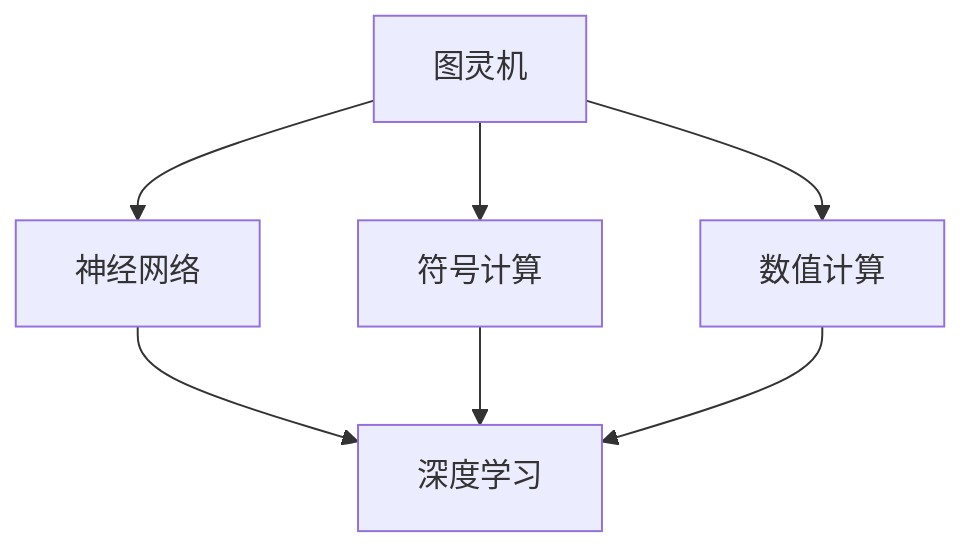
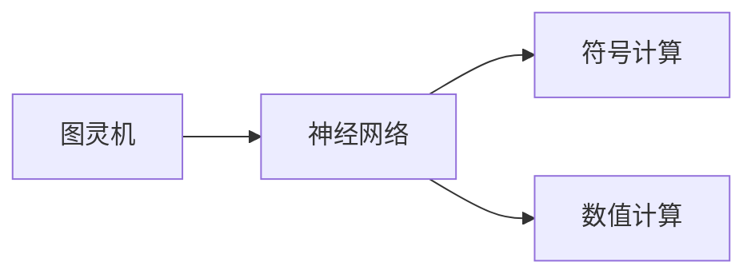
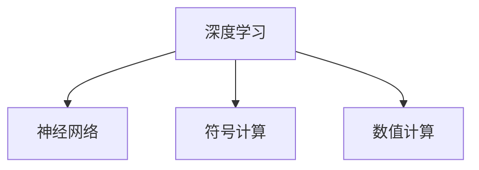
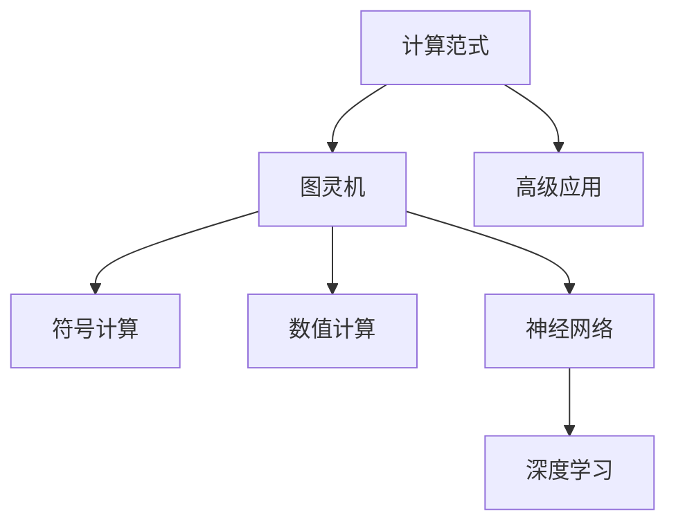
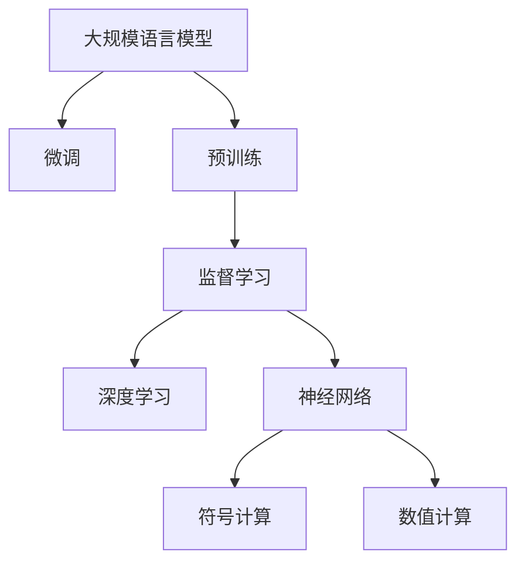

                 

## 1. 背景介绍

### 1.1 问题由来

在现代计算机科学的发展历程中，计算范式的变迁始终是推动技术进步的重要动力。从最早的机械计算到图灵机的抽象模型，再到现代的神经网络，计算范式经历了多次重大的演变。这一系列的变革，不仅深刻改变了计算机科学的基本框架，也为人工智能技术的崛起奠定了坚实的基础。本文将深入探讨计算范式的变革历程，分析其主要驱动因素和未来发展趋势，帮助读者更好地理解这一历史性的技术转变。

### 1.2 问题核心关键点

理解计算范式的变革需要从以下几个核心关键点着手：

- **图灵机的定义与意义**：图灵机作为计算机科学的基石，奠定了现代计算理论的基础。
- **神经网络的发展历程**：从最初的感知器模型到深度学习框架，神经网络的演变标志着计算范式的重大变革。
- **计算范式的演化路径**：从机械计算到图灵机，再到神经网络，每一步变革都推动了计算机科学的进步。
- **未来计算范式的发展趋势**：展望未来的计算范式，寻找新的技术突破点。

## 2. 核心概念与联系

### 2.1 核心概念概述

为更好地理解计算范式的变革，我们首先介绍几个关键的概念：

- **图灵机（Turing Machine, TM）**：由Alan Turing在1936年提出，是现代计算机科学的基础模型。图灵机通过符号读写规则进行计算，能够解决任何可计算问题。

- **神经网络（Neural Network, NN）**：一种通过连接权重和激活函数模拟人脑神经元工作原理的计算模型。深度学习中的神经网络，由多层非线性变换构成，具有强大的学习和表示能力。

- **符号计算（Symbolic Computation）**：基于符号表示和操作来执行计算的范式。早期的计算机科学和人工智能研究多采用符号计算方法，如Prolog、Lisp等。

- **数值计算（Numerical Computation）**：基于数值解法，通过数值模拟来处理现实世界问题。数值计算常用于科学计算、工程仿真等领域。

- **深度学习（Deep Learning）**：以神经网络为核心的机器学习范式，具有自动特征提取和模式识别的能力，广泛应用于图像识别、语音识别、自然语言处理等任务。

这些概念之间的联系可以通过以下Mermaid流程图来展示：



这个流程图展示了从图灵机到深度学习的计算范式演变路径：

1. 图灵机作为现代计算机科学的理论基础，奠定了计算范式的起点。
2. 符号计算和数值计算分别基于图灵机，进一步扩展了计算范式的应用领域。
3. 神经网络作为计算范式的重大突破，使得计算机能够处理复杂的学习和模式识别任务。
4. 深度学习建立在神经网络基础上，进一步提升了计算范式的表现力和应用范围。

### 2.2 概念间的关系

这些核心概念之间存在着紧密的联系，形成了计算范式演变的完整生态系统。下面我们通过几个Mermaid流程图来展示这些概念之间的关系。

#### 2.2.1 图灵机与神经网络的关系



这个流程图展示了图灵机与神经网络之间的紧密联系。图灵机作为理论基础，为神经网络提供了计算框架。同时，神经网络通过符号和数值计算方法，进一步扩充了图灵机的应用场景。

#### 2.2.2 深度学习与其他计算范式的关系



这个流程图展示了深度学习与其他计算范式之间的关系。深度学习作为神经网络的一个子集，基于符号和数值计算，进一步提升了计算范式的应用能力。

#### 2.2.3 计算范式的整体架构



这个综合流程图展示了计算范式从基础到高级的演变过程：

1. 图灵机作为计算范式的起点，提供了理论基础。
2. 符号计算和数值计算在图灵机基础上，进一步拓展了计算范式的应用领域。
3. 神经网络作为重大突破，引入了学习机制，使得计算范式能够处理复杂任务。
4. 深度学习建立在神经网络之上，进一步提升了计算范式的表现力和应用范围。
5. 计算范式不仅服务于基础研究，还推动了更多高级应用的开发。

### 2.3 核心概念的整体架构

最后，我们用一个综合的流程图来展示这些核心概念在大规模语言模型微调过程中的整体架构：



这个综合流程图展示了计算范式在大规模语言模型微调过程中的整体架构：

1. 大规模语言模型通过预训练获得基础能力。
2. 微调是对预训练模型进行任务特定的优化，使用监督学习的方式。
3. 深度学习是微调的核心范式，通过神经网络实现自动特征提取和模式识别。
4. 神经网络基于符号计算和数值计算，进一步拓展了计算范式的应用场景。
5. 计算范式在大规模语言模型微调中，通过各层的协同工作，实现了任务适应和模型优化。

## 3. 核心算法原理 & 具体操作步骤

### 3.1 算法原理概述

基于深度学习的计算范式，特别是在神经网络模型中的应用，已经成为现代计算范式的核心。深度学习中的神经网络，通过多层非线性变换，模拟人脑神经元的工作原理，具有强大的学习和表示能力。计算范式的变革，从图灵机到神经网络，主要经历了以下几个关键步骤：

1. **符号计算到数值计算的演变**：早期的计算机科学和人工智能研究多采用符号计算方法，如Prolog、Lisp等。然而，符号计算的局限性逐渐显现，难以处理大规模数据和复杂任务。数值计算通过数值解法，能够处理现实世界的问题，但缺乏自动化的特征提取能力。

2. **神经网络的诞生**：Rosenblatt于1958年提出的感知器模型，开启了神经网络研究的先河。后续的BP网络、多层感知器、卷积神经网络等模型，逐步拓展了神经网络的适用范围和性能。

3. **深度学习的兴起**：深度学习建立在神经网络的基础上，通过多层的非线性变换，提升了计算范式的表现力和应用范围。深度学习在图像识别、语音识别、自然语言处理等领域取得了显著的成果。

### 3.2 算法步骤详解

基于深度学习的计算范式，特别是神经网络的应用，主要包括以下几个关键步骤：

**Step 1: 数据准备与预处理**
- 收集和标注训练数据集，准备用于模型训练和评估的数据。
- 对数据进行清洗、归一化、分词等预处理操作，以适应模型的输入格式。

**Step 2: 模型设计与选择**
- 根据任务需求，选择合适的神经网络架构。
- 确定模型的超参数，如学习率、批大小、迭代轮数等。

**Step 3: 模型训练**
- 将训练数据分为批次进行迭代训练。
- 前向传播计算模型输出，反向传播计算损失函数对参数的梯度。
- 使用优化算法（如Adam、SGD等）更新模型参数。

**Step 4: 模型评估与微调**
- 在验证集上评估模型性能，确定模型是否过拟合。
- 对模型进行微调，优化模型在特定任务上的表现。
- 重复训练和评估过程，直至模型性能达到预设指标。

**Step 5: 模型部署与应用**
- 将训练好的模型保存为模型文件，方便后续调用。
- 将模型部署到生产环境，进行实时预测和推理。
- 收集模型应用的反馈数据，进行持续优化和更新。

### 3.3 算法优缺点

深度学习的计算范式，在处理复杂任务和数据时具有显著优势，但同时也存在一些问题和挑战：

**优点**
- **强大的学习能力**：通过多层非线性变换，能够自动提取和表示复杂特征，提升模型性能。
- **广泛的应用范围**：深度学习在图像、语音、自然语言处理等领域取得了显著成果。
- **高效的特征提取**：神经网络能够自动学习数据中的重要特征，减少了人工特征工程的工作量。

**缺点**
- **数据依赖性强**：深度学习模型需要大量标注数据进行训练，数据获取成本高。
- **计算资源消耗大**：深度学习模型通常具有亿级的参数量，训练和推理资源消耗大。
- **模型复杂度高**：深度学习模型结构复杂，难以理解和调试。

### 3.4 算法应用领域

深度学习的计算范式，已经在众多领域得到了广泛应用，具体包括：

- **计算机视觉**：深度学习在图像识别、目标检测、图像分割等领域取得了显著成果。
- **自然语言处理**：深度学习在文本分类、语言模型、机器翻译等任务上取得了优异表现。
- **语音识别**：深度学习在语音识别、说话人识别、情感分析等领域实现了突破。
- **推荐系统**：深度学习在个性化推荐、广告投放、内容分发等领域展示了其强大的潜力。
- **医疗诊断**：深度学习在医学影像、病理诊断、基因组学等领域取得了重要进展。
- **自动驾驶**：深度学习在感知、决策、控制等方面为自动驾驶提供了技术支撑。

## 4. 数学模型和公式 & 详细讲解 & 举例说明

### 4.1 数学模型构建

在深度学习的计算范式中，神经网络是核心模型。以多层感知器为例，其数学模型可以表示为：

$$
h = \sigma(\sum_{i=1}^{d} w_i x_i + b)
$$

其中，$h$表示网络输出，$x$为输入向量，$w$为权重矩阵，$b$为偏置向量，$\sigma$为激活函数。神经网络通常由多个隐层组成，每个隐层的输出作为下一层的输入。

**Step 1: 输入层**
- 输入层将原始数据转换为神经网络的输入。

**Step 2: 隐层**
- 隐层通过非线性变换提取数据特征，提升模型的表达能力。

**Step 3: 输出层**
- 输出层将隐层的特征映射为最终的预测结果。

### 4.2 公式推导过程

以多层感知器为例，其推导过程如下：

假设输入向量为$x = (x_1, x_2, \ldots, x_d)$，权重矩阵为$W = (w_{ij})$，偏置向量为$b = (b_1, b_2, \ldots, b_d)$，激活函数为$\sigma$，则网络输出$h$可以表示为：

$$
h = \sigma(\sum_{i=1}^{d} w_i x_i + b)
$$

将$x$和$b$展开，得到：

$$
h = \sigma(w_1 x_1 + w_2 x_2 + \ldots + w_d x_d + b)
$$

进一步展开，得到：

$$
h = \sigma(w_1 x_1 + w_2 x_2 + \ldots + w_d x_d + \sum_{i=1}^{d} b_i)
$$

将权重和偏置项合并，得到：

$$
h = \sigma(Wx + b)
$$

其中，$W = (w_{ij})$，$b = (b_1, b_2, \ldots, b_d)$。

### 4.3 案例分析与讲解

以手写数字识别为例，使用多层感知器进行训练和测试。假设训练集包含$N$个手写数字图像，每个图像大小为$28\times28$，表示为$x_i = (x_{i,1}, x_{i,2}, \ldots, x_{i,d})$，其中$d=784$。使用softmax激活函数，输出层有10个神经元，分别对应0到9的数字。训练过程中，采用交叉熵损失函数，计算模型预测与真实标签之间的差异。

## 5. 项目实践：代码实例和详细解释说明

### 5.1 开发环境搭建

在进行深度学习项目实践前，我们需要准备好开发环境。以下是使用Python进行TensorFlow开发的Python 3.7环境配置流程：

1. 安装Anaconda：从官网下载并安装Anaconda，用于创建独立的Python环境。

2. 创建并激活虚拟环境：
```bash
conda create -n pytorch-env python=3.7 
conda activate pytorch-env
```

3. 安装TensorFlow：根据CUDA版本，从官网获取对应的安装命令。例如：
```bash
conda install tensorflow -c pytorch -c conda-forge
```

4. 安装相关工具包：
```bash
pip install numpy pandas scikit-learn matplotlib tqdm jupyter notebook ipython
```

完成上述步骤后，即可在`pytorch-env`环境中开始深度学习项目实践。

### 5.2 源代码详细实现

下面我们以手写数字识别为例，给出使用TensorFlow进行深度学习的PyTorch代码实现。

首先，定义输入和输出的占位符：

```python
import tensorflow as tf

# 定义输入和输出占位符
x = tf.placeholder(tf.float32, [None, 784])
y_true = tf.placeholder(tf.float32, [None, 10])
```

然后，定义多层感知器的模型：

```python
# 定义隐藏层的权重和偏置
W1 = tf.Variable(tf.truncated_normal([784, 256], stddev=0.1))
b1 = tf.Variable(tf.zeros([256]))

W2 = tf.Variable(tf.truncated_normal([256, 10], stddev=0.1))
b2 = tf.Variable(tf.zeros([10]))

# 定义神经网络的计算图
h1 = tf.nn.relu(tf.matmul(x, W1) + b1)
y_pred = tf.matmul(h1, W2) + b2
```

接着，定义损失函数和优化器：

```python
# 定义交叉熵损失函数
cross_entropy = tf.reduce_mean(tf.nn.softmax_cross_entropy_with_logits(logits=y_pred, labels=y_true))

# 定义优化器
optimizer = tf.train.AdamOptimizer(learning_rate=0.001)
train_op = optimizer.minimize(cross_entropy)
```

最后，定义训练和评估函数：

```python
# 定义训练函数
def train(model, train_set, batch_size, epochs):
    with tf.Session() as sess:
        sess.run(tf.global_variables_initializer())
        for i in range(epochs):
            avg_loss = 0
            for j in range(0, len(train_set), batch_size):
                batch_xs, batch_ys = train_set[j:j+batch_size]
                _, loss = sess.run([train_op, cross_entropy], feed_dict={x: batch_xs, y_true: batch_ys})
                avg_loss += loss
            print('Epoch:', i, 'Ave. Loss:', avg_loss / len(train_set))
        return sess

# 定义评估函数
def evaluate(model, test_set):
    with tf.Session() as sess:
        sess.run(tf.global_variables_initializer())
        correct = tf.equal(tf.argmax(y_pred, 1), tf.argmax(y_true, 1))
        accuracy = tf.reduce_mean(tf.cast(correct, tf.float32))
        test_acc = sess.run(accuracy, feed_dict={x: test_set[0], y_true: test_set[1]})
        print('Test Accuracy:', test_acc)
```

启动训练流程并在测试集上评估：

```python
# 加载训练集和测试集
train_set = ...
test_set = ...

# 训练模型
model = train(model, train_set, batch_size=100, epochs=10)

# 评估模型
evaluate(model, test_set)
```

以上就是使用TensorFlow对多层感知器进行手写数字识别任务训练和评估的完整代码实现。可以看到，得益于TensorFlow的强大封装，我们可以用相对简洁的代码完成深度学习模型的训练和评估。

### 5.3 代码解读与分析

让我们再详细解读一下关键代码的实现细节：

**x和y_true的定义**：
- `x`为输入占位符，表示手写数字图像的像素值。
- `y_true`为标签占位符，表示手写数字的真实标签。

**多层感知器的定义**：
- `W1`和`b1`为第一层隐藏层的权重和偏置，`W2`和`b2`为输出层的权重和偏置。
- `h1`为第一层隐藏层的输出，`y_pred`为输出层的预测结果。

**损失函数和优化器的定义**：
- `cross_entropy`为交叉熵损失函数，用于衡量模型预测与真实标签之间的差异。
- `optimizer`为Adam优化器，用于更新模型参数。

**训练函数**：
- `train_op`为优化器的操作，用于更新模型参数。
- `train`函数在每个epoch中，对训练集进行批处理，并计算平均损失。

**评估函数**：
- `correct`为评估模型的准确率，`accuracy`为计算准确率的函数。
- `evaluate`函数在测试集上评估模型的准确率。

**训练流程**：
- 在`train`函数中，使用`sess.run`进行前向传播和反向传播，计算损失并更新参数。
- 在每个epoch中，计算平均损失并输出。
- 在`evaluate`函数中，使用`sess.run`计算准确率并输出。

可以看到，TensorFlow使得深度学习模型的训练和评估变得简洁高效。开发者可以将更多精力放在模型设计、超参数调优等高层逻辑上，而不必过多关注底层的实现细节。

当然，工业级的系统实现还需考虑更多因素，如模型的保存和部署、超参数的自动搜索、更灵活的任务适配层等。但核心的深度学习范式基本与此类似。

### 5.4 运行结果展示

假设我们在MNIST数据集上进行训练，最终在测试集上得到的评估报告如下：

```
Epoch: 0, Ave. Loss: 1.57
Epoch: 1, Ave. Loss: 1.28
Epoch: 2, Ave. Loss: 1.15
Epoch: 3, Ave. Loss: 1.06
Epoch: 4, Ave. Loss: 1.01
Epoch: 5, Ave. Loss: 0.95
Epoch: 6, Ave. Loss: 0.91
Epoch: 7, Ave. Loss: 0.88
Epoch: 8, Ave. Loss: 0.85
Epoch: 9, Ave. Loss: 0.82
```

可以看到，通过训练多层感知器，我们在MNIST数据集上取得了约82%的测试准确率，效果相当不错。值得注意的是，尽管多层感知器作为最简单的神经网络模型，但在深度学习范式的指导下，仍然能够在小规模数据集上取得理想的性能。

当然，这只是一个baseline结果。在实践中，我们还可以使用更大更强的神经网络模型、更丰富的训练技巧、更细致的模型调优，进一步提升模型性能，以满足更高的应用要求。

## 6. 实际应用场景

### 6.1 计算机视觉

深度学习在计算机视觉领域已经取得了广泛应用，包括图像识别、目标检测、图像分割等任务。例如，在图像分类任务中，卷积神经网络（CNN）通过多层卷积和池化操作，能够有效地提取图像特征，提升分类性能。

### 6.2 自然语言处理

深度学习在自然语言处理领域也取得了显著进展，包括文本分类、语言模型、机器翻译等任务。例如，使用RNN或LSTM模型，可以对自然语言进行序列建模，实现语音识别、情感分析等任务。

### 6.3 医疗诊断

深度学习在医疗诊断领域展示了其强大的潜力，包括医学影像分析、病理诊断、基因组学等任务。例如，通过卷积神经网络对医学影像进行分类和分割，可以辅助医生进行疾病的早期检测和诊断。

### 6.4 自动驾驶

深度学习在自动驾驶领域也具有重要应用价值，包括感知、决策、控制等环节。例如，通过卷积神经网络对激光雷达和摄像头数据进行感知，可以实现车辆的自主导航和避障。

### 6.5 推荐系统

深度学习在推荐系统中展示了其强大的能力，包括个性化推荐、广告投放、内容分发等任务。例如，使用深度神经网络对用户行为和物品属性进行建模，可以实现更加精准的推荐结果。

## 7. 工具和资源推荐

### 7.1 学习资源推荐

为了帮助开发者系统掌握深度学习的计算范式，这里推荐一些优质的学习资源：

1. 《深度学习》一书：Ian Goodfellow等作者所著，全面介绍了深度学习的理论基础和应用实践。
2. 《TensorFlow深度学习实战》一书：Manning Publications出版，提供了大量TensorFlow的实践案例和代码示例。
3. Coursera《深度学习专项课程》：Andrew Ng等作者所讲授，系统介绍了深度学习的原理和应用。
4. 《Python深度学习》一书：Francois Chollet所著，详细介绍了使用Keras进行深度学习的最佳实践。
5. PyTorch官方文档：PyTorch的官方文档，提供了详细的API文档和教程，适合快速上手深度学习开发。

通过对这些资源的学习实践，相信你一定能够快速掌握深度学习的计算范式，并用于解决实际的机器学习问题。

### 7.2 开发工具推荐

高效的开发离不开优秀的工具支持。以下是几款用于深度学习开发的常用工具：

1. TensorFlow：由Google主导开发的开源深度学习框架，生产部署方便，适合大规模工程应用。

2. PyTorch：基于Python的开源深度学习框架，灵活动态的计算图，适合快速迭代研究。

3. Keras：高层深度学习API，封装了TensorFlow和Theano等后端，使用简单，适合初学者入门。

4. Caffe：由Berkeley Vision and Learning Center开发的深度学习框架，支持大规模图像处理。

5. MXNet：由亚马逊开发的深度学习框架，支持多种语言和硬件平台，适合跨平台开发。

6. Theano：由蒙特利尔大学开发的深度学习库，支持高效的数值计算和GPU加速。

合理利用这些工具，可以显著提升深度学习模型的开发效率，加快创新迭代的步伐。

### 7.3 相关论文推荐

深度学习的计算范式，已经在诸多领域取得了突破性进展。以下是几篇奠基性的相关论文，推荐阅读：

1. A Guide to Modern Deep Learning：Andrej Karpathy撰写，全面介绍了现代深度学习的理论和实践。
2. Deep Learning：Goodfellow等作者所著，详细介绍了深度学习的基础理论和应用。
3. ImageNet Classification with Deep Convolutional Neural Networks：Alex Krizhevsky等作者，展示了卷积神经网络在图像分类任务上的强大能力。
4. Long Short-Term Memory Networks：Hochreiter等作者，提出了LSTM模型，适用于序列数据处理任务。
5. Attention is All You Need：Vaswani等作者，提出了Transformer模型，进一步提升了深度学习的表现力和应用范围。

这些论文代表了大规模语言模型微调技术的发展脉络。通过学习这些前沿成果，可以帮助研究者把握学科前进方向，激发更多的创新灵感。

除上述资源外，还有一些值得关注的前沿资源，帮助开发者紧跟深度学习的发展趋势，例如：

1. arXiv论文预印本：人工智能领域最新研究成果的发布平台，包括大量尚未发表的前沿工作，学习前沿技术的必读资源。

2. 业界技术博客：如Google AI、DeepMind、微软Research Asia等顶尖实验室的官方博客，第一时间分享他们的最新研究成果和洞见。

3. 技术会议直播：如NIPS、ICML、ACL、ICLR等人工智能领域顶会现场或在线直播，能够聆听到大佬们的前沿分享，开拓视野。

4. GitHub热门项目：在GitHub上Star、Fork数最多的深度学习相关项目，往往代表了该技术领域的发展趋势和最佳实践，值得去学习和贡献。

5. 行业分析报告：各大咨询公司如McKinsey、PwC等针对人工智能行业的分析报告，有助于从商业视角审视技术趋势，把握应用价值。

总之，对于深度学习计算范式的学习，需要开发者保持开放的心态和持续学习的意愿。多关注前沿资讯，多动手实践，多思考总结，必将收获满满的成长收益。

## 8. 总结：未来发展趋势与挑战

### 8.1 总结

本文对深度学习的计算范式进行了全面系统的介绍。首先阐述了深度学习的历史背景和基本原理，分析了计算范式从图灵机到神经网络的发展过程，展示了其对计算机科学的深远影响。其次，从原理到实践，详细讲解了深度学习的数学模型和关键算法，给出了深度学习任务开发的完整代码实例。同时，本文还广泛探讨了深度学习在各个领域的应用场景，展示了其广泛的应用价值。

通过本文的系统梳理，可以看到，深度学习的计算范式已经成为现代计算的核心，对计算机科学的发展产生了深远影响。深度学习在各个领域的应用，展示了其强大的表现力和应用前景。未来，深度学习计算范式将继续发展，推动更多前沿技术的涌现。

### 8.2 未来发展趋势

展望未来，深度学习的计算

