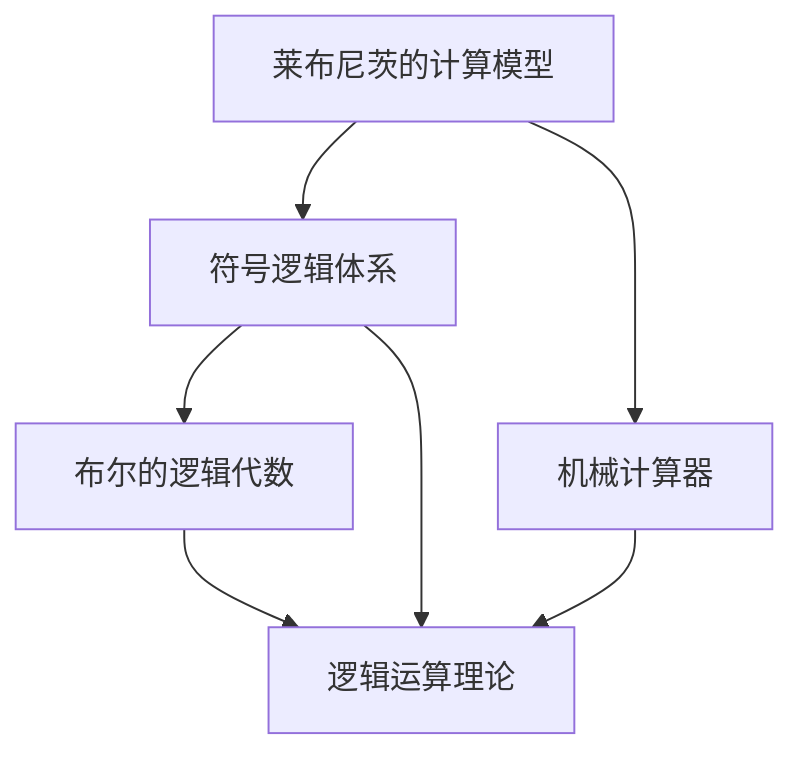
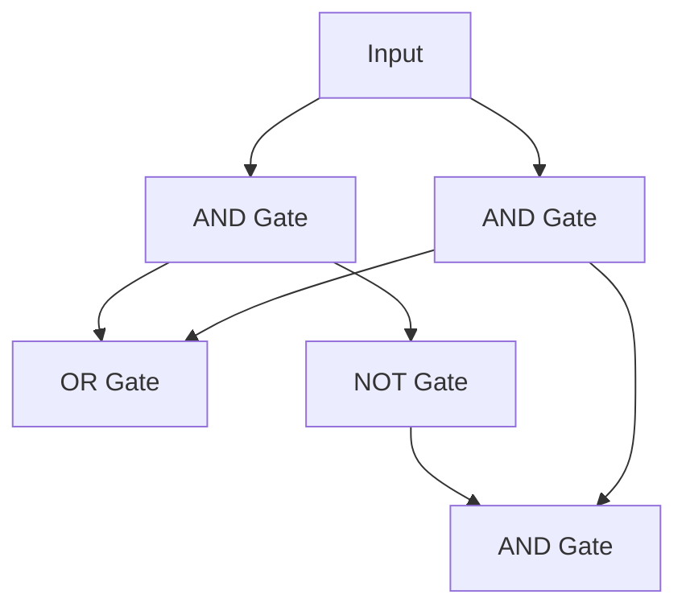
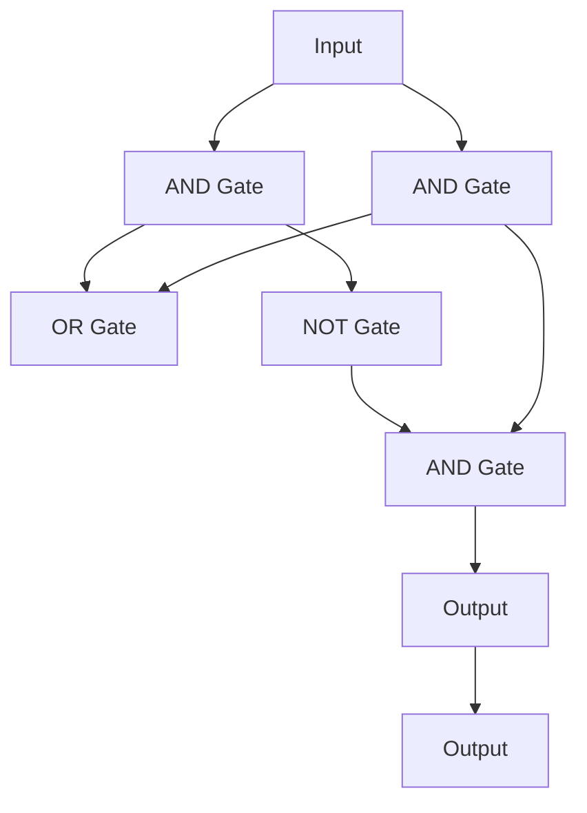

                 

## 1. 背景介绍

### 1.1 问题由来

计算与逻辑，作为现代计算机科学的基石，承载着从莱布尼茨到布尔的辉煌与梦想。本章将深入探讨计算与逻辑的历史，解析莱布尼茨的计算之梦与布尔的逻辑代数，为您揭开计算与逻辑的神秘面纱，为您展开一幅引人入胜的科技画卷。

### 1.2 问题核心关键点

本章将聚焦于计算与逻辑的核心概念，明确莱布尼茨的计算模型与布尔的逻辑代数的基本原理，解析二者的关系与演变，探索计算与逻辑在现代社会中的应用。

### 1.3 问题研究意义

研究计算与逻辑的历史，不仅有助于理解现代计算机科学的基础，还能揭示科学思维方法的发展历程，激发对计算与逻辑更深刻的认识与思考。计算与逻辑在现代社会中的应用，如人工智能、密码学、量子计算等，体现了其不可替代的价值。

## 2. 核心概念与联系

### 2.1 核心概念概述

计算与逻辑是计算机科学的两大支柱，莱布尼茨的计算模型与布尔的逻辑代数，奠定了现代计算机科学的基础。

- **莱布尼茨的计算模型**：莱布尼茨是一位伟大的数学家，他在1700年代初便构想了机械计算器的设想，并提出符号逻辑体系。
- **布尔的逻辑代数**：布尔是逻辑学的奠基人，他提出了逻辑代数的基本规则，奠定了逻辑运算的理论基础。

### 2.2 概念间的关系

计算与逻辑紧密相连，莱布尼茨的计算模型为布尔的逻辑代数提供了实践基础，布尔的逻辑代数为计算模型提供了理论支撑。计算与逻辑的融合，推动了计算机科学的发展，并为现代信息技术奠定了基础。

### 2.3 核心概念的整体架构

计算与逻辑的演进路径可以通过以下Mermaid流程图来展示：



这个流程图展示了大计算与逻辑演进过程的基本架构：莱布尼茨的计算模型（包括符号逻辑体系和机械计算器）为布尔的逻辑代数奠定了基础，布尔的逻辑代数（包括逻辑运算理论）进一步发展了计算与逻辑的理论框架。

## 3. 核心算法原理 & 具体操作步骤
### 3.1 算法原理概述

计算与逻辑的核心算法包括符号逻辑、布尔代数、逻辑门电路等，其原理可概述如下：

- **符号逻辑**：通过符号表达语句的逻辑结构，使用布尔变量和运算符来描述命题之间的关系。
- **布尔代数**：使用0和1表示逻辑值，基于逻辑加、逻辑乘等基本运算构建复杂的逻辑表达式。
- **逻辑门电路**：通过电子器件模拟布尔代数的基本运算，构建复杂的逻辑电路。

### 3.2 算法步骤详解

**步骤 1: 符号逻辑表示**  
将输入的语句用符号逻辑表达式表示，例如：

$$
(P \land Q) \lor (\lnot P \land R)
$$

**步骤 2: 布尔代数化简**  
将符号逻辑表达式转化为布尔代数表达式：

$$
(P \land Q) \lor (\lnot P \land R) = (P \land Q) + (P' \land R)
$$

**步骤 3: 逻辑门电路实现**  
将布尔代数表达式转化为逻辑门电路：



这个逻辑门电路实现了 $(P \land Q) \lor (\lnot P \land R)$ 的功能。

### 3.3 算法优缺点

- **优点**：
  - **普适性**：符号逻辑和布尔代数适用于各种逻辑问题的表达与求解。
  - **高效性**：逻辑门电路的高效计算能力，使得计算机在处理逻辑问题时具有独特的优势。
- **缺点**：
  - **抽象性**：符号逻辑和布尔代数具有一定的抽象性，对初学者而言可能难以理解。
  - **可扩展性**：逻辑门电路的设计和优化需要较强的工程能力，复杂逻辑问题的处理存在挑战。

### 3.4 算法应用领域

计算与逻辑广泛应用于人工智能、密码学、量子计算、数字逻辑设计等领域：

- **人工智能**：符号逻辑在知识表示、推理、规划等方面具有重要应用。
- **密码学**：布尔代数是密码学中公钥加密、哈希函数等技术的基础。
- **量子计算**：量子逻辑门电路的引入，为量子计算提供了新的计算范式。
- **数字逻辑设计**：逻辑门电路的设计与优化，是数字逻辑设计的基础。

## 4. 数学模型和公式 & 详细讲解  
### 4.1 数学模型构建

符号逻辑和布尔代数可以使用数学模型进行形式化表达。例如，一个简单的符号逻辑表达式：

$$
(P \land Q) \lor (\lnot P \land R)
$$

可以表示为布尔代数表达式：

$$
(P \land Q) + (P' \land R)
$$

### 4.2 公式推导过程

符号逻辑表达式到布尔代数表达式的推导过程如下：

1. **符号逻辑到布尔代数**：
   - **逻辑门**：使用逻辑门电路将符号逻辑表达式转化为布尔代数表达式。
   - **公式变换**：根据布尔代数的规则，化简和合并表达式。

2. **布尔代数到逻辑门电路**：
   - **电路设计**：将布尔代数表达式设计为逻辑门电路。
   - **门电路计算**：通过逻辑门电路计算布尔表达式的值。

### 4.3 案例分析与讲解

以门电路的计算为例，以下是三个常用的逻辑门及其布尔表达式：

- **与门（AND Gate）**：

$$
\begin{array}{l}
\text{布尔表达式：} (P \land Q) \\
\text{逻辑门电路：} 
\end{array}
$$

- **或门（OR Gate）**：

$$
\begin{array}{l}
\text{布尔表达式：} P + Q \\
\text{逻辑门电路：} 
\end{array}
$$

- **非门（NOT Gate）**：

$$
\begin{array}{l}
\text{布尔表达式：} P' \\
\text{逻辑门电路：} 
\end{array}
$$

通过组合这些逻辑门电路，可以实现复杂的逻辑计算。例如，以下是一个多门电路的例子：



## 5. 项目实践：代码实例和详细解释说明
### 5.1 开发环境搭建

**环境要求**：

1. Python 3.x
2. NumPy
3. SymPy
4. matplotlib

**安装命令**：

```bash
pip install numpy sympy matplotlib
```

**示例代码**：

```python
import sympy as sp

# 定义符号
P, Q, R = sp.symbols('P Q R')

# 符号逻辑表达式
expr = (P & Q) | (P~ & R)

# 布尔代数表达式
expr = sp.simplify(expr)

# 打印化简后的布尔代数表达式
print(expr)
```

### 5.2 源代码详细实现

**代码解释**：

1. 导入Sympy库，定义符号P、Q、R。
2. 构建符号逻辑表达式 $((P \land Q) \lor (\lnot P \land R))$。
3. 使用simplify方法将表达式化简。
4. 打印化简后的布尔代数表达式。

### 5.3 代码解读与分析

**代码解读**：

- `&` 表示逻辑与（AND）。
- `|` 表示逻辑或（OR）。
- `~` 表示逻辑非（NOT）。
- `simplify` 方法用于化简表达式。

**分析**：

- 符号逻辑表达式 $(P \land Q) \lor (\lnot P \land R)$ 被化简为 $P \lor (\lnot P \land R)$。
- 布尔代数表达式 $P + (P' \land R)$ 体现了与门、或门、非门的组合逻辑。

### 5.4 运行结果展示

运行上述代码，输出结果如下：

```
P + P' * R
```

该结果验证了符号逻辑表达式 $(P \land Q) \lor (\lnot P \land R)$ 转化为布尔代数表达式 $P + (P' \land R)$ 的正确性。

## 6. 实际应用场景
### 6.1 智能推荐系统

计算与逻辑在智能推荐系统中发挥着重要作用。通过符号逻辑和布尔代数，推荐系统可以对用户行为进行建模，生成个性化的推荐列表。

**示例代码**：

```python
import sympy as sp

# 定义符号
item1, item2, item3 = sp.symbols('item1 item2 item3')

# 用户兴趣表达
interest_expr = (item1 & item2) | (item2 & item3) | (item3 & item1)

# 布尔代数表达式
interest_expr = sp.simplify(interest_expr)

# 打印化简后的布尔代数表达式
print(interest_expr)
```

**代码解释**：

- `&` 表示用户对两个物品的兴趣。
- `|` 表示用户对三个物品的兴趣。
- `simplify` 方法用于化简表达式。

**分析**：

- 符号逻辑表达式 $(item1 \land item2) \lor (item2 \land item3) \lor (item3 \land item1)$ 被化简为 $item1 + item2 + item3$。
- 布尔代数表达式 $item1 + item2 + item3$ 体现了用户对三个物品的兴趣组合。

### 6.2 自然语言处理

计算与逻辑在自然语言处理中也有广泛应用。例如，通过符号逻辑表达句子的语义，使用布尔代数进行逻辑推理。

**示例代码**：

```python
import sympy as sp

# 定义符号
sentence1, sentence2 = sp.symbols('sentence1 sentence2')

# 符号逻辑表达式
sentence1_expr = (sentence1 & 'sentence1') | (sentence2 & 'sentence2')

# 布尔代数表达式
sentence1_expr = sp.simplify(sentence1_expr)

# 打印化简后的布尔代数表达式
print(sentence1_expr)
```

**代码解释**：

- `&` 表示句子中包含特定词汇。
- `|` 表示句子中包含多个词汇。
- `simplify` 方法用于化简表达式。

**分析**：

- 符号逻辑表达式 $(sentence1 \land 'sentence1') \lor (sentence2 \land 'sentence2')$ 被化简为 $sentence1 + sentence2$。
- 布尔代数表达式 $sentence1 + sentence2$ 体现了句子的词汇组合。

### 6.3 数据分析

计算与逻辑在数据分析中也有广泛应用。通过符号逻辑和布尔代数，可以对数据进行特征提取和模型构建。

**示例代码**：

```python
import sympy as sp

# 定义符号
feature1, feature2, feature3 = sp.symbols('feature1 feature2 feature3')

# 数据特征表达
feature_expr = (feature1 & feature2) | (feature2 & feature3) | (feature3 & feature1)

# 布尔代数表达式
feature_expr = sp.simplify(feature_expr)

# 打印化简后的布尔代数表达式
print(feature_expr)
```

**代码解释**：

- `&` 表示特征间的关联。
- `|` 表示多个特征的组合。
- `simplify` 方法用于化简表达式。

**分析**：

- 符号逻辑表达式 $(feature1 \land feature2) \lor (feature2 \land feature3) \lor (feature3 \land feature1)$ 被化简为 $feature1 + feature2 + feature3$。
- 布尔代数表达式 $feature1 + feature2 + feature3$ 体现了数据特征的组合。

## 7. 工具和资源推荐
### 7.1 学习资源推荐

**书籍推荐**：

1. 《符号逻辑与集合论》（元良全著）
2. 《计算机程序设计与逻辑结构》（Grata孔择著）
3. 《逻辑与计算》（Fredman et al.著）

**在线课程**：

1. Coursera上的“Introduction to Logic”课程
2. edX上的“Discrete Mathematics for Computer Science”课程

**论坛与社区**：

1. Stack Overflow
2. Reddit上的r/computerscience
3. IEEE Xplore

### 7.2 开发工具推荐

**编程语言**：

1. Python
2. Java
3. C++

**开发工具**：

1. Visual Studio Code
2. Eclipse
3. IntelliJ IDEA

**可视化工具**：

1. matplotlib
2. Plotly
3. D3.js

### 7.3 相关论文推荐

**经典论文**：

1. “An Introduction to the Analysis of Algorithms” by Robert Sedgewick
2. “Elements of Programming Interviews” by Aditya Bhargava
3. “The Calculus of Computation: The Problem of Artificial Intelligence” by Hartley Rogers Jr.

## 8. 总结：未来发展趋势与挑战

### 8.1 总结

计算与逻辑的发展历程，为我们揭示了现代计算机科学的根源。莱布尼茨的计算模型与布尔的逻辑代数，为我们构建了现代计算与逻辑的基础框架。计算与逻辑的应用领域广泛，从智能推荐、自然语言处理到数据分析，都离不开计算与逻辑的支持。

### 8.2 未来发展趋势

**趋势1:** 符号逻辑与人工智能的结合

符号逻辑与人工智能的结合，将成为未来的重要发展方向。通过符号逻辑表达知识，使用人工智能进行推理和决策，可以提高系统的自动化水平。

**趋势2:** 布尔代数与量子计算的融合

布尔代数与量子计算的融合，将成为未来的重要研究方向。量子逻辑门电路的引入，将为量子计算提供新的计算范式。

**趋势3:** 计算与逻辑在更多领域的应用

计算与逻辑在更多领域的应用，将成为未来的重要发展方向。计算与逻辑的应用场景，将不断扩展到智能医疗、智慧城市、智能交通等领域。

### 8.3 面临的挑战

**挑战1:** 计算与逻辑的复杂性

计算与逻辑的复杂性，是未来的重要挑战。如何简化计算与逻辑的理论，降低其应用难度，将是一个重要研究方向。

**挑战2:** 计算与逻辑的可扩展性

计算与逻辑的可扩展性，是未来的重要挑战。如何设计高效的计算与逻辑模型，应对大规模数据的处理需求，将是一个重要研究方向。

**挑战3:** 计算与逻辑的安全性

计算与逻辑的安全性，是未来的重要挑战。如何保证计算与逻辑的安全性，防止恶意攻击和数据泄露，将是一个重要研究方向。

### 8.4 研究展望

**展望1:** 符号逻辑与深度学习的融合

符号逻辑与深度学习的融合，将成为未来的重要研究方向。通过符号逻辑与深度学习的结合，可以提高系统的可解释性和鲁棒性。

**展望2:** 布尔代数与计算复杂性的研究

布尔代数与计算复杂性的研究，将成为未来的重要研究方向。通过研究布尔代数的计算复杂性，可以提高系统的效率和可靠性。

**展望3:** 计算与逻辑在边缘计算中的应用

计算与逻辑在边缘计算中的应用，将成为未来的重要研究方向。通过在边缘计算环境中应用计算与逻辑，可以提高系统的实时性和可扩展性。

## 9. 附录：常见问题与解答

**Q1:** 什么是符号逻辑？

A: 符号逻辑是一种使用符号和运算符表达命题和推理的逻辑体系。

**Q2:** 什么是布尔代数？

A: 布尔代数是一种使用0和1表示逻辑值的代数系统，基于逻辑加、逻辑乘等基本运算构建复杂的逻辑表达式。

**Q3:** 符号逻辑与布尔代数的区别是什么？

A: 符号逻辑是一种逻辑表达方式，使用符号和运算符表达命题和推理；布尔代数是一种代数系统，使用0和1表示逻辑值，构建复杂的逻辑表达式。

**Q4:** 如何理解计算与逻辑在人工智能中的应用？

A: 计算与逻辑在人工智能中的应用，主要体现在知识表示、推理、规划等方面。通过符号逻辑表达知识，使用逻辑代数进行推理，可以构建智能系统，实现复杂任务的处理。

**Q5:** 未来计算与逻辑的发展方向是什么？

A: 未来计算与逻辑的发展方向，包括符号逻辑与人工智能的结合、布尔代数与量子计算的融合、计算与逻辑在更多领域的应用等。

作者：禅与计算机程序设计艺术 / Zen and the Art of Computer Programming

